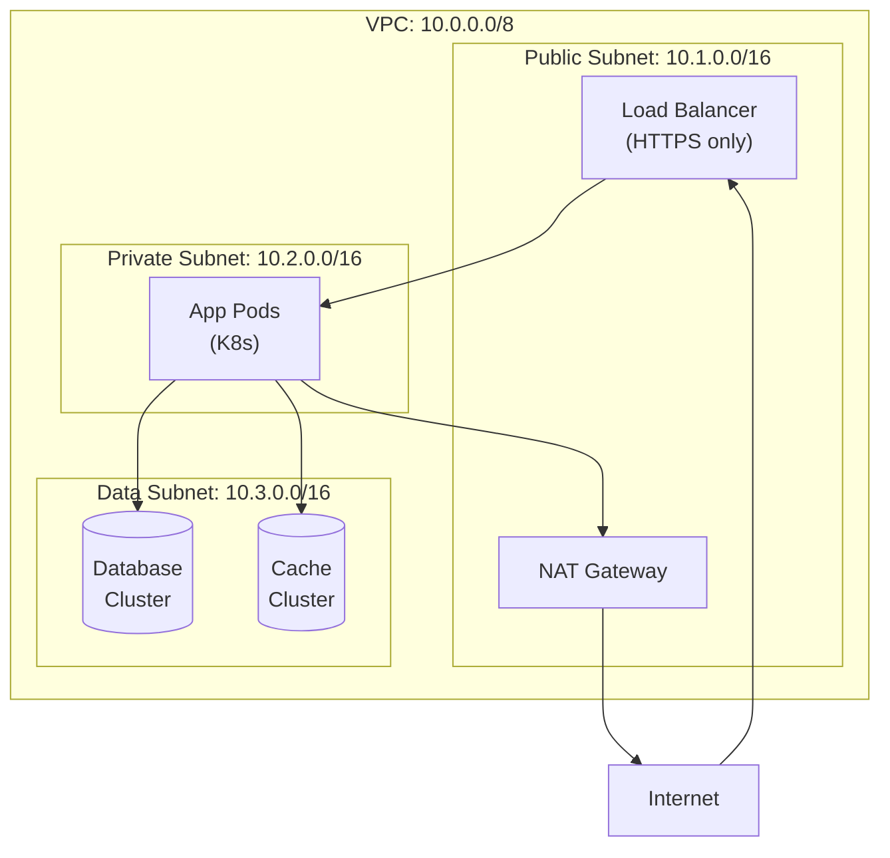
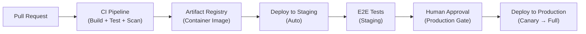
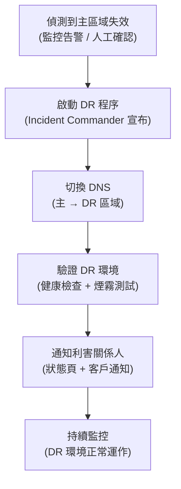

# 基礎設施架構決策 - [專案名稱]

> **Tier**: 1-decisions — infrastructure platform selection and design decisions

---

## 1. 基礎設施總覽

| 欄位 | 值 |
|---|---|
| 雲端供應商 | `<AWS / GCP / Azure / 多雲 / 混合雲>` |
| 主要區域 | `<e.g. ap-northeast-1 (Tokyo)>` |
| 次要區域（DR） | `<e.g. ap-southeast-1 (Singapore)>` |
| 環境數量 | Development / Staging / Production（+ Preview，如適用） |
| 帳號 / 專案隔離 | 每環境獨立帳號 / 單帳號多 namespace / `<選一並說明原因>` |
| 合規要求 | `<e.g. SOC2 / GDPR / PCI-DSS / 無>` |

### 1.1 環境拓撲

| 環境 | 用途 | 部署來源 | 資料類型 |
|---|---|---|---|
| Development | 本地開發 + CI 驗證 | PR 合入 `dev` 分支自動部署 | 假資料 / 合成資料 |
| Staging | 整合測試 + UAT | 合入 `main` 後自動部署 | 匿名化正式資料子集 |
| Production | 正式服務 | 手動審批 + 自動化 | 正式資料 |

---

## 2. 運算（Compute）

### 2.1 容器編排選型

| 選項 | 選擇 | 理由 |
|---|---|---|
| Kubernetes (GKE/EKS/AKS) | `<是/否>` | |
| Serverless (Cloud Run/Lambda/Fargate) | `<是/否>` | |
| 混合（K8s + Serverless） | `<是/否>` | |

> **採用決策**：`<說明最終選擇與核心理由，例如：選用 GKE Autopilot，原因是團隊 K8s 熟練度高且需要精細的資源控制；同時對無狀態工作使用 Cloud Run 降低運維成本。>`

### 2.2 擴展策略

| 服務類型 | 擴展方式 | 擴展觸發指標 | 最小副本 | 最大副本 |
|---|---|---|---|---|
| API 服務 | HPA（水平自動擴展） | CPU > 70% 或 RPS / pod > 500 | 2 | 20 |
| 批次工作 | KEDA（事件驅動） | Queue 深度 | 0 | 10 |
| 有狀態服務 | VPA（垂直，手動確認） | 記憶體使用率 > 80% | N/A | N/A |

### 2.3 節點配置

```yaml
# 範例：GKE Node Pool 配置
nodePools:
  - name: general-purpose
    machineType: e2-standard-4  # 4 vCPU, 16GB RAM
    minCount: 2
    maxCount: 10
    diskSizeGb: 100
  - name: memory-optimized      # 用於 ML 推論 / 資料處理
    machineType: n2-highmem-8   # 8 vCPU, 64GB RAM
    minCount: 0
    maxCount: 5
    taints:
      - key: workload
        value: memory-intensive
        effect: NoSchedule
```

---

## 3. 網路（Networking）

### 3.1 VPC 設計



| 網段 | CIDR | 用途 |
|---|---|---|
| VPC | `10.0.0.0/8` | 整體網路空間 |
| Public Subnet | `10.1.0.0/16` | Load Balancer, NAT Gateway |
| Private Subnet | `10.2.0.0/16` | 應用服務 (K8s Pods) |
| Data Subnet | `10.3.0.0/16` | 資料庫, 快取（嚴格入站限制） |

### 3.2 Ingress / Egress

| 方向 | 方案 | 說明 |
|---|---|---|
| 外部流量 Ingress | `<e.g. GCP Cloud Load Balancing + Nginx Ingress>` | HTTPS only；TLS termination at LB |
| 服務間流量 | `<e.g. Kubernetes Service + gRPC>` | mTLS（Istio）/ 無加密（VPC 內） |
| 外部 Egress | NAT Gateway 統一出口 | 固定 IP 白名單供 vendor allowlist |

### 3.3 Service Mesh

| 選項 | 採用？ | 理由 |
|---|---|---|
| Istio | `<是/否>` | mTLS、流量管理、可觀測性 |
| Linkerd | `<是/否>` | 輕量替代 |
| 無 Service Mesh | `<是/否>` | 服務數量少、不值得引入複雜度 |

### 3.4 DNS 策略

| 場景 | 工具 | 規則 |
|---|---|---|
| 外部 DNS | `<e.g. Cloud DNS / Route53>` | `api.example.com` → LB |
| 內部 DNS | Kubernetes CoreDNS | `<svc>.<ns>.svc.cluster.local` |
| 跨環境 | 環境前綴 | `api.staging.example.com` |

---

## 4. 儲存（Storage）

### 4.1 資料庫選型

| 用途 | 資料庫 | 版本 | 部署方式 | 選擇理由 |
|---|---|---|---|---|
| 主要 OLTP | `<PostgreSQL / MySQL>` | `<e.g. 15>` | 雲端託管（Cloud SQL/RDS） | |
| 分析 / OLAP | `<BigQuery / Redshift / Snowflake>` | 託管 | Serverless | |
| 文件存儲 | `<MongoDB / Firestore>` | `<版本>` | `<部署方式>` | |

### 4.2 快取層

| 快取用途 | 工具 | 配置 | TTL 策略 |
|---|---|---|---|
| Session / Token | Redis | 1 主 + 1 副本 | 24 小時 |
| API 回應快取 | Redis | 同上 | 按端點設定（5min ~ 1h） |
| CDN 靜態資源 | `<CloudFront / Cloudflare>` | 全球 PoP | 30 天（+ cache busting） |

### 4.3 物件儲存

| 用途 | Bucket / Container | 存取控制 | 保留策略 |
|---|---|---|---|
| 使用者上傳 | `<gs://project-uploads>` | Private + Signed URL | 3 年（依合規） |
| 應用 Artifacts | `<gs://project-artifacts>` | CI/CD SA only | 90 天 |
| 備份 | `<gs://project-backups>` | 唯寫 + 管理員唯讀 | 1 年 |
| ML 模型 | `<gs://project-ml-models>` | ML SA + 唯讀 | 永久保留 |

### 4.4 備份策略

| 資源 | 備份頻率 | 保留期 | 還原 RTO 目標 | 測試頻率 |
|---|---|---|---|---|
| 主資料庫 | 連續（PITR）+ 每日快照 | 30 天 | < 1 小時 | 每月 |
| 使用者上傳物件 | 版本控制 + 跨區域複製 | 永久 | < 30 分鐘 | 每季 |
| K8s 設定 (etcd) | 每小時 | 7 天 | < 2 小時 | 每季 |

---

## 5. CI/CD 管線架構

### 5.1 整體流程



### 5.2 建置系統

| 工具 | 用途 |
|---|---|
| `<GitHub Actions / Cloud Build / GitLab CI>` | CI 執行環境 |
| `<Docker / Buildpack>` | 容器建置 |
| `<Artifact Registry / ECR / GCR>` | Image 倉庫 |

### 5.3 Promotion 流程

| 階段 | 觸發條件 | 品質門檻 | 回滾機制 |
|---|---|---|---|
| Dev | PR 合入 `dev` | 單元測試通過 | 自動（回復 commit） |
| Staging | 合入 `main` | 整合 + E2E 測試通過；安全掃描通過 | 自動（前版本 image） |
| Production | 手動審批（經理 or SRE） | Staging E2E + 效能基準 | Canary 回滾 < 30s |

---

## 6. IaC 策略（Infrastructure as Code）

### 6.1 工具選型

| 選項 | 採用？ | 理由 |
|---|---|---|
| Terraform | `<是/否>` | 成熟生態；多雲支援 |
| Pulumi | `<是/否>` | 使用正式程式語言；更強的測試能力 |
| AWS CDK | `<是/否>` | AWS 原生；TypeScript/Python 支援 |
| Google Cloud Deployment Manager | `<是/否>` | GCP 原生 |

> **採用決策**：`<說明選擇與理由>`

### 6.2 模組邊界

```
infra/
├── modules/
│   ├── network/       # VPC, subnet, firewall rules
│   ├── compute/       # GKE cluster, node pools
│   ├── database/      # Cloud SQL, Redis
│   ├── storage/       # GCS buckets, IAM
│   ├── monitoring/    # Prometheus, alerting
│   └── cicd/          # Artifact registry, Cloud Build
├── environments/
│   ├── dev/
│   ├── staging/
│   └── production/
└── shared/            # DNS, IAM 基礎角色
```

### 6.3 State 管理

| 欄位 | 設定 |
|---|---|
| State 後端 | `<e.g. GCS bucket: gs://project-tf-state>` |
| State 鎖定 | `<e.g. Cloud Storage locking / DynamoDB>` |
| State 加密 | 靜態加密（雲端 KMS 金鑰） |
| 工作區隔離 | 每環境獨立 state 檔案 |

### 6.4 漂移偵測

| 機制 | 頻率 | 失敗行動 |
|---|---|---|
| `terraform plan` 差異檢查 | 每日排程 | Slack 告警；開 ticket |
| 雲端 Config Audit Log | 即時 | 任何手動更改觸發告警 |

---

## 7. 機密管理（Secrets Management）

| 欄位 | 設定 |
|---|---|
| 工具 | `<e.g. GCP Secret Manager / AWS Secrets Manager / HashiCorp Vault>` |
| 輪換策略 | 資料庫密碼：每 90 天；API Key：每 180 天；TLS 憑證：每年（Let's Encrypt 自動） |
| 存取模式 | 服務帳號 + Workload Identity（K8s pod 直接取得，無中間層） |
| 稽核日誌 | 所有 secret 讀取寫入記錄至 Cloud Audit Logs |
| 禁止事項 | 嚴禁在 git、環境變數明文、log 中出現任何 secret |

---

## 8. 可觀測性堆疊（Observability Stack）

| 類型 | 工具 | 保留策略 | 月成本估算 |
|---|---|---|---|
| 指標 (Metrics) | `<Prometheus + Grafana / Cloud Monitoring / Datadog>` | 熱資料 30 天；冷存 1 年 | `<$XXX>` |
| 日誌 (Logs) | `<Cloud Logging / Loki / ELK>` | 生產 90 天；稽核 1 年 | `<$XXX>` |
| 追蹤 (Traces) | `<Cloud Trace / Jaeger / Tempo>` | 7 天（取樣率 1-10%） | `<$XXX>` |
| 前端監控 | `<Sentry / Datadog RUM>` | 30 天 | `<$XXX>` |

> **工具整合原則**：優先選擇支援 OpenTelemetry 的工具，避免廠商鎖定。

---

## 9. 成本控制

| 機制 | 設定 | 預算上限 |
|---|---|---|
| 預算告警 | 80% / 90% / 100% 觸發 Slack + Email | `$<X,XXX> / 月` |
| 預留容量 | 資料庫、穩定 K8s node pool 採 1 年承諾使用 | 預計節省 30-40% |
| Spot / Preemptible | 批次工作、CI Runner、非關鍵工作負載 | 最多 60% 節點使用 Spot |
| 費用分配 | 以 label (`team`, `service`, `env`) 追蹤費用 | — |
| 未使用資源掃描 | 每週自動掃描並告警 | — |

---

## 10. 災難復原（Disaster Recovery）

### 10.1 RTO / RPO 目標

| 服務層級 | RTO | RPO |
|---|---|---|
| Tier 1（核心 API） | < 1 小時 | < 5 分鐘 |
| Tier 2（分析服務） | < 4 小時 | < 1 小時 |
| Tier 3（非關鍵） | < 24 小時 | < 24 小時 |

### 10.2 失效轉移程序



### 10.3 備份驗證

| 資源 | 驗證方式 | 頻率 | 執行者 |
|---|---|---|---|
| 資料庫備份 | 從備份還原至 DR 環境，執行查詢驗證 | 每月 | SRE 自動化 |
| 物件儲存 | 跨區域複製一致性校驗 | 每週 | 自動化 |
| K8s 叢集重建 | 從 IaC 重建 staging 環境，驗證完整性 | 每季 | SRE 演練 |

---

## 重新評估觸發條件

- 雲端供應商釋出影響本架構的重大服務變更
- 月成本超出預算 50% 連續 2 個月
- 任何 Tier 1 服務的 RTO 未達目標（DR 演練或實際事故）
- 合規要求（如 GDPR / PCI-DSS）發生重大變更
- 引入新的有狀態服務或跨越現有模組邊界的服務

> 觸發後應寫新 ADR supersede 本檔，不直接 in-place 改寫。

---

## See also

- `1-decisions/ARCH-0000-architecture-overview.template.md` — 系統整體架構
- `2-contracts/SLO-0000-slo-spec.template.md` — RTO/RPO 對應的 SLO 規格
- `3-process/PROC-0005-deployment-runbook.template.md` — 部署與運維流程
- `3-process/PROC-0009-incident-response.template.md` — DR 啟動即事故回應
- `4-exploration/CIA-0000-change-impact-analysis.template.md` — 基礎設施變更需 CIA
- `.claude/rules/change-governance.md` — 基礎設施變更觸發 "architecture boundary" CIA gate
