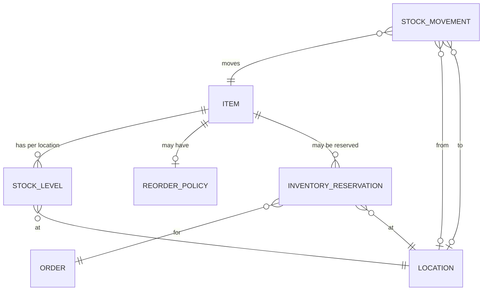

> **⚠️ WORKED EXAMPLE — DELETE BEFORE USE**
> Concrete names below (Customer, Order, Inventory, PurchaseOrder, Stripe, etc.) come
> from a worked e-commerce/ERP example to give AI strong few-shot context. **Replace
> them with your domain's terms** when filling for your project. The structure (sections,
> tables, frontmatter) is what to keep; the example content is what to swap or delete.
> If your domain doesn't fit (CLI / library / ML / embedded), the example is still
> useful as a structural reference — copy the shape, change the words.
# DM-NNNN: `<Bounded Context Name>` — Domain Model

> **Tier**: 1-decisions — DDD-style domain model decision
>
> **Why tier-1 (decision), not tier-5 (view)**: a domain model is an **architectural commitment**, not a snapshot of code. The model dictates the schema, the API, the events, the test cases. Putting it in `5-views` would imply "AI can regenerate from code" — but you can't reverse-engineer business meaning from a `CREATE TABLE`.

---

## 1. Bounded Context

| Field | Value |
|---|---|
| Name | Inventory Management |
| Owning module | `MOD-NNNN` (`Inventory`) |
| Linguistic scope | Terms in this context refer to physical-and-virtual stock. **NOT** to be conflated with Catalog (item metadata) or Cost Accounting (financial valuation). |
| Ubiquitous language source | `0-principles/GLOS-0000-glossary.template.md` (Inventory domain entries) |

## 2. Aggregate Roots

Aggregate roots are the consistency boundary. All writes go through the root.

### `Item`

| Concern | Detail |
|---|---|
| Identity | `item_id` (UUID, generated) |
| Natural key | `sku` (string, unique within tenant) |
| Lifecycle | See `2-contracts/state-machine.item.md` |
| Owns | `StockLevel` (per-location), `ReorderPolicy` |
| Invariants | • SKU is unique • `unit_of_measure` cannot change after first transaction • `is_active = false` requires zero reservations |
| Events emitted | `ItemCreated`, `ItemDeactivated`, `ReorderTriggered` |

### `InventoryReservation`

| Concern | Detail |
|---|---|
| Identity | `reservation_id` (UUID, generated) |
| Natural key | (`order_id`, `item_id`, `location_id`) |
| Lifecycle | See `2-contracts/state-machine.reservation.md` |
| Owns | `ReservedQuantity` |
| Invariants | • `quantity > 0` • `expires_at > created_at` • Cannot exceed available stock at the moment of creation • Released reservations cannot be re-activated (write new one) |
| Events emitted | `InventoryReserved`, `InventoryReleased`, `InventoryReservationExpired` |

### `StockMovement`

| Concern | Detail |
|---|---|
| Identity | `movement_id` (UUID) |
| Natural key | none (event-sourced; immutable log) |
| Lifecycle | append-only, never updated |
| Invariants | • `quantity != 0` • `movement_type` ∈ enum • `from_location` and `to_location` cannot both be null |
| Events emitted | `StockMovementRecorded`, `StockLevelChanged` (derived) |

## 3. Entities & Value Objects

Non-root entities (always reached via aggregate root):

| Type | Name | Owner Aggregate | Notes |
|---|---|---|---|
| Entity | StockLevel | Item | Has identity (location), but lives within Item aggregate |
| Entity | ReorderPolicy | Item | Configurable reorder rules per item |
| Value Object | Quantity | (used everywhere) | `(amount: decimal, unit: enum)` immutable |
| Value Object | LocationCode | (used everywhere) | Hierarchy-aware; immutable |
| Value Object | Money | (used everywhere) | `(amount: decimal, currency: ISO)` immutable |

## 4. Relationships

Cardinality conventions:
- `||--o{` one-to-many
- `||--||` one-to-one
- `}o--o{` many-to-many
- `||--o|` one-to-zero-or-one

## 5. Domain Invariants (cross-aggregate)

Rules that span multiple aggregates and must be enforced by domain services or sagas:

| Invariant | Enforcement |
|---|---|
| Sum of reservations for an Item at a Location ≤ StockLevel at that Location | Reservation domain service checks at write time |
| StockMovement creating negative StockLevel is forbidden | Movement domain service checks; rejects with `INVENTORY_INSUFFICIENT` |
| Item deactivation with active reservations is forbidden | Item aggregate validates at deactivation |
| All movements must reference at least one valid Location | Schema-enforced |

## 6. Domain Services

Services that orchestrate across aggregates (not part of any single aggregate):

| Service | Purpose |
|---|---|
| `ReservationService` | Coordinates reservation creation against StockLevel; ensures invariant §5.1 |
| `StockReplenishmentService` | Watches StockLevel; triggers `ReorderTriggered` events per `ReorderPolicy` |
| `StockMovementService` | Records movements, emits `StockLevelChanged`, updates StockLevel projection |

## 7. Repositories (per aggregate root)

| Repository | Responsibility | Backing store |
|---|---|---|
| `ItemRepository` | Item + StockLevel + ReorderPolicy | PostgreSQL (tenant-partitioned) |
| `InventoryReservationRepository` | Reservation lifecycle | PostgreSQL with TTL index |
| `StockMovementRepository` | Append-only event store | PostgreSQL or event-store DB |

Repositories return **aggregate roots only** — never expose internal entities directly.

## 8. Domain Events (full catalog for this context)

| Event | Aggregate | When emitted | Consumers (cross-context) |
|---|---|---|---|
| `ItemCreated` | Item | New item registered | Catalog, Pricing, Reporting |
| `ItemDeactivated` | Item | Item phased out | Catalog, Pricing, Sales |
| `InventoryReserved` | Reservation | Reservation created | Sales (Order), Reporting |
| `InventoryReleased` | Reservation | Reservation cancelled | Sales (Order), Reporting |
| `InventoryReservationExpired` | Reservation | TTL elapsed | Sales (Order), Reporting |
| `StockLevelChanged` | StockLevel (derived) | After movement | Procurement, Sales (availability), Reporting |
| `ReorderTriggered` | Item | Below safety stock | Procurement |
| `StockMovementRecorded` | Movement | Any movement | Cost Accounting (GL), Reporting, Audit |

Full producer/consumer mapping → see Domain Event Catalog (separate doc when needed at scale).

## 9. Anti-Corruption with neighboring contexts

| Neighbor context | Conflict | Resolution |
|---|---|---|
| Catalog | Catalog uses `sku` (string); we use `item_id` (UUID) | ACL maps `sku ↔ item_id` at boundary |
| Cost Accounting | They model "cost per unit"; we don't | We expose only Quantity events; they compute valuation |
| Sales | They model "available to promise"; we model "physical stock" | Sales subscribes to our events and computes ATP |

## 10. Open Modeling Questions

| Question | Owner | Status | Resolution doc |
|---|---|---|---|
| Should "in-transit" stock be a separate aggregate or a StockLevel state? | Domain Architect | open | — |
| Multi-warehouse transfers: one Movement or two? | Domain Architect | decided 2026-04-01 (two: one out, one in) | ADR-NNNN |
| Reservation TTL: per-aggregate config or global? | Product + Architect | open | — |

## 11. Test Hooks

For each invariant in §5, a TC must exist. Listing here keeps the model honest:

| Invariant | TC ID |
|---|---|
| Sum of reservations ≤ StockLevel | `TC-NNNN` |
| Negative StockLevel forbidden | `TC-NNNN` |
| Item deactivation blocked when reserved | `TC-NNNN` |
| Movement requires at least one location | `TC-NNNN` |

## 12. Change History

| Date | CR / ADR | Change | Reviewer |
|---|---|---|---|
| YYYY-MM-DD | ADR-NNNN | Initial domain model | — |

---

## See also

- `0-principles/GLOS-0000-glossary.template.md` — every entity name here must trace to a glossary entry
- `1-decisions/ARCH-0001-module-boundary.template.md` — module that owns this context
- `1-decisions/ADR-0000-adr.template.md` — modeling decisions go in ADRs
- `2-contracts/SM-0000-state-machine.template.md` — per-aggregate state machines
- `2-contracts/MDS-0000-master-data.template.md` — master entities (Item, Location) get richer specs
- `2-contracts/API-0000-api-spec.template.md` — APIs that expose this model
- `5-views/VIEW-0003-class-relationships.template.md` — auto-generated view from code (SHOULD match this; if not, regenerate)
- `.claude/rules/change-governance.md` — domain model changes are "domain model" trigger → CIA gate
