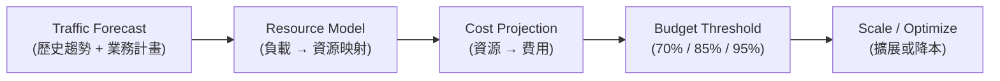

> **⚠️ WORKED EXAMPLE — DELETE BEFORE USE**
> Concrete names below (order-service, AWS, us-east-1, etc.) come
> from a worked e-commerce example to give AI strong few-shot context. **Replace
> them with your domain's terms** when filling for your project. The structure (sections,
> tables, frontmatter) is what to keep; the example content is what to swap or delete.
> If your domain doesn't fit (CLI / library / ML / embedded), the example is still
> useful as a structural reference — copy the shape, change the words.

# 容量規劃與成本管理 — `<產品/服務名稱>`

> **Tier**: 2-contracts — capacity planning specification; must stay synced with infrastructure configuration and cost reports
>
> **Why a dedicated doc**: capacity surprises are the most expensive kind of tech debt. Without an explicit capacity plan, teams either over-provision (wasting money) or under-provision (causing outages). This template makes capacity assumptions explicit — what load we expect, what resources we have, what it costs, and when we need to scale.
>
> **Companion fields**: this service's SLO in `2-contracts/SLO-0000-slo-spec.template.md` defines the performance targets that capacity must support; `2-contracts/OBS-0000-observability-spec.template.md` provides the metrics to validate capacity assumptions.

---

## 1. 容量模型

> 定義系統的負載維度與當前基線。所有數字來自可觀測性平台（Prometheus / Datadog / CloudWatch）的實際量測。

### 1.1 負載維度

| 維度 | 當前基線（P50） | 當前峰值（P99） | 量測來源 | 量測日期 |
|---|---|---|---|---|
| RPS（HTTP 請求/秒） | 500 | 2,000 | `http_requests_total` rate | <YYYY-MM-DD> |
| 同時連線使用者 | 5,000 | 15,000 | WebSocket connections gauge | <YYYY-MM-DD> |
| DB 查詢/秒 | 1,200 | 4,500 | `db_queries_total` rate | <YYYY-MM-DD> |
| 訊息佇列 throughput（msg/s） | 300 | 1,000 | Kafka consumer lag | <YYYY-MM-DD> |
| 儲存成長率（GB/月） | 50 | — | 磁碟使用趨勢 | <YYYY-MM-DD> |
| 頻寬（Mbps） | 200 | 800 | Network I/O metrics | <YYYY-MM-DD> |

### 1.2 負載特徵

| 特徵 | 描述 |
|---|---|
| 週期性 | 工作日 09:00-18:00 為高峰；週末流量降至 30% |
| 季節性 | 雙 11 / 黑五期間峰值達平日 5x |
| 突發性 | 行銷推播後 5 分鐘內流量可達 10x |
| 資料傾斜 | 80% 流量集中在 20% 的 API endpoints |

---

## 2. 成長預測

### 2.1 預測模型



### 2.2 成長預測表

| 時間點 | RPS（P50） | 同時使用者 | 儲存總量 | 信心區間 | 假設 |
|---|---|---|---|---|---|
| 當前 | 500 | 5,000 | 1.2 TB | — | 實測值 |
| +3 個月 | 650 | 6,500 | 1.5 TB | ±15% | 自然成長 10%/月 |
| +6 個月 | 900 | 9,000 | 2.0 TB | ±25% | 新市場上線 |
| +12 個月 | 1,500 | 15,000 | 3.5 TB | ±35% | 多產品線整合 |

### 2.3 關鍵假設

| 假設 | 依據 | 失效條件 | 失效時行動 |
|---|---|---|---|
| 月增長率 10% | 過去 6 個月趨勢 | 單月增長 > 25% | 提前執行 +6 月擴展計畫 |
| 新市場 Q3 上線 | 產品路線圖 | 延遲或提前 | 調整 +6 月預測 |
| 不增加新 data-intensive 功能 | 目前 backlog | 新增即時搜尋/推薦 | 重新評估儲存與運算預測 |

---

## 3. 資源清單

### 3.1 Compute 資源

| 服務 | 環境 | 規格 | 數量 | 用途 | 月費估算 |
|---|---|---|---|---|---|
| order-service | Production | 4 vCPU / 8 GB | 6 pods | API 伺服器 | $720 |
| order-service | Staging | 2 vCPU / 4 GB | 2 pods | 測試環境 | $160 |
| worker-service | Production | 2 vCPU / 4 GB | 4 pods | 非同步任務 | $320 |
| DB (PostgreSQL) | Production | 8 vCPU / 32 GB | 1 primary + 2 replica | 關聯式資料庫 | $1,800 |
| Cache (Redis) | Production | 2 vCPU / 16 GB | 3 nodes (cluster) | 快取 / Session | $540 |

### 3.2 Storage 資源

| 類型 | 環境 | 容量 | 使用率 | IOPS | 月費估算 |
|---|---|---|---|---|---|
| EBS gp3 (DB) | Production | 500 GB | 65% | 3,000 | $40 |
| S3 (物件儲存) | Production | 2 TB | — | — | $46 |
| S3 (日誌歸檔) | Production | 500 GB | — | — | $12 |

### 3.3 Network / 第三方服務

| 資源 | 環境 | 規格 | 月費估算 |
|---|---|---|---|
| NAT Gateway | Production | 500 GB 傳輸/月 | $225 |
| CDN (CloudFront) | Production | 1 TB 傳輸/月 | $85 |
| Stripe（支付） | Production | 10,000 txn/月 × $0.30 | $3,000 |
| SendGrid（Email） | Production | 50,000 封/月 | $90 |

### 3.4 費用摘要

| 類別 | 月費估算 | 佔比 |
|---|---|---|
| Compute | $3,040 | 43% |
| Storage | $98 | 1% |
| Network | $310 | 4% |
| Database (managed) | $1,800 | 25% |
| Cache | $540 | 8% |
| 第三方服務 | $3,090 | 44% |
| **合計** | **$7,038** | — |

---

## 4. 成本分攤

### 4.1 按功能分攤

| 功能模組 | Compute | Storage | DB | 第三方 | 小計 | 佔比 |
|---|---|---|---|---|---|---|
| 訂單處理 | $480 | $30 | $900 | $3,000 | $4,410 | 63% |
| 使用者管理 | $240 | $10 | $300 | $90 | $640 | 9% |
| 商品目錄 | $160 | $40 | $300 | — | $500 | 7% |
| 非同步任務 | $320 | $18 | $300 | — | $638 | 9% |
| 基礎設施共用 | $1,840 | — | — | — | $1,840 | 26% |

### 4.2 單位經濟

| 指標 | 值 | 計算方式 |
|---|---|---|
| 每請求成本 | $0.000005 | 月費 / 月請求數 |
| 每訂單成本 | $0.44 | (訂單模組費用) / 月訂單數 |
| 每活躍使用者成本 | $0.14 | 月費 / MAU |

### 4.3 按環境分攤

| 環境 | 月費 | 佔生產環境比例 | 目標比例 |
|---|---|---|---|
| Production | $7,038 | 100% | — |
| Staging | $1,200 | 17% | ≤ 20% |
| Development | $400 | 6% | ≤ 10% |

---

## 5. 擴展策略

### 5.1 水平 vs 垂直

| 元件 | 擴展方向 | 理由 |
|---|---|---|
| API server (order-service) | 水平 | 無狀態；加 pod 即可 |
| Worker (async tasks) | 水平 | 任務可平行處理 |
| PostgreSQL primary | 垂直 | 寫入不可分片（短期）；長期考慮 read replica 或分片 |
| PostgreSQL replica | 水平 | 加 replica 分散讀取 |
| Redis | 水平 | cluster mode 自動分片 |

### 5.2 Auto-scaling 觸發條件

| 元件 | Metric | Scale-out 閾值 | Scale-in 閾值 | 最小/最大副本 | 冷卻期 |
|---|---|---|---|---|---|
| order-service | CPU utilization | > 70% for 3min | < 30% for 10min | 3 / 20 | 5 min |
| order-service | RPS per pod | > 200 | < 50 | 3 / 20 | 5 min |
| worker-service | Queue depth | > 1,000 | < 100 | 2 / 10 | 3 min |

### 5.3 預熱策略（Event-driven Pre-warming）

| 事件 | 預熱動作 | 提前時間 | 回復時間 |
|---|---|---|---|
| 雙 11 / 黑五促銷 | API server 擴展至 max；DB connection pool 加倍 | T-2 小時 | T+4 小時 |
| 行銷推播 | API server 擴展至 15 pods | T-30 分鐘 | T+1 小時 |
| 月結批次處理 | Worker 擴展至 max | T-15 分鐘 | 完成後回復 |

---

## 6. 瓶頸分析

### 6.1 當前限制因素

| 資源 | 當前使用率 | 理論上限 | Headroom | 預計耗盡時間 | 優先度 |
|---|---|---|---|---|---|
| DB connections | 65% (130/200) | 200 | 35% | +4 個月 | HIGH |
| DB IOPS | 45% (1,350/3,000) | 3,000 | 55% | +8 個月 | MEDIUM |
| API server pods | 50% (3/6 at peak) | 20 (max) | 高 | > 12 個月 | LOW |
| Redis memory | 72% (11.5/16 GB) | 16 GB per node | 28% | +3 個月 | HIGH |
| S3 storage | — (自動擴展) | 無限 | 無限 | N/A | LOW |

### 6.2 First-to-Fail 預測

```
最可能率先成為瓶頸的資源：

1. 🔴 Redis memory（+3 個月）
   → 行動：升級至 32 GB 節點或啟用 eviction policy
   → 預估成本增加：+$270/月

2. 🟡 DB connections（+4 個月）
   → 行動：導入 PgBouncer connection pooler
   → 預估成本增加：+$50/月（PgBouncer pod）

3. 🟢 DB IOPS（+8 個月）
   → 行動：升級至 io2 或增加 read replica
   → 預估成本增加：+$300-600/月
```

---

## 7. 預算與閾值

### 7.1 告警閾值

| 閾值 | 佔預算比例 | 通知方式 | 行動 |
|---|---|---|---|
| Green | ≤ 70% | — | 正常運作 |
| Yellow | 70-85% | Slack `#cost-alerts` | 審查非必要資源；評估降本方案 |
| Orange | 85-95% | Slack `#cost-alerts` + Email 工程主管 | 暫停非必要環境；啟動降本行動 |
| Red | > 95% | PagerDuty + Email CTO | 緊急審查；停止非關鍵服務擴展；申請預算追加 |

### 7.2 預算追加審批流程

| 追加金額 | 審批層級 | SLA |
|---|---|---|
| < $500/月 | 技術主管 | 1 工作天 |
| $500-$2,000/月 | 工程總監 | 3 工作天 |
| > $2,000/月 | CTO + 財務 | 5 工作天 |

### 7.3 降本機會清單

| 機會 | 預估節省 | 複雜度 | 優先度 |
|---|---|---|---|
| Reserved Instances（1 年期） | 30-40% compute 費用 | 低 | HIGH |
| 非尖峰時段縮減 Staging | $400/月 | 低 | HIGH |
| S3 Intelligent-Tiering | 20-30% storage 費用 | 低 | MEDIUM |
| Spot instances for workers | 60-70% worker compute | 中 | MEDIUM |
| 日誌保留期縮短 (30d → 14d) | $50/月 | 低 | LOW |

---

## 8. 審查節奏

| 活動 | 頻率 | 參與者 | 產出 |
|---|---|---|---|
| 月度成本審查 | 每月 | SRE + 工程主管 | 成本趨勢報告；異常標記；降本追蹤 |
| 季度容量審查 | 每季 | SRE + 工程主管 + PM | 更新成長預測；調整資源規劃；更新本文件 |
| 年度預算規劃 | 每年 | 工程主管 + CTO + 財務 | 下年度 infra 預算；RI/SP 購買計畫 |
| 事件觸發審查 | 即時 | SRE | 容量相關事故後 48 小時內更新瓶頸分析 |

### 8.1 審查檢查清單

- [ ] 成長預測假設仍然有效？
- [ ] First-to-fail 預測是否更新？
- [ ] 降本機會是否有新項目？
- [ ] Auto-scaling 閾值是否需要調整？
- [ ] 預算使用率在合理範圍內？
- [ ] 單位經濟是否惡化？

> **容量變更**：調整 auto-scaling 上限、升級 DB 規格、或新增基礎設施屬於 tier-2 contract 變更，需執行 CIA（`sunnydata-change-impact-analysis`）。

---

## See also

- `1-decisions/ARCH-0000-architecture-overview.template.md` — 架構總覽與 NFR 效能需求
- `2-contracts/SLO-0000-slo-spec.template.md` — SLO 定義容量必須支撐的效能目標
- `2-contracts/OBS-0000-observability-spec.template.md` — 可觀測性 metrics 驗證容量假設
- `2-contracts/TM-0000-traceability-matrix.template.md` — §Non-Functional Coverage 指向此文件
- `2-contracts/PIPE-0000-pipeline-contract.template.md` — 資料管線的容量與 SLA 需求
- `3-process/PROC-0005-deployment-runbook.template.md` — 部署時的容量驗證步驟
- `4-exploration/CIA-0000-change-impact-analysis.template.md` — 基礎設施變更需 CIA gate
- `.claude/rules/change-governance.md` — 容量變更觸發 "architecture boundary" CIA gate
