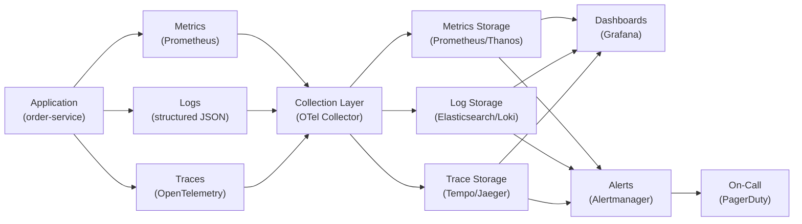

> **⚠️ WORKED EXAMPLE — DELETE BEFORE USE**
> Concrete names below (order-service, Prometheus, Grafana, etc.) come
> from a worked e-commerce example to give AI strong few-shot context. **Replace
> them with your domain's terms** when filling for your project. The structure (sections,
> tables, frontmatter) is what to keep; the example content is what to swap or delete.
> If your domain doesn't fit (CLI / library / ML / embedded), the example is still
> useful as a structural reference — copy the shape, change the words.

# 可觀測性規格 — `<服務名稱>`

> **Tier**: 2-contracts — observability specification; must stay synced with monitoring configuration and instrumentation code
>
> **Why a dedicated doc**: observability is the contract between the service team and on-call. Without an explicit spec, metrics naming drifts across services, logs lack correlation IDs, traces are sampled inconsistently, and dashboards become tribal knowledge. This template makes observability a first-class contract artifact — reviewable, diffable, and linked to SLO burn-rate alerts.
>
> **Companion fields**: this service's SLO in `2-contracts/SLO-0000-slo-spec.template.md` references the metrics and alerts defined here.

---

## 1. 可觀測性目標

> 定義 on-call 與營運團隊必須能回答的核心問題。每個問題對應一個信號類型（metrics / logs / traces）。

| 核心問題 | 信號類型 | 回答來源 |
|---|---|---|
| 服務現在是否健康？ | Metrics | Golden signals 儀表板 |
| 過去 5 分鐘錯誤率是否上升？ | Metrics | 錯誤率燃燒率告警 |
| 某個請求為什麼慢？ | Traces | 分散式追蹤（span 時間線） |
| 某個錯誤的完整上下文是什麼？ | Logs | 結構化日誌 + correlation ID |
| 上游故障影響了哪些下游？ | Traces | 依賴關係圖 + trace 搜尋 |
| 業務指標（訂單數/營收）是否異常？ | Metrics | 業務指標儀表板 |
| 資源是否即將飽和？ | Metrics | 飽和度告警（CPU/memory/disk/connections） |

---

## 2. Metrics 規範

### 2.1 Golden Signals

| 信號 | Metric 名稱 | 類型 | 標籤 | 說明 |
|---|---|---|---|---|
| Latency | `http_request_duration_seconds` | Histogram | `service`, `method`, `endpoint`, `status_code` | 請求延遲分布 |
| Traffic | `http_requests_total` | Counter | `service`, `method`, `endpoint`, `status_code` | 請求總數 |
| Errors | `http_errors_total` | Counter | `service`, `method`, `endpoint`, `error_type` | 5xx + timeout 錯誤 |
| Saturation | `system_cpu_utilization_ratio` | Gauge | `service`, `instance` | CPU 使用率 |
| Saturation | `system_memory_utilization_ratio` | Gauge | `service`, `instance` | 記憶體使用率 |
| Saturation | `db_connection_pool_active_ratio` | Gauge | `service`, `pool_name` | 連線池使用率 |

### 2.2 業務指標

| Metric 名稱 | 類型 | 標籤 | 說明 |
|---|---|---|---|
| `business_orders_created_total` | Counter | `service`, `channel`, `product_category` | 訂單建立數 |
| `business_revenue_cents_total` | Counter | `service`, `currency` | 累計營收（以分計） |
| `business_payment_success_total` | Counter | `service`, `provider` | 付款成功數 |
| `business_payment_failure_total` | Counter | `service`, `provider`, `error_code` | 付款失敗數 |

### 2.3 命名慣例

| 規則 | 範例 | 說明 |
|---|---|---|
| 前綴為領域 | `http_`, `db_`, `business_`, `system_` | 避免命名衝突 |
| 使用 snake_case | `http_request_duration_seconds` | 跨工具相容 |
| Counter 帶 `_total` 後綴 | `http_requests_total` | Prometheus 慣例 |
| Histogram 帶單位後綴 | `_seconds`, `_bytes` | 自描述 |
| 標籤基數 ≤ 10 個值 | `status_code` 分組為 `2xx/3xx/4xx/5xx` | 避免高基數爆炸 |

### 2.4 保留政策

| 解析度 | 保留期間 | 用途 |
|---|---|---|
| 原始（15s 間隔） | 14 天 | 即時告警、除錯 |
| 1 分鐘聚合 | 90 天 | 儀表板、SLO 計算 |
| 1 小時聚合 | 1 年 | 趨勢分析、容量規劃 |

---

## 3. Logging 規範

### 3.1 結構化格式

所有日誌必須為 JSON 結構化格式，必含欄位：`timestamp` (ISO 8601), `level`, `service`, `instance`, `trace_id`, `span_id`, `correlation_id`, `message`。選填：`error_type`, `context` (業務欄位如 `order_id`)。

### 3.2 日誌層級

| 層級 | 用途 | 預期量 |
|---|---|---|
| `FATAL` | 服務無法啟動或不可恢復錯誤 | 極少 — 每次都觸發 PagerDuty |
| `ERROR` | 請求失敗、需人工關注 | 低 — 與 error metric 1:1 對應 |
| `WARN` | 可恢復異常（重試成功、降級啟動） | 中 — 不應持續出現 |
| `INFO` | 業務事件（訂單建立、付款完成） | 中 — 每請求 1-3 條 |
| `DEBUG` | 內部狀態、技術細節 | 高 — 僅在除錯時開啟 |

### 3.3 Correlation ID

| 欄位 | 來源 | 用途 |
|---|---|---|
| `trace_id` | OpenTelemetry SDK 自動注入 | 跨服務追蹤 |
| `span_id` | OpenTelemetry SDK 自動注入 | 單一操作定位 |
| `correlation_id` | API Gateway 產生 / 請求 header 傳入 | 使用者可見的請求 ID |

### 3.4 PII 遮蔽規則

| 資料類型 | 處理方式 | 範例 |
|---|---|---|
| Email | 遮蔽為 `u***@d***.com` | `user@domain.com` → `u***@d***.com` |
| 手機 | 僅保留末 4 碼 | `+886912345678` → `***5678` |
| 信用卡 | 僅保留末 4 碼 | `4111111111111111` → `***1111` |
| 地址 | 完全遮蔽 | `台北市...` → `[REDACTED]` |
| API Key / Token | 完全遮蔽 | `sk_live_xxx` → `[REDACTED]` |

> **鐵律**：PII 在寫入 log 前遮蔽（application 層），不依賴後端清洗。

### 3.5 儲存與輪轉

| 環境 | 儲存目標 | 保留期間 | 輪轉策略 |
|---|---|---|---|
| Production | 集中式日誌平台 | 30 天（熱）+ 90 天（冷歸檔） | 按大小 100MB 或按日輪轉 |
| Staging | 集中式日誌平台 | 7 天 | 按日輪轉 |
| Development | stdout / 本地檔案 | 不保留 | — |

---

## 4. Tracing 規範

### 4.1 Instrumentation 點

| 層級 | 自動 / 手動 | 涵蓋範圍 |
|---|---|---|
| HTTP 入口 | 自動（SDK middleware） | 所有 HTTP handler |
| HTTP 出口 | 自動（SDK client wrapper） | 所有外部 HTTP 呼叫 |
| DB 查詢 | 自動（SDK driver hook） | 所有 SQL 操作 |
| 快取操作 | 自動（SDK client wrapper） | Redis / Memcached get/set |
| 訊息佇列 | 手動 | Kafka produce / consume |
| 關鍵業務邏輯 | 手動 | 付款處理、庫存扣減、價格計算 |

### 4.2 Span 命名慣例

| 類型 | 格式 | 範例 |
|---|---|---|
| HTTP server | `HTTP {METHOD} {route_template}` | `HTTP POST /api/v1/orders` |
| HTTP client | `HTTP {METHOD} {host}{path}` | `HTTP GET payment-service/charge` |
| DB | `{db_system} {operation} {table}` | `postgresql SELECT orders` |
| Cache | `{cache_system} {operation}` | `redis GET session` |
| Message | `{topic} {operation}` | `orders.completed publish` |
| Internal | `{module}.{function}` | `pricing.calculateDiscount` |

### 4.3 取樣策略

| 環境 | 策略 | 比率 | 說明 |
|---|---|---|---|
| Production | Tail-based sampling | 10% 正常 / 100% 錯誤 / 100% 慢請求 (> P99) | 降低成本；保留異常案例 |
| Staging | Head-based sampling | 100% | 完整除錯能力 |
| Development | 不取樣 | 100% | 本地開發完整追蹤 |

### 4.4 Trace-to-Log 關聯

三大信號透過 `trace_id` 互相關聯：Trace UI 點擊 span 可查看對應 log；Log search 以 `trace_id` 搜尋可定位 span；Metric alert 必須附帶 `trace_id` 連結。

---

## 5. Dashboard 目錄

### 5.1 信號流架構

### 5.2 儀表板清單

| 儀表板名稱 | 用途 | 受眾 | 更新頻率 |
|---|---|---|---|
| `{service}-golden-signals` | 四大黃金信號即時監控 | On-call 工程師 | 15s 即時 |
| `{service}-business-metrics` | 業務指標（訂單數、營收、轉換率） | PM / 業務團隊 | 1 分鐘 |
| `on-call-overview` | 所有服務健康狀態一覽 | On-call 工程師 | 30s 即時 |
| `{service}-resource-utilization` | CPU / 記憶體 / 磁碟 / 連線池 | SRE / DevOps | 1 分鐘 |
| `{service}-dependency-health` | 上下游服務健康與延遲 | On-call 工程師 | 15s 即時 |
| `cost-and-capacity` | 基礎設施成本與容量趨勢 | 工程主管 | 每日 |

---

## 6. 告警策略

### 6.1 嚴重度定義

| 嚴重度 | 定義 | 通知方式 | 回應 SLA |
|---|---|---|---|
| **Critical** | 使用者已受影響；SLO 快速燃燒（14.4x / 6x burn-rate） | PagerDuty 即時呼叫 | 5 分鐘內 acknowledge |
| **Warning** | 使用者尚未受影響但即將受影響；SLO 中速燃燒（3x） | Slack `#oncall` + ticket | 1 小時內 acknowledge |
| **Info** | 值得注意但無即時風險；SLO 低速燃燒（1x） | Slack `#sre-digest` | 下個工作日處理 |

> **SLO 燃燒率告警**參照 `SLO-0000-slo-spec.template.md` §3.3 Multi-window Multi-burn-rate 策略。

### 6.2 告警規則摘要

| 告警名稱 | 條件 | 嚴重度 | 抑制條件 |
|---|---|---|---|
| `{service}-high-error-rate` | 5xx rate > 1% for 5min | Critical | 計劃性維護視窗 |
| `{service}-high-latency-p99` | P99 > SLO 目標 for 10min | Warning | 部署後 10 分鐘 |
| `{service}-saturation-cpu` | CPU > 85% for 15min | Warning | 已知擴展中 |
| `{service}-saturation-memory` | Memory > 90% for 10min | Critical | — |
| `{service}-saturation-disk` | Disk > 85% | Warning | — |
| `{service}-saturation-connpool` | Connection pool > 90% | Critical | — |
| `{service}-downstream-degraded` | 上游回應時間 > 2x baseline | Info | — |

### 6.3 告警疲勞防治

| 策略 | 說明 |
|---|---|
| 分組（Grouping） | 同服務同嚴重度的告警在 5 分鐘視窗內合併 |
| 抑制（Inhibition） | Critical 觸發後，同服務 Warning/Info 15 分鐘內抑制 |
| 靜默（Silence） | 計劃性維護前手動設定靜默視窗 |
| 定期審查 | 每月審查：30 天未觸發考慮移除；頻繁觸發但未行動考慮降級 |
| 可行動原則 | 每個告警對應一個 runbook action；無 action 不建立 |

### 6.4 升級路徑

T+0 通知 on-call 主要 → T+5min (Critical 未 ack) 升級次要 → T+15min 升級工程主管 → T+30min 啟動 incident response。

---

## 7. 資料保留政策

| 信號類型 | 預設保留 | 可調整範圍 | 儲存成本考量 |
|---|---|---|---|
| Metrics（原始） | 14 天 | 7-30 天 | 高基數標籤直接影響成本 |
| Metrics（1min 聚合） | 90 天 | 30-180 天 | 長期趨勢與 SLO 計算 |
| Metrics（1hr 聚合） | 1 年 | 6 月-2 年 | 容量規劃 |
| Logs | 30 天（熱）+ 90 天（冷） | 7-365 天 | 合規需求可能要求更長 |
| Traces | 7 天 | 3-30 天 | 取樣率直接影響成本 |

> **依 tier 調整**：Tier-1 (critical) 服務的保留期間可延長 2x；Tier-3 (best-effort) 服務可縮短至最低值。

---

## 8. 工具鏈

### 8.1 決策矩陣

| 面向 | Prometheus + Grafana + Loki | Datadog | CloudWatch |
|---|---|---|---|
| 部署模式 | 自建 / K8s | SaaS | AWS 原生 |
| 初始成本 | 低（開源） | 中-高（按量計費） | 低（隨 AWS 使用） |
| 擴展成本 | 中（需維運 Thanos/Cortex） | 高（資料量增長線性計費） | 中 |
| 自訂化程度 | 高 | 中 | 低 |
| 多雲支援 | 佳 | 佳 | 僅 AWS |
| 維運負擔 | 高（自建升級、備份） | 低（全託管） | 低 |
| Trace 整合 | Tempo / Jaeger | 原生 APM | X-Ray |
| 適用場景 | K8s 原生團隊、成本敏感 | 多語言微服務、快速導入 | 全 AWS 單雲 |

### 8.2 當前選型

| 組件 | 工具 | 版本 | 說明 |
|---|---|---|---|
| Metrics 收集 | Prometheus | `<version>` | 15s scrape interval |
| Metrics 長期儲存 | Thanos | `<version>` | 跨叢集聚合 |
| Log 收集 | OpenTelemetry Collector | `<version>` | 統一收集管道 |
| Log 儲存 | Loki | `<version>` | 低成本、label-indexed |
| Trace 收集 | OpenTelemetry SDK | `<version>` | 語言原生 SDK |
| Trace 儲存 | Tempo | `<version>` | 與 Grafana 整合 |
| 儀表板 | Grafana | `<version>` | 統一可視化 |
| 告警管理 | Alertmanager | `<version>` | 路由、分組、抑制 |
| 值班管理 | PagerDuty | — | 升級、輪值 |

---

## See also

- `1-decisions/ARCH-0000-architecture-overview.template.md` — NFR 可觀測性需求的來源
- `2-contracts/SLO-0000-slo-spec.template.md` — SLO 燃燒率告警引用此文件的 metrics 定義
- `2-contracts/TM-0000-traceability-matrix.template.md` — §Non-Functional Coverage 指向此文件
- `2-contracts/API-0000-api-spec.template.md` — API 端點對應的 metrics 與 span 命名
- `2-contracts/PIPE-0000-pipeline-contract.template.md` — 資料管線的 SLA 監控配置
- `3-process/PROC-0009-incident-response.template.md` — 告警升級後的事故回應流程
- `4-exploration/CIA-0000-change-impact-analysis.template.md` — 可觀測性配置變更需 CIA gate
- `.claude/rules/change-governance.md` — 告警策略或 SLO 變更觸發 "architecture boundary" CIA gate
