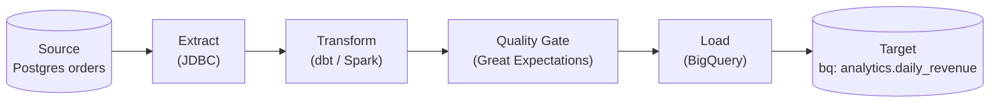
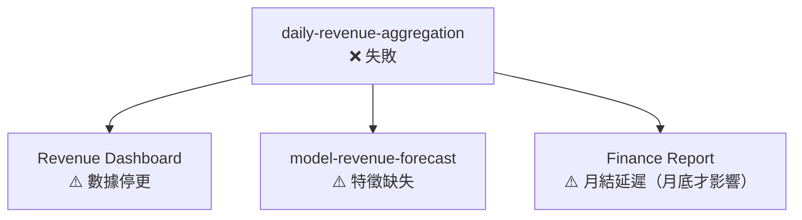

> **⚠️ WORKED EXAMPLE — DELETE BEFORE USE**
> Concrete names below (orders, daily-revenue-aggregation, BigQuery, etc.) come
> from a worked e-commerce analytics example to give AI strong few-shot context. **Replace
> them with your domain's terms** when filling for your project. The structure (sections,
> tables, frontmatter) is what to keep; the example content is what to swap or delete.
> If your domain doesn't fit (CLI / library / ML / embedded), the example is still
> useful as a structural reference — copy the shape, change the words.

# 資料管線契約 — `<管線名稱>`

> **Tier**: 2-contracts — data pipeline input/output specification; must stay synced with pipeline code
>
> **Why a dedicated doc**: data pipelines are contracts between producers and consumers. When schemas drift silently, downstream dashboards show wrong numbers and ML models train on corrupted data. This template makes pipeline boundaries explicit — what comes in, what transformations apply, what comes out, and what quality checks guard the boundary.
>
> **Companion fields**: this pipeline's row in `2-contracts/TM-0000-traceability-matrix.template.md` §Data Pipeline Coverage points back here.

---

## 1. 管線總覽

| 欄位 | 值 |
|---|---|
| 管線名稱 | `<e.g. daily-revenue-aggregation>` |
| 管線 ID | `PIPE-NNNN` |
| 類型 | Batch / Stream / Hybrid |
| 排程 / 觸發 | `<e.g. 每日 02:00 UTC 排程>` / `<e.g. Kafka topic: orders.completed>` |
| 負責團隊 | `<data-engineering-team>` |
| 資料工程師 | `<name>` |
| 優先層級 | P1 (mission-critical) / P2 (business-important) / P3 (best-effort) |
| 相依 Flow ID | `BF-NNNN` |

### 1.1 管線流程圖



---

## 2. 輸入契約（Input Contract）

### 2.1 來源系統

| 來源 | 系統類型 | 連線方式 | 認證 |
|---|---|---|---|
| `orders` (PostgreSQL) | OLTP 主資料庫 | JDBC read-replica | IAM service account |
| `products` (PostgreSQL) | OLTP 主資料庫 | JDBC read-replica | IAM service account |

### 2.2 輸入 Schema

```sql
-- orders (source table)
CREATE TABLE orders (
    id            UUID         PRIMARY KEY,
    customer_id   UUID         NOT NULL,
    status        VARCHAR(20)  NOT NULL,  -- pending|paid|cancelled|refunded
    total_amount  NUMERIC(12,2) NOT NULL,
    currency      CHAR(3)      NOT NULL,
    created_at    TIMESTAMPTZ  NOT NULL,
    updated_at    TIMESTAMPTZ  NOT NULL
);
```

### 2.3 資料新鮮度 SLA

| 欄位 | 要求 |
|---|---|
| 批次管線最大延遲 | 原始資料必須在觸發時間點前 ≤ 15 分鐘完成同步 |
| 串流管線最大 lag | P99 event-time lag ≤ 30 秒 |
| 來源資料更新頻率 | 每 5 分鐘（CDC from WAL） |

### 2.4 資料品質期望（輸入端）

| 欄位 | 期望 | 違反時行動 |
|---|---|---|
| `id` | NOT NULL, 唯一 | 停止管線；告警 |
| `total_amount` | ≥ 0 | 記錄並跳過；告警 |
| `status` | 在枚舉範圍內 | 記錄；路由至 quarantine |
| `created_at` | NOT NULL; ≤ 處理時間 | 停止管線；告警 |

---

## 3. 轉換邏輯（Transformation Logic）

### 3.1 核心業務規則

1. **收入計算**：僅計算 `status = 'paid'` 的訂單；`status = 'refunded'` 的訂單從當日收入中扣除。
2. **貨幣標準化**：所有金額轉換為 USD（使用當日開盤匯率，來自 `exchange_rates` 參考表）。
3. **日期歸屬**：以 `created_at` 的 UTC 日期為基準（非處理日期）。

### 3.2 去重 / 聚合 / Join

| 操作 | 描述 | 冪等性保證 |
|---|---|---|
| 去重 | 以 `id` 為 key；選取 `updated_at` 最新版本 | 是 — 以 `id` UPSERT |
| Join | `orders` LEFT JOIN `products` ON `product_id` | 外鍵缺失時保留 NULL，不丟棄行 |
| 聚合 | 按 `date`, `product_category` GROUP BY | 先去重再聚合 |

### 3.3 冪等性保證

> 重跑同一批次不得產生重複資料或不同結果。

實現方式：
- 目標表以 `(date, product_category)` 作為 partition key；每次重跑先 DELETE PARTITION 再 INSERT。
- 來源讀取使用 `WHERE created_at >= :batch_start AND created_at < :batch_end` 固定邊界。

### 3.4 偽代碼示意

```python
def transform(raw_orders: DataFrame, exchange_rates: DataFrame) -> DataFrame:
    # 1. 去重
    deduped = raw_orders.drop_duplicates(subset=["id"], keep="last")
    # 2. 過濾
    paid = deduped[deduped["status"].isin(["paid", "refunded"])]
    # 3. 標準化金額
    with_usd = paid.merge(exchange_rates, on=["currency", "date"], how="left")
    with_usd["amount_usd"] = with_usd["total_amount"] * with_usd["rate_to_usd"]
    # 4. 聚合
    result = (
        with_usd
        .groupby(["date", "product_category"])
        .agg(revenue_usd=("amount_usd", "sum"), order_count=("id", "nunique"))
        .reset_index()
    )
    return result
```

---

## 4. 輸出契約（Output Contract）

### 4.1 目標系統

| 目標 | 系統 | 寫入方式 | 認證 |
|---|---|---|---|
| `analytics.daily_revenue` | BigQuery | BigQuery Storage Write API | Workload Identity |

### 4.2 輸出 Schema

```json
{
  "date": "DATE",
  "product_category": "STRING",
  "revenue_usd": "NUMERIC(14,4)",
  "order_count": "INTEGER",
  "pipeline_run_id": "STRING",
  "processed_at": "TIMESTAMP"
}
```

### 4.3 分區與保留

| 欄位 | 設定 |
|---|---|
| 分區鍵 | `date`（按日期分區） |
| 叢集鍵 | `product_category` |
| 資料保留 | 3 年（依合規要求；超過後自動刪除） |
| 歷史回填支援 | 是；最多回填 90 天 |

---

## 5. 資料品質閘門（Data Quality Gates）

> 品質閘門在 Transform 後、Load 前執行；任一閘門失敗則管線停止並告警。

| 檢查項目 | 規則 | 閾值 | 失敗行動 |
|---|---|---|---|
| NULL 率 | `revenue_usd` NULL 比例 | < 0.1% | 停止管線；PagerDuty |
| 行數下限 | 輸出行數 ≥ 前 7 天平均 × 0.7 | 絕對值 | 停止管線；PagerDuty |
| 行數上限 | 輸出行數 ≤ 前 7 天平均 × 1.5 | 絕對值 | Warning；Slack 告警 |
| Schema 漂移偵測 | 輸入欄位集合與上次執行一致 | 無新增/刪除欄位 | 停止管線；告警 |
| 新鮮度檢查 | `max(created_at)` 距觸發時間 ≤ 1h | 1 小時 | 停止管線；告警 |
| 負收入 | `revenue_usd` ≥ -10000（退款上限） | 業務規則 | 停止管線；人工審查 |

---

## 6. SLA 與監控

| 指標 | 目標值 |
|---|---|
| 管線完成延遲（排程到可查詢） | ≤ 2 小時 |
| 成功率（過去 30 天） | ≥ 99% |
| 重試次數上限 | 3 次（指數退避：1min, 5min, 15min） |
| 告警通知時間（失敗後） | ≤ 5 分鐘 |

### 6.1 告警配置

| 告警 | 條件 | 嚴重度 | 通知 |
|---|---|---|---|
| 管線超時 | 執行時間 > 3 小時 | Warning | Slack #data-alerts |
| 管線失敗 | 狀態 = FAILED 且重試耗盡 | Critical | PagerDuty |
| 品質閘門失敗 | 任一 DQ check 失敗 | Critical | PagerDuty |
| 資料延遲過高 | 新鮮度 > 4 小時 | Warning | Slack #data-alerts |

### 6.2 回填程序

```bash
# 回填指定日期範圍
pipeline-cli backfill \
  --pipeline daily-revenue-aggregation \
  --start-date 2024-01-01 \
  --end-date 2024-01-07 \
  --dry-run  # 先 dry-run 確認影響範圍
```

> 回填前需確認：(1) 目標分區資料備份；(2) 通知下游消費者；(3) 在非尖峰時段執行。

---

## 7. 相依關係

### 7.1 上游依賴

| 管線 / 系統 | 依賴類型 | SLA | 失敗影響 |
|---|---|---|---|
| `orders-cdc-pipeline` | 資料來源 | 完成於每日 01:45 UTC | 本管線無法啟動 |
| `exchange-rates-loader` | 參考資料 | 完成於每日 01:30 UTC | 貨幣轉換失敗；管線停止 |

### 7.2 下游消費者

| 消費者 | 用途 | 對延遲的容忍度 |
|---|---|---|
| Revenue Dashboard (Looker) | 每日收入報表 | ≤ 4 小時 |
| `model-revenue-forecast` | ML 特徵工程 | ≤ 24 小時 |
| Finance 月結報告 | 財務對帳 | 月底前完成即可 |

### 7.3 失敗爆炸半徑



---

## 8. 版本控制

### 8.1 破壞性變更政策

| 變更類型 | 分類 | 程序 |
|---|---|---|
| 新增輸出欄位（NULLABLE） | 非破壞性 | 通知消費者；無需停機 |
| 刪除輸出欄位 | 破壞性 | CIA + ADR；90 天棄用期 |
| 變更欄位類型 | 破壞性 | CIA + ADR；需消費者確認 |
| 變更分區鍵 | 破壞性 | CIA + ADR；需完整回填 |
| 變更業務規則（影響歷史值） | 破壞性 | CIA + ADR；需 Finance 審核 |

### 8.2 向後相容視窗

- **非破壞性變更**：立即生效
- **破壞性變更**：舊 schema 維持 **90 天**相容期（透過 view 層兼容）
- **棄用通知**：至少提前 30 天書面通知所有消費者

---

## See also

- `1-decisions/ARCH-0000-architecture-overview.template.md` — 資料架構總覽
- `2-contracts/TM-0000-traceability-matrix.template.md` — §Data Pipeline Coverage
- `2-contracts/SLO-0000-slo-spec.template.md` — 管線 SLO 規格（若管線有獨立 SLO）
- `3-process/PROC-0009-incident-response.template.md` — 管線 P1 失敗的事故回應
- `4-exploration/CIA-0000-change-impact-analysis.template.md` — schema 變更 / 業務規則變更需 CIA
- `.claude/rules/change-governance.md` — data pipeline 變更觸發 "DB schema" / "external integration" CIA gate
