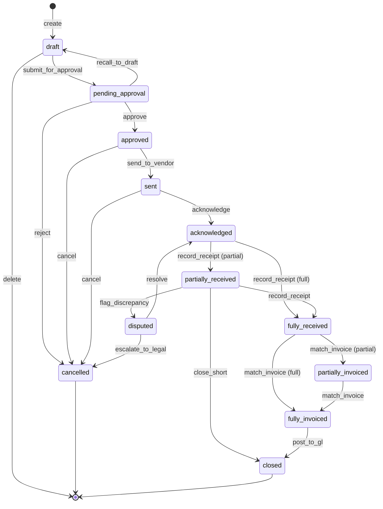

> **⚠️ WORKED EXAMPLE — DELETE BEFORE USE**
> Concrete names below (Customer, Order, Inventory, PurchaseOrder, Stripe, etc.) come
> from a worked e-commerce/ERP example to give AI strong few-shot context. **Replace
> them with your domain's terms** when filling for your project. The structure (sections,
> tables, frontmatter) is what to keep; the example content is what to swap or delete.
> If your domain doesn't fit (CLI / library / ML / embedded), the example is still
> useful as a structural reference — copy the shape, change the words.
# SM-NNNN: `<Entity>` State Machine

> **Tier**: 2-contracts → behavioral contract for stateful entities
>
> **Why a dedicated doc**: in ERP, an entity like Purchase Order has 12+ states with 20+ transitions, each with guards and side-effects. Burying that inside `BF-0000-flow-business.template.md` or `DDD-0000-domain-model.template.md` forces those parent docs to grow uncontrollably. Extracting to a state-machine doc lets the parent stay readable while making the state machine itself testable per-transition.
>
> **Promotion criterion**: extract a state machine to its own doc when there are ≥ 5 states OR ≥ 10 transitions OR there are nested/parallel states. Otherwise inline it in the owning Flow / Domain Model.

---

## 1. Identity

| Field | Value |
|---|---|
| Entity | `PurchaseOrder` |
| Aggregate | `PurchaseOrder` (DM-NNNN) |
| Module | `MOD-NNNN` (`Procurement`) |
| State stored at | `purchase_orders.status` (PostgreSQL enum) |
| Initial state | `draft` |
| Terminal states | `closed`, `cancelled` |

## 2. State Catalog

For each state: business meaning, allowed durations, allowed user actions, system invariants.

| State | Business Meaning | Allowed Actions | Invariants |
|---|---|---|---|
| `draft` | Buyer is composing the PO | edit_lines, submit_for_approval, delete | total_amount may be 0; vendor not yet final |
| `pending_approval` | Awaiting approver action | approve, reject, recall_to_draft | total_amount > approval_threshold required |
| `approved` | Approver said yes; ready to send to vendor | send_to_vendor, cancel | vendor confirmed; budget reserved |
| `sent` | PO transmitted to vendor (EDI / email / portal) | acknowledge, cancel, request_change | acknowledgement deadline tracked |
| `acknowledged` | Vendor confirmed receipt + price | wait_for_receipt, request_change, cancel | vendor commitment recorded |
| `partially_received` | Some line items received | record_receipt, close_short, cancel_remaining | received_qty < ordered_qty for ≥1 line |
| `fully_received` | All lines received in full | match_invoice | received_qty == ordered_qty for all lines |
| `partially_invoiced` | Some lines invoiced | match_invoice, write_off | invoiced < received |
| `fully_invoiced` | All received lines invoiced | post_to_gl, close | invoiced == received |
| `closed` | Three-way match complete; no further action | (none — terminal) | invariant: no orphan unmatched lines |
| `cancelled` | Aborted at any non-terminal point | (none — terminal) | reservation released; vendor notified |
| `disputed` | Discrepancy found; escalated | resolve, escalate_to_legal | requires resolution before close |

## 3. Transition Table

Source of truth for what can transition to what, by whom, with what guard.

| From | To | Trigger | Actor | Guard | Side Effects | Event Emitted |
|---|---|---|---|---|---|---|
| `draft` | `pending_approval` | submit_for_approval | Buyer | total_amount > 0 AND vendor != null | reserve budget | `POPendingApproval` |
| `draft` | (deleted) | delete | Buyer | (always) | hard delete | `PODeleted` |
| `pending_approval` | `approved` | approve | Approver | approver.role allows; matches policy | budget commitment confirmed | `POApproved` |
| `pending_approval` | `draft` | recall_to_draft | Buyer | (always within 24h) | release budget reservation | `PORecalled` |
| `pending_approval` | `cancelled` | reject | Approver | (always) | release budget; notify buyer | `PORejected` |
| `approved` | `sent` | send_to_vendor | System (auto) | vendor channel configured | EDI / email / portal call | `POSent` |
| `approved` | `cancelled` | cancel | Buyer | (always with reason) | release budget; notify | `POCancelled` |
| `sent` | `acknowledged` | acknowledge | System (vendor callback) | signature valid | record vendor commitment | `POAcknowledged` |
| `sent` | `cancelled` | cancel | Buyer | within cancel window | notify vendor | `POCancelled` |
| `acknowledged` | `partially_received` | record_receipt | Warehouse | qty_received < qty_ordered | reduce open commitment | `POPartiallyReceived` |
| `acknowledged` | `fully_received` | record_receipt | Warehouse | qty_received == qty_ordered | reduce open commitment | `POFullyReceived` |
| `partially_received` | `fully_received` | record_receipt | Warehouse | sum receipts == ordered | (as above) | `POFullyReceived` |
| `partially_received` | `closed` | close_short | Buyer | accept short delivery | write off remaining | `POClosedShort` |
| `partially_received` | `disputed` | flag_discrepancy | Warehouse / Buyer | (always) | escalate | `PODisputed` |
| `fully_received` | `partially_invoiced` | match_invoice | AP | invoiced < received | match line items | `POPartiallyInvoiced` |
| `fully_received` | `fully_invoiced` | match_invoice | AP | invoiced == received | match all | `POFullyInvoiced` |
| `partially_invoiced` | `fully_invoiced` | match_invoice | AP | (cumulative) | (as above) | `POFullyInvoiced` |
| `fully_invoiced` | `closed` | post_to_gl | System (auto) | GL period open | post to GL | `POClosed` |
| `disputed` | `acknowledged` | resolve | Buyer + Vendor | resolution recorded | resume normal flow | `PODisputeResolved` |
| `disputed` | `cancelled` | escalate_to_legal | Legal | (always) | abort | `POEscalatedAndCancelled` |

**Reading the transition table**:
- `Trigger` = the action name (verb)
- `Actor` = role required (use principle-of-least-privilege)
- `Guard` = predicate that must hold; if false → reject with explicit error
- `Side Effects` = what happens to other aggregates / external systems
- `Event Emitted` = domain event published for cross-context consumers

## 4. State Diagram

## 5. Cross-cutting Invariants

Rules that must hold across any state:
- `total_amount = sum(line.qty × line.unit_price)` always
- A PO can have at most one active receipt session at a time (no concurrent partial receives on same PO)
- Once `posted_to_gl_at` is set, no field except audit columns may change
- Cancellation always releases budget reservation idempotently
- Every state change writes an audit row to `po_audit_trail`

## 6. Forbidden Transitions (negative space)

Explicitly enumerate what's NOT allowed (these often appear as bugs without explicit rejection):

| Attempted | Why forbidden |
|---|---|
| `closed` → anything | Terminal; reopens require new PO + ADR |
| `cancelled` → anything | Terminal; resurrection forbidden (creates audit gap) |
| `sent` → `draft` | Vendor already has the PO; recall impossible |
| `fully_invoiced` → `partially_invoiced` | Monotonic forward only |
| `acknowledged` → `pending_approval` | Re-approval requires new PO |

## 7. Test Coverage Required

Per principle: every state has at least one TC arriving at it; every transition has a TC executing it.

| Type | TC Count | Coverage |
|---|---|---|
| State arrival tests | 12 (one per state) | `TC-NNNN..TC-NNNN` |
| Transition tests (happy) | 19 (one per row above) | `TC-NNNN..TC-NNNN` |
| Guard rejection tests | ≥ 1 per guarded transition | `TC-NNNN..TC-NNNN` |
| Forbidden transition tests | 5 (one per row in §6) | `TC-NNNN..TC-NNNN` |
| Cross-invariant property tests | 5 | `TC-NNNN..TC-NNNN` |

## 8. Implementation Hints

- Use a state machine library (e.g. Python `transitions`, Ruby AASM, Java Spring StateMachine) rather than `if/elif` chains
- Store state as enum at DB level; never as free-text string
- Persist the audit trail separately from current-state field
- Idempotent transition handlers: receiving the same trigger twice should not double-apply

## 9. Open Questions

| Question | Owner | Status |
|---|---|---|
| Should `disputed` have a sub-state (legal-review vs vendor-discussion)? | Architect | open |
| Time limit on `pending_approval` before auto-cancel? | Product | open |

## 10. Change History

| Date | CR / ADR | Change | Reviewer |
|---|---|---|---|
| YYYY-MM-DD | ADR-NNNN | Initial state machine | — |

---

## See also

- `1-decisions/DDD-0000-domain-model.template.md` — parent aggregate model
- `1-decisions/ARCH-0001-module-boundary.template.md` — owning module charter
- `2-contracts/API-0000-api-spec.template.md` — APIs that drive transitions
- `2-contracts/TM-0000-traceability-matrix.template.md` — TC mapping
- `4-exploration/CIA-0000-change-impact-analysis.template.md` — state machine changes ALWAYS need CIA
- `.claude/rules/change-governance.md` — state machine is "domain model" trigger → CIA gate
