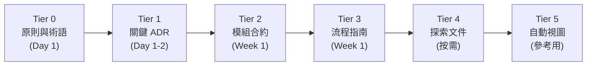
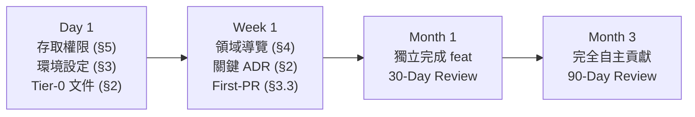

# 團隊入職與知識轉移指南 - [專案名稱]

> **Tier**: 3-process — team onboarding, knowledge transfer, and offboarding runbook

> **⚠️ WORKED EXAMPLE — DELETE BEFORE USE**
> Concrete names below (Backend Developer, SRE, Data Scientist, etc.) come from a
> worked SaaS team example to give AI strong few-shot context. **Replace them with
> your team's actual roles and tooling** when filling for your project. The structure
> (sections, tables, checklists) is what to keep; the example content is what to swap
> or delete.

---

## 1. 角色入職清單（Role-Based Onboarding Checklist）

每個角色依 Day 1 / Week 1 / Month 1 三階段推進。所有角色共用 §3 開發環境設定與 §5 存取權限清單。

### 1.1 Developer

| 階段 | 里程碑 | 驗收標準 |
|---|---|---|
| **Day 1** | 完成環境設定（§3）；取得所有存取權限（§5）；閱讀 tier-0 原則文件 | 本機能 `make dev` 成功啟動服務 |
| **Week 1** | 完成 first-PR exercise（§3.3）；讀完關鍵 ADR；參加領域導覽（§4） | PR 已合併；能口頭解釋系統三大 bounded context |
| **Month 1** | 獨立完成一個 feat 分支從設計到合併；通過 code review 無 CRITICAL issue | 可獨立接 sprint task，不需逐步指導 |

### 1.2 SRE

| 階段 | 里程碑 | 驗收標準 |
|---|---|---|
| **Day 1** | 完成環境設定；取得雲端控制台與監控系統存取 | 能登入 Grafana dashboard 並找到核心服務面板 |
| **Week 1** | 閱讀 `PROC-0009-incident-response`；加入 on-call rotation | 能在模擬場景完成 SEV2 事故回應流程 |
| **Month 1** | 獨立處理一次 on-call 輪值；撰寫第一份 post-mortem | 能獨立執行回滾與告警調整 |

### 1.3 Data Scientist

| 階段 | 里程碑 | 驗收標準 |
|---|---|---|
| **Day 1** | 取得資料倉儲存取；設定 notebook 環境 | 能執行基礎查詢並取得結果 |
| **Week 1** | 閱讀 pipeline 文件與模型卡（MODEL-*） | 能描述現有模型的輸入/輸出與訓練頻率 |
| **Month 1** | 完成一次實驗並記錄於 `EXP-*` | 實驗結果可被他人重現 |

### 1.4 Product

| 階段 | 里程碑 | 驗收標準 |
|---|---|---|
| **Day 1** | 閱讀 tier-0 產品原則與術語表 | 能列出產品三大核心指標 |
| **Week 1** | 參加領域導覽（§4）；閱讀最近 3 份 PRD | 能畫出主要 user flow |
| **Month 1** | 獨立撰寫第一份 PRD 並通過 review | PRD 符合 `PRD-0000` 模板規範 |

---

## 2. 系統地圖導覽（System Map Walkthrough）

新成員依 Context Stability Tiers 順序閱讀文件，由淺入深建立全局理解。

### 2.1 閱讀順序



| 順序 | Tier | 必讀文件 | 說明 |
|---|---|---|---|
| 1 | 0-principles | `GLOS-0000-glossary`、`PRIN-0000-product-principles` | 建立共同語言與世界觀 |
| 2 | 1-decisions | `[列出 3-5 個最重要的 ADR ID]` | 理解「為什麼是這樣」 |
| 3 | 2-contracts | 負責模組的 API contract、DB schema | 理解模組邊界與資料流 |
| 4 | 3-process | `QG-0000-quality-gates`、本文件 | 理解團隊工作流程 |
| 5 | 4-exploration | 最近的 PRD / CIA（僅供背景） | 理解近期方向；不視為事實 |
| 6 | 5-views | `VIEW-0001-project-structure` | 快速瀏覽專案結構；以 code 為準 |

### 2.2 關鍵 ADR 清單（由導師維護）

| ADR ID | 主題 | 為什麼重要 |
|---|---|---|
| `ADR-NNNN` | `[決策主題]` | `[一句話說明影響]` |
| `ADR-NNNN` | `[決策主題]` | `[一句話說明影響]` |
| `ADR-NNNN` | `[決策主題]` | `[一句話說明影響]` |

---

## 3. 開發環境設定（Dev Environment Setup）

### 3.1 前置需求

| 工具 | 最低版本 | 安裝方式 |
|---|---|---|
| Git | 2.40+ | `brew install git` / `apt install git` |
| `[語言 runtime]` | `[版本]` | `[安裝指令或連結]` |
| Docker | 24+ | [官方安裝頁面] |
| `[其他工具]` | `[版本]` | `[安裝方式]` |

### 3.2 Repo Clone & 本機啟動

```bash
git clone [repo-url] && cd [repo-name]
cp .env.example .env              # 向導師取得 secrets 填入
[安裝指令: make install / npm install / poetry install]
[啟動指令: make dev / docker-compose up]
[驗證指令: curl http://localhost:8000/health]
```

### 3.3 First-PR Exercise

新成員在 Week 1 內完成一個小型 PR 以驗證整個開發流程：

1. 從 `dev` 建立分支：`feat/onboard-[你的名字]`
2. 挑選一個標記為 `good-first-issue` 的 ticket
3. 遵循 `git-workflow.md` 的 commit 規範
4. 提交 PR，由導師做 code review
5. 處理 review 意見並合併

---

## 4. 領域知識轉移（Domain Knowledge Transfer）

### 4.1 術語表

所有領域術語定義於 `0-principles/GLOS-0000-glossary`。新成員應在 Day 1 通讀一遍，後續遇到不懂的術語隨時查閱。

### 4.2 Bounded Context 概覽

| Context 名稱 | 職責 | 核心 Entity | 負責團隊 |
|---|---|---|---|
| `[Context A]` | `[一句話描述]` | `[Entity 1, Entity 2]` | `[團隊名稱]` |
| `[Context B]` | `[一句話描述]` | `[Entity 3, Entity 4]` | `[團隊名稱]` |
| `[Context C]` | `[一句話描述]` | `[Entity 5, Entity 6]` | `[團隊名稱]` |

### 4.3 關鍵業務流程

新成員必須在 Week 1 結束前理解以下核心流程：

| Flow ID | 流程名稱 | 涉及 Context | 文件位置 |
|---|---|---|---|
| `BF-NNNN` | `[核心業務流程 1]` | `[Context A → B]` | `2-contracts/BF-NNNN-*.md` |
| `BF-NNNN` | `[核心業務流程 2]` | `[Context B → C]` | `2-contracts/BF-NNNN-*.md` |
| `UF-NNNN` | `[關鍵使用者流程]` | `[Context A]` | `2-contracts/UF-NNNN-*.md` |

---

## 5. 存取權限清單（Access Provisioning Checklist）

由導師或 IT 在 Day 1 完成。每項完成後打勾並記錄核准人。

| 類別 | 資源 | 權限等級 | 完成 | 核准人 |
|---|---|---|---|---|
| 程式碼 | GitHub / GitLab org 加入 | Write | [ ] | `<name>` |
| 程式碼 | 保護分支 reviewer 名單 | — | [ ] | `<name>` |
| CI/CD | GitHub Actions / Jenkins 存取 | Read | [ ] | `<name>` |
| 雲端 | AWS / GCP / Azure console | `[角色]` | [ ] | `<name>` |
| 監控 | Grafana / Datadog dashboard | Viewer | [ ] | `<name>` |
| 監控 | PagerDuty on-call 排班 | Member | [ ] | `<name>` |
| 日誌 | ELK / CloudWatch Logs | Read | [ ] | `<name>` |
| 溝通 | Slack `#dev` `#incident-war-room` `#[team]` | Member | [ ] | `<name>` |
| 專案管理 | Jira / Linear / Notion | Member | [ ] | `<name>` |
| 資料庫 | Production DB（唯讀） | Read-only | [ ] | `<name>` |
| 資料庫 | Staging DB | Read-write | [ ] | `<name>` |

---

## 6. 導師制度（Mentorship）

### 6.1 Buddy 指派

| 欄位 | 值 |
|---|---|
| 新成員 | `<name>` |
| 指定 Buddy | `<name>` |
| 指派日期 | `<YYYY-MM-DD>` |
| Buddy 期限 | 入職後 90 天 |

### 6.2 固定節奏

| 活動 | 頻率 | 時長 | 內容 |
|---|---|---|---|
| 每日 Sync | 前兩週每日 | 15 min | 阻塞問題、當日目標 |
| 每週 1:1 | 每週 | 30 min | 進度回顧、學習收穫、困難點 |
| 30-day Review | 入職後 30 天 | 60 min | 對照 §1 里程碑，評估是否達到「Week 1 完成」水準 |
| 60-day Review | 入職後 60 天 | 60 min | 評估獨立貢獻能力；調整 Buddy 頻率 |
| 90-day Review | 入職後 90 天 | 60 min | 評估是否達到完全自主（§8）；Buddy 正式結束 |

### 6.3 Review 紀錄

每次 review 記錄：日期、達成里程碑（對照 §1）、待改善項目與行動計畫、下階段目標。存入 `docs/4-exploration/` 作為入職追蹤紀錄。

---

## 7. 離職交接流程（Offboarding / Handoff）

### 7.1 知識轉移模板

離職成員在最後兩週內完成以下文件（存入 `docs/4-exploration/`）：

| 區段 | 內容 |
|---|---|
| 基本資訊 | 離職成員、繼任者、日期 |
| 負責模組 | 模組名、關鍵檔案路徑、常見問題、維護要點 |
| 進行中工作 | Ticket ID、狀態、接手人、上下文備註 |
| 未文件化知識 | 只存在腦中、尚未寫入文件的關鍵知識 |

### 7.2 所有權轉移清單

- [ ] 所有負責模組的 `owner` 欄位已更新（code 與文件）
- [ ] On-call rotation 已移除該成員
- [ ] 進行中 PR 已合併或轉交
- [ ] CI/CD pipeline 中的個人 token 已替換為 service account
- [ ] 排程任務 / cron job 的負責人已更新

### 7.3 存取權限撤銷

| 資源 | 撤銷動作 | 完成 | 執行人 |
|---|---|---|---|
| GitHub / GitLab | 移除 org 成員 | [ ] | `<name>` |
| 雲端 console | 移除 IAM 使用者 | [ ] | `<name>` |
| PagerDuty | 移除排班 | [ ] | `<name>` |
| Slack 私有頻道 | 移除成員 | [ ] | `<name>` |
| Production DB | 撤銷存取 | [ ] | `<name>` |
| VPN / SSH key | 撤銷憑證 | [ ] | `<name>` |

---

## 8. 交接完成標準（Definition of "Handoff Done"）

交接完成的最低條件 — 繼任者必須能**獨立**完成以下事項，無需原負責人協助：

| 能力項目 | 驗證方式 | 通過 |
|---|---|---|
| 在本機啟動並除錯負責模組 | 實際操作演示 | [ ] |
| 解釋負責模組的 bounded context 與核心 invariant | 口頭或書面說明 | [ ] |
| 處理負責模組的 SEV3 事故 | 模擬場景演練 | [ ] |
| 獨立完成負責模組的 feat 分支從設計到合併 | 實際 PR 記錄 | [ ] |
| 找到並更新負責模組的相關文件（tier 2-3） | 實際操作 | [ ] |
| 回答「這個模組為什麼這樣設計？」— 能引用正確 ADR | 口頭提問 | [ ] |

全部打勾後，由主管與繼任者雙方簽署確認交接完成。

---

## 入職時間軸總覽



---

## See also

- `0-principles/GLOS-0000-glossary.template.md` — 術語表（§4 領域知識轉移的起點）
- `0-principles/PRIN-0000-product-principles.template.md` — 產品原則（Day 1 必讀）
- `1-decisions/ADR-0000-adr.template.md` — ADR 模板（理解歷史決策）
- `3-process/QG-0000-quality-gates.md` — 品質閘門（新成員須理解的 CI/CD 規範）
- `3-process/PROC-0009-incident-response.template.md` — 事故回應指南（SRE 入職必讀）
- `3-process/PROC-0005-deployment-runbook.template.md` — 部署指南（理解部署流程）
- `.claude/rules/context-stability.md` — Stability Tiers 定義（§2 閱讀順序的依據）
- `.claude/rules/git-workflow.md` — Git 工作流規範（§3.3 First-PR 必須遵循）
