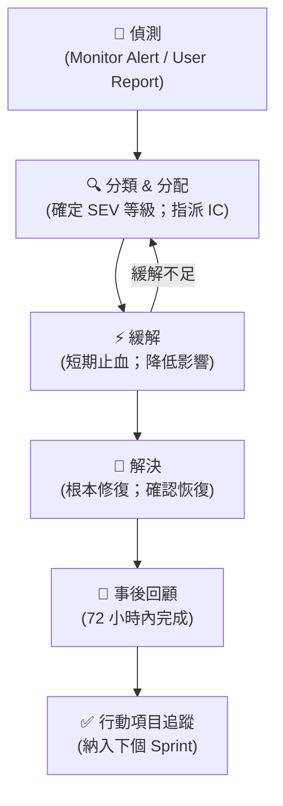

# 事故回應與事後回顧指南 - [專案名稱]

> **Tier**: 3-process — incident response procedure and post-mortem template

---

## 1. 嚴重等級分類（Severity Classification）

| 等級 | 定義 | 典型範例 | 初次回應時間 | 解決時間目標 |
|---|---|---|---|---|
| **SEV1 — 緊急** | 服務完全中斷；核心業務流程無法執行；資料遺失或洩露 | 支付功能全面失效；資料庫主機當機；生產資料洩露 | 5 分鐘 | 2 小時 |
| **SEV2 — 重大** | 核心功能嚴重降級；影響大量使用者；存在資料不一致 | 結帳流程成功率 < 80%；API P99 延遲 > 5 倍正常值 | 15 分鐘 | 4 小時 |
| **SEV3 — 重要** | 非核心功能失效或降級；影響少數使用者；有可用替代方案 | 報表生成失敗；通知服務延遲 > 1 小時 | 1 小時 | 24 小時 |
| **SEV4 — 次要** | 小缺陷；不影響業務；有工作繞過方案 | UI 顯示異常；非關鍵 API 偶發性 404 | 4 小時 | 72 小時 |

### 1.1 升級規則

- 事故超過初始回應時間仍未解決 → 自動升級一級
- 任何資料洩露或資安事件 → 立即升至 SEV1
- 任何法規合規影響 → 立即升至 SEV1 並通知法務

---

## 2. On-Call 結構

### 2.1 輪值排班

| 角色 | 工具 | 輪值週期 |
|---|---|---|
| 主要 On-Call | PagerDuty | 每週輪換 |
| 備援 On-Call | PagerDuty | 每週輪換（主要未回應 5 分鐘後轉至備援） |
| Incident Commander | 工程主管輪值 | 每週（SEV1/SEV2 自動喚醒） |

### 2.2 升級路徑

```
PagerDuty 告警
    │ 5 分鐘未回應
    ▼
備援 On-Call
    │ 15 分鐘未解決（SEV1/2）
    ▼
Incident Commander
    │ 30 分鐘未解決（SEV1）
    ▼
工程主管
    │ 60 分鐘未解決（SEV1，外部 SLA 影響）
    ▼
CTO + 法務（視情況）
```

### 2.3 溝通頻道

| 頻道 | 用途 |
|---|---|
| `#incident-war-room` (Slack) | 即時協調；所有事故參與者 |
| `#incident-updates` (Slack) | 定期更新；向利害關係人廣播 |
| PagerDuty | 告警觸發；通話發起 |
| Zoom / Google Meet | 語音協調（SEV1/SEV2） |
| `status.example.com` | 外部狀態頁；客戶可見 |

---

## 3. 事故生命週期（Incident Lifecycle）



### 3.1 偵測（Detect）

| 來源 | 工具 | 負責人 |
|---|---|---|
| 自動監控告警 | Prometheus + PagerDuty | 自動觸發 On-Call |
| 使用者回報 | 客服 Ticket / Slack `#support` | 客服 → On-Call |
| 內部發現 | Slack `#incident-war-room` | 任何工程師 |

### 3.2 分類（Triage）

On-Call 收到通知後 5 分鐘內完成：

- [ ] 確認問題是否真實（排除監控誤報）
- [ ] 評估影響範圍（受影響使用者數 / 功能）
- [ ] 指定 SEV 等級
- [ ] 建立事故紀錄（PagerDuty incident + Slack thread）
- [ ] 通知 Incident Commander（SEV1/SEV2）

### 3.3 緩解（Mitigate）

目標：**最快速降低使用者影響**，不必是根本解決方案。

常見緩解操作：

| 情境 | 緩解動作 |
|---|---|
| 新部署引發問題 | 立即回滾至前版本 |
| 資料庫過載 | 關閉非關鍵功能；啟用快取；減少查詢 |
| 外部服務失效 | 啟動 Circuit Breaker；顯示降級模式 |
| 流量突增 | 擴展副本數；啟用限流 |
| 錯誤設定 | 更新設定並滾動重啟 |

### 3.4 解決（Resolve）

- [ ] 確認根本原因已修復（或可接受的緩解方案已到位）
- [ ] 驗證所有關鍵指標恢復正常（錯誤率、延遲、吞吐量）
- [ ] 在 PagerDuty 關閉 incident
- [ ] 發布最終「已解決」狀態頁更新
- [ ] 在 Slack 宣告解決 + 後續 post-mortem 時間

---

## 4. 溝通協議（Communication Protocol）

### 4.1 狀態頁更新頻率

| 等級 | 首次更新 | 後續更新頻率 |
|---|---|---|
| SEV1 | 偵測後 10 分鐘內 | 每 30 分鐘 |
| SEV2 | 偵測後 30 分鐘內 | 每 1 小時 |
| SEV3 | 偵測後 2 小時內 | 每 4 小時 |
| SEV4 | 視情況（通常不需要） | — |

### 4.2 對外溝通模板

**初始通知**:

```
[狀態: 調查中] 我們正在調查影響 [功能名稱] 的問題。
受影響：[描述受影響範圍]
我們將在 [時間] 前提供更新。
```

**進度更新**:

```
[狀態: 已識別 / 緩解中] 我們已識別到問題根因 [簡述]，
目前正在 [緩解措施]。預計在 [時間] 前恢復正常。
部分使用者可能仍遇到 [具體症狀]。
```

**解決通知**:

```
[狀態: 已解決] 影響 [功能] 的事故已於 [時間] 解決。
根本原因：[一句話摘要]
我們將進行完整的事後回顧，並會分享更新。
```

### 4.3 利害關係人通知

| 情境 | 通知對象 | 時機 |
|---|---|---|
| SEV1 | 工程主管、PM、客戶成功 | 確認 SEV1 後 15 分鐘內 |
| SEV1（外部 SLA 影響） | 以上 + 法務 + 銷售主管 | 確認後立即 |
| SEV2 | 工程主管、PM | 確認 SEV2 後 30 分鐘內 |
| 資安事故 | 以上 + CISO + 法務 | 立即 |

---

## 5. 事後回顧模板（Post-Mortem Template）

> **填寫時機**：事故解決後 72 小時內完成。SEV1 需同步進行口頭 review 會議。

---

### 事故摘要

| 欄位 | 值 |
|---|---|
| 事故 ID | `INC-NNNN` |
| 嚴重等級 | SEV_ |
| 發生時間 | `YYYY-MM-DD HH:mm UTC` |
| 解決時間 | `YYYY-MM-DD HH:mm UTC` |
| 總持續時間 | `X 小時 Y 分鐘` |
| 影響範圍 | `<受影響使用者數 / 功能 / 交易>` |
| Incident Commander | `<name>` |
| 撰寫人 | `<name>` |
| Review 日期 | `<YYYY-MM-DD>` |

---

### 5.1 事故時間軸

| 時間 (UTC) | 事件描述 | 處理人 |
|---|---|---|
| HH:mm | 問題開始（推測或確認） | 自動 / 使用者 |
| HH:mm | 監控告警觸發 | PagerDuty |
| HH:mm | On-Call 收到通知並開始調查 | `<name>` |
| HH:mm | 確認問題並宣告 SEV_ | `<name>` |
| HH:mm | 識別根本原因 | `<name>` |
| HH:mm | 實施緩解措施 | `<name>` |
| HH:mm | 服務開始恢復 | — |
| HH:mm | 確認完全恢復；宣告解決 | `<name>` |

---

### 5.2 根本原因（Root Cause）

**一句話摘要**：`<簡潔描述根本原因>`

**詳細說明**：

`<描述導致事故的技術或流程根本原因；應回答「為什麼這個問題會發生？」而非只描述症狀>`

**為何未被提前偵測？**

`<說明監控、測試或部署流程哪裡沒有攔截到這個問題>`

---

### 5.3 貢獻因素（Contributing Factors）

> 事故通常由多個因素共同造成，而非單一原因。

| 因素類型 | 描述 |
|---|---|
| 技術因素 | `<e.g. 缺乏輸入驗證、race condition、設定錯誤>` |
| 流程因素 | `<e.g. 部署沒有 canary 測試、code review 漏掉>` |
| 系統因素 | `<e.g. 告警閾值設定不當、監控盲點>` |
| 人為因素 | `<e.g. 疲勞、時間壓力、知識缺口>` |

---

### 5.4 行動項目（Action Items）

> 每項行動項目需有明確的 Owner、截止日期，並納入 Sprint 追蹤。

| 優先級 | 項目描述 | Owner | 截止日期 | Ticket |
|---|---|---|---|---|
| P0（防止再發） | `<具體措施>` | `<name>` | `<YYYY-MM-DD>` | `#NNNN` |
| P1（降低影響） | `<具體措施>` | `<name>` | `<YYYY-MM-DD>` | `#NNNN` |
| P2（長期改善） | `<具體措施>` | `<name>` | `<YYYY-MM-DD>` | `#NNNN` |

---

### 5.5 做得好的事（What Went Well）

`<記錄在此次事故中有效的流程、工具或團隊行為；這些同樣值得學習和保留>`

---

## 6. 無責文化指導方針（Blameless Culture Guidelines）

### 我們討論什麼

- 什麼系統、流程或工具**沒有提供足夠的保護**？
- 人們在當時擁有的信息下，做出了什麼合理決策？
- 什麼環境因素讓錯誤成為可能？
- 如何改變系統讓同樣的錯誤**更難發生**？

### 我們不討論什麼

- 誰犯了錯（公開指責）
- 「他應該知道更好」的假設
- 「這是顯而易見的」的事後諸葛
- 任何可能妨礙下次坦誠回報的言論

### 主持人規則

- 任何歸咎個人的陳述，主持人應立即轉向系統性問題
- 「五個為什麼」技術：每個原因問「為什麼」直到找到系統性因素
- 行動項目針對系統，不針對人

---

## 7. 指標與回顧（Metrics & Review）

### 7.1 事故指標追蹤

| 指標 | 定義 | 計算方式 |
|---|---|---|
| MTTD（平均偵測時間） | 問題開始到告警觸發的時間 | `告警時間 - 問題開始時間` |
| MTTR（平均回復時間） | 問題開始到完全解決的時間 | `解決時間 - 問題開始時間` |
| 事故頻率 | 每月各 SEV 等級事故數 | 月度計數 |
| 告警精準率 | 有效告警 / 總告警數 | 降低誤報 |

### 7.2 月度指標目標

| 指標 | 目標值 | 量測視窗 |
|---|---|---|
| SEV1 MTTR | < 2 小時 | 滾動 90 天 |
| SEV2 MTTR | < 4 小時 | 滾動 90 天 |
| MTTD（SEV1） | < 5 分鐘 | 滾動 90 天 |
| 告警精準率 | > 80% | 月度 |
| 行動項目完成率（P0） | 100% in 7 天 | 每次事故 |

### 7.3 回顧節奏

| 活動 | 頻率 | 參與者 | 產出 |
|---|---|---|---|
| 事後回顧 | 每次 SEV1/SEV2 事故後 72 小時內 | IC + 相關工程師 + EM | post-mortem 文件 |
| 月度事故回顧 | 每月 | SRE + EM | 趨勢分析；行動項目追蹤 |
| 重複事故回顧 | 同類事故發生 ≥ 3 次 | SRE + EM + 架構師 | 系統性改善方案 + ADR |
| On-Call 負擔審查 | 每季 | SRE + EM | 告警調整；輪值優化 |

---

## See also

- `2-contracts/SLO-0000-slo-spec.template.md` — SLO 目標與錯誤預算政策
- `1-decisions/ARCH-0003-infra-architecture.template.md` — 基礎設施 DR 流程
- `3-process/PROC-0005-deployment-runbook.template.md` — 部署回滾程序
- `3-process/QG-0000-quality-gates.md` — 部署品質閘門（防止問題進入生產）
- `4-exploration/CIA-0000-change-impact-analysis.template.md` — 事故後系統性變更需 CIA
- `.claude/rules/change-governance.md` — 事故修復若觸及 flow/contract/architecture → CIA gate
