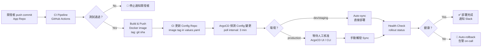

> **⚠️ WORKED EXAMPLE — DELETE BEFORE USE**
> Concrete names below (checkout-api, ArgoCD, Helm, order-platform, etc.) come
> from a worked Kubernetes / microservices example to give AI strong few-shot context. **Replace
> them with your domain's terms** when filling for your project. The structure (sections,
> tables, frontmatter) is what to keep; the example content is what to swap or delete.
> If your domain doesn't fit (VM-based / serverless / bare-metal), the example is still
> useful as a structural reference — copy the shape, change the words.

# GitOps 部署 Runbook — [系統名稱]

> **Tier**: 3-process — GitOps deployment runbook
>
> **Purpose**: 定義以 Git 作為唯一事實來源 (Single Source of Truth) 的部署流程，
> 確保所有環境狀態可審計、可回溯、可重現。
>
> **Why a dedicated template**: GitOps 最常見的失敗模式是「緊急時直接 kubectl apply，
> 之後忘記同步回 Git」。本 Runbook 把每個例外路徑都明確化，確保漂移 (drift) 被偵測並修正。

---

## 1. GitOps 架構

### Repository 結構

| 倉庫 | 用途 | 分支策略 |
|---|---|---|
| **App Repo** (`github.com/org/checkout-api`) | 應用程式原始碼；產出 container image | `main` → release tag |
| **Config Repo** (`github.com/org/order-platform-config`) | K8s manifests / Helm values；GitOps agent 監聽此 repo | `main`（鏡像生產）/ `staging`（staging 環境） |

### 環境對應

| 環境 | Config Repo 分支 | Namespace | 同步模式 |
|---|---|---|---|
| dev | `dev` | `order-dev` | Auto-sync |
| staging | `staging` | `order-staging` | Auto-sync |
| production | `main` | `order-prod` | Manual-sync（需人工核准） |

### Config Repo 目錄結構

```
order-platform-config/
├── apps/
│   ├── checkout-api/
│   │   ├── base/                  # Kustomize base 或 Helm chart ref
│   │   ├── overlays/
│   │   │   ├── dev/
│   │   │   ├── staging/
│   │   │   └── production/
│   │   └── Chart.yaml             # 若使用 Helm
│   └── payment-service/
│       └── ...
├── infrastructure/                # 跨服務共用資源（ingress、cert-manager 等）
└── argocd/                        # ArgoCD Application 定義本身
```

---

## 2. 工具選擇

**本系統選擇**: `ArgoCD v2.10`

| 工具 | 選擇理由 | 不選擇的理由 |
|---|---|---|
| **ArgoCD** ✓ | Web UI + RBAC 完整；GitOps pull-based；CNCF 成熟專案 | — |
| Flux | 更輕量；無 UI（需額外安裝 Weave GitOps） | 團隊已熟悉 ArgoCD UI |
| 手動 kubectl | 無需額外工具 | 無法追蹤漂移；緊急操作難以審計 |

**ArgoCD 安裝位置**: `https://argocd.internal.order-platform.com`
**版本**: `v2.10.3`
**設定**: `argocd/install/argocd-install.yaml`

---

## 3. 部署流程



### CI 更新 Config Repo 的標準指令

```bash
IMAGE_TAG="${GITHUB_SHA::8}"
yq e ".checkout-api.image.tag = \"${IMAGE_TAG}\"" \
   -i apps/checkout-api/overlays/staging/values.yaml
git commit -m "chore(deploy): bump checkout-api to ${IMAGE_TAG} [skip ci]"
git push origin staging
```

---

## 4. 環境升遷

### 升遷流程

```
dev (auto) ──→ staging (auto) ──→ production (manual approval)
```

### 升遷規則

| 來源環境 | 目標環境 | 觸發方式 | 前置條件 | 核准人 |
|---|---|---|---|---|
| dev | staging | App Repo merge to `main` | CI 全綠 | 無（自動） |
| staging | production | 手動發起 PR: staging → main（Config Repo） | Staging 健康 ≥ 24h + QA sign-off | Engineering Lead |

### Canary 百分比遞增（Production）

| 階段 | Canary 流量 | 觀察時間 | 升級條件 |
|---|---|---|---|
| Stage 1 | 5% | 15 min | error rate < 0.5%；P99 < 900ms |
| Stage 2 | 25% | 30 min | 同上 |
| Stage 3 | 50% | 30 min | 同上 |
| Stage 4 (full) | 100% | — | 穩定後移除 canary 設定 |

若任一階段觀察期內指標超標，立即執行 §7 回滾程序。

---

## 5. Helm / Kustomize 配置

**本系統選擇**: `Helm + Kustomize overlays`

### Helm Chart 結構（checkout-api）

```
apps/checkout-api/
├── Chart.yaml
├── values.yaml                    # 預設值（不含環境機密）
├── templates/
│   ├── deployment.yaml
│   ├── service.yaml
│   ├── hpa.yaml
│   └── _helpers.tpl
└── overlays/
    ├── dev/values.yaml            # replica: 1, debug logging
    ├── staging/values.yaml        # replica: 2, staging DB
    └── production/values.yaml     # replica: 5, prod DB ref
```

### Values 覆寫策略

| 層級 | 檔案 | 內容 |
|---|---|---|
| Base | `Chart.yaml > values.yaml` | image repo、port、resource request 預設值 |
| Environment override | `overlays/<env>/values.yaml` | replica count、env-specific config |
| Secret reference | ExternalSecret CRD | 指向 AWS Secrets Manager / Vault；**絕不在 values.yaml 寫明文 secret** |

### Secret 管理

使用 `ExternalSecret` CRD 指向 AWS Secrets Manager / Vault。**絕不在 values.yaml 或 Git 中存放明文 secret。**
Secret 範本：`apps/checkout-api/overlays/production/externalsecret.yaml`

---

## 6. 同步與漂移偵測

### 同步策略

| 環境 | 同步模式 | 說明 |
|---|---|---|
| dev / staging | `automated: {prune: true, selfHeal: true}` | Config Repo 變更後 3 分鐘內自動同步；drift 自動修正 |
| production | `automated: {prune: false}` + 手動 trigger | 禁止自動刪除資源；需人工確認 sync |

### 漂移偵測

- ArgoCD 每 **3 分鐘** poll Config Repo
- 偵測到 `OutOfSync` 狀態時：
  - dev/staging：自動觸發 selfHeal sync
  - production：觸發 Slack 通知至 `#sre-alerts`；**不自動修正**

### 通知設定

透過 `argocd-notifications` 配置 Slack 通知：sync-failed、health-degraded、deployed 三個觸發事件。
通知目標頻道：dev/staging → `#deployments`；production → `#sre-alerts`。
設定範本：`argocd/notifications/argocd-notifications-cm.yaml`

---

## 7. 回滾程序

### 優先使用 Config Repo Revert（標準路徑）

```bash
# 1. Revert 有問題的 commit（保留審計軌跡）
git revert <bad-commit-sha> --no-edit && git push origin main
# 2. 手動觸發 production sync
argocd app sync checkout-api --prune
# 3. 確認回滾完成
argocd app wait checkout-api --health --timeout 300
```

### 緊急 kubectl Override（例外路徑）

> 僅在 ArgoCD 本身故障或 Config Repo 無法存取時使用。**30 分鐘內必須同步回 Config Repo。**

```bash
kubectl rollout undo deployment/checkout-api -n order-prod
# 立即通報 #sre-incidents；30 min 內補開 PR 將實際狀態同步回 Git
```

### 回滾後驗證清單

- [ ] `argocd app get checkout-api` 顯示 `Synced` + `Healthy`
- [ ] `kubectl get pods -n order-prod` 所有 Pod `Running`
- [ ] Grafana 錯誤率回到 < 0.1%
- [ ] 端對端煙霧測試通過（`make smoke-test ENV=production`）
- [ ] 通知 `#engineering` 回滾完成

---

## 8. 存取控制

### ArgoCD RBAC

| 角色 | 可執行操作 | 禁止操作 |
|---|---|---|
| `developer` | 查看所有 App 狀態；同步 dev/staging | 同步 production；刪除 App |
| `sre` | 所有環境 sync；回滾；查看審計日誌 | 修改 RBAC 設定 |
| `admin` | 所有操作（含 RBAC 管理） | — |

RBAC policy 設定於 `argocd/install/argocd-rbac-cm.yaml`；使用 org SSO group 對應角色。

### Production Sync 核准流程

1. SRE 或 Engineering Lead 在 ArgoCD UI 核准 sync
2. 操作記錄自動寫入 ArgoCD audit log
3. Audit log 位置：`argocd.internal.order-platform.com/settings/logs`（保留 90 天）

### 誰可以 sync production

| 職責 | 可否自助 sync |
|---|---|
| Developer | **否** — 需提交 Config Repo PR，由 SRE/Lead 核准 |
| SRE | **是** — 透過 ArgoCD UI 或 `argocd app sync` CLI |
| Engineering Lead | **是** — 同上 |
| 緊急 kubectl override | **所有人** — 但必須立即通報並在 30 分鐘內補同步 |
