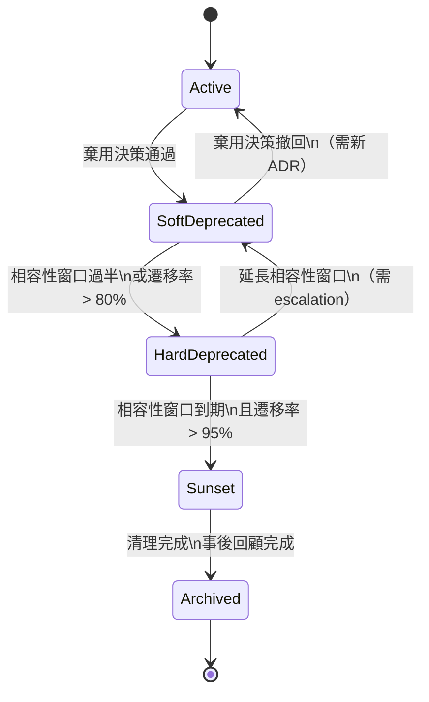

> **WORKED EXAMPLE -- DELETE BEFORE USE**
> Concrete names below (checkout-api v1, Payment Gateway, order-platform, etc.) come
> from a worked API deprecation example to give AI strong few-shot context. **Replace
> them with your domain's terms** when filling for your project. The structure (sections,
> tables, frontmatter) is what to keep; the example content is what to swap or delete.
> If your domain doesn't fit (library / internal tool / data pipeline), the example is still
> useful as a structural reference -- copy the shape, change the words.

# Deprecation & Sunset Playbook -- [專案名稱]

> **Tier**: 3-process -- deprecation lifecycle and sunset execution playbook
>
> **Purpose**: 定義從「決定棄用」到「完全下架」的標準流程，
> 確保每個棄用決策有明確依據、充分溝通、安全遷移路徑、以及乾淨的收尾。
>
> **Why a dedicated template**: 棄用最常見的失敗模式是「宣布棄用但永遠不下架」，
> 導致維護成本持續累積、文件與程式碼的認知負荷不斷膨脹。
> 本 Playbook 強制每個棄用都有明確的時間表與執行 checklist。

---

## 棄用生命週期總覽



---

## 1. 棄用決策標準

在決定棄用前，必須滿足以下**至少兩項**觸發條件：

| 觸發維度 | 門檻 | 量測方式 |
|---|---|---|
| **使用量** | 30 天內 API 呼叫量 < 總流量 5% | APM / API Gateway 統計 |
| **維護成本** | 近 3 個月修復 bug / security patch 佔該模組工時 > 30% | 工時追蹤 / issue 統計 |
| **安全風險** | 依賴的 runtime / library 已 EOL 且無法升級 | `npm audit` / `pip audit` / CVE 掃描 |
| **替代方案成熟度** | 替代方案已上線 > 3 個月且通過相同 SLO | SLO 儀表板 |
| **策略調整** | 產品路線圖明確排除該功能 | PRD / 產品決策會議記錄 |

### 範例判斷

> checkout-api v1 觸發：使用量 < 2%（符合）+ 替代方案 v2 上線 6 個月（符合）
> → 滿足 2 項，啟動棄用流程。

棄用決策必須以 ADR 記錄（`1-decisions/ADR-NNNN-deprecate-<component>.md`），包含觸發條件數據、替代方案指引、影響範圍、核准人。

---

## 2. 棄用等級定義

| 等級 | 名稱 | 行為 | 使用者感知 |
|---|---|---|---|
| **Level 1** | Soft-Deprecation | API 正常運作；回應 header 加入 `Deprecation` + `Sunset` 標頭；文件標記 `status: deprecated` | 開發者在 response header / 文件看到警告 |
| **Level 2** | Hard-Deprecation | API 仍可用但回傳 `Warning` header 附帶倒數天數；新用戶註冊時拒絕使用舊版 endpoint；rate limit 降低 50% | 現有用戶收到明確警告；新用戶被導向新版 |
| **Level 3** | Sunset / Removal | API 回傳 `410 Gone` + 遷移指引 URL；DNS 重導向至遷移文件；移除程式碼與基礎設施 | 功能完全不可用；提供清晰的遷移指引 |

### HTTP Header 範例

```
# Level 1: Soft-Deprecation
Deprecation: Sun, 01 Sep 2026 00:00:00 GMT
Sunset: Mon, 01 Mar 2027 00:00:00 GMT
Link: <https://docs.example.com/migration/checkout-v2>; rel="successor-version"

# Level 2: Hard-Deprecation
Warning: 299 - "checkout-api v1 will be removed in 90 days. Migrate to v2."

# Level 3: Sunset
HTTP/1.1 410 Gone
{"error": "gone", "migration_guide": "https://docs.example.com/migration/checkout-v2"}
```

---

## 3. 相容性窗口策略

| API 版本層級 | 相容性窗口 | Soft-Dep 期間 | Hard-Dep 期間 | 說明 |
|---|---|---|---|---|
| **Major** (v1 → v2) | 12 個月 | 前 6 個月 | 後 6 個月 | 破壞性變更；消費者需重新整合 |
| **Minor** (v1.2 → v1.3) | 6 個月 | 前 3 個月 | 後 3 個月 | 行為變更但 schema 向下相容 |
| **Patch / Internal** | 立即 | 無 | 無 | 內部 refactor；無外部影響 |

### 延長規則

- 最多延長原窗口的 50%（Major: +6 個月、Minor: +3 個月）
- 延長需 Engineering Lead + PM 雙簽
- 延長決策記錄於原 ADR 的 amendment section

---

## 4. 利害關係人溝通計畫

### 通知對象

| 利害關係人 | 通知管道 | 首次通知時機 | 後續提醒頻率 |
|---|---|---|---|
| **外部 API 消費者** | Email + API header + 開發者入口網站公告 | Soft-Dep 第 1 天 | 每月 + Sunset 前 30/14/7/1 天 |
| **內部前端團隊** | Slack `#engineering` + Sprint planning | Soft-Dep 第 1 天 | 每個 Sprint |
| **內部後端團隊** | Slack `#backend` + 依賴圖標記 | Soft-Dep 第 1 天 | 每月 |
| **PM / 業務** | Email + 產品週會 | 棄用決策前 | 每月狀態更新 |
| **SRE / Ops** | Slack `#sre-alerts` + Runbook 更新 | Soft-Dep 第 1 天 | Sunset 前 14 天加強 |
| **客戶成功團隊** | 內部 Knowledge Base 更新 + FAQ | Soft-Dep 第 1 天 | 客戶詢問時 |

### 升級路徑

| 條件 | 升級動作 |
|---|---|
| Hard-Dep 開始時遷移率 < 50% | PM + Engineering Lead 開會評估：加強溝通 or 延長窗口 |
| Sunset 前 30 天遷移率 < 90% | VP Engineering 決策：延長 or 強制執行 |
| 外部高價值客戶明確拒絕遷移 | Account Manager 介入；個案評估 |

---

## 5. 遷移路徑文件

每個棄用元件必須提供遷移文件，存放於 `docs/migrations/` 或開發者入口網站。

### 遷移文件結構

```markdown
# Migration Guide: [舊元件] --> [新元件]

## Breaking Changes Catalog

| ID | 舊行為 | 新行為 | 影響等級 | 遷移方式 |
|----|--------|--------|----------|----------|
| BC-001 | [描述] | [描述] | HIGH/MED/LOW | [步驟] |

## Endpoint Mapping (old --> new)

| 舊 Endpoint | 新 Endpoint | 備註 |
|---|---|---|
| `POST /v1/checkout` | `POST /v2/orders/checkout` | request body schema 變更見 BC-001 |

## Code Examples

### Before (v1)
[程式碼範例]

### After (v2)
[程式碼範例]

## FAQ
- Q: [常見問題]
- A: [解答]
```

### 遷移率追蹤

| 量測指標 | 資料來源 | 目標 |
|---|---|---|
| API 呼叫佔比（v1 vs v2） | API Gateway analytics | v1 < 5% at Sunset |
| 已遷移消費者數量 | Developer portal 註冊資料 | > 95% at Sunset |
| 遷移相關 support ticket | Help desk 統計 | 趨勢下降 |

---

## 6. 資料保留與清理

### 資料分類

| 資料類別 | 保留期限 | 法規依據 | 儲存位置 |
|---|---|---|---|
| **個人識別資料 (PII)** | Sunset 後 30 天內刪除 | GDPR Art. 17 / 個資法 | 加密備份 → 排程清除 |
| **交易紀錄** | Sunset 後保留 7 年 | 商業會計法規 | Cold storage (S3 Glacier) |
| **API 存取日誌** | Sunset 後保留 90 天 | 內部稽核政策 | Log archive |
| **使用者偏好 / 設定** | Sunset 後 30 天內刪除 | GDPR | 加密備份 → 排程清除 |
| **聚合統計資料** | 永久保留（匿名化後） | 無 | Data warehouse |

### 清理排程

| 時間點 | 動作 |
|---|---|
| D+0 (Sunset) | API 回傳 410；停止寫入新資料 |
| D+7 | 最終資料備份（含完整性驗證） |
| D+30 | 刪除 PII + 使用者偏好（GDPR 合規） |
| D+90 | 刪除 API 存取日誌；更新合規報告 |

### GDPR / 個資法 Checklist

- [ ] 資料處理活動記錄 (ROPA) 已更新
- [ ] 隱私政策已反映功能移除
- [ ] 資料處理者 (processor) 已通知停止處理
- [ ] 跨境資料傳輸已停止（若適用）
- [ ] 資料主體權利請求佇列已清空

---

## 7. 下架執行 Checklist

### Pre-Sunset（Sunset 前 14 天）

- [ ] 遷移率確認 > 95%（若未達標，啟動 §4 升級路徑）
- [ ] 最終通知已發送（Email + Slack + 開發者入口網站 banner）
- [ ] SRE 確認監控告警規則已準備切換
- [ ] 回滾計畫已準備（若 Sunset 後發現關鍵依賴遺漏）
- [ ] On-call 人員已知悉 Sunset 時間表

### Sunset Day（D-Day）

- [ ] API endpoint 切換為回傳 `410 Gone` + 遷移指引
- [ ] DNS 設定重導向至遷移文件頁面（保留至少 6 個月）
- [ ] Load balancer / API Gateway 路由規則移除
- [ ] 移除 CI/CD pipeline 中該元件的 build job
- [ ] 相關 Slack 頻道發佈公告

### Post-Sunset（D+7 ~ D+90）

- [ ] 程式碼從 repository 移除（或移至 `archive/` 分支）
- [ ] 資料庫 migration：移除相關 table / column（依 §6 保留規則）
- [ ] 基礎設施資源釋放（compute、storage、domain）
- [ ] 監控 dashboard 與告警規則移除
- [ ] 文件狀態更新為 `status: archived`
- [ ] 依賴圖 (dependency graph) 更新
- [ ] 成本節省驗證：比對基礎設施帳單

### Documentation Archival

- [ ] API 文件標記 `status: archived` 並加入 `superseded-by` 指向
- [ ] 遷移文件保留為永久參考（不刪除）
- [ ] CHANGELOG 記錄 Sunset 事件
- [ ] Traceability Matrix 對應 row 標記完成

---

## 8. 事後回顧

Sunset 完成後 **14 天內**召開回顧會議。

### 回顧議程

| 項目 | 時間 | 說明 |
|---|---|---|
| 數據回顧 | 15 min | 遷移率曲線、support ticket 趨勢、成本節省 |
| 時間表檢討 | 10 min | 實際 vs 計畫時間表；延遲原因 |
| 溝通效果 | 10 min | 哪些管道最有效？遺漏了哪些 stakeholder？ |
| 技術障礙 | 10 min | 遷移中遇到的技術困難與解決方案 |
| 改善項目 | 15 min | 下次棄用流程要改進什麼 |

### 量化指標比較

| 指標 | 棄用前 | Sunset 後 | 差異 |
|---|---|---|---|
| 月維護工時 | [N] hrs | [M] hrs | -[X]% |
| 基礎設施月成本 | $[N] | $[M] | -$[X] |
| 相關 security alert 數 | [N] / month | 0 | -100% |
| 相關 support ticket 數 | [N] / month | [M] / month | -[X]% |
| API 錯誤率（整體） | [N]% | [M]% | [delta] |

### 經驗傳承

回顧結論寫入 `docs/4-exploration/retro-sunset-<component>-<YYYY-MM-DD>.md`，
供未來棄用流程參考。關鍵 pattern 可提煉為對本 Playbook 的修訂建議。

---

## See also

- `1-decisions/ADR-0000-adr.template.md` -- 棄用決策記錄格式
- `2-contracts/API-0000-api-contract.template.md` -- API 合約中的版本管理欄位
- `2-contracts/SLO-0000-slo-spec.template.md` -- 替代方案必須達到相同 SLO
- `3-process/PROC-0009-incident-response.template.md` -- Sunset 當天若出問題的應變流程
- `3-process/QG-0000-quality-gates.md` -- 替代方案上線前須通過 QG
- `4-exploration/CIA-0000-change-impact-analysis.template.md` -- 棄用決策觸發 CIA
- `.claude/rules/change-governance.md` -- 棄用涉及 contract 變動時的治理規則
