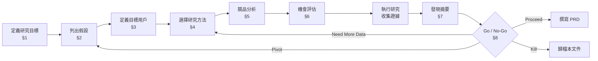
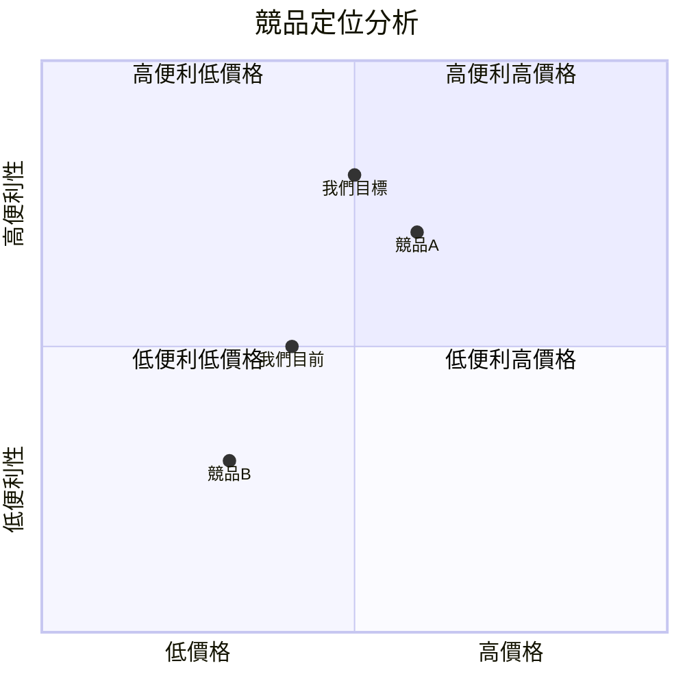

> **WORKED EXAMPLE -- DELETE BEFORE USE**
> Concrete names below (FreshCart, grocery delivery, meal-kit subscribers, etc.) come
> from a worked grocery e-commerce discovery example to give AI strong few-shot context.
> **Replace them with your domain's terms** when filling for your project. The structure
> (sections, tables, frontmatter) is what to keep; the example content is what to swap
> or delete. If your domain doesn't fit (B2B SaaS / developer tools / internal platform),
> the example is still useful as a structural reference -- copy the shape, change the words.

# Discovery & User Research -- [專案名稱]

> **Tier**: 4-exploration -- discovery research document for validating problem space before PRD
>
> **Purpose**: 在投入開發資源之前，透過結構化研究驗證問題是否真實存在、
> 目標用戶是否願意為解決方案付費、以及市場機會是否值得追求。
>
> **Why a dedicated template**: 最常見的產品失敗模式是「跳過 discovery 直接寫 PRD」，
> 導致團隊花 3 個月開發沒人要的功能。本模板強制在 PRD 之前完成最低限度的驗證。

---

## Discovery 流程總覽

---

## 1. 研究目標

| 項目 | 內容 |
|---|---|
| **Discovery ID** | DISC-NNNN |
| **研究主題** | [一句話描述要驗證的核心問題] |
| **發起人** | [PM / Engineering Lead / 其他] |
| **發起日期** | <YYYY-MM-DD> |
| **預計完成日期** | <YYYY-MM-DD> |
| **關聯 OKR / 戰略目標** | [對應的公司或團隊 OKR] |

### 核心問題

> 用一個問句描述本次 discovery 要回答的根本問題。
>
> 範例：「FreshCart 的現有用戶是否願意為『每週自動補貨』功能額外付費？」

### 背景脈絡

> 什麼事件或觀察觸發了這次研究？
>
> 範例：客服資料顯示過去 6 個月有 340 張 ticket 詢問「能不能自動再次下單上次的訂單」，
> 且用戶流失分析顯示「忘記補貨導致轉向競品」是第 2 大流失原因。

---

## 2. 假設清單

列出可證偽 (falsifiable) 的假設。每個假設必須有明確的驗證標準。

| ID | 假設陳述 | 驗證標準 | 驗證方法 | 優先級 |
|---|---|---|---|---|
| H-001 | [如果... 則...] | [什麼數據/證據能證實或推翻] | [§4 中的方法] | P0 / P1 / P2 |
| H-002 | | | | |
| H-003 | | | | |

### 範例

> H-001: 如果提供「每週自動補貨」功能，則 > 30% 活躍用戶會啟用（驗證: 訪談 + Fake Door CTR > 15%）
> H-002: 用戶願付 NT$49/月（驗證: Van Westendorp 「一定訂閱」> 20%）

---

## 3. 目標用戶

### 用戶分群

| 分群 | Persona 描述 | 規模估計 | 招募管道 | 優先級 |
|---|---|---|---|---|
| **Primary** | [核心目標用戶描述] | [人數 / 佔比] | [如何觸及] | Must-have |
| **Secondary** | [次要目標用戶描述] | [人數 / 佔比] | [如何觸及] | Nice-to-have |
| **Excluded** | [明確排除的用戶] | — | — | — |

### 招募標準

| 條件 | 最低要求 |
|---|---|
| 訪談人數 | >= [N] 人（建議 8-12 人） |
| 問卷回收 | >= [N] 份（統計顯著性需求） |
| 分群覆蓋 | Primary 至少 [N]%；Secondary 至少 [N]% |
| 排除條件 | 公司員工、近 30 天內已參與其他研究的用戶 |

---

## 4. 研究方法

勾選適用的方法；每種方法填寫執行細節。

### 方法選擇矩陣

| 方法 | 適用？ | 預計樣本數 | 時間成本 | 負責人 |
|---|---|---|---|---|
| **用戶訪談** | [ ] | [N] 人 | [N] 週 | [姓名] |
| **問卷調查** | [ ] | [N] 份 | [N] 週 | [姓名] |
| **A/B Test / Fake Door** | [ ] | [N] 曝光 | [N] 週 | [姓名] |
| **數據分析（既有）** | [ ] | — | [N] 天 | [姓名] |
| **競品分析** | [ ] | [N] 家競品 | [N] 天 | [姓名] |
| **易用性測試** | [ ] | [N] 人 | [N] 週 | [姓名] |

### 用戶訪談計畫（若適用）

| 項目 | 內容 |
|---|---|
| **訪談形式** | [1-on-1 / 焦點團體 / 遠端 / 實體] |
| **每場時間** | [N] 分鐘 |
| **訪談大綱** | [連結至訪談腳本文件] |
| **記錄方式** | [錄音 + 逐字稿 / 筆記 / 影片] |
| **分析框架** | [親和圖 / 主題分析 / Jobs-to-be-Done] |

### 問卷設計（若適用）

| 項目 | 內容 |
|---|---|
| **發放管道** | [Email / App 內 / 社群媒體] |
| **統計顯著性** | 95% CI, margin of error < [N]% |
| **問卷工具** | [Typeform / Google Forms / SurveyMonkey] |

### A/B Test / Fake Door（若適用）

| 項目 | 內容 |
|---|---|
| **測試假設** | [對應 §2 的 H-NNN] |
| **流量分配** | Control: [N]% / Treatment: [N]% |
| **主要指標** | [點擊率 / 轉換率 / 註冊率] |
| **測試期間** | [N] 天 |

---

## 5. 競品分析

### 競品清單

| 競品 | 類型 | 相關功能 | 定價模式 | 市場定位 |
|---|---|---|---|---|
| [競品 A] | 直接競爭 | [功能描述] | [免費 / 訂閱 / 交易抽成] | [描述] |
| [競品 B] | 間接競爭 | [功能描述] | [定價] | [描述] |
| [競品 C] | 潛在進入者 | [功能描述] | [定價] | [描述] |

### 功能矩陣

| 功能 | 我們 (現況) | 競品 A | 競品 B | 競品 C |
|---|---|---|---|---|
| [功能 1] | [有/無/部分] | [有/無/部分] | [有/無/部分] | [有/無/部分] |
| [功能 2] | | | | |
| [功能 3] | | | | |
| [研究中的新功能] | **無（驗證中）** | | | |

### 競品定位圖

### 關鍵洞察

- [競品觀察 1]
- [競品觀察 2]
- [差異化機會]

---

## 6. 機會評估

### 市場規模估算

| 指標 | 估算值 | 估算方法 | 資料來源 |
|---|---|---|---|
| **TAM** (Total Addressable Market) | $[N] | [自上而下 / 自下而上] | [來源] |
| **SAM** (Serviceable Available Market) | $[N] | [地區 / 語言 / 平台限制] | [來源] |
| **SOM** (Serviceable Obtainable Market) | $[N] | [市佔率假設 × SAM] | [來源] |

> 若為內部工具，改用：潛在受影響用戶數、預估採用率、預估成本節省。

### 投入產出分析

| 項目 | 估算 |
|---|---|
| **開發成本（工時）** | [N] 人週 |
| **維運成本（月）** | $[N] / month |
| **預期回收期** | [N] 個月 |
| **風險調整後 ROI** | [N]x（[樂觀 / 基準 / 悲觀] 情境） |

---

## 7. 發現摘要

研究執行完成後，逐一回填每個假設的驗證結果。

| H-ID | 假設 | 結果 | 信心度 | 關鍵證據 |
|---|---|---|---|---|
| H-001 | [假設陳述] | Validated / Invalidated / Inconclusive | High / Medium / Low | [1-2 句摘要 + 數據] |
| H-002 | | | | |
| H-003 | | | | |

### 意外發現

> 列出研究過程中發現的、不在原始假設中的重要洞察。
>
> 範例：3 位受訪者主動提到希望能「與家人共享購物清單」，這可能是獨立的 discovery 主題。

---

## 8. 行動建議

| 選項 | 條件 | 建議動作 |
|---|---|---|
| **Proceed to PRD** | 所有 P0 假設 Validated + 信心度 >= Medium | 啟動 PRD 撰寫（`4-exploration/PRD-NNNN-<name>.md`） |
| **Pivot** | >= 1 個 P0 假設 Invalidated 但問題空間仍有價值 | 修改假設 → 開新 DISC-NNNN+1 |
| **Kill** | 核心問題不成立 或 機會規模不足 | 歸檔本文件；記錄學到的經驗 |
| **Need More Data** | P0 假設 Inconclusive | 補充研究方法 → 更新 §4 → 重新執行 |

### 本次建議

> **建議動作**: [Proceed / Pivot / Kill / Need More Data]
>
> **理由**: [1-3 句說明]
>
> **下一步**: [具體行動 + 負責人 + 目標日期]

---

## 9. 驗證完成標準

Discovery 被視為「完成」的最低要求。所有項目必須勾選才能進入 PRD 階段。

### Minimum Evidence Checklist

- [ ] 所有 P0 假設都有明確的 Validated / Invalidated / Inconclusive 結論
- [ ] 至少完成 [N] 場用戶訪談（建議 >= 8 場）
- [ ] 訪談涵蓋 Primary 分群的 >= 80% 招募目標
- [ ] 量化數據至少來自一個來源（問卷 / A-B test / analytics）
- [ ] 競品分析至少涵蓋 2 家直接競爭者
- [ ] 機會規模評估已完成（TAM/SAM/SOM 或 internal reach）
- [ ] §8 行動建議已填寫且獲得發起人認可
- [ ] 意外發現已記錄（即使為空，需明確聲明「無意外發現」）

---

## See also

- `4-exploration/PRD-0000-prd.template.md` -- Discovery 完成後的下一步：撰寫 PRD
- `4-exploration/EXP-0000-experiment-log.template.md` -- 若需 A/B test，用此模板記錄實驗
- `4-exploration/CIA-0000-change-impact-analysis.template.md` -- Discovery 結論若觸發架構變更，需 CIA
- `0-principles/PRIN-0000-product-principles.template.md` -- 研究結論須與產品原則一致
- `2-contracts/TM-0000-traceability-matrix.template.md` -- Discovery ID 可追溯至後續 PRD / BDD / API
- `3-process/QG-0000-quality-gates.md` -- Discovery 完成是 Gate 0 的前置條件
