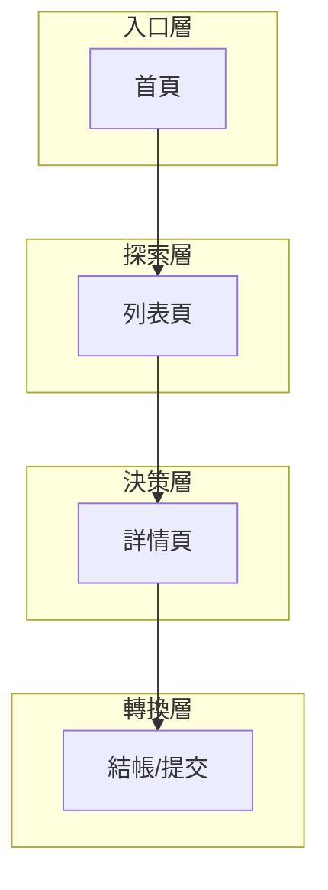

# Frontend Route Map - [專案名稱]

> **Tier**: 5-views → derived from code; treat as cache.
> **Reading rule**: code wins on disagreement. If this view contradicts router config, regenerate.
> **Source**: realigned from `5-views/frontend-information-architecture.template.md` §3+§5+§7+§8 per [ADR-0001](../1-decisions/ADR-0001-frontend-template-tier-realignment.md).
> **Generator**: read router config (e.g. `src/router.tsx` for React Router, `app/` directory for Next.js); produce sections below.

---

## 1. 系統層次結構



## 2. 頁面總覽

| # | 路由 | Page ID | 頁面名稱 | 主要職責 | 層級 |
| :--- | :--- | :--- | :--- | :--- | :--- |
| 0 | `/` | `PG-0000` | 首頁 | [自動填入] | L0 |
| 1 | `/[path]` | `PG-0001` | [名稱] | [自動填入] | L1 |
| 2 | `/[path]` | `PG-0002` | [名稱] | [自動填入] | L2 |

> 詳細頁面職責見 `2-contracts/PC-0000-page-contract.template.md`。本檔只記錄路由樹，不重複合約細節。

**總計:** [N] 頁

---

## 3. 導航結構

### 主導航（從 `[NavConfig]` derive）

| 項目 | 連結 | 顯示條件 |
| :--- | :--- | :--- |
| [名稱] | `/path` | 永遠顯示 |
| [名稱] | `/path` | 登入後 |

### 輔助導航
- 麵包屑規則：[從路由樹自動產生]
- Footer 連結：[從 `[FooterConfig]` derive]
- 側邊欄：[適用頁面範圍]

---

## 4. 路由表（完整）

| 路由 Pattern | 元件 | 認證 | 載入策略 | 對應 PG-* |
| :--- | :--- | :--- | :--- | :--- |
| `/` | `HomePage` | 否 | 預載 | `PG-0000` |
| `/login` | `LoginPage` | 否 | 懶載入 | `PG-0001` |
| `/dashboard` | `DashboardPage` | 是 | 懶載入 | `PG-0002` |

---

## 5. 頁面間資料傳遞（從 store + URL params derive）

| 來源頁面 | 目標頁面 | 傳遞方式 | 資料內容 |
| :--- | :--- | :--- | :--- |
| `[PG-A]` | `[PG-B]` | URL params / Store / Props | [資料描述] |

---

## 6. 命名規範（穩定，不需 regen）

- 小寫、連字符分隔: `/user-profile`
- 資源 ID: `/resources/:id`
- 巢狀資源: `/users/:userId/orders/:orderId`
- 查詢參數用於過濾/排序: `?status=active&sort=-created`

> 命名規範本身屬 tier 1 decision，但因內容極短，於本檔末尾並列引用。完整規範若需擴張，搬到 `1-decisions/url-conventions.template.md`。

---

## 7. Regeneration

```bash
# 範例：從 React Router config 產生本檔
$ npx claude /regenerate-views --target=frontend-route-map
```

不要手動編輯 §1-§5。改 router → regen → commit。
