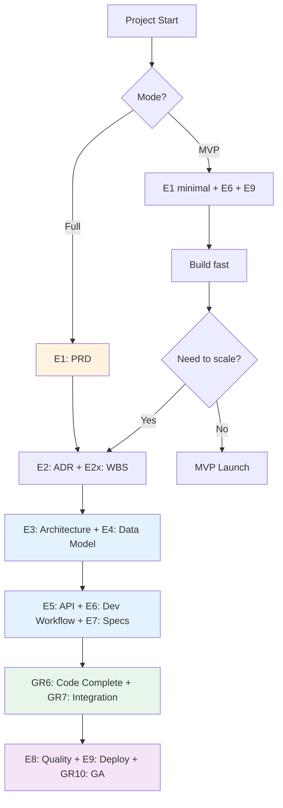

# VibeCoding Workflow Templates -- TR Gate Index

> **Version:** v3.1
> **Updated:** 2026-04-12
> **Framework:** TR0-TR10 Product Development Gates

---

## Quick Start

**New project?** Copy 9 Essential templates (marked **E{N}**) and you have a complete lifecycle.
**Need depth?** Add Extension templates (marked **E{N}x**) only when a gate review requires it.

---

## Naming Convention

```
E{N}--{name}.md      Essential #N -- MUST have at this gate (remove = specific failure class)
E{N}x--{name}.md     Extension of Essential #N -- add when E{N} lacks depth for a gate
GR{N}--{name}.md     Gate Review #N -- validation checklist for TR{N} (confirms readiness, no new artifact)
G--{name}.md          Governance -- cross-cutting process docs
```

---

## TR Gate Map

```
DISCOVER        DEFINE         DESIGN         DEVELOP           DELIVER
TR0  TR1       TR2  TR3      TR4  TR5       TR6    TR7        TR8  TR9  TR10
 |    |         |    |        |    |         |      |          |    |     |
 E1   E1       E2   E3       E5   E6       GR6    GR7         E8   E9   GR10
              E2x   E4      E5x  E6x                              E9x
                    E3x          E7
                                E7x
```

> **E** = Essential (produces artifact) | **GR** = Gate Review (validates existing artifacts)

---

## 9 Essential Templates (Minimum Viable Document Set)

| # | Gate | Template | Purpose | If absent... |
|---|------|----------|---------|--------------|
| **E1** | TR0-TR1 | [E1--prd.md](./00-discover/E1--prd.md) | Problem + Solution + Users + Metrics | Build wrong thing |
| **E2** | TR2 | [E2--adr.md](./01-define/E2--adr.md) | Architecture decisions with rationale | Undocumented tech debt |
| **E3** | TR3 | [E3--architecture.md](./02-design/E3--architecture.md) | System architecture (C4 + DDD + Clean) | Modules don't fit |
| **E4** | TR3 | [E4--data-model.md](./02-design/E4--data-model.md) | ERD + table specs + migration strategy | Data inconsistency |
| **E5** | TR4 | [E5--api-contract.md](./02-design/E5--api-contract.md) | API specification + error handling | Frontend/backend mismatch |
| **E6** | TR5 | [E6--dev-workflow.md](./03-develop/E6--dev-workflow.md) | Dev process + standards + phases | Merge conflicts, chaos |
| **E7** | TR5 | [E7--module-spec-tests.md](./03-develop/E7--module-spec-tests.md) | Module specs + Design by Contract + tests | Ship untested features |
| **E8** | TR8 | [E8--quality-checklist.md](./04-deliver/E8--quality-checklist.md) | Security + quality + production readiness | Vulnerabilities |
| **E9** | TR9 | [E9--deploy-ops.md](./04-deliver/E9--deploy-ops.md) | Deployment + CI/CD + monitoring + rollback | Manual outages |

---

## Extension Templates (Add When Needed)

### 00-discover/ (TR0-TR1)

| Tag | Template | Extends | Purpose |
|-----|----------|---------|---------|
| E1x | [E1x--bdd-guide.md](./00-discover/E1x--bdd-guide.md) | E1 | BDD/Gherkin -- turn PRD into executable acceptance criteria |

### 01-define/ (TR2)

| Tag | Template | Extends | Purpose |
|-----|----------|---------|---------|
| E2x | [E2x--wbs-plan.md](./01-define/E2x--wbs-plan.md) | E2 | WBS -- work breakdown, timeline, progress tracking |

### 02-design/ (TR3-TR4)

| Tag | Template | Extends | Purpose |
|-----|----------|---------|---------|
| E3x | [E3x--class-relationships.md](./02-design/E3x--class-relationships.md) | E3 | UML class diagrams, SOLID validation |
| E5x | [E5x--frontend-architecture.md](./02-design/E5x--frontend-architecture.md) | E5 | Frontend tech stack, 5-layer design, performance |
| E5x | [E5x--frontend-ia.md](./02-design/E5x--frontend-ia.md) | E5 | User journeys, sitemap, navigation, routing |

### 03-develop/ (TR5-TR7)

| Tag | Template | Extends | Purpose |
|-----|----------|---------|---------|
| E6x | [E6x--project-structure.md](./03-develop/E6x--project-structure.md) | E6 | Directory conventions, file naming |
| E6x | [E6x--file-dependencies.md](./03-develop/E6x--file-dependencies.md) | E6 | Module dependency analysis, coupling risks |
| E6x | [E6x--code-review.md](./03-develop/E6x--code-review.md) | E6 | Code review checklist, refactoring patterns |

### 04-deliver/ (TR8-TR10)

| Tag | Template | Extends | Purpose |
|-----|----------|---------|---------|
| E9x | [E9x--doc-maintenance.md](./04-deliver/E9x--doc-maintenance.md) | E9 | Documentation standards, knowledge preservation |

---

## Gate Review Templates (Validation Gates)

These gates validate that existing artifacts work correctly. They don't produce new knowledge -- they confirm readiness.

| GR# | Gate | Template | Validates | If skipped... |
|-----|------|----------|-----------|---------------|
| **GR6** | TR6 | [GR6--code-complete.md](./03-develop/GR6--code-complete.md) | E5, E6, E7 | Ship half-built modules |
| **GR7** | TR7 | [GR7--integration.md](./03-develop/GR7--integration.md) | E6, E7 | Components don't work together |
| **GR10** | TR10 | [GR10--ga-readiness.md](./04-deliver/GR10--ga-readiness.md) | E8, E9 | Silent production degradation |

### _governance/ (Cross-Gate)

| Tag | Template | Purpose |
|-----|----------|---------|
| G | [G--workflow-manual.md](./_governance/G--workflow-manual.md) | Dual-mode process (Full vs MVP), RACI, gate rules |
| G | [G--output-style.md](./_governance/G--output-style.md) | Claude Code output style presets per role |

---

## Usage by Role

| Role | Essential | Extensions |
|------|-----------|------------|
| **PM** | E1, E2x | E1x |
| **Architect** | E2, E3, E4, E5 | E3x |
| **Backend Dev** | E5, E6, E7 | E6x (all 3) |
| **Frontend Dev** | E5, E6, E7 | E5x (both) |
| **Security** | E8 | -- |
| **SRE / Ops** | E9 | E9x |
| **Tech Lead** | All E | G (both) |

---

## Mermaid: Full Process vs MVP



---

## Generalizable Template Kit

To bootstrap ANY new project, copy 9 Essentials + 3 Gate Reviews into `docs/`:

```bash
# 9 Essentials (produce artifacts)
mkdir -p docs/{00-discover,01-define,02-design,03-develop,04-deliver}
cp VibeCoding_Workflow_Templates/00-discover/E1--prd.md docs/00-discover/
cp VibeCoding_Workflow_Templates/01-define/E2--adr.md docs/01-define/
cp VibeCoding_Workflow_Templates/02-design/E3--architecture.md docs/02-design/
cp VibeCoding_Workflow_Templates/02-design/E4--data-model.md docs/02-design/
cp VibeCoding_Workflow_Templates/02-design/E5--api-contract.md docs/02-design/
cp VibeCoding_Workflow_Templates/03-develop/E6--dev-workflow.md docs/03-develop/
cp VibeCoding_Workflow_Templates/03-develop/E7--module-spec-tests.md docs/03-develop/
cp VibeCoding_Workflow_Templates/04-deliver/E8--quality-checklist.md docs/04-deliver/
cp VibeCoding_Workflow_Templates/04-deliver/E9--deploy-ops.md docs/04-deliver/

# 3 Gate Reviews (validate artifacts)
cp VibeCoding_Workflow_Templates/03-develop/GR6--code-complete.md docs/03-develop/
cp VibeCoding_Workflow_Templates/03-develop/GR7--integration.md docs/03-develop/
cp VibeCoding_Workflow_Templates/04-deliver/GR10--ga-readiness.md docs/04-deliver/
```

**9 Essentials + 3 Gate Reviews. 5 folders. Complete product lifecycle.**

Extensions are added ONLY when a gate review says "E{N} lacks detail for this decision."

---

## Version History

### v3.1 (2026-04-12)
- Introduced GR (Gate Review) document type for validation gates
- Added GR6 (Code Complete), GR7 (Integration), GR10 (GA Readiness)
- Fixed phase grouping to align with GATE-MAP.md (TR2+TR3=DEFINE, TR4+TR5=DESIGN)
- Every TR0-TR10 gate now has a corresponding document (E or GR)
- Updated G--workflow-manual.md to reference current template paths

### v3.0 (2026-04-12)
- Restructured to TR0-TR10 gate framework
- Introduced E{N}/E{N}x naming convention
- Added E4--data-model.md (was missing)
- 5 phase folders replace flat 00-17 numbering
- Aligned with docs/GATE-MAP.md

### v2.1 (2025-10-03)
- Added frontend information architecture template

### v2.0 (2025-10-03)
- Initial indexed structure with 18 templates
