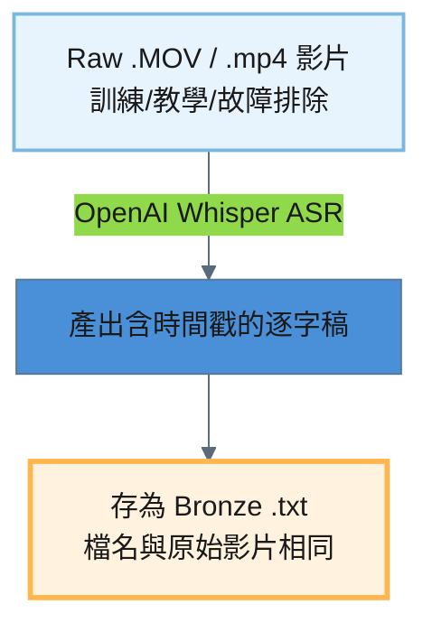
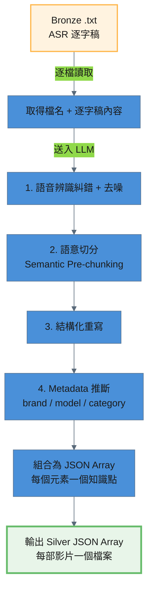

# Video 處理流程

訓練影片從原始 .MOV 檔到產出 Silver JSON，經過兩個 ETL 階段：

```
Raw .MOV → Bronze .txt → Silver JSON
```

---

## 階段一：Raw → Bronze（語音辨識轉錄）

原始訓練影片為 .MOV / .mp4 格式，需透過語音辨識（ASR）將音訊內容轉為文字逐字稿。此階段使用 **OpenAI Whisper** 本地模型進行語音辨識轉錄。

### 處理流程圖



### 處理細節

#### 輸入 / 輸出路徑

| 項目 | 說明 |
|------|------|
| 輸入路徑 | `storage/raw/video/*.MOV` |
| 輸出路徑 | `storage/bronze/video/*.txt` |

#### Bronze 輸出特徵

Bronze .txt 為語音辨識原始輸出，帶有時間戳與口語雜訊：

- 含 `[MM:SS]` 時間戳
- 含語音辨識錯誤（如「掌機賣」應為「掌靜脈」）
- 含口頭禪與拍攝指令（如「要錄喔？」「暫停」）

### 輸出規格

```
[00:00] 好,Chainlock的電子鎖AI99系列、A90系列、未來的AI88系列
[00:13] 這種有觸控螢幕的系列,怎麼樣進入設定?
[00:31] 這個時候你可以掌機賣人臉、密碼、卡片或指紋,五選一
```

---

## 階段二：Bronze → Silver（LLM 糾錯、去噪與結構化重寫）

Bronze .txt 是未經修正的語音辨識逐字稿，充滿 ASR 錯字、口頭禪和拍攝指令。此階段透過 LLM 執行 **Semantic Pre-chunking**（語意前置切塊），具體任務包含：**語音辨識糾錯**、**去噪**、**語意切分與結構化重寫**、**Metadata 推斷**。

### 處理流程圖



### 處理細節

#### 語音辨識糾錯 (ASR Error Correction)

LLM 依據常見錯誤對照表修正語音辨識錯字：

| ASR 錯誤 | 正確用詞 |
|----------|---------|
| 鞋舌 / 鞋匠 | 鎖舌 |
| 掌機賣 / 掌進麥 | 掌靜脈 |
| 收口 | 受口 |
| 連提鎖 | 連體鎖 |
| 密碼版 | 密碼面板 |
| 鎖匠 | 鎖箱 |
| 屍體 | 實體 |
| 卡順 | 卡榫 |

#### 去噪 (Denoising)

移除以下無意義內容：
- **口頭禪**：然後、就是、對、好、那、嗯、齁、OK 等
- **重複句**：假啟動、語句中斷後重說的片段
- **拍攝指令**：「要錄喔？」「暫停」「等一下」等非內容段落
- **時間戳**：`[MM:SS]` 格式標記

#### 結構化重寫 (Structured Rewriting)

LLM 根據內容性質選擇合適的輸出格式：

| 內容性質 | 輸出格式 |
|---------|---------|
| 教學類（setup） | 步驟列表（步驟 1、步驟 2…） |
| 知識解說類（knowledge） | 段落 + 小標題 |
| 故障排除類（troubleshoot） | 問題描述 → 可能原因 → 解決方法 |

#### Metadata 推斷 (Metadata Inference)

| 欄位 | 說明 | 可選值 |
|------|------|--------|
| `brand` | 品牌 | `Dormakaba` / `Chainlock` / `general` |
| `model` | 型號 | `AI99` / `A90` / `AI88` / `general` |
| `category` | 分類 | `setup` / `troubleshoot` / `knowledge` / `specification` |

#### 防呆機制

腳本在收到 LLM 回應後，會**強制覆寫** `source_type` 和 `source` 兩個欄位，防止 LLM 產生幻覺。

### 輸出規格

產出的 Silver JSON 位於 `storage/silver/video/`，每部影片對應一個 JSON 檔案。格式為 **JSON Array**，每個元素為一個獨立知識點。

```json
[
  {
    "content": "當客戶回報電子鎖出現問題時，客服人員應遵循標準作業流程，首先詢問客戶所使用的電子鎖品牌，接著詢問具體型號，以利後續問題診斷。",
    "brand": "general",
    "model": "general",
    "category": "knowledge",
    "source_type": "video",
    "source": "客服問診 SOP 核心.txt",
    "chunk_index": 1
  }
]
```

---

## 全流程摘要

| 階段 | 輸入 | 輸出 | 處理方式 |
|------|------|------|---------|
| Raw → Bronze | `storage/raw/video/*.MOV` | `storage/bronze/video/*.txt` | Whisper ASR 語音辨識 |
| Bronze → Silver | `storage/bronze/video/*.txt` | `storage/silver/video/*.json` | LLM Semantic Pre-chunking |
