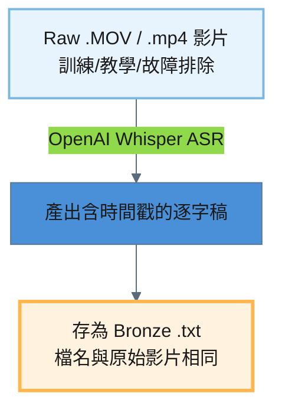
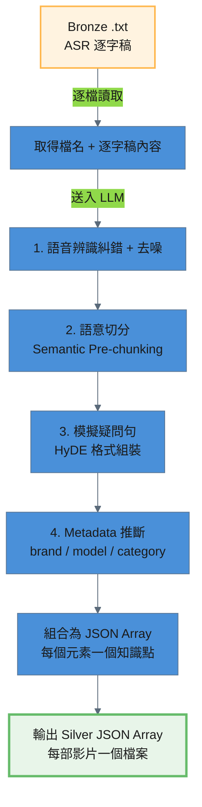

# Video 處理流程

訓練影片從原始 .MOV 檔到進入 pgvector 知識庫，經過三個處理階段：

```
Raw .MOV → Bronze .txt → Silver JSON → Gold (pgvector)
```

---

## 階段一：Raw → Bronze（語音辨識轉錄）

### 1.1 處理策略

原始訓練影片為 .MOV / .mp4 格式，需透過語音辨識（ASR）將音訊內容轉為文字逐字稿。此階段使用 **OpenAI Whisper** 本地模型進行語音辨識轉錄。

**腳本**：`pipeline/raw_to_bronze/process_video.py`

```bash
# 全量處理
python pipeline/raw_to_bronze/process_video.py --verbose

# 單檔處理
python pipeline/raw_to_bronze/process_video.py --file "Chainlock 設定教學.MOV" --verbose

# 強制覆寫已存在的 Bronze 輸出
python pipeline/raw_to_bronze/process_video.py --force --verbose
```

### 1.2 處理流程圖



### 1.3 處理細節

#### 輸入 / 輸出路徑

| 項目 | 說明 |
|------|------|
| 輸入路徑 | `storage/raw/video/*.MOV` |
| 輸出路徑 | `storage/bronze/video/*.txt` |
| 目前檔案數 | 11 部影片 |

#### Bronze 輸出特徵

Bronze .txt 為語音辨識原始輸出，帶有時間戳與口語雜訊：

- 含 `[MM:SS]` 時間戳
- 含語音辨識錯誤（如「掌機賣」應為「掌靜脈」）
- 含口頭禪與拍攝指令（如「要錄喔？」「暫停」）

### 1.4 輸出規格

產出的 Bronze .txt 位於 `storage/bronze/video/`，每部影片對應一個同名 .txt 檔案。

```
[00:00] 好,Chainlock的電子鎖AI99系列、A90系列、未來的AI88系列
[00:13] 這種有觸控螢幕的系列,怎麼樣進入設定?
[00:21] 我們有設定齒輪,點一下,它要進行管理者驗證
[00:31] 這個時候你可以掌機賣人臉、密碼、卡片或指紋,五選一
```

| 欄位 | 說明 | 範例 |
|------|------|------|
| 檔名 | 與原始影片同名，副檔名改為 `.txt` | `Chainlock 設定教學.txt` |
| 內容格式 | `[MM:SS]` 時間戳 + 語音辨識原文 | `[00:00] 好,Chainlock的電子鎖...` |

---

## 階段二：Bronze → Silver（LLM 糾錯、去噪與結構化重寫）

### 2.1 處理策略

Bronze .txt 是未經修正的語音辨識逐字稿，充滿 ASR 錯字、口頭禪和拍攝指令。此階段透過 LLM 執行 **Semantic Pre-chunking**（語意前置切塊），將整份逐字稿依語意邊界拆分為多個獨立知識點，每個知識點包含 **HyDE 格式**（`【常見問題】` + `【知識內容】`）的 `page_content` 與 `raw_text` 純淨摘要。具體任務包含：**語音辨識糾錯**、**去噪**、**語意切分與 HyDE 格式組裝**、**Metadata 推斷**。

**腳本**：`pipeline/bronze_to_silver/process_video.py`

```bash
# 全量處理
python pipeline/bronze_to_silver/process_video.py --verbose

# 單檔處理
python pipeline/bronze_to_silver/process_video.py --file "Chainlock 設定教學.txt" --verbose

# 強制覆寫已存在的 Silver 檔案
python pipeline/bronze_to_silver/process_video.py --force --verbose
```

### 2.2 處理流程圖



### 2.3 處理細節

#### 語音辨識糾錯 (ASR Error Correction)

LLM 依據常見錯誤對照表修正語音辨識錯字：

| ASR 錯誤 | 正確用詞 |
|----------|---------|
| 鞋舌 / 鞋匠 | 鎖舌 |
| 掌機賣 / 掌進麥 | 掌靜脈 |
| 收口 | 受口 |
| 連提鎖 | 連體鎖 |
| 密碼版 | 密碼面板 |
| 鎖匠 | 鎖箱 |
| 屍體 | 實體 |
| 卡順 | 卡榫 |

同時修正其他明顯的語音辨識錯誤。

#### 去噪 (Denoising)

移除以下無意義內容：
- **口頭禪**：然後、就是、對、好、那、嗯、齁、OK 等
- **重複句**：假啟動、語句中斷後重說的片段
- **拍攝指令**：「要錄喔？」「暫停」「等一下」等非內容段落
- **時間戳**：`[MM:SS]` 格式標記

#### 結構化重寫 (Structured Rewriting)

LLM 根據內容性質選擇合適的輸出格式：

| 內容性質 | 輸出格式 |
|---------|---------|
| 教學類（setup） | 步驟列表（步驟 1、步驟 2…） |
| 知識解說類（knowledge） | 段落 + 小標題 |
| 故障排除類（troubleshoot） | 問題描述 → 可能原因 → 解決方法 |

要求保留所有技術細節，使用正式書面中文。

#### Metadata 推斷 (Metadata Inference)

LLM 根據檔名和內容推斷以下欄位：

| 欄位 | 說明 | 可選值 |
|------|------|--------|
| `brand` | 品牌 | `Dormakaba` / `Chainlock` / `general` |
| `model` | 型號 | `AI99` / `A90` / `AI88` / `general` |
| `category` | 分類 | `setup` / `troubleshoot` / `knowledge` / `specification` |

#### 防呆機制

腳本在收到 LLM 回應後，會**強制覆寫** `source_type` 和 `source` 兩個欄位，確保客觀事實不受 LLM 幻覺影響：

```python
result["metadata"]["source_type"] = "video"
result["metadata"]["source"] = filepath.name
```

### 2.4 LLM 設定

LLM provider 和 model 由 `config.toml` 的 `[pipelines.video]` 區塊控制。LLM 回應使用 JSON Schema 約束（structured output），確保輸出格式一致。API 呼叫間隔 1 秒以避免 rate limit。

### 2.5 輸出規格

產出的 Silver JSON 位於 `storage/silver/video/`，每部影片對應一個 JSON 檔案，檔名為 `{影片名稱}.json`。格式為 **JSON Array**，每個元素為一個獨立知識點。

```json
[
  {
    "page_content": "【常見問題】\n我的電子鎖壞掉了，客服會先問我什麼？\n為什麼客服人員要先問電子鎖的品牌和型號？\n\n【知識內容】\n當客戶回報電子鎖出現問題時，客服人員應遵循標準作業流程，首先詢問客戶所使用的電子鎖品牌，接著詢問具體型號，以利後續問題診斷。",
    "metadata": {
      "brand": "general",
      "model": "general",
      "category": "knowledge",
      "source_type": "video",
      "source": "客服問診 SOP 核心.txt",
      "chunk_index": 1,
      "raw_text": "當客戶回報電子鎖出現問題時，客服人員應遵循標準作業流程，首先詢問客戶所使用的電子鎖品牌，接著詢問具體型號，以利後續問題診斷。"
    }
  }
]
```

| 欄位 | 說明 | 範例 |
|------|------|------|
| `page_content` | HyDE 格式：`【常見問題】` + 模擬疑問句 + `【知識內容】` + 純淨摘要 | `【常見問題】\n我的電子鎖壞掉了...` |
| `metadata.brand` | LLM 推斷的品牌 | `general` |
| `metadata.model` | LLM 推斷的型號 | `general` |
| `metadata.category` | LLM 推斷的分類 | `knowledge` |
| `metadata.source_type` | 固定為 `video`（腳本強制覆寫） | `video` |
| `metadata.source` | 對應的 Bronze .txt 檔名（腳本強制覆寫） | `客服問診 SOP 核心.txt` |
| `metadata.chunk_index` | 該知識點在原始文件中的序號 | `1` |
| `metadata.raw_text` | 純淨知識摘要（供 Agent 回答使用） | `當客戶回報電子鎖出現問題時...` |

---

## 階段三：Silver → Gold（向量化寫入 pgvector）

### 3.1 處理策略

Silver JSON 已是 LLM 語意前置切塊後的 Document Array，每個元素為一個獨立知識點。此階段直接將 JSON Array 轉為 LangChain Documents，經 Embedding 向量化後寫入 pgvector。

**腳本**：`pipeline/silver_to_gold/seed_pgvector.py`

```bash
# 單一資料源寫入
python pipeline/silver_to_gold/seed_pgvector.py --database video --reset --verbose

# 全部資料源一次寫入
python pipeline/silver_to_gold/seed_pgvector.py --all --reset --verbose

# 單檔驗證
python pipeline/silver_to_gold/seed_pgvector.py --database video --file "客服問診 SOP 核心.json" --verbose
```

### 3.2 處理流程圖

```mermaid
---
config:
  layout: dagre
  theme: base
  themeVariables:
    primaryColor: '#4A90D9'
    primaryTextColor: '#1a1a1a'
    lineColor: '#5A6A7A'
---
graph TD
    A[Silver JSON Array<br/>每個元素一個知識點] -->|載入| B[轉為 LangChain Documents]
    B -->|Vertex AI text-embedding-004| C[向量化 (768 維)]
    C --> D[寫入 pgvector<br/>collection: kb_video]

    style A fill:#E8F5E9,stroke:#66BB6A,stroke-width:2px
    style D fill:#E1BEE7,stroke:#AB47BC,stroke-width:3px
```

### 3.3 處理細節

#### 文件載入
- 讀取 `storage/silver/video/` 下所有 `.json` 檔案
- 每個 JSON 為 Array，展開為多個 `langchain_core.documents.Document`，`metadata` 原封不動保留

#### 向量化與寫入
- Embedding 模型：Vertex AI `text-embedding-004`（768 維）
- 寫入 pgvector collection：`kb_video`
- `--reset` 旗標會先清空 collection 再重建

### 3.4 config.toml 設定

```toml
[databases.video]
type = "pgvector"
collection_name = "kb_video"
source_dir = "video"
connection_uri_env = "PG_VECTOR_URI"
embedding_provider = "vertexai"
embedding_model = "text-embedding-004"
embedding_dimensions = 768
```

### 3.5 驗證

```bash
# 查看 collection 文件數量
docker exec -it lock_AI psql -U lock -d lock_AI_data \
  -c "SELECT c.name, count(e.id) FROM langchain_pg_collection c LEFT JOIN langchain_pg_embedding e ON c.uuid = e.collection_id GROUP BY c.name;"

# 預覽寫入內容
docker exec -it lock_AI psql -U lock -d lock_AI_data \
  -c "SELECT LEFT(document, 80) AS preview, cmetadata->>'source' AS source FROM langchain_pg_embedding WHERE collection_id = (SELECT uuid FROM langchain_pg_collection WHERE name = 'kb_video') LIMIT 5;"
```

---

## 全流程摘要

| 階段 | 輸入 | 輸出 | 處理方式 | 腳本 |
|------|------|------|---------|------|
| Raw → Bronze | `storage/raw/video/*.MOV` | `storage/bronze/video/*.txt` | Whisper ASR 語音辨識 | `pipeline/raw_to_bronze/process_video.py` |
| Bronze → Silver | `storage/bronze/video/*.txt` | `storage/silver/video/*.json` | LLM Semantic Pre-chunking + HyDE | `pipeline/bronze_to_silver/process_video.py` |
| Silver → Gold | `storage/silver/video/*.json` | pgvector `kb_video` | 直接轉 Documents + Embedding 寫入 | `pipeline/silver_to_gold/seed_pgvector.py` |
