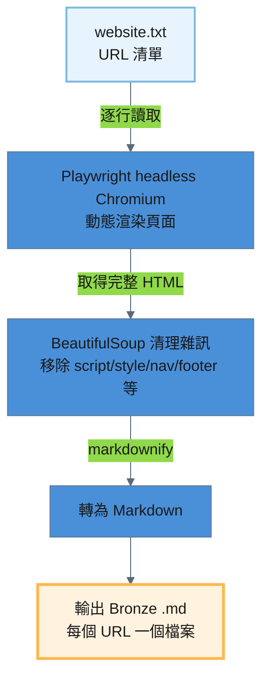
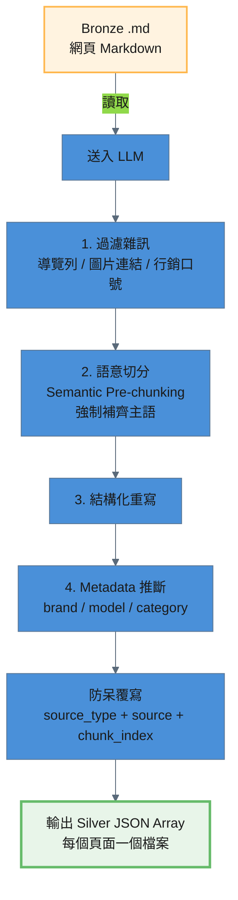

# Website 處理流程

鎖市官網頁面從 URL 清單到產出 Silver JSON，經過三個 ETL 階段：

```
Source (URL 清單) → Raw .txt → Bronze .md → Silver JSON
```

---

## 階段一：Source → Raw（URL 清單）

鎖市官網的 URL 由人工維護於純文字檔案 `storage/raw/website/website.txt`，每行一個 URL，支援 `#` 開頭的註解行與空行。目前共 5 個 URL，皆為鎖市 Wix 官網頁面。

```
https://scsmtw.wixsite.com/locksmartnew
https://scsmtw.wixsite.com/locksmartnew/smartlocksolution
https://scsmtw.wixsite.com/locksmartnew/locksmithsolution
https://scsmtw.wixsite.com/locksmartnew/aboutus
https://scsmtw.wixsite.com/locksmartnew/contactus
```

---

## 階段二：Raw → Bronze（Playwright 無頭瀏覽器爬取）

鎖市官網使用 Wix SPA 架構，傳統靜態爬蟲無法取得完整內容，因此必須使用無頭瀏覽器進行動態渲染。讀取 URL 清單後，透過 Playwright（headless Chromium）渲染動態網頁，以 BeautifulSoup 清理 HTML 雜訊，用 markdownify 轉為 Markdown。

### 處理流程圖



### 處理細節

#### 技術要點

1. **動態渲染**：使用 Playwright headless Chromium，以 `domcontentloaded` + `wait_for_selector("body")` + 5 秒延遲確保 Wix SPA 內容完整載入
2. **HTML 清理**：BeautifulSoup 移除雜訊標籤（`script` / `style` / `nav` / `footer` / `header` / `aside`）及特定 ID/class（`SITE_FOOTER` / `SITE_HEADER`）
3. **Markdown 轉換**：markdownify 將清理後的 HTML 轉為 ATX 風格 Markdown，並清理多餘空行
4. **檔名規則**：URL 去除協定前綴後，將 `/` 和 `.` 替換為 `_`（例：`scsmtw_wixsite_com_locksmartnew_contactus`）
5. **冪等機制**：若檔案已存在則自動跳過，使用 `--force` 可強制覆寫

---

## 階段三：Bronze → Silver（Semantic Pre-chunking）

Bronze Markdown 含有大量網頁雜訊殘留（導覽列文字、圖片連結、行銷口號）。此階段透過 LLM 執行 **Semantic Pre-chunking**，過濾雜訊後將有價值的內容拆分為多個獨立知識點。

### 處理流程圖



### 處理細節

#### Semantic Pre-chunking

LLM 接收網頁 Markdown 內容，執行以下任務：
- 過濾網頁雜訊（導覽列殘留文字、圖片連結 / alt text、行銷口號、社群媒體連結、頁尾版權聲明）
- 依語意邊界將內容拆分為多個獨立知識點
- 每個知識點必須自帶完整主語（「鎖市」或產品名稱），不能只寫「營業時間為...」
- 產出 `{ "chunks": [...] }` 包裝格式，支援空陣列處理無價值頁面

#### Metadata 推斷

| 欄位 | 說明 | 可選值 |
|------|------|--------|
| `brand` | 品牌 | `鎖市` / `Chatlock` / `Dormakaba` / `general` |
| `model` | 型號 | `AI-99` / `A90` / `general` |
| `category` | 分類 | `setup` / `troubleshoot` / `knowledge` / `specification` |

#### 防呆機制

腳本在收到 LLM 回應後，會**強制覆寫** `source_type`、`source`、`chunk_index` 三個欄位，防止 LLM 產生幻覺。

### 輸出規格

產出的 Silver JSON 位於 `storage/silver/website/`，每個頁面對應一個 JSON 檔案。格式為 **JSON Array**，每個元素為一個獨立知識點。

```json
[
  {
    "content": "鎖市的實體地址位於新北市林口區民富街83號1樓，英文地址為1F., No. 83, Minfu St., Linkou Dist., New Taipei City 24408, Taiwan (R.O.C.)。",
    "brand": "鎖市",
    "model": "general",
    "category": "knowledge",
    "source_type": "website",
    "source": "scsmtw_wixsite_com_locksmartnew_contactus.md",
    "chunk_index": 1
  }
]
```

---

## 全流程摘要

| 階段 | 輸入 | 輸出 | 處理方式 |
|------|------|------|---------|
| Source → Raw | 人工維護 URL 清單 | `storage/raw/website/website.txt` | 純文字，每行一個 URL |
| Raw → Bronze | `storage/raw/website/website.txt` | `storage/bronze/website/{url_slug}.md` | Playwright 爬取 + BeautifulSoup 清理 + markdownify |
| Bronze → Silver | `storage/bronze/website/{url_slug}.md` | `storage/silver/website/{url_slug}.json` | Semantic Pre-chunking |
