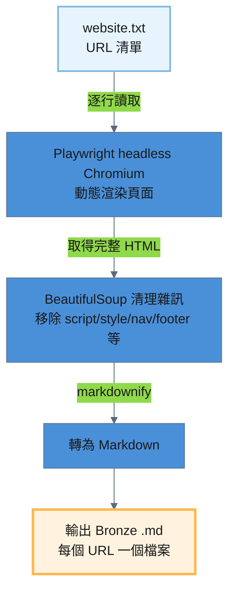
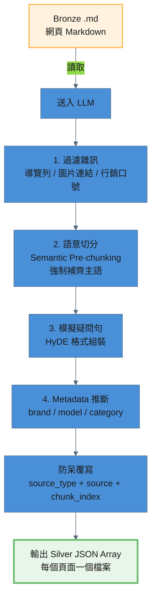

# Website 處理流程

鎖市官網頁面從 URL 清單到進入 pgvector 知識庫，經過四個處理階段：

```
Source (URL 清單) → Raw .txt → Bronze .md → Silver JSON → Gold (pgvector)
```

---

## 階段一：Source → Raw（URL 清單）

### 1.1 處理策略

鎖市官網的 URL 由人工維護於純文字檔案 `storage/raw/website/website.txt`，每行一個 URL，支援 `#` 開頭的註解行與空行。目前共 5 個 URL，皆為鎖市 Wix 官網頁面。

### 1.2 URL 清單內容

```
https://scsmtw.wixsite.com/locksmartnew
https://scsmtw.wixsite.com/locksmartnew/smartlocksolution
https://scsmtw.wixsite.com/locksmartnew/locksmithsolution
https://scsmtw.wixsite.com/locksmartnew/aboutus
https://scsmtw.wixsite.com/locksmartnew/contactus
```

| 項目 | 說明 |
|------|------|
| 檔案路徑 | `storage/raw/website/website.txt` |
| 格式 | 純文字，每行一個 URL |
| 目前 URL 數 | 5 個 |

---

## 階段二：Raw → Bronze（Playwright 無頭瀏覽器爬取）

### 2.1 處理策略

讀取 `website.txt` 中的 URL 清單，透過 Playwright（headless Chromium）渲染動態網頁，以 BeautifulSoup 清理 HTML 雜訊，用 markdownify 轉為 Markdown，存入 `storage/bronze/website/`。

鎖市官網使用 Wix SPA 架構，傳統靜態爬蟲無法取得完整內容，因此必須使用無頭瀏覽器進行動態渲染。

**腳本**：`pipeline/raw_to_bronze/process_website.py`

```bash
# 全量處理
python pipeline/raw_to_bronze/process_website.py --verbose

# 強制覆寫已存在的 Bronze 檔案
python pipeline/raw_to_bronze/process_website.py --force --verbose
```

### 2.2 處理流程圖



### 2.3 處理細節

#### 輸入 / 輸出路徑

| 項目 | 說明 |
|------|------|
| 輸入路徑 | `storage/raw/website/website.txt` |
| 輸出路徑 | `storage/bronze/website/{url_slug}.md` |
| 目前檔案數 | 5 個頁面 |

#### 技術要點

1. **動態渲染**：使用 Playwright headless Chromium，以 `domcontentloaded` + `wait_for_selector("body")` + 5 秒延遲確保 Wix SPA 內容完整載入
2. **HTML 清理**：BeautifulSoup 移除雜訊標籤（`script` / `style` / `nav` / `footer` / `header` / `aside`）及特定 ID/class（`SITE_FOOTER` / `SITE_HEADER`）
3. **Markdown 轉換**：markdownify 將清理後的 HTML 轉為 ATX 風格 Markdown，並清理多餘空行
4. **檔名規則**：URL 去除協定前綴後，將 `/` 和 `.` 替換為 `_`（例：`scsmtw_wixsite_com_locksmartnew_contactus`）

#### 冪等機制

若 `{url_slug}.md` 已存在則自動跳過，不重複爬取。使用 `--force` 可強制覆寫。

#### config.toml 設定

Raw → Bronze 階段不需 LLM，因此 config.toml 無專屬設定區塊。

---

## 階段三：Bronze → Silver（Semantic Pre-chunking + HyDE）

### 3.1 處理策略

Bronze Markdown 含有大量網頁雜訊殘留（導覽列文字、圖片連結、行銷口號）。此階段透過 LLM 執行 **Semantic Pre-chunking**（語意前置切塊），過濾雜訊後將有價值的內容拆分為多個獨立知識點，每個知識點包含 **HyDE 格式**（`【常見問題】` + `【知識內容】`）的 `page_content` 與 `raw_text` 純淨摘要。

**腳本**：`pipeline/bronze_to_silver/process_website.py`

```bash
# 全量處理
python pipeline/bronze_to_silver/process_website.py --verbose

# 單檔處理
python pipeline/bronze_to_silver/process_website.py --file "scsmtw_wixsite_com_locksmartnew_contactus.md" --verbose

# 強制覆寫已存在的 Silver 檔案
python pipeline/bronze_to_silver/process_website.py --force --verbose
```

### 3.2 處理流程圖



### 3.3 處理細節

#### 輸入 / 輸出路徑

| 項目 | 說明 |
|------|------|
| 輸入路徑 | `storage/bronze/website/{url_slug}.md` |
| 輸出路徑 | `storage/silver/website/{url_slug}.json` |
| 目前檔案數 | 5 個頁面 |

#### Semantic Pre-chunking + HyDE

LLM 接收網頁 Markdown 內容，執行以下任務：
- 過濾網頁雜訊（導覽列殘留文字、圖片連結 / alt text、行銷口號、社群媒體連結、頁尾版權聲明）
- 依語意邊界將內容拆分為多個獨立知識點
- 每個知識點必須自帶完整主語（「鎖市」或產品名稱），不能只寫「營業時間為...」
- 為每個知識點產生 2~3 句 HyDE 模擬疑問句
- 產出 `{ "chunks": [...] }` 包裝格式，支援空陣列處理無價值頁面
- 根據內容推斷 `brand`、`model`、`category`

LLM 回應使用 JSON Schema 約束（structured output），確保輸出格式一致。

#### Metadata 推斷

| 欄位 | 說明 | 可選值 |
|------|------|--------|
| `brand` | 品牌 | `鎖市` / `Chatlock` / `Dormakaba` / `general` |
| `model` | 型號 | `AI-99` / `A90` / `general` |
| `category` | 分類 | `setup` / `troubleshoot` / `knowledge` / `specification` |

#### 防呆機制

腳本在收到 LLM 回應後，會**強制覆寫**三個欄位，確保客觀事實不受 LLM 幻覺影響：

```python
meta["source_type"] = "website"
meta["source"] = filepath.name
meta["chunk_index"] = i + 1
```

### 3.4 LLM 設定

```toml
[pipelines.website]
llm_provider = "vertexai"
llm_model = "gemini-2.5-flash"
temperature = 0.3
```

API 呼叫間隔 1 秒以避免 rate limit。

### 3.5 輸出規格

產出的 Silver JSON 位於 `storage/silver/website/`，每個頁面對應一個 JSON 檔案，檔名為 `{url_slug}.json`。格式為 **JSON Array**，每個元素為一個獨立知識點。

```json
[
  {
    "page_content": "【常見問題】\n鎖市的地址在哪裡？\n鎖市的實體店面位於何處？\n我該如何前往鎖市的店面？\n\n【知識內容】\n鎖市的實體地址位於新北市林口區民富街83號1樓，英文地址為1F., No. 83, Minfu St., Linkou Dist., New Taipei City 24408 , Taiwan (R.O.C.)。",
    "metadata": {
      "brand": "鎖市",
      "model": "general",
      "category": "knowledge",
      "source_type": "website",
      "source": "scsmtw_wixsite_com_locksmartnew_contactus.md",
      "chunk_index": 1,
      "raw_text": "鎖市的實體地址位於新北市林口區民富街83號1樓，英文地址為1F., No. 83, Minfu St., Linkou Dist., New Taipei City 24408 , Taiwan (R.O.C.)。"
    }
  }
]
```

| 欄位 | 說明 | 範例 |
|------|------|------|
| `page_content` | HyDE 格式：`【常見問題】` + 模擬疑問句 + `【知識內容】` + 純淨摘要 | `【常見問題】\n鎖市的地址在哪裡？...` |
| `metadata.brand` | LLM 推斷的品牌 | `鎖市` |
| `metadata.model` | LLM 推斷的型號 | `general` |
| `metadata.category` | LLM 推斷的分類 | `knowledge` |
| `metadata.source_type` | 固定為 `website`（腳本強制覆寫） | `website` |
| `metadata.source` | Bronze 檔名（腳本強制覆寫） | `scsmtw_wixsite_com_locksmartnew_contactus.md` |
| `metadata.chunk_index` | 該知識點在原始文件中的序號（腳本強制覆寫） | `1` |
| `metadata.raw_text` | 純淨知識摘要（供 Agent 回答使用） | `鎖市的實體地址位於...` |

---

## 階段四：Silver → Gold（向量化寫入 pgvector）

### 4.1 處理策略

Silver JSON 已是 LLM 語意前置切塊後的 Document Array，每個元素為一個獨立知識點。此階段直接將 JSON Array 轉為 LangChain Documents，經 Embedding 向量化後寫入 pgvector。

**腳本**：`pipeline/silver_to_gold/seed_pgvector.py`（通用腳本，所有資料源共用）

```bash
# 單一資料源寫入
python pipeline/silver_to_gold/seed_pgvector.py --database website --reset --verbose

# 單檔驗證
python pipeline/silver_to_gold/seed_pgvector.py --database website --file "scsmtw_wixsite_com_locksmartnew_contactus.json" --verbose

# 全部資料源一次寫入
python pipeline/silver_to_gold/seed_pgvector.py --all --reset --verbose
```

### 4.2 處理流程圖

```mermaid
---
config:
  layout: dagre
  theme: base
  themeVariables:
    primaryColor: '#4A90D9'
    primaryTextColor: '#1a1a1a'
    lineColor: '#5A6A7A'
---
graph TD
    A[Silver JSON Array<br/>每個元素一個知識點] -->|載入| B[轉為 LangChain Documents]
    B -->|Vertex AI text-embedding-004| C[向量化 (768 維)]
    C --> D[寫入 pgvector<br/>collection: kb_website]

    style A fill:#E8F5E9,stroke:#66BB6A,stroke-width:2px
    style D fill:#E1BEE7,stroke:#AB47BC,stroke-width:3px
```

### 4.3 處理細節

#### 文件載入
- 讀取 `storage/silver/website/` 下所有 `.json` 檔案
- 每個 JSON 為 Array，展開為多個 `langchain_core.documents.Document`，`metadata` 原封不動保留

#### 向量化與寫入
- Embedding 模型：Vertex AI `text-embedding-004`（768 維）
- 寫入 pgvector collection：`kb_website`
- `--reset` 旗標會先清空 collection 再重建

### 4.4 config.toml 設定

```toml
[databases.website]
type = "pgvector"
collection_name = "kb_website"
source_dir = "website"
connection_uri_env = "PG_VECTOR_URI"
embedding_provider = "vertexai"
embedding_model = "text-embedding-004"
embedding_dimensions = 768
```

### 4.5 驗證

```bash
# 查看 collection 文件數量
docker exec -it lock_AI psql -U lock -d lock_AI_data \
  -c "SELECT c.name, count(e.id) FROM langchain_pg_collection c LEFT JOIN langchain_pg_embedding e ON c.uuid = e.collection_id GROUP BY c.name;"

# 預覽寫入內容
docker exec -it lock_AI psql -U lock -d lock_AI_data \
  -c "SELECT LEFT(document, 80) AS preview, cmetadata->>'source' AS source FROM langchain_pg_embedding WHERE collection_id = (SELECT uuid FROM langchain_pg_collection WHERE name = 'kb_website') LIMIT 5;"
```

---

## 全流程摘要

| 階段 | 輸入 | 輸出 | 處理方式 | 腳本 |
|------|------|------|---------|------|
| Source → Raw | 人工維護 URL 清單 | `storage/raw/website/website.txt` | 純文字，每行一個 URL | — |
| Raw → Bronze | `storage/raw/website/website.txt` | `storage/bronze/website/{url_slug}.md` | Playwright 爬取 + BeautifulSoup 清理 + markdownify | `pipeline/raw_to_bronze/process_website.py` |
| Bronze → Silver | `storage/bronze/website/{url_slug}.md` | `storage/silver/website/{url_slug}.json` | Semantic Pre-chunking + HyDE | `pipeline/bronze_to_silver/process_website.py` |
| Silver → Gold | `storage/silver/website/{url_slug}.json` | pgvector `kb_website` | 直接轉 Documents + Embedding 寫入 | `pipeline/silver_to_gold/seed_pgvector.py` |