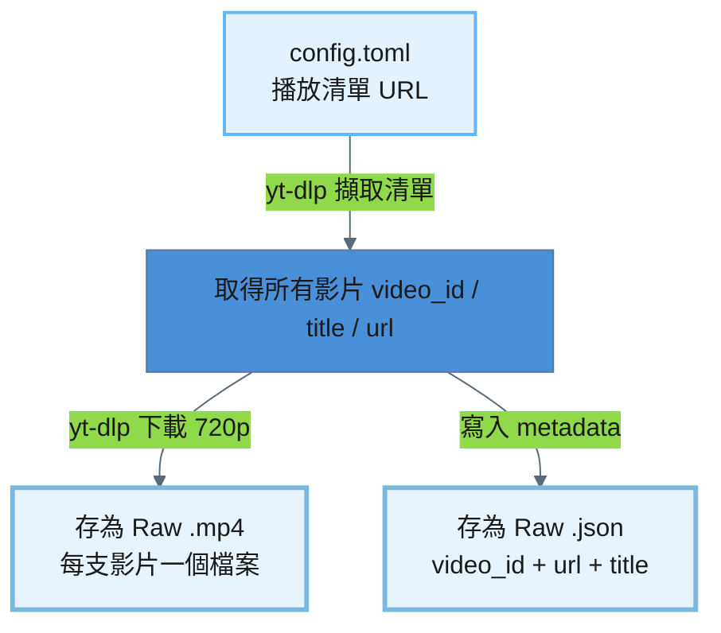
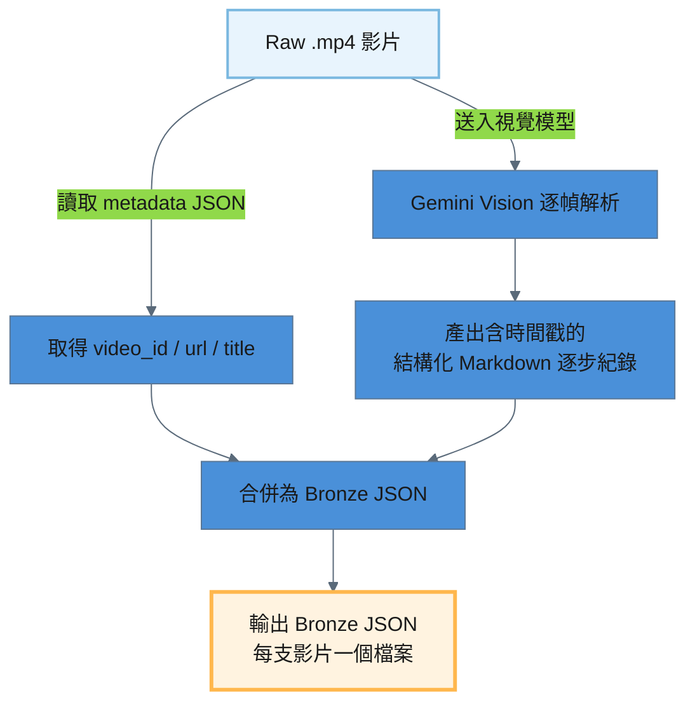
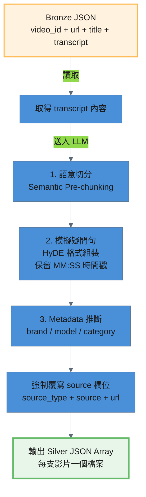

# YouTube 處理流程

YouTube 教學影片從播放清單到進入 pgvector 知識庫，經過四個處理階段：

```
Source (YouTube) → Raw .mp4 → Bronze .json → Silver JSON → Gold (pgvector)
```

---

## 階段一：Source → Raw（下載影片）

### 1.1 處理策略

從 YouTube 播放清單批次下載影片。腳本讀取 `config.toml` 中設定的播放清單 URL，透過 `yt-dlp` 下載 720p 以下的 .mp4 檔案，並為每支影片產生一份 metadata JSON。

**腳本**：`pipeline/source_to_raw/process_youtube.py`

```bash
# 全量下載（依 config.toml 播放清單）
python pipeline/source_to_raw/process_youtube.py --verbose

# 單支影片下載（指定 video_id）
python pipeline/source_to_raw/process_youtube.py --file "Bg3hu2shcVo" --verbose
```

### 1.2 處理流程圖



### 1.3 處理細節

#### 輸入 / 輸出路徑

| 項目 | 說明 |
|------|------|
| 輸入來源 | `config.toml` → `[pipelines.youtube_fetch].playlists` |
| 輸出路徑 | `storage/raw/youtube/{video_id}.mp4` + `{video_id}.json` |
| 目前檔案數 | 3 支影片 |

#### config.toml 設定

```toml
[pipelines.youtube_fetch]
playlists = [
    "https://www.youtube.com/playlist?list=PLAuQE6MOYXNcIGS2l8UPykjMbLEPXCV0f",
]
```

#### 冪等機制

若 `{video_id}.mp4` 已存在則自動跳過，不重複下載。

### 1.4 輸出規格

每支影片產出兩個檔案：

| 檔案 | 說明 | 範例 |
|------|------|------|
| `{video_id}.mp4` | 影片檔案（720p 以下） | `Bg3hu2shcVo.mp4` |
| `{video_id}.json` | Metadata（video_id / url / title） | `Bg3hu2shcVo.json` |

Metadata JSON 格式：

```json
{
  "video_id": "Bg3hu2shcVo",
  "url": "https://www.youtube.com/watch?v=Bg3hu2shcVo",
  "title": "AI-99 清理緩存設定教學"
}
```

---

## 階段二：Raw → Bronze（視覺模型解析）

### 2.1 處理策略

Raw .mp4 影片透過視覺模型（Gemini Vision）逐幀解析，產出含 `[MM:SS]` 時間戳的結構化 Markdown 逐步操作紀錄。視覺模型會擷取畫面上所有文字（APP 介面、按鈕、提示訊息）並描述操作步驟與畫面變化。

**腳本**：`pipeline/raw_to_bronze/process_youtube.py`

```bash
# 全量處理
python pipeline/raw_to_bronze/process_youtube.py --verbose

# 單檔處理
python pipeline/raw_to_bronze/process_youtube.py --file "Bg3hu2shcVo" --verbose

# 強制覆寫已存在的 Bronze 檔案
python pipeline/raw_to_bronze/process_youtube.py --force --verbose
```

### 2.2 處理流程圖



### 2.3 處理細節

#### 輸入 / 輸出路徑

| 項目 | 說明 |
|------|------|
| 輸入路徑 | `storage/raw/youtube/{video_id}.mp4` + `{video_id}.json` |
| 輸出路徑 | `storage/bronze/youtube/{video_id}.json` |
| 目前檔案數 | 3 支影片 |

#### 視覺模型 System Prompt

視覺模型被要求：
1. 每個段落標註 `[MM:SS]` 時間戳記
2. 擷取畫面上出現的所有文字（APP 介面、按鈕文字、提示訊息）
3. 詳細描述操作步驟與畫面變化
4. 使用繁體中文
5. 輸出格式為結構化 Markdown

#### LLM 設定

```toml
[pipelines.youtube_vision]
llm_provider = "vertexai"
llm_model = "gemini-2.5-flash"
temperature = 0.1
```

使用較低的 temperature（0.1）以確保視覺解析的準確性。

### 2.4 輸出規格

產出的 Bronze JSON 位於 `storage/bronze/youtube/`，每支影片對應一個 JSON 檔案。

```json
{
  "video_id": "Bg3hu2shcVo",
  "url": "https://www.youtube.com/watch?v=Bg3hu2shcVo",
  "title": "AI-99 清理緩存設定教學",
  "transcript": "[00:00] 影片開頭，畫面顯示智慧家庭 APP 的主頁面。\n..."
}
```

| 欄位 | 說明 | 範例 |
|------|------|------|
| `video_id` | YouTube 影片 ID | `Bg3hu2shcVo` |
| `url` | 影片完整 URL | `https://www.youtube.com/watch?v=Bg3hu2shcVo` |
| `title` | 影片標題 | `AI-99 清理緩存設定教學` |
| `transcript` | 含 `[MM:SS]` 時間戳的結構化 Markdown 逐步紀錄 | `[00:00] 影片開頭...` |

---

## 階段三：Bronze → Silver（Semantic Pre-chunking + HyDE）

### 3.1 處理策略

Bronze JSON 的 transcript 含有 `[MM:SS]` 時間戳但尚未結構化為知識文件。此階段透過 LLM 執行 **Semantic Pre-chunking**（語意前置切塊），保留 `[MM:SS]` 原始時間戳格式，將整份 transcript 依語意邊界拆分為多個獨立知識點，每個知識點包含 **HyDE 格式**（`【常見問題】` + `【知識內容】`）的 `page_content` 與 `raw_text` 純淨摘要。

**腳本**：`pipeline/bronze_to_silver/process_youtube.py`

```bash
# 全量處理
python pipeline/bronze_to_silver/process_youtube.py --verbose

# 單檔處理
python pipeline/bronze_to_silver/process_youtube.py --file "Bg3hu2shcVo.json" --verbose

# 強制覆寫已存在的 Silver 檔案
python pipeline/bronze_to_silver/process_youtube.py --force --verbose
```

### 3.2 處理流程圖



### 3.3 處理細節

#### 輸入 / 輸出路徑

| 項目 | 說明 |
|------|------|
| 輸入路徑 | `storage/bronze/youtube/{video_id}.json` |
| 輸出路徑 | `storage/silver/youtube/{video_id}.json` |
| 目前檔案數 | 3 支影片 |

#### Semantic Pre-chunking + HyDE

LLM 接收 transcript 內容，執行以下任務：
- 依語意邊界將 transcript 拆分為多個獨立知識點
- 為每個知識點產生 HyDE 格式的 `page_content`（`【常見問題】` + `【知識內容】`）
- **保留 `[MM:SS]` 原始時間戳格式**於知識內容中
- 產出 `raw_text` 純淨摘要（供 Agent 最終回答使用）
- 根據內容推斷 `brand`、`model`、`category`

LLM 回應使用 JSON Schema 約束（structured output），確保輸出格式一致。

#### Metadata 推斷

| 欄位 | 說明 | 可選值 |
|------|------|--------|
| `brand` | 品牌 | `Dormakaba` / `Chainlock` / `general` |
| `model` | 型號 | `AI-99` / `A90` / `general` |
| `category` | 分類 | `setup` / `troubleshoot` / `knowledge` / `specification` |

#### 防呆機制

腳本在收到 LLM 回應後，會**強制覆寫**三個 source 欄位，確保客觀事實不受 LLM 幻覺影響：

```python
result["metadata"]["source_type"] = "youtube"
result["metadata"]["source"] = video_id
result["metadata"]["url"] = url
```

### 3.4 LLM 設定

```toml
[pipelines.youtube_silver]
llm_provider = "vertexai"
llm_model = "gemini-2.5-flash"
temperature = 0.3
```

使用獨立 config 區段（非復用 `youtube_vision`），因為此階段是純文字 LLM，不需要視覺能力，且 temperature 不同（0.3 vs 0.1）。API 呼叫間隔 1 秒以避免 rate limit。

### 3.5 輸出規格

產出的 Silver JSON 位於 `storage/silver/youtube/`，每支影片對應一個 JSON 檔案，檔名為 `{video_id}.json`。格式為 **JSON Array**，每個元素為一個獨立知識點。

```json
[
  {
    "page_content": "【常見問題】\nChatlock AI-99 要怎麼開始邀請家人？\n在 Chatlock AI-99 App 裡，要從哪裡進去設定家庭成員？\n\n【知識內容】\nChatlock AI-99 智慧門鎖應用程式使用者若欲進行家庭成員管理，應首先於應用程式主畫面左上角點擊「房子」圖示，以進入相關設定介面。[00:00]",
    "metadata": {
      "brand": "Chatlock",
      "model": "AI-99",
      "category": "setup",
      "source_type": "youtube",
      "source": "wVtdQLNlmro",
      "url": "https://www.youtube.com/watch?v=wVtdQLNlmro",
      "chunk_index": 1,
      "raw_text": "Chatlock AI-99 智慧門鎖應用程式使用者若欲進行家庭成員管理，應首先於應用程式主畫面左上角點擊「房子」圖示，以進入相關設定介面。[00:00]"
    }
  }
]
```

| 欄位 | 說明 | 範例 |
|------|------|------|
| `page_content` | HyDE 格式：`【常見問題】` + 模擬疑問句 + `【知識內容】` + 純淨摘要（含 `[MM:SS]`） | `【常見問題】\nChatlock AI-99 要怎麼開始邀請家人？...` |
| `metadata.brand` | LLM 推斷的品牌 | `Chatlock` |
| `metadata.model` | LLM 推斷的型號 | `AI-99` |
| `metadata.category` | LLM 推斷的分類 | `setup` |
| `metadata.source_type` | 固定為 `youtube`（腳本強制覆寫） | `youtube` |
| `metadata.source` | YouTube video_id（腳本強制覆寫） | `wVtdQLNlmro` |
| `metadata.url` | 影片完整 URL（腳本強制覆寫） | `https://www.youtube.com/watch?v=wVtdQLNlmro` |
| `metadata.chunk_index` | 該知識點在原始文件中的序號 | `1` |
| `metadata.raw_text` | 純淨知識摘要（供 Agent 回答使用，含 `[MM:SS]`） | `Chatlock AI-99 智慧門鎖應用程式...` |

---

## 階段四：Silver → Gold（向量化寫入 pgvector）

### 4.1 處理策略

Silver JSON 已是 LLM 語意前置切塊後的 Document Array，每個元素為一個獨立知識點。此階段直接將 JSON Array 轉為 LangChain Documents，經 Embedding 向量化後寫入 pgvector。

**腳本**：`pipeline/silver_to_gold/seed_pgvector.py`（通用腳本，所有資料源共用）

```bash
# 單一資料源寫入
python pipeline/silver_to_gold/seed_pgvector.py --database youtube --reset --verbose

# 單檔驗證
python pipeline/silver_to_gold/seed_pgvector.py --database youtube --file "wVtdQLNlmro.json" --verbose

# 全部資料源一次寫入
python pipeline/silver_to_gold/seed_pgvector.py --all --reset --verbose
```

### 4.2 處理流程圖

```mermaid
---
config:
  layout: dagre
  theme: base
  themeVariables:
    primaryColor: '#4A90D9'
    primaryTextColor: '#1a1a1a'
    lineColor: '#5A6A7A'
---
graph TD
    A[Silver JSON Array<br/>每個元素一個知識點] -->|載入| B[轉為 LangChain Documents]
    B -->|Vertex AI text-embedding-004| C[向量化 (768 維)]
    C --> D[寫入 pgvector<br/>collection: kb_youtube]

    style A fill:#E8F5E9,stroke:#66BB6A,stroke-width:2px
    style D fill:#E1BEE7,stroke:#AB47BC,stroke-width:3px
```

### 4.3 處理細節

#### 文件載入
- 讀取 `storage/silver/youtube/` 下所有 `.json` 檔案
- 每個 JSON 為 Array，展開為多個 `langchain_core.documents.Document`，`metadata` 原封不動保留

#### 向量化與寫入
- Embedding 模型：Vertex AI `text-embedding-004`（768 維）
- 寫入 pgvector collection：`kb_youtube`
- `--reset` 旗標會先清空 collection 再重建

### 4.4 config.toml 設定

```toml
[databases.youtube]
type = "pgvector"
collection_name = "kb_youtube"
source_dir = "youtube"
connection_uri_env = "PG_VECTOR_URI"
embedding_provider = "vertexai"
embedding_model = "text-embedding-004"
embedding_dimensions = 768
```

### 4.5 驗證

```bash
# 查看 collection 文件數量
docker exec -it lock_AI psql -U lock -d lock_AI_data \
  -c "SELECT c.name, count(e.id) FROM langchain_pg_collection c LEFT JOIN langchain_pg_embedding e ON c.uuid = e.collection_id GROUP BY c.name;"

# 預覽寫入內容
docker exec -it lock_AI psql -U lock -d lock_AI_data \
  -c "SELECT LEFT(document, 80) AS preview, cmetadata->>'source' AS source FROM langchain_pg_embedding WHERE collection_id = (SELECT uuid FROM langchain_pg_collection WHERE name = 'kb_youtube') LIMIT 5;"
```

---

## 全流程摘要

| 階段 | 輸入 | 輸出 | 處理方式 | 腳本 |
|------|------|------|---------|------|
| Source → Raw | YouTube 播放清單 | `storage/raw/youtube/{video_id}.mp4` + `.json` | yt-dlp 下載 | `pipeline/source_to_raw/process_youtube.py` |
| Raw → Bronze | `storage/raw/youtube/{video_id}.mp4` | `storage/bronze/youtube/{video_id}.json` | Gemini Vision 逐幀解析 | `pipeline/raw_to_bronze/process_youtube.py` |
| Bronze → Silver | `storage/bronze/youtube/{video_id}.json` | `storage/silver/youtube/{video_id}.json` | Semantic Pre-chunking + HyDE | `pipeline/bronze_to_silver/process_youtube.py` |
| Silver → Gold | `storage/silver/youtube/{video_id}.json` | pgvector `kb_youtube` | 直接轉 Documents + Embedding 寫入 | `pipeline/silver_to_gold/seed_pgvector.py` |
