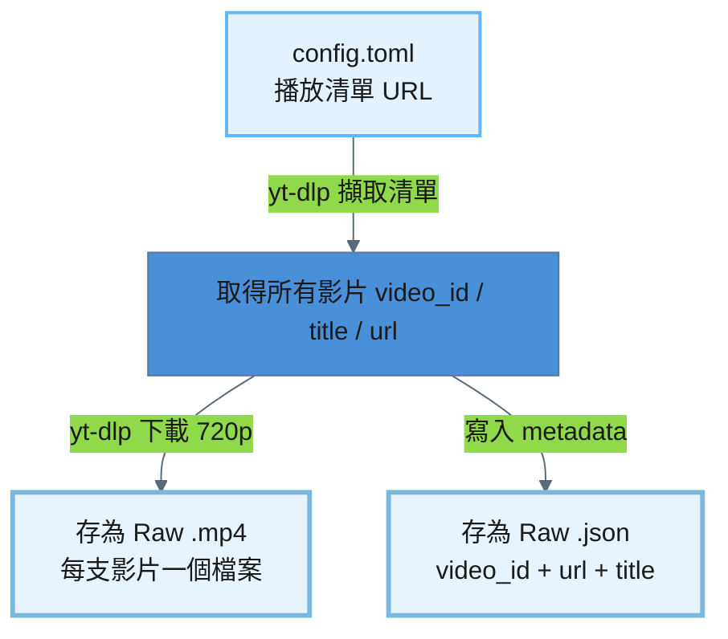
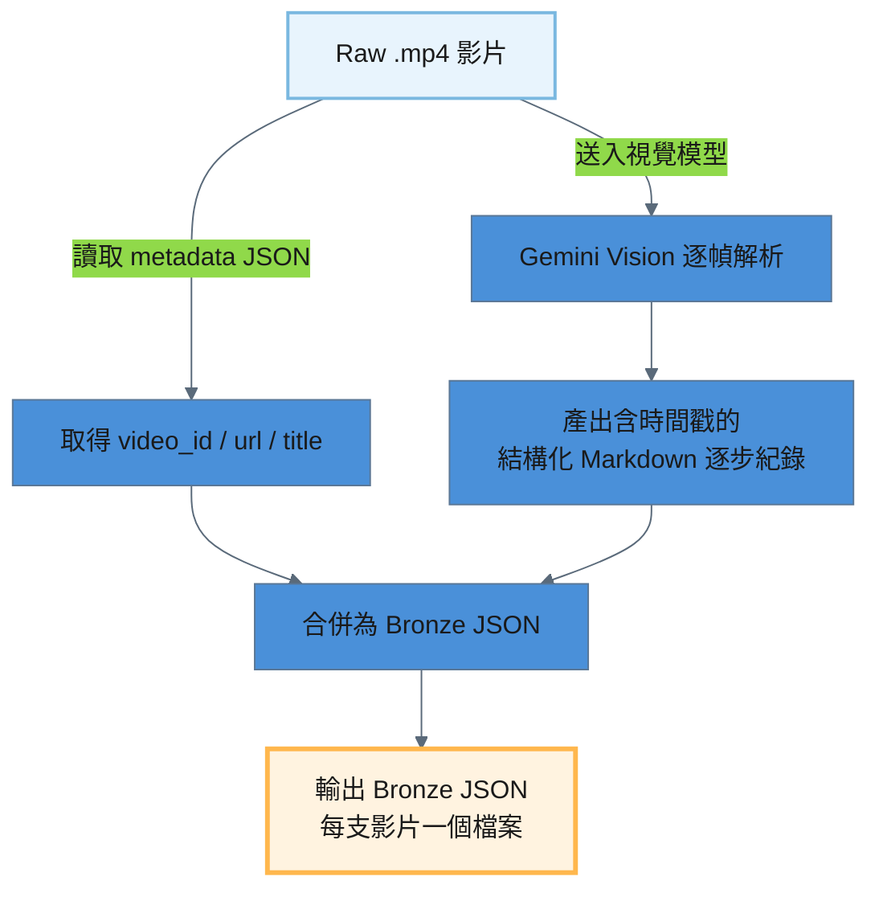
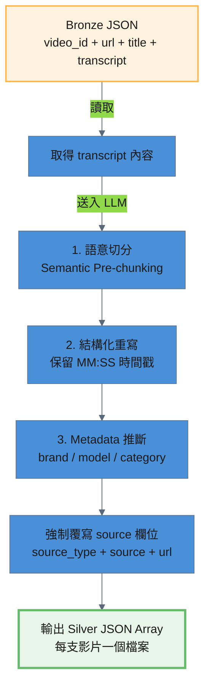

# YouTube 處理流程

YouTube 教學影片從播放清單到產出 Silver JSON，經過三個 ETL 階段：

```
Source (YouTube) → Raw .mp4 → Bronze .json → Silver JSON
```

---

## 階段一：Source → Raw（下載影片）

從 YouTube 播放清單批次下載影片。讀取 `config.toml` 中設定的播放清單 URL，透過 `yt-dlp` 下載 720p 以下的 .mp4 檔案，並為每支影片產生一份 metadata JSON。

### 處理流程圖



### 處理細節

| 項目 | 說明 |
|------|------|
| 輸入來源 | `config.toml` → `[pipelines.youtube_fetch].playlists` |
| 輸出路徑 | `storage/raw/youtube/{video_id}.mp4` + `{video_id}.json` |
| 冪等機制 | 若 `.mp4` 已存在則自動跳過 |

### 輸出規格

每支影片產出兩個檔案：

| 檔案 | 說明 |
|------|------|
| `{video_id}.mp4` | 影片檔案（720p 以下） |
| `{video_id}.json` | Metadata（video_id / url / title） |

---

## 階段二：Raw → Bronze（視覺模型解析）

Raw .mp4 影片透過視覺模型（Gemini Vision）逐幀解析，產出含 `[MM:SS]` 時間戳的結構化 Markdown 逐步操作紀錄。視覺模型會擷取畫面上所有文字（APP 介面、按鈕、提示訊息）並描述操作步驟與畫面變化。

### 處理流程圖



### 處理細節

#### 視覺模型任務

1. 每個段落標註 `[MM:SS]` 時間戳記
2. 擷取畫面上出現的所有文字（APP 介面、按鈕文字、提示訊息）
3. 詳細描述操作步驟與畫面變化
4. 使用繁體中文，輸出格式為結構化 Markdown

使用較低的 temperature（0.1）以確保視覺解析的準確性。

### 輸出規格

產出的 Bronze JSON 位於 `storage/bronze/youtube/`，每支影片對應一個 JSON 檔案。

| 欄位 | 說明 |
|------|------|
| `video_id` | YouTube 影片 ID |
| `url` | 影片完整 URL |
| `title` | 影片標題 |
| `transcript` | 含 `[MM:SS]` 時間戳的結構化 Markdown 逐步紀錄 |

---

## 階段三：Bronze → Silver（Semantic Pre-chunking）

Bronze JSON 的 transcript 含有 `[MM:SS]` 時間戳但尚未結構化為知識文件。此階段透過 LLM 執行 **Semantic Pre-chunking**，保留 `[MM:SS]` 原始時間戳格式，將整份 transcript 依語意邊界拆分為多個獨立知識點。

### 處理流程圖



### 處理細節

#### Semantic Pre-chunking

LLM 接收 transcript 內容，執行以下任務：
- 依語意邊界將 transcript 拆分為多個獨立知識點
- **保留 `[MM:SS]` 原始時間戳格式**於知識內容中

#### Metadata 推斷

| 欄位 | 說明 | 可選值 |
|------|------|--------|
| `brand` | 品牌 | `Dormakaba` / `Chainlock` / `general` |
| `model` | 型號 | `AI-99` / `A90` / `general` |
| `category` | 分類 | `setup` / `troubleshoot` / `knowledge` / `specification` |

#### 防呆機制

腳本在收到 LLM 回應後，會**強制覆寫** `source_type`、`source`、`url` 三個欄位，防止 LLM 產生幻覺。

### 輸出規格

產出的 Silver JSON 位於 `storage/silver/youtube/`，每支影片對應一個 JSON 檔案。格式為 **JSON Array**，每個元素為一個獨立知識點。

```json
[
  {
    "content": "Chatlock AI-99 智慧門鎖應用程式使用者若欲進行家庭成員管理，應首先於應用程式主畫面左上角點擊「房子」圖示，以進入相關設定介面。[00:00]",
    "brand": "Chatlock",
    "model": "AI-99",
    "category": "setup",
    "source_type": "youtube",
    "source": "wVtdQLNlmro",
    "url": "https://www.youtube.com/watch?v=wVtdQLNlmro",
    "chunk_index": 1
  }
]
```

---

## 全流程摘要

| 階段 | 輸入 | 輸出 | 處理方式 |
|------|------|------|---------|
| Source → Raw | YouTube 播放清單 | `storage/raw/youtube/{video_id}.mp4` + `.json` | yt-dlp 下載 |
| Raw → Bronze | `storage/raw/youtube/{video_id}.mp4` | `storage/bronze/youtube/{video_id}.json` | Gemini Vision 逐幀解析 |
| Bronze → Silver | `storage/bronze/youtube/{video_id}.json` | `storage/silver/youtube/{video_id}.json` | Semantic Pre-chunking |
