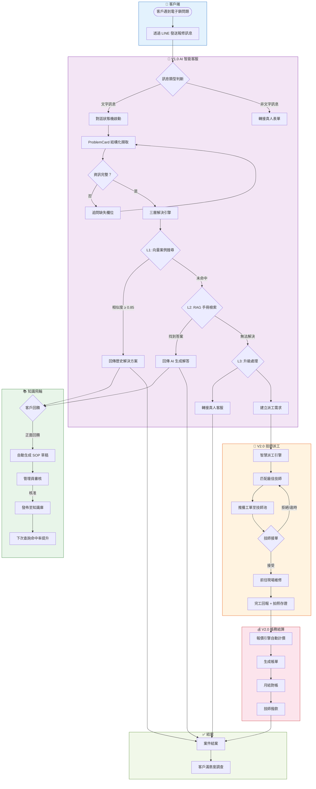
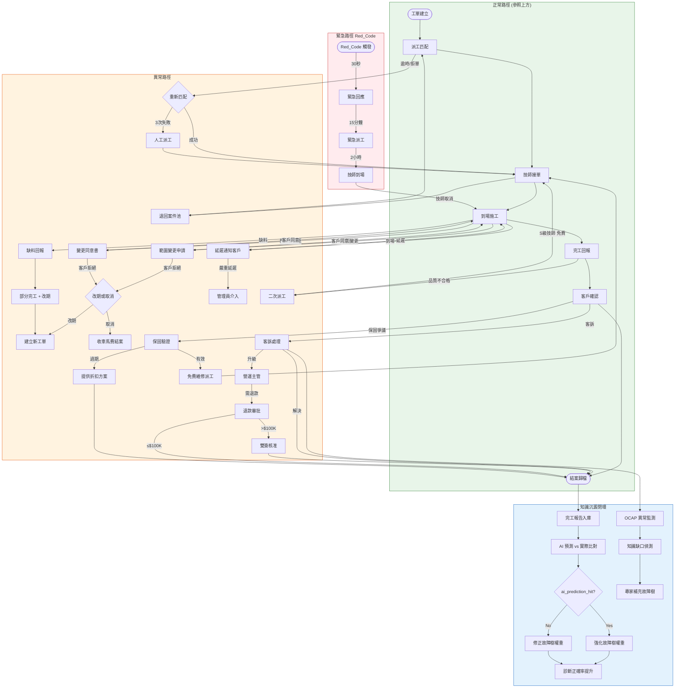

# 01 — Business Process Diagram（業務流程圖）

> **為什麼重要？** 先搞清楚業務怎麼跑，才能確保系統設計貼合實際營運。

## 概述

本圖描繪電子鎖售後服務從「客戶報修 → AI 診斷 → 解決/派工 → 結案」的完整業務流程，涵蓋 V1.0 AI 智能客服與 V2.0 技師派工兩大階段。

---

## 業務流程總覽

---

## 核心業務指標

| 流程環節 | KPI | 目標值 |
|:---------|:----|:------|
| AI 首次回應 | 回應時間 | < 5 秒 |
| L1 案例搜尋 | 命中率 | ≥ 70% |
| L1+L2 自助解決 | 解決率 | ≥ 60% |
| 技師接單 | 接單率 | ≥ 60% |
| 帳單準確度 | 零人工調整率 | ≥ 70% → 95% |
| 整體服務 | 客戶滿意度 | ≥ 4.5 / 5.0 |

---

## 業務角色參與矩陣

| 流程 | 客戶 | AI 系統 | 管理員 | 技師 |
|:-----|:----:|:-------:|:------:|:----:|
| 報修發起 | ●主導 | ○接收 | | |
| 問題診斷 | ○提供資訊 | ●主導 | | |
| 知識庫查詢 | | ●執行 | | |
| SOP 審核 | | ○生成 | ●審核 | |
| 派工分配 | | ●匹配 | ○監控 | ○接收 |
| 現場維修 | ○等待 | | ○追蹤 | ●執行 |
| 帳務結算 | | ●自動化 | ●審核 | ○確認 |

● = 主要負責 ○ = 參與協助

---

## 異常處理業務流程 (Exception Handling Business Process)

本圖描繪從工單建立到結案歸檔過程中，所有可能發生的異常路徑，包含拒單重派、範圍變更、缺料、延遲、品質不合格、客訴、保固爭議、門外觀變更，以及 Red_Code 緊急路徑與知識沉澱閉環。

---

## 異常類型摘要表

| 異常類型 | 觸發點 | 處理方式 | 對應流程 |
|:---------|:-------|:---------|:---------|
| 拒單/逾時 | 派工後 15 分鐘 | 自動重派 → 3 次失敗 → 人工 | Flow 2 |
| 範圍變更 | 技師到場 | 重新報價 → 客戶核准 | Flow 3 |
| 缺料 | 技師到場 | 部分完工 + 改期 | Flow 4 |
| 延遲 | 技師出發後 | 通知客戶新 ETA | Flow 5 |
| 退款 | 客訴/爭議後 | 分級審批 (≤$10K/$100K/>$100K) | Flow 6 |
| 保固爭議 | 客戶主張 | 查交屋日 → 有效/過期/爭議 | Flow 7 |
| 品質不合格 | 完工後 7 天 | S 級技師免費回訪 | Flow 8 |
| 客訴 | 任何時點 | 立案→調查→解決→閉環 | Flow 9 |
| 門外觀變更 | 施工前 | 書面同意 → 方可施工 | Flow 10 |
| Red_Code 緊急 | 被鎖門外等 | 30 秒回應→15 分鐘派工→2 小時到場 | Emergency |
