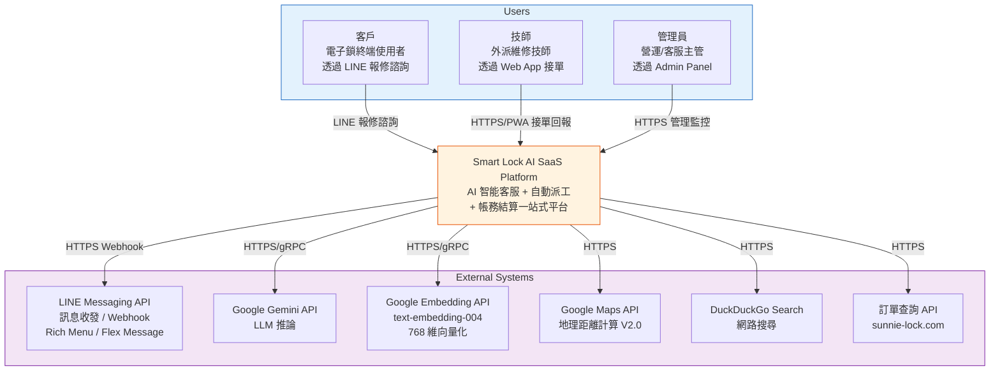
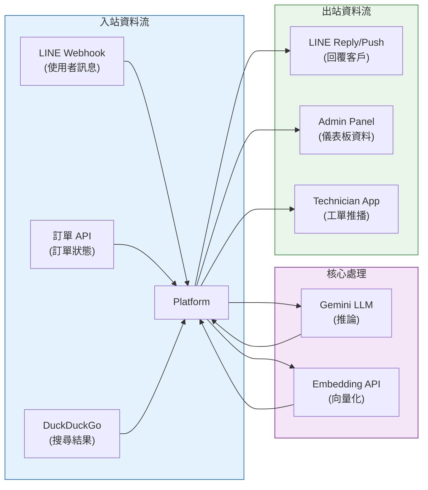

# 03 — System Context Diagram（系統上下文圖）

> **為什麼重要？** 定義系統與外部系統的關係，釐清整合邊界與資料流向。

## 概述

本圖以 C4 Model Level 1 的方式，展示 Smart Lock AI SaaS Platform 與所有外部角色、外部系統之間的關係。

---

## 系統上下文圖

---

## 外部系統整合明細

| 外部系統 | 提供者 | 用途 | 協定 | 風險等級 | 階段 |
|:---------|:------|:-----|:-----|:---------|:-----|
| LINE Messaging API | LINE Corp. | 客戶互動通道（Webhook + Reply/Push） | HTTPS + HMAC-SHA256 | 低 | V1.0 |
| Google Gemini 2.5 Flash | Google | 意圖識別、對話生成、SOP 草稿、ProblemCard 擷取 | HTTPS / gRPC | 中 | V1.0 |
| Google text-embedding-004 | Google | 案例與手冊文本向量化（768 維） | HTTPS / gRPC | 中 | V1.0 |
| Google Maps API | Google | V2.0 地理距離計算、技師路線規劃 | HTTPS | 低 | V2.0 |
| DuckDuckGo Search | DuckDuckGo | 免費網路搜尋（無需 API Key） | HTTPS | 低 | V1.0 |
| 訂單查詢 API | sunnie-lock.com | 外部訂單狀態查詢 | HTTPS + Bearer Token | 中 | V1.0 |

---

## 資料流向摘要

