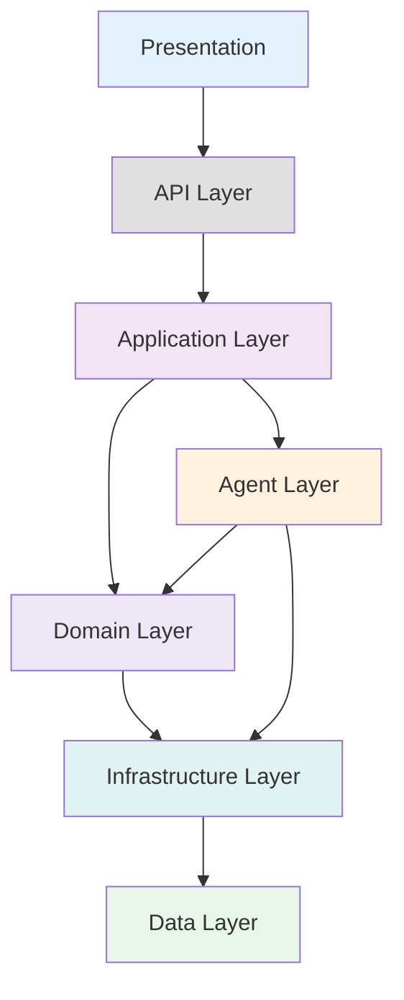

# 05 — Layered / Component Diagram（分層元件圖）

> **為什麼重要？** 模組分工與責任切分，確保每個元件職責明確、低耦合高內聚。

## 概述

本圖以分層架構（Layered Architecture）展示平台各模組的職責劃分，從介面層到資料儲存層的完整堆疊。

---

## 分層架構圖

```mermaid
flowchart TB
    subgraph PRESENTATION["Presentation Layer"]
        LINE_BOT["LINE Bot\nWebhook Handler"]
        TECH_WEB["Technician Web App\nNext.js 14 PWA"]
        ADMIN_WEB["Admin Panel\nNext.js 14 + shadcn/ui"]
    end

    subgraph API["API Layer"]
        WEBHOOK_EP["POST /webhook\nLINE Webhook"]
        REST_EP["REST API /api/v1/*\nCRUD + Query"]
        WS_EP["WebSocket\nReal-time Notification"]
    end

    subgraph APPLICATION["Application Layer"]
        CONV_MGR["Conversation\nManager"]
        AGENT_ORCH["Agent\nOrchestrator\nLangGraph"]
        DISPATCH_ENG["Dispatch\nEngine V2.0"]
        PRICING_ENG["Pricing\nEngine V2.0"]
    end

    subgraph DOMAIN["Domain Layer"]
        PROBLEM["ProblemCard\nExtractor"]
        RESOLUTION["Resolution\nEngine L1/L2/L3"]
        SOP_GEN["SOP\nGenerator"]
        SENTIMENT["Sentiment\nTriage"]
    end

    subgraph AGENT_L["Agent Layer"]
        HW_AGENT["Hardware\nTechnician"]
        SALES_AGENT["Sales\nRepresentative"]
        APP_AGENT["App\nSpecialist"]
        OTHER_AGENT["Store / Manual\n/ Web / Receptionist"]
    end

    subgraph INFRA["Infrastructure Layer"]
        LLM_GW["LLM Gateway\nGemini / Vertex AI"]
        EMBED_SVC["Embedding\nService"]
        PROFILE_MGR["Profile\nManager"]
        AUDIT_LOG["Audit\nLogger"]
    end

    subgraph DATA["Data Layer"]
        PG_DB["PostgreSQL 16\n關聯式資料"]
        PGVEC["pgvector\nHNSW 向量索引"]
        REDIS_DB["Redis 7\nSession Cache"]
        FILE_STORE["File Storage\nProfiles / Manuals"]
    end

    PRESENTATION --> API
    API --> APPLICATION
    APPLICATION --> DOMAIN
    APPLICATION --> AGENT_L
    AGENT_L --> DOMAIN
    DOMAIN --> INFRA
    AGENT_L --> INFRA
    INFRA --> DATA

    style PRESENTATION fill:#e3f2fd,stroke:#1565c0
    style API fill:#e0e0e0,stroke:#616161
    style APPLICATION fill:#f3e5f5,stroke:#7b1fa2
    style DOMAIN fill:#ede7f6,stroke:#4527a0
    style AGENT_L fill:#fff3e0,stroke:#e65100
    style INFRA fill:#e0f2f1,stroke:#00695c
    style DATA fill:#e8f5e9,stroke:#2e7d32
```

---

## 元件職責矩陣

### Presentation Layer

| 元件 | 職責 | 技術 |
|:-----|:-----|:-----|
| LINE Bot | 接收 Webhook、渲染 Rich Menu / Flex Message | LINE SDK |
| Technician Web App | 工單瀏覽、接單、完工回報、導航 | Next.js 14 PWA |
| Admin Panel | 知識庫管理、SOP 審核、儀表板、帳務 | Next.js 14 + shadcn/ui |

### Application Layer

| 元件 | 職責 | 關鍵機制 |
|:-----|:-----|:---------|
| Conversation Manager | 訊息緩衝（Debounce 1.5s）、對話狀態追蹤 | asyncio Task + Buffer Pool |
| Agent Orchestrator | LangGraph 狀態機編排、Fan-out/Fan-in | LangGraph StateGraph + Send() |
| Dispatch Engine | 技師匹配（技能×區域×評分×可用性） | 加權評分演算法 |
| Pricing Engine | 品牌×鎖型×難度定價矩陣 + 加成項 | 規則引擎 |

### Domain Layer

| 元件 | 職責 | 說明 |
|:-----|:-----|:-----|
| ProblemCard Extractor | 從自然語言擷取品牌、型號、故障現象 | LLM Structured Output |
| Resolution Engine | 三層解決：L1 向量搜尋 → L2 RAG → L3 升級 | pgvector MMR + Gemini |
| SOP Generator | 成功案例自動生成 SOP 草稿 | LLM + Template |
| Sentiment Triage | 負面情緒偵測（≥90%）→ 優先處理 | LLM Classification |

### Agent Layer

| Agent | 工具 | 知識來源 |
|:------|:-----|:---------|
| Hardware Technician | db_video, transfer_to_human | 硬體維修影片知識庫 |
| Sales Representative | db_line_chat, transfer_to_human | LINE 對話服務知識庫 |
| Store Assistant | db_website, transfer_to_human | 門市資訊知識庫 |
| App Specialist | db_youtube, transfer_to_human | APP 教學影片知識庫 |
| Manual Librarian | db_manuals, transfer_to_human | PDF 產品手冊知識庫 |
| Web Researcher | db_web_search, transfer_to_human | DuckDuckGo 網路搜尋 |
| Receptionist | transfer_to_human | 通用接待（無檢索工具） |

### Infrastructure Layer

| 元件 | 職責 |
|:-----|:-----|
| LLM Gateway | 統一 LLM 呼叫入口、Prompt 管理、Token 追蹤、Retry/Fallback |
| Embedding Service | 文本向量化、支援 Vertex AI / Ollama |
| Profile Manager | 使用者資料載入（Facts + .md）、SCD Type 2 更新 |
| Audit Logger | 全訊息審計日誌（user_raw / user / ai） |

### Data Layer

| 元件 | 用途 | 規格 |
|:-----|:-----|:-----|
| PostgreSQL 16 | 核心關聯資料、Checkpoint、User Facts、Audit Log | ACID + WAL |
| pgvector | 5 個向量集合（HNSW 索引、768 維、Cosine 距離） | MMR 檢索 |
| Redis 7 | Session 快取、Debounce Buffer、即時推播 | TTL 300s |
| File Storage | 使用者 Profile (.md)、產品手冊 (PDF)、Debug Log | 本地檔案系統 |

---

## 模組依賴關係

> 依賴方向：上層依賴下層，下層不依賴上層（依賴反轉原則）。
