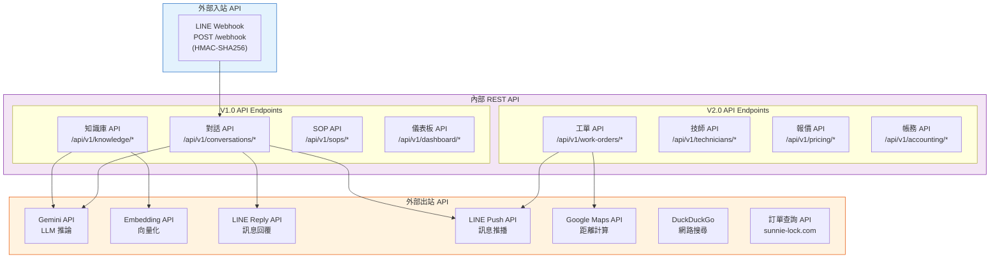
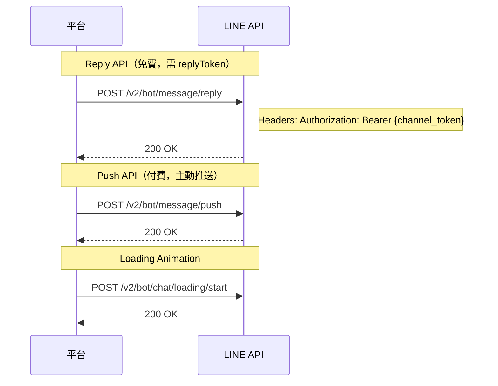
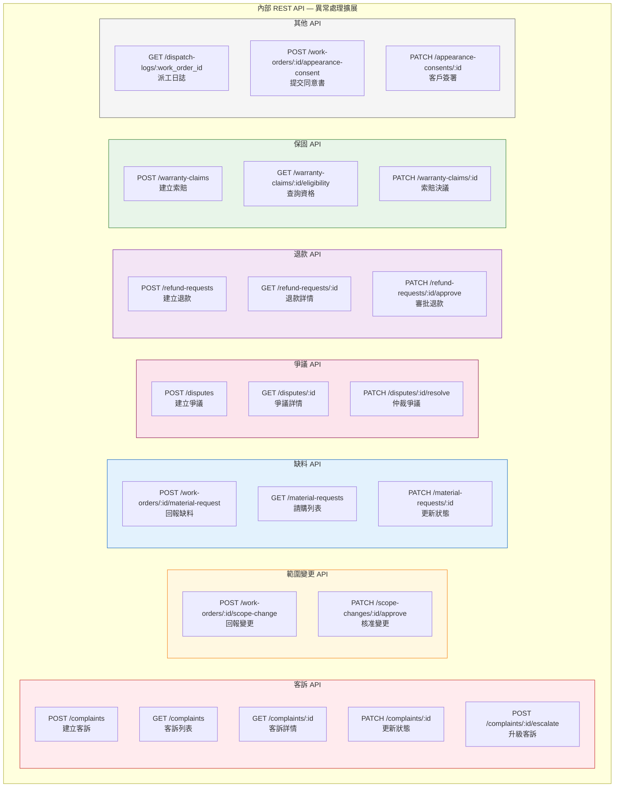

# 08 — API / Interface Diagram（API 介面圖）

> **為什麼重要？** 定義整合方式，確保前後端、內外部系統的介接規格明確一致。

## 概述

本圖定義平台所有 API 端點、內部介面與外部整合的規格，包含請求/回應格式、認證方式與資料交換協定。

---

## API 架構總覽



---

## API 端點規格

### LINE Webhook（入站）

```
POST /webhook
Content-Type: application/json
X-Line-Signature: {HMAC-SHA256 signature}

Request Body:
{
  "events": [{
    "type": "message",
    "replyToken": "xxx",
    "source": { "userId": "U1234...", "type": "user" },
    "message": { "type": "text", "text": "我的三星電子鎖打不開" }
  }]
}

Response: 200 OK
```

### V1.0 — 知識庫 API

| Method | Path | 說明 | Auth |
|:-------|:-----|:-----|:-----|
| GET | `/api/v1/knowledge/cases` | 查詢案例列表（分頁+篩選） | JWT (admin) |
| POST | `/api/v1/knowledge/cases` | 新增案例 | JWT (admin) |
| PUT | `/api/v1/knowledge/cases/{id}` | 更新案例 | JWT (admin) |
| DELETE | `/api/v1/knowledge/cases/{id}` | 刪除案例 | JWT (admin) |
| POST | `/api/v1/knowledge/cases/search` | 向量搜尋相似案例 | JWT (admin) |
| POST | `/api/v1/knowledge/manuals/upload` | 上傳 PDF → 分段 → 嵌入 | JWT (admin) |
| GET | `/api/v1/knowledge/manuals` | 查詢手冊列表 | JWT (admin) |

### V1.0 — 對話 API

| Method | Path | 說明 | Auth |
|:-------|:-----|:-----|:-----|
| GET | `/api/v1/conversations` | 查詢對話列表（分頁+日期範圍） | JWT (admin) |
| GET | `/api/v1/conversations/{id}` | 查看單一對話完整訊息 | JWT (admin) |
| GET | `/api/v1/conversations/{id}/problem-card` | 取得對話的 ProblemCard | JWT (admin) |

### V1.0 — SOP API

| Method | Path | 說明 | Auth |
|:-------|:-----|:-----|:-----|
| GET | `/api/v1/sops` | 查詢 SOP 草稿列表 | JWT (reviewer+) |
| GET | `/api/v1/sops/{id}` | 查看 SOP 詳情 | JWT (reviewer+) |
| PATCH | `/api/v1/sops/{id}/approve` | 核准 SOP | JWT (admin) |
| PATCH | `/api/v1/sops/{id}/reject` | 退回 SOP（含 review_notes） | JWT (admin) |

### V1.0 — 儀表板 API

| Method | Path | 說明 | Auth |
|:-------|:-----|:-----|:-----|
| GET | `/api/v1/dashboard/overview` | 營運指標總覽 | JWT (admin) |
| GET | `/api/v1/dashboard/conversations/stats` | 對話統計（量/解決率/情緒） | JWT (admin) |
| GET | `/api/v1/dashboard/knowledge/stats` | 知識庫統計（案例數/命中率） | JWT (admin) |

### V2.0 — 工單 API

| Method | Path | 說明 | Auth |
|:-------|:-----|:-----|:-----|
| GET | `/api/v1/work-orders` | 工單列表（篩選：狀態/區域/技師） | JWT (admin, technician) |
| GET | `/api/v1/work-orders/{id}` | 工單詳情 | JWT (admin, technician) |
| POST | `/api/v1/work-orders` | 建立工單（L3 自動或手動） | JWT (admin) / System |
| PATCH | `/api/v1/work-orders/{id}/accept` | 技師接單 | JWT (technician) |
| PATCH | `/api/v1/work-orders/{id}/complete` | 完工回報 | JWT (technician) |
| PATCH | `/api/v1/work-orders/{id}/cancel` | 取消工單 | JWT (admin) |
| PATCH | `/api/v1/work-orders/{id}/assign` | 手動指派技師 | JWT (admin) |

### V2.0 — 技師 API

| Method | Path | 說明 | Auth |
|:-------|:-----|:-----|:-----|
| GET | `/api/v1/technicians` | 技師列表 | JWT (admin) |
| GET | `/api/v1/technicians/{id}` | 技師詳情（含評分/技能） | JWT (admin, self) |
| PUT | `/api/v1/technicians/{id}` | 更新技師資料 | JWT (admin) |
| PATCH | `/api/v1/technicians/{id}/availability` | 更新可用狀態 | JWT (technician) |
| GET | `/api/v1/technicians/{id}/earnings` | 查看個人收入 | JWT (technician) |

### V2.0 — 報價 API

| Method | Path | 說明 | Auth |
|:-------|:-----|:-----|:-----|
| GET | `/api/v1/pricing/rules` | 定價規則列表 | JWT (admin) |
| POST | `/api/v1/pricing/calculate` | 自動計算報價 | System |
| PUT | `/api/v1/pricing/rules/{id}` | 更新定價規則 | JWT (admin) |

### V2.0 — 帳務 API

| Method | Path | 說明 | Auth |
|:-------|:-----|:-----|:-----|
| GET | `/api/v1/accounting/invoices` | 帳單列表 | JWT (admin) |
| GET | `/api/v1/accounting/reconciliations` | 月結對帳列表 | JWT (admin) |
| POST | `/api/v1/accounting/reconciliations/generate` | 生成月結報表 | JWT (admin) |
| PATCH | `/api/v1/accounting/reconciliations/{id}/confirm` | 確認月結 | JWT (admin) |

---

## 外部 API 整合規格

### LINE Messaging API



### Google Gemini API

```
POST https://generativelanguage.googleapis.com/v1beta/models/gemini-2.5-flash:generateContent
Authorization: Bearer {API_KEY}
Content-Type: application/json

{
  "contents": [{ "role": "user", "parts": [{"text": "..."}] }],
  "generationConfig": { "temperature": 0.3 }
}
```

### Google Embedding API

```
POST https://generativelanguage.googleapis.com/v1beta/models/text-embedding-004:embedContent
Authorization: Bearer {API_KEY}

{
  "content": { "parts": [{"text": "電子鎖故障排除"}] }
}

Response: { "embedding": { "values": [0.12, -0.34, ...] } }  // 768 dim
```

---

## 資料交換格式

### ProblemCard JSON

```json
{
  "id": "uuid",
  "conversation_id": "uuid",
  "brand": "Samsung",
  "model": "SHP-DP609",
  "symptoms": "密碼輸入後無反應，螢幕不亮",
  "location": "台北市大安區",
  "severity": "medium",
  "is_complete": true,
  "created_at": "2026-03-31T10:00:00Z"
}
```

### WorkOrder JSON

```json
{
  "id": "uuid",
  "problem_card_id": "uuid",
  "technician_id": "uuid",
  "status": "assigned",
  "customer_address": "台北市大安區忠孝東路四段 123 號",
  "customer_phone": "0912-345-678",
  "scheduled_at": "2026-04-01T14:00:00Z",
  "photos": [],
  "invoice": {
    "amount": 1500,
    "surcharges": 200,
    "total": 1700
  }
}
```

---

## 認證與授權

| 介面 | 認證方式 | 授權機制 |
|:-----|:---------|:---------|
| LINE Webhook | HMAC-SHA256 簽章驗證 | LINE 平台保證 |
| Admin Panel API | JWT Bearer Token | RBAC (admin 角色) |
| Technician App API | JWT Bearer Token | RBAC (technician 角色) |
| Gemini API | API Key / OAuth 2.0 | Google Cloud IAM |
| LINE API (出站) | Channel Access Token | LINE Developers Console |
| 訂單查詢 API | Bearer Token | API Key 授權 |

---

## V2.0 異常處理 API Endpoints

### API 架構 — 異常處理模組



### 端點規格總表

| Method | Endpoint | Auth | Description |
|:-------|:---------|:-----|:------------|
| POST | `/api/v1/complaints` | JWT (customer/admin) | 建立客訴 |
| GET | `/api/v1/complaints` | JWT (admin) | 客訴列表 (cursor pagination) |
| GET | `/api/v1/complaints/:id` | JWT (admin) | 客訴詳情 (含工單+對話+照片) |
| PATCH | `/api/v1/complaints/:id` | JWT (admin) | 更新客訴狀態 (assign/investigate/resolve) |
| POST | `/api/v1/complaints/:id/escalate` | JWT (admin) | 升級客訴至上級 |
| POST | `/api/v1/work-orders/:id/scope-change` | JWT (technician) | 技師回報範圍變更 |
| PATCH | `/api/v1/scope-changes/:id/approve` | JWT (customer/admin) | 客戶/管理員核准變更 |
| POST | `/api/v1/work-orders/:id/material-request` | JWT (technician) | 技師回報缺料 |
| GET | `/api/v1/material-requests` | JWT (admin) | 材料請購列表 |
| PATCH | `/api/v1/material-requests/:id` | JWT (admin) | 更新請購狀態 |
| POST | `/api/v1/disputes` | JWT (customer/technician) | 建立爭議 |
| GET | `/api/v1/disputes/:id` | JWT (admin) | 爭議詳情 (含舉證) |
| PATCH | `/api/v1/disputes/:id/resolve` | JWT (admin) | 仲裁爭議 |
| POST | `/api/v1/refund-requests` | JWT (admin) | 建立退款申請 |
| GET | `/api/v1/refund-requests/:id` | JWT (admin/finance) | 退款詳情 |
| PATCH | `/api/v1/refund-requests/:id/approve` | JWT (admin/finance) | 審批退款 (含雙簽) |
| POST | `/api/v1/warranty-claims` | JWT (customer/admin) | 建立保固索賠 |
| GET | `/api/v1/warranty-claims/:id/eligibility` | JWT (admin) | 查詢保固資格 |
| PATCH | `/api/v1/warranty-claims/:id` | JWT (admin) | 保固索賠決議 |
| GET | `/api/v1/dispatch-logs/:work_order_id` | JWT (admin) | 派工決策日誌 |
| POST | `/api/v1/work-orders/:id/appearance-consent` | JWT (technician) | 提交門外觀變更同意書 |
| PATCH | `/api/v1/appearance-consents/:id` | JWT (customer) | 客戶簽署同意 |
