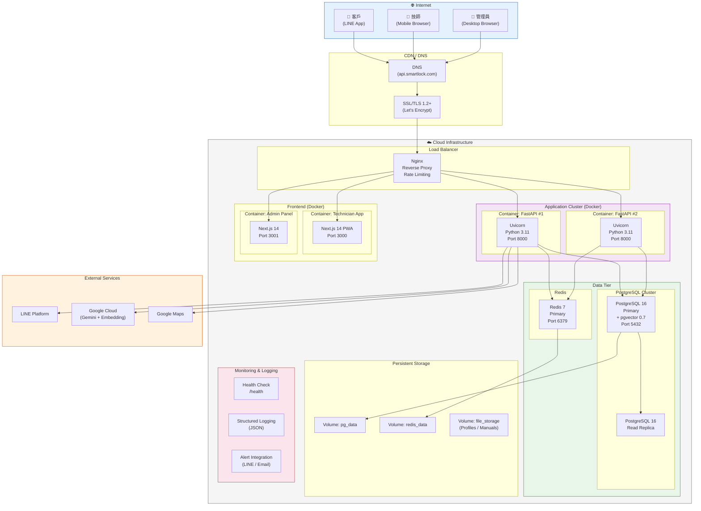
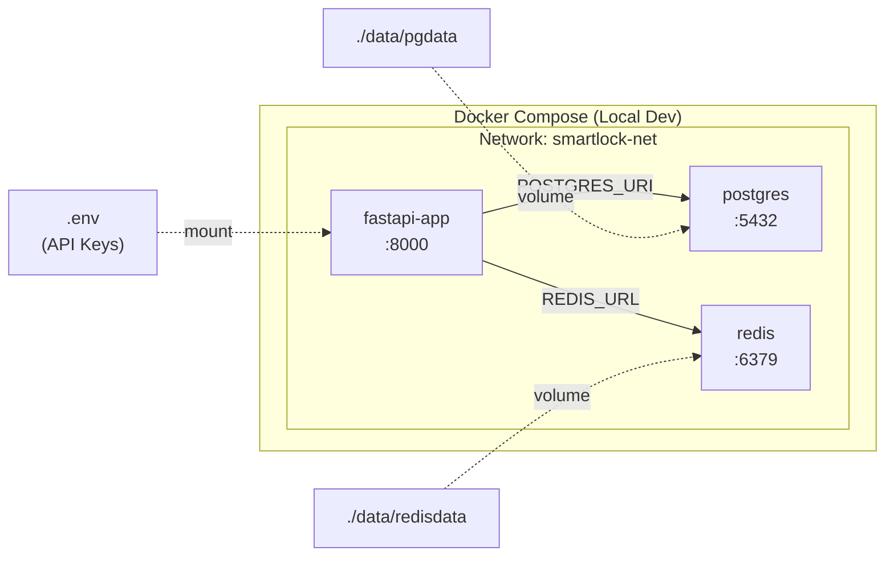
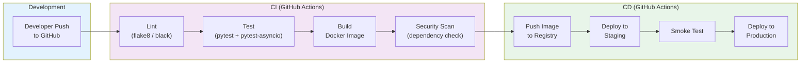

# 09 — Deployment Diagram（部署架構圖）

> **為什麼重要？** 定義上線與環境配置，確保系統在不同環境中穩定運行。

## 概述

本圖展示平台從本地開發到生產環境的完整部署架構，包含容器化策略、網路拓撲與 CI/CD 流程。

---

## 生產環境部署架構

---

## Docker Compose 配置（開發環境）

---

## CI/CD Pipeline

---

## 環境配置對照

| 配置項 | 開發環境 | Staging | 生產環境 |
|:-------|:---------|:--------|:---------|
| **部署方式** | docker-compose | docker-compose | Docker + Load Balancer |
| **FastAPI 實例** | 1 | 1 | 2+ (auto-scale) |
| **PostgreSQL** | 本地容器 | 雲端單節點 | 雲端託管 + Read Replica |
| **Redis** | 本地容器 | 雲端單節點 | 雲端託管 |
| **SSL** | 自簽憑證 | Let's Encrypt | Let's Encrypt / CloudFlare |
| **備份** | 無 | 每日 | 每日自動 + 30 天保留 |
| **監控** | Debug Log | 基本健康檢查 | 結構化日誌 + 警報 |
| **域名** | localhost:8000 | staging.smartlock.com | api.smartlock.com |

---

## 容器規格

| 容器 | Base Image | 資源限制 | 端口 | 依賴 |
|:-----|:-----------|:---------|:-----|:-----|
| fastapi-app | python:3.11-slim | 2 CPU / 4GB RAM | 8000 | postgres, redis |
| postgres | postgres:16-alpine | 2 CPU / 4GB RAM | 5432 | - |
| redis | redis:7-alpine | 1 CPU / 1GB RAM | 6379 | - |
| technician-app | node:20-alpine | 1 CPU / 2GB RAM | 3000 | fastapi-app |
| admin-panel | node:20-alpine | 1 CPU / 2GB RAM | 3001 | fastapi-app |

---

## 備份與災難復原

| 項目 | 策略 | 頻率 | 保留期 |
|:-----|:-----|:-----|:-------|
| PostgreSQL 資料 | pg_dump + 增量 WAL | 每日 + 即時 WAL | 30 天 |
| Redis 快取 | RDB Snapshot | 每小時 | 7 天 |
| 使用者 Profile | 檔案同步至 Object Storage | 每日 | 30 天 |
| Docker Image | Registry 版本保留 | 每次部署 | 最近 10 版 |
| 災難復原 RTO | | | < 4 小時 |
| 災難復原 RPO | | | < 1 小時 |
