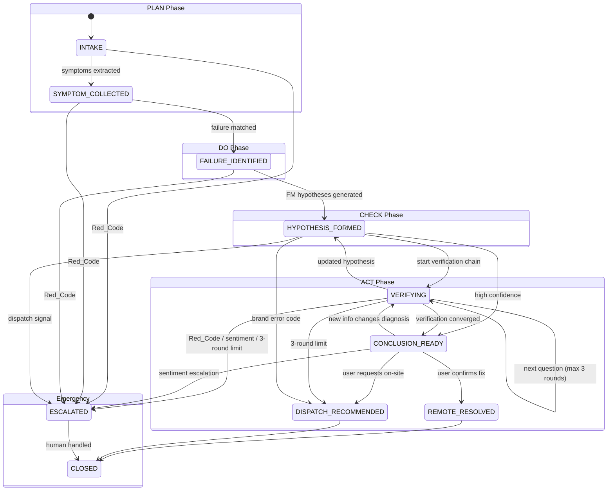
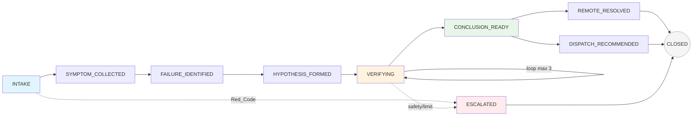
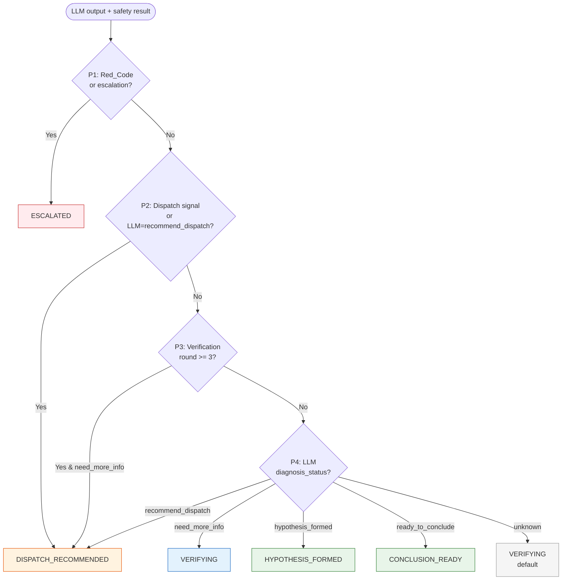
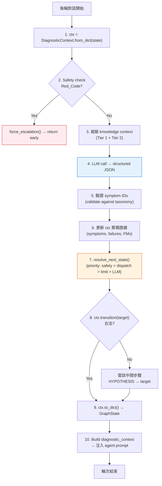
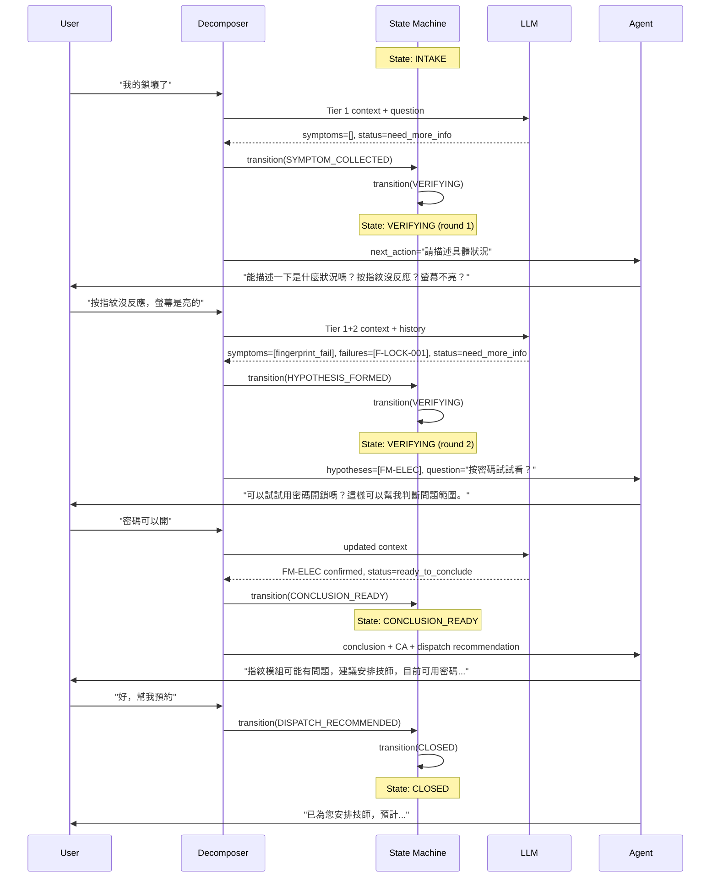
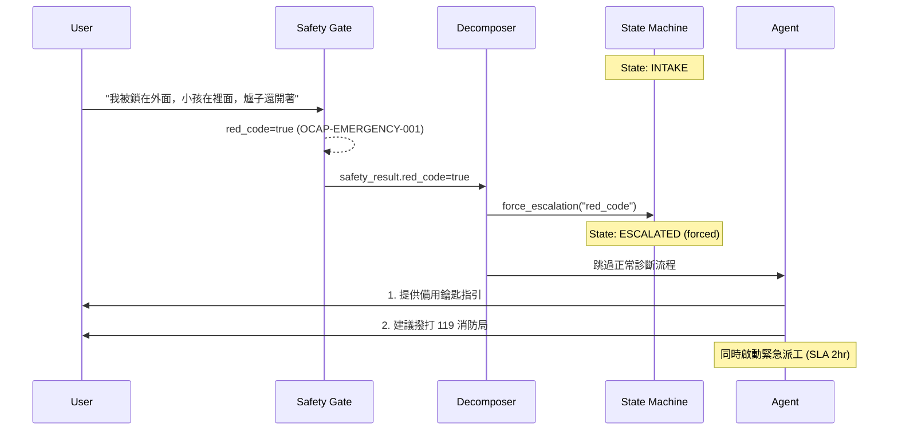
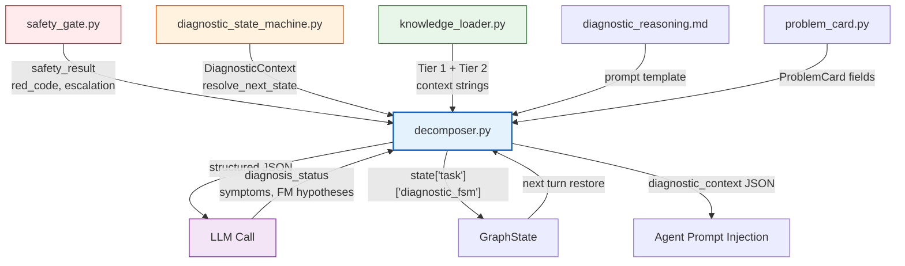

# Diagnostic State Machine Specification

> 診斷推理狀態機 — 管理跨輪次 PDCA 生命週期的狀態轉移規則

---

## 1. 設計動機

`decomposer.py` 處理單輪 LLM 推理，但缺乏跨輪次的狀態管理：
- 「現在做到哪了？」（Plan / Do / Check / Act？）
- 「可以從哪裡到哪裡？」（合法轉移 vs 非法跳躍）
- 「什麼情況下強制中斷？」（Red_Code / 情緒升級 / 3 輪上限）

狀態機解決這三個問題。它是**規則層**（確定性），不是推理層（LLM）。

```
LLM 決定: "我認為現在 hypothesis_formed"
狀態機驗證: "從 VERIFYING 到 HYPOTHESIS_FORMED 是合法轉移嗎？是 → 允許"
Python 強制: "已經 3 輪了但 LLM 還說 need_more_info → 覆寫為 DISPATCH_RECOMMENDED"
```

---

## 2. 狀態定義

10 個狀態，對應四層因果鏈的 PDCA 階段：

```
Phase    State                   說明
─────    ─────                   ────
PLAN     INTAKE                  用戶訊息進入，尚未分析
         SYMPTOM_COLLECTED       症狀已從對話提取，映射為 taxonomy ID
         FAILURE_IDENTIFIED      Failure 類型已識別 (e.g. F-LOCK-001)

DO       HYPOTHESIS_FORMED       FM 假設已生成並排序
         VERIFYING               正在追問驗證問題 (可 loop，max 3 輪)

CHECK    CONCLUSION_READY        資訊充分，可給出結論 + CA

ACT      REMOTE_RESOLVED         遠端解決，用戶確認修復
         DISPATCH_RECOMMENDED    需到府服務
         ESCALATED               轉接真人 (Red_Code / 情緒 / 安全)

TERMINAL CLOSED                  案件結案，ProblemCard 歸檔
```

---

## 3. 狀態轉移規則

### 完整轉移表

| 從 (Source) | 到 (Target) | 觸發條件 |
|---|---|---|
| INTAKE | SYMPTOM_COLLECTED | LLM 提取出 symptom IDs |
| INTAKE | ESCALATED | Red_Code / 情緒觸發 |
| SYMPTOM_COLLECTED | FAILURE_IDENTIFIED | 症狀匹配到 Failure 定義 |
| SYMPTOM_COLLECTED | VERIFYING | 症狀太模糊，需追問 |
| SYMPTOM_COLLECTED | ESCALATED | Red_Code |
| FAILURE_IDENTIFIED | HYPOTHESIS_FORMED | FM 假設生成完成 |
| FAILURE_IDENTIFIED | VERIFYING | 需驗證才能確定 FM |
| FAILURE_IDENTIFIED | ESCALATED | Red_Code |
| HYPOTHESIS_FORMED | VERIFYING | 開始驗證鏈追問 |
| HYPOTHESIS_FORMED | CONCLUSION_READY | 高信心，跳過驗證 |
| HYPOTHESIS_FORMED | DISPATCH_RECOMMENDED | 偵測到派工信號 (品牌錯誤碼) |
| HYPOTHESIS_FORMED | ESCALATED | Red_Code |
| **VERIFYING** | **VERIFYING** | **下一題 (self-loop, max 3 輪)** |
| VERIFYING | HYPOTHESIS_FORMED | 驗證後更新假設 |
| VERIFYING | CONCLUSION_READY | 驗證收斂 |
| VERIFYING | DISPATCH_RECOMMENDED | 3 輪上限 or 派工信號 |
| VERIFYING | ESCALATED | Red_Code / 情緒 |
| CONCLUSION_READY | REMOTE_RESOLVED | 用戶確認修復 |
| CONCLUSION_READY | DISPATCH_RECOMMENDED | 用戶要求到府 |
| CONCLUSION_READY | VERIFYING | 用戶提供新資訊改變診斷 |
| CONCLUSION_READY | ESCALATED | 情緒升級 |
| REMOTE_RESOLVED | CLOSED | 結案 |
| DISPATCH_RECOMMENDED | CLOSED | 派工安排完成 |
| ESCALATED | CLOSED | 真人處理完成 |
| **CLOSED** | **(none)** | **終態，不可轉移** |

### 轉移圖



### 簡化版（核心路徑）



### 不允許的轉移（守衛規則）

| 規則 | 原因 |
|---|---|
| 任何狀態 → INTAKE | INTAKE 是初始狀態，不可返回 |
| CLOSED → 任何狀態 | 終態不可重開 |
| INTAKE → CONCLUSION_READY | 不能跳過診斷直接下結論 |
| INTAKE → HYPOTHESIS_FORMED | 不能跳過症狀提取 |

---

## 4. 優先順序解析 (resolve_next_state)

當 LLM 輸出 `diagnosis_status` 後，Python 依以下優先順序決定實際轉移：



**關鍵設計**：LLM 的建議可以被 Python 覆寫。例如 LLM 說 `ready_to_conclude` 但 safety gate 偵測到 Red_Code → 強制 ESCALATED。

---

## 5. DiagnosticContext 資料結構

跨輪次持久化在 `GraphState["task"]["diagnostic_fsm"]`：

```python
@dataclass
class DiagnosticContext:
    # 狀態機
    current_state: DiagnosticState      # 當前狀態
    verification_round: int             # 已追問幾輪 (0-3)
    max_verification_rounds: int        # 上限 (default 3)
    state_history: list[str]            # 轉移記錄 (debug + observability)

    # 累積證據 (跨輪次保留)
    extracted_symptoms: list[str]       # 所有已提取的 symptom IDs
    matched_failures: list[str]         # 匹配的 Failure IDs
    hypothesized_fms: list[dict]        # FM 假設 [{fm_id, reasoning, confidence}]
    verification_answers: list[dict]    # 驗證問答 [{round, question, answer}]

    # 旗標
    red_code: bool                      # 緊急狀況
    escalation_required: bool           # 情緒升級
    dispatch_signal_detected: bool      # 品牌錯誤碼觸發派工
```

### 序列化 / 反序列化

```python
# 每輪開始: 從 GraphState 恢復
ctx = DiagnosticContext.from_dict(state["task"].get("diagnostic_fsm", {}))

# 每輪結束: 寫回 GraphState
new_task["diagnostic_fsm"] = ctx.to_dict()
```

---

## 6. 與 decomposer.py 的整合



---

## 7. 範例：完整 4 輪對話的狀態轉移

### Happy Path: 遠端診斷 → 派工



### Red_Code 中斷範例



---

## 8. 測試覆蓋

23 個單元測試驗證：

| 測試類別 | 數量 | 驗證內容 |
|---|---|---|
| 基本轉移 | 5 | 合法/非法轉移、force_escalation、CLOSED 終態 |
| 驗證循環 | 3 | VERIFYING self-loop、VERIFYING→CONCLUSION、VERIFYING→DISPATCH |
| 完整流程 | 3 | Happy path (remote resolved)、Dispatch path、Escalation from any state |
| 序列化 | 3 | Round-trip、from empty dict、from None |
| resolve_next_state | 6 | Red_Code override、dispatch signal、round limit、LLM mapping、unknown default |
| 轉移圖完整性 | 3 | 所有狀態有定義、CLOSED 無出邊、INTAKE 不可達 |

---

## 9. 與其他模組的關係



---

## 10. 文件索引

| 檔案 | 角色 |
|---|---|
| `harness/task/diagnostic_state_machine.py` | 狀態定義 + 轉移規則 + DiagnosticContext + resolve_next_state |
| `harness/task/decomposer.py` | 驅動狀態機的 orchestrator (load → LLM → transition → serialize) |
| `harness/task/knowledge_loader.py` | 知識資產載入 + 序列化 |
| `harness/task/prompts/diagnostic_reasoning.md` | LLM 診斷推理 prompt |
| `harness/task/problem_card.py` | ProblemCard 資料結構 |
| `tests/unit/test_diagnostic_state_machine.py` | 23 個狀態機測試 |
| `docs/agent-harness-refactor/diagnostic-intelligence-architecture.md` | 整體診斷架構 (上層文件) |
