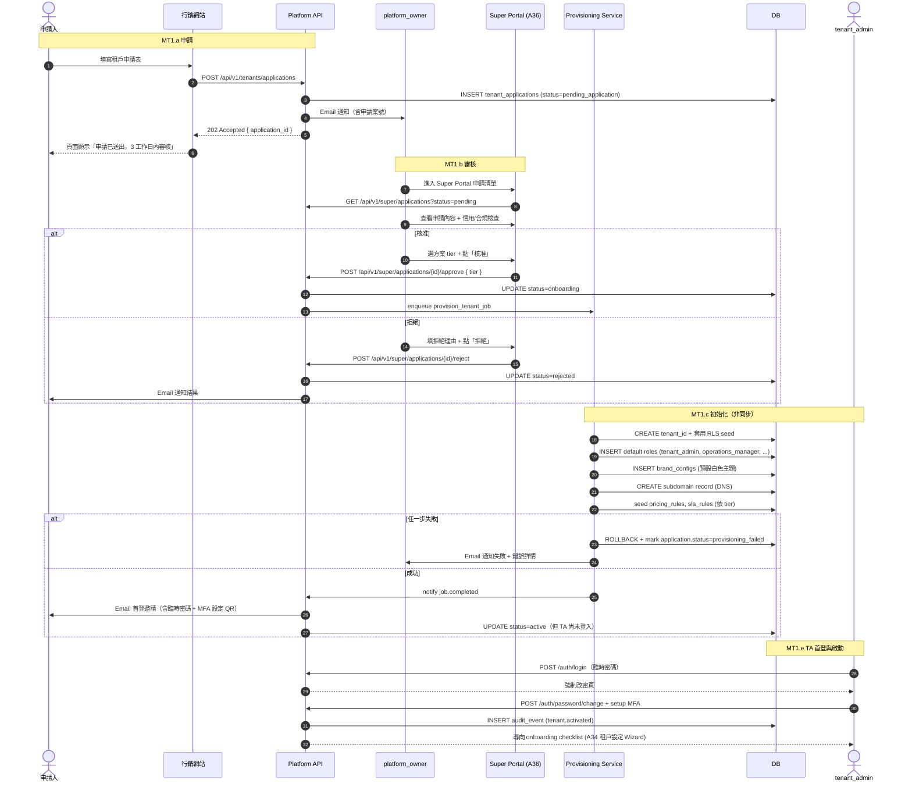
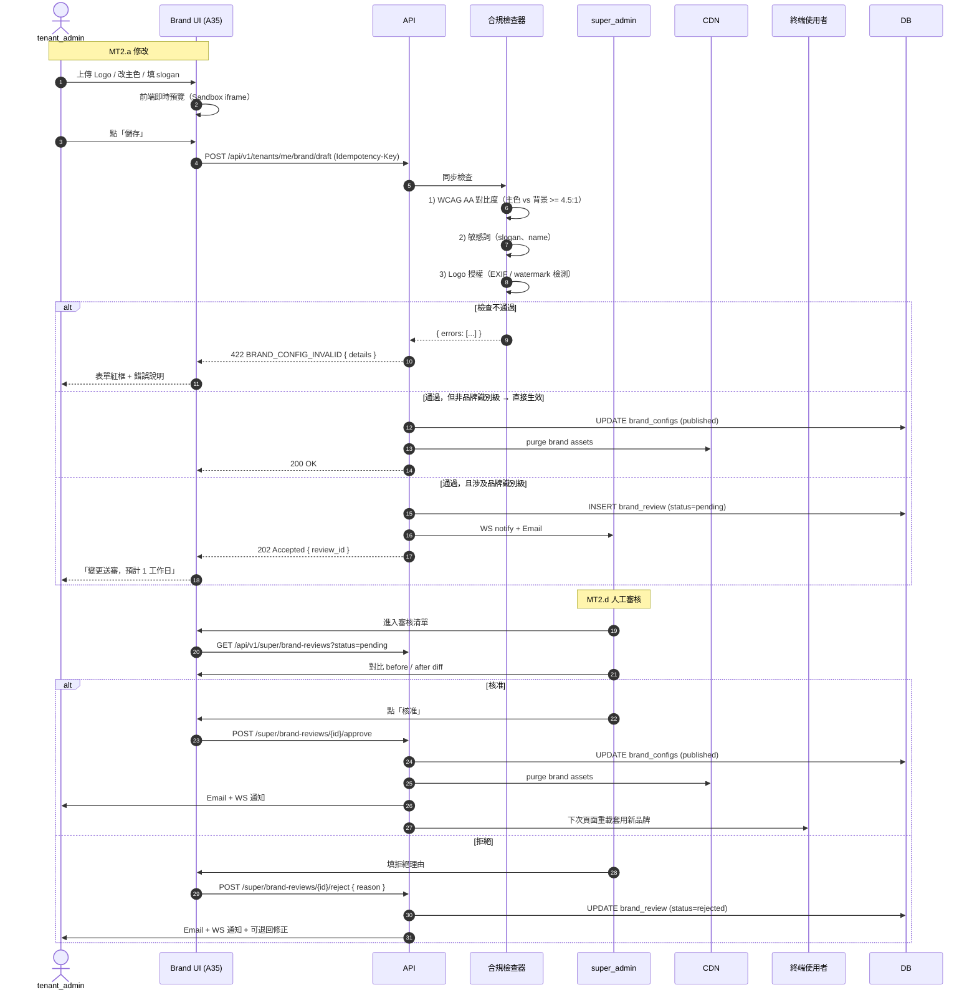
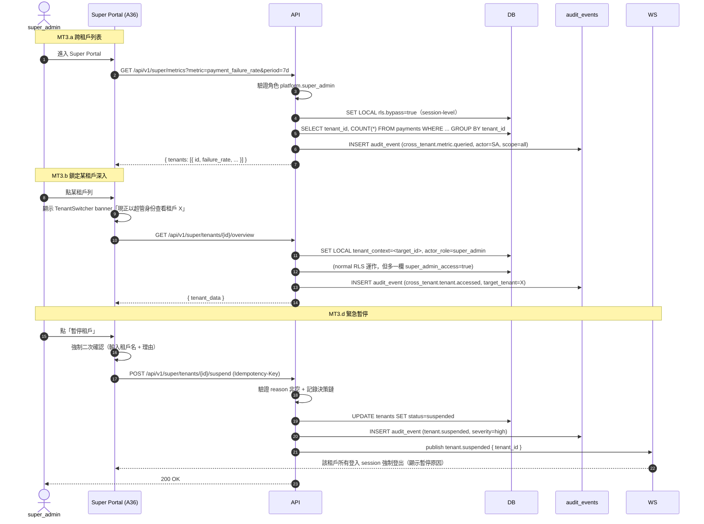
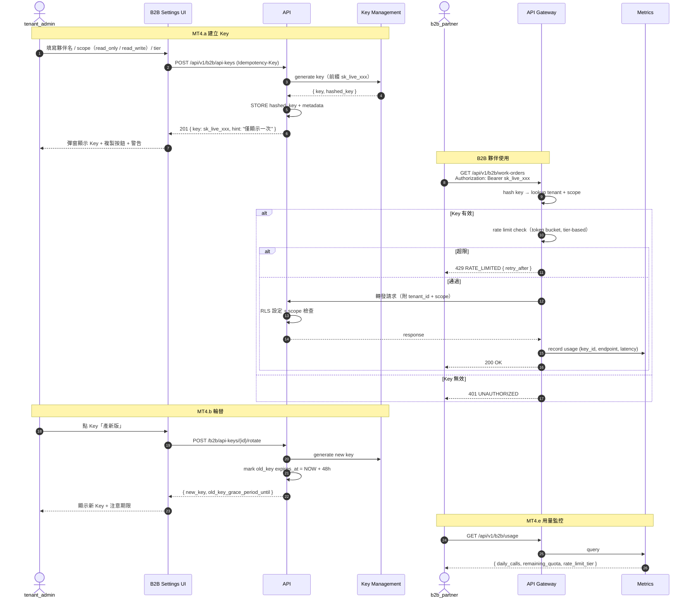
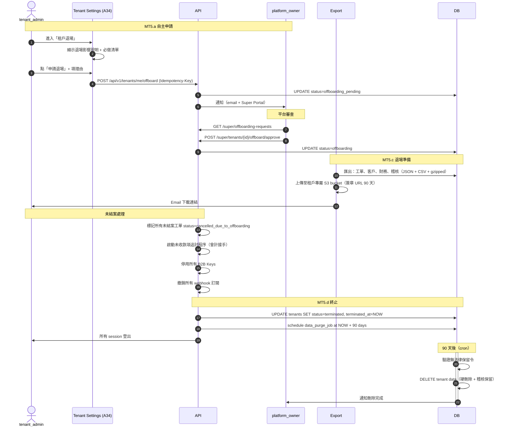

# E5x — 多租戶流程規格書 (Multi-Tenant Flows, V3.0)

> **文件版本**：v0.1（draft，待人工校對業務細節）
> **建立日期**：2026-04-23
> **狀態**：Claude 起草，待使用者逐節校對
> **適用範圍**：V3.0 多租戶 SaaS 核心治理流程
> **觸發原因**：Pre-Week-2 驗證閘（plan §S）— V3.0 多租戶完全缺 Flow 層
>
> **參考文件**：
> - `docs/02-design/platform-multi-tenant/multi-tenant-architecture.md` — 3 級 Portal、RBAC 擴展、RLS 策略
> - `docs/02-design/platform-multi-tenant/external-factors-checklist.md` — 租戶生命週期、合規、OEM 衝突
> - `docs/02-design/platform-multi-tenant/dispatch-integration-spec.md` — 派工三訊號點
> - `docs/02-design/platform-multi-tenant/business-model-strategy.md` — 定價與方案
> - `docs/02-design/specs/b2b-api-spec.md` — B2B API 端點與 rate limit
> - `docs/02-design/specs/brand-data-api-spec.md` — 品牌資料 ingest
> - `docs/02-design/E5x--frontend-architecture.md §1.4` — 前端租戶隔離三層
>
> **與姊妹 Flow 文件的關係**：
> - `flows-admin-governance.md`：單租戶內治理（RBAC/稽核/庫存/爭議）
> - **本檔**：跨租戶、平台級治理（V3.0）
> - `work-order-interaction-flows.md`：工單核心

---

## 目錄

1. [共通定義](#1-共通定義)
2. [Flow MT1：租戶開通 (Onboarding)](#2-flow-mt1租戶開通-onboarding)
3. [Flow MT2：品牌客製審核](#3-flow-mt2品牌客製審核)
4. [Flow MT3：超管跨租戶查詢與資料隔離](#4-flow-mt3超管跨租戶查詢與資料隔離)
5. [Flow MT4：B2B 開放 API Key 管理](#5-flow-mt4b2b-開放-api-key-管理)
6. [Flow MT5：租戶退場 (Offboarding)](#6-flow-mt5租戶退場-offboarding)
7. [跨 Flow 關聯](#7-跨-flow-關聯)

---

## 1. 共通定義

### 1.1 角色（本檔登場，V3.0 擴充）

對齊 `multi-tenant-architecture.md §9` 三級 Portal：

| 角色 | 層級 | 說明 |
|:---|:---|:---|
| `platform_owner` | 平台級 | 平台擁有者（可 list 所有租戶、建立新租戶、終止租戶） |
| `super_admin` | 平台級 | 平台運維（跨租戶讀 + 系統設定，**不含刪除租戶**） |
| `tenant_admin` | 租戶級 | 租戶管理員（本租戶內最高權限） |
| `brand_admin` | 品牌級（V3.0） | 品牌方（OEM 客戶），可讀本品牌工單、管理品牌資料 |
| `b2b_partner` | B2B 客戶（V3.0） | 第三方 API 消費者（僅透過 API，無 UI） |

### 1.2 租戶生命週期狀態

```
pending_application → under_review → onboarding → active → suspended → terminated
                                              ↘ rejected
```

對齊 `external-factors-checklist.md §3`。

| 狀態 | 說明 | 可見範圍 |
|:---|:---|:---|
| `pending_application` | 已提交申請，等審核 | `platform_owner` |
| `under_review` | 平台運維審查中 | `platform_owner`, `super_admin` |
| `rejected` | 審核拒絕（終態） | `platform_owner`（7 天後刪除） |
| `onboarding` | 已核准，初始化中（建 schema、種子資料、設 admin） | `platform_owner` |
| `active` | 正式上線 | 全員可見（依 RLS） |
| `suspended` | 暫停（付款逾期、違規、主動請求） | 租戶自己只讀 |
| `terminated` | 終止（資料 90 天後刪除） | `platform_owner`（歸檔存取） |

### 1.3 通用前置條件

- 跨租戶操作必須 `super_admin` 或 `platform_owner` 角色
- 所有跨租戶查詢自動寫 `audit_event`（category=`cross_tenant.access`）
- B2B API 以 API Key 認證（不帶 `X-Tenant-ID`，由 key 本身綁定租戶）
- 租戶切換時前端強制 `queryClient.clear()` + cookie rotate（對齊 `frontend-architecture.md §1.4.1`）

### 1.4 SLA（多租戶治理）

| 操作 | SLA | 超時處理 |
|:---|:---|:---|
| 租戶申請審核 | < 3 工作日 | 自動通知 `platform_owner` |
| 租戶 onboarding 完成 | 審核通過後 < 30 分鐘 | 失敗 → 回滾 schema，通知聯繫 |
| 品牌客製變更生效 | 儲存後 < 60 秒（CDN + cache purge） | 降級：下次登入生效 |
| 超管查詢 | < 3 秒 | 分頁 / 改非同步 |
| B2B API Key 建立 | 即時（< 2 秒） | — |
| B2B API 請求 | p99 < 500ms | Rate Limit 拒絕 → 429 |

---

## 2. Flow MT1：租戶開通 (Onboarding)

### 2.1 觸發條件

- **MT1.a 申請**：潛在客戶透過行銷網站提交租戶申請表
- **MT1.b 審核**：`platform_owner` 核准 / 拒絕
- **MT1.c 初始化**：系統自動建立 schema、種子資料、預設角色、subdomain
- **MT1.d 交接**：寄發 admin 首次登入邀請 + 啟動 onboarding checklist
- **MT1.e 生效**：admin 完成首登 + MFA → 租戶狀態 `active`

### 2.2 參與角色

| Actor | 職責 |
|:---|:---|
| 潛在客戶 | 提交申請（含公司資料、LINE 官方帳號 ID、預期用量） |
| `platform_owner` | 審核、決策方案 tier、簽約（體外流程） |
| 系統 | 資源初始化、發送邀請、收集首登事件 |
| 受邀 `tenant_admin` | 首次登入、設定 MFA、完成 onboarding checklist |

### 2.3 流程圖



### 2.4 Onboarding Checklist（TA 首登後引導）

對齊 `external-factors-checklist.md §3`：

- [ ] MFA 設定（強制）
- [ ] LINE 官方帳號綁定 + channel secret / access token 驗證
- [ ] 公司資訊補齊（統編、聯絡方式、地址）
- [ ] 支付方式驗證（信用卡綁定 for 訂閱費）
- [ ] 品牌 Logo 上傳（可延後）
- [ ] 至少建立 1 位 `operations_manager` 或 `dispatch_officer`
- [ ] 完成前 3 個測試工單（Sandbox 模式）

### 2.5 狀態轉換表

| 事件 | Before | After | 稽核 action |
|:---|:---|:---|:---|
| 提交申請 | — | `pending_application` | `tenant.application.submitted` |
| 開始審查 | `pending_application` | `under_review` | `tenant.application.review_started` |
| 核准 | `under_review` | `onboarding` | `tenant.application.approved` |
| 拒絕 | `under_review` | `rejected` | `tenant.application.rejected` |
| Provision 完成 | `onboarding` | `active` | `tenant.activated` |
| Provision 失敗 | `onboarding` | `provisioning_failed` | `tenant.provision.failed` |

### 2.6 通知清單

| 事件 | 對象 | 通道 |
|:---|:---|:---|
| 申請提交 | `platform_owner` | Email + Super Portal 紅點 |
| 審核結果（核准/拒絕） | 申請人聯絡窗口 | Email |
| 首登邀請 | 新租戶 admin | Email（含臨時密碼、MFA QR） |
| Provision 失敗 | `platform_owner` | Email + LINE Notify |
| 租戶正式 active | 內部 Slack | Webhook |

### 2.7 業務規則

- **R1**：租戶 `subdomain` 不可與保留字衝突（`www`, `api`, `admin`, `super`, `auth`, `static`）
- **R2**：LINE channel secret / access token 驗證失敗 → provision 不可進入 `active`
- **R3**：申請 7 天未審核 → 自動 email 提醒 `platform_owner`
- **R4**：被 `rejected` 的申請 30 天內同 email 不可再次申請（避免刷單）
- **R5**：Provision 失敗的 `onboarding` 狀態可手動重試（最多 3 次），3 次失敗需工程介入
- **R6**：方案 tier 建立後可升降；降級需確認用量不超過新 tier 限制
- **R7**：Sandbox 模式的前 3 個測試工單不計入真實計費

### 2.8 Error Path

| 情境 | error_code | HTTP |
|:---|:---|:---|
| subdomain 衝突 | `VALIDATION_ERROR` | 422 |
| LINE 驗證失敗 | `TENANT_LINE_BINDING_FAILED`（新增） | 422 |
| 30 天內重複申請 | `VALIDATION_ERROR` | 422 |
| Provision 超時 | `SERVICE_UNAVAILABLE` | 503 |

---

## 3. Flow MT2：品牌客製審核

### 3.1 觸發條件

- **MT2.a 租戶自助修改**：`tenant_admin` 於 `/admin/settings/tenant/brand` 上傳 Logo、改配色、設 slogan
- **MT2.b 品牌方修改（OEM）**：`brand_admin`（品牌級角色）修改屬於其品牌的設定
- **MT2.c 合規檢查**：系統自動對變更做配色對比度（WCAG AA）、敏感詞、授權素材驗證
- **MT2.d 送審**：變更若涉及「品牌識別級」欄位（Logo、主色、品牌名稱）→ 送 `super_admin` 審核
- **MT2.e 生效 + CDN 推送**：審核通過後 < 60 秒全域生效

### 3.2 參與角色

| Actor | 職責 |
|:---|:---|
| `tenant_admin` / `brand_admin` | 提交變更 |
| 系統 | 自動合規檢查（對比度、敏感詞）、CDN purge |
| `super_admin` | 人工審核（品牌識別級變更） |
| 客戶 / 終端使用者 | 被動接收新品牌樣式 |

### 3.3 流程圖



### 3.4 合規檢查規則

| 檢查項 | 閾值 / 規則 | 失敗 error_code |
|:---|:---|:---|
| 對比度 | 主色 vs 白底 >= 4.5:1（WCAG AA） | `BRAND_CONFIG_INVALID` (accessibility) |
| Logo 尺寸 | <= 2MB, PNG/SVG | `VALIDATION_ERROR` |
| Logo EXIF | 不含 GPS、創作者敏感資訊 | `BRAND_CONFIG_INVALID` (privacy) |
| 敏感詞 | 黑名單（髒話、競品名、政治敏感） | `BRAND_CONFIG_INVALID` (content) |
| 授權素材 | 水印檢測（AI 偵測 stock photo 未授權） | `BRAND_CONFIG_INVALID` (license) |
| 字型 | 僅允許系統字型或自家授權字型 | `VALIDATION_ERROR` |

### 3.5 送審門檻（品牌識別級）

需 `super_admin` 審核：
- 品牌名稱 / slogan
- 主色（primary color）
- Logo（圖片本身）
- 法定聯絡方式（影響消費者權益顯示）

不需審核（租戶自主）：
- 次要配色
- 文案小修
- 字型大小
- 圖示（icon）選擇
- 首頁順序

### 3.6 通知清單

| 事件 | 對象 | 通道 |
|:---|:---|:---|
| 送審通知 | `super_admin` | WebSocket + Email |
| 核准 | `tenant_admin` | WebSocket + Email |
| 拒絕 | `tenant_admin` | WebSocket + Email（含理由與修正建議） |
| 生效 | 本租戶所有登入使用者 | WebSocket `/realtime/rbac`（廣播 brand config refresh）|

### 3.7 業務規則

- **R1**：品牌變更採「草稿 vs 發佈」雙 state，發佈前可無限修改不觸發審核
- **R2**：已發佈的 brand_config 保留 10 個版本歷史（可 rollback）
- **R3**：租戶暫停（`suspended`）期間不可編輯品牌
- **R4**：OEM 品牌（`brand_admin`）修改權僅限自己品牌，不跨品牌
- **R5**：CDN purge 失敗不阻擋主流程，但寫 `system.error` 事件 + 降級為次次登入生效
- **R6**：審核超 3 工作日自動升級給 `platform_owner`
- **R7**：對比度 4.5:1 是硬性規則，**無法被覆寫**（合規要求）

### 3.8 Error Path

| 情境 | error_code | HTTP |
|:---|:---|:---|
| 合規檢查失敗 | `BRAND_CONFIG_INVALID` | 422 |
| 租戶已暫停 | `TENANT_SUSPENDED` | 423 |
| 跨品牌修改 | `FORBIDDEN` | 403 |
| 審核中重複送審 | `CONFLICT` | 409 |

---

## 4. Flow MT3：超管跨租戶查詢與資料隔離

### 4.1 觸發條件

- **MT3.a 跨租戶列表**：`super_admin` 需查詢「所有租戶的某類事件」（如支付失敗率）
- **MT3.b 單租戶深入**：鎖定某租戶做排障
- **MT3.c 資料匯出（合規/法務）**：司法/主管機關請求調閱
- **MT3.d 緊急操作**：暫停 / 恢復某租戶（付款問題、違規）

### 4.2 參與角色

| Actor | 職責 |
|:---|:---|
| `super_admin` / `platform_owner` | 執行跨租戶操作 |
| 系統 | 強化稽核（所有跨租戶行為雙重記錄）、RLS 暫時放寬（僅限明確標註的操作） |
| `auditor` | 事後審計超管行為 |

### 4.3 流程圖



### 4.4 資料隔離原則

對齊 `multi-tenant-architecture.md §4` RLS：

| 情境 | RLS 行為 | 稽核 |
|:---|:---|:---|
| 一般使用者操作 | 預設 `rls.tenant_id = current_tenant()` | 常規 |
| `super_admin` 跨租戶列表 | Session 級 `rls.bypass=true` + `scope=read_aggregate` | 強化（actor + filter + count） |
| `super_admin` 進入某租戶 | `rls.tenant_id = target_tenant`，帶 `super_admin_access` 旗標 | 強化 + 租戶 admin 可見紀錄 |
| 法務匯出 | `rls.bypass=true` + `scope=legal_export` | 強化 + 需二人簽核 |

### 4.5 租戶可見的超管行為

**重要合規承諾：** 所有 `super_admin` 進入某租戶的行為，該租戶的 `tenant_admin` 在自己的稽核日誌中**可見**（去除 super_admin 的個人識別，顯示為「Platform Operations」）。
這保障租戶資料透明度，避免「平台靜默窺探」的信任危機。

| 超管行為 | 租戶 tenant_admin 是否可見 |
|:---|:---|
| 跨租戶聚合查詢（不展開單列資料）| ❌ 不可見 |
| 進入單一租戶查看資料 | ✅ 可見（事後 24h 內） |
| 暫停 / 恢復租戶 | ✅ 立即可見（影響營運） |
| 法務匯出 | ✅ 可見（含法律依據摘要） |
| 緊急修改租戶設定（罕見） | ✅ 可見 + email 通知 |

### 4.6 業務規則

- **R1**：`rls.bypass=true` 僅在明確 endpoint 啟用，不得預設開啟
- **R2**：跨租戶操作的 request 必須帶 `X-Cross-Tenant-Reason` header（理由 >= 10 字元）
- **R3**：緊急暫停需二次確認 + 強制填理由；恢復需同等審批
- **R4**：法務匯出需 2 位 `platform_owner` 或 `super_admin` 簽核（雙簽），操作後立即通知租戶（除非司法凍結令）
- **R5**：`super_admin` 個人識別在一般稽核中顯示，但對租戶展示時去識別化為「Platform Operations」
- **R6**：跨租戶查詢的結果 session 結束即丟棄，不允許下載（防資料外洩）
- **R7**：B2B API（Flow MT4）的租戶綁定由 Key 決定，不走本流程的跨租戶邏輯

### 4.7 Error Path

| 情境 | error_code | HTTP |
|:---|:---|:---|
| 非 super_admin 嘗試跨租戶 | `FORBIDDEN` | 403 |
| reason header 缺失或太短 | `VALIDATION_ERROR` | 422 |
| 法務匯出單一簽核 | `REFUND_DUAL_SIGN_REQUIRED`（複用） | 409 |
| 租戶已 terminated | `TENANT_NOT_FOUND` | 404 |

---

## 5. Flow MT4：B2B 開放 API Key 管理

### 5.1 觸發條件

對齊 `specs/b2b-api-spec.md` §2 / §4。

- **MT4.a 建立 Key**：`tenant_admin` 於租戶設定新增 B2B 夥伴（含 scope / rate limit tier）
- **MT4.b 輪替**：Key 洩漏或到期 → 產新 Key、新舊並存 48h
- **MT4.c 撤銷**：立即停用
- **MT4.d Rate limit 管理**：依 tier 調整 QPS
- **MT4.e 用量監控**：B2B 夥伴查看自己的用量儀表板

### 5.2 參與角色

| Actor | 職責 |
|:---|:---|
| `tenant_admin` | 建立 / 撤銷 B2B Key |
| `b2b_partner` | 使用 Key 呼叫 API、查看用量 |
| 系統 | 簽發、rate limit 計算、到期提醒、用量聚合 |

### 5.3 流程圖



### 5.4 Rate Limit Tier（對齊 `b2b-api-spec.md §6`）

| Tier | QPS | 日上限 | 適用 |
|:---|:---|:---|:---|
| `trial` | 1 | 1,000 | 評估期 |
| `starter` | 5 | 10,000 | 小型 B2B |
| `business` | 20 | 100,000 | 中型 B2B |
| `enterprise` | 100 | 無限 | 企業客戶 |

### 5.5 業務規則

- **R1**：Key 使用 bcrypt / argon2 hash 儲存，**明文僅產生時顯示一次**
- **R2**：Key 前綴 `sk_live_` / `sk_test_` 區分生產 / 測試環境
- **R3**：Key 預設 12 個月到期；到期前 30 天 email 提醒（3 次遞增）
- **R4**：輪替期間新舊 Key 並存 48h；48h 後舊 Key 強制失效
- **R5**：Rate limit 觸發回傳 `Retry-After` header（秒數）
- **R6**：超過日上限 → 當日鎖定（非 throttle），隔日解除
- **R7**：Key 洩漏（夥伴主動通報 / 系統偵測異常）→ 立即撤銷 + 聯繫夥伴
- **R8**：B2B API 端點 scope 精細化：`work_orders.read` / `work_orders.write` / `customers.read` 等
- **R9**：B2B 不可訪問管理類 API（`/api/v1/super/*`、`/api/v1/roles/*`）

### 5.6 Error Path

| 情境 | error_code | HTTP |
|:---|:---|:---|
| Key 無效 / 已撤銷 | `UNAUTHORIZED` | 401 |
| Key 有效但 scope 不足 | `FORBIDDEN` | 403 |
| 超 QPS | `RATE_LIMITED` | 429 |
| 超日上限 | `TENANT_QUOTA_EXCEEDED` | 402 |
| Key 查詢超過 tier 上限的租戶限 | `TENANT_QUOTA_EXCEEDED` | 402 |

---

## 6. Flow MT5：租戶退場 (Offboarding)

### 6.1 觸發條件

- **MT5.a 自主退場**：`tenant_admin` 於設定提交退場申請
- **MT5.b 平台終止**：`platform_owner` 因違規/欠費終止
- **MT5.c 退場準備**：資料匯出、合約履行、未結案工單處理
- **MT5.d 正式終止**：進入 `terminated` 狀態，90 天冷凍期後資料刪除

### 6.2 流程圖



### 6.3 業務規則

- **R1**：退場期間租戶降為只讀（不可開新工單）
- **R2**：未結帳款必須清算（或確認拋棄）才能進 `terminated`
- **R3**：資料保留 90 天供取回；之後硬刪除（稽核紀錄保留更久，已去識別化）
- **R4**：法律保留令（litigation hold）凍結刪除，等訴訟結束
- **R5**：欠費終止 → 先 `suspended` 30 天、再 `terminated`（給補繳機會）
- **R6**：主動退場的租戶 2 年內可重新申請（不走 30 天限制）

### 6.4 Error Path

| 情境 | error_code | HTTP |
|:---|:---|:---|
| 未結工單 | `VALIDATION_ERROR` | 422 |
| 欠費未繳清 | `TENANT_QUOTA_EXCEEDED`（複用） | 402 |
| 法律保留令中嘗試刪除 | `FORBIDDEN` | 403 |

---

## 7. 跨 Flow 關聯

### 7.1 本檔 vs `flows-admin-governance` 的分界

| 議題 | 歸屬 |
|:---|:---|
| 單租戶內 RBAC 調整 | `flows-admin-governance` G1 |
| 跨租戶的 `super_admin` / `platform_owner` 權限 | 本檔 MT3 |
| 租戶內部稽核查詢 | `flows-admin-governance` G2 |
| 跨租戶稽核（超管調閱） | 本檔 MT3 |
| 爭議仲裁（單一租戶內）| `flows-admin-governance` G4 |
| 跨租戶爭議（平台調解）| 本檔未涵蓋（極罕見，視情況新增） |

### 7.2 本檔事件的下游消費者

```
MT1 tenant.activated         ──→ 新 tenant_admin 的 welcome email
                             ──→ Sandbox 測試工單引導

MT2 brand.config.published   ──→ CDN purge
                             ──→ /realtime/rbac 廣播 brand_refresh

MT3 tenant.suspended         ──→ 該租戶所有 WS 強制斷線
                             ──→ 租戶 tenant_admin 下次登入看到暫停理由

MT4 b2b.key.rotated          ──→ 48h grace period 計時
                             ──→ partner 通知（email + webhook）

MT5 tenant.terminated        ──→ 所有 session 登出
                             ──→ 90 天後 data_purge_job
```

### 7.3 與前端架構的對應

| Flow | IA 頁 | Pipeline spec |
|:---|:---|:---|
| MT1 onboarding | A36 超管 | `18_admin_multi_tenant.md` A36 段 |
| MT2 brand | A34, A35 | `18_admin_multi_tenant.md` A34/A35 段 |
| MT3 super | A36 | `18_admin_multi_tenant.md` A36 段 |
| MT4 B2B | A34 子 Tab | `18_admin_multi_tenant.md` A34 段 |
| MT5 offboarding | A34 子 Tab | `18_admin_multi_tenant.md` A34 段 |

---

## 8. 校對檢核表（給使用者）

- [ ] §1.1 `brand_admin` 角色（OEM 客戶）是否納入本版？還是 V3.1 以後再做？
- [ ] §1.4 SLA 數字合理性（租戶審核 3 工作日、provisioning 30 分、CDN 60 秒）
- [ ] §2.4 Onboarding Checklist 7 項是否完整？是否漏了法遵（GDPR/個資法）、稅籍、服務區域設定？
- [ ] §2.7 R4「30 天內同 email 不可再申請」是否合理？
- [ ] §3.4 合規檢查項 6 種是否可全部在系統實作？（尤其 AI 水印檢測）
- [ ] §3.5 品牌識別級 vs 自主級分界是否準確？
- [ ] §4.4 `rls.bypass=true` 的使用範圍是否需要法務 review？
- [ ] §4.5 租戶可見超管行為政策是否與平台隱私承諾一致？
- [ ] §4.6 R4 法務匯出「雙簽 + 立即通知租戶」是否符合台灣法規（尤其司法凍結令）？
- [ ] §5.4 Rate Limit tier QPS 數字是否需與 `b2b-api-spec.md §6` 對齊（我借用的數字可能需調）？
- [ ] §5.5 R3 Key 12 個月到期是否為業界慣例？（Stripe 是不過期、AWS 有過期）
- [ ] §6.3 R3 90 天保留是否符合 GDPR 的 right to erasure？
- [ ] §6.3 R5 欠費先 suspended 30 天是否合規（消保會觀點）？
- [ ] §2.8 / §3.8 / §5.6 / §6.4 新錯誤碼 `TENANT_LINE_BINDING_FAILED` 需加到 error-codes.md

---

## 9. 變更記錄

| 日期 | 版本 | 變更摘要 |
|:---|:---|:---|
| 2026-04-23 | v0.1 | 初稿（Claude 起草）：5 個 Flow（MT1-MT5）+ 共通定義 + 資料隔離規則 + 跨 Flow 關聯 |
