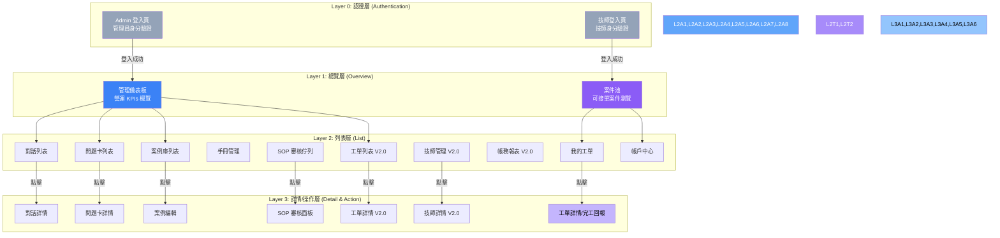
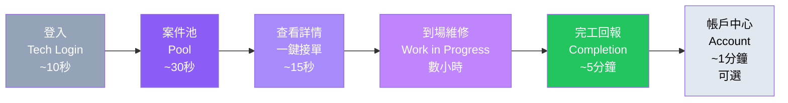
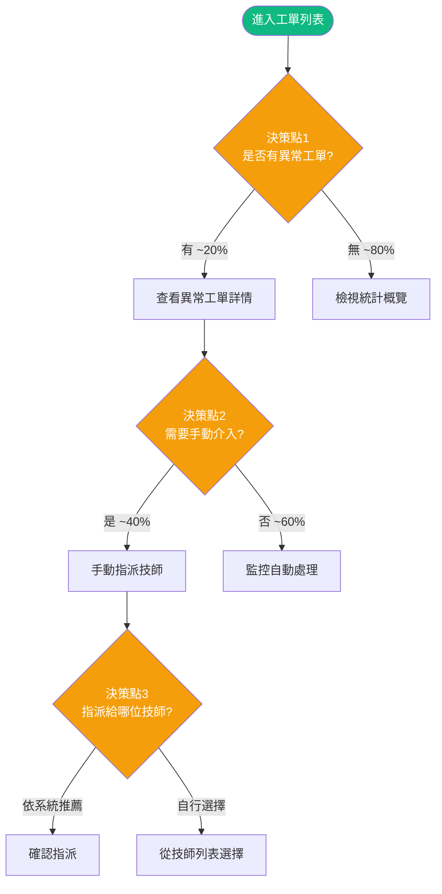
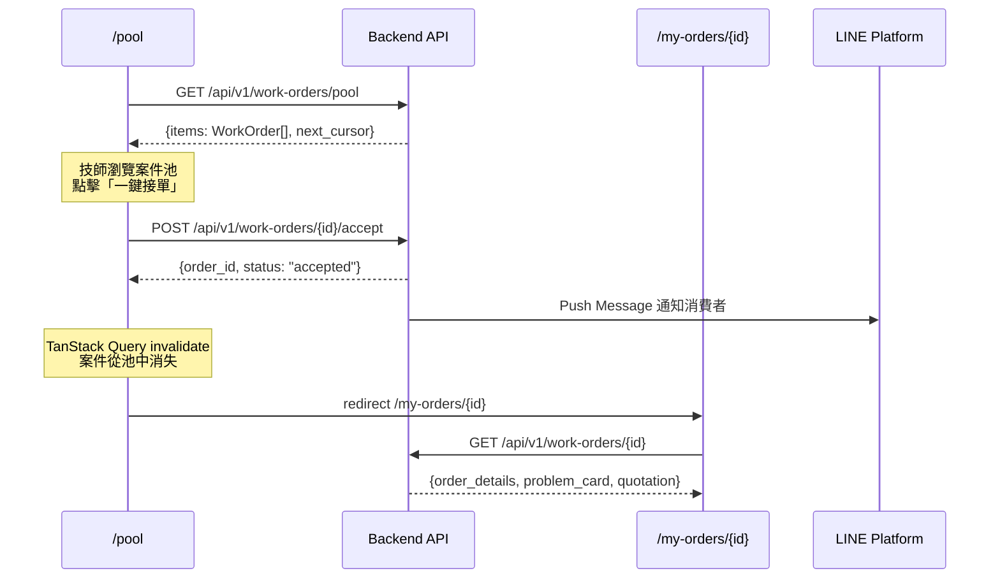
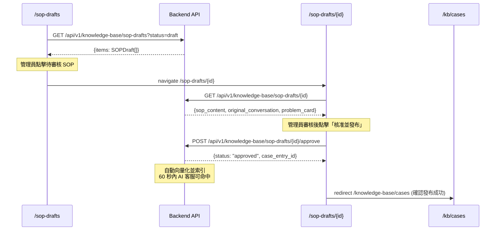

# 前端信息架構規範 (Frontend Information Architecture) - 電子鎖智能客服與派工平台

---

**文件版本 (Document Version):** `v1.2`
**最後更新 (Last Updated):** `2026-04-22`
**主要作者 (Lead Author):** `前端架構師, UX 設計師`
**審核者 (Reviewers):** `PM, 技術負責人, 後端技術負責人`
**狀態 (Status):** `Active`
**相關文檔:**
- API 設計規範：[`E5--api-design-specification`](E5--api-design-specification.md)
- 前端架構規範：[`E5x--frontend-architecture`](E5x--frontend-architecture.md)
- 工單互動流程：[`E5x--work-order-interaction-flows`](E5x--work-order-interaction-flows.md)
- 工單流程補充：[`E5x--work-order-flows-supplement`](E5x--work-order-flows-supplement.md)
- 派工營運補充：[`E5x--dispatch-operations-supplement`](E5x--dispatch-operations-supplement.md)
- 多租戶架構：[`platform-multi-tenant/multi-tenant-architecture`](platform-multi-tenant/multi-tenant-architecture.md)
- 派工整合規格：[`platform-multi-tenant/dispatch-integration-spec`](platform-multi-tenant/dispatch-integration-spec.md)
- Agent Harness 診斷架構：[`agent-harness/diagnostic-intelligence-architecture`](agent-harness/diagnostic-intelligence-architecture.md)
- 技術規格集：[`specs/_MOC`](specs/_MOC.md)（RBAC / 稽核 / 即時訊息 / 電子簽章 / 退款 / 保固 / 庫存 / 資料匯出）

---

## 目錄 (Table of Contents)

- [1. 文檔目的與範圍](#1-文檔目的與範圍)
- [2. 核心設計原則](#2-核心設計原則)
- [3. 資訊架構總覽](#3-資訊架構總覽)
- [4. 核心用戶旅程](#4-核心用戶旅程)
- [5. 網站地圖與導航結構](#5-網站地圖與導航結構)
- [6. 頁面詳細規格](#6-頁面詳細規格)
- [7. 組件連結與導航系統](#7-組件連結與導航系統)
- [8. 數據流與狀態管理](#8-數據流與狀態管理)
- [9. URL 結構與路由規範](#9-url-結構與路由規範)
- [10. 實施檢查清單與驗收標準](#10-實施檢查清單與驗收標準)
- [11. 附錄](#11-附錄)

---

## 1. 文檔目的與範圍

### 1.1 目的 (Purpose)

本文檔旨在提供「電子鎖智能客服與派工平台」前端的完整信息架構規範，作為前端開發、設計與測試的**單一事實來源 (SSOT)**。

**核心目標：**
- 定義 Admin Panel 與 Technician Web App 的完整用戶旅程與頁面職責
- 規範導航結構與 URL 設計，確保路由與後端 DDD Bounded Contexts 對齊
- 統一前端數據流與狀態管理策略（TanStack Query + Zustand + URL State）
- 提供可執行的實施檢查清單與頁面級驗收標準

### 1.2 適用範圍 (Scope)

| 適用範圍 | 說明 |
|:---|:---|
| **包含 (In Scope)** | - Admin Panel 所有頁面的信息架構（V1.0 + V2.0）<br/>- Technician Web App 所有頁面的信息架構（V2.0）<br/>- 用戶旅程與導航設計<br/>- URL 結構與路由規範<br/>- 頁面間數據傳遞與狀態策略<br/>- 頁面級 KPIs 與驗收標準 |
| **不包含 (Out of Scope)** | - LINE Bot 消費者端互動流程（透過 LINE Messaging API，無 Web UI）<br/>- 視覺設計細節（參考 UI/UX Spec）<br/>- 組件級別實現細節（參考 `E5x--frontend-architecture.md`）<br/>- 後端 API 實作（參考 `E5--api-design-specification.md`） |

### 1.3 角色與職責 (RACI)

| 角色 | 職責 | 責任類型 |
|:---|:---|:---|
| **PM** | 定義用戶需求與核心旅程、確認 KPIs 目標值 | R/A |
| **UX Designer** | 設計信息架構、導航流程、頁面佈局模型 | R/A |
| **Frontend Lead** | 審核技術可行性、路由設計、狀態管理策略 | A |
| **Frontend DEV** | 實現頁面與導航邏輯 | R |
| **Backend Lead** | 確認 API 端點與數據契約對齊 | C |
| **QA** | 驗證用戶流程與導航正確性 | C |

---

## 2. 核心設計原則

### 2.1 設計哲學

**核心價值主張：**
> 「讓管理員在最少操作步驟內掌控全局，讓技師在手機上一鍵完成接單與回報。」

**第一性原理推演：**
```
商業目標：降低客服成本、加速派工週轉
    ↓
用戶需求：管理員要快速監控與操作；技師要在手機上高效接單
    ↓
設計策略：Admin Panel 工具效率優先；Technician App Mobile-First 極簡流程
    ↓
架構決策：兩個獨立路由群組，共用組件庫，各自優化佈局
```

### 2.2 資訊架構原則

#### 2.2.1 簡化原則 (Simplification)

- **保留**：知識庫 CRUD、對話監控、工單全生命週期追蹤、技師接單/回報、帳務對帳
- **移除**：消費者評價系統（Phase 2）、多語言切換（Phase 2）、即時 GPS 追蹤
- **專注**：V1.0 專注 AI 客服管理閉環；V2.0 專注派工與帳務閉環

#### 2.2.2 認知負荷優化

基於 **Hick's Law** 和 **認知負荷理論**：
- **決策點數量**：Admin Panel 側邊欄一級導航控制在 8 項以內；Technician App 底部導航 3-4 項
- **每頁專注度**：每個頁面只有 1 個主要目標（如列表頁 → 瀏覽與篩選；詳情頁 → 查看與操作）
- **資訊分層**：列表頁展示摘要 → 點擊進入詳情 → 操作在詳情頁或 Modal 內完成

#### 2.2.3 架構模式

- [x] **層級化架構**：適合後台管理系統的多層導航
- [x] **中心輻射架構**：Technician App 以案件池為中心輻射至各功能

**選擇理由：**
- Admin Panel 功能模組多（知識庫、對話、派工、帳務），需要清晰的層級導航
- Technician App 功能聚焦（接單、回報、帳戶），以案件池為核心的輻射結構最直覺

---

## 3. 資訊架構總覽

### 3.1 系統層次結構



### 3.2 頁面總覽矩陣

#### Admin Panel 頁面

| # | 頁面路徑 | 頁面名稱 | 主要職責 | 用戶目標 | 導航深度 | 版本 |
|:--|:---------|:---------|:---------|:---------|:---------|:-----|
| A0 | `/login` | 管理員登入 | 身分驗證 | 安全登入系統 | Level 0 | V1.0 |
| A1 | `/dashboard` | 營運儀表板 | 展示營運 KPIs | 快速掌握系統全貌 | Level 1 | V1.0 |
| A2 | `/conversations` | 對話列表 | 瀏覽所有消費者對話 | 監控 AI 回答品質 | Level 2 | V1.0 |
| A3 | `/conversations/[id]` | 對話詳情 | 查看完整對話記錄 | 審視對話品質與問題處理過程 | Level 3 | V1.0 |
| A4 | `/problem-cards` | 問題卡列表 | 瀏覽所有 ProblemCard | 監控問題分布與診斷品質 | Level 2 | V1.0 |
| A5 | `/problem-cards/[id]` | 問題卡詳情 | 查看結構化問題描述 | 了解單一案件全貌 | Level 3 | V1.0 |
| A6 | `/knowledge-base/cases` | 案例庫 | 管理知識庫案例 | 維護 AI 知識基礎 | Level 2 | V1.0 |
| A7 | `/knowledge-base/cases/[id]` | 案例詳情/編輯 | 查看與編輯案例 | 新增/修改知識庫條目 | Level 3 | V1.0 |
| A8 | `/knowledge-base/manuals` | 手冊管理 | 管理產品手冊 PDF | 上傳與管理手冊 | Level 2 | V1.0 |
| A9 | `/knowledge-base/sop-drafts` | SOP 審核佇列 | 審核 AI 生成的 SOP | 確保知識品質 | Level 2 | V1.0 |
| A10 | `/knowledge-base/sop-drafts/[id]` | SOP 審核面板 | 審核單一 SOP 草稿 | 核准/退回/刪除 SOP | Level 3 | V1.0 |
| A11 | `/work-orders` | 工單列表 | 管理派工工單 | 監控派工全貌 | Level 2 | V2.0 |
| A12 | `/work-orders/[id]` | 工單詳情 | 查看工單全生命週期 | 追蹤單一案件進度 | Level 3 | V2.0 |
| A13 | `/technicians` | 技師管理 | 管理技師資料與技能 | 維護派工匹配依據 | Level 2 | V2.0 |
| A14 | `/technicians/[id]` | 技師詳情 | 查看技師完整資料 | 管理技師資訊與績效 | Level 3 | V2.0 |
| A15 | `/accounting` | 帳務管理 | 對帳、結算報表 | 完成月度結算 | Level 2 | V2.0 |
| A16 | `/settings` | 系統設定 | 管理帳號與系統配置 | 維護系統設定 | Level 2 | V1.0 |
| A17 | `/admin/refunds` | 退款審批頁 | 退款審批佇列與雙簽工作流 | 審核退款申請 | Level 2 | V2.0 |
| A18 | `/admin/roles` | RBAC 管理頁 | 角色與權限管理 | 配置角色權限矩陣 | Level 2 | V2.0 |
| A19 | `/admin/inventory` | 庫存管理頁 | 庫存水位與低庫存告警 | 監控材料庫存 | Level 2 | V2.0 |
| A20 | `/admin/audit-events` | 稽核日誌頁 | 7 種事件類型可篩選查詢 | 稽核系統操作記錄 | Level 2 | V2.0 |
| A21 | `/admin/warranty-claims` | 保固索賠頁 | 保固驗證與核准流程 | 處理保固索賠 | Level 2 | V2.0 |
| A22 | `/admin/disputes` | 爭議仲裁頁 | 證據包檢視與裁決 | 仲裁服務爭議 | Level 2 | V2.0 |
| A23 | `/admin/customers` | 客戶主檔 | 客戶 CRM、設備歷史 | 維護客戶與設備關聯資料 | Level 2 | V2.0 |
| A24 | `/admin/customers/[id]` | 客戶詳情 | 單一客戶完整紀錄 | 追蹤回頭客與高風險戶 | Level 3 | V2.0 |
| A25 | `/admin/technicians/[id]/schedule` | 技師排班 | 可服務時段、休假、備勤 | 維護派工可用性 | Level 3 | V2.0 |
| A26 | `/admin/technicians/[id]/skills` | 技師技能認證 | 品牌授權、等級、到期 | 確保派工技能匹配 | Level 3 | V2.0 |
| A27 | `/admin/technicians/[id]/settlements` | 技師結算明細 | 分潤、獎懲、墊付 | 月結 & 匯款對帳 | Level 3 | V2.0 |
| A28 | `/admin/dispatch-queue` | 派工佇列監控 | 重派嘗試、拒單紀錄、逾時 | 人工介入困難派工 | Level 2 | V2.0 |
| A29 | `/admin/reports/kpi` | KPI 儀表板 | 轉換漏斗、SLA、滿意度 | 即時營運指標檢視 | Level 2 | V2.0 |
| A30 | `/admin/reports/technician-ranking` | 技師排行榜 | 完工率、評分、週轉 | 績效管理 | Level 2 | V2.0 |
| A31 | `/admin/reports/revenue` | 營收報表 | 按期間/技師/品牌 | 財務與業務分析 | Level 2 | V2.0 |
| A32 | `/admin/diagnostics/[conversation_id]` | 診斷推理檢視 | L1/L2/L3 推理鏈、信心分數 | 審視/覆寫 AI 決策 | Level 3 | V2.0 |
| A33 | `/admin/knowledge-base/sop-performance` | SOP 績效儀表板 | SOP 使用率、成功率、滿意度 | 知識資產評估 | Level 3 | V2.0 |
| A34 | `/admin/settings/tenant` | 租戶設定 | 品牌色、LINE 綁定、價目 | 租戶層級客製 | Level 2 | V3.0 |
| A35 | `/admin/settings/tenant/brand` | 品牌客製 | Logo、色票、語氣範本 | 白牌化設定 | Level 3 | V3.0 |
| A36 | `/admin/super/tenants` | 超級管理租戶 | 租戶 CRUD、訂閱、使用量 | 平台營運 | Level 2 | V3.0 |

#### Technician Web App 頁面

| # | 頁面路徑 | 頁面名稱 | 主要職責 | 用戶目標 | 導航深度 | 版本 |
|:--|:---------|:---------|:---------|:---------|:---------|:-----|
| T0 | `/tech-login` | 技師登入 | 身分驗證 | 安全登入 | Level 0 | V2.0 |
| T1 | `/pool` | 案件池 | 瀏覽可接案件 | 發現並選擇工作機會 | Level 1 | V2.0 |
| T2 | `/my-orders` | 我的工單 | 瀏覽已接案件 | 管理進行中的工作 | Level 2 | V2.0 |
| T3 | `/my-orders/[id]` | 工單詳情/完工回報 | 查看詳情與提交回報 | 查看工作內容/提交完工 | Level 3 | V2.0 |
| T4 | `/account` | 帳戶中心 | 收入統計與歷史 | 掌握財務狀況 | Level 2 | V2.0 |
| T5 | `/my-orders/[id]/scope-change` | 範圍變更申請 | 現場追加工項、報價更新 | 送出追加報價待客戶核准 | Level 4 | V2.0 |
| T6 | `/my-orders/[id]/material-request` | 缺料回報 | 缺件清單、替代方案 | 進入缺料等待 / 部分完工 | Level 4 | V2.0 |
| T7 | `/my-orders/[id]/delay` | 延遲通知 | 新 ETA、事由、客戶通知 | 合規延遲不罰款 | Level 4 | V2.0 |
| T8 | `/my-orders/[id]/door-check` | 門面外觀檢核 | 抵達前後對比照 | 保障雙方、避免爭議 | Level 4 | V2.0 |
| T9 | `/my-orders/[id]/signature` | 雙方簽名 | 完工/交付電子簽章 | 提升可追溯性 | Level 4 | V2.0 |
| T10 | `/account/schedule` | 我的排班 | 查看/申請休假 | 自主管理可服務時段 | Level 3 | V2.0 |

**總計：** Admin Panel 37 頁（含 V3.0 多租戶 3 頁）+ Technician App 11 頁 = **48 頁**

> **備註：** A17–A22 為 V2.0 營運閉環必要頁（退款/RBAC/庫存/稽核/保固/爭議），補 A23–A33 係對齊 `E5x--dispatch-operations-supplement` 與 13 項 `specs/`；A34–A36 對齊 V3.0 多租戶架構；T5–T10 對齊 `E5x--work-order-interaction-flows` 10 個流程中的非 Happy Path 分支。

---

## 4. 核心用戶旅程

### 4.1 管理員核心旅程：知識庫管理閉環 (V1.0)


### 4.2 管理員核心旅程：派工監控 (V2.0)


### 4.3 技師核心旅程：接單到完工 (V2.0)



### 4.4 用戶旅程映射表

#### 管理員旅程 - 知識庫管理

| 階段 | 頁面 | 用戶心理狀態 | 設計目標 | 主要 CTA | 預期停留時間 |
|:-----|:-----|:-------------|:---------|:--------|:-------------|
| **概覽** | 儀表板 | 需要全局概覽 | 一眼看到關鍵指標 | 「查看 SOP 待審核」 | 30 秒 |
| **篩選** | SOP 審核佇列 | 需要找到待處理項目 | 快速定位待審核 SOP | 「開始審核」 | 1 分鐘 |
| **審核** | SOP 審核面板 | 認真評估品質 | 對照原始對話確認 SOP 品質 | 「核准」/「退回」 | 3 分鐘 |
| **確認** | 案例庫 | 確認知識已更新 | 確認 SOP 已發布至知識庫 | 「返回儀表板」 | 30 秒 |

#### 技師旅程 - 接單到完工

| 階段 | 頁面 | 用戶心理狀態 | 設計目標 | 主要 CTA | 預期停留時間 |
|:-----|:-----|:-------------|:---------|:--------|:-------------|
| **發現** | 案件池 | 尋找工作機會 | 快速瀏覽匹配案件 | 「查看詳情」 | 30 秒 |
| **決策** | 案件詳情 | 評估是否接單 | 展示關鍵資訊輔助決策 | 「一鍵接單」 | 15 秒 |
| **執行** | 工單詳情 | 前往現場維修 | 展示客戶地址與問題摘要 | 「開始維修」 | - |
| **回報** | 完工回報 | 記錄完成結果 | 簡化回報流程 | 「提交完工報告」 | 5 分鐘 |
| **確認** | 帳戶中心 | 確認收入 | 展示本次收入明細 | 「返回案件池」 | 1 分鐘 |

### 4.5 決策點分析

**管理員在工單管理中的 3 個主要決策點：**



**總決策點：** 3 個

---

## 5. 網站地圖與導航結構

### 5.1 完整網站地圖

```
Smart Lock Platform (/)
│
├─ (auth) 認證路由群組 ── 無側邊欄佈局
│  ├─ 0. /login                              [管理員登入]
│  └─ 1. /forgot-password                    [忘記密碼]
│
├─ (dashboard) Admin Panel 路由群組 ── 側邊欄 + 頂部導航佈局
│  ├─ 2. /dashboard                          [營運儀表板]
│  │  ├─ #conversations-stats (錨點：對話統計卡片)
│  │  ├─ #problem-distribution (錨點：問題類別分布圖)
│  │  ├─ #daily-trend (錨點：每日對話量趨勢)
│  │  └─ → /conversations, /problem-cards, /knowledge-base/sop-drafts (快捷入口)
│  │
│  ├─ 3. /conversations                      [對話列表]
│  │  ├─ Query: ?status={active|resolved|escalated}&cursor={cursor}
│  │  └─ → /conversations/{id} (點擊查看)
│  │
│  ├─ 4. /conversations/{id}                 [對話詳情]
│  │  ├─ #timeline (錨點：對話時間軸)
│  │  ├─ #problem-card (錨點：關聯問題卡)
│  │  └─ ← /conversations (返回列表)
│  │
│  ├─ 5. /problem-cards                      [問題卡列表]
│  │  ├─ Query: ?status={open|diagnosing|resolved|escalated}&category={category}&cursor={cursor}
│  │  ├─ NOTE: ProblemCard 使用 domain-agnostic 設計，domain_attributes 為 JSONB
│  │  │        前端需動態渲染欄位（由 config 定義，非固定 brand/model 欄位）
│  │  └─ → /problem-cards/{id} (點擊查看)
│  │
│  ├─ 6. /problem-cards/{id}                 [問題卡詳情]
│  │  ├─ Core fields: symptom_summary, category, completeness_score, status
│  │  ├─ Domain fields: 動態渲染 domain_attributes JSONB（如 device_brand, device_model, door_type）
│  │  ├─ Resolution: attempts[] 時間軸 + resolution_summary
│  │  ├─ → /conversations/{conv_id} (查看關聯對話)
│  │  ├─ → /work-orders/{wo_id} (查看關聯工單, V2.0)
│  │  └─ ← /problem-cards (返回列表)
│  │
│  ├─ 7. /knowledge-base/cases               [案例庫列表]
│  │  ├─ Query: ?brand={brand}&verified={true|false}&cursor={cursor}
│  │  ├─ → /knowledge-base/cases/new (新增案例)
│  │  └─ → /knowledge-base/cases/{id} (編輯案例)
│  │
│  ├─ 8. /knowledge-base/cases/{id}          [案例詳情/編輯]
│  │  └─ ← /knowledge-base/cases (返回列表)
│  │
│  ├─ 9. /knowledge-base/manuals             [手冊管理]
│  │  ├─ Query: ?brand={brand}&cursor={cursor}
│  │  └─ [上傳 PDF 功能]
│  │
│  ├─ 10. /knowledge-base/sop-drafts         [SOP 審核佇列]
│  │  ├─ Query: ?status={draft|approved|rejected}&cursor={cursor}
│  │  └─ → /knowledge-base/sop-drafts/{id} (審核)
│  │
│  ├─ 11. /knowledge-base/sop-drafts/{id}    [SOP 審核面板]
│  │  ├─ #sop-content (錨點：SOP 內容)
│  │  ├─ #original-conversation (錨點：原始對話記錄)
│  │  └─ ← /knowledge-base/sop-drafts (返回佇列)
│  │
│  ├─ 12. /work-orders                       [工單列表] (V2.0)
│  │  ├─ Query: ?status={pending|assigned|in_progress|completed}&cursor={cursor}
│  │  └─ → /work-orders/{id} (查看詳情)
│  │
│  ├─ 13. /work-orders/{id}                  [工單詳情] (V2.0)
│  │  ├─ #timeline (錨點：狀態時間軸)
│  │  ├─ #problem-card (錨點：問題卡)
│  │  ├─ #quotation (錨點：報價明細)
│  │  ├─ #completion-report (錨點：完工報告)
│  │  ├─ → /problem-cards/{pc_id} (查看問題卡)
│  │  ├─ → /technicians/{tech_id} (查看技師)
│  │  ├─ [手動指派 Modal]
│  │  └─ ← /work-orders (返回列表)
│  │
│  ├─ 14. /technicians                       [技師管理] (V2.0)
│  │  ├─ Query: ?status={active|inactive}&brand={brand}&cursor={cursor}
│  │  └─ → /technicians/{id} (查看詳情)
│  │
│  ├─ 15. /technicians/{id}                  [技師詳情] (V2.0)
│  │  ├─ #profile (錨點：基本資料)
│  │  ├─ #skills (錨點：技能認證)
│  │  ├─ #history (錨點：歷史工單)
│  │  ├─ #performance (錨點：績效統計)
│  │  └─ ← /technicians (返回列表)
│  │
│  ├─ 16. /accounting                        [帳務管理] (V2.0)
│  │  ├─ #monthly-report (錨點：月度結算報表)
│  │  ├─ #pending-review (錨點：待審核墊付)
│  │  ├─ #vouchers (錨點：記帳憑證)
│  │  └─ [匯出 Excel/PDF 功能]
│  │
│  ├─ 17. /settings                          [系統設定]
│  │  ├─ #profile (錨點：個人資料)
│  │  ├─ #security (錨點：安全設定)
│  │  ├─ #pricing-rules (錨點：報價規則, V2.0)
│  │  └─ #surcharge-rules (錨點：加價規則, V2.0)
│  │
│  ├─ 18. /admin/refunds                     [退款審批, V2.0]   ← refund-approval-spec
│  │  ├─ Query: ?status={pending|approved|rejected|completed}
│  │  └─ → [雙簽 Modal：管理員簽名 + 財務簽名]
│  │
│  ├─ 19. /admin/roles                       [RBAC 管理, V2.0]  ← rbac-dynamic-spec
│  │  ├─ → /admin/roles/new (新增自訂角色)
│  │  └─ → /admin/roles/{id}/audit (檢視角色變更稽核)
│  │
│  ├─ 20. /admin/inventory                   [庫存管理, V2.0]   ← inventory-management-spec
│  │  ├─ #parts (錨點：零件主檔)
│  │  ├─ #low-stock (錨點：低庫存告警)
│  │  └─ #usage-history (錨點：技師耗料紀錄)
│  │
│  ├─ 21. /admin/audit-events                [稽核日誌, V2.0]   ← audit-log-spec
│  │  ├─ Query: ?event_type={LOGIN|CREATE|UPDATE|DELETE|EXPORT|APPROVE_REFUND|ESCALATE_DISPUTE}
│  │  └─ [每筆可展開 before/after diff]
│  │
│  ├─ 22. /admin/warranty-claims             [保固索賠, V2.0]   ← warranty-dispute-spec
│  │  └─ → /admin/warranty-claims/{id}
│  │
│  ├─ 23. /admin/disputes                    [爭議仲裁, V2.0]   ← warranty-dispute-spec §3
│  │  └─ → /admin/disputes/{id}
│  │
│  ├─ 24. /admin/customers                   [客戶主檔, V2.0]   ← dispatch-operations §5
│  │  ├─ Query: ?risk_level={high|medium|low}
│  │  └─ → /admin/customers/{id}
│  │
│  ├─ 25. /admin/customers/{id}              [客戶詳情, V2.0]
│  │  ├─ #devices (錨點：名下設備)
│  │  ├─ #history (錨點：服務歷史)
│  │  └─ #notes (錨點：備註/風險標記)
│  │
│  ├─ 26. /admin/technicians/{id}/schedule   [技師排班, V2.0]   ← dispatch-operations §1
│  ├─ 27. /admin/technicians/{id}/skills     [技師技能, V2.0]   ← dispatch-operations §6
│  ├─ 28. /admin/technicians/{id}/settlements [技師結算, V2.0]  ← dispatch-operations §3
│  │
│  ├─ 29. /admin/dispatch-queue              [派工佇列監控, V2.0] ← dispatch-operations §4 拒單重派
│  │  └─ [每筆工單的 1~3 次派工嘗試、match score、拒單原因]
│  │
│  ├─ 30. /admin/reports/kpi                 [KPI 儀表板, V2.0] ← dispatch-operations §7
│  │  ├─ #funnel (錨點：轉換漏斗)
│  │  ├─ #sla (錨點：SLA 達成率)
│  │  └─ #satisfaction (錨點：客戶滿意度)
│  │
│  ├─ 31. /admin/reports/technician-ranking  [技師排行, V2.0]
│  ├─ 32. /admin/reports/revenue             [營收報表, V2.0]
│  │
│  ├─ 33. /admin/diagnostics/{conversation_id} [診斷推理, V2.0] ← agent-harness
│  │  ├─ #l1-vector (錨點：L1 向量搜尋結果)
│  │  ├─ #l2-rag (錨點：L2 RAG 推論)
│  │  ├─ #l3-escalation (錨點：L3 升級判定)
│  │  ├─ #dispatch-signals (錨點：派工信號 7 種)
│  │  └─ [管理員覆寫 / 反饋提交]
│  │
│  ├─ 34. /admin/knowledge-base/sop-performance [SOP 績效, V2.0]
│  │
│  ├─ 35. /admin/settings/tenant             [租戶設定, V3.0]   ← multi-tenant-architecture
│  │  ├─ /admin/settings/tenant/brand        [品牌客製]
│  │  ├─ /admin/settings/tenant/integrations [LINE / 金流綁定]
│  │  └─ /admin/settings/tenant/pricing      [租戶定價策略]
│  │
│  └─ 36. /admin/super/tenants               [超管租戶, V3.0]
│     ├─ /admin/super/tenants/{tenant_id}/usage
│     ├─ /admin/super/tenants/{tenant_id}/billing
│     └─ /admin/super/dashboard              [平台彙總 KPI]
│
└─ (technician) 技師工作台路由群組 ── Mobile-First 底部導航佈局
   ├─ 37. /tech-login                        [技師登入]
   │
   ├─ 38. /pool                              [案件池]
   │  ├─ Query: ?sort_by={distance|reward|urgency}
   │  └─ → [案件詳情 Modal / 一鍵接單]
   │
   ├─ 39. /my-orders                         [我的工單]
   │  ├─ Query: ?status={accepted|in_progress|material_pending|scope_changed|completed}
   │  └─ → /my-orders/{id} (點擊查看)
   │
   ├─ 40. /my-orders/{id}                    [工單詳情 / 完工回報]
   │  ├─ #info (錨點：案件資訊)
   │  ├─ #completion-form (錨點：完工回報表單)
   │  ├─ → /my-orders/{id}/scope-change     [範圍變更申請, Flow 3]
   │  ├─ → /my-orders/{id}/material-request [缺料回報, Flow 4]
   │  ├─ → /my-orders/{id}/delay            [延遲通知, Flow 5]
   │  ├─ → /my-orders/{id}/door-check       [門面外觀檢核, Flow 10]
   │  ├─ → /my-orders/{id}/signature        [雙方電子簽章, e-signature-spec]
   │  └─ ← /my-orders (返回列表)
   │
   ├─ 41. /account                           [帳戶中心]
   │  ├─ #summary (錨點：本月收入摘要)
   │  ├─ #history (錨點：歷史明細)
   │  └─ [匯出 PDF 功能]
   │
   └─ 42. /account/schedule                  [我的排班] ← dispatch-operations §1
      ├─ #calendar (錨點：月視圖可服務時段)
      └─ [申請休假 / 備勤]
```

### 5.2 導航連結矩陣

#### Admin Panel 核心頁面連結

| 來源 \ 目標 | Dashboard | Conversations | Conv Detail | Problem Cards | PC Detail | KB Cases | SOP Drafts | Work Orders | Technicians | Accounting |
|:---|:---:|:---:|:---:|:---:|:---:|:---:|:---:|:---:|:---:|:---:|
| **Dashboard** | - | ✅ 側邊欄 | ❌ | ✅ 側邊欄 | ❌ | ✅ 側邊欄 | ✅ 快捷卡片 | ✅ 側邊欄 | ❌ | ❌ |
| **Conversations** | ✅ 側邊欄 | - | ✅ 點擊行 | ❌ | ❌ | ❌ | ❌ | ❌ | ❌ | ❌ |
| **Conv Detail** | ❌ | ✅ 返回 | - | ❌ | ✅ 連結 | ❌ | ❌ | ⚠️ 連結 | ❌ | ❌ |
| **Problem Cards** | ✅ 側邊欄 | ❌ | ❌ | - | ✅ 點擊行 | ❌ | ❌ | ❌ | ❌ | ❌ |
| **PC Detail** | ❌ | ✅ 連結 | ❌ | ✅ 返回 | - | ❌ | ❌ | ⚠️ 連結 | ❌ | ❌ |
| **Work Orders** | ✅ 側邊欄 | ❌ | ❌ | ❌ | ❌ | ❌ | ❌ | - | ❌ | ❌ |
| **WO Detail** | ❌ | ❌ | ❌ | ✅ 連結 | ❌ | ❌ | ❌ | ✅ 返回 | ✅ 連結 | ❌ |

**圖例：**
- ✅ 直接可達
- ⚠️ 條件可達（V2.0 工單連結僅在有工單時顯示）
- ❌ 不存在直接連結

#### Technician App 連結

| 來源 \ 目標 | Pool | My Orders | Order Detail | Account |
|:---|:---:|:---:|:---:|:---:|
| **Pool** | - | ✅ 底部導航 | ⚠️ 接單後 | ✅ 底部導航 |
| **My Orders** | ✅ 底部導航 | - | ✅ 點擊行 | ✅ 底部導航 |
| **Order Detail** | ❌ | ✅ 返回 | - | ❌ |
| **Account** | ✅ 底部導航 | ✅ 底部導航 | ❌ | - |

---

## 6. 頁面詳細規格

### 6.1 管理員登入頁 (Admin Login)

#### 基本信息

| 屬性 | 值 |
|:-----|:---|
| **路徑** | `/login` |
| **頁面類型** | 認證頁（無側邊欄佈局） |
| **導航深度** | Level 0 |

#### 職責與目標

| 項目 | 內容 |
|:-----|:-----|
| **主要任務** | 管理員身分驗證 |
| **用戶目標** | 安全登入系統 |
| **轉換目標** | 登入成功率 >= 95% |

#### 關鍵組件結構

```html
<page-structure>
  <!-- 1. 品牌標識 -->
  <header class="auth-header">
    <logo>Smart Lock 平台 Logo</logo>
    <title>管理後台</title>
  </header>

  <!-- 2. 登入表單 -->
  <section class="login-form">
    <form-group>
      <label>電子郵件</label>
      <input type="email" required />
    </form-group>
    <form-group>
      <label>密碼</label>
      <input type="password" required />
    </form-group>
    <button class="btn-primary">登入</button>
    <link href="/forgot-password">忘記密碼？</link>
  </section>
</page-structure>
```

#### 導航出口

```javascript
{
  primary: '/dashboard',        // 登入成功
  forgot: '/forgot-password'    // 忘記密碼
}
```

#### 驗收標準

- [ ] 支援 email + password 登入
- [ ] 登入失敗顯示友善錯誤訊息
- [ ] 連續 5 次失敗鎖定帳號 15 分鐘
- [ ] JWT Token 存於 httpOnly Cookie
- [ ] 登入成功導向 `/dashboard`

---

### 6.2 營運儀表板 (Dashboard)

#### 基本信息

| 屬性 | 值 |
|:-----|:---|
| **路徑** | `/dashboard` |
| **頁面類型** | 儀表板頁 |
| **導航深度** | Level 1 |

#### 職責與目標

| 項目 | 內容 |
|:-----|:-----|
| **主要任務** | 展示 AI 客服營運關鍵指標 (V1.0)；展示派工系統即時狀態 (V2.0) |
| **用戶目標** | 快速掌握系統運行狀態與服務品質 |
| **轉換目標** | 管理員在 30 秒內識別需要關注的異常 |

#### 關鍵組件結構

```html
<page-structure>
  <!-- 1. 統計卡片列 (V1.0) -->
  <section class="stats-cards">
    <card>今日對話數</card>
    <card>自助解決率</card>
    <card>平均回應時間</card>
    <card>待審核 SOP 數</card>
  </section>

  <!-- 2. 統計卡片列 (V2.0 新增) -->
  <section class="dispatch-stats-cards">
    <card>今日待派案件</card>
    <card>已派案件</card>
    <card>完成案件</card>
    <card>平均派工到完工時間</card>
  </section>

  <!-- 3. 圖表區域 -->
  <section class="charts-grid">
    <chart type="pie">問題類別分布</chart>
    <chart type="line">每日對話量趨勢 (近30天)</chart>
    <chart type="bar">各品牌報修數量排行</chart>
  </section>

  <!-- 4. 異常告警列 (V2.0) -->
  <section class="alerts">
    <alert-list>超過 2 小時未接單案件</alert-list>
  </section>

  <!-- 5. 技師分布地圖 (V2.0) -->
  <section class="technician-map">
    <google-map>技師位置 + 案件位置</google-map>
  </section>
</page-structure>
```

#### 導航出口

```javascript
{
  conversations: '/conversations',
  problemCards: '/problem-cards',
  sopDrafts: '/knowledge-base/sop-drafts',
  workOrders: '/work-orders',       // V2.0
  alerts: '/work-orders?status=pending&overdue=true'  // V2.0
}
```

#### 關鍵指標 (KPIs)

| 指標 | 目標值 | 衡量方式 |
|:-----|:-------|:---------|
| **頁面載入時間** | < 2 秒 | Lighthouse LCP |
| **數據更新頻率** | 每 60 秒 | TanStack Query refetchInterval |
| **管理員識別異常時間** | < 30 秒 | 用戶測試 |

#### 驗收標準

- [ ] 統計卡片正確顯示今日數據（PRD US-017）
- [ ] 圓餅圖正確顯示問題類別分布
- [ ] 折線圖正確顯示近 30 天對話量趨勢
- [ ] 品牌排行正確顯示各品牌報修數量
- [ ] 資料每 60 秒自動更新或支援手動刷新
- [ ] V2.0: 地圖正確顯示技師分布（Google Maps API）
- [ ] V2.0: 超過 2 小時未接單案件標紅告警

---

### 6.3 對話列表頁 (Conversations)

#### 基本信息

| 屬性 | 值 |
|:-----|:---|
| **路徑** | `/conversations` |
| **URL 參數** | `status` (active/resolved/escalated, 可選), `cursor` (可選), `sort_by` (可選) |
| **頁面類型** | 數據列表頁 |
| **導航深度** | Level 2 |

#### 職責與目標

| 項目 | 內容 |
|:-----|:-----|
| **主要任務** | 展示所有消費者與 AI 客服的對話記錄 |
| **用戶目標** | 監控 AI 回答品質、發現改善機會 |
| **轉換目標** | 管理員在 1 分鐘內找到目標對話 |

#### 關鍵組件結構

```html
<page-structure>
  <!-- 1. 頁面標題與操作列 -->
  <header class="page-header">
    <title>對話記錄</title>
    <actions>
      <button>匯出 CSV</button>
    </actions>
  </header>

  <!-- 2. 篩選列 -->
  <section class="filters">
    <select name="status">狀態篩選</select>
    <date-picker>日期範圍</date-picker>
    <search-input>搜尋消費者</search-input>
  </section>

  <!-- 3. 數據表格 -->
  <section class="data-table">
    <table columns="時間, LINE 用戶, 狀態, 訊息數, 解決途徑, 操作">
      <!-- DataTable + cursor-based pagination -->
    </table>
  </section>
</page-structure>
```

#### 導航出口

```javascript
{
  detail: '/conversations/{id}',  // 點擊行
  export: '觸發 CSV 下載'
}
```

#### 驗收標準

- [ ] 列表按時間倒序排列（PRD US-016）
- [ ] 支援按日期、狀態、消費者篩選
- [ ] 每筆對話標示解決途徑（案例庫命中/RAG/人工/未解決）
- [ ] 支援匯出對話記錄 (CSV)
- [ ] Cursor-based 分頁正常運作，單頁 20 筆
- [ ] Server Component 渲染，首屏 < 2 秒

---

### 6.4 對話詳情頁 (Conversation Detail)

#### 基本信息

| 屬性 | 值 |
|:-----|:---|
| **路徑** | `/conversations/[id]` |
| **頁面類型** | 詳情頁 |
| **導航深度** | Level 3 |

#### 關鍵組件結構

```html
<page-structure>
  <!-- 1. 麵包屑與返回 -->
  <nav class="breadcrumb">
    對話記錄 > 對話 #{id}
  </nav>

  <!-- 2. 對話時間軸 -->
  <section class="conversation-timeline">
    <ConversationTimeline messages={messages} />
    <!-- 含文字、圖片、AI 回覆標記、ProblemCard 展示 -->
  </section>

  <!-- 3. 側邊面板：問題卡摘要 -->
  <aside class="problem-card-panel">
    <ProblemCardViewer card={problemCard} />
    <link href="/problem-cards/{pc_id}">查看完整問題卡</link>
  </aside>

  <!-- 4. 對話元資訊 -->
  <section class="metadata">
    <item>解決途徑: {resolution_level}</item>
    <item>總訊息數: {message_count}</item>
    <item>開始時間: {started_at}</item>
    <item>解決時間: {resolved_at}</item>
  </section>
</page-structure>
```

#### 導航出口

```javascript
{
  back: '/conversations',
  problemCard: '/problem-cards/{problem_card_id}',
  workOrder: '/work-orders/{work_order_id}'  // V2.0, 若有關聯工單
}
```

#### 驗收標準

- [ ] 完整顯示對話內容（文字、圖片、ProblemCard）
- [ ] 訊息時間軸清晰標示 user/assistant 角色
- [ ] 圖片可點擊放大查看
- [ ] 側邊面板顯示關聯問題卡摘要
- [ ] 頁面載入 < 2 秒

---

### 6.5 案例庫列表頁 (Knowledge Base Cases)

#### 基本信息

| 屬性 | 值 |
|:-----|:---|
| **路徑** | `/knowledge-base/cases` |
| **URL 參數** | `brand` (可選), `verified` (true/false, 可選), `cursor` (可選) |
| **頁面類型** | CRUD 列表頁 |
| **導航深度** | Level 2 |

#### 關鍵組件結構

```html
<page-structure>
  <!-- 1. 頁面標題與操作 -->
  <header class="page-header">
    <title>案例庫</title>
    <actions>
      <button variant="primary">新增案例</button>
      <button variant="outline">匯入 CSV</button>
    </actions>
  </header>

  <!-- 2. 篩選 -->
  <section class="filters">
    <select name="brand">品牌篩選</select>
    <select name="verified">驗證狀態</select>
    <search-input>搜尋關鍵字</search-input>
  </section>

  <!-- 3. 案例表格 -->
  <section class="data-table">
    <table columns="標題, 品牌, 型號, 標籤, 驗證狀態, 建立時間, 操作">
      <!-- 支援行內編輯、刪除 -->
    </table>
  </section>
</page-structure>
```

#### 驗收標準

- [ ] 支援新增/編輯/刪除案例（PRD US-015）
- [ ] 支援按品牌、型號分類管理
- [ ] 支援匯入歷史案例 (CSV)
- [ ] 新增案例後系統自動計算 Embedding
- [ ] 刪除前彈出確認對話框

---

### 6.6 SOP 審核面板 (SOP Review Panel)

#### 基本信息

| 屬性 | 值 |
|:-----|:---|
| **路徑** | `/knowledge-base/sop-drafts/[id]` |
| **頁面類型** | 審核操作頁 |
| **導航深度** | Level 3 |

#### 關鍵組件結構

```html
<page-structure>
  <!-- 1. 麵包屑 -->
  <nav class="breadcrumb">
    知識庫 > SOP 審核 > #{id}
  </nav>

  <!-- 2. 雙欄佈局 -->
  <section class="review-layout two-column">
    <!-- 左欄：SOP 內容 -->
    <div class="sop-content">
      <h2>SOP 草稿內容</h2>
      <field>適用條件: {applicable_conditions}</field>
      <field>問題描述: {problem_description}</field>
      <field>解決步驟: {solution_steps}</field>
      <field>注意事項: {precautions}</field>
    </div>

    <!-- 右欄：原始對話 -->
    <div class="original-conversation">
      <h2>原始對話記錄</h2>
      <ConversationTimeline messages={original_messages} />
      <ProblemCardViewer card={original_problem_card} />
    </div>
  </section>

  <!-- 3. 審核操作 -->
  <section class="review-actions">
    <button variant="success">核准並發布</button>
    <button variant="warning">退回修改</button>
    <button variant="danger">刪除</button>
    <textarea placeholder="審核意見（選填）" />
  </section>
</page-structure>
```

#### 導航出口

```javascript
{
  back: '/knowledge-base/sop-drafts',
  approve: '/knowledge-base/cases',  // 核准後導向案例庫確認
}
```

#### 驗收標準

- [ ] 左右雙欄對照顯示 SOP 內容與原始對話（PRD US-013）
- [ ] 「核准」後 SOP 自動向量化並索引至案例庫，60 秒內生效（PRD US-014）
- [ ] 「退回」需填寫退回原因
- [ ] 「刪除」彈出確認對話框
- [ ] 審核操作有 Optimistic UI 即時反饋

---

### 6.7 工單列表頁 (Work Orders) - V2.0

#### 基本信息

| 屬性 | 值 |
|:-----|:---|
| **路徑** | `/work-orders` |
| **URL 參數** | `status` (pending/assigned/in_progress/completed, 可選), `cursor` (可選) |
| **頁面類型** | 看板/列表頁 |
| **導航深度** | Level 2 |

#### 關鍵組件結構

```html
<page-structure>
  <!-- 1. 頁面標題 -->
  <header class="page-header">
    <title>派工管理</title>
    <toggle>看板視圖 / 列表視圖</toggle>
  </header>

  <!-- 2. 看板視圖 (預設) -->
  <section class="kanban-view">
    <WorkOrderKanban>
      <column status="pending">待派工</column>
      <column status="assigned">已派工</column>
      <column status="in_progress">維修中</column>
      <column status="completed">已完成</column>
    </WorkOrderKanban>
  </section>

  <!-- 3. 列表視圖 (備選) -->
  <section class="list-view" hidden>
    <table columns="案件編號, 品牌型號, 區域, 技師, 狀態, 報價, 建立時間">
    </table>
  </section>
</page-structure>
```

#### 驗收標準

- [ ] 看板四欄拖放切換工單狀態
- [ ] 支援列表/看板視圖切換
- [ ] 異常案件（超過 2 小時未接單）標紅（PRD US-034）
- [ ] 支援按狀態篩選
- [ ] 案件搜尋支援：案件編號、消費者電話、技師姓名、地址關鍵字（PRD US-035）

---

### 6.8 工單詳情頁 (Work Order Detail) - V2.0

#### 基本信息

| 屬性 | 值 |
|:-----|:---|
| **路徑** | `/work-orders/[id]` |
| **頁面類型** | 詳情頁（含狀態時間軸） |
| **導航深度** | Level 3 |

#### 關鍵組件結構

```html
<page-structure>
  <!-- 1. 麵包屑與狀態 Badge -->
  <header>
    <breadcrumb>派工管理 > 工單 #{id}</breadcrumb>
    <badge variant="status">{current_status}</badge>
  </header>

  <!-- 2. 狀態時間軸 -->
  <section class="timeline">
    <timeline-node>報修 → AI 診斷 → 派工 → 接單 → 到場 → 完工 → 結算</timeline-node>
    <!-- 每個節點記錄：時間、操作者、備註 (PRD US-035) -->
  </section>

  <!-- 3. 關聯問題卡 -->
  <section class="problem-card">
    <ProblemCardViewer card={problem_card} />
  </section>

  <!-- 4. 報價明細 -->
  <section class="quotation">
    <QuotationBuilder quotation={quotation} readonly />
  </section>

  <!-- 5. 技師資訊 -->
  <section class="technician-info">
    <avatar /><name /><phone /><rating />
    <link href="/technicians/{tech_id}">查看技師詳情</link>
  </section>

  <!-- 6. 完工報告 (已完工時顯示) -->
  <section class="completion-report">
    <photos>維修前/後照片</photos>
    <materials>使用材料清單</materials>
    <hours>實際工時</hours>
    <advance-payment>墊付金額</advance-payment>
  </section>

  <!-- 7. 操作區 -->
  <section class="actions">
    <button variant="primary">手動指派技師</button>
    <button variant="outline">取消工單</button>
  </section>
</page-structure>
```

#### 驗收標準

- [ ] 完整狀態時間軸，每個節點含時間、操作者、備註（PRD US-035）
- [ ] 可查看關聯問題卡與報價明細
- [ ] 「手動指派」彈出技師選擇 Modal，顯示符合條件的技師列表（PRD US-026）
- [ ] 已完工案件顯示完工報告（照片、材料、工時）
- [ ] 頁面載入 < 2 秒

---

### 6.9 技師登入頁 (Tech Login)

#### 基本信息

| 屬性 | 值 |
|:-----|:---|
| **路徑** | `/tech-login` |
| **頁面類型** | 認證頁（Mobile-First） |
| **導航深度** | Level 0 |

#### 關鍵組件結構

```html
<page-structure>
  <header class="auth-header">
    <logo>Smart Lock 技師工作台</logo>
  </header>

  <section class="login-form">
    <form-group>
      <label>手機號碼</label>
      <input type="tel" required />
    </form-group>
    <form-group>
      <label>密碼</label>
      <input type="password" required />
    </form-group>
    <button class="btn-primary w-full h-12 text-lg">登入</button>
  </section>
</page-structure>
```

#### 驗收標準

- [ ] 支援手機號碼 + 密碼登入
- [ ] 登入按鈕尺寸 >= 44x44px（觸控友善）
- [ ] 登入成功導向 `/pool`
- [ ] Mobile-First 佈局，適配 375px 以上螢幕

---

### 6.10 案件池頁 (Case Pool) - V2.0

#### 基本信息

| 屬性 | 值 |
|:-----|:---|
| **路徑** | `/pool` |
| **URL 參數** | `sort_by` (distance/reward/urgency, 可選) |
| **頁面類型** | 即時更新列表頁（Mobile-First） |
| **導航深度** | Level 1 |

#### 職責與目標

| 項目 | 內容 |
|:-----|:-----|
| **主要任務** | 展示符合技師技能與區域的待派案件 |
| **用戶目標** | 快速找到適合自己的案件並接單 |
| **轉換目標** | 接單響應時間 < 30 秒 |

#### 關鍵組件結構

```html
<page-structure>
  <!-- 1. 頁面標題與排序 -->
  <header class="sticky-header">
    <title>可接案件</title>
    <sort-selector>距離 / 報酬 / 緊急程度</sort-selector>
  </header>

  <!-- 2. 案件卡片列表（無限滾動） -->
  <section class="card-list infinite-scroll">
    <CasePoolCard v-for="order in orders">
      <district>{order.district}</district>
      <brand-model>{order.brand} {order.model}</brand-model>
      <problem-summary>{order.problem_summary}</problem-summary>
      <urgency-badge>{order.urgency}</urgency-badge>
      <reward class="text-xl font-bold">${order.estimated_reward}</reward>
      <button class="w-full h-12 text-lg font-semibold">一鍵接單</button>
    </CasePoolCard>
  </section>

  <!-- 3. 底部導航 -->
  <nav class="bottom-nav">
    <tab active>案件池</tab>
    <tab>我的工單</tab>
    <tab>帳戶</tab>
  </nav>
</page-structure>
```

#### 導航出口

```javascript
{
  accept: '/my-orders/{id}',    // 接單成功後
  myOrders: '/my-orders',       // 底部導航
  account: '/account'           // 底部導航
}
```

#### 關鍵指標 (KPIs)

| 指標 | 目標值 | 衡量方式 |
|:-----|:-------|:---------|
| **案件池刷新頻率** | 每 15 秒 | TanStack Query refetchInterval |
| **接單響應時間** | < 30 秒 | 從查看到接單的操作時間 |
| **首屏載入** | < 2.5 秒 | Lighthouse LCP (4G) |

#### 驗收標準

- [ ] 僅顯示符合技師「服務區域」與「品牌技能」的案件（PRD US-021）
- [ ] 每筆案件顯示：地址區域、品牌型號、問題摘要、緊急程度、預估報酬
- [ ] 案件池每 15 秒自動刷新（TanStack Query refetchInterval）
- [ ] 支援按距離、報酬、緊急程度排序
- [ ] 一鍵接單，接單後案件從池中移除（PRD US-022）
- [ ] 接單後消費者自動收到 LINE 通知
- [ ] 無限滾動分頁，使用 useInfiniteQuery + cursor-based pagination
- [ ] 觸控友善：接單按鈕 >= 44x44px

---

### 6.11 工單詳情/完工回報 (Order Detail / Completion) - V2.0

#### 基本信息

| 屬性 | 值 |
|:-----|:---|
| **路徑** | `/my-orders/[id]` |
| **頁面類型** | 詳情 + 表單頁（Mobile-First） |
| **導航深度** | Level 3 |

#### 關鍵組件結構

```html
<page-structure>
  <!-- 1. 案件資訊摘要 -->
  <section class="order-info">
    <badge>{status}</badge>
    <address>{client_address}</address>
    <brand-model>{brand} {model}</brand-model>
    <problem-summary>{problem_summary}</problem-summary>
    <quotation-summary>{estimated_price}</quotation-summary>
  </section>

  <!-- 2. 狀態操作按鈕（根據當前狀態顯示） -->
  <section class="status-actions">
    <!-- status=accepted → 顯示「開始維修」 -->
    <button class="h-12 w-full">開始維修</button>
    <!-- status=in_progress → 顯示「完工回報」區塊 -->
  </section>

  <!-- 3. 完工回報表單 (status=in_progress 時顯示) -->
  <section class="completion-form">
    <CompletionReportForm>
      <photo-upload label="維修前照片" required min="1" />
      <photo-upload label="維修後照片" required min="1" />
      <textarea label="施工內容" required minLength="10" />
      <materials-list label="使用材料" />
      <number-input label="實際工時" />
      <number-input label="墊付金額" />
      <photo-upload label="墊付發票照片" />
      <button class="h-12 w-full" variant="success">提交完工報告</button>
    </CompletionReportForm>
  </section>
</page-structure>
```

#### 驗收標準

- [ ] 完工報告含維修前/後照片（必填）、施工內容、材料清單、工時（PRD US-023）
- [ ] 照片上傳支援壓縮，單張 < 5MB
- [ ] 提交後案件狀態變更為「待確認」
- [ ] 消費者自動收到 LINE 通知（完工摘要與費用明細）
- [ ] 表單驗證使用 React Hook Form + Zod Schema
- [ ] 所有按鈕觸控友善 (>= 44x44px)

---

### 6.12 帳戶中心 (Account) - V2.0

#### 基本信息

| 屬性 | 值 |
|:-----|:---|
| **路徑** | `/account` |
| **頁面類型** | 統計摘要頁（Mobile-First） |
| **導航深度** | Level 2 |

#### 關鍵組件結構

```html
<page-structure>
  <!-- 1. 本月收入摘要 -->
  <section class="income-summary">
    <card>本月已完成案件: {count}</card>
    <card>本月累計收入: ${total_income}</card>
    <card>待結算金額: ${pending_amount}</card>
    <card>已結算金額: ${settled_amount}</card>
  </section>

  <!-- 2. 月份切換與歷史明細 -->
  <section class="history">
    <month-selector>{year}-{month}</month-selector>
    <order-list>
      <order-item v-for="order in history">
        <date /><brand-model /><amount /><status-badge />
      </order-item>
    </order-list>
  </section>

  <!-- 3. 匯出 -->
  <section class="export">
    <button>匯出收入摘要 (PDF)</button>
  </section>
</page-structure>
```

#### 驗收標準

- [ ] 顯示本月已完成案件數、累計收入、待結算、已結算金額（PRD US-024）
- [ ] 歷史案件列表支援按月份篩選
- [ ] 每筆案件可查看完整費用明細
- [ ] 收入摘要支援匯出 PDF

---

### 6.13 退款審批頁 (Refund Approval) - V2.0

#### 基本信息

| 屬性 | 值 |
|:-----|:---|
| **路徑** | `/admin/refunds` |
| **URL 參數** | `status` (pending/approved/rejected/completed) |
| **頁面類型** | 審批工作流（佇列 + 雙簽 Modal） |
| **導航深度** | Level 2 |
| **對齊規格** | `specs/refund-approval-spec.md`, `specs/e-signature-spec.md` |
| **適用角色** | Admin（審核）、Finance（放款） |

#### 職責與目標

| 項目 | 內容 |
|:-----|:-----|
| **主要任務** | 審核客戶退款申請、金額 > 門檻啟動雙簽 |
| **用戶目標** | 在 48 小時內核准或駁回退款 |
| **合規目標** | 所有簽章記錄至稽核日誌（audit-log）供事後追溯 |

#### 關鍵組件結構

```html
<page-structure>
  <header class="page-header">
    <title>退款審批</title>
    <tabs>
      <tab active>待審核 <badge>{pending_count}</badge></tab>
      <tab>已核准</tab>
      <tab>已駁回</tab>
      <tab>已結案</tab>
    </tabs>
  </header>

  <section class="refund-queue">
    <table columns="申請編號, 工單, 申請人, 金額, 原因, 申請日期, SLA, 操作">
      <!-- SLA 欄位：剩餘處理時間 badge (綠/黃/紅) -->
    </table>
  </section>
</page-structure>
```

#### 審批 Modal（含雙簽）

```html
<modal title="退款申請審批" size="lg">
  <section class="work-order-summary">
    <!-- 工單摘要：報價/完工日期/客戶評分 -->
  </section>

  <section class="refund-request">
    <!-- 申請金額、理由、證據附件 -->
  </section>

  <section class="approval-form">
    <radio-group name="decision">
      <radio value="approve">全額核准</radio>
      <radio value="partial">部分核准 <input type="number" placeholder="核准金額" /></radio>
      <radio value="reject">駁回 <textarea placeholder="駁回原因" /></radio>
    </radio-group>

    <alert variant="info" condition="amount > refund_dual_sign_threshold">
      金額超過 NT${threshold}，需要財務主管雙簽。
    </alert>

    <section class="dual-signature">
      <SignaturePad role="admin" />
      <SignaturePad role="finance" condition="needsDualSign" />
      <!-- 每個簽章需輸入 PIN 確認 -->
    </section>
  </section>
</modal>
```

#### 驗收標準

- [ ] 佇列預設顯示「待審核」，按 SLA 剩餘時間排序
- [ ] 金額超過租戶定義門檻（`refund_dual_sign_threshold`）時啟動雙簽
- [ ] 簽章需 PIN 二次驗證，記錄 `signer_id`/`signed_at`/`ip`
- [ ] 核准後自動觸發 LINE 通知客戶 + 建立 Accounting voucher
- [ ] 駁回後客戶可透過 LINE 申訴（進入 `/admin/disputes`）
- [ ] 所有動作寫入 `audit-events`（事件類型 `APPROVE_REFUND`）
- [ ] 支援儲存草稿（暫緩決策，稍後繼續）

---

### 6.14 RBAC 管理頁 (Roles & Permissions) - V2.0

#### 基本信息

| 屬性 | 值 |
|:-----|:---|
| **路徑** | `/admin/roles` |
| **頁面類型** | 配置管理頁 |
| **導航深度** | Level 2 |
| **對齊規格** | `specs/rbac-dynamic-spec.md`, `specs/audit-log-spec.md` |
| **適用角色** | Admin only |

#### 關鍵組件結構

```html
<page-structure>
  <header class="page-header">
    <title>角色與權限</title>
    <actions>
      <button variant="primary">+ 新增自訂角色</button>
    </actions>
  </header>

  <section class="role-list">
    <table columns="角色, 類型, 使用者數, 權限數, 最後修改, 操作">
      <!-- 系統預設角色：Admin / Reviewer / Technician — 不可刪除 -->
      <!-- 自訂角色：Service Manager / Dispatcher / Finance / QA Auditor 等 -->
    </table>
  </section>
</page-structure>
```

#### 角色編輯 Modal：權限矩陣

```
功能模組 × CRUD 動作 × 資源限定（all / own / team）

維度示例：
- 工單：檢視 / 建立 / 指派 / 取消 / 匯出
- 退款：檢視 / 審核 / 雙簽 / 強制結案
- RBAC：檢視 / 建立角色 / 修改權限
- 客戶：檢視 / 匯出 / 合併 / 風險標記
- 稽核：檢視 / 匯出
- 多租戶（V3.0）：切換租戶 / 建立租戶
```

#### 驗收標準

- [ ] 系統預設角色 Admin / Reviewer / Technician 可複製為範本、不可刪除
- [ ] 權限矩陣支援「資源限定」（`all` / `own_tenant` / `own_team` / `self`）
- [ ] 角色修改後透過 WebSocket `/realtime/rbac` 廣播，持線上 session 即時生效（避免需重登）
- [ ] 刪除角色前檢查關聯使用者，列出受影響帳號
- [ ] 所有異動寫入 `audit-events`（事件類型 `UPDATE` + entity `role`）
- [ ] 提供「權限差異檢視」：複製自既有角色時顯示差異高亮
- [ ] 支援「臨時授權」：為特定使用者在限定時間內授予額外權限（需雙簽）

---

### 6.15 稽核日誌頁 (Audit Events) - V2.0

#### 基本信息

| 屬性 | 值 |
|:-----|:---|
| **路徑** | `/admin/audit-events` |
| **URL 參數** | `event_type`, `actor_id`, `entity_type`, `date_from`, `date_to`, `cursor` |
| **頁面類型** | 稽核查詢頁（唯讀） |
| **導航深度** | Level 2 |
| **對齊規格** | `specs/audit-log-spec.md` |
| **適用角色** | Admin、Auditor（自訂角色） |

#### 事件類型（7 種）

| 代碼 | 說明 | 觸發來源 |
|:-----|:-----|:---------|
| `LOGIN` | 登入/登出/失敗嘗試 | user_management |
| `CREATE` | 建立資源 | 所有 context |
| `UPDATE` | 修改資源 | 所有 context |
| `DELETE` | 刪除資源 | 所有 context |
| `EXPORT` | 匯出報表/資料 | data-export |
| `APPROVE_REFUND` | 退款核准/駁回/雙簽 | refund-approval |
| `ESCALATE_DISPUTE` | 爭議升級 | warranty-dispute |

#### 關鍵組件結構

```html
<page-structure>
  <header class="page-header">
    <title>稽核日誌</title>
    <filters>
      <multi-select name="event_type" options="{seven event types}" />
      <input name="actor" placeholder="操作者 email / IP" />
      <input name="entity_id" placeholder="資源 ID" />
      <date-range from="date_from" to="date_to" max-range="90d" />
    </filters>
    <actions>
      <button>匯出 CSV（依 `data-export-spec`）</button>
    </actions>
  </header>

  <section class="audit-table">
    <table columns="時間, 事件, 操作者, 租戶, 資源類型, 資源 ID, IP, 摘要, 結果">
      <!-- 每列可展開：顯示 before/after JSON diff -->
    </table>
  </section>
</page-structure>
```

#### 驗收標準

- [ ] 7 種事件類型可複選篩選
- [ ] 支援日期範圍篩選（最長 90 天，超過需匯出）
- [ ] 展開行顯示 `before` / `after` JSON diff（敏感欄位自動遮罩）
- [ ] 支援匯出 CSV（限 Admin 且 EXPORT 動作本身寫回稽核）
- [ ] 多租戶環境下：非超管使用者僅見自身租戶事件（RLS 強制）
- [ ] 稽核紀錄保留 ≥ 7 年（後端保障），前端提示「僅顯示近 90 天，更早請匯出」

---

### 6.16 庫存管理頁 (Inventory) - V2.0

#### 基本信息

| 屬性 | 值 |
|:-----|:---|
| **路徑** | `/admin/inventory` |
| **頁面類型** | 資源管理 + 告警 |
| **導航深度** | Level 2 |
| **對齊規格** | `specs/inventory-management-spec.md`, 工單 Flow 4（缺料） |

#### 關鍵組件結構

```html
<page-structure>
  <tabs>
    <tab active>零件主檔</tab>
    <tab>低庫存告警 <badge variant="danger">{count}</badge></tab>
    <tab>耗料紀錄</tab>
    <tab>調撥 / 報廢</tab>
  </tabs>

  <section class="parts-master">
    <table columns="品牌, 型號, 現有庫存, 安全水位, 成本單價, 供應商, 狀態, 操作">
      <!-- 低於安全水位時整列紅底 -->
    </table>
  </section>
</page-structure>
```

#### 驗收標準

- [ ] 零件以「品牌 × 型號」為主鍵，符合 `brand_model_list.md`
- [ ] 低庫存時自動派發給採購負責人（email + 推播）
- [ ] 技師完工報告填寫的耗材自動扣帳（對應 Flow 1/8/10 完工回報）
- [ ] Flow 4 缺料事件 → 自動建立「待補貨」紀錄並關聯工單
- [ ] 支援調撥（倉對倉）與報廢，每筆需管理員簽核
- [ ] 報表可按月 / 按品牌匯出（資料匯出限制同 audit）

---

### 6.17 保固索賠頁 (Warranty Claims) - V2.0

#### 基本信息

| 屬性 | 值 |
|:-----|:---|
| **路徑** | `/admin/warranty-claims` |
| **頁面類型** | 審核工作流 |
| **導航深度** | Level 2 |
| **對齊規格** | `specs/warranty-dispute-spec.md`, 工單 Flow 7/8 |

#### 關鍵組件結構

```html
<page-structure>
  <header>
    <title>保固索賠</title>
    <filters>
      <select name="claim_type">施工不良 / 零件瑕疵 / 範圍外</select>
      <date-range />
    </filters>
  </header>

  <section class="claims-queue">
    <table columns="索賠編號, 工單, 品牌型號, 類型, 金額, 保固剩餘, 狀態, 操作" />
  </section>
</page-structure>
```

#### 索賠詳情頁（`/admin/warranty-claims/[id]`）

- **證據檢視器：** 原工單完工前/後照片、客戶送審照片對比（supports zoom/lightbox）
- **保固驗證面板：** 顯示設備購買日期、保固期限、原施工技師、原使用零件（庫存條碼）
- **決策按鈕：** 核准保固（免費派工）/ 部分核准（折價）/ 駁回（走付費派工）
- **關聯工單：** 核准後自動建立返工工單，關聯原工單（`parent_work_order_id`）
- **技師責任判定：** 若判定為「施工不良」，自動扣罰原技師（寫入結算 A27）

#### 驗收標準

- [ ] 支援 3 類索賠類型分流與 SLA 時鐘
- [ ] 自動比對保固期限（由工單完工日 + 保固週期計算）
- [ ] 決策紀錄寫入 `audit-events`（`ESCALATE_DISPUTE` 或 `UPDATE`）
- [ ] 駁回時客戶可升級至 `/admin/disputes`（爭議仲裁）
- [ ] 技師責任扣罰需經技師主管雙簽

---

### 6.18 爭議仲裁頁 (Disputes) - V2.0

#### 基本信息

| 屬性 | 值 |
|:-----|:---|
| **路徑** | `/admin/disputes` |
| **頁面類型** | 仲裁工作流 |
| **導航深度** | Level 2 |
| **對齊規格** | `specs/warranty-dispute-spec.md` §3, 工單 Flow 9（客訴） |

#### 關鍵組件結構

爭議類型分流：**服務品質 / 價格爭議 / 保固爭議 / 他項**

```html
<page-structure>
  <tabs>
    <tab>待調查</tab>
    <tab>調查中</tab>
    <tab>已裁決</tab>
    <tab>已結案</tab>
  </tabs>

  <section class="disputes-queue">
    <table columns="爭議編號, 類型, 客戶, 金額, 事發日, SLA, 嚴重度, 負責人, 操作" />
  </section>
</page-structure>
```

#### 爭議詳情頁（`/admin/disputes/[id]`）

- **證據時間軸：** 完整對話（/conversations）+ 工單狀態變更（/work-orders）+ 客戶額外送審
- **多方陳述：** 客戶陳述 / 技師陳述 / 管理員評估 — 三欄平行
- **裁決表單：** 全賠 / 部分賠 / 不賠 / 需實地重驗
- **雙簽：** 裁決金額 > 租戶門檻時觸發（流程同退款 6.13）
- **後續動作：** 自動觸發退款（A17）、返工工單、技師扣罰、或 LINE 通知
- **媒體庫：** 對齊「客戶 LINE 媒體庫規格」，匯集所有對話附圖/錄音/影片

#### 驗收標準

- [ ] 4 類爭議分流、SLA 時鐘可視化
- [ ] 證據時間軸可匯出 PDF（附錄 1，含律師可用的完整追溯）
- [ ] 所有裁決寫入 `audit-events`（`ESCALATE_DISPUTE`）
- [ ] 裁決後可直接一鍵開立退款單 / 返工單
- [ ] 技師申訴通道：技師可對扣罰提出異議（開啟新爭議）

---

### 6.19 客戶主檔 (Customers Master) - V2.0

#### 基本信息

| 屬性 | 值 |
|:-----|:---|
| **路徑** | `/admin/customers` |
| **頁面類型** | CRM 列表 + 詳情 |
| **導航深度** | Level 2 |
| **對齊規格** | `E5x--dispatch-operations-supplement` §5 客戶設備主檔 |

#### 欄位

- 基本：姓名、電話、地址、LINE user_id
- 設備：名下鎖具清單（品牌、型號、購入日、保固期）
- 行為：歷史工單數、退款次數、爭議次數、滿意度均值
- 風險：`risk_level` (`high`/`medium`/`low`)、黑名單原因
- 偏好：指定技師（blocked / preferred）、聯絡時段、付款方式

#### 關鍵組件：客戶詳情 `/admin/customers/[id]`

```html
<tabs>
  <tab>基本資料</tab>
  <tab>名下設備 <badge>{count}</badge></tab>
  <tab>服務歷史</tab>
  <tab>財務紀錄</tab>
  <tab>備註/風險</tab>
</tabs>
```

#### 驗收標準

- [ ] 支援電話/LINE ID 去重（避免重複建檔）
- [ ] 風險等級自動評估：近 90 天爭議 ≥ 2 次 → `high`
- [ ] 多租戶環境下 RLS 強制僅見自租戶客戶
- [ ] 支援客戶合併（兩筆重複資料合一），所有歷史工單跟隨遷移
- [ ] 設備保固到期前 30 天自動提醒（發 LINE 關心續保）

---

### 6.20 技師排班頁 (Technician Schedule) - V2.0

#### 基本信息

| 屬性 | 值 |
|:-----|:---|
| **路徑** | `/admin/technicians/[id]/schedule`（技師端對應 `/account/schedule`） |
| **頁面類型** | 日曆管理 |
| **導航深度** | Level 3 |
| **對齊規格** | `E5x--dispatch-operations-supplement` §1 排班 |

#### 關鍵元件

- **月視圖：** 每日可服務時段、休假、備勤標記
- **週視圖：** 7×24 時段格，拖放批次選取
- **規則：** 定期規則（每週六休）、一次性規則（國定假日）
- **衝突檢查：** 排班與既有工單衝突時警示

#### 驗收標準

- [ ] 管理員可批次修改；技師僅能申請休假（送審）
- [ ] 排班異動推播給派工引擎（即時生效，避免派工衝突）
- [ ] 支援最大連續工時限制（>10 小時跳警示）
- [ ] 匯出月班表 PDF 供技師對帳

---

### 6.21 技師技能與認證 (Technician Skills) - V2.0

#### 基本信息

| 屬性 | 值 |
|:-----|:---|
| **路徑** | `/admin/technicians/[id]/skills` |
| **頁面類型** | 配置管理 |
| **對齊規格** | `E5x--dispatch-operations-supplement` §6 技能體系 |

#### 欄位

| 欄位 | 說明 |
|:-----|:-----|
| `brand` | 品牌授權（Dormakaba / Yale / Hafele …） |
| `model_scope` | 型號範圍（全線 / 特定系列） |
| `proficiency_level` | L1 一般維修 / L2 電子鎖 / L3 保險箱/門禁整合 |
| `certification_id` | 證書編號 |
| `issued_at` / `expires_at` | 取得 / 到期 |
| `training_completed` | 平台內訓完成度（%） |

#### 驗收標準

- [ ] 派工演算法以技能為硬性過濾條件（非匹配技師案件池不顯示）
- [ ] 認證到期前 30 天 email 提醒管理員與技師
- [ ] 證書附件（PDF / JPG）上傳，顯示縮圖
- [ ] 稽核：所有技能變更寫入 `audit-events`

---

### 6.22 技師結算明細 (Technician Settlements) - V2.0

#### 基本信息

| 屬性 | 值 |
|:-----|:---|
| **路徑** | `/admin/technicians/[id]/settlements` |
| **頁面類型** | 財務報表 |
| **對齊規格** | `E5x--dispatch-operations-supplement` §3 薪酬分潤 |

#### 結算月摘要

```
工單分潤    : NT$37,800
獎勵加總    : +NT$200   (詳：高評分 ×2)
扣款加總    : -NT$500   (詳：返工 ×1)
墊付結算    : +NT$300
--------------------------
實發金額    : NT$37,800
```

#### 驗收標準

- [ ] 分潤率由租戶層級設定（`tenants.pricing_rules`）
- [ ] 獎懲對照明細 — 每條獎懲可追溯到單一工單
- [ ] 簽核流程：管理員確認 → 財務放款，每步稽核
- [ ] 匯出 PDF 結算單（含技師簽名欄位）
- [ ] 技師端（T4 帳戶）顯示同資料但只讀

---

### 6.23 派工佇列監控頁 (Dispatch Queue) - V2.0

#### 基本信息

| 屬性 | 值 |
|:-----|:---|
| **路徑** | `/admin/dispatch-queue` |
| **頁面類型** | 即時監控 |
| **對齊規格** | `E5x--dispatch-operations-supplement` §4 拒單重派, 工單 Flow 2 |

#### 目的

讓管理員即時監看困難派工 — 多次拒單、逾時未接、演算法信心低者。

#### 關鍵組件

```html
<page-structure>
  <header>
    <stat-card label="卡關工單" value="{stuck_count}" color="danger" />
    <stat-card label="第 2 次派工" value="{retry_2_count}" />
    <stat-card label="第 3 次派工（需手動介入）" value="{retry_3_count}" />
    <stat-card label="逾時未接" value="{timeout_count}" />
  </header>

  <section class="dispatch-attempts">
    <table columns="工單, 攻擊次數, 候選技師, 最佳分數, 拒單原因, 剩餘時間, 操作">
      <!-- 每列可展開：顯示 1~3 次派工 attempt 詳情 + 技師回應時間 -->
    </table>
  </section>
</page-structure>
```

#### 驗收標準

- [ ] WebSocket 即時更新（channel `/realtime/dispatch-queue`）
- [ ] 超過 2 次拒單自動標黃，3 次標紅並通知管理員
- [ ] 管理員可：手動指派、放寬匹配條件（例如取消距離限制）、提高佣金、取消工單
- [ ] 派工演算法信心分數（match score）可視化（0–100）
- [ ] 拒單原因統計供月報分析（同 A29 KPI）

---

### 6.24 KPI 儀表板 (KPI Dashboard) - V2.0

#### 基本信息

| 屬性 | 值 |
|:-----|:---|
| **路徑** | `/admin/reports/kpi` |
| **頁面類型** | 營運儀表板（唯讀） |
| **對齊規格** | `E5x--dispatch-operations-supplement` §7 報表, `specs/sla-availability-spec.md` |

#### 區塊

1. **轉換漏斗：** 對話建立 → ProblemCard → 工單 → 派出 → 完工 → 滿意
2. **SLA 達成率：** 接單 SLA、到場 SLA、完工 SLA、回覆 SLA；按技師/品牌切片
3. **滿意度：** 平均星等、NPS、差評率
4. **爭議率：** 退款率、保固索賠率、爭議升級率
5. **技師效率：** 平均處理時長、一次修好率（First Time Fix Rate）

#### 驗收標準

- [ ] 資料延遲 < 5 分鐘（建議使用 Materialized View）
- [ ] 支援時間粒度切換：日/週/月/季
- [ ] 每區塊支援下鑽（點擊 → 明細表）
- [ ] 匯出 PDF / Excel 月報（排程可由 `data-export-spec` 自動發送）
- [ ] V3.0 多租戶：超管視圖可跨租戶比較（匿名）

---

### 6.25 AI 診斷推理檢視頁 (Diagnostic Intelligence Viewer) - V2.0

#### 基本信息

| 屬性 | 值 |
|:-----|:---|
| **路徑** | `/admin/diagnostics/[conversation_id]` |
| **頁面類型** | 診斷審核 / 覆寫 |
| **對齊規格** | `agent-harness/diagnostic-intelligence-architecture.md`, `diagnostic-state-machine-spec.md` |
| **適用角色** | Admin、Reviewer |

#### 目的

可視化 AI 客服三層診斷（L1 向量搜尋 / L2 RAG / L3 人工升級）的決策鏈，支援管理員覆寫與提交訓練反饋。

#### 關鍵組件

```html
<page-structure>
  <!-- 1. 診斷流程圖 -->
  <section id="l1-vector">
    <title>L1 向量搜尋</title>
    <table columns="排名, 案例庫 ID, 相似度, 命中欄位">
      <!-- Top 5 candidates，cosine similarity -->
    </table>
    <badge>決策：命中 / 未命中</badge>
  </section>

  <section id="l2-rag">
    <title>L2 RAG 生成</title>
    <prompt>{llm_prompt}</prompt>
    <response>{llm_response}</response>
    <confidence>{confidence_score}</confidence>
    <tokens-used>{token_count}</tokens-used>
  </section>

  <section id="l3-escalation">
    <title>L3 升級判定</title>
    <rule-trace>
      <!-- state machine 狀態轉移序列 -->
    </rule-trace>
  </section>

  <!-- 2. 派工決策信號（7 種，對齊 diagnostic-state-machine-spec） -->
  <section id="dispatch-signals">
    <signal name="brand_error_code_present" triggered="false" />
    <signal name="diagnosis_not_converging" triggered="false" />
    <signal name="customer_info_complete" triggered="true" />
    <signal name="needs_certified_technician" triggered="true" />
    <signal name="remote_fix_possible" triggered="false" />
    <signal name="customer_requests_human" triggered="false" />
    <signal name="agent_confidence_low" triggered="false" />
  </section>

  <!-- 3. 管理員介入 -->
  <section class="admin-override">
    <button>覆寫派工決策</button>
    <button>提交診斷反饋（用於改善模型）</button>
    <textarea placeholder="覆寫原因 / 反饋內容" />
  </section>
</page-structure>
```

#### 驗收標準

- [ ] 完整呈現 L1/L2/L3 推理鏈與信心分數
- [ ] 派工 7 種信號明確顯示（對齊 `diagnostic-state-machine-spec.md`）
- [ ] 管理員可覆寫：重新派工、改變 SOP、升級人工、關閉工單
- [ ] 覆寫需填原因，寫入 `audit-events` + Agent Harness 反饋通道（`inter-agent-messaging`）
- [ ] 支援匯出診斷追溯 PDF（用於訓練集 / 爭議證據）

---

### 6.26 租戶設定頁 (Tenant Settings) - V3.0

#### 基本信息

| 屬性 | 值 |
|:-----|:---|
| **路徑** | `/admin/settings/tenant` |
| **頁面類型** | 配置管理 |
| **對齊規格** | `platform-multi-tenant/multi-tenant-architecture.md`, `specs/brand-data-api-spec.md` |
| **適用角色** | Tenant Admin |

#### 分頁結構

```
/admin/settings/tenant
├─ /brand         — Logo、色票、AI 客服人設、LINE Flex Message 範本
├─ /integrations  — LINE OA、金流、Email SMTP、Webhook URL
├─ /pricing       — 價目表、分潤率、SLA 門檻、雙簽金額門檻
├─ /service-regions — 營業區域、服務時段
└─ /api-keys      — B2B API 金鑰（對齊 b2b-api-spec.md）
```

#### 驗收標準

- [ ] 品牌設定即時預覽（iframe 模擬 Admin Panel + LINE Flex）
- [ ] 所有設定寫入 `tenants.brand_config` / `tenants.pricing_rules`
- [ ] API 金鑰顯示僅一次（建立時），之後只顯示 masked prefix
- [ ] 所有異動寫入 `audit-events`
- [ ] V3.0 租戶自助開通流程整合入此頁

---

### 6.27 工單範圍變更頁 (Scope Change Request) - T5

#### 基本信息

| 屬性 | 值 |
|:-----|:---|
| **路徑** | `/my-orders/[id]/scope-change` |
| **頁面類型** | 技師端現場表單 |
| **對齊規格** | `E5x--work-order-interaction-flows` Flow 3 |

#### 關鍵元件

```html
<form>
  <field name="reason" required placeholder="現場發現 ..." />
  <field name="new_items" required>
    <!-- 動態表格：項目名、單價、數量 -->
  </field>
  <field name="new_photos" type="file" multiple accept="image/*" />
  <field name="new_price" type="number" computed="sum(new_items)" editable />

  <alert condition="new_price > original_price * threshold">
    超過 {threshold}× 原報價，將進入主管審核流程。
  </alert>

  <button type="submit">送出範圍變更申請</button>
</form>
```

#### 後續流程

1. 工單狀態 → `scope_changed`
2. 客戶端（LINE Flex）收到：原價 vs 新價、照片、核准/拒絕按鈕
3. 客戶核准 → 工單回到 `in_progress`；拒絕 → 三選項（原範圍 / 取消 / 協商）
4. 24h 未回應 → 管理員介入

#### 驗收標準

- [ ] 新報價自動計算並可人工微調
- [ ] 照片支援離線暫存（Service Worker，對齊前端 arch §9）
- [ ] 送出後即時推播 LINE，客戶回應後 WebSocket 通知技師
- [ ] 拒絕時技師可選擇「僅完成原範圍」走部分完工

---

### 6.28 缺料回報頁 (Material Request) - T6

#### 基本信息

| 屬性 | 值 |
|:-----|:---|
| **路徑** | `/my-orders/[id]/material-request` |
| **頁面類型** | 技師端現場表單 |
| **對齊規格** | 工單 Flow 4, `specs/inventory-management-spec.md` |

#### 關鍵元件

- 缺件名稱（支援從 `/admin/inventory` 零件主檔選）
- 型號/規格
- 需求數量
- 是否可用替代品（選是 → 填替代品）
- 現場情況：可否部分完工？
- 客戶對等待的接受度

#### 狀態轉換

`in_progress` → `material_pending` → (管理員查 ETA) → 部分完工（建關聯工單）或 完全等待 或 取消

#### 驗收標準

- [ ] 缺件清單直接關聯庫存系統，顯示即時庫存與 ETA
- [ ] 部分完工 → 自動建立關聯工單（`linked_work_order_id`）
- [ ] 取消 → 豁免車馬費（對齊派工營運 §3）
- [ ] LINE 通知客戶，含 ETA 與選擇按鈕

---

### 6.29 延遲通知頁 (Delay Notification) - T7

#### 基本信息

| 屬性 | 值 |
|:-----|:---|
| **路徑** | `/my-orders/[id]/delay` |
| **頁面類型** | 技師端表單 |
| **對齊規格** | 工單 Flow 5, `specs/sla-availability-spec.md` |

#### 欄位

- 延遲事由（必選：塞車 / 前案超時 / 設備問題 / 其他）
- 新 ETA（datetime picker）
- 說明（選填）

#### 驗收標準

- [ ] SLA 時鐘立即重置為新 ETA
- [ ] LINE 通知客戶並提供「接受新時間 / 改期 / 取消」選項
- [ ] 超出合理延遲範圍（> 2h）自動通知管理員
- [ ] 延遲紀錄納入技師 KPI（影響結算獎懲）

---

### 6.30 門面外觀檢核 / 雙方簽章 - T8 / T9

#### 基本資訊

| 屬性 | 值 |
|:-----|:---|
| **路徑** | `/my-orders/[id]/door-check`、`/my-orders/[id]/signature` |
| **對齊規格** | 工單 Flow 10（門面驗收）、`specs/e-signature-spec.md` |

#### 門面檢核重點（T8）

- 抵達時拍「現況照」（含門框、鎖、周邊）
- 完工後拍「完工照」並自動重疊比對
- 客戶現場按讚（或文字備註）確認無損壞

#### 電子簽章（T9）

- 技師簽章 + 客戶簽章（分上下區）
- 法律等級：`typed` / `drawn` / `certificate`（租戶設定決定）
- 時間戳、GPS 座標（可開關）、裝置指紋一併記錄
- 簽章完成後 PDF 自動生成，客戶 LINE 收到副本

#### 驗收標準

- [ ] 完工前必須完成雙方簽章才能送出完工報告
- [ ] PDF 內含原始簽章影像 + 稽核元資料
- [ ] 簽章事件寫入 `audit-events`（事件類型 `CREATE` + entity `signature`）
- [ ] 若客戶拒簽，自動升級至管理員處理（走爭議 A22）

---

### 6.31 我的排班 (Technician Self-Schedule) - T10

#### 基本資訊

| 屬性 | 值 |
|:-----|:---|
| **路徑** | `/account/schedule` |
| **對齊規格** | 技師排班 A25 的技師端檢視 |

#### 能力

- 檢視本月班表（唯讀）
- 申請休假（送審）
- 申請備勤加班（送審）
- 關閉本日接單（1 小時內無工單時可立即生效，有工單需完成後）

#### 驗收標準

- [ ] 所有變更需管理員審核
- [ ] 與派工引擎同步（即時生效，避免派工衝突）
- [ ] 本月休假額度用量顯示
- [ ] 技師端為 Mobile-First，大按鈕 >= 44px

---

## 7. 組件連結與導航系統

### 7.1 數據傳遞鏈 - 技師接單流程



### 7.2 數據傳遞鏈 - SOP 審核發布流程



### 7.3 導航系統實現

#### Admin Panel 側邊欄導航

```typescript
// lib/config/navigation.ts
export const adminNavigation = [
  {
    label: '儀表板',
    icon: 'LayoutDashboard',
    href: '/dashboard',
    version: 'v1',
  },
  {
    label: '對話管理',
    icon: 'MessageSquare',
    href: '/conversations',
    version: 'v1',
  },
  {
    label: '問題卡',
    icon: 'ClipboardList',
    href: '/problem-cards',
    version: 'v1',
  },
  {
    label: '知識庫',
    icon: 'BookOpen',
    href: '/knowledge-base',
    version: 'v1',
    children: [
      { label: '案例庫', href: '/knowledge-base/cases' },
      { label: '手冊管理', href: '/knowledge-base/manuals' },
      { label: 'SOP 審核', href: '/knowledge-base/sop-drafts', badge: 'pending_count' },
    ],
  },
  {
    label: '派工管理',
    icon: 'Truck',
    href: '/work-orders',
    version: 'v2',
    children: [
      { label: '工單列表', href: '/work-orders' },
      { label: '派工佇列監控', href: '/admin/dispatch-queue', badge: 'stuck_count' },
    ],
  },
  {
    label: '技師管理',
    icon: 'Users',
    href: '/technicians',
    version: 'v2',
  },
  {
    label: '客戶主檔',
    icon: 'UserCircle',
    href: '/admin/customers',
    version: 'v2',
  },
  {
    label: '帳務與結算',
    icon: 'Receipt',
    href: '/accounting',
    version: 'v2',
    children: [
      { label: '月結算總覽', href: '/accounting' },
      { label: '退款審批', href: '/admin/refunds', badge: 'pending_refunds' },
      { label: '保固索賠', href: '/admin/warranty-claims', badge: 'pending_claims' },
      { label: '爭議仲裁', href: '/admin/disputes', badge: 'open_disputes' },
    ],
  },
  {
    label: '庫存',
    icon: 'Package',
    href: '/admin/inventory',
    version: 'v2',
    badge: 'low_stock_count',
  },
  {
    label: '報表中心',
    icon: 'BarChart3',
    href: '/admin/reports/kpi',
    version: 'v2',
    children: [
      { label: 'KPI 儀表板', href: '/admin/reports/kpi' },
      { label: '技師排行', href: '/admin/reports/technician-ranking' },
      { label: '營收報表', href: '/admin/reports/revenue' },
      { label: 'SOP 績效', href: '/admin/knowledge-base/sop-performance' },
    ],
  },
  {
    label: '稽核與權限',
    icon: 'ShieldCheck',
    href: '/admin/audit-events',
    version: 'v2',
    children: [
      { label: 'RBAC 管理', href: '/admin/roles' },
      { label: '稽核日誌', href: '/admin/audit-events' },
    ],
  },
  {
    label: '系統設定',
    icon: 'Settings',
    href: '/settings',
    version: 'v1',
    children: [
      { label: '個人 / 安全', href: '/settings' },
      { label: '租戶設定 (V3.0)', href: '/admin/settings/tenant', version: 'v3' },
    ],
  },
  // V3.0 超管：只有 super_admin 角色可見
  {
    label: '平台超管',
    icon: 'Building2',
    href: '/admin/super/dashboard',
    version: 'v3',
    roleGuard: 'super_admin',
  },
];
```

#### Technician App 底部導航

```typescript
// lib/config/tech-navigation.ts
export const techNavigation = [
  { label: '案件池', icon: 'Inbox', href: '/pool' },
  { label: '我的工單', icon: 'Clipboard', href: '/my-orders' },
  { label: '帳戶', icon: 'User', href: '/account' },
];
```

---

## 8. 數據流與狀態管理

### 8.1 數據流向圖

```mermaid
graph TB
    subgraph "Frontend - Admin Panel"
        AD[Dashboard]
        AC[Conversations]
        AK[Knowledge Base]
        AW[Work Orders V2.0]
        AT[Accounting V2.0]
        LS1[Zustand UI Store]
        URL1[URL Params]
    end

    subgraph "Frontend - Technician App"
        TP[Case Pool]
        TM[My Orders]
        TA[Account]
        LS2[Zustand UI Store]
    end

    subgraph "Backend API (/api/v1)"
        E1[GET /conversations]
        E2[GET /knowledge-base/cases]
        E3[GET /work-orders/pool]
        E4[POST /work-orders/{id}/accept]
        E5[GET /accounting/reports]
    end

    subgraph "Data Stores"
        PG["PostgreSQL + pgvector"]
        RD[Redis Cache]
    end

    AD -->|TanStack Query 60s| E1
    AC -->|TanStack Query 5min| E1
    AK -->|TanStack Query 5min| E2
    AW -->|TanStack Query 30s| E3
    AT -->|TanStack Query 5min| E5

    TP -->|TanStack Query 15s| E3
    TM -->|TanStack Query 30s| E3
    TA -->|TanStack Query 5min| E5

    TP -->|Mutation| E4

    E1 -->|Read| PG
    E2 -->|Read| PG
    E3 -->|Read| PG
    E4 -->|Write| PG
    E5 -->|Read| PG

    E1 -->|Cache| RD

    style AD,AC,AK,AW,AT fill:#3b82f6,color:#fff
    style TP,TM,TA fill:#8b5cf6,color:#fff
    style E1,E2,E3,E4,E5 fill:#22c55e,color:#fff
    style PG,RD fill:#f59e0b,color:#fff
```

### 8.2 TanStack Query 刷新策略

| 數據類型 | staleTime | refetchInterval | 頁面 | 說明 |
|:---------|:----------|:---------------|:-----|:-----|
| 儀表板統計 | 30 秒 | 60 秒 | Dashboard | PRD 要求每 5 分鐘更新，實際提升至 60 秒 |
| 對話列表 | 5 分鐘 | - | Conversations | 手動刷新為主 |
| 知識庫案例 | 5 分鐘 | - | KB Cases | 低頻變動 |
| 案件池 | 15 秒 | 15 秒 | Pool (技師端) | 即時性要求高 |
| 工單列表 | 30 秒 | 30 秒 | Work Orders | 狀態頻繁變動 |
| 帳務報表 | 5 分鐘 | - | Accounting | 低頻查詢 |

### 8.3 狀態持久化策略

```typescript
// 狀態持久化對應表
const stateStrategy = {
  // 認證狀態 → httpOnly Cookie (由 Next.js Middleware 管理)
  auth: 'httpOnly Cookie',

  // 租戶上下文 → httpOnly Cookie + JWT payload（V3.0 多租戶）
  tenant: 'httpOnly Cookie (X-Tenant-ID)',

  // UI 偏好 → localStorage (Zustand persist)
  uiPreferences: {
    storage: 'localStorage',
    key: 'smartlock-ui-preferences',
    includes: ['sidebarCollapsed', 'theme', 'tablePageSize'],
  },

  // 篩選狀態 → URL Params (Next.js useSearchParams)
  filters: 'URL searchParams',

  // 表單草稿 → React Hook Form（記憶體）+ Service Worker IndexedDB（技師離線草稿）
  formDraft: 'memory + IndexedDB (technician offline queue)',

  // 伺服器數據 → TanStack Query Cache (記憶體，自動重驗證)
  serverData: 'TanStack Query Cache',

  // 即時事件 → WebSocket subscription 對應的 Zustand 緩衝
  realtimeEvents: 'Zustand + WebSocket',
};
```

### 8.4 即時通訊策略 (WebSocket Channels)

對齊 `specs/realtime-messaging-spec.md`。前端以統一 WebSocket client 訂閱下列頻道，並以 Zustand store 緩衝，必要時觸發 `queryClient.invalidateQueries` 讓 TanStack Query 重新拉取。

| 頻道 | 訂閱者 | 內容 | 驅動畫面 |
|:-----|:-------|:-----|:---------|
| `/realtime/work-orders/{id}` | Admin 工單詳情、技師端工單詳情 | 狀態轉換、訊息、指派 | A12, T3 |
| `/realtime/dispatch-queue` | Admin | 派工嘗試、拒單、逾時 | A28 派工佇列 |
| `/realtime/pool/{technician_id}` | 技師端 | 新案件進池、案件被搶 | T1 案件池 |
| `/realtime/refunds` | Admin / Finance | 新退款申請、簽核進度 | A17 退款審批 |
| `/realtime/disputes` | Admin | 爭議升級、新證據 | A22 爭議仲裁 |
| `/realtime/sla-alerts` | Admin | SLA 即將/已違規 | A1 儀表板、A29 KPI |
| `/realtime/rbac` | 所有登入 session | 權限變更即時生效 | 全域 |
| `/realtime/inventory/low-stock` | Admin | 低庫存事件 | A19 庫存 |
| `/realtime/diagnostics/{conversation_id}` | Admin | L1/L2/L3 推理進度 | A32 診斷檢視 |
| `/realtime/notifications/{user_id}` | 所有登入 session | 個人通知（@mention、指派） | 全域 Toast / Bell |

**降級策略：** WebSocket 斷線時自動 fallback 為 TanStack Query polling（對應 §8.2 refetchInterval），恢復後 replay 缺失事件（server-side event log 保留 5 分鐘）。

### 8.5 多租戶資料隔離 (Tenant Isolation)

- **Header：** 所有 API 請求由 Next.js Middleware 注入 `X-Tenant-ID`（源自 JWT payload 的 `tenant_id` claim）。
- **Query Key：** TanStack Query 的 `queryKey` 必定含 `tenant_id` 前綴（例：`['tenant', tenantId, 'work-orders', filters]`），避免切租戶時快取污染。
- **切換租戶：** 超管切換時呼叫 `queryClient.clear()` + Zustand `reset()`，強制重載。
- **RLS 驗證：** 前端對任何回傳資料做 `tenant_id` 檢驗，不符時視為安全事件（自動登出 + 回報）。
- **租戶品牌：** 登入後由 `/api/v1/tenants/me` 取回 `brand_config`，注入 CSS 變數與 Tailwind runtime theme。

---

## 9. URL 結構與路由規範

### 9.1 完整 URL 清單

```
站點根目錄: https://app.smartlock-saas.com/

認證頁面:
├── /login                                    [管理員登入]
├── /forgot-password                          [忘記密碼]
└── /tech-login                               [技師登入]

Admin Panel 核心頁面:
├── /dashboard                                [營運儀表板]
├── /conversations                            [對話列表]
│   └── /conversations/{id}                   [對話詳情] *id=UUID
├── /problem-cards                            [問題卡列表]
│   └── /problem-cards/{id}                   [問題卡詳情] *id=UUID
├── /knowledge-base/cases                     [案例庫列表]
│   ├── /knowledge-base/cases/new             [新增案例]
│   └── /knowledge-base/cases/{id}            [案例詳情/編輯] *id=UUID
├── /knowledge-base/manuals                   [手冊管理]
├── /knowledge-base/sop-drafts                [SOP 審核佇列]
│   └── /knowledge-base/sop-drafts/{id}       [SOP 審核面板] *id=UUID
├── /work-orders                              [工單列表] (V2.0)
│   └── /work-orders/{id}                     [工單詳情] (V2.0) *id=UUID
├── /technicians                              [技師管理] (V2.0)
│   └── /technicians/{id}                     [技師詳情] (V2.0) *id=UUID
├── /accounting                               [帳務管理] (V2.0)
├── /settings                                 [系統設定]
│
├── /admin/refunds                            [退款審批] (V2.0)
├── /admin/roles                              [RBAC 管理] (V2.0)
│   └── /admin/roles/{id}                     [角色編輯] (V2.0) *id=UUID
├── /admin/inventory                          [庫存管理] (V2.0)
├── /admin/audit-events                       [稽核日誌] (V2.0)
├── /admin/warranty-claims                    [保固索賠] (V2.0)
│   └── /admin/warranty-claims/{id}           [保固索賠詳情] (V2.0) *id=UUID
├── /admin/disputes                           [爭議仲裁] (V2.0)
│   └── /admin/disputes/{id}                  [爭議詳情] (V2.0) *id=UUID
├── /admin/customers                          [客戶主檔] (V2.0)
│   └── /admin/customers/{id}                 [客戶詳情] (V2.0) *id=UUID
├── /admin/technicians/{id}/schedule          [技師排班] (V2.0) *id=UUID
├── /admin/technicians/{id}/skills            [技師技能] (V2.0) *id=UUID
├── /admin/technicians/{id}/settlements       [技師結算] (V2.0) *id=UUID
├── /admin/dispatch-queue                     [派工佇列監控] (V2.0)
├── /admin/reports/kpi                        [KPI 儀表板] (V2.0)
├── /admin/reports/technician-ranking         [技師排行] (V2.0)
├── /admin/reports/revenue                    [營收報表] (V2.0)
├── /admin/diagnostics/{conversation_id}      [診斷推理] (V2.0) *id=UUID
├── /admin/knowledge-base/sop-performance     [SOP 績效] (V2.0)
├── /admin/settings/tenant                    [租戶設定] (V3.0)
│   ├── /admin/settings/tenant/brand
│   ├── /admin/settings/tenant/integrations
│   └── /admin/settings/tenant/pricing
└── /admin/super/                             [超管平台] (V3.0, super_admin only)
    ├── /admin/super/dashboard
    └── /admin/super/tenants/{tenant_id}

Technician Web App 頁面:
├── /pool                                     [案件池]
├── /my-orders                                [我的工單]
│   ├── /my-orders/{id}                       [工單詳情/完工回報] *id=UUID
│   ├── /my-orders/{id}/scope-change          [範圍變更申請] Flow 3
│   ├── /my-orders/{id}/material-request      [缺料回報] Flow 4
│   ├── /my-orders/{id}/delay                 [延遲通知] Flow 5
│   ├── /my-orders/{id}/door-check            [門面檢核] Flow 10
│   └── /my-orders/{id}/signature             [雙方簽章]
├── /account                                  [帳戶中心]
└── /account/schedule                         [我的排班]

API 端點 (前端呼叫):
├── POST   /api/v1/auth/login                 [管理員登入]
├── POST   /api/v1/auth/refresh               [Token 刷新]
├── POST   /api/v1/technicians/login          [技師登入]
├── GET    /api/v1/conversations               [對話列表]
├── GET    /api/v1/conversations/{id}          [對話詳情]
├── GET    /api/v1/conversations/{id}/messages [對話訊息]
├── GET    /api/v1/problem-cards               [問題卡列表]
├── GET    /api/v1/problem-cards/{id}          [問題卡詳情]
├── GET    /api/v1/knowledge-base/cases        [案例庫列表]
├── POST   /api/v1/knowledge-base/cases        [新增案例]
├── PUT    /api/v1/knowledge-base/cases/{id}   [更新案例]
├── DELETE /api/v1/knowledge-base/cases/{id}   [刪除案例]
├── POST   /api/v1/knowledge-base/manuals      [上傳手冊 PDF]
├── GET    /api/v1/knowledge-base/sop-drafts   [SOP 列表]
├── POST   /api/v1/knowledge-base/sop-drafts/{id}/approve  [核准 SOP]
├── POST   /api/v1/knowledge-base/sop-drafts/{id}/reject   [退回 SOP]
├── GET    /api/v1/work-orders                 [工單列表] (V2.0)
├── GET    /api/v1/work-orders/pool            [案件池] (V2.0)
├── POST   /api/v1/work-orders/{id}/accept     [接單] (V2.0)
├── POST   /api/v1/work-orders/{id}/complete   [完工回報] (V2.0)
├── GET    /api/v1/technicians                 [技師列表] (V2.0)
├── GET    /api/v1/technicians/me              [技師自身資料] (V2.0)
├── GET    /api/v1/technicians/{id}/schedule   [技師排班] (V2.0)
├── PUT    /api/v1/technicians/{id}/schedule   [更新排班] (V2.0)
├── GET    /api/v1/technicians/{id}/skills     [技師技能] (V2.0)
├── PUT    /api/v1/technicians/{id}/skills     [更新技能] (V2.0)
├── GET    /api/v1/technicians/{id}/settlements [結算明細] (V2.0)
├── POST   /api/v1/technicians/{id}/settlements/{month}/confirm [確認結算] (V2.0)
├── GET    /api/v1/accounting/reports          [帳務報表] (V2.0)
│
# 退款 / 保固 / 爭議
├── GET    /api/v1/refunds                     [退款申請列表] (V2.0)
├── POST   /api/v1/refunds/{id}/decision       [核准/駁回/部分核准] (V2.0)
├── POST   /api/v1/refunds/{id}/signature      [雙簽簽章] (V2.0)
├── GET    /api/v1/warranty-claims             [保固索賠列表] (V2.0)
├── POST   /api/v1/warranty-claims/{id}/decision
├── GET    /api/v1/disputes                    [爭議列表] (V2.0)
├── POST   /api/v1/disputes/{id}/verdict       [裁決] (V2.0)
│
# RBAC / 稽核
├── GET    /api/v1/roles                       [角色列表] (V2.0)
├── POST   /api/v1/roles                       [建立自訂角色] (V2.0)
├── PUT    /api/v1/roles/{id}                  [修改權限矩陣] (V2.0)
├── GET    /api/v1/audit-events                [稽核日誌查詢] (V2.0)
├── POST   /api/v1/audit-events/export         [匯出 CSV] (V2.0)
│
# 庫存 / 客戶主檔
├── GET    /api/v1/inventory/parts             [零件主檔] (V2.0)
├── POST   /api/v1/inventory/parts/{id}/adjust [庫存調整] (V2.0)
├── GET    /api/v1/inventory/low-stock         [低庫存] (V2.0)
├── GET    /api/v1/customers                   [客戶列表] (V2.0)
├── GET    /api/v1/customers/{id}              [客戶詳情] (V2.0)
│
# 報表
├── GET    /api/v1/reports/kpi                 [KPI 儀表板] (V2.0)
├── GET    /api/v1/reports/technician-ranking  [技師排行] (V2.0)
├── GET    /api/v1/reports/revenue             [營收報表] (V2.0)
├── POST   /api/v1/reports/export              [匯出報表] (V2.0)
│
# 診斷 / Agent Harness
├── GET    /api/v1/diagnostics/{conversation_id} [診斷推理追溯] (V2.0)
├── POST   /api/v1/diagnostics/{conversation_id}/override [管理員覆寫] (V2.0)
├── POST   /api/v1/diagnostics/{conversation_id}/feedback [訓練反饋] (V2.0)
│
# 工單子流程（Flow 2~10）
├── POST   /api/v1/work-orders/{id}/reject      [技師拒單] Flow 2
├── POST   /api/v1/work-orders/{id}/scope-change [範圍變更] Flow 3
├── POST   /api/v1/work-orders/{id}/material-request [缺料回報] Flow 4
├── POST   /api/v1/work-orders/{id}/delay       [延遲通知] Flow 5
├── POST   /api/v1/work-orders/{id}/door-check  [門面檢核] Flow 10
├── POST   /api/v1/work-orders/{id}/signature   [雙方電子簽章]
│
# 多租戶 (V3.0)
├── GET    /api/v1/tenants/me                   [當前租戶設定] (V3.0)
├── PUT    /api/v1/tenants/me/brand             [更新品牌] (V3.0)
├── PUT    /api/v1/tenants/me/pricing           [更新定價] (V3.0)
├── GET    /api/v1/super/tenants                [超管：租戶列表] (V3.0)
└── POST   /api/v1/super/tenants                [超管：建立租戶] (V3.0)

# WebSocket（對齊 §8.4）
wss://app.smartlock-saas.com/ws
  ├── /realtime/work-orders/{id}
  ├── /realtime/dispatch-queue
  ├── /realtime/pool/{technician_id}
  ├── /realtime/refunds
  ├── /realtime/disputes
  ├── /realtime/sla-alerts
  ├── /realtime/rbac
  ├── /realtime/inventory/low-stock
  ├── /realtime/diagnostics/{conversation_id}
  └── /realtime/notifications/{user_id}
```

### 9.2 URL 查詢參數規範

所有列表頁面共用以下查詢參數模式：

| 參數名 | 類型 | 說明 | 範例 |
|:-------|:-----|:-----|:-----|
| `cursor` | string | Cursor-based 分頁游標 | `?cursor=eyJpZCI6MTAwfQ==` |
| `limit` | integer | 每頁筆數，預設 20 | `?limit=50` |
| `sort_by` | string | 排序欄位，前綴 `-` 為降序 | `?sort_by=-created_at` |
| `status` | string | 狀態篩選 | `?status=active` |

### 9.3 URL 驗證與錯誤處理

```typescript
// middleware.ts - Next.js Middleware 統一處理路由守衛
import { NextRequest, NextResponse } from 'next/server';

export function middleware(request: NextRequest) {
  const { pathname } = request.nextUrl;

  // 認證檢查
  const token = request.cookies.get('access_token');

  // Admin Panel 路由守衛
  const adminPrefixes = [
    '/dashboard', '/conversations', '/problem-cards', '/knowledge-base',
    '/work-orders', '/technicians', '/accounting', '/settings',
    '/admin', // 所有 V2.0+/V3.0 admin 頁面
  ];
  if (adminPrefixes.some(p => pathname.startsWith(p))) {
    if (!token) {
      return NextResponse.redirect(new URL('/login', request.url));
    }
    // 注入租戶 Header（V3.0 多租戶）
    const tenantId = request.cookies.get('tenant_id')?.value;
    if (tenantId) {
      const res = NextResponse.next();
      res.headers.set('X-Tenant-ID', tenantId);
      return res;
    }
  }

  // V3.0 超管守衛
  if (pathname.startsWith('/admin/super')) {
    // 檢查 JWT role claim — 缺少 super_admin 角色則 403
    const role = request.cookies.get('user_role')?.value;
    if (role !== 'super_admin') {
      return NextResponse.redirect(new URL('/dashboard', request.url));
    }
  }

  // Technician App 路由守衛
  if (pathname.startsWith('/pool') ||
      pathname.startsWith('/my-orders') ||
      pathname.startsWith('/account')) {
    if (!token) {
      return NextResponse.redirect(new URL('/tech-login', request.url));
    }
  }

  return NextResponse.next();
}

export const config = {
  matcher: [
    '/dashboard/:path*',
    '/conversations/:path*',
    '/problem-cards/:path*',
    '/knowledge-base/:path*',
    '/work-orders/:path*',
    '/technicians/:path*',
    '/accounting/:path*',
    '/settings/:path*',
    '/admin/:path*',
    '/pool/:path*',
    '/my-orders/:path*',
    '/account/:path*',
  ],
};
```

---

## 10. 實施檢查清單與驗收標準

### 10.1 開發階段檢查清單

#### Phase 1: V1.0 Admin Panel 核心頁面 (W3-W7)

| 任務 | 負責人 | 狀態 | 驗收標準 |
|:-----|:-------|:-----|:---------|
| **登入頁** | Frontend DEV | ⬜ | - [ ] JWT 認證正常<br/>- [ ] 錯誤提示友善 |
| **儀表板** | Frontend DEV | ⬜ | - [ ] 4 張統計卡片<br/>- [ ] 3 張圖表<br/>- [ ] 自動刷新 |
| **對話列表 + 詳情** | Frontend DEV | ⬜ | - [ ] 篩選正常<br/>- [ ] 時間軸顯示<br/>- [ ] 圖片可放大 |
| **問題卡列表 + 詳情** | Frontend DEV | ⬜ | - [ ] 篩選正常<br/>- [ ] 結構化展示 |
| **案例庫 CRUD** | Frontend DEV | ⬜ | - [ ] 新增/編輯/刪除<br/>- [ ] CSV 匯入<br/>- [ ] 品牌篩選 |
| **手冊管理** | Frontend DEV | ⬜ | - [ ] PDF 上傳<br/>- [ ] 處理進度顯示 |
| **SOP 審核** | Frontend DEV | ⬜ | - [ ] 雙欄對照<br/>- [ ] 核准/退回/刪除 |

#### Phase 2: V2.0 派工與技師端 (W20-W29)

| 任務 | 負責人 | 狀態 | 驗收標準 |
|:-----|:-------|:-----|:---------|
| **工單看板 + 詳情** | Frontend DEV | ⬜ | - [ ] 四欄看板<br/>- [ ] 狀態時間軸<br/>- [ ] 手動指派 |
| **技師管理** | Frontend DEV | ⬜ | - [ ] CRUD<br/>- [ ] 技能管理<br/>- [ ] 區域設定 |
| **帳務管理** | Frontend DEV | ⬜ | - [ ] 月度報表<br/>- [ ] 墊付審核<br/>- [ ] Excel 匯出 |
| **技師登入** | Frontend DEV | ⬜ | - [ ] 手機號登入<br/>- [ ] Mobile-First |
| **案件池** | Frontend DEV | ⬜ | - [ ] 15 秒刷新<br/>- [ ] 一鍵接單<br/>- [ ] 無限滾動 |
| **工單詳情/完工回報** | Frontend DEV | ⬜ | - [ ] 照片上傳<br/>- [ ] 表單驗證<br/>- [ ] 材料清單 |
| **帳戶中心** | Frontend DEV | ⬜ | - [ ] 收入摘要<br/>- [ ] 月份篩選<br/>- [ ] PDF 匯出 |

### 10.2 質量檢查清單

#### 用戶體驗 (UX)

- [ ] Admin Panel 核心流程（登入 → 儀表板 → SOP 審核 → 發布）可在 5 分鐘內完成
- [ ] Technician App 核心流程（登入 → 瀏覽案件池 → 接單 → 完工回報）操作直覺
- [ ] 所有導航路徑清晰無歧義
- [ ] 無死鏈或 404 錯誤
- [ ] 錯誤提示友好且可操作
- [ ] 載入狀態明確可見（Skeleton Loading）
- [ ] 技師端 Mobile-First 體驗流暢

#### 技術規範 (Technical)

- [ ] 所有 URL 符合 RESTful 命名規範
- [ ] Cursor-based 分頁邏輯正確
- [ ] JWT Token 存於 httpOnly Cookie，不存於 localStorage
- [ ] URL 篩選狀態可分享（書籤友好）
- [ ] API 調用錯誤處理完善（401 自動 refresh → 失敗重導登入）
- [ ] 無 Console 錯誤或警告
- [ ] TypeScript 嚴格模式，無 any 類型

#### 性能指標 (Performance)

- [ ] Admin Panel LCP < 2.0 秒（桌面）
- [ ] Technician App LCP < 2.5 秒（4G 行動）
- [ ] INP < 100ms
- [ ] CLS < 0.1
- [ ] 首屏 JS < 100 KB (gzipped)
- [ ] Lighthouse Performance >= 90（Admin 桌面）/ >= 85（技師行動）

#### SEO 與無障礙性 (A11y)

- [ ] 所有頁面有準確的 `<title>`（Next.js metadata API）
- [ ] 圖片有 alt 屬性
- [ ] 語義化 HTML
- [ ] 鍵盤導航支持
- [ ] WCAG 2.1 AA 合規（文本對比度 >= 4.5:1）
- [ ] 工單狀態同時使用顏色 + 文字標籤（不以顏色為唯一區分）

### 10.3 測試矩陣

| 測試類型 | 測試範圍 | 工具 | 負責人 | 完成標準 |
|:---------|:---------|:-----|:-------|:---------|
| **單元測試** | API hooks、工具函數、驗證 Schema | Jest + RTL | DEV | 覆蓋率 > 80% |
| **組件測試** | 業務功能元件 | Jest + RTL | DEV | 核心元件全覆蓋 |
| **E2E 測試** | 核心用戶流程 | Playwright | QA | 登入 → 審核 → 接單 → 完工 |
| **性能測試** | 頁面載入與交互 | Lighthouse CI | DEV | 所有指標達標 |
| **無障礙測試** | WCAG 2.1 AA | axe DevTools | QA | 無嚴重問題 |
| **響應式測試** | Mobile / Tablet / Desktop | Chrome DevTools | QA | 三種尺寸正常 |

### 10.4 上線前最終檢查 (Go/No-Go)

#### 準入條件

- [ ] 所有 P0 頁面已完成並測試通過
- [ ] 無阻斷性 Bug
- [ ] 效能指標達標（LCP < 2s Admin / < 2.5s Technician）
- [ ] JWT 認證與角色守衛驗證通過
- [ ] API 錯誤處理完善

#### 角色簽核 (RACI)

| 角色 | 責任 | 簽核狀態 | 日期 |
|:-----|:-----|:---------|:-----|
| **PM** | 確認產品需求滿足 (37 User Stories) | ⬜ | |
| **Frontend Lead** | 確認技術實現品質 | ⬜ | |
| **Backend Lead** | 確認 API 契約對齊 | ⬜ | |
| **QA Lead** | 確認測試覆蓋與結果 | ⬜ | |

---

## 11. 附錄

### 11.1 術語表

| 術語 | 英文 | 定義 |
|:-----|:-----|:-----|
| **信息架構** | Information Architecture (IA) | 組織、結構化和標記內容的藝術與科學 |
| **ProblemCard** | Problem Card | 一次客服對話的結構化問題描述卡 |
| **三層解決機制** | Three-Layer Resolution Engine | L1 案例庫向量搜尋 → L2 RAG → L3 人工轉接 |
| **案件池** | Case Pool | 技師端可接案件的即時更新列表 |
| **SOP 草稿** | SOP Draft | AI 從成功對話中自動生成的標準作業程序草稿 |
| **Cursor-based 分頁** | Cursor-based Pagination | 使用游標而非偏移量的分頁方式，效能更穩定 |
| **Optimistic UI** | Optimistic UI | 先更新 UI 再等待 API 確認的互動模式 |
| **Bounded Context** | 限界上下文 | DDD 中按業務領域劃分的模組邊界 |

### 11.2 相關文檔連結

| 文檔類型 | 檔名 | 路徑 |
|:---------|:-----|:-----|
| **API 設計規範** | E5--api-design-specification.md | `docs/02-design/E5--api-design-specification.md` |
| **前端架構規範** | E5x--frontend-architecture.md | `docs/02-design/E5x--frontend-architecture.md` |
| **工單互動流程** | E5x--work-order-interaction-flows.md | `docs/02-design/E5x--work-order-interaction-flows.md` |
| **工單流程補充** | E5x--work-order-flows-supplement.md | `docs/02-design/E5x--work-order-flows-supplement.md` |
| **派工營運補充** | E5x--dispatch-operations-supplement.md | `docs/02-design/E5x--dispatch-operations-supplement.md` |
| **多租戶架構** | multi-tenant-architecture.md | `docs/02-design/platform-multi-tenant/multi-tenant-architecture.md` |
| **派工整合規格** | dispatch-integration-spec.md | `docs/02-design/platform-multi-tenant/dispatch-integration-spec.md` |
| **Agent Harness 架構** | harness-architecture.md | `docs/02-design/agent-harness/harness-architecture.md` |
| **診斷智能架構** | diagnostic-intelligence-architecture.md | `docs/02-design/agent-harness/diagnostic-intelligence-architecture.md` |
| **技術規格集** | specs/_MOC.md | `docs/02-design/specs/_MOC.md` |

### 11.3 變更記錄

| 日期 | 版本 | 作者 | 變更摘要 |
|:-----|:-----|:-----|:---------|
| 2026-02-26 | v1.0 | 前端架構師 | 初版發布：涵蓋 V1.0 Admin Panel + V2.0 Technician App 完整 IA |
| 2026-04-04 | v1.1 | 前端架構師 | 新增 V2.0 Admin Panel 6 頁：退款審批、RBAC、庫存、稽核、保固索賠、爭議仲裁 |
| 2026-04-23 | v1.2 | 前端架構師 | **對齊系統架構全面擴充：** <br/>• 新增 A23–A33 Admin 頁面（客戶主檔、技師排班/技能/結算、派工佇列、KPI/排行/營收、診斷推理、SOP 績效）<br/>• 新增 V3.0 A34–A36 多租戶頁面（租戶設定、品牌客製、超管控制台）<br/>• 新增 T5–T10 技師端子流程頁（範圍變更、缺料、延遲、門面檢核、簽章、排班）<br/>• 擴充 §6.13–6.31 共 19 個缺失的頁面詳細規格<br/>• 新增 §8.4 WebSocket 頻道目錄（10 個頻道）與 §8.5 多租戶資料隔離策略<br/>• 更新路由守衛支援 `/admin/*` 與 V3.0 超管檢查<br/>• 對齊 `E5x--work-order-interaction-flows` 10 個流程、`E5x--dispatch-operations-supplement` 7 類營運、13 項 `specs/` 技術規格與 `agent-harness` AI 診斷架構 |

### 11.4 審核記錄

| 角色 | 姓名 | 日期 | 簽名/狀態 |
|:-----|:-----|:-----|:---------|
| **PM** | | | ⬜ |
| **Frontend Lead** | | | ⬜ |
| **UX Designer** | | | ⬜ |
| **Backend Lead** | | | ⬜ |
