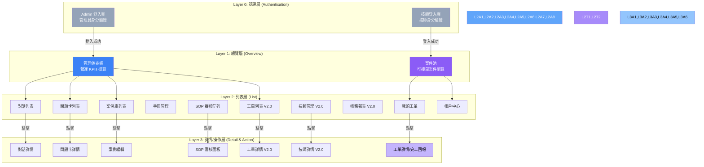
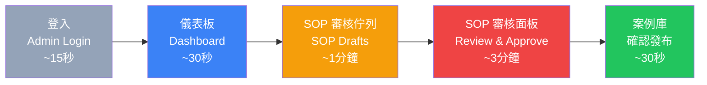
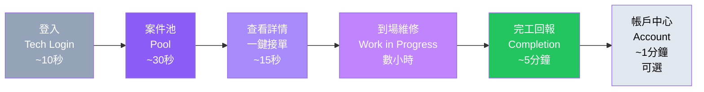
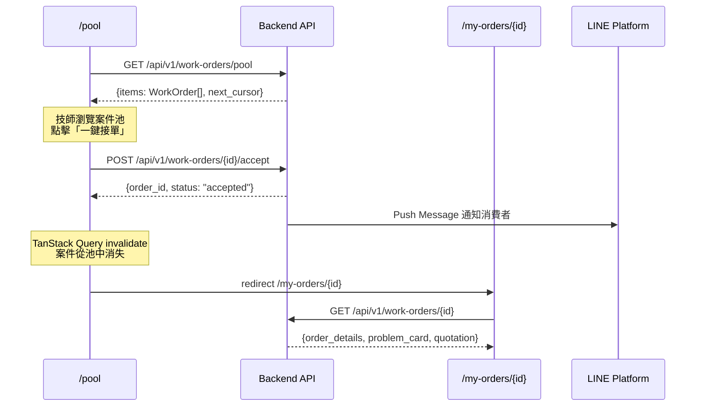
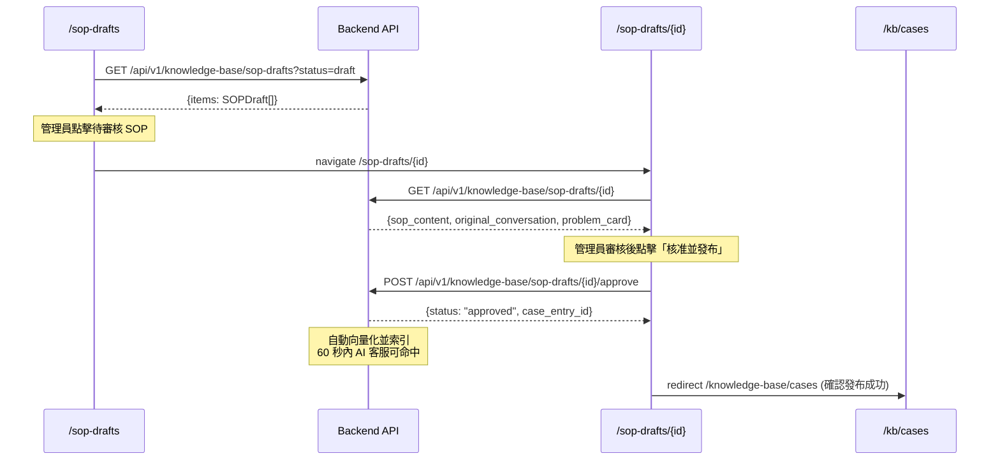

# 前端信息架構規範 (Frontend Information Architecture) - 電子鎖智能客服與派工平台

---

**文件版本 (Document Version):** `v1.2`
**最後更新 (Last Updated):** `2026-04-22`
**主要作者 (Lead Author):** `前端架構師, UX 設計師`
**審核者 (Reviewers):** `PM, 技術負責人, 後端技術負責人`
**狀態 (Status):** `Active`
**相關文檔:**
- API 設計規範：[`E5--api-design-specification`](E5--api-design-specification.md)
- 前端架構規範：[`E5x--frontend-architecture`](E5x--frontend-architecture.md)
- 工單互動流程：[`E5x--work-order-interaction-flows`](E5x--work-order-interaction-flows.md)
- 工單流程補充：[`E5x--work-order-flows-supplement`](E5x--work-order-flows-supplement.md)
- 派工營運補充：[`E5x--dispatch-operations-supplement`](E5x--dispatch-operations-supplement.md)
- 多租戶架構：[`platform-multi-tenant/multi-tenant-architecture`](platform-multi-tenant/multi-tenant-architecture.md)
- 派工整合規格：[`platform-multi-tenant/dispatch-integration-spec`](platform-multi-tenant/dispatch-integration-spec.md)
- Agent Harness 診斷架構：[`agent-harness/diagnostic-intelligence-architecture`](agent-harness/diagnostic-intelligence-architecture.md)
- 技術規格集：[`specs/_MOC`](specs/_MOC.md)（RBAC / 稽核 / 即時訊息 / 電子簽章 / 退款 / 保固 / 庫存 / 資料匯出）

---

## 目錄 (Table of Contents)

- [1. 文檔目的與範圍](#1-文檔目的與範圍)
- [2. 核心設計原則](#2-核心設計原則)
- [3. 資訊架構總覽](#3-資訊架構總覽)
- [4. 核心用戶旅程](#4-核心用戶旅程)
- [5. 網站地圖與導航結構](#5-網站地圖與導航結構)
- [6. 頁面詳細規格](#6-頁面詳細規格)
- [7. 組件連結與導航系統](#7-組件連結與導航系統)
- [8. 數據流與狀態管理](#8-數據流與狀態管理)
- [9. URL 結構與路由規範](#9-url-結構與路由規範)
- [10. 實施檢查清單與驗收標準](#10-實施檢查清單與驗收標準)
- [11. 附錄](#11-附錄)

---

## 1. 文檔目的與範圍

### 1.1 目的 (Purpose)

本文檔旨在提供「電子鎖智能客服與派工平台」前端的完整信息架構規範，作為前端開發、設計與測試的**單一事實來源 (SSOT)**。

**核心目標：**
- 定義 Admin Panel 與 Technician Web App 的完整用戶旅程與頁面職責
- 規範導航結構與 URL 設計，確保路由與後端 DDD Bounded Contexts 對齊
- 統一前端數據流與狀態管理策略（TanStack Query + Zustand + URL State）
- 提供可執行的實施檢查清單與頁面級驗收標準

### 1.2 適用範圍 (Scope)

| 適用範圍 | 說明 |
|:---|:---|
| **包含 (In Scope)** | - Admin Panel 所有頁面的信息架構（V1.0 + V2.0）<br/>- Technician Web App 所有頁面的信息架構（V2.0）<br/>- 用戶旅程與導航設計<br/>- URL 結構與路由規範<br/>- 頁面間數據傳遞與狀態策略<br/>- 頁面級 KPIs 與驗收標準 |
| **不包含 (Out of Scope)** | - LINE Bot 消費者端互動流程（透過 LINE Messaging API，無 Web UI）<br/>- 視覺設計細節（參考 UI/UX Spec）<br/>- 組件級別實現細節（參考 `E5x--frontend-architecture.md`）<br/>- 後端 API 實作（參考 `E5--api-design-specification.md`） |

### 1.3 角色與職責 (RACI)

| 角色 | 職責 | 責任類型 |
|:---|:---|:---|
| **PM** | 定義用戶需求與核心旅程、確認 KPIs 目標值 | R/A |
| **UX Designer** | 設計信息架構、導航流程、頁面佈局模型 | R/A |
| **Frontend Lead** | 審核技術可行性、路由設計、狀態管理策略 | A |
| **Frontend DEV** | 實現頁面與導航邏輯 | R |
| **Backend Lead** | 確認 API 端點與數據契約對齊 | C |
| **QA** | 驗證用戶流程與導航正確性 | C |

---

## 2. 核心設計原則

### 2.1 設計哲學

**核心價值主張：**
> 「讓管理員在最少操作步驟內掌控全局，讓技師在手機上一鍵完成接單與回報。」

**第一性原理推演：**
```
商業目標：降低客服成本、加速派工週轉
    ↓
用戶需求：管理員要快速監控與操作；技師要在手機上高效接單
    ↓
設計策略：Admin Panel 工具效率優先；Technician App Mobile-First 極簡流程
    ↓
架構決策：兩個獨立路由群組，共用組件庫，各自優化佈局
```

### 2.2 資訊架構原則

#### 2.2.1 簡化原則 (Simplification)

- **保留**：知識庫 CRUD、對話監控、工單全生命週期追蹤、技師接單/回報、帳務對帳
- **移除**：消費者評價系統（Phase 2）、多語言切換（Phase 2）、即時 GPS 追蹤
- **專注**：V1.0 專注 AI 客服管理閉環；V2.0 專注派工與帳務閉環

#### 2.2.2 認知負荷優化

基於 **Hick's Law** 和 **認知負荷理論**：
- **決策點數量**：Admin Panel 側邊欄一級導航控制在 8 項以內；Technician App 底部導航 3-4 項
- **每頁專注度**：每個頁面只有 1 個主要目標（如列表頁 → 瀏覽與篩選；詳情頁 → 查看與操作）
- **資訊分層**：列表頁展示摘要 → 點擊進入詳情 → 操作在詳情頁或 Modal 內完成

#### 2.2.3 架構模式

- [x] **層級化架構**：適合後台管理系統的多層導航
- [x] **中心輻射架構**：Technician App 以案件池為中心輻射至各功能

**選擇理由：**
- Admin Panel 功能模組多（知識庫、對話、派工、帳務），需要清晰的層級導航
- Technician App 功能聚焦（接單、回報、帳戶），以案件池為核心的輻射結構最直覺

---

## 3. 資訊架構總覽

### 3.1 系統層次結構



### 3.2 頁面總覽矩陣

#### Admin Panel 頁面

| # | 頁面路徑 | 頁面名稱 | 主要職責 | 用戶目標 | 導航深度 | 版本 |
|:--|:---------|:---------|:---------|:---------|:---------|:-----|
| A0 | `/login` | 管理員登入 | 身分驗證 | 安全登入系統 | Level 0 | V1.0 |
| A1 | `/dashboard` | 營運儀表板 | 展示營運 KPIs | 快速掌握系統全貌 | Level 1 | V1.0 |
| A2 | `/conversations` | 對話列表 | 瀏覽所有消費者對話 | 監控 AI 回答品質 | Level 2 | V1.0 |
| A3 | `/conversations/[id]` | 對話詳情 | 查看完整對話記錄 | 審視對話品質與問題處理過程 | Level 3 | V1.0 |
| A4 | `/problem-cards` | 問題卡列表 | 瀏覽所有 ProblemCard | 監控問題分布與診斷品質 | Level 2 | V1.0 |
| A5 | `/problem-cards/[id]` | 問題卡詳情 | 查看結構化問題描述 | 了解單一案件全貌 | Level 3 | V1.0 |
| A6 | `/knowledge-base/cases` | 案例庫 | 管理知識庫案例 | 維護 AI 知識基礎 | Level 2 | V1.0 |
| A7 | `/knowledge-base/cases/[id]` | 案例詳情/編輯 | 查看與編輯案例 | 新增/修改知識庫條目 | Level 3 | V1.0 |
| A8 | `/knowledge-base/manuals` | 手冊管理 | 管理產品手冊 PDF | 上傳與管理手冊 | Level 2 | V1.0 |
| A9 | `/knowledge-base/sop-drafts` | SOP 審核佇列 | 審核 AI 生成的 SOP | 確保知識品質 | Level 2 | V1.0 |
| A10 | `/knowledge-base/sop-drafts/[id]` | SOP 審核面板 | 審核單一 SOP 草稿 | 核准/退回/刪除 SOP | Level 3 | V1.0 |
| A11 | `/work-orders` | 工單列表 | 管理派工工單 | 監控派工全貌 | Level 2 | V2.0 |
| A12 | `/work-orders/[id]` | 工單詳情 | 查看工單全生命週期 | 追蹤單一案件進度 | Level 3 | V2.0 |
| A13 | `/technicians` | 技師管理 | 管理技師資料與技能 | 維護派工匹配依據 | Level 2 | V2.0 |
| A14 | `/technicians/[id]` | 技師詳情 | 查看技師完整資料 | 管理技師資訊與績效 | Level 3 | V2.0 |
| A15 | `/accounting` | 帳務管理 | 對帳、結算報表 | 完成月度結算 | Level 2 | V2.0 |
| A16 | `/settings` | 系統設定 | 管理帳號與系統配置 | 維護系統設定 | Level 2 | V1.0 |
| A17 | `/admin/refunds` | 退款審批頁 | 退款審批佇列與雙簽工作流 | 審核退款申請 | Level 2 | V2.0 |
| A18 | `/admin/roles` | RBAC 管理頁 | 角色與權限管理 | 配置角色權限矩陣 | Level 2 | V2.0 |
| A19 | `/admin/inventory` | 庫存管理頁 | 庫存水位與低庫存告警 | 監控材料庫存 | Level 2 | V2.0 |
| A20 | `/admin/audit-events` | 稽核日誌頁 | 7 種事件類型可篩選查詢 | 稽核系統操作記錄 | Level 2 | V2.0 |
| A21 | `/admin/warranty-claims` | 保固索賠頁 | 保固驗證與核准流程 | 處理保固索賠 | Level 2 | V2.0 |
| A22 | `/admin/disputes` | 爭議仲裁頁 | 證據包檢視與裁決 | 仲裁服務爭議 | Level 2 | V2.0 |
| A23 | `/admin/customers` | 客戶主檔 | 客戶 CRM、設備歷史 | 維護客戶與設備關聯資料 | Level 2 | V2.0 |
| A24 | `/admin/customers/[id]` | 客戶詳情 | 單一客戶完整紀錄 | 追蹤回頭客與高風險戶 | Level 3 | V2.0 |
| A25 | `/admin/technicians/[id]/schedule` | 技師排班 | 可服務時段、休假、備勤 | 維護派工可用性 | Level 3 | V2.0 |
| A26 | `/admin/technicians/[id]/skills` | 技師技能認證 | 品牌授權、等級、到期 | 確保派工技能匹配 | Level 3 | V2.0 |
| A27 | `/admin/technicians/[id]/settlements` | 技師結算明細 | 分潤、獎懲、墊付 | 月結 & 匯款對帳 | Level 3 | V2.0 |
| A28 | `/admin/dispatch-queue` | 派工佇列監控 | 重派嘗試、拒單紀錄、逾時 | 人工介入困難派工 | Level 2 | V2.0 |
| A29 | `/admin/reports/kpi` | KPI 儀表板 | 轉換漏斗、SLA、滿意度 | 即時營運指標檢視 | Level 2 | V2.0 |
| A30 | `/admin/reports/technician-ranking` | 技師排行榜 | 完工率、評分、週轉 | 績效管理 | Level 2 | V2.0 |
| A31 | `/admin/reports/revenue` | 營收報表 | 按期間/技師/品牌 | 財務與業務分析 | Level 2 | V2.0 |
| A32 | `/admin/diagnostics/[conversation_id]` | 診斷推理檢視 | L1/L2/L3 推理鏈、信心分數 | 審視/覆寫 AI 決策 | Level 3 | V2.0 |
| A33 | `/admin/knowledge-base/sop-performance` | SOP 績效儀表板 | SOP 使用率、成功率、滿意度 | 知識資產評估 | Level 3 | V2.0 |
| A34 | `/admin/settings/tenant` | 租戶設定 | 品牌色、LINE 綁定、價目 | 租戶層級客製 | Level 2 | V3.0 |
| A35 | `/admin/settings/tenant/brand` | 品牌客製 | Logo、色票、語氣範本 | 白牌化設定 | Level 3 | V3.0 |
| A36 | `/admin/super/tenants` | 超級管理租戶 | 租戶 CRUD、訂閱、使用量 | 平台營運 | Level 2 | V3.0 |

#### Technician Web App 頁面

| # | 頁面路徑 | 頁面名稱 | 主要職責 | 用戶目標 | 導航深度 | 版本 |
|:--|:---------|:---------|:---------|:---------|:---------|:-----|
| T0 | `/tech-login` | 技師登入 | 身分驗證 | 安全登入 | Level 0 | V2.0 |
| T1 | `/pool` | 案件池 | 瀏覽可接案件 | 發現並選擇工作機會 | Level 1 | V2.0 |
| T2 | `/my-orders` | 我的工單 | 瀏覽已接案件 | 管理進行中的工作 | Level 2 | V2.0 |
| T3 | `/my-orders/[id]` | 工單詳情/完工回報 | 查看詳情與提交回報 | 查看工作內容/提交完工 | Level 3 | V2.0 |
| T4 | `/account` | 帳戶中心 | 收入統計與歷史 | 掌握財務狀況 | Level 2 | V2.0 |
| T5 | `/my-orders/[id]/scope-change` | 範圍變更申請 | 現場追加工項、報價更新 | 送出追加報價待客戶核准 | Level 4 | V2.0 |
| T6 | `/my-orders/[id]/material-request` | 缺料回報 | 缺件清單、替代方案 | 進入缺料等待 / 部分完工 | Level 4 | V2.0 |
| T7 | `/my-orders/[id]/delay` | 延遲通知 | 新 ETA、事由、客戶通知 | 合規延遲不罰款 | Level 4 | V2.0 |
| T8 | `/my-orders/[id]/door-check` | 門面外觀檢核 | 抵達前後對比照 | 保障雙方、避免爭議 | Level 4 | V2.0 |
| T9 | `/my-orders/[id]/signature` | 雙方簽名 | 完工/交付電子簽章 | 提升可追溯性 | Level 4 | V2.0 |
| T10 | `/account/schedule` | 我的排班 | 查看/申請休假 | 自主管理可服務時段 | Level 3 | V2.0 |

**總計：** Admin Panel 37 頁（含 V3.0 多租戶 3 頁）+ Technician App 11 頁 = **48 頁**

> **備註：** A17–A22 為 V2.0 營運閉環必要頁（退款/RBAC/庫存/稽核/保固/爭議），補 A23–A33 係對齊 `E5x--dispatch-operations-supplement` 與 13 項 `specs/`；A34–A36 對齊 V3.0 多租戶架構；T5–T10 對齊 `E5x--work-order-interaction-flows` 10 個流程中的非 Happy Path 分支。

---

## 4. 核心用戶旅程

### 4.1 管理員核心旅程：知識庫管理閉環 (V1.0)



### 4.2 管理員核心旅程：派工監控 (V2.0)


### 4.3 技師核心旅程：接單到完工 (V2.0)



### 4.4 用戶旅程映射表

#### 管理員旅程 - 知識庫管理

| 階段 | 頁面 | 用戶心理狀態 | 設計目標 | 主要 CTA | 預期停留時間 |
|:-----|:-----|:-------------|:---------|:--------|:-------------|
| **概覽** | 儀表板 | 需要全局概覽 | 一眼看到關鍵指標 | 「查看 SOP 待審核」 | 30 秒 |
| **篩選** | SOP 審核佇列 | 需要找到待處理項目 | 快速定位待審核 SOP | 「開始審核」 | 1 分鐘 |
| **審核** | SOP 審核面板 | 認真評估品質 | 對照原始對話確認 SOP 品質 | 「核准」/「退回」 | 3 分鐘 |
| **確認** | 案例庫 | 確認知識已更新 | 確認 SOP 已發布至知識庫 | 「返回儀表板」 | 30 秒 |

#### 技師旅程 - 接單到完工

| 階段 | 頁面 | 用戶心理狀態 | 設計目標 | 主要 CTA | 預期停留時間 |
|:-----|:-----|:-------------|:---------|:--------|:-------------|
| **發現** | 案件池 | 尋找工作機會 | 快速瀏覽匹配案件 | 「查看詳情」 | 30 秒 |
| **決策** | 案件詳情 | 評估是否接單 | 展示關鍵資訊輔助決策 | 「一鍵接單」 | 15 秒 |
| **執行** | 工單詳情 | 前往現場維修 | 展示客戶地址與問題摘要 | 「開始維修」 | - |
| **回報** | 完工回報 | 記錄完成結果 | 簡化回報流程 | 「提交完工報告」 | 5 分鐘 |
| **確認** | 帳戶中心 | 確認收入 | 展示本次收入明細 | 「返回案件池」 | 1 分鐘 |

### 4.5 決策點分析

**管理員在工單管理中的 3 個主要決策點：**


**總決策點：** 3 個

---

## 5. 網站地圖與導航結構

### 5.1 完整網站地圖

```
Smart Lock Platform (/)
│
├─ (auth) 認證路由群組 ── 無側邊欄佈局
│  ├─ 0. /login                              [管理員登入]
│  └─ 1. /forgot-password                    [忘記密碼]
│
├─ (dashboard) Admin Panel 路由群組 ── 側邊欄 + 頂部導航佈局
│  ├─ 2. /dashboard                          [營運儀表板]
│  │  ├─ #conversations-stats (錨點：對話統計卡片)
│  │  ├─ #problem-distribution (錨點：問題類別分布圖)
│  │  ├─ #daily-trend (錨點：每日對話量趨勢)
│  │  └─ → /conversations, /problem-cards, /knowledge-base/sop-drafts (快捷入口)
│  │
│  ├─ 3. /conversations                      [對話列表]
│  │  ├─ Query: ?status={active|resolved|escalated}&cursor={cursor}
│  │  └─ → /conversations/{id} (點擊查看)
│  │
│  ├─ 4. /conversations/{id}                 [對話詳情]
│  │  ├─ #timeline (錨點：對話時間軸)
│  │  ├─ #problem-card (錨點：關聯問題卡)
│  │  └─ ← /conversations (返回列表)
│  │
│  ├─ 5. /problem-cards                      [問題卡列表]
│  │  ├─ Query: ?status={open|diagnosing|resolved|escalated}&category={category}&cursor={cursor}
│  │  ├─ NOTE: ProblemCard 使用 domain-agnostic 設計，domain_attributes 為 JSONB
│  │  │        前端需動態渲染欄位（由 config 定義，非固定 brand/model 欄位）
│  │  └─ → /problem-cards/{id} (點擊查看)
│  │
│  ├─ 6. /problem-cards/{id}                 [問題卡詳情]
│  │  ├─ Core fields: symptom_summary, category, completeness_score, status
│  │  ├─ Domain fields: 動態渲染 domain_attributes JSONB（如 device_brand, device_model, door_type）
│  │  ├─ Resolution: attempts[] 時間軸 + resolution_summary
│  │  ├─ → /conversations/{conv_id} (查看關聯對話)
│  │  ├─ → /work-orders/{wo_id} (查看關聯工單, V2.0)
│  │  └─ ← /problem-cards (返回列表)
│  │
│  ├─ 7. /knowledge-base/cases               [案例庫列表]
│  │  ├─ Query: ?brand={brand}&verified={true|false}&cursor={cursor}
│  │  ├─ → /knowledge-base/cases/new (新增案例)
│  │  └─ → /knowledge-base/cases/{id} (編輯案例)
│  │
│  ├─ 8. /knowledge-base/cases/{id}          [案例詳情/編輯]
│  │  └─ ← /knowledge-base/cases (返回列表)
│  │
│  ├─ 9. /knowledge-base/manuals             [手冊管理]
│  │  ├─ Query: ?brand={brand}&cursor={cursor}
│  │  └─ [上傳 PDF 功能]
│  │
│  ├─ 10. /knowledge-base/sop-drafts         [SOP 審核佇列]
│  │  ├─ Query: ?status={draft|approved|rejected}&cursor={cursor}
│  │  └─ → /knowledge-base/sop-drafts/{id} (審核)
│  │
│  ├─ 11. /knowledge-base/sop-drafts/{id}    [SOP 審核面板]
│  │  ├─ #sop-content (錨點：SOP 內容)
│  │  ├─ #original-conversation (錨點：原始對話記錄)
│  │  └─ ← /knowledge-base/sop-drafts (返回佇列)
│  │
│  ├─ 12. /work-orders                       [工單列表] (V2.0)
│  │  ├─ Query: ?status={pending|assigned|in_progress|completed}&cursor={cursor}
│  │  └─ → /work-orders/{id} (查看詳情)
│  │
│  ├─ 13. /work-orders/{id}                  [工單詳情] (V2.0)
│  │  ├─ #timeline (錨點：狀態時間軸)
│  │  ├─ #problem-card (錨點：問題卡)
│  │  ├─ #quotation (錨點：報價明細)
│  │  ├─ #completion-report (錨點：完工報告)
│  │  ├─ → /problem-cards/{pc_id} (查看問題卡)
│  │  ├─ → /technicians/{tech_id} (查看技師)
│  │  ├─ [手動指派 Modal]
│  │  └─ ← /work-orders (返回列表)
│  │
│  ├─ 14. /technicians                       [技師管理] (V2.0)
│  │  ├─ Query: ?status={active|inactive}&brand={brand}&cursor={cursor}
│  │  └─ → /technicians/{id} (查看詳情)
│  │
│  ├─ 15. /technicians/{id}                  [技師詳情] (V2.0)
│  │  ├─ #profile (錨點：基本資料)
│  │  ├─ #skills (錨點：技能認證)
│  │  ├─ #history (錨點：歷史工單)
│  │  ├─ #performance (錨點：績效統計)
│  │  └─ ← /technicians (返回列表)
│  │
│  ├─ 16. /accounting                        [帳務管理] (V2.0)
│  │  ├─ #monthly-report (錨點：月度結算報表)
│  │  ├─ #pending-review (錨點：待審核墊付)
│  │  ├─ #vouchers (錨點：記帳憑證)
│  │  └─ [匯出 Excel/PDF 功能]
│  │
│  ├─ 17. /settings                          [系統設定]
│  │  ├─ #profile (錨點：個人資料)
│  │  ├─ #security (錨點：安全設定)
│  │  ├─ #pricing-rules (錨點：報價規則, V2.0)
│  │  └─ #surcharge-rules (錨點：加價規則, V2.0)
│  │
│  ├─ 18. /admin/refunds                     [退款審批, V2.0]   ← refund-approval-spec
│  │  ├─ Query: ?status={pending|approved|rejected|completed}
│  │  └─ → [雙簽 Modal：管理員簽名 + 財務簽名]
│  │
│  ├─ 19. /admin/roles                       [RBAC 管理, V2.0]  ← rbac-dynamic-spec
│  │  ├─ → /admin/roles/new (新增自訂角色)
│  │  └─ → /admin/roles/{id}/audit (檢視角色變更稽核)
│  │
│  ├─ 20. /admin/inventory                   [庫存管理, V2.0]   ← inventory-management-spec
│  │  ├─ #parts (錨點：零件主檔)
│  │  ├─ #low-stock (錨點：低庫存告警)
│  │  └─ #usage-history (錨點：技師耗料紀錄)
│  │
│  ├─ 21. /admin/audit-events                [稽核日誌, V2.0]   ← audit-log-spec
│  │  ├─ Query: ?event_type={LOGIN|CREATE|UPDATE|DELETE|EXPORT|APPROVE_REFUND|ESCALATE_DISPUTE}
│  │  └─ [每筆可展開 before/after diff]
│  │
│  ├─ 22. /admin/warranty-claims             [保固索賠, V2.0]   ← warranty-dispute-spec
│  │  └─ → /admin/warranty-claims/{id}
│  │
│  ├─ 23. /admin/disputes                    [爭議仲裁, V2.0]   ← warranty-dispute-spec §3
│  │  └─ → /admin/disputes/{id}
│  │
│  ├─ 24. /admin/customers                   [客戶主檔, V2.0]   ← dispatch-operations §5
│  │  ├─ Query: ?risk_level={high|medium|low}
│  │  └─ → /admin/customers/{id}
│  │
│  ├─ 25. /admin/customers/{id}              [客戶詳情, V2.0]
│  │  ├─ #devices (錨點：名下設備)
│  │  ├─ #history (錨點：服務歷史)
│  │  └─ #notes (錨點：備註/風險標記)
│  │
│  ├─ 26. /admin/technicians/{id}/schedule   [技師排班, V2.0]   ← dispatch-operations §1
│  ├─ 27. /admin/technicians/{id}/skills     [技師技能, V2.0]   ← dispatch-operations §6
│  ├─ 28. /admin/technicians/{id}/settlements [技師結算, V2.0]  ← dispatch-operations §3
│  │
│  ├─ 29. /admin/dispatch-queue              [派工佇列監控, V2.0] ← dispatch-operations §4 拒單重派
│  │  └─ [每筆工單的 1~3 次派工嘗試、match score、拒單原因]
│  │
│  ├─ 30. /admin/reports/kpi                 [KPI 儀表板, V2.0] ← dispatch-operations §7
│  │  ├─ #funnel (錨點：轉換漏斗)
│  │  ├─ #sla (錨點：SLA 達成率)
│  │  └─ #satisfaction (錨點：客戶滿意度)
│  │
│  ├─ 31. /admin/reports/technician-ranking  [技師排行, V2.0]
│  ├─ 32. /admin/reports/revenue             [營收報表, V2.0]
│  │
│  ├─ 33. /admin/diagnostics/{conversation_id} [診斷推理, V2.0] ← agent-harness
│  │  ├─ #l1-vector (錨點：L1 向量搜尋結果)
│  │  ├─ #l2-rag (錨點：L2 RAG 推論)
│  │  ├─ #l3-escalation (錨點：L3 升級判定)
│  │  ├─ #dispatch-signals (錨點：派工信號 7 種)
│  │  └─ [管理員覆寫 / 反饋提交]
│  │
│  ├─ 34. /admin/knowledge-base/sop-performance [SOP 績效, V2.0]
│  │
│  ├─ 35. /admin/settings/tenant             [租戶設定, V3.0]   ← multi-tenant-architecture
│  │  ├─ /admin/settings/tenant/brand        [品牌客製]
│  │  ├─ /admin/settings/tenant/integrations [LINE / 金流綁定]
│  │  └─ /admin/settings/tenant/pricing      [租戶定價策略]
│  │
│  └─ 36. /admin/super/tenants               [超管租戶, V3.0]
│     ├─ /admin/super/tenants/{tenant_id}/usage
│     ├─ /admin/super/tenants/{tenant_id}/billing
│     └─ /admin/super/dashboard              [平台彙總 KPI]
│
└─ (technician) 技師工作台路由群組 ── Mobile-First 底部導航佈局
   ├─ 37. /tech-login                        [技師登入]
   │
   ├─ 38. /pool                              [案件池]
   │  ├─ Query: ?sort_by={distance|reward|urgency}
   │  └─ → [案件詳情 Modal / 一鍵接單]
   │
   ├─ 39. /my-orders                         [我的工單]
   │  ├─ Query: ?status={accepted|in_progress|material_pending|scope_changed|completed}
   │  └─ → /my-orders/{id} (點擊查看)
   │
   ├─ 40. /my-orders/{id}                    [工單詳情 / 完工回報]
   │  ├─ #info (錨點：案件資訊)
   │  ├─ #completion-form (錨點：完工回報表單)
   │  ├─ → /my-orders/{id}/scope-change     [範圍變更申請, Flow 3]
   │  ├─ → /my-orders/{id}/material-request [缺料回報, Flow 4]
   │  ├─ → /my-orders/{id}/delay            [延遲通知, Flow 5]
   │  ├─ → /my-orders/{id}/door-check       [門面外觀檢核, Flow 10]
   │  ├─ → /my-orders/{id}/signature        [雙方電子簽章, e-signature-spec]
   │  └─ ← /my-orders (返回列表)
   │
   ├─ 41. /account                           [帳戶中心]
   │  ├─ #summary (錨點：本月收入摘要)
   │  ├─ #history (錨點：歷史明細)
   │  └─ [匯出 PDF 功能]
   │
   └─ 42. /account/schedule                  [我的排班] ← dispatch-operations §1
      ├─ #calendar (錨點：月視圖可服務時段)
      └─ [申請休假 / 備勤]
```

### 5.2 導航連結矩陣

#### Admin Panel 核心頁面連結

| 來源 \ 目標 | Dashboard | Conversations | Conv Detail | Problem Cards | PC Detail | KB Cases | SOP Drafts | Work Orders | Technicians | Accounting |
|:---|:---:|:---:|:---:|:---:|:---:|:---:|:---:|:---:|:---:|:---:|
| **Dashboard** | - | ✅ 側邊欄 | ❌ | ✅ 側邊欄 | ❌ | ✅ 側邊欄 | ✅ 快捷卡片 | ✅ 側邊欄 | ❌ | ❌ |
| **Conversations** | ✅ 側邊欄 | - | ✅ 點擊行 | ❌ | ❌ | ❌ | ❌ | ❌ | ❌ | ❌ |
| **Conv Detail** | ❌ | ✅ 返回 | - | ❌ | ✅ 連結 | ❌ | ❌ | ⚠️ 連結 | ❌ | ❌ |
| **Problem Cards** | ✅ 側邊欄 | ❌ | ❌ | - | ✅ 點擊行 | ❌ | ❌ | ❌ | ❌ | ❌ |
| **PC Detail** | ❌ | ✅ 連結 | ❌ | ✅ 返回 | - | ❌ | ❌ | ⚠️ 連結 | ❌ | ❌ |
| **Work Orders** | ✅ 側邊欄 | ❌ | ❌ | ❌ | ❌ | ❌ | ❌ | - | ❌ | ❌ |
| **WO Detail** | ❌ | ❌ | ❌ | ✅ 連結 | ❌ | ❌ | ❌ | ✅ 返回 | ✅ 連結 | ❌ |

**圖例：**
- ✅ 直接可達
- ⚠️ 條件可達（V2.0 工單連結僅在有工單時顯示）
- ❌ 不存在直接連結

#### Technician App 連結

| 來源 \ 目標 | Pool | My Orders | Order Detail | Account |
|:---|:---:|:---:|:---:|:---:|
| **Pool** | - | ✅ 底部導航 | ⚠️ 接單後 | ✅ 底部導航 |
| **My Orders** | ✅ 底部導航 | - | ✅ 點擊行 | ✅ 底部導航 |
| **Order Detail** | ❌ | ✅ 返回 | - | ❌ |
| **Account** | ✅ 底部導航 | ✅ 底部導航 | ❌ | - |

---

## 6. 頁面詳細規格（已外遷）

> **2026-04-23 K-R 階段 2 重構：** 原 §6.1–§6.31（31 小節，1,550 行）已遷移至
> `web_design_spec_prompt_pipeline/pages/*.md` 的 22 份 page spec（每份含 PAGE META /
> STRUCTURE / COMPONENT SPEC / INTERACTION / DATA&API / EXCEPTION / ACCEPTANCE / 導航與狀態）。
>
> **查閱指引：**
> - IA 編號 → pipeline spec：見 `../../../web_design_spec_prompt_pipeline/pages/MAPPING.md §2`
> - pipeline spec 列表（22 份）：見 `MAPPING.md §3`
> - 導航與狀態統一規範：見 `E5x--frontend-navigation-matrix.md §附錄 A`
>
> **遷移審計結論：** 22/31 子節由 pipeline 完全覆蓋且更詳細；9 個子節的獨有細節
> 已補漏至對應 pipeline（退款雙簽 PIN、RBAC 臨時授權、庫存調撥報廢、保固扣罰、
> 爭議自動動作、KPI 排程匯出、租戶定價欄位、缺料客戶接受度、T8 四項 checklist、
> T10 休假額度等）。詳見 commit log。

---

## 7. 組件連結與導航系統

### 7.1 數據傳遞鏈 - 技師接單流程



### 7.2 數據傳遞鏈 - SOP 審核發布流程



### 7.3 導航系統實現

#### Admin Panel 側邊欄導航

```typescript
// lib/config/navigation.ts
export const adminNavigation = [
  {
    label: '儀表板',
    icon: 'LayoutDashboard',
    href: '/dashboard',
    version: 'v1',
  },
  {
    label: '對話管理',
    icon: 'MessageSquare',
    href: '/conversations',
    version: 'v1',
  },
  {
    label: '問題卡',
    icon: 'ClipboardList',
    href: '/problem-cards',
    version: 'v1',
  },
  {
    label: '知識庫',
    icon: 'BookOpen',
    href: '/knowledge-base',
    version: 'v1',
    children: [
      { label: '案例庫', href: '/knowledge-base/cases' },
      { label: '手冊管理', href: '/knowledge-base/manuals' },
      { label: 'SOP 審核', href: '/knowledge-base/sop-drafts', badge: 'pending_count' },
    ],
  },
  {
    label: '派工管理',
    icon: 'Truck',
    href: '/work-orders',
    version: 'v2',
    children: [
      { label: '工單列表', href: '/work-orders' },
      { label: '派工佇列監控', href: '/admin/dispatch-queue', badge: 'stuck_count' },
    ],
  },
  {
    label: '技師管理',
    icon: 'Users',
    href: '/technicians',
    version: 'v2',
  },
  {
    label: '客戶主檔',
    icon: 'UserCircle',
    href: '/admin/customers',
    version: 'v2',
  },
  {
    label: '帳務與結算',
    icon: 'Receipt',
    href: '/accounting',
    version: 'v2',
    children: [
      { label: '月結算總覽', href: '/accounting' },
      { label: '退款審批', href: '/admin/refunds', badge: 'pending_refunds' },
      { label: '保固索賠', href: '/admin/warranty-claims', badge: 'pending_claims' },
      { label: '爭議仲裁', href: '/admin/disputes', badge: 'open_disputes' },
    ],
  },
  {
    label: '庫存',
    icon: 'Package',
    href: '/admin/inventory',
    version: 'v2',
    badge: 'low_stock_count',
  },
  {
    label: '報表中心',
    icon: 'BarChart3',
    href: '/admin/reports/kpi',
    version: 'v2',
    children: [
      { label: 'KPI 儀表板', href: '/admin/reports/kpi' },
      { label: '技師排行', href: '/admin/reports/technician-ranking' },
      { label: '營收報表', href: '/admin/reports/revenue' },
      { label: 'SOP 績效', href: '/admin/knowledge-base/sop-performance' },
    ],
  },
  {
    label: '稽核與權限',
    icon: 'ShieldCheck',
    href: '/admin/audit-events',
    version: 'v2',
    children: [
      { label: 'RBAC 管理', href: '/admin/roles' },
      { label: '稽核日誌', href: '/admin/audit-events' },
    ],
  },
  {
    label: '系統設定',
    icon: 'Settings',
    href: '/settings',
    version: 'v1',
    children: [
      { label: '個人 / 安全', href: '/settings' },
      { label: '租戶設定 (V3.0)', href: '/admin/settings/tenant', version: 'v3' },
    ],
  },
  // V3.0 超管：只有 super_admin 角色可見
  {
    label: '平台超管',
    icon: 'Building2',
    href: '/admin/super/dashboard',
    version: 'v3',
    roleGuard: 'super_admin',
  },
];
```

#### Technician App 底部導航

```typescript
// lib/config/tech-navigation.ts
export const techNavigation = [
  { label: '案件池', icon: 'Inbox', href: '/pool' },
  { label: '我的工單', icon: 'Clipboard', href: '/my-orders' },
  { label: '帳戶', icon: 'User', href: '/account' },
];
```

---

## 8. 數據流與狀態管理

### 8.1 數據流向圖

```mermaid
graph TB
    subgraph "Frontend - Admin Panel"
        AD[Dashboard]
        AC[Conversations]
        AK[Knowledge Base]
        AW[Work Orders V2.0]
        AT[Accounting V2.0]
        LS1[Zustand UI Store]
        URL1[URL Params]
    end

    subgraph "Frontend - Technician App"
        TP[Case Pool]
        TM[My Orders]
        TA[Account]
        LS2[Zustand UI Store]
    end

    subgraph "Backend API (/api/v1)"
        E1[GET /conversations]
        E2[GET /knowledge-base/cases]
        E3[GET /work-orders/pool]
        E4[POST /work-orders/{id}/accept]
        E5[GET /accounting/reports]
    end

    subgraph "Data Stores"
        PG["PostgreSQL + pgvector"]
        RD[Redis Cache]
    end

    AD -->|TanStack Query 60s| E1
    AC -->|TanStack Query 5min| E1
    AK -->|TanStack Query 5min| E2
    AW -->|TanStack Query 30s| E3
    AT -->|TanStack Query 5min| E5

    TP -->|TanStack Query 15s| E3
    TM -->|TanStack Query 30s| E3
    TA -->|TanStack Query 5min| E5

    TP -->|Mutation| E4

    E1 -->|Read| PG
    E2 -->|Read| PG
    E3 -->|Read| PG
    E4 -->|Write| PG
    E5 -->|Read| PG

    E1 -->|Cache| RD

    style AD,AC,AK,AW,AT fill:#3b82f6,color:#fff
    style TP,TM,TA fill:#8b5cf6,color:#fff
    style E1,E2,E3,E4,E5 fill:#22c55e,color:#fff
    style PG,RD fill:#f59e0b,color:#fff
```

### 8.2 TanStack Query 刷新策略

> **已遷出至** `E5x--frontend-architecture.md §2.3`（狀態管理層 — 伺服器狀態管理）。
> 頁面層級的刷新需求（staleTime / refetchInterval）由本檔旅程提出，技術實作見架構文件。

### 8.3 狀態持久化策略

> **已遷出至** `E5x--frontend-architecture.md §2.3`（狀態管理層 — 狀態存儲決策）。
> 認證 / 租戶 / UI 偏好 / 篩選 / 表單草稿 / 伺服器快取 / 即時事件的儲存媒介決策集中於架構文件。

### 8.4 即時通訊策略 (WebSocket Channels)

> **已遷出至** `E5x--frontend-architecture.md §8.4`（前後端協作契約 — 即時通訊與 WebSocket 頻道）。
> 本檔僅在 §4 用戶旅程提頻道對應頁面；頻道權威清單與實作規範見架構文件。
> 另對齊 `docs/02-design/specs/asyncapi.yaml`（機器可讀 SSOT）與 `MAPPING.md §7 / §7.1`（IA ↔ 頻道 ↔ operationId 索引）。

### 8.5 多租戶資料隔離 (Tenant Isolation)

> **已遷出至** `E5x--frontend-architecture.md §1.4`（多租戶架構與前端隔離三層模型）。
> Header / Query Key / 切換 / RLS / 品牌注入的實作細節見架構文件。

---

## 9. URL 結構與路由規範

### 9.1 完整 URL 清單

```
站點根目錄: https://app.smartlock-saas.com/

認證頁面:
├── /login                                    [管理員登入]
├── /forgot-password                          [忘記密碼]
└── /tech-login                               [技師登入]

Admin Panel 核心頁面:
├── /dashboard                                [營運儀表板]
├── /conversations                            [對話列表]
│   └── /conversations/{id}                   [對話詳情] *id=UUID
├── /problem-cards                            [問題卡列表]
│   └── /problem-cards/{id}                   [問題卡詳情] *id=UUID
├── /knowledge-base/cases                     [案例庫列表]
│   ├── /knowledge-base/cases/new             [新增案例]
│   └── /knowledge-base/cases/{id}            [案例詳情/編輯] *id=UUID
├── /knowledge-base/manuals                   [手冊管理]
├── /knowledge-base/sop-drafts                [SOP 審核佇列]
│   └── /knowledge-base/sop-drafts/{id}       [SOP 審核面板] *id=UUID
├── /work-orders                              [工單列表] (V2.0)
│   └── /work-orders/{id}                     [工單詳情] (V2.0) *id=UUID
├── /technicians                              [技師管理] (V2.0)
│   └── /technicians/{id}                     [技師詳情] (V2.0) *id=UUID
├── /accounting                               [帳務管理] (V2.0)
├── /settings                                 [系統設定]
│
├── /admin/refunds                            [退款審批] (V2.0)
├── /admin/roles                              [RBAC 管理] (V2.0)
│   └── /admin/roles/{id}                     [角色編輯] (V2.0) *id=UUID
├── /admin/inventory                          [庫存管理] (V2.0)
├── /admin/audit-events                       [稽核日誌] (V2.0)
├── /admin/warranty-claims                    [保固索賠] (V2.0)
│   └── /admin/warranty-claims/{id}           [保固索賠詳情] (V2.0) *id=UUID
├── /admin/disputes                           [爭議仲裁] (V2.0)
│   └── /admin/disputes/{id}                  [爭議詳情] (V2.0) *id=UUID
├── /admin/customers                          [客戶主檔] (V2.0)
│   └── /admin/customers/{id}                 [客戶詳情] (V2.0) *id=UUID
├── /admin/technicians/{id}/schedule          [技師排班] (V2.0) *id=UUID
├── /admin/technicians/{id}/skills            [技師技能] (V2.0) *id=UUID
├── /admin/technicians/{id}/settlements       [技師結算] (V2.0) *id=UUID
├── /admin/dispatch-queue                     [派工佇列監控] (V2.0)
├── /admin/reports/kpi                        [KPI 儀表板] (V2.0)
├── /admin/reports/technician-ranking         [技師排行] (V2.0)
├── /admin/reports/revenue                    [營收報表] (V2.0)
├── /admin/diagnostics/{conversation_id}      [診斷推理] (V2.0) *id=UUID
├── /admin/knowledge-base/sop-performance     [SOP 績效] (V2.0)
├── /admin/dispatch-manual                    [派工人工介入] (V2.0) ← V1.1 A37
├── /admin/settings/tenant                    [租戶設定] (V3.0)
│   ├── /admin/settings/tenant/brand
│   ├── /admin/settings/tenant/integrations
│   └── /admin/settings/tenant/pricing
└── /admin/super/                             [超管平台] (V3.0, super_admin only)
    ├── /admin/super/dashboard
    └── /admin/super/tenants/{tenant_id}

Global Pages（跨角色，V1.1 新增）:
├── /notifications                            [全域通知中心] ← G1
└── /offline                                  [離線狀態頁] ← G2（Service Worker fallback）

Technician Web App 頁面:
├── /pool                                     [案件池]
├── /my-orders                                [我的工單]
│   ├── /my-orders/{id}                       [工單詳情/完工回報] *id=UUID
│   ├── /my-orders/{id}/scope-change          [範圍變更申請] Flow 3
│   ├── /my-orders/{id}/material-request      [缺料回報] Flow 4
│   ├── /my-orders/{id}/delay                 [延遲通知] Flow 5
│   ├── /my-orders/{id}/door-check            [門面檢核] Flow 10
│   ├── /my-orders/{id}/signature             [雙方簽章]
│   └── /my-orders/{id}/reschedule            [改期日曆] ← V1.1 T11 (Flow 5/11/14)
├── /account                                  [帳戶中心]
└── /account/schedule                         [我的排班]

API 端點 (前端呼叫，以下為概覽；權威契約見 `docs/02-design/specs/openapi.yaml`):
├── POST   /api/v1/auth/login                 [管理員登入]
├── POST   /api/v1/auth/refresh               [Token 刷新]
├── POST   /api/v1/technicians/login          [技師登入]
├── GET    /api/v1/conversations               [對話列表]
├── GET    /api/v1/conversations/{id}          [對話詳情]
├── GET    /api/v1/conversations/{id}/messages [對話訊息]
├── GET    /api/v1/problem-cards               [問題卡列表]
├── GET    /api/v1/problem-cards/{id}          [問題卡詳情]
├── GET    /api/v1/knowledge-base/cases        [案例庫列表]
├── POST   /api/v1/knowledge-base/cases        [新增案例]
├── PUT    /api/v1/knowledge-base/cases/{id}   [更新案例]
├── DELETE /api/v1/knowledge-base/cases/{id}   [刪除案例]
├── POST   /api/v1/knowledge-base/manuals      [上傳手冊 PDF]
├── GET    /api/v1/knowledge-base/sop-drafts   [SOP 列表]
├── POST   /api/v1/knowledge-base/sop-drafts/{id}/approve  [核准 SOP]
├── POST   /api/v1/knowledge-base/sop-drafts/{id}/reject   [退回 SOP]
├── GET    /api/v1/work-orders                 [工單列表] (V2.0)
├── GET    /api/v1/work-orders/pool            [案件池] (V2.0)
├── POST   /api/v1/work-orders/{id}/accept     [接單] (V2.0)
├── POST   /api/v1/work-orders/{id}/complete   [完工回報] (V2.0)
├── GET    /api/v1/technicians                 [技師列表] (V2.0)
├── GET    /api/v1/technicians/me              [技師自身資料] (V2.0)
├── GET    /api/v1/technicians/{id}/schedule   [技師排班] (V2.0)
├── PUT    /api/v1/technicians/{id}/schedule   [更新排班] (V2.0)
├── GET    /api/v1/technicians/{id}/skills     [技師技能] (V2.0)
├── PUT    /api/v1/technicians/{id}/skills     [更新技能] (V2.0)
├── GET    /api/v1/technicians/{id}/settlements [結算明細] (V2.0)
├── POST   /api/v1/technicians/{id}/settlements/{month}/confirm [確認結算] (V2.0)
├── GET    /api/v1/accounting/reports          [帳務報表] (V2.0)
│
# 退款 / 保固 / 爭議
├── GET    /api/v1/refunds                     [退款申請列表] (V2.0)
├── POST   /api/v1/refunds/{id}/decision       [核准/駁回/部分核准] (V2.0)
├── POST   /api/v1/refunds/{id}/signature      [雙簽簽章] (V2.0)
├── GET    /api/v1/warranty-claims             [保固索賠列表] (V2.0)
├── POST   /api/v1/warranty-claims/{id}/decision
├── GET    /api/v1/disputes                    [爭議列表] (V2.0)
├── POST   /api/v1/disputes/{id}/verdict       [裁決] (V2.0)
│
# RBAC / 稽核
├── GET    /api/v1/roles                       [角色列表] (V2.0)
├── POST   /api/v1/roles                       [建立自訂角色] (V2.0)
├── PUT    /api/v1/roles/{id}                  [修改權限矩陣] (V2.0)
├── GET    /api/v1/audit-events                [稽核日誌查詢] (V2.0)
├── POST   /api/v1/audit-events/export         [匯出 CSV] (V2.0)
│
# 庫存 / 客戶主檔
├── GET    /api/v1/inventory/parts             [零件主檔] (V2.0)
├── POST   /api/v1/inventory/parts/{id}/adjust [庫存調整] (V2.0)
├── GET    /api/v1/inventory/low-stock         [低庫存] (V2.0)
├── GET    /api/v1/customers                   [客戶列表] (V2.0)
├── GET    /api/v1/customers/{id}              [客戶詳情] (V2.0)
│
# 報表
├── GET    /api/v1/reports/kpi                 [KPI 儀表板] (V2.0)
├── GET    /api/v1/reports/technician-ranking  [技師排行] (V2.0)
├── GET    /api/v1/reports/revenue             [營收報表] (V2.0)
├── POST   /api/v1/reports/export              [匯出報表] (V2.0)
│
# 診斷 / Agent Harness
├── GET    /api/v1/diagnostics/{conversation_id} [診斷推理追溯] (V2.0)
├── POST   /api/v1/diagnostics/{conversation_id}/override [管理員覆寫] (V2.0)
├── POST   /api/v1/diagnostics/{conversation_id}/feedback [訓練反饋] (V2.0)
│
# 工單子流程（Flow 2~10）
├── POST   /api/v1/work-orders/{id}/reject      [技師拒單] Flow 2
├── POST   /api/v1/work-orders/{id}/scope-change [範圍變更] Flow 3
├── POST   /api/v1/work-orders/{id}/material-request [缺料回報] Flow 4
├── POST   /api/v1/work-orders/{id}/delay       [延遲通知] Flow 5
├── POST   /api/v1/work-orders/{id}/door-check  [門面檢核] Flow 10
├── POST   /api/v1/work-orders/{id}/signature   [雙方電子簽章]
│
# 多租戶 (V3.0)
├── GET    /api/v1/tenants/me                   [當前租戶設定] (V3.0)
├── PUT    /api/v1/tenants/me/brand             [更新品牌] (V3.0)
├── PUT    /api/v1/tenants/me/pricing           [更新定價] (V3.0)
├── GET    /api/v1/super/tenants                [超管：租戶列表] (V3.0)
└── POST   /api/v1/super/tenants                [超管：建立租戶] (V3.0)

# WebSocket（對齊 §8.4）
wss://app.smartlock-saas.com/ws
  ├── /realtime/work-orders/{id}
  ├── /realtime/dispatch-queue
  ├── /realtime/pool/{technician_id}
  ├── /realtime/refunds
  ├── /realtime/disputes
  ├── /realtime/sla-alerts
  ├── /realtime/rbac
  ├── /realtime/inventory/low-stock
  ├── /realtime/diagnostics/{conversation_id}
  └── /realtime/notifications/{user_id}
```

### 9.2 URL 查詢參數規範

所有列表頁面共用以下查詢參數模式：

| 參數名 | 類型 | 說明 | 範例 |
|:-------|:-----|:-----|:-----|
| `cursor` | string | Cursor-based 分頁游標 | `?cursor=eyJpZCI6MTAwfQ==` |
| `limit` | integer | 每頁筆數，預設 20 | `?limit=50` |
| `sort_by` | string | 排序欄位，前綴 `-` 為降序 | `?sort_by=-created_at` |
| `status` | string | 狀態篩選 | `?status=active` |

### 9.3 URL 驗證與錯誤處理

```typescript
// middleware.ts - Next.js Middleware 統一處理路由守衛
import { NextRequest, NextResponse } from 'next/server';

export function middleware(request: NextRequest) {
  const { pathname } = request.nextUrl;

  // 認證檢查
  const token = request.cookies.get('access_token');

  // Admin Panel 路由守衛
  const adminPrefixes = [
    '/dashboard', '/conversations', '/problem-cards', '/knowledge-base',
    '/work-orders', '/technicians', '/accounting', '/settings',
    '/admin', // 所有 V2.0+/V3.0 admin 頁面
  ];
  if (adminPrefixes.some(p => pathname.startsWith(p))) {
    if (!token) {
      return NextResponse.redirect(new URL('/login', request.url));
    }
    // 注入租戶 Header（V3.0 多租戶）
    const tenantId = request.cookies.get('tenant_id')?.value;
    if (tenantId) {
      const res = NextResponse.next();
      res.headers.set('X-Tenant-ID', tenantId);
      return res;
    }
  }

  // V3.0 超管守衛
  if (pathname.startsWith('/admin/super')) {
    // 檢查 JWT role claim — 缺少 super_admin 角色則 403
    const role = request.cookies.get('user_role')?.value;
    if (role !== 'super_admin') {
      return NextResponse.redirect(new URL('/dashboard', request.url));
    }
  }

  // Technician App 路由守衛
  if (pathname.startsWith('/pool') ||
      pathname.startsWith('/my-orders') ||
      pathname.startsWith('/account')) {
    if (!token) {
      return NextResponse.redirect(new URL('/tech-login', request.url));
    }
  }

  return NextResponse.next();
}

export const config = {
  matcher: [
    '/dashboard/:path*',
    '/conversations/:path*',
    '/problem-cards/:path*',
    '/knowledge-base/:path*',
    '/work-orders/:path*',
    '/technicians/:path*',
    '/accounting/:path*',
    '/settings/:path*',
    '/admin/:path*',
    '/pool/:path*',
    '/my-orders/:path*',
    '/account/:path*',
  ],
};
```

---

## 10. IA 驗收標準（本檔職責）

> **重新聚焦（2026-04-23 K-R 階段 1）**：
> 通用「開發階段檢查清單」、「質量檢查」、「效能指標」、「測試矩陣」、「Go/No-Go 準入」→ 已整合至 `E5x--frontend-architecture.md §10 前端開發檢查清單`。
> 本章僅保留**資訊架構專屬驗收**：頁面覆蓋、URL 一致性、導航完整性、用戶旅程可走通。

### 10.1 頁面覆蓋驗收

- [ ] IA 52 頁（Admin 38 + Technician 12 + Global 2）全部於 `MAPPING.md §2` 註冊
- [ ] 每頁對應至少一份 `web_design_spec_prompt_pipeline/pages/*.md` spec
- [ ] 版本標記一致（V1.0 / V2.0 / V3.0）
- [ ] 無孤兒 pipeline spec（未對應任何 IA 頁）

### 10.2 URL 一致性驗收

- [ ] 本檔 §9.1 URL 清單與 pipeline spec 的 `route_path` 逐一匹配
- [ ] URL 命名符合 RESTful 慣例（複數名詞、[id] 占位符）
- [ ] 保留字（`cursor`/`limit`/`tab`/`filter`/`highlight` 等）對齊 `E5x--frontend-navigation-matrix.md §4`
- [ ] 深連結頁面清單（§5.1 於 navigation-matrix）已完整，無遺漏

### 10.3 導航完整性驗收

- [ ] 每 IA 頁都有明確 upstream（除根頁：Dashboard / Login / Pool）
- [ ] 每 IA 頁的 downstream 在 §5.2 導航連結矩陣列明
- [ ] `MAPPING.md §7.5 Flow × Page 矩陣`覆蓋全部 23 個 Flow（Flow 1-14 + G1-G4 + MT1-MT5）
- [ ] 每個 upstream/downstream 對應的 pipeline spec 頂部都有「導航與狀態」章節引用 navigation-matrix

### 10.4 用戶旅程驗收

對應本檔 §4 所列核心旅程：

- [ ] **管理員知識庫閉環（V1.0）**：登入 → 儀表板 → SOP 審核 → 案例確認，每步驟有 pipeline spec + Flow 承載
- [ ] **管理員派工閉環（V2.0）**：儀表板 → 工單列表 → 詳情 → 指派/爭議/退款，涵蓋 Flow 1/6/7/9
- [ ] **管理員治理閉環（V2.0）**：稽核/RBAC/庫存/爭議，涵蓋 G1-G4
- [ ] **V3.0 租戶管理閉環**：超管 → 租戶列表 → 品牌/B2B/退場，涵蓋 MT1-MT5
- [ ] **技師核心旅程（V2.0）**：登入 → 案件池 → 接單 → 完工 → 簽章，涵蓋 Flow 1
- [ ] **技師異常旅程（V2.0）**：範圍變更/缺料/延遲/門面/改期，涵蓋 Flow 3-5/10/14

### 10.5 IA ↔ 契約 ↔ 流程 三向繫結驗收

- [ ] 本檔 §9.1 URL 清單可在 `MAPPING.md §8.1` 找到 operationId 對應
- [ ] WS 頻道（§8.4 指向 architecture §8.4）可在 `MAPPING.md §7.1` 找到 AsyncAPI operationId
- [ ] 每 IA 頁對應的 Flow 可在 `MAPPING.md §7.5` 矩陣查到
- [ ] CI 檢查通過（`scripts/check-operationid-orphans.sh` 無孤兒）

### 10.6 持續維護

- [ ] 新增 IA 頁時，同步更新本檔 §3.2 頁面總覽、§9.1 URL 清單、`MAPPING.md`
- [ ] 刪除 IA 頁時，先確認 pipeline spec 與 Flow 引用已清除
- [ ] 版本遷移（V1.0 → V2.0 → V3.0）時，版本標籤同步所有索引

---

> **通用開發驗收請見：** `E5x--frontend-architecture.md §10 前端開發檢查清單`
> 涵蓋：UX / 技術規範 / 效能指標（LCP/CLS/INP）/ SEO A11y / 測試矩陣 / Go/No-Go 準入條件。

#### 角色簽核 (RACI)

| 角色 | 責任 | 簽核狀態 | 日期 |
|:-----|:-----|:---------|:-----|
| **PM** | 確認產品需求滿足 (37 User Stories) | ⬜ | |
| **Frontend Lead** | 確認技術實現品質 | ⬜ | |
| **Backend Lead** | 確認 API 契約對齊 | ⬜ | |
| **QA Lead** | 確認測試覆蓋與結果 | ⬜ | |

---

## 11. 附錄

### 11.1 術語表

| 術語 | 英文 | 定義 |
|:-----|:-----|:-----|
| **信息架構** | Information Architecture (IA) | 組織、結構化和標記內容的藝術與科學 |
| **ProblemCard** | Problem Card | 一次客服對話的結構化問題描述卡 |
| **三層解決機制** | Three-Layer Resolution Engine | L1 案例庫向量搜尋 → L2 RAG → L3 人工轉接 |
| **案件池** | Case Pool | 技師端可接案件的即時更新列表 |
| **SOP 草稿** | SOP Draft | AI 從成功對話中自動生成的標準作業程序草稿 |
| **Cursor-based 分頁** | Cursor-based Pagination | 使用游標而非偏移量的分頁方式，效能更穩定 |
| **Optimistic UI** | Optimistic UI | 先更新 UI 再等待 API 確認的互動模式 |
| **Bounded Context** | 限界上下文 | DDD 中按業務領域劃分的模組邊界 |

### 11.2 相關文檔連結

| 文檔類型 | 檔名 | 路徑 |
|:---------|:-----|:-----|
| **API 設計規範** | E5--api-design-specification.md | `docs/02-design/E5--api-design-specification.md` |
| **前端架構規範** | E5x--frontend-architecture.md | `docs/02-design/E5x--frontend-architecture.md` |
| **工單互動流程** | E5x--work-order-interaction-flows.md | `docs/02-design/E5x--work-order-interaction-flows.md` |
| **工單流程補充** | E5x--work-order-flows-supplement.md | `docs/02-design/E5x--work-order-flows-supplement.md` |
| **派工營運補充** | E5x--dispatch-operations-supplement.md | `docs/02-design/E5x--dispatch-operations-supplement.md` |
| **多租戶架構** | multi-tenant-architecture.md | `docs/02-design/platform-multi-tenant/multi-tenant-architecture.md` |
| **派工整合規格** | dispatch-integration-spec.md | `docs/02-design/platform-multi-tenant/dispatch-integration-spec.md` |
| **Agent Harness 架構** | harness-architecture.md | `docs/02-design/agent-harness/harness-architecture.md` |
| **診斷智能架構** | diagnostic-intelligence-architecture.md | `docs/02-design/agent-harness/diagnostic-intelligence-architecture.md` |
| **技術規格集** | specs/_MOC.md | `docs/02-design/specs/_MOC.md` |

### 11.3 變更記錄

| 日期 | 版本 | 作者 | 變更摘要 |
|:-----|:-----|:-----|:---------|
| 2026-02-26 | v1.0 | 前端架構師 | 初版發布：涵蓋 V1.0 Admin Panel + V2.0 Technician App 完整 IA |
| 2026-04-04 | v1.1 | 前端架構師 | 新增 V2.0 Admin Panel 6 頁：退款審批、RBAC、庫存、稽核、保固索賠、爭議仲裁 |
| 2026-04-23 | v1.2 | 前端架構師 | **對齊系統架構全面擴充：** <br/>• 新增 A23–A33 Admin 頁面（客戶主檔、技師排班/技能/結算、派工佇列、KPI/排行/營收、診斷推理、SOP 績效）<br/>• 新增 V3.0 A34–A36 多租戶頁面（租戶設定、品牌客製、超管控制台）<br/>• 新增 T5–T10 技師端子流程頁（範圍變更、缺料、延遲、門面檢核、簽章、排班）<br/>• 擴充 §6.13–6.31 共 19 個缺失的頁面詳細規格<br/>• 新增 §8.4 WebSocket 頻道目錄（10 個頻道）與 §8.5 多租戶資料隔離策略<br/>• 更新路由守衛支援 `/admin/*` 與 V3.0 超管檢查<br/>• 對齊 `E5x--work-order-interaction-flows` 10 個流程、`E5x--dispatch-operations-supplement` 7 類營運、13 項 `specs/` 技術規格與 `agent-harness` AI 診斷架構 |

### 11.4 審核記錄

| 角色 | 姓名 | 日期 | 簽名/狀態 |
|:-----|:-----|:-----|:---------|
| **PM** | | | ⬜ |
| **Frontend Lead** | | | ⬜ |
| **UX Designer** | | | ⬜ |
| **Backend Lead** | | | ⬜ |
