# 10 — 工單互動流程完整規格書

> **文件版本**：v1.0
> **建立日期**：2026-03-31
> **狀態**：設計完成，待開發實作
> **適用範圍**：V2.0 技師派工與工單全生命週期
> **參考文件**：
> - `docs/00-discover/E1--project-brief-and-prd.md` — PRD 用戶故事
> - `docs/02-design/E5--api-design-specification.md` — API 規格
> - `SQL/Schema.sql` — 資料庫結構定義
> - `docs/Locksmith_Preparation_Checklist/14_派工業務規則.md` — 派工規則
> - `docs/Locksmith_Preparation_Checklist/15_師傅分級標準.md` — 技師分級
> - `docs/Locksmith_Preparation_Checklist/18_爭議處理案例.md` — 爭議案例
> - `docs/agent-harness-refactor/diagnostic-intelligence-architecture.md` — 診斷推理引擎 + 知識沉澱閉環 (Layer 6)
> - `docs/agent-harness-refactor/optimization-strategy.md` — 三層 Cascade + 派工觸發邏輯
> - `agent/harness/task/knowledge/sop/SOP-DISPATCH-001.json` — 派工決策 SOP (7 個派工信號)
> - `agent/harness/task/knowledge/sop/SOP-EMERGENCY-001.json` — Red_Code 緊急流程
> - `agent/harness/task/knowledge/ocap_rules.json` — OCAP 異常監控 + 情緒升級規則

---

## 目錄

1. [完整狀態機](#1-完整狀態機)
2. [角色定義](#2-角色定義)
3. [SLA 定義](#3-sla-定義)
4. [Flow 1：正常路徑 (Happy Path)](#4-flow-1正常路徑-happy-path)
5. [Flow 2：拒單與逾時重派](#5-flow-2拒單與逾時重派)
6. [Flow 3：範圍變更](#6-flow-3範圍變更)
7. [Flow 4：缺料處理](#7-flow-4缺料處理)
8. [Flow 5：延遲通知與改期](#8-flow-5延遲通知與改期)
9. [Flow 6：退款審批與大額雙簽](#9-flow-6退款審批與大額雙簽)
10. [Flow 7：保固爭議](#10-flow-7保固爭議)
11. [Flow 8：品質不合格與二次派工](#11-flow-8品質不合格與二次派工)
12. [Flow 9：客訴處理完整生命週期](#12-flow-9客訴處理完整生命週期)
13. [Flow 10：門外觀變更確認](#13-flow-10門外觀變更確認)
14. [升級矩陣](#14-升級矩陣)
15. [知識沉澱閉環與完工報告](#15-知識沉澱閉環與完工報告)

---

## 1. 完整狀態機

### 1.1 工單狀態定義

| 狀態 | 識別碼 | 說明 | 可停留最大時間 |
|------|--------|------|----------------|
| 已建立 | `created` | 工單由 AI 系統或管理員建立，尚未派工 | 5 分鐘 |
| 已派工 | `assigned` | 派工引擎已匹配技師，等待技師回應 | 15 分鐘 |
| 已接受 | `accepted` | 技師確認接受工單 | 依預約時間 |
| 進行中 | `in_progress` | 技師已到場開始作業 | 依工種 (一般 2 小時) |
| 範圍變更 | `scope_changed` | 現場狀況與 ProblemCard 不符，需重新報價 | 24 小時 |
| 缺料中 | `material_pending` | 現場缺少必要零件，等待備料 | 72 小時 |
| 延遲中 | `delayed` | 技師無法準時到達或作業延遲 | 依新 ETA |
| 已完工 | `completed` | 技師回報完工，等待客戶確認 | 48 小時 |
| 返工中 | `rework_required` | 客戶反映修復不良，需二次處理 | 24 小時 |
| 已確認 | `confirmed` | 客戶確認完工，觸發帳務流程 | 30 天 |
| 已歸檔 | `archived` | 帳務結清，工單歸檔 | 永久 |
| 已取消 | `cancelled` | 工單取消 (附取消原因) | 終態 |
| 爭議中 | `disputed` | 工單進入爭議處理流程 | 依爭議類型 |

### 1.2 狀態轉換圖

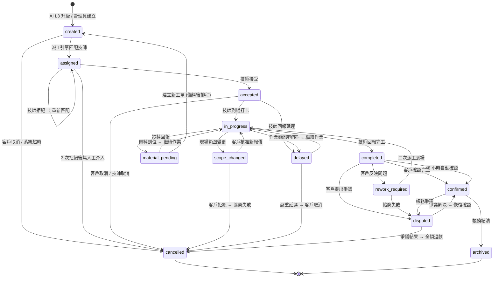
```mermaid
stateDiagram-v2
    [*] --> created : AI L3 升級 / 管理員建立

    created --> assigned : 派工引擎匹配技師
    created --> cancelled : 客戶取消 / 系統超時

    assigned --> accepted : 技師接受
    assigned --> assigned : 技師拒絕 → 重新匹配
    assigned --> cancelled : 3 次拒絕後無人工介入

    accepted --> in_progress : 技師到場打卡
    accepted --> delayed : 技師回報延遲
    accepted --> cancelled : 客戶取消 / 技師取消

    in_progress --> completed : 技師回報完工
    in_progress --> scope_changed : 現場範圍變更
    in_progress --> material_pending : 缺料回報
    in_progress --> delayed : 作業延遲

    scope_changed --> in_progress : 客戶核准新報價
    scope_changed --> cancelled : 客戶拒絕 → 協商失敗

    material_pending --> in_progress : 備料到位 → 繼續作業
    material_pending --> created : 建立新工單 (備料後排程)

    delayed --> in_progress : 延遲解除 → 繼續作業
    delayed --> cancelled : 嚴重延遲 → 客戶取消

    completed --> confirmed : 客戶確認完工
    completed --> confirmed : 48 小時自動確認
    completed --> rework_required : 客戶反映問題
    completed --> disputed : 客戶提出爭議

    rework_required --> in_progress : 二次派工到場
    rework_required --> disputed : 協商失敗

    confirmed --> archived : 帳務結清
    confirmed --> disputed : 帳務爭議

    disputed --> confirmed : 爭議解決 → 恢復確認
    disputed --> cancelled : 爭議結果 → 全額退款

    cancelled --> [*]
    archived --> [*]
```

### 1.3 狀態轉換規則表

| 來源狀態 | 目標狀態 | 觸發條件 | 授權角色 | 是否需審批 |
|----------|----------|----------|----------|-----------|
| `created` | `assigned` | 派工引擎自動匹配完成 | System | 否 |
| `created` | `cancelled` | 客戶主動取消 / 5 分鐘無匹配 | Customer, System | 否 |
| `assigned` | `accepted` | 技師點擊「接受工單」 | Technician | 否 |
| `assigned` | `assigned` | 技師拒絕 → 匹配下一位 | Technician, System | 否 |
| `assigned` | `cancelled` | 連續 3 位技師拒絕且無人工介入 | Admin | 是 |
| `accepted` | `in_progress` | 技師到場 GPS 打卡 | Technician | 否 |
| `accepted` | `delayed` | 技師回報延遲並提供新 ETA | Technician | 否 |
| `accepted` | `cancelled` | 客戶 / 技師申請取消 | Customer, Technician | 是 (Admin) |
| `in_progress` | `completed` | 技師提交完工報告 + 照片 | Technician | 否 |
| `in_progress` | `scope_changed` | 技師回報範圍變更 | Technician | 否 |
| `in_progress` | `material_pending` | 技師回報缺料 | Technician | 否 |
| `in_progress` | `delayed` | 作業時間超出預估 | Technician | 否 |
| `scope_changed` | `in_progress` | 客戶核准新報價 | Customer | 否 |
| `scope_changed` | `cancelled` | 客戶拒絕新報價且協商失敗 | Customer, Admin | 是 |
| `material_pending` | `in_progress` | 備料完成，技師恢復作業 | Technician | 否 |
| `material_pending` | `created` | 需另排時間回訪 (建立新工單) | System | 否 |
| `delayed` | `in_progress` | 延遲解除 | Technician | 否 |
| `delayed` | `cancelled` | 嚴重延遲且客戶不接受 | Customer, Admin | 是 |
| `completed` | `confirmed` | 客戶主動確認 / 48 小時自動確認 | Customer, System | 否 |
| `completed` | `rework_required` | 客戶反映同一問題 | Customer | 否 |
| `completed` | `disputed` | 客戶提出服務/價格爭議 | Customer | 否 |
| `rework_required` | `in_progress` | 二次派工技師到場 | Technician | 否 |
| `rework_required` | `disputed` | 二次維修仍不滿意 | Customer | 否 |
| `confirmed` | `archived` | 帳務結清、對帳完成 | Finance | 否 |
| `confirmed` | `disputed` | 帳務爭議 | Customer, Technician | 否 |
| `disputed` | `confirmed` | 爭議結案 → 恢復 | Admin | 是 |
| `disputed` | `cancelled` | 爭議結案 → 全額退款 | Admin, Finance | 是 (雙簽) |
| 任意狀態 | `cancelled` | 管理員強制取消 (附原因) | Admin | 是 |
| 任意狀態 | `disputed` | 客戶投訴升級 | Customer, Admin | 否 |

---

## 2. 角色定義

### 2.1 角色職責矩陣

| 角色 | 識別碼 | 介面 | 核心職責 | 系統權限 |
|------|--------|------|----------|----------|
| **客戶** | `Customer` | LINE App | 報修問題、核准報價、確認完工、提交客訴、評分回饋 | 查看自身工單、核准/拒絕報價、提交回饋 |
| **AI 系統** | `AI_System` | 內部服務 | 建立 ProblemCard、觸發 L3 升級、自動建立工單、發送通知 | 建立工單、更新對話狀態、呼叫 LLM |
| **派工引擎** | `Dispatch_Engine` | 內部服務 | 多因子技師匹配、逾時處理、重派邏輯、負載均衡 | 查詢技師、更新工單派工狀態、觸發通知 |
| **技師** | `Technician` | Web App | 接受/拒絕工單、回報進度、提交完工報告與照片、回報異常 | 管理自身工單、上傳照片、提交報告 |
| **管理員/客服** | `Admin` | 管理面板 | 手動派工、處理客訴、審批退款、監控 SLA、覆核爭議 | 完整工單管理、技師管理、退款審批 |
| **財務** | `Finance` | 管理面板 | 帳務結算、退款執行、月結對帳、撥款作業 | 帳務管理、退款執行、結算報表 |

### 2.2 角色互動關係

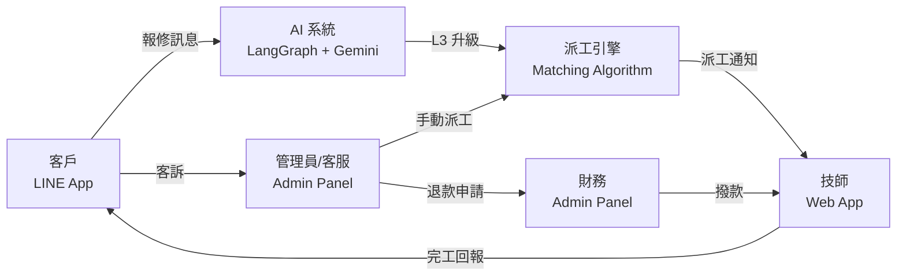
```mermaid
graph LR
    Customer["客戶<br/>LINE App"]
    AI["AI 系統<br/>LangGraph + Gemini"]
    Dispatch["派工引擎<br/>Matching Algorithm"]
    Tech["技師<br/>Web App"]
    Admin["管理員/客服<br/>Admin Panel"]
    Finance["財務<br/>Admin Panel"]

    Customer -->|報修訊息| AI
    AI -->|L3 升級| Dispatch
    Dispatch -->|派工通知| Tech
    Tech -->|完工回報| Customer
    Customer -->|客訴| Admin
    Admin -->|退款申請| Finance
    Admin -->|手動派工| Dispatch
    Finance -->|撥款| Tech
```

---

## 3. SLA 定義

### 3.1 各階段 SLA 時限

| 階段 | SLA 時限 | 計時起點 | 違反動作 | 通知對象 |
|------|----------|----------|----------|----------|
| 派工匹配 (一般) | < 5 分鐘 | 工單建立 (`created`) | 自動升級至人工派工 | Admin |
| 派工匹配 (Red_Code) | < 30 秒 | Red_Code 觸發 | 立即推播最近可用技師 | Admin + Ops Manager |
| 技師回應 (一般) | < 15 分鐘 | 工單派出 (`assigned`) | 逾時 → 自動匹配下一位候選技師 | Admin (第 2 次逾時) |
| 技師回應 (Red_Code) | < 5 分鐘 | Red_Code 派工 | 逾時 → 立即匹配下一位 + 通知主管 | Admin + Ops Manager |
| 技師到場 | 預約時段 ±30 分鐘 | 預約時間到達 | 延遲通知 → 客戶；>30 分鐘 → Admin 警報 | Customer, Admin |
| 完工時限 (一般) | 當日內 | 技師到場打卡 | Admin 警報 + 客戶通知 | Admin, Customer |
| 完工時限 (緊急) | < 2 小時 | 技師到場打卡 | 自動升級至主管 | Admin, Ops Manager |
| 客戶確認 | < 48 小時 | 技師回報完工 | 48 小時後自動確認 | Customer (提醒 @ 24hr) |
| 範圍變更回應 | < 24 小時 | 技師提交範圍變更 | 升級至管理員處理 | Admin |
| 備料到位 | < 72 小時 | 技師回報缺料 | 自動建議客戶改期 | Customer, Admin |
| 客訴處理 (一般) | < 3 個工作日 | 客訴建立 | 升級至營運主管 | Ops Manager |
| 客訴處理 (高優先) | < 24 小時 | 客訴建立 | 升級至營運主管 + 主管回電 | Ops Manager |
| 退款處理 | < 5 個工作日 | 退款核准 | 自動升級至財務主管 | Finance Manager |
| 爭議解決 | < 7 個工作日 | 爭議建立 | 升級至營運總監 | Ops Director |

### 3.2 Red_Code 緊急觸發條件

以下關鍵字觸發 Red_Code 緊急流程（來源：`SOP-EMERGENCY-001.json` + `ocap_rules.json` OCAP-EMERGENCY-001）：

| 觸發關鍵字 | 嚴重度 | SLA |
|---|---|---|
| 被鎖在外面、進不了家門 | Emergency 5 | 30 秒回應 → 15 分鐘派工 → 2 小時到場 |
| 家裡有小孩、小孩被鎖在裡面 | Emergency 5 | 同上 + 建議撥打 119 |
| 爐子還開著 | Emergency 5 | 同上 + 建議撥打 119 |
| 寵物在裡面 | Emergency 4 | 30 秒回應 → 15 分鐘派工 → 2 小時到場 |
| 很急 | Emergency 4 | 標記緊急 + 優先派工 |

> Red_Code 工單的 `priority` 自動設為 `urgent`，跳過正常排隊直接推播最近可用技師。

### 3.3 SLA 違反處理流程

```
SLA 計時器觸發
    │
    ├─ 第 1 次違反 → 系統自動通知負責人
    ├─ 第 2 次違反 (同工單) → 升級至上級主管
    └─ 第 3 次違反 (同工單) → 標記為危機工單 + 全管道通知
```

---

## 4. Flow 1：正常路徑 (Happy Path)

### 4.1 觸發條件

工單建立有三種觸發路徑：

**路徑 A — 診斷推理引擎觸發** (自動)：
- `task_decompose` 輸出 `diagnosis_status = "recommend_dispatch"`（診斷推理超過 3 輪未收斂、或 LLM 判斷需到府）
- 詳見 `diagnostic-intelligence-architecture.md` §4 PDCA Loop

**路徑 B — 品牌錯誤碼直接觸發** (自動，跳過遠端嘗試)：
以下 7 個信號直接觸發派工，不進入遠端排查：

| 品牌 | 錯誤信號 | 失效模式 | 原因 |
|---|---|---|---|
| dormakaba | 紅燈閃 4 次 | FM-MECH-002 馬達異常 | 需更換馬達模組 |
| dormakaba | 紅燈常亮 | FM-ELEC-002 系統錯誤 | 需主機板檢測 |
| Philips | 紅燈閃 3 次 | FM-MECH-003 離合器異常 | 需更換離合器 |
| Kaadas | 紅燈閃 5 次 | FM-MECH-004 馬達堵轉 | 需鎖體檢查 |
| Milre | 面板全亮後熄滅 | FM-ELEC-001 主機板異常 | 需更換主機板 |
| 所有品牌 | 門扇反弓 | FM-MECH-005 | 需專業調整門/門框 |
| 所有品牌 | 承接板嚴重偏位 | FM-MECH-006 | 需重新校正安裝 |

> 來源：`SOP-DISPATCH-001.json` check_dispatch_signals + `SOP-HW-001.json`

**路徑 C — 管理員手動建立** (人工)：
- 管理員從 Admin Panel 建立工單（客訴升級、電話接單等）

### 4.2 參與角色

Customer, AI_System, Dispatch_Engine, Technician, Admin, Finance

### 4.3 流程圖

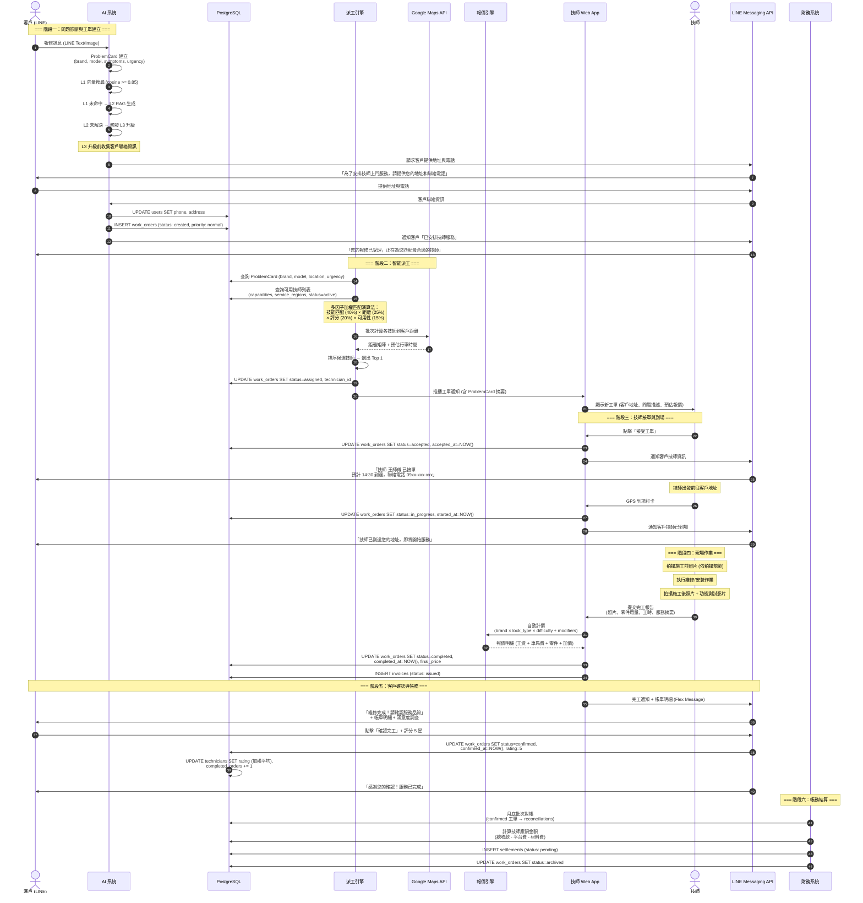
```mermaid
sequenceDiagram
    autonumber
    actor Customer as 客戶 (LINE)
    participant AI as AI 系統
    participant DB as PostgreSQL
    participant Dispatch as 派工引擎
    participant Maps as Google Maps API
    participant Pricing as 報價引擎
    participant TechApp as 技師 Web App
    actor Technician as 技師
    participant LINE as LINE Messaging API
    participant Finance as 財務系統

    Note over Customer, AI: === 階段一：問題診斷與工單建立 ===

    Customer->>AI: 報修訊息 (LINE Text/Image)
    AI->>AI: ProblemCard 建立<br/>(brand, model, symptoms, urgency)
    AI->>AI: L1 向量搜尋 (cosine >= 0.85)
    AI->>AI: L1 未命中 → L2 RAG 生成
    AI->>AI: L2 未解決 → 觸發 L3 升級

    Note over AI: L3 升級前收集客戶聯絡資訊

    AI->>LINE: 請求客戶提供地址與電話
    LINE->>Customer: 「為了安排技師上門服務，請提供您的地址和聯絡電話」
    Customer->>LINE: 提供地址與電話
    LINE->>AI: 客戶聯絡資訊
    AI->>DB: UPDATE users SET phone, address
    AI->>DB: INSERT work_orders (status: created, priority: normal)
    AI->>LINE: 通知客戶「已安排技師服務」
    LINE->>Customer: 「您的報修已受理，正在為您匹配最合適的技師」

    Note over Dispatch, Maps: === 階段二：智能派工 ===

    Dispatch->>DB: 查詢 ProblemCard (brand, model, location, urgency)
    Dispatch->>DB: 查詢可用技師列表<br/>(capabilities, service_regions, status=active)

    Note over Dispatch: 多因子加權匹配演算法：<br/>技能匹配 (40%) × 距離 (25%)<br/>× 評分 (20%) × 可用性 (15%)

    Dispatch->>Maps: 批次計算各技師到客戶距離
    Maps-->>Dispatch: 距離矩陣 + 預估行車時間
    Dispatch->>Dispatch: 排序候選技師 → 選出 Top 1
    Dispatch->>DB: UPDATE work_orders SET status=assigned, technician_id
    Dispatch->>TechApp: 推播工單通知 (含 ProblemCard 摘要)
    TechApp->>Technician: 顯示新工單 (客戶地址、問題描述、預估報價)

    Note over Technician, TechApp: === 階段三：技師接單與到場 ===

    Technician->>TechApp: 點擊「接受工單」
    TechApp->>DB: UPDATE work_orders SET status=accepted, accepted_at=NOW()
    TechApp->>LINE: 通知客戶技師資訊
    LINE->>Customer: 「技師 王師傅 已接單<br/>預計 14:30 到達，聯絡電話 09xx-xxx-xxx」

    Note over Technician: 技師出發前往客戶地址

    Technician->>TechApp: GPS 到場打卡
    TechApp->>DB: UPDATE work_orders SET status=in_progress, started_at=NOW()
    TechApp->>LINE: 通知客戶技師已到場
    LINE->>Customer: 「技師已到達您的地址，即將開始服務」

    Note over Technician: === 階段四：現場作業 ===

    Note over Technician: 拍攝施工前照片 (依拍攝規範)
    Note over Technician: 執行維修/安裝作業
    Note over Technician: 拍攝施工後照片 + 功能測試影片

    Technician->>TechApp: 提交完工報告<br/>(照片、零件用量、工時、服務摘要)
    TechApp->>Pricing: 自動計價<br/>(brand × lock_type × difficulty + modifiers)
    Pricing-->>TechApp: 報價明細 (工資 + 車馬費 + 零件 + 加價)
    TechApp->>DB: UPDATE work_orders SET status=completed,<br/>completed_at=NOW(), final_price
    TechApp->>DB: INSERT invoices (status: issued)

    Note over Customer, LINE: === 階段五：客戶確認與帳務 ===

    TechApp->>LINE: 完工通知 + 帳單明細 (Flex Message)
    LINE->>Customer: 「維修完成！請確認服務品質」<br/>+ 帳單明細 + 滿意度調查

    Customer->>LINE: 點擊「確認完工」+ 評分 5 星
    LINE->>DB: UPDATE work_orders SET status=confirmed,<br/>confirmed_at=NOW(), rating=5
    DB->>DB: UPDATE technicians SET rating (加權平均),<br/>completed_orders += 1
    LINE->>Customer: 「感謝您的確認！服務已完成」

    Note over Finance: === 階段六：帳務結算 ===

    Finance->>DB: 月底批次對帳<br/>(confirmed 工單 → reconciliations)
    Finance->>DB: 計算技師應領金額<br/>(總收款 - 平台費 - 材料費)
    Finance->>DB: INSERT settlements (status: pending)
    Finance->>DB: UPDATE work_orders SET status=archived
```

### 4.4 狀態轉換表

| 步驟 | 來源狀態 | 目標狀態 | 觸發動作 | 耗時預估 |
|------|----------|----------|----------|----------|
| 1 | — | `created` | AI 系統建立工單 | < 1 秒 |
| 2 | `created` | `assigned` | 派工引擎匹配完成 | < 5 分鐘 |
| 3 | `assigned` | `accepted` | 技師接受工單 | < 15 分鐘 |
| 4 | `accepted` | `in_progress` | 技師到場打卡 | 依預約時間 |
| 5 | `in_progress` | `completed` | 技師提交完工報告 | 30 分鐘 ~ 2 小時 |
| 6 | `completed` | `confirmed` | 客戶確認 / 48 小時自動確認 | < 48 小時 |
| 7 | `confirmed` | `archived` | 月底帳務結清 | 月結週期 |

### 4.5 通知清單

| 時機 | 通知方式 | 接收者 | 內容摘要 |
|------|----------|--------|----------|
| L3 升級 | LINE Flex | Customer | 「已安排技師服務，正在匹配中」 |
| 技師接單 | LINE Flex | Customer | 技師姓名、預計到達時間、聯絡電話 |
| 技師接單 | Web Push | Technician | 工單詳情、客戶地址、導航連結 |
| 技師到場 | LINE Push | Customer | 「技師已到達」 |
| 完工回報 | LINE Flex | Customer | 帳單明細 + 確認按鈕 + 滿意度調查 |
| 客戶確認 | Web Push | Technician | 「客戶已確認完工」 |
| 帳務結算 | Web Push | Technician | 月結對帳單 |

---

## 5. Flow 2：拒單與逾時重派

### 5.1 觸發條件

- 技師在收到工單後 15 分鐘內未回應 (逾時)
- 技師主動點擊「拒絕工單」

### 5.2 參與角色

Dispatch_Engine, Technician, Admin, Customer

### 5.3 流程圖

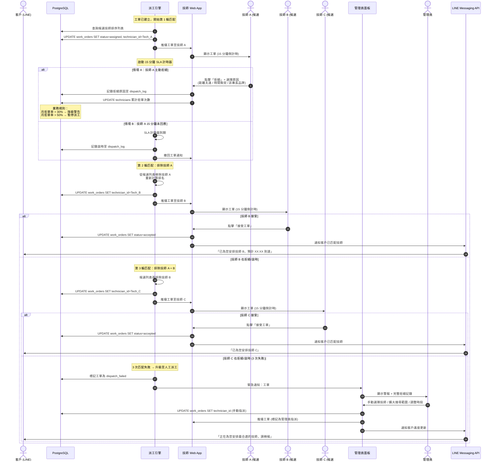
```mermaid
sequenceDiagram
    autonumber
    actor Customer as 客戶 (LINE)
    participant DB as PostgreSQL
    participant Dispatch as 派工引擎
    participant TechApp as 技師 Web App
    actor Tech1 as 技師 A (候選 #1)
    actor Tech2 as 技師 B (候選 #2)
    actor Tech3 as 技師 C (候選 #3)
    participant Admin as 管理員面板
    actor AdminUser as 管理員
    participant LINE as LINE Messaging API

    Note over Dispatch: 工單已建立，開始第 1 輪匹配

    Dispatch->>DB: 查詢候選技師排序列表
    Dispatch->>DB: UPDATE work_orders SET status=assigned, technician_id=Tech_A
    Dispatch->>TechApp: 推播工單至技師 A
    TechApp->>Tech1: 顯示工單 (15 分鐘倒計時)

    Note over Dispatch: 啟動 15 分鐘 SLA 計時器

    alt 情境 A：技師 A 主動拒絕
        Tech1->>TechApp: 點擊「拒絕」+ 選擇原因<br/>(距離太遠 / 時間衝突 / 非專長品牌)
        TechApp->>DB: 記錄拒絕原因至 dispatch_log
        TechApp->>DB: UPDATE technicians 累計拒單次數

        Note over DB: 業務規則：<br/>月拒單率 > 30% → 降級警告<br/>月拒單率 > 50% → 暫停派工
    else 情境 B：技師 A 15 分鐘未回應
        Dispatch->>Dispatch: SLA 計時器到期
        Dispatch->>DB: 記錄逾時至 dispatch_log
        Dispatch->>TechApp: 撤回工單通知
    end

    Note over Dispatch: 第 2 輪匹配：排除技師 A

    Dispatch->>Dispatch: 從候選列表移除技師 A<br/>重新計算排名
    Dispatch->>DB: UPDATE work_orders SET technician_id=Tech_B
    Dispatch->>TechApp: 推播工單至技師 B
    TechApp->>Tech2: 顯示工單 (15 分鐘倒計時)

    alt 技師 B 接受
        Tech2->>TechApp: 點擊「接受工單」
        TechApp->>DB: UPDATE work_orders SET status=accepted
        TechApp->>LINE: 通知客戶已匹配技師
        LINE->>Customer: 「已為您安排技師 B，預計 XX:XX 到達」
    else 技師 B 也拒絕/逾時
        Note over Dispatch: 第 3 輪匹配：排除技師 A + B

        Dispatch->>Dispatch: 候選列表再排除技師 B
        Dispatch->>DB: UPDATE work_orders SET technician_id=Tech_C
        Dispatch->>TechApp: 推播工單至技師 C
        TechApp->>Tech3: 顯示工單 (15 分鐘倒計時)

        alt 技師 C 接受
            Tech3->>TechApp: 點擊「接受工單」
            TechApp->>DB: UPDATE work_orders SET status=accepted
            TechApp->>LINE: 通知客戶已匹配技師
            LINE->>Customer: 「已為您安排技師 C」
        else 技師 C 也拒絕/逾時 (3 次失敗)

            Note over Dispatch: 3 次匹配失敗 → 升級至人工派工

            Dispatch->>DB: 標記工單為 dispatch_failed
            Dispatch->>Admin: 緊急通知：工單 #xxx 3 次匹配失敗
            Admin->>AdminUser: 顯示警報 + 完整拒絕記錄

            AdminUser->>Admin: 手動選擇技師 / 擴大搜尋範圍 / 調整時段
            Admin->>DB: UPDATE work_orders SET technician_id (手動指派)
            Admin->>TechApp: 推播工單 (標記為管理員指派)
            Admin->>LINE: 通知客戶進度更新
            LINE->>Customer: 「正在為您安排最合適的技師，請稍候」
        end
    end
```

### 5.4 狀態轉換表

| 步驟 | 來源狀態 | 目標狀態 | 觸發動作 |
|------|----------|----------|----------|
| 1 | `created` | `assigned` | 派工引擎匹配技師 A |
| 2a | `assigned` | `assigned` | 技師 A 拒絕 → 重新匹配技師 B |
| 2b | `assigned` | `assigned` | 技師 A 逾時 → 重新匹配技師 B |
| 3 | `assigned` | `accepted` | 技師 B (或 C) 接受 |
| 4 (異常) | `assigned` | `assigned` | 3 次失敗 → 管理員手動指派 |

### 5.5 通知清單

| 時機 | 通知方式 | 接收者 | 內容摘要 |
|------|----------|--------|----------|
| 第 2 輪重派 | — | Customer | (不通知客戶，避免焦慮) |
| 第 3 輪重派 | LINE Push | Customer | 「正在為您尋找最合適的技師」 |
| 3 次失敗 | Web Alert | Admin | 緊急：工單 3 次匹配失敗，需人工介入 |
| 人工指派完成 | LINE Flex | Customer | 已安排技師資訊 |
| 技師高拒單率 | Web Alert | Admin | 技師 xxx 月拒單率超過警戒值 |

### 5.6 業務規則

| 規則 | 閾值 | 動作 |
|------|------|------|
| 單次拒單 | — | 記錄原因，下次排序降權 |
| 月拒單率 > 30% | 30% | 系統發出降級警告 |
| 月拒單率 > 50% | 50% | 自動暫停派工 7 天 |
| 連續 3 次逾時未回應 | 3 次 | 標記為「離線」，暫停派工至手動恢復 |

---

## 6. Flow 3：範圍變更

### 6.1 觸發條件

- 技師到場後發現現場狀況與 ProblemCard 描述不符
- 需要額外工序 (如：門扇加工、更換型號)
- 維修範圍擴大導致報價變動

### 6.2 參與角色

Technician, Customer, Admin, Dispatch_Engine

### 6.3 流程圖

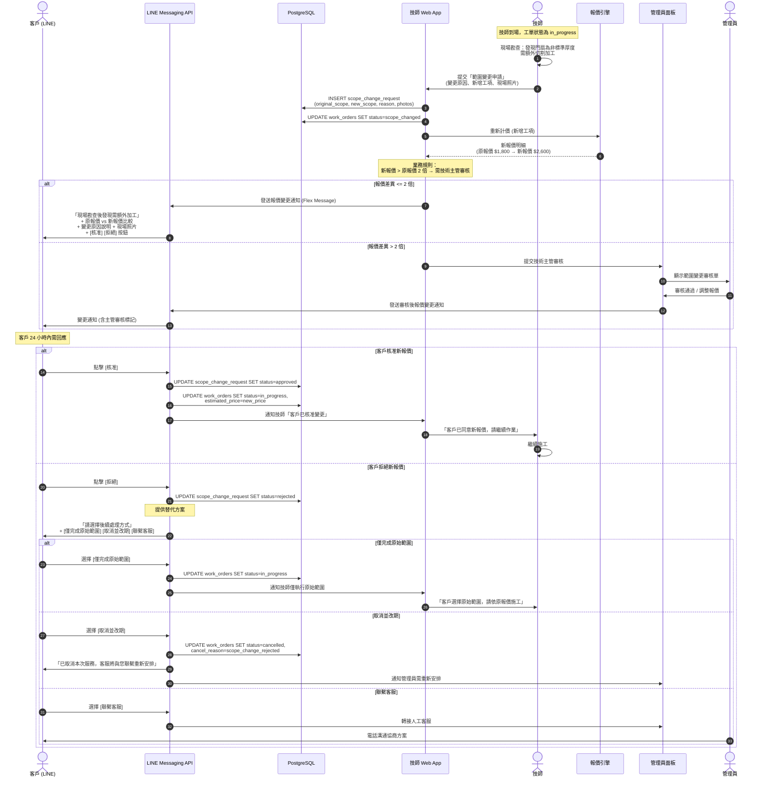
```mermaid
sequenceDiagram
    autonumber
    actor Customer as 客戶 (LINE)
    participant LINE as LINE Messaging API
    participant DB as PostgreSQL
    participant TechApp as 技師 Web App
    actor Technician as 技師
    participant Pricing as 報價引擎
    participant Admin as 管理員面板
    actor AdminUser as 管理員

    Note over Technician: 技師到場，工單狀態為 in_progress

    Technician->>Technician: 現場勘查：發現門扇為非標準厚度<br/>需額外切割加工
    Technician->>TechApp: 提交「範圍變更申請」<br/>(變更原因、新增工項、現場照片)

    TechApp->>DB: INSERT scope_change_request<br/>(original_scope, new_scope, reason, photos)
    TechApp->>DB: UPDATE work_orders SET status=scope_changed

    TechApp->>Pricing: 重新計價 (新增工項)
    Pricing-->>TechApp: 新報價明細<br/>(原報價 $1,800 → 新報價 $2,600)

    Note over TechApp: 業務規則：<br/>新報價 > 原報價 2 倍 → 需技術主管審核

    alt 報價差異 <= 2 倍
        TechApp->>LINE: 發送報價變更通知 (Flex Message)
        LINE->>Customer: 「現場勘查後發現需額外加工」<br/>+ 原報價 vs 新報價比較<br/>+ 變更原因說明 + 現場照片<br/>+ [核准] [拒絕] 按鈕
    else 報價差異 > 2 倍
        TechApp->>Admin: 提交技術主管審核
        Admin->>AdminUser: 顯示範圍變更審核單
        AdminUser->>Admin: 審核通過 / 調整報價
        Admin->>LINE: 發送審核後報價變更通知
        LINE->>Customer: 變更通知 (含主管審核標記)
    end

    Note over Customer: 客戶 24 小時內需回應

    alt 客戶核准新報價
        Customer->>LINE: 點擊 [核准]
        LINE->>DB: UPDATE scope_change_request SET status=approved
        LINE->>DB: UPDATE work_orders SET status=in_progress,<br/>estimated_price=new_price
        LINE->>TechApp: 通知技師「客戶已核准變更」
        TechApp->>Technician: 「客戶已同意新報價，請繼續作業」
        Technician->>Technician: 繼續施工

    else 客戶拒絕新報價
        Customer->>LINE: 點擊 [拒絕]
        LINE->>DB: UPDATE scope_change_request SET status=rejected

        Note over LINE: 提供替代方案

        LINE->>Customer: 「請選擇後續處理方式」<br/>+ [僅完成原始範圍] [取消並改期] [聯繫客服]

        alt 僅完成原始範圍
            Customer->>LINE: 選擇 [僅完成原始範圍]
            LINE->>DB: UPDATE work_orders SET status=in_progress
            LINE->>TechApp: 通知技師僅執行原始範圍
            TechApp->>Technician: 「客戶選擇原始範圍，請依原報價施工」
        else 取消並改期
            Customer->>LINE: 選擇 [取消並改期]
            LINE->>DB: UPDATE work_orders SET status=cancelled,<br/>cancel_reason=scope_change_rejected
            LINE->>Customer: 「已取消本次服務，客服將與您聯繫重新安排」
            LINE->>Admin: 通知管理員需重新安排
        else 聯繫客服
            Customer->>LINE: 選擇 [聯繫客服]
            LINE->>Admin: 轉接人工客服
            AdminUser->>Customer: 電話溝通協商方案
        end
    end
```

### 6.4 狀態轉換表

| 步驟 | 來源狀態 | 目標狀態 | 觸發動作 |
|------|----------|----------|----------|
| 1 | `in_progress` | `scope_changed` | 技師提交範圍變更 |
| 2a | `scope_changed` | `in_progress` | 客戶核准新報價 |
| 2b | `scope_changed` | `in_progress` | 客戶選擇僅完成原始範圍 |
| 2c | `scope_changed` | `cancelled` | 客戶拒絕且選擇取消 |

### 6.5 通知清單

| 時機 | 通知方式 | 接收者 | 內容摘要 |
|------|----------|--------|----------|
| 範圍變更提交 | LINE Flex | Customer | 原報價 vs 新報價 + 變更原因 + 照片 |
| 報價 > 2 倍 | Web Alert | Admin | 需技術主管審核 |
| 客戶核准 | Web Push | Technician | 客戶已同意新報價 |
| 客戶拒絕 | Web Push | Technician | 客戶選擇方案 (原範圍/取消/協商) |
| 24 小時未回應 | LINE Push | Customer | 提醒確認範圍變更 |
| 24 小時未回應 | Web Alert | Admin | 範圍變更超時未回應 |

---

## 7. Flow 4：缺料處理

### 7.1 觸發條件

- 技師到場後發現所需零件未攜帶或庫存不足
- 零件型號與現場實際不符需特殊零件

### 7.2 參與角色

Technician, Customer, Admin, Dispatch_Engine

### 7.3 流程圖

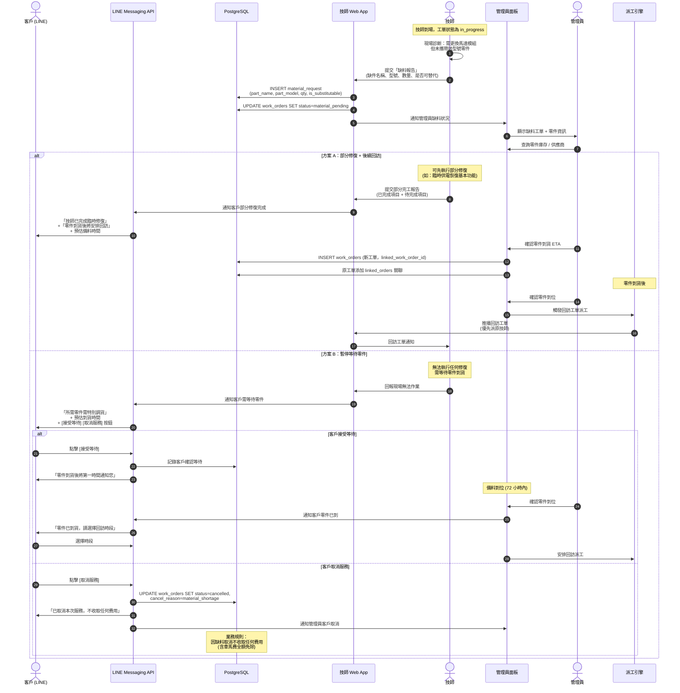
```mermaid
sequenceDiagram
    autonumber
    actor Customer as 客戶 (LINE)
    participant LINE as LINE Messaging API
    participant DB as PostgreSQL
    participant TechApp as 技師 Web App
    actor Technician as 技師
    participant Admin as 管理員面板
    actor AdminUser as 管理員
    participant Dispatch as 派工引擎

    Note over Technician: 技師到場，工單狀態為 in_progress

    Technician->>Technician: 現場診斷：需更換馬達模組<br/>但未攜帶該型號零件
    Technician->>TechApp: 提交「缺料報告」<br/>(缺件名稱、型號、數量、是否可替代)

    TechApp->>DB: INSERT material_request<br/>(part_name, part_model, qty, is_substitutable)
    TechApp->>DB: UPDATE work_orders SET status=material_pending

    TechApp->>Admin: 通知管理員缺料狀況
    Admin->>AdminUser: 顯示缺料工單 + 零件資訊

    AdminUser->>Admin: 查詢零件庫存 / 供應商

    alt 方案 A：部分修復 + 後續回訪
        Note over Technician: 可先執行部分修復<br/>(如：臨時供電恢復基本功能)

        Technician->>TechApp: 提交部分完工報告<br/>(已完成項目 + 待完成項目)
        TechApp->>LINE: 通知客戶部分修復完成
        LINE->>Customer: 「技師已完成臨時修復」<br/>+「零件到貨後將安排回訪」<br/>+ 預估備料時間

        AdminUser->>Admin: 確認零件到貨 ETA
        Admin->>DB: INSERT work_orders (新工單，linked_work_order_id)
        Admin->>DB: 原工單添加 linked_orders 關聯

        Note over Dispatch: 零件到貨後

        AdminUser->>Admin: 確認零件到位
        Admin->>Dispatch: 觸發回訪工單派工
        Dispatch->>TechApp: 推播回訪工單<br/>(優先派原技師)
        TechApp->>Technician: 回訪工單通知

    else 方案 B：暫停等待零件
        Note over Technician: 無法執行任何修復<br/>需等待零件到貨

        Technician->>TechApp: 回報現場無法作業
        TechApp->>LINE: 通知客戶需等待零件
        LINE->>Customer: 「所需零件需特別調貨」<br/>+ 預估到貨時間<br/>+ [接受等待] [取消服務] 按鈕

        alt 客戶接受等待
            Customer->>LINE: 點擊 [接受等待]
            LINE->>DB: 記錄客戶確認等待
            LINE->>Customer: 「零件到貨後將第一時間通知您」

            Note over Admin: 備料到位 (72 小時內)

            AdminUser->>Admin: 確認零件到位
            Admin->>LINE: 通知客戶零件已到
            LINE->>Customer: 「零件已到貨，請選擇回訪時段」
            Customer->>LINE: 選擇時段
            Admin->>Dispatch: 安排回訪派工

        else 客戶取消服務
            Customer->>LINE: 點擊 [取消服務]
            LINE->>DB: UPDATE work_orders SET status=cancelled,<br/>cancel_reason=material_shortage
            LINE->>Customer: 「已取消本次服務，不收取任何費用」
            LINE->>Admin: 通知管理員客戶取消

            Note over DB: 業務規則：<br/>因缺料取消不收取任何費用<br/>(含車馬費全額免除)
        end
    end
```

### 7.4 狀態轉換表

| 步驟 | 來源狀態 | 目標狀態 | 觸發動作 |
|------|----------|----------|----------|
| 1 | `in_progress` | `material_pending` | 技師回報缺料 |
| 2a | `material_pending` | `completed` (部分) | 部分修復完成 + 建立回訪工單 |
| 2b | `material_pending` | `material_pending` | 等待零件到貨 |
| 3a | `material_pending` | `in_progress` | 備料到位 → 繼續作業 |
| 3b | `material_pending` | `cancelled` | 客戶不願等待取消 |
| 回訪 | `created` (新工單) | ... | 備料完成後建立新工單 |

### 7.5 通知清單

| 時機 | 通知方式 | 接收者 | 內容摘要 |
|------|----------|--------|----------|
| 缺料回報 | Web Alert | Admin | 缺件名稱、型號、工單編號 |
| 缺料回報 | LINE Push | Customer | 缺料狀況說明 + 預估備料時間 |
| 部分修復完成 | LINE Flex | Customer | 已完成項目 + 回訪時程 |
| 零件到位 | LINE Push | Customer | 零件到貨通知 + 預約回訪 |
| 零件到位 | Web Push | Technician | 回訪工單通知 |
| 72 小時未到貨 | Web Alert | Admin | 備料超時警報 |

---

## 8. Flow 5：延遲通知與改期

### 8.1 觸發條件

- 技師預計無法在預約時段內到達
- 維修作業時間超出預估
- 交通或天氣等外部因素導致延遲

### 8.2 參與角色

Technician, Customer, Admin

### 8.3 流程圖

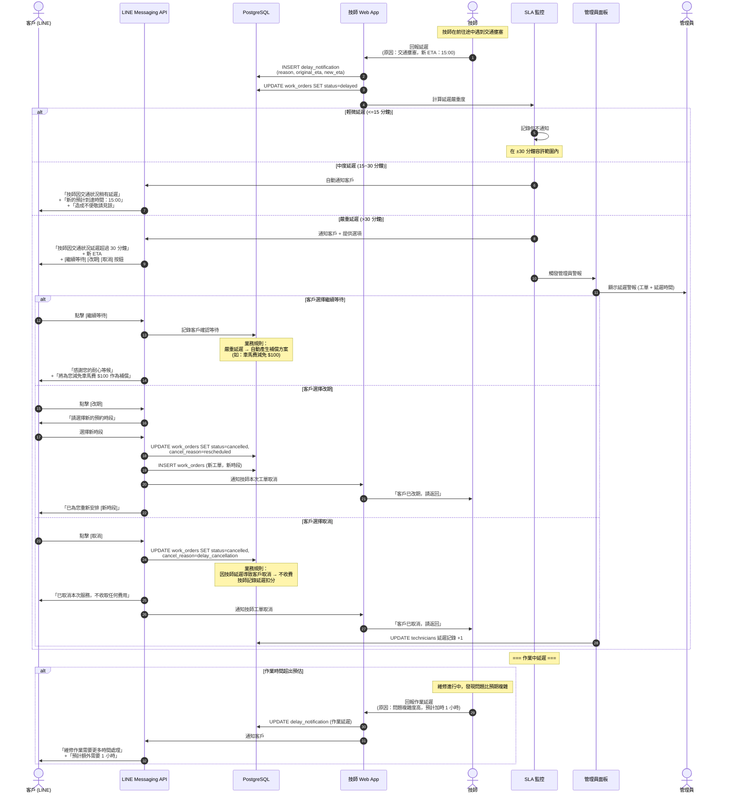
```mermaid
sequenceDiagram
    autonumber
    actor Customer as 客戶 (LINE)
    participant LINE as LINE Messaging API
    participant DB as PostgreSQL
    participant TechApp as 技師 Web App
    actor Technician as 技師
    participant SLA as SLA 監控
    participant Admin as 管理員面板
    actor AdminUser as 管理員

    Note over Technician: 技師在前往途中遇到交通壅塞

    Technician->>TechApp: 回報延遲<br/>(原因：交通壅塞，新 ETA：15:00)
    TechApp->>DB: INSERT delay_notification<br/>(reason, original_eta, new_eta)
    TechApp->>DB: UPDATE work_orders SET status=delayed

    TechApp->>SLA: 計算延遲嚴重度

    alt 輕微延遲 (<=15 分鐘)
        SLA->>SLA: 記錄但不通知
        Note over SLA: 在 ±30 分鐘容許範圍內

    else 中度延遲 (15~30 分鐘)
        SLA->>LINE: 自動通知客戶
        LINE->>Customer: 「技師因交通狀況稍有延遲」<br/>+「新的預計到達時間：15:00」<br/>+「造成不便敬請見諒」

    else 嚴重延遲 (>30 分鐘)
        SLA->>LINE: 通知客戶 + 提供選項
        LINE->>Customer: 「技師因交通狀況延遲超過 30 分鐘」<br/>+ 新 ETA<br/>+ [繼續等待] [改期] [取消] 按鈕

        SLA->>Admin: 觸發管理員警報
        Admin->>AdminUser: 顯示延遲警報 (工單 + 延遲時間)

        alt 客戶選擇繼續等待
            Customer->>LINE: 點擊 [繼續等待]
            LINE->>DB: 記錄客戶確認等待

            Note over DB: 業務規則：<br/>嚴重延遲 → 自動產生補償方案<br/>(如：車馬費減免 $100)

            LINE->>Customer: 「感謝您的耐心等候」<br/>+「將為您減免車馬費 $100 作為補償」

        else 客戶選擇改期
            Customer->>LINE: 點擊 [改期]
            LINE->>Customer: 「請選擇新的預約時段」
            Customer->>LINE: 選擇新時段

            LINE->>DB: UPDATE work_orders SET status=cancelled,<br/>cancel_reason=rescheduled
            LINE->>DB: INSERT work_orders (新工單，新時段)
            LINE->>TechApp: 通知技師本次工單取消
            TechApp->>Technician: 「客戶已改期，請返回」
            LINE->>Customer: 「已為您重新安排 [新時段]」

        else 客戶選擇取消
            Customer->>LINE: 點擊 [取消]
            LINE->>DB: UPDATE work_orders SET status=cancelled,<br/>cancel_reason=delay_cancellation

            Note over DB: 業務規則：<br/>因技師延遲導致客戶取消 → 不收費<br/>技師記錄延遲扣分

            LINE->>Customer: 「已取消本次服務，不收取任何費用」
            LINE->>TechApp: 通知技師工單取消
            TechApp->>Technician: 「客戶已取消，請返回」
            Admin->>DB: UPDATE technicians 延遲記錄 +1
        end
    end

    Note over SLA: === 作業中延遲 ===

    alt 作業時間超出預估
        Note over Technician: 維修進行中，發現問題比預期複雜

        Technician->>TechApp: 回報作業延遲<br/>(原因：問題複雜度高，預計加時 1 小時)
        TechApp->>DB: UPDATE delay_notification (作業延遲)
        TechApp->>LINE: 通知客戶
        LINE->>Customer: 「維修作業需要更多時間處理」<br/>+「預計額外需要 1 小時」
    end
```

### 8.4 狀態轉換表

| 步驟 | 來源狀態 | 目標狀態 | 觸發動作 |
|------|----------|----------|----------|
| 1 | `accepted` / `in_progress` | `delayed` | 技師回報延遲 |
| 2a | `delayed` | `in_progress` | 輕微延遲 → 技師到場 |
| 2b | `delayed` | `cancelled` + `created` | 客戶改期 → 取消舊單 + 建新單 |
| 2c | `delayed` | `cancelled` | 客戶取消 |

### 8.5 通知清單

| 時機 | 通知方式 | 接收者 | 內容摘要 |
|------|----------|--------|----------|
| 中度延遲 (15~30 min) | LINE Push | Customer | 延遲說明 + 新 ETA |
| 嚴重延遲 (>30 min) | LINE Flex | Customer | 延遲說明 + 繼續/改期/取消 選項 |
| 嚴重延遲 (>30 min) | Web Alert | Admin | 延遲警報 + 工單資訊 |
| 客戶確認等待 | — | — | 自動產生補償方案 |
| 客戶改期 | Web Push | Technician | 本次工單取消，客戶已改期 |
| 作業延遲 | LINE Push | Customer | 預計額外所需時間 |

### 8.6 補償規則

| 延遲程度 | 補償方案 | 自動/人工 |
|----------|----------|-----------|
| 15~30 分鐘 | 無補償 (在 SLA 容許範圍) | — |
| 30~60 分鐘 | 車馬費減免 $100 | 自動 |
| > 60 分鐘 | 車馬費全免 + $200 折扣碼 | 自動 |
| 技師未到 (no-show) | 全額免費 + $500 折扣碼 + 優先重派 | 自動 + 人工跟進 |

---

## 9. Flow 6：退款審批與大額雙簽

### 9.1 觸發條件

- 客戶透過 LINE 或客服申請退款
- 工單完成後客戶對服務品質/收費不滿
- 爭議處理結果為退款

### 9.2 參與角色

Customer, Admin, Finance

### 9.3 流程圖

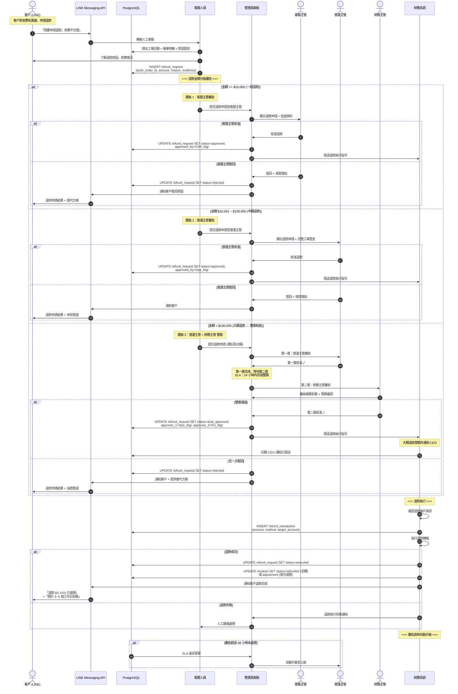
```mermaid
sequenceDiagram
    autonumber
    actor Customer as 客戶 (LINE)
    participant LINE as LINE Messaging API
    participant DB as PostgreSQL
    participant CSR as 客服人員
    participant Admin as 管理員面板
    actor CSRMgr as 客服主管
    actor OpsMgr as 營運主管
    actor FinMgr as 財務主管
    participant Finance as 財務系統

    Note over Customer: 客戶對收費有異議，申請退款

    Customer->>LINE: 「我要申請退款，收費不合理」
    LINE->>CSR: 轉接人工客服

    CSR->>DB: 調出工單記錄 + 帳單明細 + 對話歷史
    CSR->>Customer: 了解退款原因、核實情況

    CSR->>DB: INSERT refund_request<br/>(work_order_id, amount, reason, evidence)

    Note over CSR: === 退款金額分級審批 ===

    alt 金額 <= $10,000 (一般退款)
        Note over CSR: 層級 1：客服主管審批

        CSR->>Admin: 提交退款申請至客服主管
        Admin->>CSRMgr: 顯示退款申請 + 佐證資料

        alt 客服主管核准
            CSRMgr->>Admin: 核准退款
            Admin->>DB: UPDATE refund_request SET status=approved,<br/>approved_by=CSR_Mgr
            Admin->>Finance: 發送退款執行指令
        else 客服主管駁回
            CSRMgr->>Admin: 駁回 + 填寫理由
            Admin->>DB: UPDATE refund_request SET status=rejected
            Admin->>LINE: 通知客戶駁回原因
            LINE->>Customer: 退款申請結果 + 替代方案
        end

    else 金額 $10,001 ~ $100,000 (中額退款)
        Note over CSR: 層級 2：營運主管審批

        CSR->>Admin: 提交退款申請至營運主管
        Admin->>OpsMgr: 顯示退款申請 + 完整工單歷史

        alt 營運主管核准
            OpsMgr->>Admin: 核准退款
            Admin->>DB: UPDATE refund_request SET status=approved,<br/>approved_by=Ops_Mgr
            Admin->>Finance: 發送退款執行指令
        else 營運主管駁回
            OpsMgr->>Admin: 駁回 + 填寫理由
            Admin->>LINE: 通知客戶
            LINE->>Customer: 退款申請結果 + 申訴管道
        end

    else 金額 > $100,000 (大額退款 — 雙簽制度)
        Note over CSR: 層級 3：營運主管 + 財務主管 雙簽

        CSR->>Admin: 提交退款申請 (標記為大額)
        Admin->>OpsMgr: 第一簽：營運主管審核
        OpsMgr->>Admin: 第一簽核准 ✓

        Note over Admin: 第一簽完成，等待第二簽<br/>SLA：24 小時內完成雙簽

        Admin->>FinMgr: 第二簽：財務主管審核
        FinMgr->>Admin: 審核帳務影響 + 預算確認

        alt 雙簽通過
            FinMgr->>Admin: 第二簽核准 ✓
            Admin->>DB: UPDATE refund_request SET status=dual_approved,<br/>approver_1=Ops_Mgr, approver_2=Fin_Mgr
            Admin->>Finance: 發送退款執行指令

            Note over Finance: 大額退款需額外通知 CEO
            Finance->>DB: 記錄 CEO 通知已發送
        else 任一方駁回
            Admin->>DB: UPDATE refund_request SET status=rejected
            Admin->>LINE: 通知客戶 + 提供替代方案
            LINE->>Customer: 退款申請結果 + 協商管道
        end
    end

    Note over Finance: === 退款執行 ===

    Finance->>Finance: 確認退款帳戶資訊
    Finance->>DB: INSERT refund_transaction<br/>(amount, method, target_account)
    Finance->>Finance: 執行退款轉帳

    alt 退款成功
        Finance->>DB: UPDATE refund_request SET status=executed
        Finance->>DB: UPDATE invoices SET status=refunded (全額)<br/>或 adjustment (部分退款)
        Finance->>LINE: 通知客戶退款完成
        LINE->>Customer: 「退款 $X,XXX 已處理」<br/>+「預計 3~5 個工作日到帳」
    else 退款失敗
        Finance->>Admin: 退款執行失敗通知
        Admin->>CSR: 人工跟進處理
    end

    Note over Finance: === 審批逾時自動升級 ===

    alt 審批超過 48 小時未處理
        DB->>Admin: SLA 違反警報
        Admin->>OpsMgr: 自動升級至上級
    end
```

### 9.4 狀態轉換表

| 步驟 | 來源狀態 | 目標狀態 | 觸發動作 |
|------|----------|----------|----------|
| 1 | — | `refund_pending` | 客服建立退款申請 |
| 2a | `refund_pending` | `refund_approved` | 單簽核准 (<= $100K) |
| 2b | `refund_pending` | `refund_dual_approved` | 雙簽核准 (> $100K) |
| 2c | `refund_pending` | `refund_rejected` | 審批駁回 |
| 3 | `refund_approved` / `refund_dual_approved` | `refund_executed` | 財務完成退款 |
| 4 | `refund_executed` | `refund_failed` | 退款轉帳失敗 |

### 9.5 通知清單

| 時機 | 通知方式 | 接收者 | 內容摘要 |
|------|----------|--------|----------|
| 退款申請建立 | Web Alert | 審批人 (依金額) | 退款申請詳情 |
| 審批完成 | LINE Push | Customer | 審批結果 |
| 雙簽第一簽 | Web Alert | 財務主管 | 等待第二簽 |
| 退款執行完成 | LINE Flex | Customer | 退款金額 + 到帳預估 |
| 退款失敗 | Web Alert | Admin, Finance | 需人工跟進 |
| 審批超時 | Web Alert | 上級主管 | SLA 違反自動升級 |
| 大額退款 (> $100K) | Email | CEO | 大額退款通知 |

### 9.6 審批層級表

| 退款金額 | 審批層級 | 審批人 | SLA |
|----------|----------|--------|-----|
| <= $10,000 | 單簽 | 客服主管 | 24 小時 |
| $10,001 ~ $100,000 | 單簽 | 營運主管 | 24 小時 |
| > $100,000 | 雙簽 | 營運主管 + 財務主管 | 24 小時 (每簽) |
| > $100,000 (核准後) | 通知 | CEO | 知會 (不需核准) |

---

## 10. Flow 7：保固爭議

### 10.1 觸發條件

- 客戶宣稱產品在保固期內故障
- 保固起算日認定有爭議 (常見：點交日 vs 入住日)
- 保固期邊界案件

### 10.2 參與角色

Customer, AI_System, Admin

### 10.3 流程圖

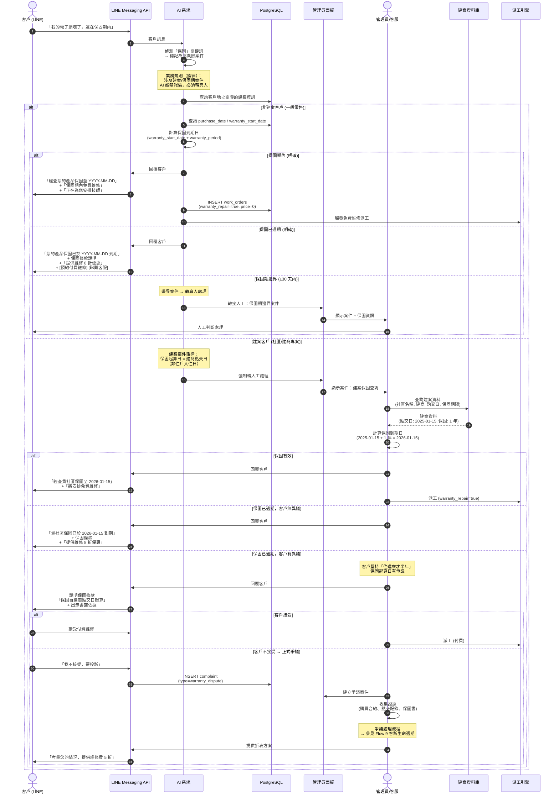
```mermaid
sequenceDiagram
    autonumber
    actor Customer as 客戶 (LINE)
    participant LINE as LINE Messaging API
    participant AI as AI 系統
    participant DB as PostgreSQL
    participant Admin as 管理員面板
    actor AdminUser as 管理員/客服
    participant ProjectDB as 建案資料庫
    participant Dispatch as 派工引擎

    Customer->>LINE: 「我的電子鎖壞了，還在保固期內」
    LINE->>AI: 客戶訊息

    AI->>AI: 偵測「保固」關鍵詞<br/>→ 標記為高風險案件

    Note over AI: 業務規則（鐵律）：<br/>涉及建案/保固期案件<br/>AI 嚴禁報價，必須轉真人

    AI->>DB: 查詢客戶地址關聯的建案資訊

    alt 非建案客戶 (一般零售)
        AI->>DB: 查詢 purchase_date / warranty_start_date
        AI->>AI: 計算保固到期日<br/>(warranty_start_date + warranty_period)

        alt 保固期內 (明確)
            AI->>LINE: 回覆客戶
            LINE->>Customer: 「經查您的產品保固至 YYYY-MM-DD」<br/>+「保固期內免費維修」<br/>+「正在為您安排技師」

            AI->>DB: INSERT work_orders<br/>(warranty_repair=true, price=0)
            AI->>Dispatch: 觸發免費維修派工

        else 保固已過期 (明確)
            AI->>LINE: 回覆客戶
            LINE->>Customer: 「您的產品保固已於 YYYY-MM-DD 到期」<br/>+ 保固條款說明<br/>+「提供維修 8 折優惠」<br/>+ [預約付費維修] [聯繫客服]

        else 保固期邊界 (±30 天內)
            Note over AI: 邊界案件 → 轉真人處理
            AI->>Admin: 轉接人工：保固期邊界案件
            Admin->>AdminUser: 顯示案件 + 保固資訊
            AdminUser->>Customer: 人工判斷處理
        end

    else 建案客戶 (社區/建商專案)
        Note over AI: 建案案件鐵律：<br/>保固起算日 = 建商點交日<br/>（非住戶入住日）

        AI->>Admin: 強制轉人工處理
        Admin->>AdminUser: 顯示案件：建案保固查詢

        AdminUser->>ProjectDB: 查詢建案資料<br/>(社區名稱, 建商, 點交日, 保固期限)
        ProjectDB-->>AdminUser: 建案資料<br/>(點交日: 2025-01-15, 保固: 1 年)

        AdminUser->>AdminUser: 計算保固到期日<br/>(2025-01-15 + 1 年 = 2026-01-15)

        alt 保固有效
            AdminUser->>LINE: 回覆客戶
            LINE->>Customer: 「經查貴社區保固至 2026-01-15」<br/>+「將安排免費維修」
            AdminUser->>Dispatch: 派工 (warranty_repair=true)

        else 保固已過期，客戶無異議
            AdminUser->>LINE: 回覆客戶
            LINE->>Customer: 「貴社區保固已於 2026-01-15 到期」<br/>+ 保固條款<br/>+「提供維修 8 折優惠」

        else 保固已過期，客戶有異議
            Note over AdminUser: 客戶堅持「住進來才半年」<br/>保固起算日有爭議

            AdminUser->>LINE: 回覆客戶
            LINE->>Customer: 說明保固條款<br/>「保固自建商點交日起算」<br/>+ 出示書面依據

            alt 客戶接受
                Customer->>LINE: 接受付費維修
                AdminUser->>Dispatch: 派工 (付費)
            else 客戶不接受 → 正式爭議
                Customer->>LINE: 「我不接受，要投訴」
                LINE->>DB: INSERT complaint<br/>(type=warranty_dispute)
                AdminUser->>Admin: 建立爭議案件
                AdminUser->>AdminUser: 收集證據<br/>(購買合約、點交記錄、保固書)

                Note over AdminUser: 爭議處理流程<br/>→ 參見 Flow 9 客訴生命週期

                AdminUser->>LINE: 提供折衷方案
                LINE->>Customer: 「考量您的情況，提供維修費 5 折」
            end
        end
    end
```

### 10.4 狀態轉換表

| 步驟 | 來源狀態 | 目標狀態 | 觸發動作 |
|------|----------|----------|----------|
| 1 | — | `created` | 保固查詢 → 確認免費維修 → 建立工單 |
| 2 | — | — | 保固過期 → 客戶選擇付費維修 → 建立工單 |
| 3 | — | `disputed` | 保固認定爭議 → 進入爭議流程 |

### 10.5 通知清單

| 時機 | 通知方式 | 接收者 | 內容摘要 |
|------|----------|--------|----------|
| 保固關鍵詞觸發 | Web Alert | Admin | 高風險案件：保固查詢 |
| 建案案件 | Web Alert | Admin | 強制轉人工：建案保固 |
| 保固確認 (有效) | LINE Flex | Customer | 保固期限 + 免費維修安排 |
| 保固確認 (過期) | LINE Flex | Customer | 到期日 + 優惠方案 |
| 爭議建立 | Web Alert | Admin | 保固爭議案件 |

### 10.6 業務規則

| 規則 | 說明 |
|------|------|
| 保固起算日 | 建案客戶 = 建商點交日；零售客戶 = 購買日 |
| AI 報價禁令 | 涉及建案/保固案件，AI 嚴禁自動報價 |
| 邊界案件 | 保固到期前後 30 天內的案件一律轉人工 |
| 善意折讓 | 保固剛過期 (< 90 天) 可提供 8 折優惠 |
| 證據保存 | 所有保固認定需保留書面查詢記錄 |

---

## 11. Flow 8：品質不合格與二次派工

### 11.1 觸發條件

- 客戶在完工後 7 天內反映相同故障症狀 (「修了又壞」)
- 系統自動偵測：同一客戶 + 同一症狀 + 7 天內

### 11.2 參與角色

Customer, AI_System, Dispatch_Engine, Technician, Admin

### 11.3 流程圖

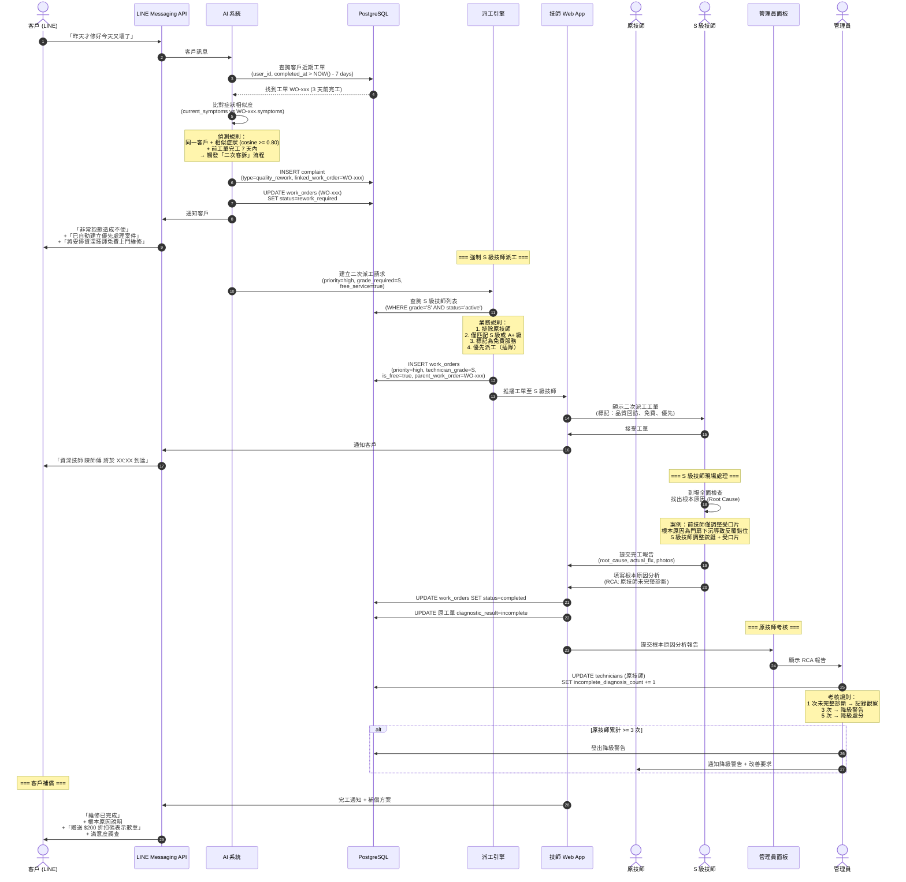
```mermaid
sequenceDiagram
    autonumber
    actor Customer as 客戶 (LINE)
    participant LINE as LINE Messaging API
    participant AI as AI 系統
    participant DB as PostgreSQL
    participant Dispatch as 派工引擎
    participant TechApp as 技師 Web App
    actor OrigTech as 原技師
    actor SGradeTech as S 級技師
    participant Admin as 管理員面板
    actor AdminUser as 管理員

    Customer->>LINE: 「昨天才修好今天又壞了」
    LINE->>AI: 客戶訊息

    AI->>DB: 查詢客戶近期工單<br/>(user_id, completed_at > NOW() - 7 days)
    DB-->>AI: 找到工單 WO-xxx (3 天前完工)

    AI->>AI: 比對症狀相似度<br/>(current_symptoms vs WO-xxx.symptoms)

    Note over AI: 偵測規則：<br/>同一客戶 + 相似症狀 (cosine >= 0.80)<br/>+ 前工單完工 7 天內<br/>→ 觸發「二次客訴」流程

    AI->>DB: INSERT complaint<br/>(type=quality_rework, linked_work_order=WO-xxx)
    AI->>DB: UPDATE work_orders (WO-xxx)<br/>SET status=rework_required

    AI->>LINE: 通知客戶
    LINE->>Customer: 「非常抱歉造成不便」<br/>+「已自動建立優先處理案件」<br/>+「將安排資深技師免費上門維修」

    Note over Dispatch: === 強制 S 級技師派工 ===

    AI->>Dispatch: 建立二次派工請求<br/>(priority=high, grade_required=S,<br/>free_service=true)

    Dispatch->>DB: 查詢 S 級技師列表<br/>(WHERE grade='S' AND status='active')

    Note over Dispatch: 業務規則：<br/>1. 排除原技師<br/>2. 僅匹配 S 級或 A+ 級<br/>3. 標記為免費服務<br/>4. 優先派工（插隊）

    Dispatch->>DB: INSERT work_orders<br/>(priority=high, technician_grade=S,<br/>is_free=true, parent_work_order=WO-xxx)
    Dispatch->>TechApp: 推播工單至 S 級技師
    TechApp->>SGradeTech: 顯示二次派工工單<br/>(標記：品質回訪、免費、優先)

    SGradeTech->>TechApp: 接受工單
    TechApp->>LINE: 通知客戶
    LINE->>Customer: 「資深技師 陳師傅 將於 XX:XX 到達」

    Note over SGradeTech: === S 級技師現場處理 ===

    SGradeTech->>SGradeTech: 到場全面檢查<br/>找出根本原因 (Root Cause)

    Note over SGradeTech: 案例：前技師僅調整受口片<br/>根本原因為門扇下沉導致反覆錯位<br/>S 級技師調整鉸鏈 + 受口片

    SGradeTech->>TechApp: 提交完工報告<br/>(root_cause, actual_fix, photos)
    SGradeTech->>TechApp: 填寫根本原因分析<br/>(RCA: 原技師未完整診斷)

    TechApp->>DB: UPDATE work_orders SET status=completed
    TechApp->>DB: UPDATE 原工單 diagnostic_result=incomplete

    Note over Admin: === 原技師考核 ===

    TechApp->>Admin: 提交根本原因分析報告
    Admin->>AdminUser: 顯示 RCA 報告

    AdminUser->>DB: UPDATE technicians (原技師)<br/>SET incomplete_diagnosis_count += 1

    Note over AdminUser: 考核規則：<br/>1 次未完整診斷 → 記錄觀察<br/>3 次 → 降級警告<br/>5 次 → 降級處分

    alt 原技師累計 >= 3 次
        AdminUser->>DB: 發出降級警告
        AdminUser->>OrigTech: 通知降級警告 + 改善要求
    end

    Note over Customer: === 客戶補償 ===

    TechApp->>LINE: 完工通知 + 補償方案
    LINE->>Customer: 「維修已完成」<br/>+ 根本原因說明<br/>+「贈送 $200 折扣碼表示歉意」<br/>+ 滿意度調查
```

### 11.4 狀態轉換表

| 步驟 | 來源狀態 | 目標狀態 | 觸發動作 |
|------|----------|----------|----------|
| 1 | `confirmed` / `completed` (原工單) | `rework_required` | 系統偵測 7 天內同症狀 |
| 2 | — (新工單) | `created` | 建立二次派工工單 |
| 3 | `created` | `assigned` | 強制 S 級技師匹配 |
| 4 | `assigned` | `accepted` | S 級技師接受 |
| 5 | `accepted` | `in_progress` | S 級技師到場 |
| 6 | `in_progress` | `completed` | 提交完工報告 + RCA |

### 11.5 通知清單

| 時機 | 通知方式 | 接收者 | 內容摘要 |
|------|----------|--------|----------|
| 二次客訴偵測 | LINE Push | Customer | 已建立優先案件 + 免費維修 |
| 二次客訴偵測 | Web Alert | Admin | 品質問題警報 + 原工單資訊 |
| S 級技師接單 | LINE Flex | Customer | 資深技師資訊 + 到達時間 |
| 完工 + RCA | Web Alert | Admin | 根本原因報告 |
| 原技師考核 | Web Push | 原技師 | 記錄通知 / 降級警告 |
| 客戶補償 | LINE Flex | Customer | 完工通知 + 折扣碼 |

### 11.6 偵測規則

| 參數 | 閾值 | 說明 |
|------|------|------|
| 時間窗口 | 7 天 | 前工單完工後 7 天內 |
| 症狀相似度 | cosine >= 0.80 | 使用 text-embedding-004 向量比對 |
| 客戶匹配 | 同一 user_id | 同一客戶帳號 |
| 自動觸發 | 是 | 無需人工介入 |

---

## 12. Flow 9：客訴處理完整生命週期

### 12.1 觸發條件

- 客戶透過 LINE 或電話提出投訴
- 系統自動偵測客戶負面情緒 (anger level >= 3)
- 其他流程升級 (如保固爭議、範圍變更糾紛)

### 12.2 參與角色

Customer, AI_System, Admin, Finance

### 12.3 客訴狀態機

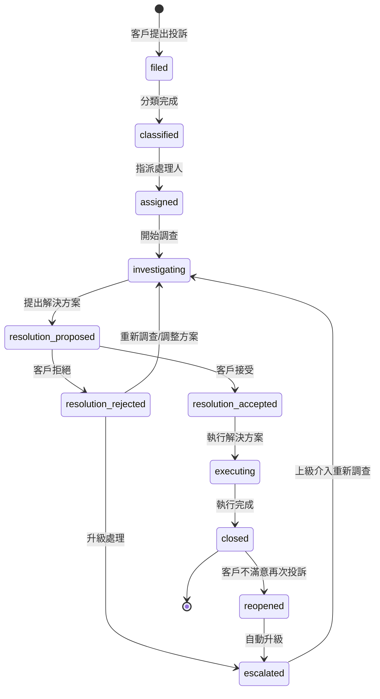
```mermaid
stateDiagram-v2
    [*] --> filed : 客戶提出投訴

    filed --> classified : 分類完成
    classified --> assigned : 指派處理人
    assigned --> investigating : 開始調查
    investigating --> resolution_proposed : 提出解決方案
    resolution_proposed --> resolution_accepted : 客戶接受
    resolution_proposed --> resolution_rejected : 客戶拒絕
    resolution_rejected --> investigating : 重新調查/調整方案
    resolution_rejected --> escalated : 升級處理
    escalated --> investigating : 上級介入重新調查
    resolution_accepted --> executing : 執行解決方案
    executing --> closed : 執行完成
    closed --> reopened : 客戶不滿意再次投訴
    reopened --> escalated : 自動升級
    closed --> [*]
```

### 12.4 流程圖

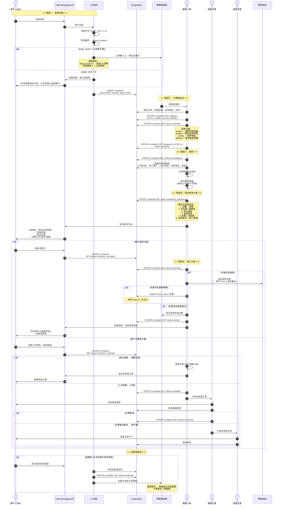
```mermaid
sequenceDiagram
    autonumber
    actor Customer as 客戶 (LINE)
    participant LINE as LINE Messaging API
    participant AI as AI 系統
    participant DB as PostgreSQL
    participant Admin as 管理員面板
    actor CSR as 客服人員
    actor CSRMgr as 客服主管
    actor OpsMgr as 營運主管
    participant Finance as 財務系統

    Note over Customer, AI: === 階段一：客訴受理 ===

    Customer->>LINE: 投訴訊息
    LINE->>AI: 客戶訊息

    AI->>AI: 情緒分析 (anger_level: 1~5)
    AI->>AI: 意圖識別 → intent=complaint

    alt anger_level >= 4 (高度不滿)
        AI->>Admin: 立即轉人工 + 標記高優先
        Note over AI: 業務規則：<br/>anger_level 4-5 → 跳過 AI 回覆<br/>直接轉真人 + 主管通知
    else anger_level < 4
        AI->>LINE: 安撫回覆 + 表示會處理
        LINE->>Customer: 「非常抱歉造成不便，已為您建立處理案件」
    end

    AI->>DB: INSERT complaint<br/>(status=filed, severity, anger_level)

    Note over Admin, CSR: === 階段二：分類與指派 ===

    Admin->>CSR: 新客訴通知
    CSR->>DB: 查詢工單 + 對話紀錄 + 技師報告 + 照片

    CSR->>DB: UPDATE complaint SET category<br/>(service / quality / pricing / attitude)
    CSR->>DB: UPDATE complaint SET status=classified

    Note over CSR: 客訴分類：<br/>service — 服務流程問題<br/>quality — 維修品質問題<br/>pricing — 收費爭議<br/>attitude — 技師態度問題

    CSR->>DB: UPDATE complaint SET assigned_to=CSR_id,<br/>status=assigned

    Note over CSR: === 階段三：調查 ===

    CSR->>DB: UPDATE complaint SET status=investigating
    CSR->>DB: 調閱完整證據鏈<br/>(工單記錄、完工照片、LINE 對話、技師報告、帳單)

    CSR->>CSR: 分析問題根本原因
    CSR->>CSR: 評估責任歸屬<br/>(技師/公司/客戶/設備)

    Note over CSR: === 階段四：提出解決方案 ===

    CSR->>DB: UPDATE complaint SET status=resolution_proposed

    Note over CSR: 解決方案選項池：<br/>1. 道歉 + 說明<br/>2. 折扣碼 / 優惠券<br/>3. 部分退款<br/>4. 全額退款<br/>5. 免費二次服務<br/>6. 技師處分 + 換人重做

    CSR->>LINE: 提出解決方案
    LINE->>Customer: 「經調查，針對您的問題」<br/>+ 調查結論<br/>+ 解決方案<br/>+ [接受] [不接受] 按鈕

    alt 客戶接受方案
        Customer->>LINE: 點擊 [接受]
        LINE->>DB: UPDATE complaint<br/>SET status=resolution_accepted

        Note over CSR: === 階段五：執行方案 ===

        CSR->>DB: UPDATE complaint SET status=executing

        alt 方案涉及退款
            CSR->>Finance: 發起退款流程<br/>(→ 參見 Flow 6 退款審批)
        end

        alt 方案涉及重新服務
            CSR->>DB: INSERT work_orders (免費)
            Note over DB: → 參見 Flow 8 二次派工
        end

        alt 方案涉及技師處分
            CSR->>Admin: 提交技師考核記錄
        end

        CSR->>DB: UPDATE complaint SET status=closed
        CSR->>LINE: 結案通知 + 滿意度再調查
        LINE->>Customer: 「您的案件已處理完成」<br/>+ 滿意度調查

    else 客戶不接受方案
        Customer->>LINE: 點擊 [不接受] + 說明原因
        LINE->>DB: UPDATE complaint<br/>SET status=resolution_rejected

        alt 首次拒絕 → 調整方案
            CSR->>CSR: 調整方案 (加大補償力度)
            CSR->>LINE: 提出修改後方案
            LINE->>Customer: 調整後的方案
        else 二次拒絕 → 升級
            CSR->>DB: UPDATE complaint SET status=escalated
            CSR->>CSRMgr: 升級至客服主管

            CSRMgr->>Customer: 主管致電溝通
            CSRMgr->>DB: 記錄溝通結果

            alt 主管解決
                CSRMgr->>DB: UPDATE complaint SET status=executing
            else 主管無法解決 → 再升級
                CSRMgr->>OpsMgr: 升級至營運主管
                OpsMgr->>Customer: 營運主管介入
                OpsMgr->>DB: 最終裁決
            end
        end
    end

    Note over DB: === 結案後監控 ===

    alt 結案後 30 天內客戶再次投訴
        Customer->>LINE: 再次投訴相同問題
        AI->>DB: 偵測到重複投訴
        AI->>DB: UPDATE complaint SET status=reopened
        AI->>Admin: 自動升級至主管層級

        Note over Admin: 重開案件 → 直接指派主管處理<br/>不重複走一線客服
    end
```

### 12.5 狀態轉換表

| 步驟 | 來源狀態 | 目標狀態 | 觸發動作 |
|------|----------|----------|----------|
| 1 | — | `filed` | 客戶投訴 / AI 偵測 |
| 2 | `filed` | `classified` | 客服分類 (service/quality/pricing/attitude) |
| 3 | `classified` | `assigned` | 指派客服人員 |
| 4 | `assigned` | `investigating` | 開始調查 |
| 5 | `investigating` | `resolution_proposed` | 提出方案 |
| 6a | `resolution_proposed` | `resolution_accepted` | 客戶接受 |
| 6b | `resolution_proposed` | `resolution_rejected` | 客戶拒絕 |
| 7a | `resolution_rejected` | `investigating` | 調整方案 |
| 7b | `resolution_rejected` | `escalated` | 二次拒絕 → 升級 |
| 8 | `escalated` | `investigating` | 上級介入重查 |
| 9 | `resolution_accepted` | `executing` | 執行方案 |
| 10 | `executing` | `closed` | 方案執行完成 |
| 11 | `closed` | `reopened` | 30 天內同問題再投訴 |
| 12 | `reopened` | `escalated` | 自動升級 |

### 12.6 通知清單

| 時機 | 通知方式 | 接收者 | 內容摘要 |
|------|----------|--------|----------|
| 投訴受理 | LINE Push | Customer | 已建立案件，處理中 |
| anger_level >= 4 | Web Alert (緊急) | CSR + 主管 | 高優先客訴 |
| 方案提出 | LINE Flex | Customer | 調查結論 + 方案 + 接受/拒絕 |
| 方案被拒 (2次) | Web Alert | 客服主管 | 需主管介入 |
| 升級至營運 | Web Alert | 營運主管 | 客訴升級 |
| 結案 | LINE Flex | Customer | 處理結果 + 滿意度調查 |
| 重開案件 | Web Alert | 主管 | 重複投訴自動升級 |

### 12.7 各類型客訴 SLA

| 客訴類型 | 嚴重度 | 首次回應 SLA | 解決 SLA | 升級時限 |
|----------|--------|-------------|----------|----------|
| 態度問題 | 中 | 2 小時 | 3 個工作日 | 24 小時 |
| 服務流程 | 中 | 2 小時 | 3 個工作日 | 24 小時 |
| 維修品質 | 高 | 1 小時 | 2 個工作日 | 12 小時 |
| 收費爭議 | 高 | 1 小時 | 2 個工作日 | 12 小時 |
| anger_level >= 4 | 緊急 | 15 分鐘 | 24 小時 | 4 小時 |
| anger_level = 5 | 危機 | 立即 | 12 小時 | 2 小時 |

---

## 13. Flow 10：門外觀變更確認

### 13.1 觸發條件

- 技師到場勘查後發現需切割非標準側板
- 安裝過程可能影響門扇外觀 (烤漆、表面處理)
- 任何可能造成門扇不可逆改變的工序

### 13.2 參與角色

Technician, Customer, Admin

### 13.3 流程圖

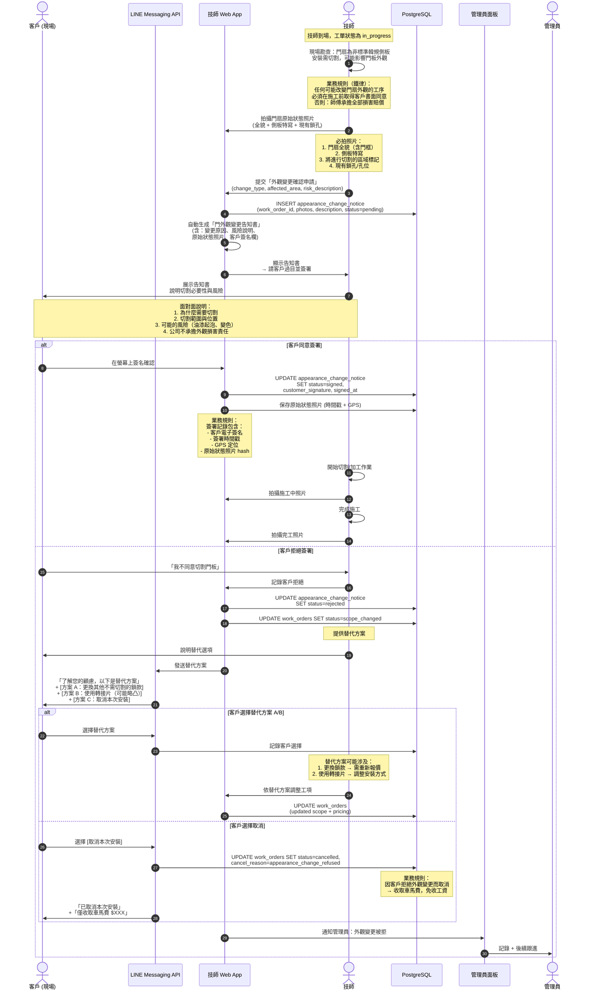
```mermaid
sequenceDiagram
    autonumber
    actor Customer as 客戶 (現場)
    participant LINE as LINE Messaging API
    participant TechApp as 技師 Web App
    actor Technician as 技師
    participant DB as PostgreSQL
    participant Admin as 管理員面板
    actor AdminUser as 管理員

    Note over Technician: 技師到場，工單狀態為 in_progress

    Technician->>Technician: 現場勘查：門扇為非標準韓規側板<br/>安裝需切割，可能影響門板外觀

    Note over Technician: 業務規則（鐵律）：<br/>任何可能改變門扇外觀的工序<br/>必須在施工前取得客戶書面同意<br/>否則：師傅承擔全部損害賠償

    Technician->>TechApp: 拍攝門扇原始狀態照片<br/>(全貌 + 側板特寫 + 現有鎖孔)

    Note over Technician: 必拍照片：<br/>1. 門扇全貌（含門框）<br/>2. 側板特寫<br/>3. 將進行切割的區域標記<br/>4. 現有鎖孔/孔位

    Technician->>TechApp: 提交「外觀變更確認申請」<br/>(change_type, affected_area, risk_description)

    TechApp->>DB: INSERT appearance_change_notice<br/>(work_order_id, photos, description, status=pending)

    TechApp->>TechApp: 自動生成「門外觀變更告知書」<br/>(含：變更原因、風險說明、<br/>原始狀態照片、客戶簽名欄)

    TechApp->>Technician: 顯示告知書<br/>→ 請客戶過目並簽署

    Technician->>Customer: 展示告知書<br/>說明切割必要性與風險

    Note over Technician, Customer: 面對面說明：<br/>1. 為什麼需要切割<br/>2. 切割範圍與位置<br/>3. 可能的風險（油漆起泡、變色）<br/>4. 公司不承擔外觀損害責任

    alt 客戶同意簽署
        Customer->>TechApp: 在螢幕上簽名確認
        TechApp->>DB: UPDATE appearance_change_notice<br/>SET status=signed,<br/>customer_signature, signed_at
        TechApp->>DB: 保存原始狀態照片 (時間戳 + GPS)

        Note over TechApp: 業務規則：<br/>簽署記錄包含：<br/>- 客戶電子簽名<br/>- 簽署時間戳<br/>- GPS 定位<br/>- 原始狀態照片 hash

        Technician->>Technician: 開始切割/加工作業
        Technician->>TechApp: 拍攝施工中照片
        Technician->>Technician: 完成施工
        Technician->>TechApp: 拍攝完工照片

    else 客戶拒絕簽署
        Customer->>Technician: 「我不同意切割門板」

        Technician->>TechApp: 記錄客戶拒絕
        TechApp->>DB: UPDATE appearance_change_notice<br/>SET status=rejected

        TechApp->>DB: UPDATE work_orders SET status=scope_changed

        Note over Technician: 提供替代方案

        Technician->>Customer: 說明替代選項

        TechApp->>LINE: 發送替代方案
        LINE->>Customer: 「了解您的顧慮，以下是替代方案」<br/>+ [方案 A：更換其他不需切割的鎖款]<br/>+ [方案 B：使用轉接片（可能略凸）]<br/>+ [方案 C：取消本次安裝]

        alt 客戶選擇替代方案 A/B
            Customer->>LINE: 選擇替代方案
            LINE->>DB: 記錄客戶選擇

            Note over Technician: 替代方案可能涉及：<br/>1. 更換鎖款 → 需重新報價<br/>2. 使用轉接片 → 調整安裝方式

            Technician->>TechApp: 依替代方案調整工項
            TechApp->>DB: UPDATE work_orders<br/>(updated scope + pricing)

        else 客戶選擇取消
            Customer->>LINE: 選擇 [取消本次安裝]
            LINE->>DB: UPDATE work_orders SET status=cancelled,<br/>cancel_reason=appearance_change_refused

            Note over DB: 業務規則：<br/>因客戶拒絕外觀變更而取消<br/>→ 收取車馬費，免收工資

            LINE->>Customer: 「已取消本次安裝」<br/>+「僅收取車馬費 $XXX」
        end

        TechApp->>Admin: 通知管理員：外觀變更被拒
        Admin->>AdminUser: 記錄 + 後續跟進
    end
```

### 13.4 狀態轉換表

| 步驟 | 來源狀態 | 目標狀態 | 觸發動作 |
|------|----------|----------|----------|
| 1 | `in_progress` | `in_progress` (暫停) | 技師偵測到外觀變更需求 |
| 2a | `in_progress` | `in_progress` (繼續) | 客戶簽署同意書 → 繼續施工 |
| 2b | `in_progress` | `scope_changed` | 客戶拒絕 → 討論替代方案 |
| 3a | `scope_changed` | `in_progress` | 客戶選擇替代方案 |
| 3b | `scope_changed` | `cancelled` | 客戶取消安裝 |

### 13.5 通知清單

| 時機 | 通知方式 | 接收者 | 內容摘要 |
|------|----------|--------|----------|
| 外觀變更申請 | — | Customer (面對面) | 告知書面對面說明 |
| 客戶簽署 | Web Push | Admin | 記錄存檔 |
| 客戶拒絕 | LINE Flex | Customer | 替代方案選項 |
| 客戶拒絕 | Web Alert | Admin | 外觀變更被拒通知 |
| 取消安裝 | LINE Flex | Customer | 取消確認 + 車馬費 |

### 13.6 證據保存規範

| 項目 | 要求 | 說明 |
|------|------|------|
| 原始狀態照片 | 最少 4 張 | 全貌、側板、切割區域、現有孔位 |
| 電子簽名 | 含時間戳 + GPS | 不可事後補簽 |
| 照片 hash | SHA-256 | 防止事後篡改 |
| 施工中照片 | 最少 1 張 | 記錄加工過程 |
| 完工照片 | 最少 2 張 | 記錄最終結果 |
| 保存期限 | 永久 | 作為爭議處理依據 |

---

## 14. 升級矩陣

### 14.1 完整升級矩陣

| 觸發事件 | Level 1 (自動) | Level 2 (主管) | Level 3 (高層) | SLA |
|----------|---------------|---------------|---------------|-----|
| 技師未到場 (no-show) | 自動重派 + 客戶通知 | 管理員手動指派 + 電話致歉 | 客戶補償 ($500 折扣碼) + 技師處分 | L1: 立即, L2: 15 分鐘, L3: 30 分鐘 |
| 連續 3+ 技師拒單 | 手動派工模式 | 加入優先佇列 + 擴大搜尋 | VIP 技師池指定派工 | L1: 立即, L2: 30 分鐘, L3: 1 小時 |
| 範圍變更 > 原報價 2 倍 | 技術主管審核報價 | 營運主管核准 | 客戶重新報價 + 可取消 | L1: 1 小時, L2: 4 小時, L3: 24 小時 |
| 客戶 anger_level = 5 | 立即轉人工 + 安撫話術 | 主管 15 分鐘內回電 | 補償方案 + 折扣 + 優先處理 | L1: 立即, L2: 15 分鐘, L3: 1 小時 |
| 7 天內同故障復發 | 自動二次派工 (S 級、免費) | 免費服務 + 原技師記缺 | 根本原因審查 + 系統改善 | L1: 立即, L2: 24 小時, L3: 3 天 |
| 退款 > $100,000 | 營運主管 + 財務主管雙簽 | CEO 知會 | — | L1: 24 小時, L2: 48 小時 |
| 技師現場加價 | 凍結交易 + 調出標準報價 | 技術主管確認實際費用 | 客戶按標準價結算 + 技師記警告 | L1: 立即, L2: 2 小時, L3: 24 小時 |
| 施工造成損害 | 現場拍照存證 + 凍結 | 技術主管到場勘查 | 公司承擔合理修復費 + 技師記缺 | L1: 立即, L2: 24 小時, L3: 3 天 |
| 保固認定爭議 | AI 轉人工 + 查建案資料庫 | 客服出示書面依據 | 折衷方案 (折扣維修) | L1: 立即, L2: 2 小時, L3: 24 小時 |
| 備料超過 72 小時 | 通知客戶 + 提供改期 | 管理員尋找替代零件 | 升級至供應鏈主管 | L1: 72 小時, L2: 96 小時, L3: 5 天 |
| 客訴 2 次方案被拒 | 客服調整方案 | 客服主管致電溝通 | 營運主管最終裁決 | L1: 4 小時, L2: 24 小時, L3: 48 小時 |
| 同技師 3+ 次客訴 | 記錄觀察 + 教育訓練 | 暫停派工 + 面談 | 降級 / 解除合作 | L1: 累計, L2: 即時, L3: 7 天內 |

### 14.2 升級通知路徑

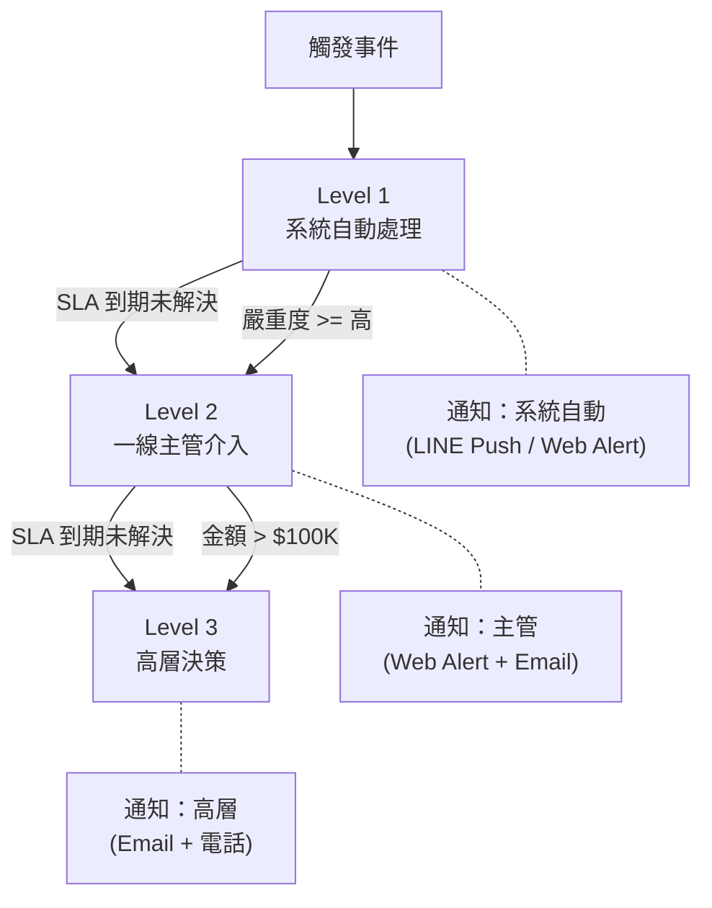
```mermaid
graph TD
    Trigger["觸發事件"]
    L1["Level 1<br/>系統自動處理"]
    L2["Level 2<br/>一線主管介入"]
    L3["Level 3<br/>高層決策"]

    Trigger --> L1
    L1 -->|SLA 到期未解決| L2
    L2 -->|SLA 到期未解決| L3
    L1 -->|嚴重度 >= 高| L2
    L2 -->|金額 > $100K| L3

    L1 -.- N1["通知：系統自動<br/>(LINE Push / Web Alert)"]
    L2 -.- N2["通知：主管<br/>(Web Alert + Email)"]
    L3 -.- N3["通知：高層<br/>(Email + 電話)"]
```

### 14.3 技師考核與升降級規則

| 指標 | 觀察 | 警告 | 處分 |
|------|------|------|------|
| 未完整診斷 (二次派工) | 1 次 | 3 次 | 5 次 → 降級 |
| 月拒單率 | — | > 30% | > 50% → 暫停 7 天 |
| 客訴次數 (月) | 1 次 | 2 次 | 3+ 次 → 暫停 + 面談 |
| 延遲到場 (月) | 1~2 次 | 3 次 | 5+ 次 → 降級警告 |
| 未執行告知義務 | 1 次 → 記缺 | 2 次 → 降級警告 | 3 次 → 降級 |
| 現場私自加價 | 1 次 → 警告 + 扣分 | 2 次 → 降級 | 3 次 → 解除合作 |

---

## 15. 知識沉澱閉環與完工報告

> 對應 `diagnostic-intelligence-architecture.md` §6 Layer 6: Knowledge Loop

### 15.1 完工報告結構化 Schema

技師提交完工報告時，除了現有的 `service_report`（TEXT）和 `photos`（JSONB），Phase 2 需擴展為結構化的 `service_reports` 表（詳見 `diagnostic-intelligence-architecture.md` §6）：

| 欄位 | 說明 | 來源 |
|---|---|---|
| `problem_card_id` | 關聯 AI 診斷的 ProblemCard | 系統自動 |
| `predicted_fm_ids` | AI 預測的 Failure Mode（來自 `task_decompose` 的 `hypothesized_failure_modes`） | 系統自動 |
| `actual_fm_id` | 技師到府確認的實際 Failure Mode | 技師填寫 |
| `ai_prediction_hit` | AI 猜對了嗎（`predicted_fm_ids` 包含 `actual_fm_id`） | 系統自動計算 |
| `defect_type` | 缺陷粗分類：`material` / `process` / `design` / `operation` / `other` | 技師選擇（下拉 5 選 1） |
| `defect_description` | 缺陷具體描述（自由文字，50 字內） | 技師填寫 |
| `corrective_action` | 修了什麼（CA — Corrective Action） | 技師填寫 |
| `preventive_action` | 建議的預防措施（PA — Preventive Action） | 技師填寫（選填） |
| `verification` | 修復後功能測試結果 JSONB `{fingerprint: pass, bluetooth: pass, ...}` | 技師填寫 |

### 15.2 知識沉澱閉環流程

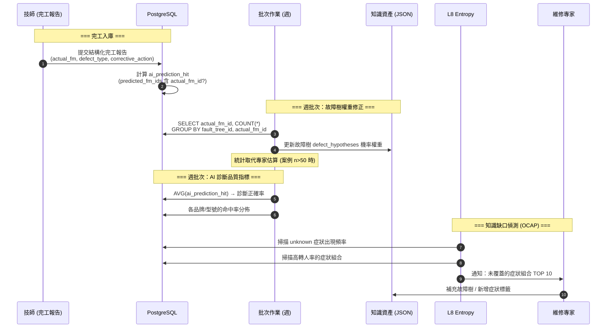
```mermaid
sequenceDiagram
    autonumber
    participant Tech as 技師 (完工報告)
    participant DB as PostgreSQL
    participant Batch as 批次作業 (週)
    participant KnowledgeBase as 知識資產 (JSON)
    participant L8 as L8 Entropy
    participant Expert as 維修專家

    Note over Tech, DB: === 完工入庫 ===
    Tech->>DB: 提交結構化完工報告<br/>(actual_fm, defect_type, corrective_action)
    DB->>DB: 計算 ai_prediction_hit<br/>(predicted_fm_ids 含 actual_fm_id?)

    Note over Batch, KnowledgeBase: === 週批次：故障樹權重修正 ===
    Batch->>DB: SELECT actual_fm_id, COUNT(*)<br/>GROUP BY fault_tree_id, actual_fm_id
    Batch->>KnowledgeBase: 更新故障樹 defect_hypotheses 機率權重
    Note over Batch: 統計取代專家估算 (案例 n>50 時)

    Note over Batch, DB: === 週批次：AI 診斷品質指標 ===
    Batch->>DB: AVG(ai_prediction_hit) → 診斷正確率
    Batch->>DB: 各品牌/型號的命中率分佈

    Note over L8, Expert: === 知識缺口偵測 (OCAP) ===
    L8->>DB: 掃描 unknown 症狀出現頻率
    L8->>DB: 掃描高轉人率的症狀組合
    L8->>Expert: 通知：未覆蓋的症狀組合 TOP 10
    Expert->>KnowledgeBase: 補充故障樹 / 新增症狀標籤
```

### 15.3 OCAP 規則與工單品質監控

以下 OCAP 規則（來源：`ocap_rules.json`）在工單完工後自動觸發：

| 規則 | 觸發條件 | 動作 |
|---|---|---|
| OCAP-001 | 同一 failure_id 24h 內 > 10 件 | 通知維修主管 + 啟動批次追溯 |
| OCAP-002 | 轉人率 7 日內 > 30% | 檢查 agent prompt + fallback_tools |
| OCAP-003 | 同型號 7 日內 > 20 件 | 標記品質異常 + 通知品牌原廠 |
| OCAP-004 | AI 診斷正確率 30 日 < 60% | 觸發故障樹全面審查 |
| OCAP-SENTIMENT-001 | 高風險情緒關鍵詞（10 個） | 立即轉人工 + 通知主管 |
| OCAP-EMERGENCY-001 | Red_Code 關鍵字（7 個） | 緊急派工 + 安全評估 |

> **知識閉環核心**：每張完工報告 = 一筆 ground truth。故障樹權重從「專家估算」漸進為「統計事實」。詳見 `diagnostic-intelligence-architecture.md` §6 + `optimization-strategy.md` §6 冷啟動策略。

---


---

# 缺口補充章節 (§16-§24)

> 基於「訂單流程缺口精確比對報告」(OP-01~OP-21) 補充的完整設計。
> 涵蓋 S1 詢問接入、S2 報價確認、S6 金流支付、EX5 帳款異常、客戶不在場、狀態機擴充等。

## 16. S1 詢問接入階段

> **Gap ID**：OP-04 — 原文件缺少完整的客戶接入 (intake) 階段定義

### 16.1 觸發條件

- 客戶透過 LINE 官方帳號發送文字/圖片訊息
- 客戶撥打客服電話 (0800-xxx-xxx)，IVR 轉接至 AI 語音
- 客戶透過官方網站提交報修表單

### 16.2 參與角色

Customer, AI_System, Admin

### 16.3 三管道統一接入架構

| 管道 | 技術實作 | 接入方式 | 轉換至統一格式 |
|------|----------|----------|----------------|
| LINE | LINE Messaging API (Webhook) | 文字/圖片/影片/Flex 回覆 | `intake_event.channel = "line"` |
| 電話 | Twilio + Whisper STT → LLM | 語音轉文字後進入同一推理引擎 | `intake_event.channel = "phone"` |
| 網站 | REST API `POST /api/v1/intake` | 結構化表單 (brand, model, symptom) | `intake_event.channel = "web"` |

> **設計原則**：三個管道收斂為同一個 `intake_event` 進入 AI 推理引擎，後續所有流程完全一致。

### 16.4 流程圖

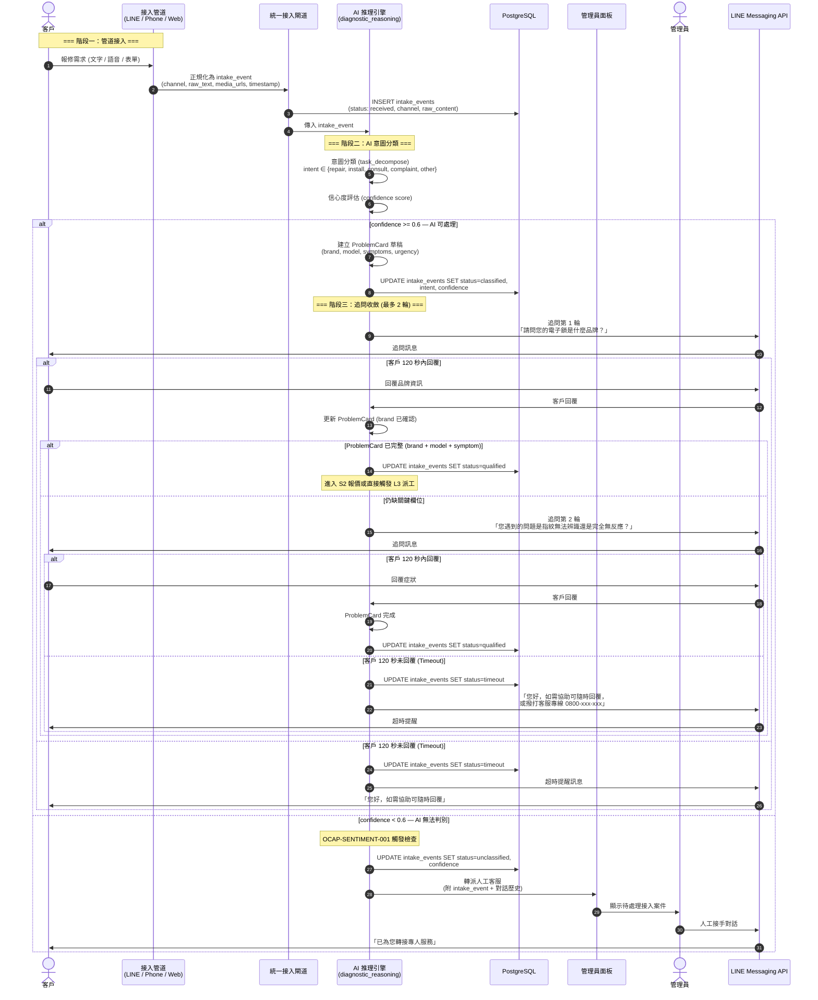
```mermaid
sequenceDiagram
    autonumber
    actor Customer as 客戶
    participant Channel as 接入管道<br/>(LINE / Phone / Web)
    participant Gateway as 統一接入閘道
    participant AI as AI 推理引擎<br/>(diagnostic_reasoning)
    participant DB as PostgreSQL
    participant Admin as 管理員面板
    actor AdminUser as 管理員
    participant LINE as LINE Messaging API

    Note over Customer, Channel: === 階段一：管道接入 ===

    Customer->>Channel: 報修需求 (文字 / 語音 / 表單)
    Channel->>Gateway: 正規化為 intake_event<br/>(channel, raw_text, media_urls, timestamp)
    Gateway->>DB: INSERT intake_events<br/>(status: received, channel, raw_content)
    Gateway->>AI: 傳入 intake_event

    Note over AI: === 階段二：AI 意圖分類 ===

    AI->>AI: 意圖分類 (task_decompose)<br/>intent ∈ {repair, install, consult, complaint, other}
    AI->>AI: 信心度評估 (confidence score)

    alt confidence >= 0.6 — AI 可處理
        AI->>AI: 建立 ProblemCard 草稿<br/>(brand, model, symptoms, urgency)
        AI->>DB: UPDATE intake_events SET status=classified,<br/>intent, confidence

        Note over AI: === 階段三：追問收斂 (最多 2 輪) ===

        AI->>LINE: 追問第 1 輪<br/>「請問您的電子鎖是什麼品牌？」
        LINE->>Customer: 追問訊息

        alt 客戶 120 秒內回覆
            Customer->>LINE: 回覆品牌資訊
            LINE->>AI: 客戶回覆
            AI->>AI: 更新 ProblemCard (brand 已確認)

            alt ProblemCard 已完整 (brand + model + symptom)
                AI->>DB: UPDATE intake_events SET status=qualified
                Note over AI: 進入 S2 報價或直接觸發 L3 派工
            else 仍缺關鍵欄位
                AI->>LINE: 追問第 2 輪<br/>「您遇到的問題是指紋無法辨識還是完全無反應？」
                LINE->>Customer: 追問訊息

                alt 客戶 120 秒內回覆
                    Customer->>LINE: 回覆症狀
                    LINE->>AI: 客戶回覆
                    AI->>AI: ProblemCard 完成
                    AI->>DB: UPDATE intake_events SET status=qualified
                else 客戶 120 秒未回覆 (Timeout)
                    AI->>DB: UPDATE intake_events SET status=timeout
                    AI->>LINE: 「您好，如需協助可隨時回覆，<br/>或撥打客服專線 0800-xxx-xxx」
                    LINE->>Customer: 超時提醒
                end
            end
        else 客戶 120 秒未回覆 (Timeout)
            AI->>DB: UPDATE intake_events SET status=timeout
            AI->>LINE: 超時提醒訊息
            LINE->>Customer: 「您好，如需協助可隨時回覆」
        end

    else confidence < 0.6 — AI 無法判別
        Note over AI: OCAP-SENTIMENT-001 觸發檢查

        AI->>DB: UPDATE intake_events SET status=unclassified,<br/>confidence
        AI->>Admin: 轉派人工客服<br/>(附 intake_event + 對話歷史)
        Admin->>AdminUser: 顯示待處理接入案件
        AdminUser->>LINE: 人工接手對話
        LINE->>Customer: 「已為您轉接專人服務」
    end
```

### 16.5 狀態轉換表

| 步驟 | 來源狀態 | 目標狀態 | 觸發動作 | 耗時預估 |
|------|----------|----------|----------|----------|
| 1 | — | `received` | 管道接入 intake_event | < 1 秒 |
| 2 | `received` | `classified` | AI 意圖分類完成 (confidence >= 0.6) | < 3 秒 |
| 3 | `classified` | `qualified` | ProblemCard 收集完整 (brand + model + symptom) | < 5 分鐘 |
| 4a | `received` | `unclassified` | AI confidence < 0.6 → 轉人工 | < 3 秒 |
| 4b | `classified` | `timeout` | 2 輪追問皆超時 (120 秒 x 2) | 4 分鐘 |
| 5 | `unclassified` | `qualified` | 人工客服完成資訊收集 | < 10 分鐘 |

### 16.6 通知清單

| 時機 | 通知方式 | 接收者 | 內容摘要 |
|------|----------|--------|----------|
| 接入成功 | LINE Push | Customer | 「感謝您的聯繫，正在為您分析問題」 |
| 追問 (每輪) | LINE Flex | Customer | 結構化追問 (含快速回覆按鈕) |
| 超時未回覆 | LINE Push | Customer | 超時提醒 + 客服專線 |
| 轉人工 | LINE Push | Customer | 「已為您轉接專人服務」 |
| 轉人工 | Web Alert | Admin | 待處理接入案件 + 對話歷史 |

### 16.7 業務規則

| 編號 | 規則 | 閾值 | 動作 |
|------|------|------|------|
| BR-S1-001 | AI 意圖分類信心度閾值 | confidence < 0.6 | 直接轉人工 |
| BR-S1-002 | 追問輪數上限 | 最多 2 輪 | 超過 2 輪仍無法收斂 → 轉人工 |
| BR-S1-003 | 單輪追問超時 | 120 秒 | 發送超時提醒，不重試 |
| BR-S1-004 | 連續 2 輪超時 | — | 暫停對話，記錄至 CRM 待回訪 |
| BR-S1-005 | 高風險情緒關鍵詞 | OCAP-SENTIMENT-001 觸發 | 跳過追問，立即轉人工 |
| BR-S1-006 | Red_Code 關鍵字偵測 | OCAP-EMERGENCY-001 觸發 | 跳過 S1 → 直接進入 Red_Code 派工 |

---

## 17. S2 施工前報價確認

> **Gap ID**：OP-05 — 原文件僅有 AI 自動計價，缺少報價區間概念、議價路徑、報價有效期

### 17.1 觸發條件

- S1 階段完成，ProblemCard 狀態為 `qualified`
- AI 推理引擎判斷需到府服務 (非遠端可解)
- 管理員手動建立報修需求

### 17.2 參與角色

Customer, AI_System, Pricing_Engine, Admin

### 17.3 報價區間計算邏輯

| 計算因子 | 資料來源 | 權重 | 說明 |
|----------|----------|------|------|
| 基礎工資 | RAG 定價資料庫 (brand × lock_type) | 固定 | 品牌/型號對應的標準工資 |
| 車馬費 | Google Maps API (距離 km) | 固定 | 距離 × $20/km，最低 $300 |
| 零件費 | RAG 零件價格庫 | 區間 | 依可能需更換的零件，取 min/max |
| 時段加價 | config.toml `surcharge_rules` | 乘數 | 夜間 (22:00-08:00) × 1.5、假日 × 1.3 |
| 難度係數 | ProblemCard.urgency + symptom_count | 乘數 | 複雜度高 × 1.2 |

**報價區間公式**：
```
price_min = (base_labor + travel_fee + parts_min) × time_surcharge × difficulty
price_max = (base_labor + travel_fee + parts_max) × time_surcharge × difficulty
```

> **設計原則**：對客戶呈現報價區間 (如 NT$2,800 ~ NT$3,600)，而非單一價格。最終價格由技師到場確認後決定。

### 17.4 流程圖

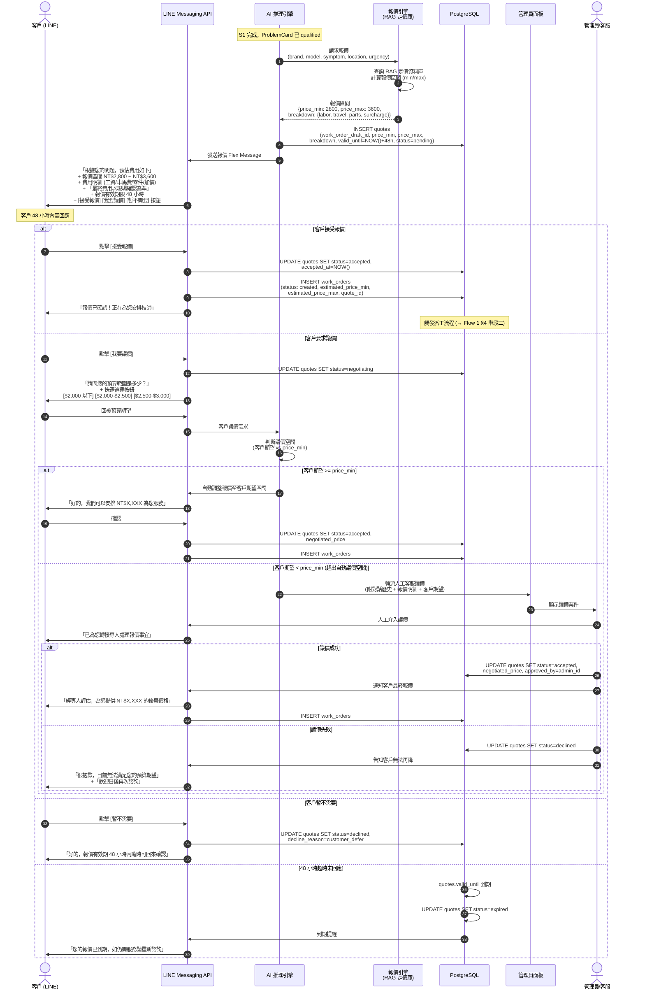
```mermaid
sequenceDiagram
    autonumber
    actor Customer as 客戶 (LINE)
    participant LINE as LINE Messaging API
    participant AI as AI 推理引擎
    participant Pricing as 報價引擎<br/>(RAG 定價庫)
    participant DB as PostgreSQL
    participant Admin as 管理員面板
    actor AdminUser as 管理員/客服

    Note over AI: S1 完成，ProblemCard 已 qualified

    AI->>Pricing: 請求報價<br/>(brand, model, symptom, location, urgency)
    Pricing->>Pricing: 查詢 RAG 定價資料庫<br/>計算報價區間 (min/max)
    Pricing-->>AI: 報價區間<br/>{price_min: 2800, price_max: 3600,<br/>breakdown: {labor, travel, parts, surcharge}}

    AI->>DB: INSERT quotes<br/>(work_order_draft_id, price_min, price_max,<br/>breakdown, valid_until=NOW()+48h, status=pending)

    AI->>LINE: 發送報價 Flex Message
    LINE->>Customer: 「根據您的問題，預估費用如下」<br/>+ 報價區間 NT$2,800 ~ NT$3,600<br/>+ 費用明細 (工資/車馬費/零件/加價)<br/>+ 「最終費用以現場確認為準」<br/>+ 報價有效期限 48 小時<br/>+ [接受報價] [我要議價] [暫不需要] 按鈕

    Note over Customer: 客戶 48 小時內需回應

    alt 客戶接受報價
        Customer->>LINE: 點擊 [接受報價]
        LINE->>DB: UPDATE quotes SET status=accepted,<br/>accepted_at=NOW()
        LINE->>DB: INSERT work_orders<br/>(status: created, estimated_price_min,<br/>estimated_price_max, quote_id)
        LINE->>Customer: 「報價已確認！正在為您安排技師」
        Note over DB: 觸發派工流程 (→ Flow 1 §4 階段二)

    else 客戶要求議價
        Customer->>LINE: 點擊 [我要議價]
        LINE->>DB: UPDATE quotes SET status=negotiating

        LINE->>Customer: 「請問您的預算範圍是多少？」<br/>+ 快速選擇按鈕<br/>[$2,000 以下] [$2,000-$2,500] [$2,500-$3,000]

        Customer->>LINE: 回覆預算期望
        LINE->>AI: 客戶議價需求

        AI->>AI: 判斷議價空間<br/>(客戶期望 vs price_min)

        alt 客戶期望 >= price_min
            AI->>LINE: 自動調整報價至客戶期望區間
            LINE->>Customer: 「好的，我們可以安排 NT$X,XXX 為您服務」
            Customer->>LINE: 確認
            LINE->>DB: UPDATE quotes SET status=accepted,<br/>negotiated_price
            LINE->>DB: INSERT work_orders
        else 客戶期望 < price_min (超出自動議價空間)
            AI->>Admin: 轉派人工客服議價<br/>(附對話歷史 + 報價明細 + 客戶期望)
            Admin->>AdminUser: 顯示議價案件
            AdminUser->>LINE: 人工介入議價
            LINE->>Customer: 「已為您轉接專人處理報價事宜」

            alt 議價成功
                AdminUser->>DB: UPDATE quotes SET status=accepted,<br/>negotiated_price, approved_by=admin_id
                AdminUser->>LINE: 通知客戶最終報價
                LINE->>Customer: 「經專人評估，為您提供 NT$X,XXX 的優惠價格」
                LINE->>DB: INSERT work_orders
            else 議價失敗
                AdminUser->>DB: UPDATE quotes SET status=declined
                AdminUser->>LINE: 告知客戶無法再降
                LINE->>Customer: 「很抱歉，目前無法滿足您的預算期望」<br/>+「歡迎日後再次諮詢」
            end
        end

    else 客戶暫不需要
        Customer->>LINE: 點擊 [暫不需要]
        LINE->>DB: UPDATE quotes SET status=declined,<br/>decline_reason=customer_defer
        LINE->>Customer: 「好的，報價有效期 48 小時內隨時可回來確認」

    else 48 小時超時未回應
        DB->>DB: quotes.valid_until 到期
        DB->>DB: UPDATE quotes SET status=expired
        DB->>LINE: 到期提醒
        LINE->>Customer: 「您的報價已到期，如仍需服務請重新諮詢」
    end
```

### 17.5 狀態轉換表

| 步驟 | 來源狀態 | 目標狀態 | 觸發動作 | 耗時預估 |
|------|----------|----------|----------|----------|
| 1 | — | `pending` | AI 生成報價區間 | < 5 秒 |
| 2a | `pending` | `accepted` | 客戶直接接受 | < 48 小時 |
| 2b | `pending` | `negotiating` | 客戶點擊議價 | < 48 小時 |
| 2c | `pending` | `declined` | 客戶暫不需要 | < 48 小時 |
| 2d | `pending` | `expired` | 48 小時未回應 | 48 小時 |
| 3a | `negotiating` | `accepted` | AI 自動議價成功 / 人工議價成功 | < 24 小時 |
| 3b | `negotiating` | `declined` | 議價失敗 | < 24 小時 |
| 4 | `accepted` | — | 觸發工單建立 (→ `created`) | < 1 秒 |

### 17.6 通知清單

| 時機 | 通知方式 | 接收者 | 內容摘要 |
|------|----------|--------|----------|
| 報價生成 | LINE Flex | Customer | 報價區間 + 明細 + 有效期 + 三選一按鈕 |
| 議價轉人工 | Web Alert | Admin | 議價案件 + 客戶期望 + 報價底線 |
| 議價成功 | LINE Flex | Customer | 最終確認報價 |
| 報價到期前 4 小時 | LINE Push | Customer | 「您的報價即將到期，是否需要服務？」 |
| 報價到期 | LINE Push | Customer | 「報價已到期，如需服務請重新諮詢」 |

### 17.7 業務規則

| 編號 | 規則 | 說明 |
|------|------|------|
| BR-S2-001 | 報價有效期 48 小時 | 超過自動標記 `expired` |
| BR-S2-002 | 報價呈現為區間 (非單一價格) | 最終價格以現場確認為準 |
| BR-S2-003 | 涉及建案/保固案件嚴禁自動報價 | 觸發 BR-001，轉人工處理 |
| BR-S2-004 | AI 自動議價空間 = price_min | 客戶期望 >= price_min 可自動成交 |
| BR-S2-005 | 客戶期望 < price_min | 必須轉人工議價，AI 不可自行降至成本以下 |
| BR-S2-006 | 報價到期前 4 小時發送提醒 | 僅提醒一次，不騷擾 |

---

## 18. 工單狀態機擴充

> **Gap ID**：OP-06 — 原文件 13 個狀態缺少 INQUIRING, QUALIFIED, BILLED

### 18.1 新增狀態定義

| 狀態 | 識別碼 | 說明 | 可停留最大時間 | 新增原因 |
|------|--------|------|----------------|----------|
| 詢問中 | `inquiring` | 客戶接入中，AI 正在收集問題資訊 | 10 分鐘 | S1 接入階段需要獨立狀態追蹤 |
| 已驗證 | `qualified` | ProblemCard 完整，待報價或待派工 | 48 小時 | S1→S2 轉換的中間狀態 |
| 已結帳 | `billed` | 帳單已開立，等待客戶付款 | 7 天 | S6 金流階段需獨立追蹤付款狀態 |

### 18.2 完整 16 狀態定義表

| # | 狀態 | 識別碼 | 說明 | 可停留最大時間 | 階段 |
|---|------|--------|------|----------------|------|
| 1 | 詢問中 | `inquiring` | AI 正在收集問題資訊 | 10 分鐘 | S1 |
| 2 | 已驗證 | `qualified` | ProblemCard 完整，待報價/派工 | 48 小時 | S1→S2 |
| 3 | 已建立 | `created` | 工單建立，等待派工 | 5 分鐘 | S3 |
| 4 | 已派工 | `assigned` | 派工引擎匹配技師 | 15 分鐘 | S3 |
| 5 | 已接受 | `accepted` | 技師確認接受 | 依預約時間 | S3 |
| 6 | 進行中 | `in_progress` | 技師到場作業 | 依工種 (2hr) | S4 |
| 7 | 範圍變更 | `scope_changed` | 現場狀況與預期不符 | 24 小時 | S4 |
| 8 | 缺料中 | `material_pending` | 等待備料 | 72 小時 | S4 |
| 9 | 延遲中 | `delayed` | 技師延遲 | 依新 ETA | S4 |
| 10 | 已完工 | `completed` | 技師回報完工 | 48 小時 | S5 |
| 11 | 返工中 | `rework_required` | 需二次處理 | 24 小時 | S5 |
| 12 | 已確認 | `confirmed` | 客戶確認完工 | 30 天 | S5 |
| 13 | 已結帳 | `billed` | 帳單開立，等待付款 | 7 天 | S6 |
| 14 | 已歸檔 | `archived` | 帳務結清 | 永久 | S7 |
| 15 | 已取消 | `cancelled` | 工單取消 | 終態 | — |
| 16 | 爭議中 | `disputed` | 爭議處理中 | 依爭議類型 | — |

### 18.3 完整 16 狀態轉換圖

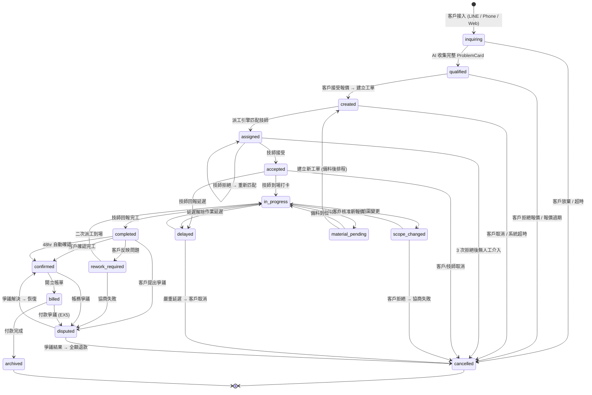
```mermaid
stateDiagram-v2
    [*] --> inquiring : 客戶接入 (LINE / Phone / Web)

    inquiring --> qualified : AI 收集完整 ProblemCard
    inquiring --> cancelled : 客戶放棄 / 超時

    qualified --> created : 客戶接受報價 → 建立工單
    qualified --> cancelled : 客戶拒絕報價 / 報價過期

    created --> assigned : 派工引擎匹配技師
    created --> cancelled : 客戶取消 / 系統超時

    assigned --> accepted : 技師接受
    assigned --> assigned : 技師拒絕 → 重新匹配
    assigned --> cancelled : 3 次拒絕後無人工介入

    accepted --> in_progress : 技師到場打卡
    accepted --> delayed : 技師回報延遲
    accepted --> cancelled : 客戶/技師取消

    in_progress --> completed : 技師回報完工
    in_progress --> scope_changed : 現場範圍變更
    in_progress --> material_pending : 缺料回報
    in_progress --> delayed : 作業延遲

    scope_changed --> in_progress : 客戶核准新報價
    scope_changed --> cancelled : 客戶拒絕 → 協商失敗

    material_pending --> in_progress : 備料到位
    material_pending --> created : 建立新工單 (備料後排程)

    delayed --> in_progress : 延遲解除
    delayed --> cancelled : 嚴重延遲 → 客戶取消

    completed --> confirmed : 客戶確認完工
    completed --> confirmed : 48hr 自動確認
    completed --> rework_required : 客戶反映問題
    completed --> disputed : 客戶提出爭議

    rework_required --> in_progress : 二次派工到場
    rework_required --> disputed : 協商失敗

    confirmed --> billed : 開立帳單
    confirmed --> disputed : 帳務爭議

    billed --> archived : 付款完成
    billed --> disputed : 付款爭議 (EX5)

    disputed --> confirmed : 爭議解決 → 恢復
    disputed --> cancelled : 爭議結果 → 全額退款

    cancelled --> [*]
    archived --> [*]
```

### 18.4 新增狀態轉換規則 (增量)

以下為新增的 3 個狀態相關的轉換規則，與原文件 §1.3 互補：

| 來源狀態 | 目標狀態 | 觸發條件 | 授權角色 | 是否需審批 |
|----------|----------|----------|----------|-----------|
| — | `inquiring` | 客戶透過任一管道接入 | System | 否 |
| `inquiring` | `qualified` | ProblemCard 完整 (brand + model + symptom) | AI_System | 否 |
| `inquiring` | `cancelled` | 客戶放棄 / 2 輪追問超時後 24hr 未回覆 | System | 否 |
| `qualified` | `created` | 客戶接受報價，工單正式建立 | Customer | 否 |
| `qualified` | `cancelled` | 客戶拒絕報價 / 報價 48hr 到期 | Customer, System | 否 |
| `confirmed` | `billed` | 系統開立帳單 (e-invoice) | System | 否 |
| `billed` | `archived` | 付款完成 (payment_status = paid) | System | 否 |
| `billed` | `disputed` | 付款失敗 3 次 / 金額爭議 | Customer, System | 否 |

---

## 19. Flow 11：客戶不在場

> **Gap ID**：OP-03 — 技師到場但客戶不在家的處理流程

### 19.1 觸發條件

- 技師到場 GPS 打卡後，無法聯繫到客戶 (門鈴無人應答、電話未接)
- 工單狀態從 `accepted` 準備轉為 `in_progress` 時觸發

### 19.2 參與角色

Technician, Customer, Admin, Finance

### 19.3 流程圖

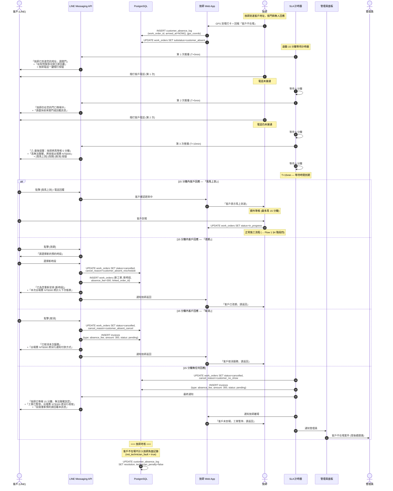
```mermaid
sequenceDiagram
    autonumber
    actor Customer as 客戶 (LINE)
    participant LINE as LINE Messaging API
    participant DB as PostgreSQL
    participant TechApp as 技師 Web App
    actor Technician as 技師
    participant SLA as SLA 計時器
    participant Admin as 管理員面板
    actor AdminUser as 管理員

    Note over Technician: 技師到達客戶地址，按門鈴無人回應

    Technician->>TechApp: GPS 到場打卡 + 回報「客戶不在場」
    TechApp->>DB: INSERT customer_absence_log<br/>(work_order_id, arrived_at=NOW(), gps_coords)
    TechApp->>DB: UPDATE work_orders SET substatus=customer_absent

    Note over SLA: 啟動 15 分鐘等待計時器

    SLA->>LINE: 第 1 次推播 (T+0min)
    LINE->>Customer: 「技師已到達您的地址，請開門」<br/>+「如有特殊情況請立即回覆」<br/>+ 技師電話一鍵撥打按鈕

    Technician->>Customer: 撥打客戶電話 (第 1 次)
    Note over Technician: 電話未接通

    SLA->>SLA: 等待 5 分鐘

    SLA->>LINE: 第 2 次推播 (T+5min)
    LINE->>Customer: 「技師仍在您的門口等候中」<br/>+「請盡快前來開門或回覆訊息」

    Technician->>Customer: 撥打客戶電話 (第 2 次)
    Note over Technician: 電話仍未接通

    SLA->>SLA: 等待 5 分鐘

    SLA->>LINE: 第 3 次推播 (T+10min)
    LINE->>Customer: 「⚠ 最後提醒：技師將再等候 5 分鐘」<br/>+「若無法聯繫，將收取出場費 NT$300」<br/>+ [我馬上到] [改期] [取消] 按鈕

    SLA->>SLA: 等待 5 分鐘

    Note over SLA: T+15min — 等待時間到期

    alt 15 分鐘內客戶回應 — 「我馬上到」
        Customer->>LINE: 點擊 [我馬上到] / 電話回覆
        LINE->>TechApp: 客戶確認趕來中
        TechApp->>Technician: 「客戶表示馬上到達」
        Note over Technician: 額外等候 (最多再 15 分鐘)

        Customer->>Technician: 客戶到場
        Technician->>TechApp: UPDATE work_orders SET status=in_progress
        Note over Technician: 正常施工流程 (→ Flow 1 §4 階段四)

    else 15 分鐘內客戶回應 — 「改期」
        Customer->>LINE: 點擊 [改期]
        LINE->>Customer: 「請選擇新的預約時段」
        Customer->>LINE: 選擇新時段
        LINE->>DB: UPDATE work_orders SET status=cancelled,<br/>cancel_reason=customer_absent_reschedule
        LINE->>DB: INSERT work_orders (新工單, 新時段,<br/>absence_fee=300, linked_order_id)
        LINE->>Customer: 「已為您重新安排 [新時段]」<br/>+「本次出場費 NT$300 將計入下次帳單」
        LINE->>TechApp: 通知技師返回
        TechApp->>Technician: 「客戶已改期，請返回」

    else 15 分鐘內客戶回應 — 「取消」
        Customer->>LINE: 點擊 [取消]
        LINE->>DB: UPDATE work_orders SET status=cancelled,<br/>cancel_reason=customer_absent_cancel
        LINE->>DB: INSERT invoices<br/>(type: absence_fee, amount: 300, status: pending)
        LINE->>Customer: 「已取消本次服務」<br/>+「出場費 NT$300 將另行通知付款方式」
        LINE->>TechApp: 通知技師返回
        TechApp->>Technician: 「客戶取消服務，請返回」

    else 15 分鐘無任何回應
        SLA->>DB: UPDATE work_orders SET status=cancelled,<br/>cancel_reason=customer_no_show
        SLA->>DB: INSERT invoices<br/>(type: absence_fee, amount: 300, status: pending)
        SLA->>LINE: 最終通知
        LINE->>Customer: 「技師已等候 15 分鐘，無法聯繫到您」<br/>+「工單已暫停，出場費 NT$300 將另行收取」<br/>+「如需重新預約請回覆本訊息」
        SLA->>TechApp: 通知技師離場
        TechApp->>Technician: 「客戶未到場，工單暫停，請返回」
        SLA->>Admin: 通知管理員
        Admin->>AdminUser: 客戶不在場案件 (需後續跟進)
    end

    Note over DB: === 技師考核 ===
    Note over DB: 客戶不在場不計入技師負面記錄<br/>(not_technician_fault = true)
    DB->>DB: UPDATE customer_absence_log<br/>SET resolution, technician_penalty=false
```

### 19.4 狀態轉換表

| 步驟 | 來源狀態 | 目標狀態 | 觸發動作 |
|------|----------|----------|----------|
| 1 | `accepted` | `accepted` (substatus: customer_absent) | 技師到場但客戶不在 |
| 2a | customer_absent | `in_progress` | 客戶在 15 分鐘內到場 |
| 2b | customer_absent | `cancelled` + `created` (新單) | 客戶選擇改期 |
| 2c | customer_absent | `cancelled` | 客戶取消 / 15 分鐘無回應 |

### 19.5 通知清單

| 時機 | 通知方式 | 接收者 | 內容摘要 |
|------|----------|--------|----------|
| T+0 min (到場) | LINE Push + 電話 | Customer | 技師到達通知 + 一鍵撥打 |
| T+5 min | LINE Push + 電話 | Customer | 第 2 次提醒 |
| T+10 min | LINE Flex + 電話 | Customer | 最後提醒 + 出場費告知 + 選項按鈕 |
| T+15 min (超時) | LINE Push | Customer | 工單暫停 + 出場費收取通知 |
| T+15 min (超時) | Web Alert | Admin | 客戶不在場案件需跟進 |
| 任意時刻客戶回覆 | Web Push | Technician | 客戶回應 (趕來/改期/取消) |

### 19.6 業務規則

| 編號 | 規則 | 說明 |
|------|------|------|
| BR-F11-001 | 等待時間上限 15 分鐘 | 含 3 次 LINE 推播 (5 分鐘間隔) |
| BR-F11-002 | 出場費 NT$300 | 不論取消或改期，均收取出場費 |
| BR-F11-003 | 技師不受負面記錄 | `technician_penalty = false`，客戶不在場非技師責任 |
| BR-F11-004 | 改期時出場費計入下次帳單 | 不另開帳單，隨下次工單合併收取 |
| BR-F11-005 | 客戶說「我馬上到」額外等候上限 15 分鐘 | 超過再次觸發本流程 |
| BR-F11-006 | 單一客戶 3 個月內 2 次不在場 | 標記為高風險客戶，後續工單要求預付訂金 |

---

## 20. Flow 12：金流與支付

> **Gap ID**：OP-01 — 原文件完全缺少付款階段，只有「帳務結清」一句帶過

### 20.1 觸發條件

- 工單狀態從 `confirmed` 轉為 `billed` (客戶確認完工後系統自動開帳)
- 人工補開帳單 (管理員手動觸發)

### 20.2 參與角色

Customer, Finance, Admin, Technician

### 20.3 支付方式矩陣

| 支付方式 | 金流服務商 | 手續費率 | 入帳時間 | 適用場景 |
|----------|-----------|---------|----------|----------|
| LINE Pay | LINE Pay API v3 | 2.75% | T+2 工作日 | LINE 內一鍵支付 (主推) |
| 信用卡 | 綠界 ECPay / 藍新 NewebPay | 2.5~3% | T+7 工作日 | 高單價工單 |
| 現金 | — | 0% | 即時 | 技師現場收款 (需回報) |

### 20.4 電子發票規格

| 項目 | 規格 | 說明 |
|------|------|------|
| 發票類型 | B2C 電子發票 | 財政部大平台 API |
| 載具 | 手機條碼 / 自然人憑證 / 會員載具 | 客戶 LINE 綁定時提供 |
| 格式 | 財政部 MIG 4.0 | JSON 格式上傳 |
| 發票時機 | 付款完成後 5 分鐘內 | 自動開立 |
| 保存期限 | 5 年 (依統一發票使用辦法) | — |

### 20.5 流程圖

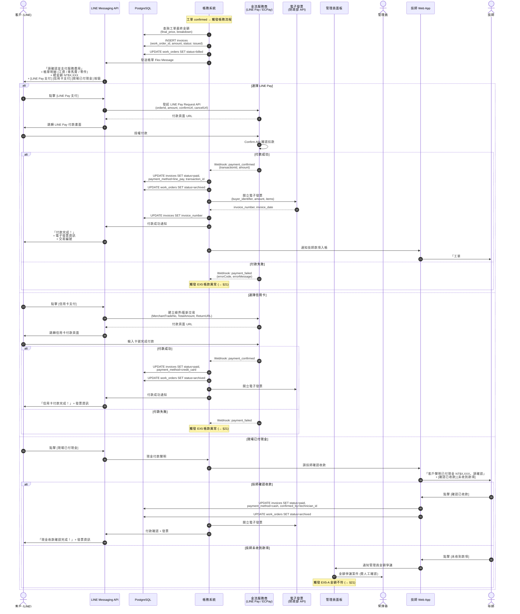
```mermaid
sequenceDiagram
    autonumber
    actor Customer as 客戶 (LINE)
    participant LINE as LINE Messaging API
    participant DB as PostgreSQL
    participant Billing as 帳務系統
    participant Payment as 金流服務商<br/>(LINE Pay / ECPay)
    participant Invoice as 電子發票<br/>(財政部 API)
    participant Admin as 管理員面板
    actor AdminUser as 管理員
    participant TechApp as 技師 Web App
    actor Technician as 技師

    Note over Billing: 工單 confirmed → 觸發帳務流程

    Billing->>DB: 查詢工單最終金額<br/>(final_price, breakdown)
    Billing->>DB: INSERT invoices<br/>(work_order_id, amount, status: issued)
    Billing->>DB: UPDATE work_orders SET status=billed

    Billing->>LINE: 發送帳單 Flex Message
    LINE->>Customer: 「請確認並支付服務費用」<br/>+ 帳單明細 (工資 / 車馬費 / 零件)<br/>+ 總金額 NT$X,XXX<br/>+ [LINE Pay 支付] [信用卡支付] [現場已付現金] 按鈕

    alt 選擇 LINE Pay
        Customer->>LINE: 點擊 [LINE Pay 支付]
        LINE->>Payment: 發起 LINE Pay Request API<br/>(orderId, amount, confirmUrl, cancelUrl)
        Payment-->>LINE: 付款頁面 URL
        LINE->>Customer: 跳轉 LINE Pay 付款畫面
        Customer->>Payment: 授權付款
        Payment->>Payment: Confirm API 確認扣款

        alt 付款成功
            Payment-->>Billing: Webhook: payment_confirmed<br/>(transactionId, amount)
            Billing->>DB: UPDATE invoices SET status=paid,<br/>payment_method=line_pay, transaction_id
            Billing->>DB: UPDATE work_orders SET status=archived

            Billing->>Invoice: 開立電子發票<br/>(buyer_identifier, amount, items)
            Invoice-->>Billing: invoice_number, invoice_date
            Billing->>DB: UPDATE invoices SET invoice_number

            Billing->>LINE: 付款成功通知
            LINE->>Customer: 「付款完成！」<br/>+ 電子發票資訊<br/>+ 交易編號

            Billing->>TechApp: 通知技師款項入帳
            TechApp->>Technician: 「工單 #xxx 客戶已付款」
        else 付款失敗
            Payment-->>Billing: Webhook: payment_failed<br/>(errorCode, errorMessage)
            Note over Billing: 觸發 EX5 帳款異常 (→ §21)
        end

    else 選擇信用卡
        Customer->>LINE: 點擊 [信用卡支付]
        LINE->>Payment: 建立綠界/藍新交易<br/>(MerchantTradeNo, TotalAmount, ReturnURL)
        Payment-->>LINE: 付款頁面 URL
        LINE->>Customer: 跳轉信用卡付款頁面
        Customer->>Payment: 輸入卡號完成付款

        alt 付款成功
            Payment-->>Billing: Webhook: payment_confirmed
            Billing->>DB: UPDATE invoices SET status=paid,<br/>payment_method=credit_card
            Billing->>DB: UPDATE work_orders SET status=archived
            Billing->>Invoice: 開立電子發票
            Billing->>LINE: 付款成功通知
            LINE->>Customer: 「信用卡付款完成！」+ 發票資訊
        else 付款失敗
            Payment-->>Billing: Webhook: payment_failed
            Note over Billing: 觸發 EX5 帳款異常 (→ §21)
        end

    else 現場已付現金
        Customer->>LINE: 點擊 [現場已付現金]
        LINE->>Billing: 現金付款聲明

        Billing->>TechApp: 請技師確認收款
        TechApp->>Technician: 「客戶聲明已付現金 NT$X,XXX，請確認」<br/>+ [確認已收款] [未收到款項]

        alt 技師確認收款
            Technician->>TechApp: 點擊 [確認已收款]
            TechApp->>DB: UPDATE invoices SET status=paid,<br/>payment_method=cash, confirmed_by=technician_id
            TechApp->>DB: UPDATE work_orders SET status=archived
            Billing->>Invoice: 開立電子發票
            Billing->>LINE: 付款確認 + 發票
            LINE->>Customer: 「現金收款確認完成！」+ 發票資訊
        else 技師未收到款項
            Technician->>TechApp: 點擊 [未收到款項]
            TechApp->>Admin: 通知管理員金額爭議
            Admin->>AdminUser: 金額爭議案件 (需人工確認)
            Note over Admin: 觸發 EX5-A 金額不符 (→ §21)
        end
    end
```

### 20.6 狀態轉換表

| 步驟 | 來源狀態 | 目標狀態 | 觸發動作 | 耗時預估 |
|------|----------|----------|----------|----------|
| 1 | `confirmed` | `billed` | 系統自動開立帳單 | < 1 秒 |
| 2a | `billed` | `archived` | LINE Pay / 信用卡 付款成功 | < 5 分鐘 |
| 2b | `billed` | `archived` | 現金付款 + 技師確認 | < 10 分鐘 |
| 2c | `billed` | `disputed` | 付款失敗 / 金額爭議 → EX5 | — |

### 20.7 通知清單

| 時機 | 通知方式 | 接收者 | 內容摘要 |
|------|----------|--------|----------|
| 帳單開立 | LINE Flex | Customer | 帳單明細 + 支付方式選擇 |
| 付款成功 | LINE Flex | Customer | 付款確認 + 電子發票 + 交易編號 |
| 付款成功 | Web Push | Technician | 款項入帳通知 |
| 付款失敗 | LINE Push | Customer | 付款失敗 + 重試選項 |
| 付款失敗 | Web Alert | Admin | 付款異常案件 |
| 帳單逾期 (7 天) | LINE Push | Customer | 付款提醒 |
| 現金確認請求 | Web Push | Technician | 確認現金收款 |

---

## 21. Flow 13：帳款異常 EX5

> **Gap ID**：OP-02 — 原文件缺少付款失敗、金額不符、發票錯誤的處理流程

### 21.1 觸發條件

- EX5-A：客戶/技師回報金額與帳單不符
- EX5-B：線上付款失敗 (卡號錯誤、餘額不足、交易逾時)
- EX5-C：電子發票開立錯誤 (品項、金額、載具錯誤)

### 21.2 參與角色

Customer, Finance, Admin, Technician

### 21.3 流程圖

```mermaid
sequenceDiagram
    autonumber
    actor Customer as 客戶 (LINE)
    participant LINE as LINE Messaging API
    participant DB as PostgreSQL
    participant Billing as 帳務系統
    participant Payment as 金流服務商
    participant Invoice as 電子發票<br/>(財政部 API)
    participant Admin as 管理員面板
    actor AdminUser as 管理員
    actor FinUser as 財務人員

    Note over Billing: === EX5-A：金額不符 ===

    alt EX5-A 金額不符
        Customer->>LINE: 「帳單金額跟技師說的不一樣」
        LINE->>Billing: 金額爭議通知

        Billing->>DB: SELECT final_price, breakdown<br/>FROM work_orders WHERE id = ?
        Billing->>Billing: 計算差額<br/>|客戶聲稱金額 - 帳單金額|

        alt 差額 < NT$100 (自動修正)
            Billing->>DB: UPDATE invoices SET amount = corrected_amount,<br/>correction_reason, auto_corrected=true
            Billing->>Invoice: 作廢原發票 + 重新開立
            Invoice-->>Billing: 新發票號碼
            Billing->>LINE: 通知客戶已修正
            LINE->>Customer: 「帳單金額已修正為 NT$X,XXX」<br/>+ 新發票資訊

        else 差額 >= NT$100 (人工審核)
            Billing->>Admin: 建立金額爭議案件
            Admin->>AdminUser: 顯示爭議明細<br/>(帳單金額 vs 客戶聲稱 vs 技師回報)

            AdminUser->>DB: 調閱完工報告 + 報價記錄
            AdminUser->>AdminUser: 核對實際工項與收費

            alt 帳單金額正確
                AdminUser->>LINE: 說明帳單計算依據
                LINE->>Customer: 費用明細說明 + 計算邏輯
            else 帳單金額有誤
                AdminUser->>Billing: 修正帳單金額
                Billing->>DB: UPDATE invoices SET amount = corrected
                Billing->>Invoice: 作廢原發票 + 重新開立
                Billing->>LINE: 通知客戶已修正
                LINE->>Customer: 「帳單已修正，造成不便敬請見諒」
            end
        end
    end

    Note over Billing: === EX5-B：付款失敗 ===

    alt EX5-B 付款失敗
        Payment-->>Billing: Webhook: payment_failed<br/>(errorCode, errorMessage)
        Billing->>DB: INSERT payment_attempts<br/>(invoice_id, attempt=1, status=failed, error)
        Billing->>DB: UPDATE invoices SET payment_status=retry_pending

        Billing->>LINE: 付款失敗通知
        LINE->>Customer: 「付款未成功，請確認卡片資訊」<br/>+ 錯誤原因 (餘額不足/卡號錯誤/逾時)<br/>+ [重新支付] 按鈕

        loop 重試最多 3 次 (間隔 24hr)
            Customer->>LINE: 點擊 [重新支付]
            LINE->>Payment: 重新發起付款
            Payment-->>Billing: payment_result

            alt 第 N 次重試成功
                Billing->>DB: UPDATE invoices SET status=paid
                Billing->>DB: UPDATE work_orders SET status=archived
                Billing->>LINE: 付款成功
                LINE->>Customer: 「付款完成！」
            else 第 N 次重試仍失敗
                Billing->>DB: UPDATE payment_attempts<br/>(attempt=N, status=failed)
            end
        end

        Note over Billing: 3 次付款失敗後

        Billing->>DB: UPDATE invoices SET payment_status=manual_collection
        Billing->>Admin: 轉人工催款
        Admin->>FinUser: 建立催款案件<br/>(客戶聯絡資訊 + 帳單 + 失敗記錄)
        FinUser->>Customer: 電話聯繫付款事宜
    end

    Note over Invoice: === EX5-C：發票錯誤 ===

    alt EX5-C 發票錯誤
        Customer->>LINE: 「發票資訊有誤，需要修改」
        LINE->>Billing: 發票更正請求

        Billing->>DB: 查詢原發票資訊
        Billing->>Invoice: 作廢原發票<br/>(void API, reason: correction)
        Invoice-->>Billing: void_result (success/fail)

        alt 作廢成功
            Billing->>Invoice: 重新開立正確發票<br/>(corrected items, carrier, amount)
            Invoice-->>Billing: new_invoice_number
            Billing->>DB: UPDATE invoices SET<br/>invoice_number=new, correction_count+=1
            Billing->>LINE: 通知客戶新發票
            LINE->>Customer: 「發票已更正」<br/>+ 新發票號碼 + 明細
        else 作廢失敗 (已逾作廢期限)
            Billing->>Admin: 通知財務人員手動處理
            Admin->>FinUser: 需開立折讓單
            FinUser->>Invoice: 開立折讓 + 重新開立
            FinUser->>LINE: 通知客戶處理結果
            LINE->>Customer: 「發票已透過折讓方式更正」
        end

        Note over Billing: SLA：發票更正 2 小時內完成
    end
```

### 21.4 狀態轉換表

| 步驟 | 異常類型 | 來源狀態 | 目標狀態 | 觸發動作 |
|------|----------|----------|----------|----------|
| 1a | EX5-A | `billed` | `billed` (修正) | 差額 < $100 自動修正 |
| 1b | EX5-A | `billed` | `disputed` | 差額 >= $100 人工審核 |
| 2a | EX5-B | `billed` | `billed` (retry) | 付款失敗 → 重試 |
| 2b | EX5-B | `billed` | `billed` (manual) | 3 次失敗 → 人工催款 |
| 3 | EX5-C | `billed` / `archived` | 不變 | 發票作廢 + 重開 |

### 21.5 通知清單

| 時機 | 通知方式 | 接收者 | 內容摘要 |
|------|----------|--------|----------|
| 金額不符 (自動修正) | LINE Push | Customer | 帳單已修正 + 新發票 |
| 金額不符 (人工審核) | Web Alert | Admin | 金額爭議案件 |
| 付款失敗 | LINE Flex | Customer | 失敗原因 + 重新支付按鈕 |
| 3 次失敗 | Web Alert | Finance | 轉人工催款 |
| 發票更正完成 | LINE Push | Customer | 新發票號碼 + 明細 |
| 發票更正超時 | Web Alert | Finance | 超過 2hr SLA |

### 21.6 業務規則

| 編號 | 規則 | 閾值 | 動作 |
|------|------|------|------|
| BR-EX5-001 | 金額不符自動修正閾值 | 差額 < NT$100 | 系統自動修正 + 重開發票 |
| BR-EX5-002 | 金額不符人工審核閾值 | 差額 >= NT$100 | 建立爭議案件 → 人工核對 |
| BR-EX5-003 | 付款重試次數上限 | 3 次 | 超過轉人工催款 |
| BR-EX5-004 | 付款重試間隔 | 24 小時 | 每 24hr 發送一次付款提醒 |
| BR-EX5-005 | 發票更正 SLA | 2 小時 | 超時升級至財務主管 |
| BR-EX5-006 | 單一工單發票修正次數上限 | 3 次 | 超過需財務主管審核 |

---

## 22. 異常返回節點機制

> **Gap ID**：OP-07 — 異常處理後必須指定返回哪個階段，不可跳過

### 22.1 設計原則

1. **每個異常都必須有明確的 return_to_stage**：異常解決後不允許「懸空」，必須指定回到 S1~S6 哪個階段繼續。
2. **不可跳過階段**：從 S2 異常返回後只能回到 S2 或更早，不可跳到 S4。
3. **異常解決類型分類**：每次異常結案必須記錄 `resolution_type`。

### 22.2 異常返回節點對照表

| 異常流程 | 異常識別碼 | 可返回階段 | 預設返回節點 | 說明 |
|----------|-----------|-----------|-------------|------|
| Flow 2 拒單重派 | EX-REJECT | S3 (派工) | `assigned` | 重派成功後繼續派工流程 |
| Flow 3 範圍變更 | EX-SCOPE | S4 (施工) | `in_progress` | 客戶核准後繼續施工 |
| Flow 4 缺料 | EX-MATERIAL | S3 (派工) 或 S4 (施工) | `created` (新單) 或 `in_progress` | 備料到位後建新單或繼續 |
| Flow 5 延遲 | EX-DELAY | S3 (到場) 或 S1 (改期) | `in_progress` 或 `created` | 延遲解除或改期 |
| Flow 6 退款 | EX-REFUND | S6 (結帳) 或 終態 | `archived` 或 `cancelled` | 退款完成或全額退 |
| Flow 7 保固爭議 | EX-WARRANTY | S4 (施工) | `in_progress` | 確認保固後繼續施工 |
| Flow 8 品質不合格 | EX-REWORK | S3 (重新派工) | `assigned` (二次派工) | S 級技師重新到場 |
| Flow 9 客訴 | EX-COMPLAINT | 依客訴結果而定 | `confirmed` 或 `cancelled` | 結案後恢復或全退 |
| Flow 10 外觀變更 | EX-APPEARANCE | S4 (施工) | `in_progress` | 同意後繼續 |
| Flow 11 客戶不在場 | EX-ABSENT | S3 (改期) 或 S4 (到場) | `created` (新單) 或 `in_progress` | 改期或客戶到場 |
| Flow 13 帳款異常 | EX-BILLING | S6 (結帳) | `billed` | 修正後繼續收款 |

### 22.3 resolution_type 分類

| 類型 | 識別碼 | 說明 | 範例 |
|------|--------|------|------|
| 系統自動解決 | `AUTO` | 系統規則自動處理，無需人工介入 | 自動重派、自動修正小額差異 |
| 人工介入解決 | `HUMAN` | 管理員或客服介入處理 | 人工派工、人工議價、催款 |
| 取消結案 | `CANCELLED` | 異常無法解決，工單取消 | 客戶放棄、3 次重派失敗無人工接手 |
| 升級結案 | `ESCALATED` | 異常升級至更高層級處理 | 爭議升級至營運總監 |

### 22.4 異常記錄資料結構

```
exception_records:
  - exception_id: UUID
  - work_order_id: FK → work_orders
  - exception_type: ENUM (EX-REJECT, EX-SCOPE, ...)
  - triggered_at: TIMESTAMP
  - triggered_at_stage: ENUM (S1~S6)
  - resolved_at: TIMESTAMP | NULL
  - resolution_type: ENUM (AUTO, HUMAN, CANCELLED, ESCALATED)
  - return_to_stage: ENUM (S1~S6) | NULL
  - return_to_status: ENUM (工單狀態) | NULL
  - resolved_by: FK → users | NULL
  - notes: TEXT
```

### 22.5 業務規則

| 編號 | 規則 | 說明 |
|------|------|------|
| BR-EX-001 | 異常結案必填 return_to_stage | 資料庫 NOT NULL 約束 (除 `CANCELLED` 外) |
| BR-EX-002 | return_to_stage 不可晚於 triggered_at_stage | 例如 S2 異常不可返回 S4 |
| BR-EX-003 | 同一工單同類異常累計 >= 3 次 | 強制升級至人工處理 |
| BR-EX-004 | 異常未結案超過 SLA | 自動升級 (依 §14 升級矩陣) |

---

## 23. 補充業務規則

> **Gap ID**：OP-08 ~ OP-18 — 各階段細項補充

### 23.1 OP-08：EX1 需求不明流程

**觸發條件**：AI 意圖分類 confidence < 0.6 且 2 輪追問仍無法收斂。

| 步驟 | 動作 | SLA |
|------|------|-----|
| 1 | AI 追問第 1 輪 (開放式問題) | 120 秒 |
| 2 | AI 追問第 2 輪 (選項式問題) | 120 秒 |
| 3 | 2 輪失敗 → 自動轉人工客服 | 轉接 < 30 秒 |
| 4 | 人工客服接手 + 附帶完整對話歷史 | 首次回應 < 2 分鐘 |
| 5 | 人工客服完成 ProblemCard → 進入 S2 | < 10 分鐘 |

**OCAP 連動**：若同一症狀描述 7 天內觸發 EX1 > 20 次，通知 AI 團隊更新意圖分類模型。

### 23.2 OP-09：EX2 擴大搜尋半徑與替代時段

**觸發條件**：預設 30km 半徑內無可用技師 (或所有技師已拒單)。

| 擴圈策略 | 半徑 | 車馬費調整 | 觸發時機 |
|----------|------|-----------|----------|
| 第 1 圈 (預設) | 30 km | 標準計算 | 工單建立時 |
| 第 2 圈 (擴大) | 50 km | +$200 遠距加價 | 第 1 圈無匹配 / 3 次拒單 |
| 第 3 圈 (跨區) | 80 km | +$500 跨區加價 | 第 2 圈無匹配 (需管理員核准) |

**替代時段建議**：

| 條件 | 建議 |
|------|------|
| 當日所有技師已排滿 | 推薦隔日最早可用時段 (LINE Flex) |
| 客戶選擇特定時段無人 | 顯示前後 ±2 小時可用技師 |
| 偏遠地區 (第 3 圈) | 建議週六集中服務日 |

### 23.3 OP-10：AI 施工檢核表 (S4-F03)

技師到場後，系統依 ProblemCard 自動生成施工檢核表：

| 檢核項目類型 | 來源 | 範例 |
|-------------|------|------|
| 施工前確認 | ProblemCard.symptoms | 「確認門鎖型號為 dormakaba M5」 |
| 必帶工具 | RAG 知識庫 (brand × model) | 「十字螺絲刀 PH2、內六角 4mm」 |
| 安全檢查 | SOP-SAFETY-001 | 「確認電源已斷開」 |
| 施工步驟 | SOP-{brand}-{model} | 依品牌/型號動態生成 |
| 必拍照片 | 全域規則 | 「施工前全貌 / 施工中 / 施工後 / 功能測試」 |
| 客戶告知義務 | BR-003, BR-013 | 外觀變更提醒 (若適用) |

**技術實作**：
```
POST /api/v1/work-orders/{id}/checklist
Response: {
  checklist_id: UUID,
  items: [
    { seq: 1, category: "pre_check", text: "...", required: true, status: "pending" },
    ...
  ],
  generated_from: { problem_card_id, sop_ids: [...] }
}
```

### 23.4 OP-11：鎖種不符 AI 替代推薦 (EX3-A)

**觸發條件**：技師到場發現實際鎖種與 ProblemCard 記錄不符。

| 步驟 | 動作 |
|------|------|
| 1 | 技師拍照上傳實際鎖種 |
| 2 | AI 圖片辨識 → 識別品牌/型號 |
| 3 | RAG 查詢替代方案 (compatible_models) |
| 4 | 推薦 Top 3 替代方案 (含價差) |
| 5a | 技師有替代零件 → 範圍變更流程 (Flow 3) |
| 5b | 技師無替代零件 → 缺料流程 (Flow 4) |

**AI 替代推薦 API**：
```
POST /api/v1/recommendations/alternative-locks
Request:  { actual_brand, actual_model, photo_url }
Response: { alternatives: [{ brand, model, compatibility_score, price_diff }] }
```

### 23.5 OP-12：正式簽收流程 (S5-F02)

**觸發條件**：技師提交完工報告後。

| 簽收項目 | 必填 | 說明 |
|----------|------|------|
| 服務項目清單 | 是 | 逐項列出已完成的工項 |
| 使用零件明細 | 是 | 品名 × 數量 × 單價 |
| 最終金額確認 | 是 | 客戶確認金額 (電子簽名或 LINE 點擊確認) |
| 功能測試結果 | 是 | 指紋/密碼/藍牙/卡片 各項 Pass/Fail |
| 客戶滿意度 | 是 | 1-5 星評分 |
| 客戶備註 | 否 | 開放式文字 |

**LINE Flex Message 結構**：
```
[完工簽收單]
工單編號：WO-2026-XXXX
────────────────
服務項目：
  1. 馬達模組更換    × 1  $2,400
  2. 車馬費              $300
────────────────
合計：NT$ 2,700
────────────────
功能測試：全部 PASS ✓
────────────────
[確認簽收] [有問題要反映]
```

### 23.6 OP-13：低評分自動觸發客訴

| 評分 | 動作 |
|------|------|
| 5 星 | 正常結案 |
| 4 星 | 正常結案 + 記錄改善提示 |
| 3 星 | 標記觀察 + 24hr 內 LINE 追問不滿原因 |
| 1-2 星 | 自動建立客訴案件 (→ Flow 9) + 管理員 2hr 內回電 |

**自動客訴規則**：
```
IF rating <= 2:
  INSERT complaints (
    work_order_id,
    source = 'auto_low_rating',
    priority = 'high',
    sla_first_response = NOW() + 2hr
  )
  NOTIFY admin (Web Alert + Email)
  NOTIFY customer (LINE Push: 「我們注意到您的服務體驗不夠理想，客服將主動聯繫您」)
```

### 23.7 OP-14：人工審核台 UI 規格

| UI 區塊 | 內容 | 互動 |
|---------|------|------|
| 待審佇列 | 所有待人工處理的案件 (按 SLA 剩餘時間排序) | 點擊進入詳情 |
| SLA 倒數計時器 | 每張案件顯示剩餘時間 (綠/黃/紅燈號) | 黃燈 < 50% SLA、紅燈 < 20% SLA |
| 案件詳情面板 | 工單資訊 + 對話歷史 + ProblemCard + 照片 | 可直接回覆客戶 |
| 快速動作列 | [核准] [駁回] [轉派] [升級] [備註] | 一鍵操作 |
| 統計儀表板 | 今日待處理/已處理/平均處理時間/SLA 達成率 | 即時更新 |

**SLA 燈號邏輯**：

| 燈號 | 條件 | 顏色 |
|------|------|------|
| 綠燈 | SLA 剩餘 > 50% | `#22C55E` |
| 黃燈 | SLA 剩餘 20%~50% | `#EAB308` |
| 紅燈 | SLA 剩餘 < 20% | `#EF4444` |
| 黑燈 | SLA 已違反 | `#1F2937` (閃爍) |

### 23.8 OP-15/16/17：異常熔斷規則

三條熔斷規則保護系統不因連鎖異常崩潰：

**熔斷規則 1：同一技師連續異常熔斷**

| 條件 | 動作 |
|------|------|
| 同一技師 24hr 內觸發 >= 3 次異常 (任何類型) | 自動暫停該技師派工 |
| 暫停期間 | 24 小時 (自動恢復) |
| 通知 | Web Alert → Admin + Email → 技師 |
| 恢復條件 | 24hr 後自動恢復，或管理員手動恢復 |

**熔斷規則 2：同一工單異常堆疊熔斷**

| 條件 | 動作 |
|------|------|
| 同一工單累計 >= 5 個未結異常 | 強制凍結工單 + 升級至營運主管 |
| 凍結後 | 所有自動流程停止，僅允許人工操作 |
| 通知 | Web Alert → Admin + Ops Manager |
| 恢復條件 | 營運主管手動解凍 + 填寫處置方案 |

**熔斷規則 3：系統級異常頻率熔斷**

| 條件 | 動作 |
|------|------|
| 全系統 1hr 內異常總量 > 50 件 | 觸發系統級警報 |
| 動作 | 暫停自動派工 + 切換人工派工模式 |
| 通知 | Email + SMS → CTO + Ops Director |
| 恢復條件 | CTO 手動確認恢復自動派工 |

### 23.9 OP-18：Exception API 端點

| Method | Endpoint | 說明 | 授權 |
|--------|----------|------|------|
| `POST` | `/api/v1/exceptions` | 建立異常記錄 | System, Admin |
| `GET` | `/api/v1/exceptions?work_order_id={id}` | 查詢工單所有異常 | Admin, Technician (自身) |
| `GET` | `/api/v1/exceptions/{id}` | 查詢單一異常詳情 | Admin |
| `PATCH` | `/api/v1/exceptions/{id}/resolve` | 結案異常 (含 return_to_stage) | Admin, System |
| `GET` | `/api/v1/exceptions/stats` | 異常統計 (by type, time range) | Admin |
| `POST` | `/api/v1/exceptions/{id}/escalate` | 手動升級異常 | Admin |

**建立異常 Request Body**：
```json
{
  "work_order_id": "uuid",
  "exception_type": "EX-ABSENT",
  "triggered_at_stage": "S3",
  "severity": "medium",
  "description": "客戶到場後無人應門",
  "metadata": {
    "gps_coords": { "lat": 25.033, "lng": 121.565 },
    "attempts": 3
  }
}
```

**結案異常 Request Body**：
```json
{
  "resolution_type": "AUTO",
  "return_to_stage": "S3",
  "return_to_status": "created",
  "resolved_by": "system",
  "notes": "客戶改期，建立新工單 WO-2026-YYYY"
}
```

---

## 24. OKR 追蹤機制

> **Gap ID**：OP-19 ~ OP-21 — 缺少量化指標追蹤、AI 週報自動化、客訴回饋閉環

### 24.1 五大 OKR 定義

| # | Objective | Key Result | 目標值 | 計算方式 | 追蹤頻率 |
|---|-----------|-----------|--------|----------|----------|
| OKR-1 | 提升派工效率 | KR1-1：首次匹配成功率 | >= 85% | `COUNT(first_match_accepted) / COUNT(dispatches)` | 每日 |
| | | KR1-2：平均派工耗時 | < 3 分鐘 | `AVG(assigned_at - created_at)` | 每日 |
| | | KR1-3：技師 15 分鐘回應率 | >= 90% | `COUNT(response_within_15min) / COUNT(assigned)` | 每日 |
| OKR-2 | 提升客戶滿意度 | KR2-1：平均評分 | >= 4.5 星 | `AVG(rating)` | 每週 |
| | | KR2-2：客訴率 | < 3% | `COUNT(complaints) / COUNT(completed_orders)` | 每週 |
| | | KR2-3：NPS (淨推薦值) | >= 50 | 每月問卷調查 | 每月 |
| OKR-3 | 降低異常率 | KR3-1：異常工單佔比 | < 15% | `COUNT(orders_with_exceptions) / COUNT(all_orders)` | 每週 |
| | | KR3-2：異常平均解決時間 | < 2 小時 | `AVG(resolved_at - triggered_at)` | 每週 |
| | | KR3-3：熔斷觸發次數 | < 5 次/月 | `COUNT(circuit_breaker_triggered)` | 每月 |
| OKR-4 | 提升 AI 診斷能力 | KR4-1：AI 診斷正確率 | >= 75% | `AVG(ai_prediction_hit)` | 每週 |
| | | KR4-2：AI 轉人率 | < 20% | `COUNT(human_handoff) / COUNT(intakes)` | 每週 |
| | | KR4-3：AI 意圖分類準確率 | >= 85% | `COUNT(correct_intent) / COUNT(classified)` | 每週 |
| OKR-5 | 帳務健康 | KR5-1：付款成功率 | >= 95% | `COUNT(paid) / COUNT(billed)` | 每週 |
| | | KR5-2：平均收款天數 | < 3 天 | `AVG(paid_at - billed_at)` | 每月 |
| | | KR5-3：帳款異常率 | < 2% | `COUNT(billing_exceptions) / COUNT(invoices)` | 每月 |

### 24.2 AI 週報自動化 (OP-19：S7-F03)

**執行時間**：每週一 08:00 自動生成 + 發送

**週報內容結構**：

| 區塊 | 內容 | 資料來源 |
|------|------|----------|
| 1. 摘要指標 | 5 大 OKR 當週數值 + 較上週變化 (↑/↓/→) | `work_orders`, `invoices`, `exceptions`, `intake_events` |
| 2. 派工效率 | 匹配成功率、平均耗時、拒單率分佈 | `dispatch_logs` |
| 3. AI 診斷品質 | 正確率、轉人率、TOP 5 未覆蓋症狀 | `service_reports`, `intake_events` |
| 4. 異常分析 | 異常類型分佈圖、TOP 3 異常根因 | `exception_records` |
| 5. 客戶聲音 | 低評分 TOP 5 案例 + 客訴關鍵詞雲 | `complaints`, `ratings` |
| 6. 技師表現 | TOP 10 / BOTTOM 10 技師排名 | `technicians` |
| 7. 建議行動 | AI 生成的改善建議 (3~5 條) | LLM 分析 |

**技術實作**：
```
POST /api/v1/reports/weekly (Cron Job: 0 8 * * 1)
Response: {
  report_id: UUID,
  generated_at: TIMESTAMP,
  period: { start: "2026-03-24", end: "2026-03-30" },
  sections: [ ... ],
  recipients: ["admin@company.com", "ops@company.com"],
  delivery_status: "sent"
}
```

**發送管道**：
| 接收者 | 管道 | 格式 |
|--------|------|------|
| 營運主管 | Email | PDF + HTML |
| 管理員 | Admin Panel | 互動式儀表板 |
| CEO (月報) | Email | 精簡版 PDF (僅摘要指標) |

### 24.3 客訴回饋定價模型 (OP-20：S7-F04)

**回饋閉環**：客訴分析結果自動回饋至定價模型，形成持續優化循環。

```mermaid
sequenceDiagram
    autonumber
    participant Complaints as 客訴資料庫
    participant Batch as 月批次分析
    participant AI as AI 分析引擎
    participant Pricing as 定價模型
    participant Admin as 管理員面板
    actor AdminUser as 營運主管

    Note over Batch: 每月 1 日 02:00 執行

    Batch->>Complaints: 查詢上月所有客訴<br/>(type=pricing, status=closed)
    Batch->>AI: 分析客訴中的定價問題模式

    AI->>AI: 識別定價痛點<br/>- 哪些品牌/型號客訴最多？<br/>- 哪些工項最常被質疑？<br/>- 客戶期望價格 vs 實際報價差距？

    AI->>AI: 生成調價建議<br/>(brand, model, suggested_adjustment_pct)

    AI->>Admin: 推送調價建議報告
    Admin->>AdminUser: 顯示調價建議<br/>+ 佐證數據 + 影響分析

    alt 營運主管核准調價
        AdminUser->>Admin: 核准 (可微調比例)
        Admin->>Pricing: 更新 RAG 定價資料庫<br/>(effective_date = next_month_1st)
        Admin->>DB: INSERT pricing_adjustments<br/>(brand, model, old_price, new_price, reason)
    else 營運主管駁回
        AdminUser->>Admin: 駁回 + 說明原因
        Admin->>DB: INSERT pricing_adjustments<br/>(status=rejected, reason)
    end
```

**調價安全規則**：

| 規則 | 說明 |
|------|------|
| 單次調幅上限 ±15% | 超過需 CEO 核准 |
| 不可低於成本 | price_min >= cost × 1.1 (保底 10% 毛利) |
| 新價生效日 = 次月 1 日 | 不可追溯調整已開立的報價 |
| 調價記錄永久保存 | 供審計追溯 |

### 24.4 OKR 追蹤儀表板需求

| 儀表板視圖 | 預設時間範圍 | 關鍵元件 |
|-----------|-------------|---------|
| 營運總覽 | 今日 | 5 大 OKR 卡片 (當前值 + 目標值 + 達成率) |
| 派工效率 | 本週 | 匹配成功率趨勢圖、拒單熱力圖 (by 區域) |
| AI 表現 | 本月 | 診斷正確率趨勢、轉人率趨勢、未覆蓋症狀表 |
| 異常監控 | 本週 | 異常類型 Pie Chart、解決時間分佈、熔斷記錄 |
| 帳務健康 | 本月 | 收款漏斗圖、應收帳款老化表、異常發票列表 |
| 技師排行榜 | 本月 | 評分/接單率/完成率 綜合排名 |

**技術實作**：
- 前端框架：Next.js Dashboard (Tremor UI components)
- 即時數據：WebSocket / SSE 推送 (SLA 倒數、新異常警報)
- 歷史數據：REST API `GET /api/v1/dashboard/{view}?period={range}`
- 快取策略：Redis TTL 60 秒 (營運總覽)、300 秒 (趨勢圖)

---

## 附錄 D：補充業務規則彙總

| 編號 | 規則 | 適用章節 |
|------|------|----------|
| BR-S1-001 | AI 信心度 < 0.6 → 轉人工 | §16 |
| BR-S1-002 | 追問上限 2 輪、每輪 120 秒 | §16 |
| BR-S1-006 | Red_Code 跳過 S1 直接派工 | §16 |
| BR-S2-001 | 報價有效期 48 小時 | §17 |
| BR-S2-002 | 報價呈現為區間 (非單一價) | §17 |
| BR-S2-003 | 保固案件嚴禁自動報價 | §17 |
| BR-F11-001 | 客戶不在場等候 15 分鐘 | §19 |
| BR-F11-002 | 出場費 NT$300 | §19 |
| BR-F11-003 | 不計入技師負面記錄 | §19 |
| BR-F11-006 | 3 月內 2 次不在場 → 高風險 | §19 |
| BR-EX5-001 | 金額差異 < $100 自動修正 | §21 |
| BR-EX5-003 | 付款重試上限 3 次 | §21 |
| BR-EX5-005 | 發票更正 SLA 2 小時 | §21 |
| BR-EX-001 | 異常結案必填 return_to_stage | §22 |
| BR-EX-002 | 返回階段不可晚於觸發階段 | §22 |

## 附錄 E：補充資料模型擴展建議

| 表格名稱 | 用途 | 關聯章節 |
|----------|------|----------|
| `intake_events` | 客戶接入記錄 (三管道統一) | §16 |
| `quotes` | 報價記錄 (含區間、議價歷史) | §17 |
| `payment_attempts` | 付款嘗試記錄 | §20, §21 |
| `customer_absence_logs` | 客戶不在場記錄 | §19 |
| `exception_records` | 統一異常記錄 (含 return_to_stage) | §22 |
| `pricing_adjustments` | 定價調整歷史 (客訴回饋) | §24 |
| `weekly_reports` | AI 週報存檔 | §24 |
| `checklist_instances` | 施工檢核表實例 | §23.3 |

## 附錄 F：API 端點索引 (Supplement)

| Method | Endpoint | 說明 | 關聯章節 |
|--------|----------|------|----------|
| `POST` | `/api/v1/intake` | 統一接入 (Web 管道) | §16 |
| `POST` | `/api/v1/quotes` | 建立報價 | §17 |
| `PATCH` | `/api/v1/quotes/{id}/accept` | 客戶接受報價 | §17 |
| `PATCH` | `/api/v1/quotes/{id}/negotiate` | 議價 | §17 |
| `POST` | `/api/v1/payments` | 發起付款 | §20 |
| `POST` | `/api/v1/payments/{id}/retry` | 重試付款 | §21 |
| `POST` | `/api/v1/invoices/{id}/void` | 作廢發票 | §21 |
| `POST` | `/api/v1/invoices/{id}/reissue` | 重開發票 | §21 |
| `POST` | `/api/v1/work-orders/{id}/checklist` | 生成施工檢核表 | §23.3 |
| `POST` | `/api/v1/recommendations/alternative-locks` | 替代鎖種推薦 | §23.4 |
| `POST` | `/api/v1/exceptions` | 建立異常記錄 | §23.9 |
| `PATCH` | `/api/v1/exceptions/{id}/resolve` | 結案異常 | §23.9 |
| `POST` | `/api/v1/reports/weekly` | 生成週報 | §24.2 |
| `GET` | `/api/v1/dashboard/{view}` | 儀表板數據 | §24.4 |

---

> **文件結束** — 本補充文件涵蓋 OP-01 至 OP-21 共 21 項缺口修補，新增 §16-§24 共 9 個章節、3 個新工單狀態、3 個新業務流程 (Flow 11-13)、異常返回機制、熔斷規則、以及完整的 OKR 追蹤體系。合併至主文件後，工單全生命週期從 S1 (詢問接入) 到 S7 (歸檔與知識沉澱) 形成完整閉環。

---

## 附錄 A：關鍵業務規則彙總

| 編號 | 規則 | 適用流程 |
|------|------|----------|
| BR-001 | 涉及建案/保固案件，AI 嚴禁自動報價 | Flow 7 |
| BR-002 | 保固起算日 = 建商點交日，非住戶入住日 | Flow 7 |
| BR-003 | 門外觀變更必須施工前取得客戶書面同意 | Flow 10 |
| BR-004 | 7 天內同症狀復發 → 自動觸發二次客訴 | Flow 8 |
| BR-005 | 二次派工強制 S 級技師 + 免費服務 | Flow 8 |
| BR-006 | 退款 > $100K 需營運 + 財務雙簽 | Flow 6 |
| BR-007 | 因技師延遲/缺料導致取消 → 不收取任何費用 | Flow 4, 5 |
| BR-008 | 技師逾時 15 分鐘未回應 → 自動重派 | Flow 2 |
| BR-009 | 完工後 48 小時未確認 → 系統自動確認 | Flow 1 |
| BR-010 | 範圍變更報價 > 2 倍原價 → 技術主管審核 | Flow 3 |
| BR-011 | anger_level >= 4 → 跳過 AI 直接轉人工 | Flow 9 |
| BR-012 | 月拒單率 > 50% → 暫停派工 7 天 | Flow 2 |
| BR-013 | 因客戶拒絕外觀變更而取消 → 收車馬費、免工資 | Flow 10 |
| BR-014 | 客訴結案後 30 天內再投訴 → 自動升級至主管 | Flow 9 |

## 附錄 B：通知管道對照

| 管道 | 技術實作 | 適用對象 | 回應能力 |
|------|----------|----------|----------|
| LINE Push Message | LINE Messaging API | Customer | 可互動 (Flex Message) |
| LINE Flex Message | LINE Messaging API | Customer | 含按鈕、表單 |
| Web Push Notification | Browser Push API | Technician, Admin | 點擊跳轉 |
| Web Alert (面板內) | WebSocket / SSE | Admin, Finance | 即時顯示 |
| Email | SMTP / SendGrid | 高層 (CEO) | 異步通知 |
| 電話 | 手動 | Customer (高優先) | 即時溝通 |

## 附錄 C：資料模型擴展建議

基於本文件定義的流程，建議在 `SQL/Schema.sql` 中新增以下表格：

| 表格名稱 | 用途 | 關聯流程 |
|----------|------|----------|
| `dispatch_logs` | 派工嘗試記錄 (含拒絕原因) | Flow 2 |
| `scope_change_requests` | 範圍變更申請 | Flow 3 |
| `material_requests` | 缺料報告 | Flow 4 |
| `delay_notifications` | 延遲通知記錄 | Flow 5 |
| `refund_requests` | 退款申請 (含審批鏈) | Flow 6 |
| `complaints` | 客訴記錄 | Flow 9 |
| `appearance_change_notices` | 門外觀變更告知書 | Flow 10 |
| `technician_penalties` | 技師考核記錄 | Flow 2, 8 |

---

# T1.2 補強（2026-04-23，plan §S 驗證閘）

> 以下三章為 pre-Week-2 驗證閘針對既有 Flow 9/10 與新 Flow 14 的補完。
> 與既有 §12 Flow 9、§13 Flow 10 互為補充；§25 為全新 Flow。

## 25. Flow 14：技師排班衝突解決

### 25.1 觸發條件

- **25.a 自我衝突**：技師自助排班時設定的時段與既有已接工單重疊
- **25.b 派工衝突**：派工引擎指派新工單 → 偵測到與該技師已排程衝突
- **25.c 臨時改期**：客戶 / 技師延遲改期（Flow 5、Flow 11）造成後續時段重疊
- **25.d 主動請假**：技師申請休假 → 需處理已掛在該時段的工單
- **25.e 管理員介入**：`dispatch_officer` 手動派工跳過衝突檢查，需後置解決

### 25.2 參與角色

| Actor | 職責 |
|:---|:---|
| 技師 | 設定排班、回應衝突選項 |
| 派工引擎 | 偵測衝突、計算重派候選 |
| `dispatch_officer` | 手動介入（衝突無法自動解決時） |
| `operations_manager` | 多工單重派的二次核准 |
| 客戶（受影響工單）| 被動接收改派通知 |

### 25.3 衝突分類

| 類型 | 原因 | 自動 vs 人工 |
|:---|:---|:---|
| `hard_conflict` | 同一時段兩張 `accepted` 工單 | **必須人工介入** |
| `soft_conflict` | 預估完工時間可能延誤次張工單 | 自動提示技師、可延後 |
| `buffer_insufficient` | 兩工單間距 < 移動時間門檻（預設 30 分） | 自動提示、可接受 |
| `off_duty_overlap` | 已接工單落在新申請的休假時段 | 必須人工處理（重派或撤休） |
| `skill_mismatch` | 原派工技師改期後無適任者可接 | 升級給 `operations_manager` |

### 25.4 流程圖

```mermaid
sequenceDiagram
    autonumber
    actor Tech as 技師
    participant FE as Tech App / Admin UI
    participant API
    participant Engine as 派工引擎
    participant DB
    actor DO as dispatch_officer
    actor OM as operations_manager
    actor Cust as 受影響客戶
    participant LINE

    Note over Tech,API: 25.a 自我衝突偵測

    Tech->>FE: T10 /account/schedule 設定時段
    FE->>API: POST /technicians/me/schedule { slot, available }
    API->>Engine: detect_conflicts(tech_id, new_slot)
    Engine->>DB: SELECT work_orders WHERE tech=? AND overlaps(new_slot)
    alt 有 hard_conflict
        Engine-->>API: { type: hard_conflict, orders: [...] }
        API-->>FE: 409 CONFLICT + conflict_details
        FE->>Tech: 顯示「您新設時段與 2 張已接工單衝突」<br/>選項：A.放棄新設 B.申請重派受影響工單
    else 僅 soft_conflict
        Engine-->>API: { type: soft_conflict, warning }
        API-->>FE: 200 OK + warnings
        FE->>Tech: 顯示警示 banner 但允許儲存
    else 無衝突
        API->>DB: UPDATE technician_schedule
        API-->>FE: 200 OK
    end

    Note over Tech,DO: 25.d 技師申請休假與 off_duty_overlap

    Tech->>FE: 申請請假（start_date, end_date, reason）
    FE->>API: POST /technicians/me/time-off
    API->>Engine: detect_off_duty_conflicts
    alt 期間有 accepted 工單
        API->>DB: INSERT time_off_request (status=pending_conflict_resolution)
        API->>DO: 通知派工員處理衝突
        DO->>FE: 進入衝突清單
        FE->>API: GET /dispatch/conflicts?type=time_off
    else 無衝突
        API->>DB: INSERT time_off_request (status=approved)
        API-->>FE: 200 OK
    end

    Note over DO,OM: 衝突解決分派

    DO->>FE: 選擇受影響工單
    FE->>Engine: POST /dispatch/conflicts/{id}/resolve<br/>{ strategy }
    Engine->>Engine: 依 strategy 計算候選：<br/>a) 重派其他技師<br/>b) 改期<br/>c) 拆單<br/>d) 回退案件池
    alt strategy=reassign
        Engine->>Engine: 找同區 + 同技能 + 可用時段技師
        alt 找到候選
            Engine->>API: PATCH /work-orders/{id} tech_id=new
            API->>LINE: 通知原技師「已解除指派」
            API->>LINE: 通知新技師「收到派工請求」
            API->>Cust: LINE Flex「技師變更通知」（簡述原因）
        else 無候選
            Engine-->>FE: 409 DISPATCH_NO_TECHNICIAN_AVAILABLE
            DO->>OM: 升級為營運主管
            OM->>FE: 決定：延後 / 人工電聯 / 補償
        end
    else strategy=reschedule
        Engine->>Cust: LINE Flex「改期選項」（走 T11 改期日曆）
        Cust->>LINE: 選擇新時段
        LINE->>API: 確認改期
    else strategy=cancel_and_refund
        API->>DB: UPDATE work_order SET status=cancelled (由公司取消)
        API->>API: 觸發全額退款 + 補償（車馬費折扣碼）
    end

    API->>DB: INSERT audit_event (dispatch.conflict.resolved, strategy)
```

### 25.5 狀態轉換表（time_off_request）

| 事件 | Before | After |
|:---|:---|:---|
| 申請（無衝突） | — | `approved` |
| 申請（有衝突） | — | `pending_conflict_resolution` |
| 衝突解決 | `pending_conflict_resolution` | `approved` |
| 衝突無解 | `pending_conflict_resolution` | `rejected_by_ops` |
| 撤回申請 | `pending_*` | `withdrawn` |

### 25.6 通知清單

| 事件 | 對象 | 通道 |
|:---|:---|:---|
| 自助排班衝突 | 該技師 | Tech App 同步回應（409）+ 對話框 |
| 申請休假衝突 | 該技師 | LINE Push + App 通知 |
| 衝突清單更新 | `dispatch_officer` | WebSocket `/realtime/dispatch-queue` |
| 工單被重派 | 原技師 | LINE Push + App |
| 工單被重派 | 新技師 | LINE Push + App |
| 客戶受影響 | 客戶 | LINE Flex（含替代方案選項）|
| 升級營運主管 | `operations_manager` | WebSocket + Email |

### 25.7 業務規則

- **R1**：自助排班預設**不允許 hard_conflict 儲存**（必須先處理）
- **R2**：soft_conflict 可儲存但標記 `warning_acknowledged_at`（法律上技師已知悉）
- **R3**：請假 start_date 與提交時間的距離 < 24h → 視為「緊急請假」，需 `dispatch_officer` 人工核准
- **R4**：連續請假 > 7 天 → 觸發 `operations_manager` 審批 + 考勤記錄
- **R5**：重派時客戶有「拒絕換人」權利 → 可強制原技師處理（技師申請休假視為放棄，與客戶協商）
- **R6**：改派到比原派距離更遠的技師 → 公司承擔增加的車馬費差額
- **R7**：12 個月內主動放鴿子（causing hard_conflict）>= 3 次 → 觸發熔斷（對齊 `work-order-flows-supplement.md §22`）
- **R8**：衝突解決的 SLA：hard_conflict 發現後 2 小時內必須有動作，24 小時內必須有結論

### 25.8 Error Path

| 情境 | error_code | HTTP |
|:---|:---|:---|
| 新排班造成 hard_conflict | `WORK_ORDER_CONFLICT` | 409 |
| 請假衝突且無重派方案 | `DISPATCH_NO_TECHNICIAN_AVAILABLE` | 503 |
| 跨租戶排班嘗試 | `TENANT_MISMATCH` | 403 |
| 技師熔斷中嘗試設排班 | `TECHNICIAN_CIRCUIT_BREAKER_OPEN` | 423 |
| 請假時段超過合約上限 | `VALIDATION_ERROR` | 422 |

### 25.9 與 Flow 11 客戶不在場的銜接

客戶不在場（Flow 11）導致工單改期後，新時段可能觸發本 Flow：
```
Flow 11 客戶不在場 → 技師被退回案件池 → 15min 後客戶重新預約
  ↓
  新時段可能與技師既有排程衝突
  ↓
  觸發 Flow 14 自動衝突檢測
  ↓
  soft_conflict → 技師確認接受
  hard_conflict → dispatch_officer 介入重派
```

### 25.10 與 Flow 5 延遲通知的銜接

Flow 5 技師延遲超過 1 小時 → 次張工單可能受影響：
```
Flow 5 延遲通知 → 預估新完工時間 ETC
  ↓
  Flow 14 soft_conflict 偵測：ETC + 移動時間 > 次工單開始時間
  ↓
  主動通知：「您下一工單可能遲到 X 分」
  ↓
  技師選項：A.主動連絡客戶延後 B.申請重派次工單
```

---

## 26. Flow 10 補遺：費用結算細則

> 補既有 §13（Flow 10 門外觀變更）的費用結算空白。

### 26.1 四種結束情境與費用計算

| 情境 | 車馬費 | 工資 | 零件費 | 發票處理 |
|:---|:---|:---|:---|:---|
| 客戶簽同意 → 正常完工 | 依原報價 | 依原報價 | 實支 | 完整開立 |
| 客戶拒絕 → 選替代方案 → 完工 | 依原報價 | 依新方案重新報價 | 新方案實支 | 依新總額 |
| 客戶拒絕 → 取消安裝 | **僅收車馬費** | 不收 | 不收 | 僅車馬費發票 |
| 技師提案不合理（客戶投訴後確認）| 不收 | 不收 | 不收 | 不開立 + 道歉 |

### 26.2 車馬費標準（對齊 `E5x--dispatch-operations-supplement.md`）

待使用者校對具體金額：
- 市區：NT$ 300（< 10km）
- 郊區：NT$ 500（10-20km）
- 遠距：NT$ 800（> 20km）
- 離島 / 山區：依實際成本（另議）

### 26.3 取消結算的資金流

```mermaid
flowchart LR
    A[客戶拒絕簽署] --> B[技師記錄取消]
    B --> C{客戶是否已預付}
    C -->|未預付| D[開立車馬費發票 + 當場收款<br/>現金 / LINE Pay]
    C -->|已預付全額| E[扣除車馬費後退還差額<br/>走 Flow 6 退款流程]
    C -->|已預付訂金| F{訂金是否 >= 車馬費}
    F -->|是| G[扣除後退差額]
    F -->|否| H[補收不足部分]
```

### 26.4 新錯誤碼需求

```
APPEARANCE_CHANGE_SIGNATURE_REJECTED   409  客戶拒簽 → 進入費用結算分支
APPEARANCE_CHANGE_EVIDENCE_INCOMPLETE  422  必拍照片未齊（少於 4 張）
```

### 26.5 業務規則

- **R1**：拒簽但已預付全額的退款金額 = 預付 − 車馬費
- **R2**：車馬費發票須獨立開立（稅務分類：服務費），不得與原工單發票合併
- **R3**：若技師私自進行外觀變更未取得簽署 → 公司承擔全部修復賠償（對齊既有 §13 業務規則）
- **R4**：取消後 30 天內客戶再下單 → **不再收車馬費**（視為原趟延續）
- **R5**：原始狀態照片、拒簽電子筆跡、GPS 紀錄 → 永久保存（對齊 §13.6）

---

## 27. Flow 9 補遺：與爭議仲裁（G4）的銜接

> 補既有 §12（Flow 9）與 `flows-admin-governance.md §5 Flow G4` 的互動。

### 27.1 Flow 9 → G4 爭議的升級條件

| Flow 9 狀態 | G4 啟動條件 | 升級時的攜帶資料 |
|:---|:---|:---|
| `resolution_rejected`（二次拒絕） | anger_level >= 4 + 客訴類型為 pricing / quality | complaint_id、證據鏈、CSR 對話紀錄 |
| `escalated`（客服主管無法解決） | `operations_manager` 判斷需金額裁決 | 同上 + 主管決策紀錄 |
| `reopened`（30 天內重複投訴） | 自動直通 G4 | 歷史客訴 ID 鏈、同類事件統計 |

### 27.2 禁止雙開

若同一工單已存在 active 爭議（G4）：
- Flow 9 的新客訴併入該爭議案件（不重開）
- 客訴內容追加為爭議補充證據
- 狀態：既有爭議 `under_review` + 客訴標 `merged_into_dispute`

### 27.3 爭議結案後的客訴處理

| 爭議結果 | 原客訴處理 |
|:---|:---|
| `resolved_by_settlement` | 客訴自動 `closed`（continued settlement） |
| `resolved_by_arbitration` + 客戶接受 | 客訴 `closed` + 執行補償 |
| `resolved_by_arbitration` + 客戶拒絕 → `final_arbitration` | 客訴保持 `escalated` 等終審 |
| `closed_final` | 客訴 `closed`（含終審決議）|

### 27.4 稽核事件銜接

```
Flow 9 升級 → 產出 audit_event (complaint.escalated_to_dispute)
            → G4 受理 → 產出 audit_event (dispute.created)
            → 兩事件以 correlation_id 關聯
G4 結案 → 產出 audit_event (dispute.resolved)
        → 回寫 Flow 9 complaint.resolved_via_dispute
```

### 27.5 UI 呈現（A12 工單詳情 / A22 爭議頁）

- A12 工單詳情若有 active 客訴 + active 爭議 → 顯示兩個 badge，彼此連結
- A22 爭議詳情顯示來源客訴（若有）+ 完整 Flow 9 timeline

### 27.6 新錯誤碼需求

```
COMPLAINT_ALREADY_IN_DISPUTE    409  嘗試建立客訴時已有 active 爭議
DISPUTE_MERGE_FAILED            500  客訴併入爭議失敗（需人工介入）
```

---

## 28. T1.2 校對檢核表

- [ ] §25.3 衝突五分類是否完整？`buffer_insufficient` 閾值（30 分移動時間）是否合理？
- [ ] §25.7 R3 緊急請假門檻（24h）是否合理？
- [ ] §25.7 R6 公司承擔車馬費差額是否符合既有派工財務規則？
- [ ] §25.7 R7 熔斷閾值（12 個月 3 次放鴿子）是否與 `flows-admin-governance.md §5.6 R4`、`flows-supplement.md §22` 一致？
- [ ] §25.8 error_code 是否需要新增 `TECHNICIAN_SCHEDULE_CONFLICT` 取代複用 `WORK_ORDER_CONFLICT`？
- [ ] §26.2 車馬費標準金額是否符合實際成本？
- [ ] §26.5 R4「30 天再下單不收車馬費」是否為新規則？
- [ ] §27.2 禁止雙開的客訴併入爭議的邏輯是否符合營運預期？
- [ ] §27.3 「爭議終審前客訴保持 escalated」狀態持續可能超 30 天，是否影響 SLA？
- [ ] §26.4 / §27.6 新錯誤碼需同步更新 `error-codes.md`

---

> **文件結束** — 本文件定義了工單全生命週期 10 個核心互動流程 + 補遺章節（§25 Flow 14 技師排班衝突、§26 Flow 10 費用結算、§27 Flow 9 爭議銜接）。後續開發應嚴格遵循本文件定義的狀態機與 SLA 規範。
