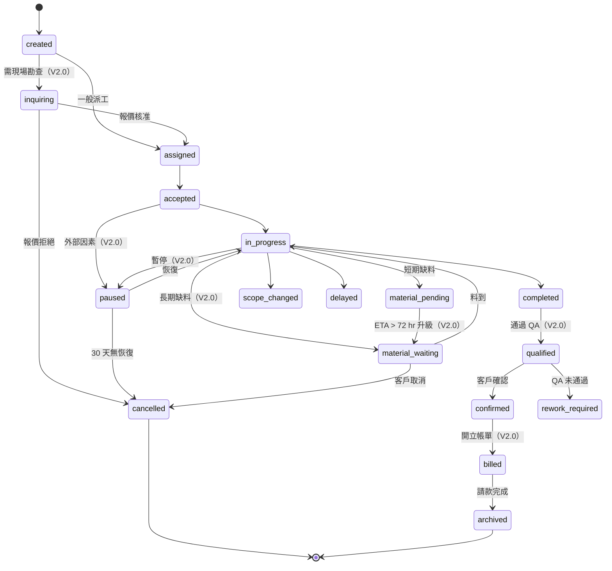

# 工單狀態機 V2.0 擴充規格（Work Order State Machine Extensions）

## 0. Purpose

本文件為工單狀態機 **V2.0 擴充規格**，提供：
1. V1.0 13 狀態（[[_flows-bdd-test/v-model-left/E5x--workflow-work-order|work-order]] §1.2）+ V2.0 新增 5 狀態 = 整合 18 狀態總覽
2. V2.0 新狀態之轉換規則 + 觸發條件
3. fixture 設計依據（避免 V1.0 / V2.0 fixture 混用導致測試失敗）

> **狀態**：Draft（V2.0 預備規格；V1.0 GA 不啟用）

## 1. V1.0 13 狀態（既有）

引用 [[_flows-bdd-test/v-model-left/E5x--workflow-work-order|work-order]] §1.1：

`created` / `assigned` / `accepted` / `in_progress` / `scope_changed` / `material_pending` / `delayed` / `completed` / `rework_required` / `confirmed` / `archived` / `cancelled` / `disputed`

> 注意：§4.6 原 list 用「`material-waiting`」描述，實際 V1.0 已實作為 `material_pending`（見 work-order §1.1）。本文件統一以 `material_pending` 為準。

## 2. V2.0 新增 5 狀態

| 狀態 | 識別碼 | 說明 | 可停留最大時間 | 來源狀態 | 目標狀態 |
|------|---|---|---|---|---|
| 暫停中 | `paused` | 工單因外部因素（颱風 / 客戶請假 / 法規）暫停 | 30 天 | `accepted` / `in_progress` | `in_progress` / `cancelled` |
| 詢價中 | `inquiring` | 工單進場前需先派員勘查並出第二份報價 | 7 天 | `created` | `assigned` / `cancelled` |
| 已合格 | `qualified` | 工單通過完工 QA / 合格性檢查 | 7 天 | `completed` | `confirmed` / `rework_required` |
| 已開單 | `billed` | 工單已產生帳單但未請款（V2.0 金流前置） | 30 天 | `confirmed` | `archived` |
| 等料中 | `material_waiting` | 缺料中升級狀態（含外部供應商 ETA） | 14 天 | `material_pending` | `in_progress` / `cancelled` |

> **`material_waiting` vs `material_pending`**：V1.0 `material_pending` 為短期缺料（72 小時內備料），V2.0 `material_waiting` 為長期外部訂貨（含 ETA + 客戶通知）。兩者並存；transition 由系統依 ETA 自動升級。

## 3. V2.0 整合 18 狀態圖

## 4. 轉換規則（V2.0 新增）

| 來源 | 目標 | 觸發條件 | 授權角色 | 審批 |
|------|------|---------|---------|------|
| `created` | `inquiring` | 工單金額 > NT$50k 自動觸發 / 客服手動標記 | System / `support_agent` | 否 |
| `inquiring` | `assigned` | 報價核准（消費者點同意） | Customer | 否 |
| `accepted` | `paused` | 客戶請假 / 颱風警報 / 法規暫停 | `support_agent` / System | 是（需理由） |
| `paused` | `in_progress` | 暫停原因解除 | `support_agent` | 否 |
| `paused` | `cancelled` | 30 天無恢復自動取消 | System | 否 |
| `material_pending` | `material_waiting` | ETA > 72 hr 自動升級 | System | 否 |
| `material_waiting` | `in_progress` | 供應商標記到貨 | Technician | 否 |
| `completed` | `qualified` | QA checklist 全綠 | System / `operations_manager` | 否 |
| `qualified` | `confirmed` | 客戶確認 | Customer | 否 |
| `confirmed` | `billed` | 月結 cut-off 自動觸發 | System | 否 |

## 5. V1.0 fixture 隔離規則

**為避免 V1.0 BDD scenario 誤用 V2.0 狀態：**
- V1.0 `tests/fixtures/work_orders.yaml` 不得含 5 個 V2.0 狀態
- BDD step `Given a work order with status "X"` 若 X ∈ V2.0 set → fail with skip reason
- CI 跑 V1.0 suite 時設 `WORK_ORDER_STATE_SET=v1` env，blocks V2.0 transitions

## 6. 影響範圍

- **DB**：`work_orders.status` enum 須 V2.0 migration 加 5 個值
- **後端**：`api/services/work_order_service.py` 之 state machine table 須擴充
- **前端**：工單詳情頁須處理 18 個 status badge（V1.0 僅 13 個）
- **BDD**：V2.0 spec 完成後須補 `Feature: Work Order V2.0 Extended States`

## 7. Verification

- [ ] V1.0 GA 階段 `work_orders.status` enum 維持 13 值
- [ ] V2.0 spec freeze 後此文件 status 由 Draft → Active
- [ ] 18 狀態圖 mermaid render 通過（CI lint）
- [ ] V1.0 fixture isolation test 確保不誤用 V2.0 狀態

## 8. Change Log

| Date | Author | Change |
|------|--------|--------|
| 2026-05-07 | Claude (assisted) | 初版：5 個 V2.0 擴充狀態 + 18 整合圖 + V1.0 fixture 隔離規則 |
