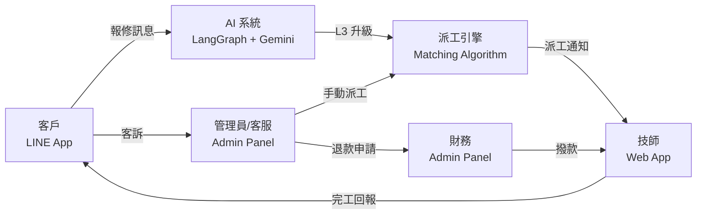
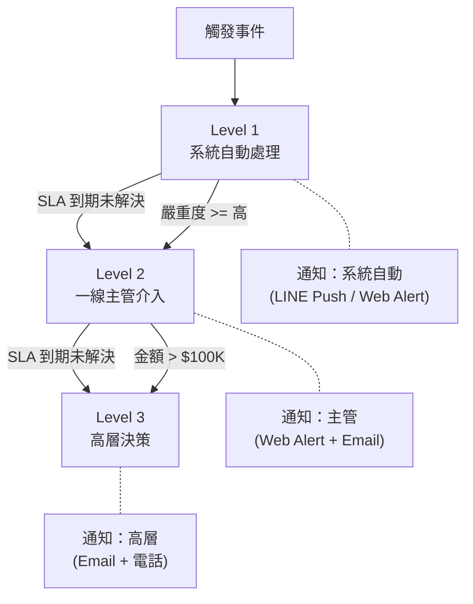
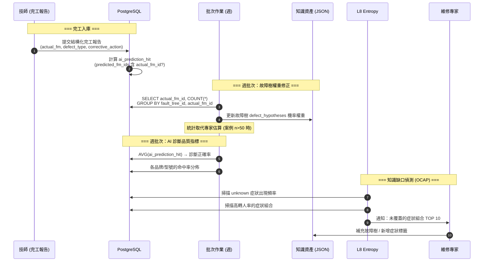
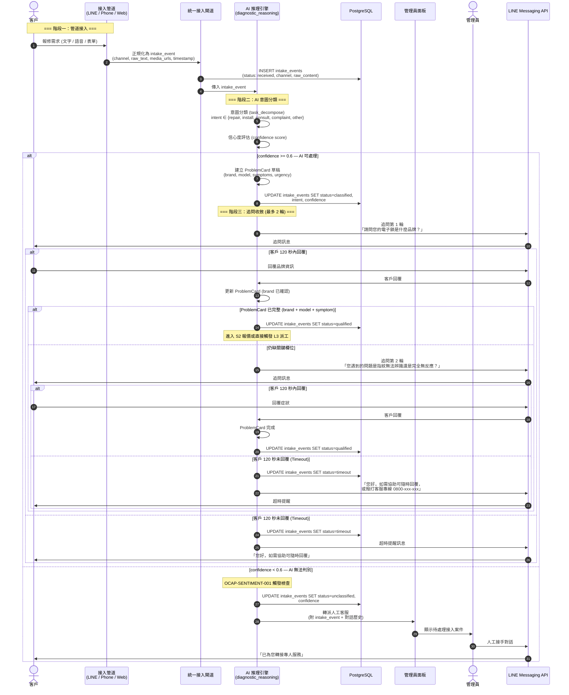
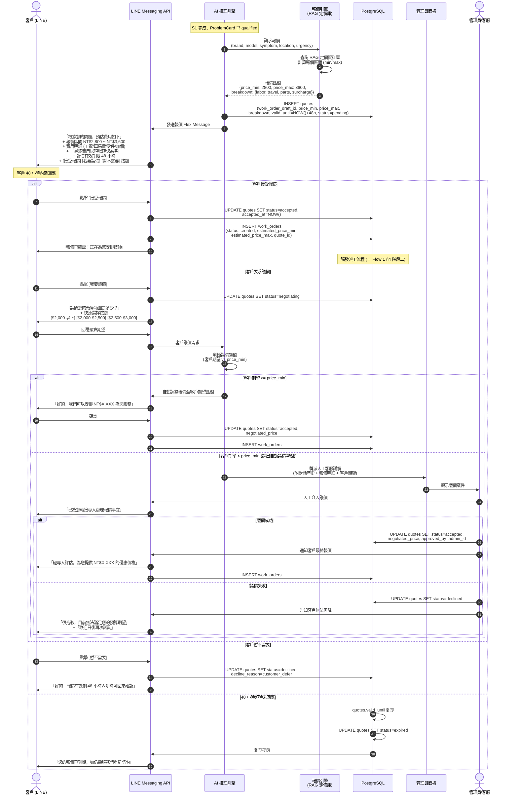
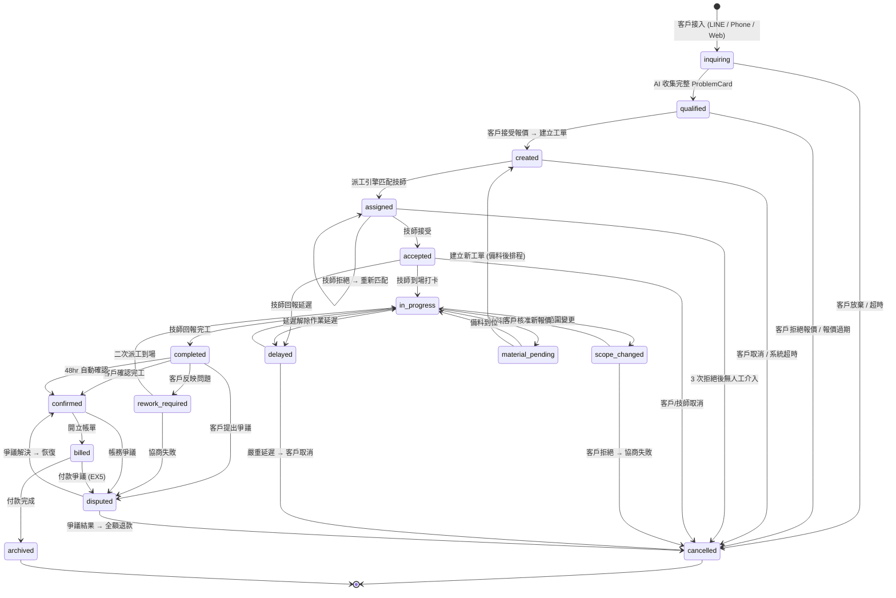
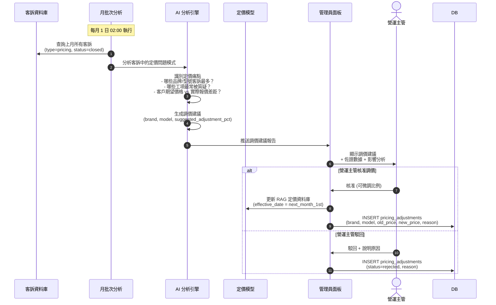
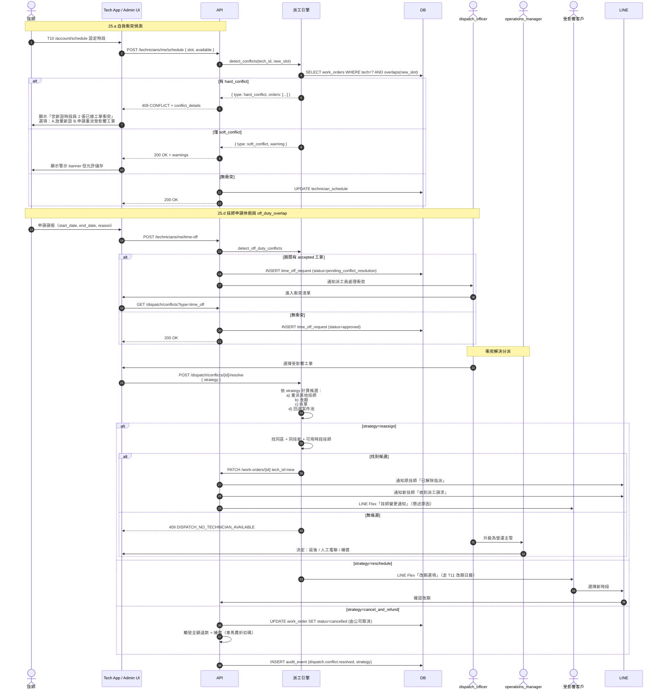
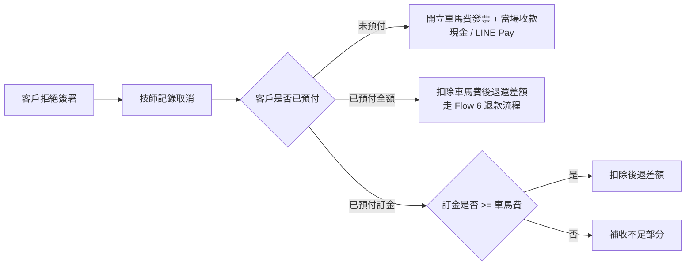

# BF-0001 — Work Order Lifecycle

> Work Order 完整生命週期 BF。狀態機抽到 `state-machines/work-order.md`，
> 13 個子 flow 抽到 `flows/sub/SF-WO-01~13-*.md`。本檔保留 §角色 / §SLA /
> §升級矩陣 / §知識沉澱 / §S1-S2 / §異常返回 / §補充規則 / §OKR / §附錄。

## 2. 角色定義

> **權威角色清單：** 全系統角色定義與權限矩陣見 `specs/rbac-dynamic-spec.md §2`。
> 本節僅列出工單流程直接參與的 6 個業務角色。

### 2.1 角色職責矩陣

| 角色 | 識別碼 | 介面 | 核心職責 | 系統權限 |
|------|--------|------|----------|----------|
| **客戶** | `Customer` | LINE App | 報修問題、核准報價、確認完工、提交客訴、評分回饋 | 查看自身工單、核准/拒絕報價、提交回饋 |
| **AI 系統** | `AI_System` | 內部服務 | 建立 ProblemCard、觸發 L3 升級、自動建立工單、發送通知 | 建立工單、更新對話狀態、呼叫 LLM |
| **派工引擎** | `Dispatch_Engine` | 內部服務 | 多因子技師匹配、逾時處理、重派邏輯、負載均衡 | 查詢技師、更新工單派工狀態、觸發通知 |
| **技師** | `Technician` | Web App | 接受/拒絕工單、回報進度、提交完工報告與照片、回報異常 | 管理自身工單、上傳照片、提交報告 |
| **管理員/客服** | `Admin` | 管理面板 | 手動派工、處理客訴、審批退款、監控 SLA、覆核爭議 | 完整工單管理、技師管理、退款審批 |
| **財務** | `Finance` | 管理面板 | 帳務結算、退款執行、月結對帳、撥款作業 | 帳務管理、退款執行、結算報表 |

### 2.2 角色互動關係



---

## 3. SLA 定義

### 3.1 各階段 SLA 時限

| 階段 | SLA 時限 | 計時起點 | 違反動作 | 通知對象 |
|------|----------|----------|----------|----------|
| 派工匹配 (一般) | < 5 分鐘 | 工單建立 (`created`) | 自動升級至人工派工 | Admin |
| 派工匹配 (Red_Code) | < 30 秒 | Red_Code 觸發 | 立即推播最近可用技師 | Admin + Ops Manager |
| 技師回應 (一般) | < 15 分鐘 | 工單派出 (`assigned`) | 逾時 → 自動匹配下一位候選技師 | Admin (第 2 次逾時) |
| 技師回應 (Red_Code) | < 5 分鐘 | Red_Code 派工 | 逾時 → 立即匹配下一位 + 通知主管 | Admin + Ops Manager |
| 技師到場 | 預約時段 ±30 分鐘 | 預約時間到達 | 延遲通知 → 客戶；>30 分鐘 → Admin 警報 | Customer, Admin |
| 完工時限 (一般) | 當日內 | 技師到場打卡 | Admin 警報 + 客戶通知 | Admin, Customer |
| 完工時限 (緊急) | < 2 小時 | 技師到場打卡 | 自動升級至主管 | Admin, Ops Manager |
| 客戶確認 | < 48 小時 | 技師回報完工 | 48 小時後自動確認 | Customer (提醒 @ 24hr) |
| 範圍變更回應 | < 24 小時 | 技師提交範圍變更 | 升級至管理員處理 | Admin |
| 備料到位 | < 72 小時 | 技師回報缺料 | 自動建議客戶改期 | Customer, Admin |
| 客訴處理 (一般) | < 3 個工作日 | 客訴建立 | 升級至營運主管 | Ops Manager |
| 客訴處理 (高優先) | < 24 小時 | 客訴建立 | 升級至營運主管 + 主管回電 | Ops Manager |
| 退款處理 | < 5 個工作日 | 退款核准 | 自動升級至財務主管 | Finance Manager |
| 爭議解決 | < 7 個工作日 | 爭議建立 | 升級至營運總監 | Ops Director |

### 3.2 Red_Code 緊急觸發條件

以下關鍵字觸發 Red_Code 緊急流程（來源：`SOP-EMERGENCY-001.json` + `ocap_rules.json` OCAP-EMERGENCY-001）：

| 觸發關鍵字 | 嚴重度 | SLA |
|---|---|---|
| 被鎖在外面、進不了家門 | Emergency 5 | 30 秒回應 → 15 分鐘派工 → 2 小時到場 |
| 家裡有小孩、小孩被鎖在裡面 | Emergency 5 | 同上 + 建議撥打 119 |
| 爐子還開著 | Emergency 5 | 同上 + 建議撥打 119 |
| 寵物在裡面 | Emergency 4 | 30 秒回應 → 15 分鐘派工 → 2 小時到場 |
| 很急 | Emergency 4 | 標記緊急 + 優先派工 |

> Red_Code 工單的 `priority` 自動設為 `urgent`，跳過正常排隊直接推播最近可用技師。

### 3.3 SLA 違反處理流程

```
SLA 計時器觸發
    │
    ├─ 第 1 次違反 → 系統自動通知負責人
    ├─ 第 2 次違反 (同工單) → 升級至上級主管
    └─ 第 3 次違反 (同工單) → 標記為危機工單 + 全管道通知
```

---

## 14. 升級矩陣

### 14.1 完整升級矩陣

| 觸發事件 | Level 1 (自動) | Level 2 (主管) | Level 3 (高層) | SLA |
|----------|---------------|---------------|---------------|-----|
| 技師未到場 (no-show) | 自動重派 + 客戶通知 | 管理員手動指派 + 電話致歉 | 客戶補償 ($500 折扣碼) + 技師處分 | L1: 立即, L2: 15 分鐘, L3: 30 分鐘 |
| 連續 3+ 技師拒單 | 手動派工模式 | 加入優先佇列 + 擴大搜尋 | VIP 技師池指定派工 | L1: 立即, L2: 30 分鐘, L3: 1 小時 |
| 範圍變更 > 原報價 2 倍 | 技術主管審核報價 | 營運主管核准 | 客戶重新報價 + 可取消 | L1: 1 小時, L2: 4 小時, L3: 24 小時 |
| 客戶 anger_level = 5 | 立即轉人工 + 安撫話術 | 主管 15 分鐘內回電 | 補償方案 + 折扣 + 優先處理 | L1: 立即, L2: 15 分鐘, L3: 1 小時 |
| 7 天內同故障復發 | 自動二次派工 (S 級、免費) | 免費服務 + 原技師記缺 | 根本原因審查 + 系統改善 | L1: 立即, L2: 24 小時, L3: 3 天 |
| 退款 > $100,000 | 營運主管 + 財務主管雙簽 | CEO 知會 | — | L1: 24 小時, L2: 48 小時 |
| 技師現場加價 | 凍結交易 + 調出標準報價 | 技術主管確認實際費用 | 客戶按標準價結算 + 技師記警告 | L1: 立即, L2: 2 小時, L3: 24 小時 |
| 施工造成損害 | 現場拍照存證 + 凍結 | 技術主管到場勘查 | 公司承擔合理修復費 + 技師記缺 | L1: 立即, L2: 24 小時, L3: 3 天 |
| 保固認定爭議 | AI 轉人工 + 查建案資料庫 | 客服出示書面依據 | 折衷方案 (折扣維修) | L1: 立即, L2: 2 小時, L3: 24 小時 |
| 備料超過 72 小時 | 通知客戶 + 提供改期 | 管理員尋找替代零件 | 升級至供應鏈主管 | L1: 72 小時, L2: 96 小時, L3: 5 天 |
| 客訴 2 次方案被拒 | 客服調整方案 | 客服主管致電溝通 | 營運主管最終裁決 | L1: 4 小時, L2: 24 小時, L3: 48 小時 |
| 同技師 3+ 次客訴 | 記錄觀察 + 教育訓練 | 暫停派工 + 面談 | 降級 / 解除合作 | L1: 累計, L2: 即時, L3: 7 天內 |

### 14.2 升級通知路徑



### 14.3 技師考核與升降級規則

| 指標 | 觀察 | 警告 | 處分 |
|------|------|------|------|
| 未完整診斷 (二次派工) | 1 次 | 3 次 | 5 次 → 降級 |
| 月拒單率 | — | > 30% | > 50% → 暫停 7 天 |
| 客訴次數 (月) | 1 次 | 2 次 | 3+ 次 → 暫停 + 面談 |
| 延遲到場 (月) | 1~2 次 | 3 次 | 5+ 次 → 降級警告 |
| 未執行告知義務 | 1 次 → 記缺 | 2 次 → 降級警告 | 3 次 → 降級 |
| 現場私自加價 | 1 次 → 警告 + 扣分 | 2 次 → 降級 | 3 次 → 解除合作 |

---

## 15. 知識沉澱閉環與完工報告

> 對應 `diagnostic-intelligence-architecture.md` §6 Layer 6: Knowledge Loop

### 15.1 完工報告結構化 Schema

技師提交完工報告時，除了現有的 `service_report`（TEXT）和 `photos`（JSONB），Phase 2 需擴展為結構化的 `service_reports` 表（詳見 `diagnostic-intelligence-architecture.md` §6）：

| 欄位 | 說明 | 來源 |
|---|---|---|
| `problem_card_id` | 關聯 AI 診斷的 ProblemCard | 系統自動 |
| `predicted_fm_ids` | AI 預測的 Failure Mode（來自 `task_decompose` 的 `hypothesized_failure_modes`） | 系統自動 |
| `actual_fm_id` | 技師到府確認的實際 Failure Mode | 技師填寫 |
| `ai_prediction_hit` | AI 猜對了嗎（`predicted_fm_ids` 包含 `actual_fm_id`） | 系統自動計算 |
| `defect_type` | 缺陷粗分類：`material` / `process` / `design` / `operation` / `other` | 技師選擇（下拉 5 選 1） |
| `defect_description` | 缺陷具體描述（自由文字，50 字內） | 技師填寫 |
| `corrective_action` | 修了什麼（CA — Corrective Action） | 技師填寫 |
| `preventive_action` | 建議的預防措施（PA — Preventive Action） | 技師填寫（選填） |
| `verification` | 修復後功能測試結果 JSONB `{fingerprint: pass, bluetooth: pass, ...}` | 技師填寫 |

### 15.2 知識沉澱閉環流程



### 15.3 OCAP 規則與工單品質監控

以下 OCAP 規則（來源：`ocap_rules.json`）在工單完工後自動觸發：

| 規則 | 觸發條件 | 動作 |
|---|---|---|
| OCAP-001 | 同一 failure_id 24h 內 > 10 件 | 通知維修主管 + 啟動批次追溯 |
| OCAP-002 | 轉人率 7 日內 > 30% | 檢查 agent prompt + fallback_tools |
| OCAP-003 | 同型號 7 日內 > 20 件 | 標記品質異常 + 通知品牌原廠 |
| OCAP-004 | AI 診斷正確率 30 日 < 60% | 觸發故障樹全面審查 |
| OCAP-SENTIMENT-001 | 高風險情緒關鍵詞（10 個） | 立即轉人工 + 通知主管 |
| OCAP-EMERGENCY-001 | Red_Code 關鍵字（7 個） | 緊急派工 + 安全評估 |

> **知識閉環核心**：每張完工報告 = 一筆 ground truth。故障樹權重從「專家估算」漸進為「統計事實」。詳見 `diagnostic-intelligence-architecture.md` §6 + `optimization-strategy.md` §6 冷啟動策略。

---


---

# 缺口補充章節 (§16-§24)

> 基於「訂單流程缺口精確比對報告」(OP-01~OP-21) 補充的完整設計。
> 涵蓋 S1 詢問接入、S2 報價確認、S6 金流支付、EX5 帳款異常、客戶不在場、狀態機擴充等。

## 16. S1 詢問接入階段

> **Gap ID**：OP-04 — 原文件缺少完整的客戶接入 (intake) 階段定義

### 16.1 觸發條件

- 客戶透過 LINE 官方帳號發送文字/圖片訊息
- 客戶撥打客服電話 (0800-xxx-xxx)，IVR 轉接至 AI 語音
- 客戶透過官方網站提交報修表單

### 16.2 參與角色

Customer, AI_System, Admin

### 16.3 三管道統一接入架構

| 管道 | 技術實作 | 接入方式 | 轉換至統一格式 |
|------|----------|----------|----------------|
| LINE | LINE Messaging API (Webhook) | 文字/圖片/影片/Flex 回覆 | `intake_event.channel = "line"` |
| 電話 | Twilio + Whisper STT → LLM | 語音轉文字後進入同一推理引擎 | `intake_event.channel = "phone"` |
| 網站 | REST API `POST /api/v1/intake` | 結構化表單 (brand, model, symptom) | `intake_event.channel = "web"` |

> **設計原則**：三個管道收斂為同一個 `intake_event` 進入 AI 推理引擎，後續所有流程完全一致。

### 16.4 流程圖



### 16.5 狀態轉換表

| 步驟 | 來源狀態 | 目標狀態 | 觸發動作 | 耗時預估 |
|------|----------|----------|----------|----------|
| 1 | — | `received` | 管道接入 intake_event | < 1 秒 |
| 2 | `received` | `classified` | AI 意圖分類完成 (confidence >= 0.6) | < 3 秒 |
| 3 | `classified` | `qualified` | ProblemCard 收集完整 (brand + model + symptom) | < 5 分鐘 |
| 4a | `received` | `unclassified` | AI confidence < 0.6 → 轉人工 | < 3 秒 |
| 4b | `classified` | `timeout` | 2 輪追問皆超時 (120 秒 x 2) | 4 分鐘 |
| 5 | `unclassified` | `qualified` | 人工客服完成資訊收集 | < 10 分鐘 |

### 16.6 通知清單

| 時機 | 通知方式 | 接收者 | 內容摘要 |
|------|----------|--------|----------|
| 接入成功 | LINE Push | Customer | 「感謝您的聯繫，正在為您分析問題」 |
| 追問 (每輪) | LINE Flex | Customer | 結構化追問 (含快速回覆按鈕) |
| 超時未回覆 | LINE Push | Customer | 超時提醒 + 客服專線 |
| 轉人工 | LINE Push | Customer | 「已為您轉接專人服務」 |
| 轉人工 | Web Alert | Admin | 待處理接入案件 + 對話歷史 |

### 16.7 業務規則

| 編號 | 規則 | 閾值 | 動作 |
|------|------|------|------|
| BR-S1-001 | AI 意圖分類信心度閾值 | confidence < 0.6 | 直接轉人工 |
| BR-S1-002 | 追問輪數上限 | 最多 2 輪 | 超過 2 輪仍無法收斂 → 轉人工 |
| BR-S1-003 | 單輪追問超時 | 120 秒 | 發送超時提醒，不重試 |
| BR-S1-004 | 連續 2 輪超時 | — | 暫停對話，記錄至 CRM 待回訪 |
| BR-S1-005 | 高風險情緒關鍵詞 | OCAP-SENTIMENT-001 觸發 | 跳過追問，立即轉人工 |
| BR-S1-006 | Red_Code 關鍵字偵測 | OCAP-EMERGENCY-001 觸發 | 跳過 S1 → 直接進入 Red_Code 派工 |

---

## 17. S2 施工前報價確認

> **Gap ID**：OP-05 — 原文件僅有 AI 自動計價，缺少報價區間概念、議價路徑、報價有效期

### 17.1 觸發條件

- S1 階段完成，ProblemCard 狀態為 `qualified`
- AI 推理引擎判斷需到府服務 (非遠端可解)
- 管理員手動建立報修需求

### 17.2 參與角色

Customer, AI_System, Pricing_Engine, Admin

### 17.3 報價區間計算邏輯

| 計算因子 | 資料來源 | 權重 | 說明 |
|----------|----------|------|------|
| 基礎工資 | RAG 定價資料庫 (brand × lock_type) | 固定 | 品牌/型號對應的標準工資 |
| 車馬費 | Google Maps API (距離 km) | 固定 | 距離 × $20/km，最低 $300 |
| 零件費 | RAG 零件價格庫 | 區間 | 依可能需更換的零件，取 min/max |
| 時段加價 | config.toml `surcharge_rules` | 乘數 | 夜間 (22:00-08:00) × 1.5、假日 × 1.3 |
| 難度係數 | ProblemCard.urgency + symptom_count | 乘數 | 複雜度高 × 1.2 |

**報價區間公式**：
```
price_min = (base_labor + travel_fee + parts_min) × time_surcharge × difficulty
price_max = (base_labor + travel_fee + parts_max) × time_surcharge × difficulty
```

> **設計原則**：對客戶呈現報價區間 (如 NT$2,800 ~ NT$3,600)，而非單一價格。最終價格由技師到場確認後決定。

### 17.4 流程圖



### 17.5 狀態轉換表

| 步驟 | 來源狀態 | 目標狀態 | 觸發動作 | 耗時預估 |
|------|----------|----------|----------|----------|
| 1 | — | `pending` | AI 生成報價區間 | < 5 秒 |
| 2a | `pending` | `accepted` | 客戶直接接受 | < 48 小時 |
| 2b | `pending` | `negotiating` | 客戶點擊議價 | < 48 小時 |
| 2c | `pending` | `declined` | 客戶暫不需要 | < 48 小時 |
| 2d | `pending` | `expired` | 48 小時未回應 | 48 小時 |
| 3a | `negotiating` | `accepted` | AI 自動議價成功 / 人工議價成功 | < 24 小時 |
| 3b | `negotiating` | `declined` | 議價失敗 | < 24 小時 |
| 4 | `accepted` | — | 觸發工單建立 (→ `created`) | < 1 秒 |

### 17.6 通知清單

| 時機 | 通知方式 | 接收者 | 內容摘要 |
|------|----------|--------|----------|
| 報價生成 | LINE Flex | Customer | 報價區間 + 明細 + 有效期 + 三選一按鈕 |
| 議價轉人工 | Web Alert | Admin | 議價案件 + 客戶期望 + 報價底線 |
| 議價成功 | LINE Flex | Customer | 最終確認報價 |
| 報價到期前 4 小時 | LINE Push | Customer | 「您的報價即將到期，是否需要服務？」 |
| 報價到期 | LINE Push | Customer | 「報價已到期，如需服務請重新諮詢」 |

### 17.7 業務規則

| 編號 | 規則 | 說明 |
|------|------|------|
| BR-S2-001 | 報價有效期 48 小時 | 超過自動標記 `expired` |
| BR-S2-002 | 報價呈現為區間 (非單一價格) | 最終價格以現場確認為準 |
| BR-S2-003 | 涉及建案/保固案件嚴禁自動報價 | 觸發 BR-001，轉人工處理 |
| BR-S2-004 | AI 自動議價空間 = price_min | 客戶期望 >= price_min 可自動成交 |
| BR-S2-005 | 客戶期望 < price_min | 必須轉人工議價，AI 不可自行降至成本以下 |
| BR-S2-006 | 報價到期前 4 小時發送提醒 | 僅提醒一次，不騷擾 |

---

## 18. 工單狀態機擴充

> **Gap ID**：OP-06 — 原文件 13 個狀態缺少 INQUIRING, QUALIFIED, BILLED

### 18.1 新增狀態定義

| 狀態 | 識別碼 | 說明 | 可停留最大時間 | 新增原因 |
|------|--------|------|----------------|----------|
| 詢問中 | `inquiring` | 客戶接入中，AI 正在收集問題資訊 | 10 分鐘 | S1 接入階段需要獨立狀態追蹤 |
| 已驗證 | `qualified` | ProblemCard 完整，待報價或待派工 | 48 小時 | S1→S2 轉換的中間狀態 |
| 已結帳 | `billed` | 帳單已開立，等待客戶付款 | 7 天 | S6 金流階段需獨立追蹤付款狀態 |

### 18.2 完整 16 狀態定義表

| # | 狀態 | 識別碼 | 說明 | 可停留最大時間 | 階段 |
|---|------|--------|------|----------------|------|
| 1 | 詢問中 | `inquiring` | AI 正在收集問題資訊 | 10 分鐘 | S1 |
| 2 | 已驗證 | `qualified` | ProblemCard 完整，待報價/派工 | 48 小時 | S1→S2 |
| 3 | 已建立 | `created` | 工單建立，等待派工 | 5 分鐘 | S3 |
| 4 | 已派工 | `assigned` | 派工引擎匹配技師 | 15 分鐘 | S3 |
| 5 | 已接受 | `accepted` | 技師確認接受 | 依預約時間 | S3 |
| 6 | 進行中 | `in_progress` | 技師到場作業 | 依工種 (2hr) | S4 |
| 7 | 範圍變更 | `scope_changed` | 現場狀況與預期不符 | 24 小時 | S4 |
| 8 | 缺料中 | `material_pending` | 等待備料 | 72 小時 | S4 |
| 9 | 延遲中 | `delayed` | 技師延遲 | 依新 ETA | S4 |
| 10 | 已完工 | `completed` | 技師回報完工 | 48 小時 | S5 |
| 11 | 返工中 | `rework_required` | 需二次處理 | 24 小時 | S5 |
| 12 | 已確認 | `confirmed` | 客戶確認完工 | 30 天 | S5 |
| 13 | 已結帳 | `billed` | 帳單開立，等待付款 | 7 天 | S6 |
| 14 | 已歸檔 | `archived` | 帳務結清 | 永久 | S7 |
| 15 | 已取消 | `cancelled` | 工單取消 | 終態 | — |
| 16 | 爭議中 | `disputed` | 爭議處理中 | 依爭議類型 | — |

### 18.3 完整 16 狀態轉換圖



### 18.4 新增狀態轉換規則 (增量)

以下為新增的 3 個狀態相關的轉換規則，與原文件 §1.3 互補：

| 來源狀態 | 目標狀態 | 觸發條件 | 授權角色 | 是否需審批 |
|----------|----------|----------|----------|-----------|
| — | `inquiring` | 客戶透過任一管道接入 | System | 否 |
| `inquiring` | `qualified` | ProblemCard 完整 (brand + model + symptom) | AI_System | 否 |
| `inquiring` | `cancelled` | 客戶放棄 / 2 輪追問超時後 24hr 未回覆 | System | 否 |
| `qualified` | `created` | 客戶接受報價，工單正式建立 | Customer | 否 |
| `qualified` | `cancelled` | 客戶拒絕報價 / 報價 48hr 到期 | Customer, System | 否 |
| `confirmed` | `billed` | 系統開立帳單 (e-invoice) | System | 否 |
| `billed` | `archived` | 付款完成 (payment_status = paid) | System | 否 |
| `billed` | `disputed` | 付款失敗 3 次 / 金額爭議 | Customer, System | 否 |

---

## 22. 異常返回節點機制

> **Gap ID**：OP-07 — 異常處理後必須指定返回哪個階段，不可跳過

### 22.1 設計原則

1. **每個異常都必須有明確的 return_to_stage**：異常解決後不允許「懸空」，必須指定回到 S1~S6 哪個階段繼續。
2. **不可跳過階段**：從 S2 異常返回後只能回到 S2 或更早，不可跳到 S4。
3. **異常解決類型分類**：每次異常結案必須記錄 `resolution_type`。

### 22.2 異常返回節點對照表

| 異常流程 | 異常識別碼 | 可返回階段 | 預設返回節點 | 說明 |
|----------|-----------|-----------|-------------|------|
| Flow 2 拒單重派 | EX-REJECT | S3 (派工) | `assigned` | 重派成功後繼續派工流程 |
| Flow 3 範圍變更 | EX-SCOPE | S4 (施工) | `in_progress` | 客戶核准後繼續施工 |
| Flow 4 缺料 | EX-MATERIAL | S3 (派工) 或 S4 (施工) | `created` (新單) 或 `in_progress` | 備料到位後建新單或繼續 |
| Flow 5 延遲 | EX-DELAY | S3 (到場) 或 S1 (改期) | `in_progress` 或 `created` | 延遲解除或改期 |
| Flow 6 退款 | EX-REFUND | S6 (結帳) 或 終態 | `archived` 或 `cancelled` | 退款完成或全額退 |
| Flow 7 保固爭議 | EX-WARRANTY | S4 (施工) | `in_progress` | 確認保固後繼續施工 |
| Flow 8 品質不合格 | EX-REWORK | S3 (重新派工) | `assigned` (二次派工) | S 級技師重新到場 |
| Flow 9 客訴 | EX-COMPLAINT | 依客訴結果而定 | `confirmed` 或 `cancelled` | 結案後恢復或全退 |
| Flow 10 外觀變更 | EX-APPEARANCE | S4 (施工) | `in_progress` | 同意後繼續 |
| Flow 11 客戶不在場 | EX-ABSENT | S3 (改期) 或 S4 (到場) | `created` (新單) 或 `in_progress` | 改期或客戶到場 |
| Flow 13 帳款異常 | EX-BILLING | S6 (結帳) | `billed` | 修正後繼續收款 |

### 22.3 resolution_type 分類

| 類型 | 識別碼 | 說明 | 範例 |
|------|--------|------|------|
| 系統自動解決 | `AUTO` | 系統規則自動處理，無需人工介入 | 自動重派、自動修正小額差異 |
| 人工介入解決 | `HUMAN` | 管理員或客服介入處理 | 人工派工、人工議價、催款 |
| 取消結案 | `CANCELLED` | 異常無法解決，工單取消 | 客戶放棄、3 次重派失敗無人工接手 |
| 升級結案 | `ESCALATED` | 異常升級至更高層級處理 | 爭議升級至營運總監 |

### 22.4 異常記錄資料結構

```
exception_records:
  - exception_id: UUID
  - work_order_id: FK → work_orders
  - exception_type: ENUM (EX-REJECT, EX-SCOPE, ...)
  - triggered_at: TIMESTAMP
  - triggered_at_stage: ENUM (S1~S6)
  - resolved_at: TIMESTAMP | NULL
  - resolution_type: ENUM (AUTO, HUMAN, CANCELLED, ESCALATED)
  - return_to_stage: ENUM (S1~S6) | NULL
  - return_to_status: ENUM (工單狀態) | NULL
  - resolved_by: FK → users | NULL
  - notes: TEXT
```

### 22.5 業務規則

| 編號 | 規則 | 說明 |
|------|------|------|
| BR-EX-001 | 異常結案必填 return_to_stage | 資料庫 NOT NULL 約束 (除 `CANCELLED` 外) |
| BR-EX-002 | return_to_stage 不可晚於 triggered_at_stage | 例如 S2 異常不可返回 S4 |
| BR-EX-003 | 同一工單同類異常累計 >= 3 次 | 強制升級至人工處理 |
| BR-EX-004 | 異常未結案超過 SLA | 自動升級 (依 §14 升級矩陣) |

---

## 23. 補充業務規則

> **Gap ID**：OP-08 ~ OP-18 — 各階段細項補充

### 23.1 OP-08：EX1 需求不明流程

**觸發條件**：AI 意圖分類 confidence < 0.6 且 2 輪追問仍無法收斂。

| 步驟 | 動作 | SLA |
|------|------|-----|
| 1 | AI 追問第 1 輪 (開放式問題) | 120 秒 |
| 2 | AI 追問第 2 輪 (選項式問題) | 120 秒 |
| 3 | 2 輪失敗 → 自動轉人工客服 | 轉接 < 30 秒 |
| 4 | 人工客服接手 + 附帶完整對話歷史 | 首次回應 < 2 分鐘 |
| 5 | 人工客服完成 ProblemCard → 進入 S2 | < 10 分鐘 |

**OCAP 連動**：若同一症狀描述 7 天內觸發 EX1 > 20 次，通知 AI 團隊更新意圖分類模型。

### 23.2 OP-09：EX2 擴大搜尋半徑與替代時段

**觸發條件**：預設 30km 半徑內無可用技師 (或所有技師已拒單)。

| 擴圈策略 | 半徑 | 車馬費調整 | 觸發時機 |
|----------|------|-----------|----------|
| 第 1 圈 (預設) | 30 km | 標準計算 | 工單建立時 |
| 第 2 圈 (擴大) | 50 km | +$200 遠距加價 | 第 1 圈無匹配 / 3 次拒單 |
| 第 3 圈 (跨區) | 80 km | +$500 跨區加價 | 第 2 圈無匹配 (需管理員核准) |

**替代時段建議**：

| 條件 | 建議 |
|------|------|
| 當日所有技師已排滿 | 推薦隔日最早可用時段 (LINE Flex) |
| 客戶選擇特定時段無人 | 顯示前後 ±2 小時可用技師 |
| 偏遠地區 (第 3 圈) | 建議週六集中服務日 |

### 23.3 OP-10：AI 施工檢核表 (S4-F03)

技師到場後，系統依 ProblemCard 自動生成施工檢核表：

| 檢核項目類型 | 來源 | 範例 |
|-------------|------|------|
| 施工前確認 | ProblemCard.symptoms | 「確認門鎖型號為 dormakaba M5」 |
| 必帶工具 | RAG 知識庫 (brand × model) | 「十字螺絲刀 PH2、內六角 4mm」 |
| 安全檢查 | SOP-SAFETY-001 | 「確認電源已斷開」 |
| 施工步驟 | SOP-{brand}-{model} | 依品牌/型號動態生成 |
| 必拍照片 | 全域規則 | 「施工前全貌 / 施工中 / 施工後 / 功能測試」 |
| 客戶告知義務 | BR-003, BR-013 | 外觀變更提醒 (若適用) |

**技術實作**：
```
POST /api/v1/work-orders/{id}/checklist
Response: {
  checklist_id: UUID,
  items: [
    { seq: 1, category: "pre_check", text: "...", required: true, status: "pending" },
    ...
  ],
  generated_from: { problem_card_id, sop_ids: [...] }
}
```

### 23.4 OP-11：鎖種不符 AI 替代推薦 (EX3-A)

**觸發條件**：技師到場發現實際鎖種與 ProblemCard 記錄不符。

| 步驟 | 動作 |
|------|------|
| 1 | 技師拍照上傳實際鎖種 |
| 2 | AI 圖片辨識 → 識別品牌/型號 |
| 3 | RAG 查詢替代方案 (compatible_models) |
| 4 | 推薦 Top 3 替代方案 (含價差) |
| 5a | 技師有替代零件 → 範圍變更流程 (Flow 3) |
| 5b | 技師無替代零件 → 缺料流程 (Flow 4) |

**AI 替代推薦 API**：
```
POST /api/v1/recommendations/alternative-locks
Request:  { actual_brand, actual_model, photo_url }
Response: { alternatives: [{ brand, model, compatibility_score, price_diff }] }
```

### 23.5 OP-12：正式簽收流程 (S5-F02)

**觸發條件**：技師提交完工報告後。

| 簽收項目 | 必填 | 說明 |
|----------|------|------|
| 服務項目清單 | 是 | 逐項列出已完成的工項 |
| 使用零件明細 | 是 | 品名 × 數量 × 單價 |
| 最終金額確認 | 是 | 客戶確認金額 (電子簽名或 LINE 點擊確認) |
| 功能測試結果 | 是 | 指紋/密碼/藍牙/卡片 各項 Pass/Fail |
| 客戶滿意度 | 是 | 1-5 星評分 |
| 客戶備註 | 否 | 開放式文字 |

**LINE Flex Message 結構**：
```
[完工簽收單]
工單編號：WO-2026-XXXX
────────────────
服務項目：
  1. 馬達模組更換    × 1  $2,400
  2. 車馬費              $300
────────────────
合計：NT$ 2,700
────────────────
功能測試：全部 PASS ✓
────────────────
[確認簽收] [有問題要反映]
```

### 23.6 OP-13：低評分自動觸發客訴

| 評分 | 動作 |
|------|------|
| 5 星 | 正常結案 |
| 4 星 | 正常結案 + 記錄改善提示 |
| 3 星 | 標記觀察 + 24hr 內 LINE 追問不滿原因 |
| 1-2 星 | 自動建立客訴案件 (→ Flow 9) + 管理員 2hr 內回電 |

**自動客訴規則**：
```
IF rating <= 2:
  INSERT complaints (
    work_order_id,
    source = 'auto_low_rating',
    priority = 'high',
    sla_first_response = NOW() + 2hr
  )
  NOTIFY admin (Web Alert + Email)
  NOTIFY customer (LINE Push: 「我們注意到您的服務體驗不夠理想，客服將主動聯繫您」)
```

### 23.7 OP-14：人工審核台 UI 規格

| UI 區塊 | 內容 | 互動 |
|---------|------|------|
| 待審佇列 | 所有待人工處理的案件 (按 SLA 剩餘時間排序) | 點擊進入詳情 |
| SLA 倒數計時器 | 每張案件顯示剩餘時間 (綠/黃/紅燈號) | 黃燈 < 50% SLA、紅燈 < 20% SLA |
| 案件詳情面板 | 工單資訊 + 對話歷史 + ProblemCard + 照片 | 可直接回覆客戶 |
| 快速動作列 | [核准] [駁回] [轉派] [升級] [備註] | 一鍵操作 |
| 統計儀表板 | 今日待處理/已處理/平均處理時間/SLA 達成率 | 即時更新 |

**SLA 燈號邏輯**：

| 燈號 | 條件 | 顏色 |
|------|------|------|
| 綠燈 | SLA 剩餘 > 50% | `#22C55E` |
| 黃燈 | SLA 剩餘 20%~50% | `#EAB308` |
| 紅燈 | SLA 剩餘 < 20% | `#EF4444` |
| 黑燈 | SLA 已違反 | `#1F2937` (閃爍) |

### 23.8 OP-15/16/17：異常熔斷規則

三條熔斷規則保護系統不因連鎖異常崩潰：

**熔斷規則 1：同一技師連續異常熔斷**

| 條件 | 動作 |
|------|------|
| 同一技師 24hr 內觸發 >= 3 次異常 (任何類型) | 自動暫停該技師派工 |
| 暫停期間 | 24 小時 (自動恢復) |
| 通知 | Web Alert → Admin + Email → 技師 |
| 恢復條件 | 24hr 後自動恢復，或管理員手動恢復 |

**熔斷規則 2：同一工單異常堆疊熔斷**

| 條件 | 動作 |
|------|------|
| 同一工單累計 >= 5 個未結異常 | 強制凍結工單 + 升級至營運主管 |
| 凍結後 | 所有自動流程停止，僅允許人工操作 |
| 通知 | Web Alert → Admin + Ops Manager |
| 恢復條件 | 營運主管手動解凍 + 填寫處置方案 |

**熔斷規則 3：系統級異常頻率熔斷**

| 條件 | 動作 |
|------|------|
| 全系統 1hr 內異常總量 > 50 件 | 觸發系統級警報 |
| 動作 | 暫停自動派工 + 切換人工派工模式 |
| 通知 | Email + SMS → CTO + Ops Director |
| 恢復條件 | CTO 手動確認恢復自動派工 |

### 23.9 OP-18：Exception API 端點

| Method | Endpoint | 說明 | 授權 |
|--------|----------|------|------|
| `POST` | `/api/v1/exceptions` | 建立異常記錄 | System, Admin |
| `GET` | `/api/v1/exceptions?work_order_id={id}` | 查詢工單所有異常 | Admin, Technician (自身) |
| `GET` | `/api/v1/exceptions/{id}` | 查詢單一異常詳情 | Admin |
| `PATCH` | `/api/v1/exceptions/{id}/resolve` | 結案異常 (含 return_to_stage) | Admin, System |
| `GET` | `/api/v1/exceptions/stats` | 異常統計 (by type, time range) | Admin |
| `POST` | `/api/v1/exceptions/{id}/escalate` | 手動升級異常 | Admin |

**建立異常 Request Body**：
```json
{
  "work_order_id": "uuid",
  "exception_type": "EX-ABSENT",
  "triggered_at_stage": "S3",
  "severity": "medium",
  "description": "客戶到場後無人應門",
  "metadata": {
    "gps_coords": { "lat": 25.033, "lng": 121.565 },
    "attempts": 3
  }
}
```

**結案異常 Request Body**：
```json
{
  "resolution_type": "AUTO",
  "return_to_stage": "S3",
  "return_to_status": "created",
  "resolved_by": "system",
  "notes": "客戶改期，建立新工單 WO-2026-YYYY"
}
```

---

## 24. OKR 追蹤機制

> **Gap ID**：OP-19 ~ OP-21 — 缺少量化指標追蹤、AI 週報自動化、客訴回饋閉環

### 24.1 五大 OKR 定義

| # | Objective | Key Result | 目標值 | 計算方式 | 追蹤頻率 |
|---|-----------|-----------|--------|----------|----------|
| OKR-1 | 提升派工效率 | KR1-1：首次匹配成功率 | >= 85% | `COUNT(first_match_accepted) / COUNT(dispatches)` | 每日 |
| | | KR1-2：平均派工耗時 | < 3 分鐘 | `AVG(assigned_at - created_at)` | 每日 |
| | | KR1-3：技師 15 分鐘回應率 | >= 90% | `COUNT(response_within_15min) / COUNT(assigned)` | 每日 |
| OKR-2 | 提升客戶滿意度 | KR2-1：平均評分 | >= 4.5 星 | `AVG(rating)` | 每週 |
| | | KR2-2：客訴率 | < 3% | `COUNT(complaints) / COUNT(completed_orders)` | 每週 |
| | | KR2-3：NPS (淨推薦值) | >= 50 | 每月問卷調查 | 每月 |
| OKR-3 | 降低異常率 | KR3-1：異常工單佔比 | < 15% | `COUNT(orders_with_exceptions) / COUNT(all_orders)` | 每週 |
| | | KR3-2：異常平均解決時間 | < 2 小時 | `AVG(resolved_at - triggered_at)` | 每週 |
| | | KR3-3：熔斷觸發次數 | < 5 次/月 | `COUNT(circuit_breaker_triggered)` | 每月 |
| OKR-4 | 提升 AI 診斷能力 | KR4-1：AI 診斷正確率 | >= 75% | `AVG(ai_prediction_hit)` | 每週 |
| | | KR4-2：AI 轉人率 | < 20% | `COUNT(human_handoff) / COUNT(intakes)` | 每週 |
| | | KR4-3：AI 意圖分類準確率 | >= 85% | `COUNT(correct_intent) / COUNT(classified)` | 每週 |
| OKR-5 | 帳務健康 | KR5-1：付款成功率 | >= 95% | `COUNT(paid) / COUNT(billed)` | 每週 |
| | | KR5-2：平均收款天數 | < 3 天 | `AVG(paid_at - billed_at)` | 每月 |
| | | KR5-3：帳款異常率 | < 2% | `COUNT(billing_exceptions) / COUNT(invoices)` | 每月 |

### 24.2 AI 週報自動化 (OP-19：S7-F03)

**執行時間**：每週一 08:00 自動生成 + 發送

**週報內容結構**：

| 區塊 | 內容 | 資料來源 |
|------|------|----------|
| 1. 摘要指標 | 5 大 OKR 當週數值 + 較上週變化 (↑/↓/→) | `work_orders`, `invoices`, `exceptions`, `intake_events` |
| 2. 派工效率 | 匹配成功率、平均耗時、拒單率分佈 | `dispatch_logs` |
| 3. AI 診斷品質 | 正確率、轉人率、TOP 5 未覆蓋症狀 | `service_reports`, `intake_events` |
| 4. 異常分析 | 異常類型分佈圖、TOP 3 異常根因 | `exception_records` |
| 5. 客戶聲音 | 低評分 TOP 5 案例 + 客訴關鍵詞雲 | `complaints`, `ratings` |
| 6. 技師表現 | TOP 10 / BOTTOM 10 技師排名 | `technicians` |
| 7. 建議行動 | AI 生成的改善建議 (3~5 條) | LLM 分析 |

**技術實作**：
```
POST /api/v1/reports/weekly (Cron Job: 0 8 * * 1)
Response: {
  report_id: UUID,
  generated_at: TIMESTAMP,
  period: { start: "2026-03-24", end: "2026-03-30" },
  sections: [ ... ],
  recipients: ["admin@company.com", "ops@company.com"],
  delivery_status: "sent"
}
```

**發送管道**：
| 接收者 | 管道 | 格式 |
|--------|------|------|
| 營運主管 | Email | PDF + HTML |
| 管理員 | Admin Panel | 互動式儀表板 |
| CEO (月報) | Email | 精簡版 PDF (僅摘要指標) |

### 24.3 客訴回饋定價模型 (OP-20：S7-F04)

**回饋閉環**：客訴分析結果自動回饋至定價模型，形成持續優化循環。



**調價安全規則**：

| 規則 | 說明 |
|------|------|
| 單次調幅上限 ±15% | 超過需 CEO 核准 |
| 不可低於成本 | price_min >= cost × 1.1 (保底 10% 毛利) |
| 新價生效日 = 次月 1 日 | 不可追溯調整已開立的報價 |
| 調價記錄永久保存 | 供審計追溯 |

### 24.4 OKR 追蹤儀表板需求

| 儀表板視圖 | 預設時間範圍 | 關鍵元件 |
|-----------|-------------|---------|
| 營運總覽 | 今日 | 5 大 OKR 卡片 (當前值 + 目標值 + 達成率) |
| 派工效率 | 本週 | 匹配成功率趨勢圖、拒單熱力圖 (by 區域) |
| AI 表現 | 本月 | 診斷正確率趨勢、轉人率趨勢、未覆蓋症狀表 |
| 異常監控 | 本週 | 異常類型 Pie Chart、解決時間分佈、熔斷記錄 |
| 帳務健康 | 本月 | 收款漏斗圖、應收帳款老化表、異常發票列表 |
| 技師排行榜 | 本月 | 評分/接單率/完成率 綜合排名 |

**技術實作**：
- 前端框架：Next.js Dashboard (Tremor UI components)
- 即時數據：WebSocket / SSE 推送 (SLA 倒數、新異常警報)
- 歷史數據：REST API `GET /api/v1/dashboard/{view}?period={range}`
- 快取策略：Redis TTL 60 秒 (營運總覽)、300 秒 (趨勢圖)

---

## 附錄 D：補充業務規則彙總

| 編號 | 規則 | 適用章節 |
|------|------|----------|
| BR-S1-001 | AI 信心度 < 0.6 → 轉人工 | §16 |
| BR-S1-002 | 追問上限 2 輪、每輪 120 秒 | §16 |
| BR-S1-006 | Red_Code 跳過 S1 直接派工 | §16 |
| BR-S2-001 | 報價有效期 48 小時 | §17 |
| BR-S2-002 | 報價呈現為區間 (非單一價) | §17 |
| BR-S2-003 | 保固案件嚴禁自動報價 | §17 |
| BR-F11-001 | 客戶不在場等候 15 分鐘 | §19 |
| BR-F11-002 | 出場費 NT$300 | §19 |
| BR-F11-003 | 不計入技師負面記錄 | §19 |
| BR-F11-006 | 3 月內 2 次不在場 → 高風險 | §19 |
| BR-EX5-001 | 金額差異 < $100 自動修正 | §21 |
| BR-EX5-003 | 付款重試上限 3 次 | §21 |
| BR-EX5-005 | 發票更正 SLA 2 小時 | §21 |
| BR-EX-001 | 異常結案必填 return_to_stage | §22 |
| BR-EX-002 | 返回階段不可晚於觸發階段 | §22 |

## 附錄 E：補充資料模型擴展建議

| 表格名稱 | 用途 | 關聯章節 |
|----------|------|----------|
| `intake_events` | 客戶接入記錄 (三管道統一) | §16 |
| `quotes` | 報價記錄 (含區間、議價歷史) | §17 |
| `payment_attempts` | 付款嘗試記錄 | §20, §21 |
| `customer_absence_logs` | 客戶不在場記錄 | §19 |
| `exception_records` | 統一異常記錄 (含 return_to_stage) | §22 |
| `pricing_adjustments` | 定價調整歷史 (客訴回饋) | §24 |
| `weekly_reports` | AI 週報存檔 | §24 |
| `checklist_instances` | 施工檢核表實例 | §23.3 |

## 附錄 F：API 端點索引 (Supplement)

| Method | Endpoint | 說明 | 關聯章節 |
|--------|----------|------|----------|
| `POST` | `/api/v1/intake` | 統一接入 (Web 管道) | §16 |
| `POST` | `/api/v1/quotes` | 建立報價 | §17 |
| `PATCH` | `/api/v1/quotes/{id}/accept` | 客戶接受報價 | §17 |
| `PATCH` | `/api/v1/quotes/{id}/negotiate` | 議價 | §17 |
| `POST` | `/api/v1/payments` | 發起付款 | §20 |
| `POST` | `/api/v1/payments/{id}/retry` | 重試付款 | §21 |
| `POST` | `/api/v1/invoices/{id}/void` | 作廢發票 | §21 |
| `POST` | `/api/v1/invoices/{id}/reissue` | 重開發票 | §21 |
| `POST` | `/api/v1/work-orders/{id}/checklist` | 生成施工檢核表 | §23.3 |
| `POST` | `/api/v1/recommendations/alternative-locks` | 替代鎖種推薦 | §23.4 |
| `POST` | `/api/v1/exceptions` | 建立異常記錄 | §23.9 |
| `PATCH` | `/api/v1/exceptions/{id}/resolve` | 結案異常 | §23.9 |
| `POST` | `/api/v1/reports/weekly` | 生成週報 | §24.2 |
| `GET` | `/api/v1/dashboard/{view}` | 儀表板數據 | §24.4 |

---

> **文件結束** — 本補充文件涵蓋 OP-01 至 OP-21 共 21 項缺口修補，新增 §16-§24 共 9 個章節、3 個新工單狀態、3 個新業務流程 (Flow 11-13)、異常返回機制、熔斷規則、以及完整的 OKR 追蹤體系。合併至主文件後，工單全生命週期從 S1 (詢問接入) 到 S7 (歸檔與知識沉澱) 形成完整閉環。

---

## 附錄 A：關鍵業務規則彙總

| 編號 | 規則 | 適用流程 |
|------|------|----------|
| BR-001 | 涉及建案/保固案件，AI 嚴禁自動報價 | Flow 7 |
| BR-002 | 保固起算日 = 建商點交日，非住戶入住日 | Flow 7 |
| BR-003 | 門外觀變更必須施工前取得客戶書面同意 | Flow 10 |
| BR-004 | 7 天內同症狀復發 → 自動觸發二次客訴 | Flow 8 |
| BR-005 | 二次派工強制 S 級技師 + 免費服務 | Flow 8 |
| BR-006 | 退款 > $100K 需營運 + 財務雙簽 | Flow 6 |
| BR-007 | 因技師延遲/缺料導致取消 → 不收取任何費用 | Flow 4, 5 |
| BR-008 | 技師逾時 15 分鐘未回應 → 自動重派 | Flow 2 |
| BR-009 | 完工後 48 小時未確認 → 系統自動確認 | Flow 1 |
| BR-010 | 範圍變更報價 > 2 倍原價 → 技術主管審核 | Flow 3 |
| BR-011 | anger_level >= 4 → 跳過 AI 直接轉人工 | Flow 9 |
| BR-012 | 月拒單率 > 50% → 暫停派工 7 天 | Flow 2 |
| BR-013 | 因客戶拒絕外觀變更而取消 → 收車馬費、免工資 | Flow 10 |
| BR-014 | 客訴結案後 30 天內再投訴 → 自動升級至主管 | Flow 9 |

## 附錄 B：通知管道對照

| 管道 | 技術實作 | 適用對象 | 回應能力 |
|------|----------|----------|----------|
| LINE Push Message | LINE Messaging API | Customer | 可互動 (Flex Message) |
| LINE Flex Message | LINE Messaging API | Customer | 含按鈕、表單 |
| Web Push Notification | Browser Push API | Technician, Admin | 點擊跳轉 |
| Web Alert (面板內) | WebSocket / SSE | Admin, Finance | 即時顯示 |
| Email | SMTP / SendGrid | 高層 (CEO) | 異步通知 |
| 電話 | 手動 | Customer (高優先) | 即時溝通 |

## 附錄 C：資料模型擴展建議

基於本文件定義的流程，建議在 `SQL/Schema.sql` 中新增以下表格：

| 表格名稱 | 用途 | 關聯流程 |
|----------|------|----------|
| `dispatch_logs` | 派工嘗試記錄 (含拒絕原因) | Flow 2 |
| `scope_change_requests` | 範圍變更申請 | Flow 3 |
| `material_requests` | 缺料報告 | Flow 4 |
| `delay_notifications` | 延遲通知記錄 | Flow 5 |
| `refund_requests` | 退款申請 (含審批鏈) | Flow 6 |
| `complaints` | 客訴記錄 | Flow 9 |
| `appearance_change_notices` | 門外觀變更告知書 | Flow 10 |
| `technician_penalties` | 技師考核記錄 | Flow 2, 8 |

---

# T1.2 補強（2026-04-23，plan §S 驗證閘）

> 以下三章為 pre-Week-2 驗證閘針對既有 Flow 9/10 與新 Flow 14 的補完。
> 與既有 §12 Flow 9、§13 Flow 10 互為補充；§25 為全新 Flow。

## 25. Flow 14：技師排班衝突解決 — 對應 F-010 / dispatch §1 排班

> **Endpoints:** `getTechnicianAvailability`（衝突偵測核心）, `submitTimeOffRequest`（Week 4）, `listDispatchCandidates`（重派）, `assignWorkOrder`（重派落地）, `proposeReschedule`（T11）
> **Events Out:** `technician.schedule.conflict.detected`, `technician.time_off.requested`, `work_order.reassigned`
> **Idempotency:** Required on 時段編輯、請假申請、重派
> **Error codes:** `TECHNICIAN_SCHEDULE_CONFLICT`, `DISPATCH_NO_TECHNICIAN_AVAILABLE`, `TECHNICIAN_CIRCUIT_BREAKER_OPEN`
> **Related pages:** T10 排班 / A25 管理員排班 / A28 派工佇列 / **A37 派工人工介入** / **T11 改期日曆**
> **Note:** 與 Flow 5 延遲、Flow 11 不在場的銜接見 §25.9 / §25.10


### 25.1 觸發條件

- **25.a 自我衝突**：技師自助排班時設定的時段與既有已接工單重疊
- **25.b 派工衝突**：派工引擎指派新工單 → 偵測到與該技師已排程衝突
- **25.c 臨時改期**：客戶 / 技師延遲改期（Flow 5、Flow 11）造成後續時段重疊
- **25.d 主動請假**：技師申請休假 → 需處理已掛在該時段的工單
- **25.e 管理員介入**：`dispatch_officer` 手動派工跳過衝突檢查，需後置解決

### 25.2 參與角色

| Actor | 職責 |
|:---|:---|
| 技師 | 設定排班、回應衝突選項 |
| 派工引擎 | 偵測衝突、計算重派候選 |
| `dispatch_officer` | 手動介入（衝突無法自動解決時） |
| `operations_manager` | 多工單重派的二次核准 |
| 客戶（受影響工單）| 被動接收改派通知 |

### 25.3 衝突分類

| 類型 | 原因 | 自動 vs 人工 |
|:---|:---|:---|
| `hard_conflict` | 同一時段兩張 `accepted` 工單 | **必須人工介入** |
| `soft_conflict` | 預估完工時間可能延誤次張工單 | 自動提示技師、可延後 |
| `buffer_insufficient` | 兩工單間距 < 移動時間門檻（預設 30 分） | 自動提示、可接受 |
| `off_duty_overlap` | 已接工單落在新申請的休假時段 | 必須人工處理（重派或撤休） |
| `skill_mismatch` | 原派工技師改期後無適任者可接 | 升級給 `operations_manager` |

### 25.4 流程圖



### 25.5 狀態轉換表（time_off_request）

| 事件 | Before | After |
|:---|:---|:---|
| 申請（無衝突） | — | `approved` |
| 申請（有衝突） | — | `pending_conflict_resolution` |
| 衝突解決 | `pending_conflict_resolution` | `approved` |
| 衝突無解 | `pending_conflict_resolution` | `rejected_by_ops` |
| 撤回申請 | `pending_*` | `withdrawn` |

### 25.6 通知清單

| 事件 | 對象 | 通道 |
|:---|:---|:---|
| 自助排班衝突 | 該技師 | Tech App 同步回應（409）+ 對話框 |
| 申請休假衝突 | 該技師 | LINE Push + App 通知 |
| 衝突清單更新 | `dispatch_officer` | WebSocket `/realtime/dispatch-queue` |
| 工單被重派 | 原技師 | LINE Push + App |
| 工單被重派 | 新技師 | LINE Push + App |
| 客戶受影響 | 客戶 | LINE Flex（含替代方案選項）|
| 升級營運主管 | `operations_manager` | WebSocket + Email |

### 25.7 業務規則

- **R1**：自助排班預設**不允許 hard_conflict 儲存**（必須先處理）
- **R2**：soft_conflict 可儲存但標記 `warning_acknowledged_at`（法律上技師已知悉）
- **R3**：請假 start_date 與提交時間的距離 < 24h → 視為「緊急請假」，需 `dispatch_officer` 人工核准
- **R4**：連續請假 > 7 天 → 觸發 `operations_manager` 審批 + 考勤記錄
- **R5**：重派時客戶有「拒絕換人」權利 → 可強制原技師處理（技師申請休假視為放棄，與客戶協商）
- **R6**：改派到比原派距離更遠的技師 → 公司承擔增加的車馬費差額
- **R7**：12 個月內主動放鴿子（causing hard_conflict）>= 3 次 → 觸發熔斷（對齊本文件 §22 異常返回節點機制）
- **R8**：衝突解決的 SLA：hard_conflict 發現後 2 小時內必須有動作，24 小時內必須有結論

### 25.8 Error Path

| 情境 | error_code | HTTP |
|:---|:---|:---|
| 新排班造成 hard_conflict | `WORK_ORDER_CONFLICT` | 409 |
| 請假衝突且無重派方案 | `DISPATCH_NO_TECHNICIAN_AVAILABLE` | 503 |
| 跨租戶排班嘗試 | `TENANT_MISMATCH` | 403 |
| 技師熔斷中嘗試設排班 | `TECHNICIAN_CIRCUIT_BREAKER_OPEN` | 423 |
| 請假時段超過合約上限 | `VALIDATION_ERROR` | 422 |

### 25.9 與 Flow 11 客戶不在場的銜接

客戶不在場（Flow 11）導致工單改期後，新時段可能觸發本 Flow：
```
Flow 11 客戶不在場 → 技師被退回案件池 → 15min 後客戶重新預約
  ↓
  新時段可能與技師既有排程衝突
  ↓
  觸發 Flow 14 自動衝突檢測
  ↓
  soft_conflict → 技師確認接受
  hard_conflict → dispatch_officer 介入重派
```

### 25.10 與 Flow 5 延遲通知的銜接

Flow 5 技師延遲超過 1 小時 → 次張工單可能受影響：
```
Flow 5 延遲通知 → 預估新完工時間 ETC
  ↓
  Flow 14 soft_conflict 偵測：ETC + 移動時間 > 次工單開始時間
  ↓
  主動通知：「您下一工單可能遲到 X 分」
  ↓
  技師選項：A.主動連絡客戶延後 B.申請重派次工單
```

---

## 26. Flow 10 補遺：費用結算細則 — 對應 F-013 / F-021

> 補既有 §13（Flow 10 門外觀變更）的費用結算空白。

### 26.1 四種結束情境與費用計算

| 情境 | 車馬費 | 工資 | 零件費 | 發票處理 |
|:---|:---|:---|:---|:---|
| 客戶簽同意 → 正常完工 | 依原報價 | 依原報價 | 實支 | 完整開立 |
| 客戶拒絕 → 選替代方案 → 完工 | 依原報價 | 依新方案重新報價 | 新方案實支 | 依新總額 |
| 客戶拒絕 → 取消安裝 | **僅收車馬費** | 不收 | 不收 | 僅車馬費發票 |
| 技師提案不合理（客戶投訴後確認）| 不收 | 不收 | 不收 | 不開立 + 道歉 |

### 26.2 車馬費標準（對齊 `E5x--workflow-dispatch.md`）

待使用者校對具體金額：
- 市區：NT$ 300（< 10km）
- 郊區：NT$ 500（10-20km）
- 遠距：NT$ 800（> 20km）
- 離島 / 山區：依實際成本（另議）

### 26.3 取消結算的資金流



### 26.4 新錯誤碼需求

```
APPEARANCE_CHANGE_SIGNATURE_REJECTED   409  客戶拒簽 → 進入費用結算分支
APPEARANCE_CHANGE_EVIDENCE_INCOMPLETE  422  必拍照片未齊（少於 4 張）
```

### 26.5 業務規則

- **R1**：拒簽但已預付全額的退款金額 = 預付 − 車馬費
- **R2**：車馬費發票須獨立開立（稅務分類：服務費），不得與原工單發票合併
- **R3**：若技師私自進行外觀變更未取得簽署 → 公司承擔全部修復賠償（對齊既有 §13 業務規則）
- **R4**：取消後 30 天內客戶再下單 → **不再收車馬費**（視為原趟延續）
- **R5**：原始狀態照片、拒簽電子筆跡、GPS 紀錄 → 永久保存（對齊 §13.6）

---

## 27. Flow 9 補遺：與爭議仲裁（G4）的銜接 — 對應 F-013 / F-014（admin G4 仲裁）

> 補既有 §12（Flow 9）與 `flows-admin-governance.md §5 Flow G4` 的互動。

### 27.1 Flow 9 → G4 爭議的升級條件

| Flow 9 狀態 | G4 啟動條件 | 升級時的攜帶資料 |
|:---|:---|:---|
| `resolution_rejected`（二次拒絕） | anger_level >= 4 + 客訴類型為 pricing / quality | complaint_id、證據鏈、CSR 對話紀錄 |
| `escalated`（客服主管無法解決） | `operations_manager` 判斷需金額裁決 | 同上 + 主管決策紀錄 |
| `reopened`（30 天內重複投訴） | 自動直通 G4 | 歷史客訴 ID 鏈、同類事件統計 |

### 27.2 禁止雙開

若同一工單已存在 active 爭議（G4）：
- Flow 9 的新客訴併入該爭議案件（不重開）
- 客訴內容追加為爭議補充證據
- 狀態：既有爭議 `under_review` + 客訴標 `merged_into_dispute`

### 27.3 爭議結案後的客訴處理

| 爭議結果 | 原客訴處理 |
|:---|:---|
| `resolved_by_settlement` | 客訴自動 `closed`（continued settlement） |
| `resolved_by_arbitration` + 客戶接受 | 客訴 `closed` + 執行補償 |
| `resolved_by_arbitration` + 客戶拒絕 → `final_arbitration` | 客訴保持 `escalated` 等終審 |
| `closed_final` | 客訴 `closed`（含終審決議）|

### 27.4 稽核事件銜接

```
Flow 9 升級 → 產出 audit_event (complaint.escalated_to_dispute)
            → G4 受理 → 產出 audit_event (dispute.created)
            → 兩事件以 correlation_id 關聯
G4 結案 → 產出 audit_event (dispute.resolved)
        → 回寫 Flow 9 complaint.resolved_via_dispute
```

### 27.5 UI 呈現（A12 工單詳情 / A22 爭議頁）

- A12 工單詳情若有 active 客訴 + active 爭議 → 顯示兩個 badge，彼此連結
- A22 爭議詳情顯示來源客訴（若有）+ 完整 Flow 9 timeline

### 27.6 新錯誤碼需求

```
COMPLAINT_ALREADY_IN_DISPUTE    409  嘗試建立客訴時已有 active 爭議
DISPUTE_MERGE_FAILED            500  客訴併入爭議失敗（需人工介入）
```

---

## 28. T1.2 校對檢核表

- [ ] §25.3 衝突五分類是否完整？`buffer_insufficient` 閾值（30 分移動時間）是否合理？
- [ ] §25.7 R3 緊急請假門檻（24h）是否合理？
- [ ] §25.7 R6 公司承擔車馬費差額是否符合既有派工財務規則？
- [ ] §25.7 R7 熔斷閾值（12 個月 3 次放鴿子）是否與 `flows-admin-governance.md §5.6 R4`、本文件 §22 一致？
- [ ] §25.8 error_code 是否需要新增 `TECHNICIAN_SCHEDULE_CONFLICT` 取代複用 `WORK_ORDER_CONFLICT`？
- [ ] §26.2 車馬費標準金額是否符合實際成本？
- [ ] §26.5 R4「30 天再下單不收車馬費」是否為新規則？
- [ ] §27.2 禁止雙開的客訴併入爭議的邏輯是否符合營運預期？
- [ ] §27.3 「爭議終審前客訴保持 escalated」狀態持續可能超 30 天，是否影響 SLA？
- [ ] §26.4 / §27.6 新錯誤碼需同步更新 `error-codes.md`

---

> **文件結束** — 本文件定義了工單全生命週期 10 個核心互動流程 + 補遺章節（§25 Flow 14 技師排班衝突、§26 Flow 10 費用結算、§27 Flow 9 爭議銜接）。後續開發應嚴格遵循本文件定義的狀態機與 SLA 規範。
