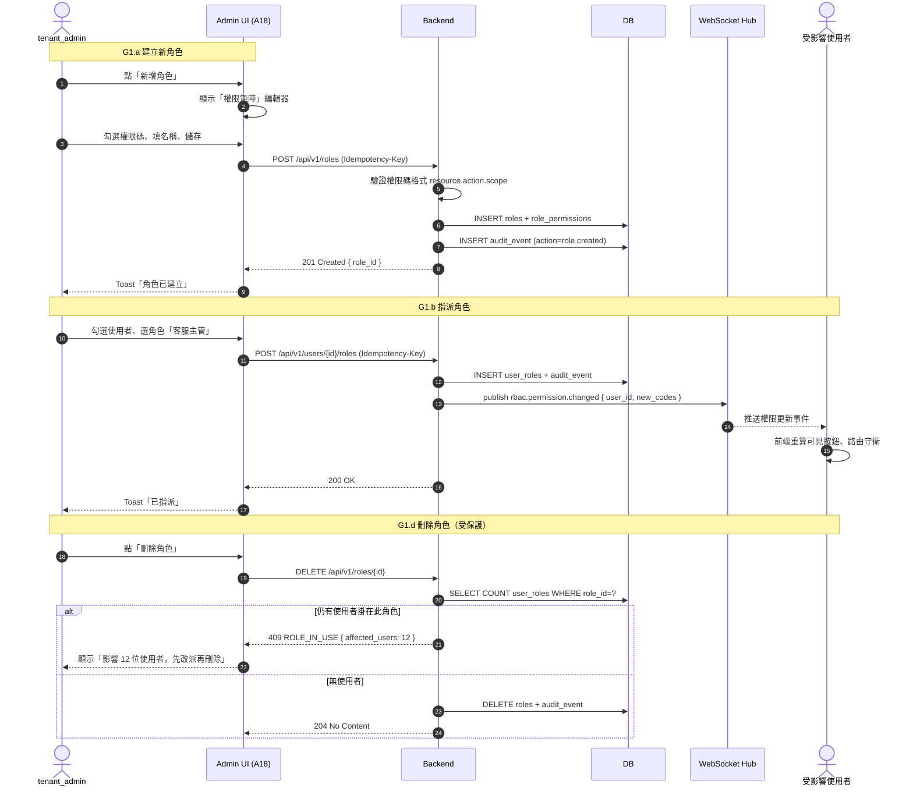

# SF-G1 — rbac lifecycle

> Admin Governance BF 的子流程 G1 of 4。

## 2. Flow G1：RBAC 角色生命週期 — 對應 F-019

### 2.1 觸發條件

- **G1.a 建立角色**：`tenant_admin` 於 `/admin/roles` 新增自訂角色
- **G1.b 授權/撤銷**：管理員將角色指派/移除到 `user` 或 `technician`
- **G1.c 權限碼調整**：為既有角色增減 permission code
- **G1.d 角色刪除**：刪除不再使用的角色
- **G1.e 即時生效**：變更透過 WebSocket 廣播，所有登入 session 立即重繪 UI

### 2.2 參與角色

| Actor | 職責 |
|:---|:---|
| `tenant_admin` | 建立/修改角色、指派使用者 |
| `auditor` | 事後稽核（只讀） |
| 受影響使用者 | 被動接收權限更新（WS 推送） |
| 系統 | 產生稽核事件、廣播 WS、驗證權限碼格式 |

### 2.3 流程圖

### 2.4 狀態轉換表（角色與使用者 binding）

| 事件 | Before | After | 稽核 action |
|:---|:---|:---|:---|
| 建立角色 | — | `role.active` | `role.created` |
| 角色加權限 | `role.active` | `role.active`（permission set changed） | `role.permission.granted` |
| 角色刪權限 | `role.active` | `role.active` | `role.permission.revoked` |
| 指派角色給 user | user 無此角色 | user 有此角色 | `user.role.assigned` |
| 撤銷使用者角色 | user 有此角色 | user 無此角色 | `user.role.revoked` |
| 停用角色 | `role.active` | `role.disabled` | `role.disabled` |
| 刪除角色 | `role.active` 且 `user_count == 0` | — | `role.deleted` |

### 2.5 通知清單

| 事件 | 對象 | 通道 | 格式 |
|:---|:---|:---|:---|
| `user.role.assigned` | 受影響使用者 | WebSocket `/realtime/rbac` | `{ role_id, role_name, effective_at }` |
| `user.role.revoked` | 受影響使用者 | WebSocket `/realtime/rbac` | 同上 |
| `role.deleted` | 所有登入的管理員 | Dashboard Toast | `{ role_name, by, at }` |
| `role.permission.granted|revoked` | 該角色所有成員 | WebSocket | 全新 permission code set |

### 2.6 業務規則

- **R1**：`super_admin` 角色不可刪除、不可改名、不可增減權限（系統保留）
- **R2**：使用者至少保有一個角色；撤銷最後一個角色 → 拒絕（422）
- **R3**：權限碼格式驗證失敗（不符 `^[a-z_]+(\.[a-z_]+){2}$`）→ 422 `PERMISSION_CODE_INVALID`
- **R4**：跨租戶授權（給另一租戶使用者指派本租戶角色）→ 403 `TENANT_MISMATCH`
- **R5**：`role.disabled` 期間該角色的使用者保留關聯，但權限檢查視為無效；恢復 enabled 後權限自動回來
- **R6**：刪除角色必須先讓使用者數歸零（`ROLE_IN_USE` 409）
- **R7**：`auditor` 不可被授予任何 `*.write.*` 或 `*.delete.*` 權限（系統強制）

### 2.7 Error Path

| 情境 | error_code | HTTP | UX |
|:---|:---|:---|:---|
| 權限碼格式錯 | `PERMISSION_CODE_INVALID` | 422 | 表單紅框 + 格式提示 |
| 刪除時仍有使用者 | `ROLE_IN_USE` | 409 | 對話框列影響使用者 |
| 撤銷最後一個角色 | `VALIDATION_ERROR` | 422 | Toast「使用者至少需一個角色」 |
| 權限不足 | `FORBIDDEN` | 403 | 頁面降級為只讀 |

---

