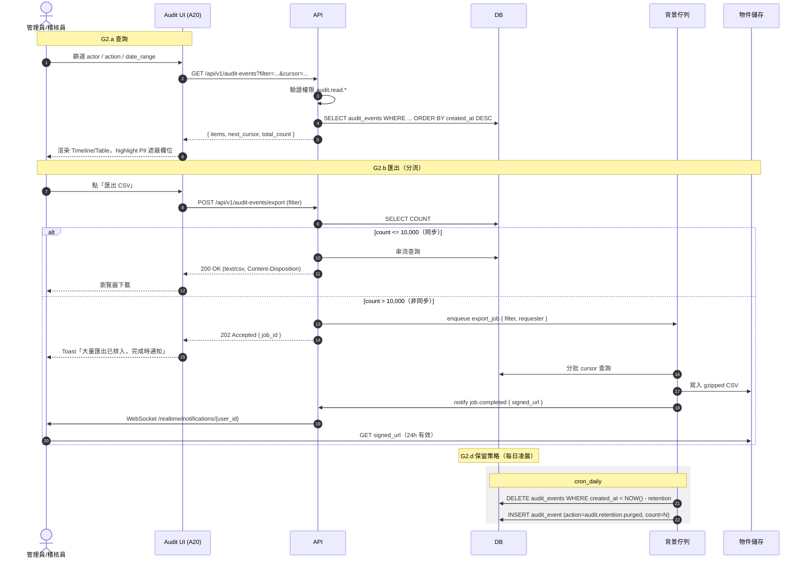

# SF-G2 — audit log query export

> Admin Governance BF 的子流程 G2 of 4。

## 3. Flow G2：稽核日誌查詢與匯出 — 對應 F-020

### 3.1 觸發條件

- **G2.a 查詢**：管理員 / `auditor` 在 `/admin/audit-events` 篩選查詢
- **G2.b 匯出**：篩選結果匯出為 CSV（小量同步、大量背景）
- **G2.c 事件消費**：外部 SIEM 透過 webhook 訂閱（可選）
- **G2.d 保留策略**：事件超過保留期自動歸檔/刪除（定時任務）

### 3.2 參與角色

| Actor | 職責 |
|:---|:---|
| 所有登入角色 | 產生稽核事件（被動） |
| `operations_manager` / `tenant_admin` | 查詢/匯出 |
| `auditor` | 只讀查詢、外部匯出 |
| 系統 | 事件產出（同步）、保留策略排程（非同步） |

### 3.3 流程圖

### 3.4 事件分類（對齊 `audit-log-spec.md §2`）

| 類別 | 範例 action | 保留期 |
|:---|:---|:---|
| 認證類 | `user.login.success`, `user.login.failed`, `user.logout` | 180 天 |
| RBAC 類 | `role.created`, `user.role.assigned` | 3 年 |
| 工單類 | `work_order.created`, `work_order.status.changed` | 5 年 |
| 金流類 | `refund.approved`, `payment.confirmed`, `invoice.issued` | 7 年（稅法） |
| 敏感資料存取 | `customer.pii.viewed`, `audit.exported` | 3 年 |
| 系統類 | `audit.retention.purged` | 10 年 |

### 3.5 查詢能力

- **篩選**：actor（使用者/系統）、action（逗號分隔多選）、target_type、target_id、date_range、tenant_id（super_admin 限定）
- **排序**：`created_at`（預設 desc）、`severity`
- **分頁**：cursor-based，預設 50 筆、最大 200 筆
- **全文搜尋**：`q` 參數對 `actor_name` / `target_name` / `description` 做 ILIKE（索引 trigram）

### 3.6 PII 遮蔽規則（對齊 `audit-log-spec.md §6`）

| 欄位 | `auditor` 看到 | `tenant_admin` 看到 | `super_admin` 看到 |
|:---|:---|:---|:---|
| 客戶姓名 | `王***` | `王大明` | `王大明` |
| 客戶手機 | `09**-***-678` | `09**-***-678` | `0912-345-678` |
| 客戶地址 | `台北市中山區***` | `台北市中山區 XX 路 1 號` | 同左 |
| 金額 | 可見 | 可見 | 可見 |

### 3.7 業務規則

- **R1**：稽核事件寫入失敗不阻塞主業務，但要寫 `system.error` 事件到 fallback log
- **R2**：超過保留期的事件需在刪除前產出 `audit.retention.purged` 摘要事件（含筆數 hash）
- **R3**：匯出操作本身是稽核事件 `audit.exported`（actor + filter + count）
- **R4**：CSV 匯出檔簽章 URL 僅 24h 有效，且僅原請求者可下載
- **R5**：`auditor` 角色唯一限制：**不能**觸發 `audit.exported`（避免審計人員取走原始資料）— 改由 `tenant_admin` 代為匯出

### 3.8 Error Path

| 情境 | error_code | HTTP | UX |
|:---|:---|:---|:---|
| 匯出筆數超上限 | `AUDIT_EXPORT_TOO_LARGE` | 413 | 「請縮小範圍或使用背景匯出」 |
| 權限不足（看跨租戶）| `FORBIDDEN` | 403 | 頁面空狀態 |
| 簽章 URL 過期 | `NOT_FOUND` | 404 | 「下載連結已過期，請重新匯出」 |

---

