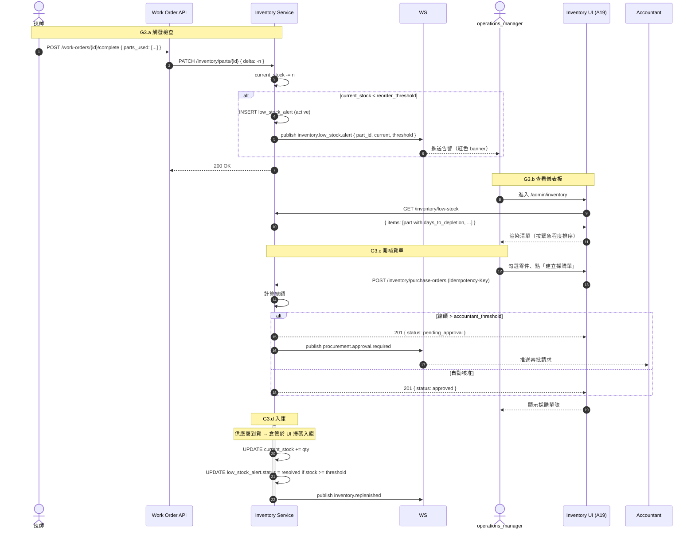

# SF-G3 — inventory low alert replenish

> Admin Governance BF 的子流程 G3 of 4。

## 4. Flow G3：庫存低警報與補貨 — 對應 F-007（材料申請）/ F-021（低庫存 alert）

### 4.1 觸發條件

- **G3.a 閾值觸發**：每次完工回報消耗零件 → 檢查 `current_stock` 是否跌破 `reorder_threshold`
- **G3.b 主動查詢**：管理員進入 `/admin/inventory` 看低庫存儀表板
- **G3.c 補貨單建立**：管理員針對低庫存零件開採購單 / 調撥單
- **G3.d 入庫**：供應商/倉管實際入庫 → 庫存回升 → 關閉告警

### 4.2 參與角色

| Actor | 職責 |
|:---|:---|
| 技師（被動） | 完工回報消耗零件 → 觸發閾值檢查 |
| `dispatch_officer` / `operations_manager` | 查詢低庫存、開補貨單 |
| `accountant` | 核准超額採購金額 |
| 供應商 / 倉管 | 入庫操作（本流程視為外部動作） |
| 系統 | 閾值檢查、WebSocket 告警、自動建立補貨草稿（可選） |

### 4.3 流程圖

### 4.4 狀態轉換表（低庫存告警）

| 事件 | Before | After |
|:---|:---|:---|
| 跌破閾值 | — | `alert.active` |
| 建立採購單 | `alert.active` | `alert.ordered` |
| 入庫回升閾值 | `alert.ordered` | `alert.resolved` |
| 24h 未處理 | `alert.active` | `alert.escalated`（通知主管） |

### 4.5 通知清單

| 事件 | 對象 | 通道 |
|:---|:---|:---|
| `inventory.low_stock.alert` | 訂閱 `/admin/inventory` 的管理員 | WebSocket `/realtime/inventory/low-stock` |
| `procurement.approval.required` | `accountant` | WebSocket + Email |
| `alert.escalated` | `tenant_admin` | LINE Notify + Email |

### 4.6 業務規則

- **R1**：`reorder_threshold` 由 `dispatch_operations_supplement.md §3.1` 定義（依零件分類）
- **R2**：補貨單金額 > 5 萬需 `accountant` 核准；> 20 萬需 `tenant_admin` 雙核
- **R3**：同一零件 24h 內多次跌破不重複推送（去重 key = `part_id + day`）
- **R4**：入庫數量超過 PO 訂量 110% 自動拒絕（避免誤入庫）
- **R5**：零件退貨（完工取消、範圍變更）需回補庫存並產 `inventory.returned` 事件
- **R6**：「緊急程度」計算公式（前端排序）：`days_to_depletion = current_stock / avg_daily_consumption_7d`

### 4.7 Error Path

| 情境 | error_code | HTTP |
|:---|:---|:---|
| 零件不存在 | `INVENTORY_PART_NOT_FOUND` | 404 |
| 庫存不足完工 | `INVENTORY_INSUFFICIENT` | 409 |
| 入庫超量 | `VALIDATION_ERROR` | 422 |
| 採購單金額需雙核但單一簽核 | `REFUND_DUAL_SIGN_REQUIRED` | 409（複用退款雙簽碼） |

---

