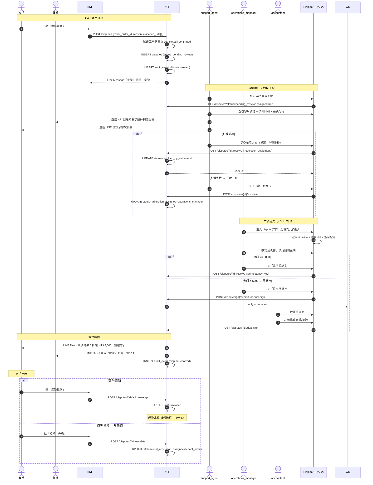

# SF-G4 — dispute arbitration

> Admin Governance BF 的子流程 G4 of 4。

## 5. Flow G4：爭議仲裁獨立流程 — 對應 F-013（雙簽）/ F-014（退款）

### 5.1 觸發條件

- **G4.a 客戶提出**：工單已完工後客戶於 LINE 點「有爭議」按鈕
- **G4.b 技師提出**：技師反映客戶刁難、惡意拒付
- **G4.c 管理員代開**：支付失敗多輪協商無果 → `support_agent` 代建立
- **G4.d 自動升級**：客訴 `anger_level >= 4` 且 24h 未解決 → 系統自動開爭議

### 5.2 參與角色

| Actor | 職責 |
|:---|:---|
| 客戶 | 提出爭議、提交證據、接受/拒絕裁決 |
| 技師 | 應訴、提交施工證據 |
| `support_agent` | 一級調解（嘗試和解） |
| `operations_manager` | 二級裁決（多數案件在此結案） |
| `accountant` | 金額裁決雙簽（> 5000 元時） |
| `tenant_admin` | 三級裁決（終審） |
| 系統 | SLA 計時、自動升級、證據封存、稽核 |

### 5.3 流程圖

### 5.4 狀態轉換表

| 事件 | Before | After | 備註 |
|:---|:---|:---|:---|
| 建立 | — | `pending_review` | SLA 24h |
| 受理 | `pending_review` | `under_review` | SA 開始調解 |
| 和解 | `under_review` | `resolved_by_settlement` | 終態 |
| 升級二級 | `under_review` | `arbitration` | |
| 提交雙簽 | `arbitration` | `awaiting_dual_sign` | 金額 > 5000 |
| 雙簽完成 | `awaiting_dual_sign` | `resolved_by_arbitration` | |
| 客戶接受 | `resolved_*` | `closed` | 觸發退款 |
| 客戶拒絕 | `resolved_by_arbitration` | `final_arbitration` | SLA 7 工作日 |
| 三級裁決 | `final_arbitration` | `closed_final` | 不可再上訴 |
| SLA 違反 | 任何中間態 | 原態（但標 `sla_violated=true`） | 自動升級 |

### 5.5 通知清單

| 事件 | 對象 | 通道 | 格式 |
|:---|:---|:---|:---|
| `dispute.created` | 對應工單的技師 | LINE Push + App | Flex |
| `dispute.created` | 分派的 `support_agent` | WebSocket + Email | — |
| `dispute.escalated` | `operations_manager` | WebSocket | — |
| `dispute.awaiting_dual_sign` | `accountant` | WebSocket + Email | — |
| `dispute.resolved` | 客戶 | LINE Flex（含裁決書 PDF） | Flex |
| `dispute.resolved` | 技師 | LINE Push + App | — |
| `dispute.sla_violated` | 原承辦 + 其主管 | WebSocket + LINE Notify | — |

### 5.6 業務規則

- **R1**：爭議建立時工單狀態必須為 `completed` 或 `confirmed`，否則 422
- **R2**：同一工單同時只能有一個 `active` 爭議（重複提出 → 409 `CONFLICT`）
- **R3**：爭議期間該工單的支付凍結（不論 pending 還是已付），結案後才釋放
- **R4**：技師 12 個月內累計被裁決失敗 3 次 → 觸發熔斷（對齊 `E5x--workflow-work-order.md §22`）
- **R5**：裁決書必填：事實認定、法規/規則引用、賠償金額、責任歸屬比例
- **R6**：爭議 PDF 歸檔 3 年（金流類保留 7 年與此不同，以長者為準）
- **R7**：保固爭議（Flow 7）與本流程分離：保固爭議是「責任判定 + 修復」、本流程是「金額賠償裁決」
- **R8**：`final_arbitration` 裁決前可邀請第三方調解（消保會、公會），流程標記 `external_mediation=true`
- **R9**：雙簽要求：爭議賠償 > 5000 元 同 Flow 6 退款雙簽門檻

### 5.7 Error Path

| 情境 | error_code | HTTP |
|:---|:---|:---|
| 工單狀態不符 | `VALIDATION_ERROR` | 422 |
| 重複爭議 | `CONFLICT` | 409 |
| SLA 違反 | 自動升級（非錯誤）| — |
| 單一簽核觸及雙簽門檻 | `REFUND_DUAL_SIGN_REQUIRED` | 409 |
| 第三方調解中阻擋結案 | `DISPUTE_SLA_OVERDUE`（錯借） | 410（TODO：應獨立碼 `DISPUTE_EXTERNAL_PENDING`） |

> **校對提醒**：§5.7 最後一行的錯誤碼使用不準，建議新增 `DISPUTE_EXTERNAL_PENDING`。此為本檔起草階段的已知問題，待 Stage 2 校對時正名並更新 `error-codes.md`。

---

