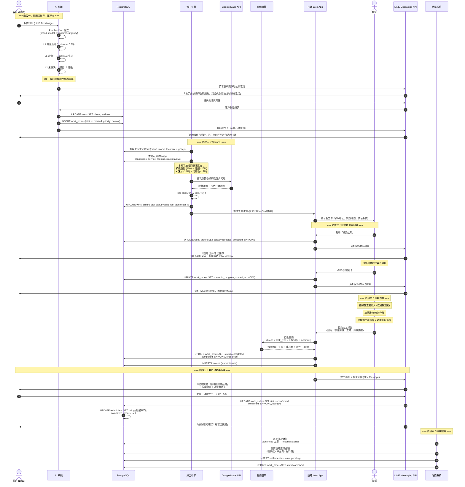

# SF-WO-01 — happy path

> Work Order BF 的子流程 1 of 13。

## 4. Flow 1：正常路徑 (Happy Path) — 對應 F-001 / F-002 / F-005 / F-006 / F-009

> **Endpoints:** `openapi#operationId=listConversations`, `getConversation`, `listProblemCards`, `listWorkOrderPool`, `acceptWorkOrder`, `getWorkOrder`, `completeWorkOrder`, `submitWorkOrderSignature`
> **Events In:** `work_order.available`（WS `/realtime/pool/{tech_id}`）, `work_order.assigned`
> **Events Out:** `work_order.status.changed` (pending → assigned → accepted → in_progress → completed → confirmed), `work_order.completed`
> **Idempotency:** Required on `acceptWorkOrder`, `completeWorkOrder`, `submitWorkOrderSignature`（Step 5/11/14）
> **Error codes:** `WORK_ORDER_CONFLICT`（接單競爭）, `WORK_ORDER_STATUS_INVALID`, `SIGNATURE_ALREADY_SIGNED`
> **Related pages:** T1（11_tech_pool）→ T3（12_tech_my_orders）→ T9（19 簽章段）

### 4.1 觸發條件

工單建立有三種觸發路徑：

**路徑 A — 診斷推理引擎觸發** (自動)：
- `task_decompose` 輸出 `diagnosis_status = "recommend_dispatch"`（診斷推理超過 3 輪未收斂、或 LLM 判斷需到府）
- 詳見 `diagnostic-intelligence-architecture.md` §4 PDCA Loop

**路徑 B — 品牌錯誤碼直接觸發** (自動，跳過遠端嘗試)：
以下 7 個信號直接觸發派工，不進入遠端排查：

| 品牌 | 錯誤信號 | 失效模式 | 原因 |
|---|---|---|---|
| dormakaba | 紅燈閃 4 次 | FM-MECH-002 馬達異常 | 需更換馬達模組 |
| dormakaba | 紅燈常亮 | FM-ELEC-002 系統錯誤 | 需主機板檢測 |
| Philips | 紅燈閃 3 次 | FM-MECH-003 離合器異常 | 需更換離合器 |
| Kaadas | 紅燈閃 5 次 | FM-MECH-004 馬達堵轉 | 需鎖體檢查 |
| Milre | 面板全亮後熄滅 | FM-ELEC-001 主機板異常 | 需更換主機板 |
| 所有品牌 | 門扇反弓 | FM-MECH-005 | 需專業調整門/門框 |
| 所有品牌 | 承接板嚴重偏位 | FM-MECH-006 | 需重新校正安裝 |

> 來源：`SOP-DISPATCH-001.json` check_dispatch_signals + `SOP-HW-001.json`

**路徑 C — 管理員手動建立** (人工)：
- 管理員從 Admin Panel 建立工單（客訴升級、電話接單等）

### 4.2 參與角色

Customer, AI_System, Dispatch_Engine, Technician, Admin, Finance

### 4.3 流程圖

### 4.4 狀態轉換表

| 步驟 | 來源狀態 | 目標狀態 | 觸發動作 | 耗時預估 |
|------|----------|----------|----------|----------|
| 1 | — | `created` | AI 系統建立工單 | < 1 秒 |
| 2 | `created` | `assigned` | 派工引擎匹配完成 | < 5 分鐘 |
| 3 | `assigned` | `accepted` | 技師接受工單 | < 15 分鐘 |
| 4 | `accepted` | `in_progress` | 技師到場打卡 | 依預約時間 |
| 5 | `in_progress` | `completed` | 技師提交完工報告 | 30 分鐘 ~ 2 小時 |
| 6 | `completed` | `confirmed` | 客戶確認 / 48 小時自動確認 | < 48 小時 |
| 7 | `confirmed` | `archived` | 月底帳務結清 | 月結週期 |

### 4.5 通知清單

| 時機 | 通知方式 | 接收者 | 內容摘要 |
|------|----------|--------|----------|
| L3 升級 | LINE Flex | Customer | 「已安排技師服務，正在匹配中」 |
| 技師接單 | LINE Flex | Customer | 技師姓名、預計到達時間、聯絡電話 |
| 技師接單 | Web Push | Technician | 工單詳情、客戶地址、導航連結 |
| 技師到場 | LINE Push | Customer | 「技師已到達」 |
| 完工回報 | LINE Flex | Customer | 帳單明細 + 確認按鈕 + 滿意度調查 |
| 客戶確認 | Web Push | Technician | 「客戶已確認完工」 |
| 帳務結算 | Web Push | Technician | 月結對帳單 |

---
