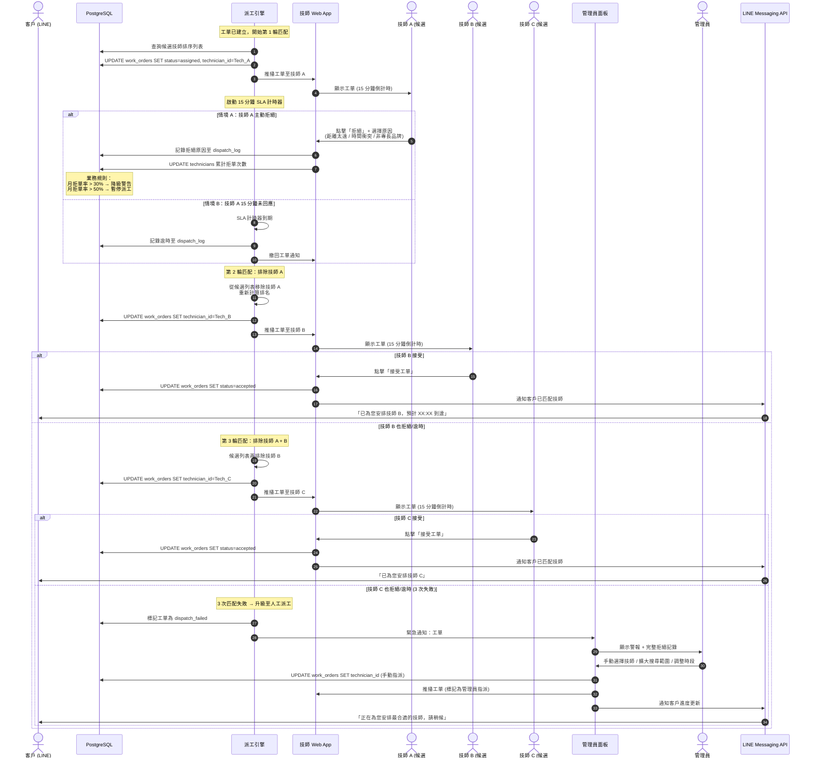

# SF-WO-02 — rejection reassign

> Work Order BF 的子流程 2 of 13。

## 5. Flow 2：拒單與逾時重派 — 對應 F-005 / F-004 / F-003

> **Endpoints:** `listDispatchCandidates`, `assignWorkOrder`（強制 Idempotency + reason_code）, `escalateWorkOrder`
> **Events Out:** `work_order.status.changed`（assigned → reassigning → assigned）、`work_order.available`（回池）
> **Idempotency:** Required on `assignWorkOrder`（手動派工）與 `escalateWorkOrder`
> **Error codes:** `DISPATCH_NO_TECHNICIAN_AVAILABLE`, `DISPATCH_OVERRIDE_REQUIRED`（熔斷覆寫雙簽）, `DISPATCH_REASON_MISSING`
> **Related pages:** A11 → A28 → **A37 派工人工介入**（3 次拒單後）

### 5.1 觸發條件

- 技師在收到工單後 15 分鐘內未回應 (逾時)
- 技師主動點擊「拒絕工單」

### 5.2 參與角色

Dispatch_Engine, Technician, Admin, Customer

### 5.3 流程圖

### 5.4 狀態轉換表

| 步驟 | 來源狀態 | 目標狀態 | 觸發動作 |
|------|----------|----------|----------|
| 1 | `created` | `assigned` | 派工引擎匹配技師 A |
| 2a | `assigned` | `assigned` | 技師 A 拒絕 → 重新匹配技師 B |
| 2b | `assigned` | `assigned` | 技師 A 逾時 → 重新匹配技師 B |
| 3 | `assigned` | `accepted` | 技師 B (或 C) 接受 |
| 4 (異常) | `assigned` | `assigned` | 3 次失敗 → 管理員手動指派 |

### 5.5 通知清單

| 時機 | 通知方式 | 接收者 | 內容摘要 |
|------|----------|--------|----------|
| 第 2 輪重派 | — | Customer | (不通知客戶，避免焦慮) |
| 第 3 輪重派 | LINE Push | Customer | 「正在為您尋找最合適的技師」 |
| 3 次失敗 | Web Alert | Admin | 緊急：工單 3 次匹配失敗，需人工介入 |
| 人工指派完成 | LINE Flex | Customer | 已安排技師資訊 |
| 技師高拒單率 | Web Alert | Admin | 技師 xxx 月拒單率超過警戒值 |

### 5.6 業務規則

| 規則 | 閾值 | 動作 |
|------|------|------|
| 單次拒單 | — | 記錄原因，下次排序降權 |
| 月拒單率 > 30% | 30% | 系統發出降級警告 |
| 月拒單率 > 50% | 50% | 自動暫停派工 7 天 |
| 連續 3 次逾時未回應 | 3 次 | 標記為「離線」，暫停派工至手動恢復 |

---
