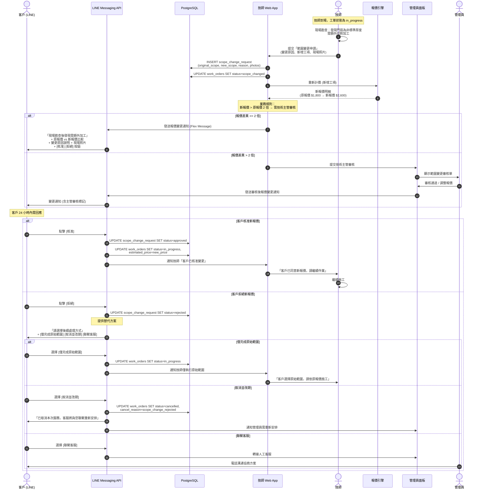

# SF-WO-03 — scope change

> Work Order BF 的子流程 3 of 13。

## 6. Flow 3：範圍變更 — 對應 F-008

> **Endpoints（Week 4 補完）：** `createScopeChangeRequest`（`POST /work-orders/{id}/scope-change`）, `approveScopeChange`, `rejectScopeChange`
> **Events Out:** `work_order.scope.change_requested`, `work_order.scope.change_approved|rejected`
> **Idempotency:** Required on 新增 scope change（避免雙送報價）
> **Error codes:** `SCOPE_CHANGE_REJECTED`, `WORK_ORDER_STATUS_INVALID`（非 `in_progress` 不能改）
> **Related pages:** T5（19 範圍變更）→ A12 管理員審核 → 客戶 LINE Flex 確認

### 6.1 觸發條件

- 技師到場後發現現場狀況與 ProblemCard 描述不符
- 需要額外工序 (如：門扇加工、更換型號)
- 維修範圍擴大導致報價變動

### 6.2 參與角色

Technician, Customer, Admin, Dispatch_Engine

### 6.3 流程圖

### 6.4 狀態轉換表

| 步驟 | 來源狀態 | 目標狀態 | 觸發動作 |
|------|----------|----------|----------|
| 1 | `in_progress` | `scope_changed` | 技師提交範圍變更 |
| 2a | `scope_changed` | `in_progress` | 客戶核准新報價 |
| 2b | `scope_changed` | `in_progress` | 客戶選擇僅完成原始範圍 |
| 2c | `scope_changed` | `cancelled` | 客戶拒絕且選擇取消 |

### 6.5 通知清單

| 時機 | 通知方式 | 接收者 | 內容摘要 |
|------|----------|--------|----------|
| 範圍變更提交 | LINE Flex | Customer | 原報價 vs 新報價 + 變更原因 + 照片 |
| 報價 > 2 倍 | Web Alert | Admin | 需技術主管審核 |
| 客戶核准 | Web Push | Technician | 客戶已同意新報價 |
| 客戶拒絕 | Web Push | Technician | 客戶選擇方案 (原範圍/取消/協商) |
| 24 小時未回應 | LINE Push | Customer | 提醒確認範圍變更 |
| 24 小時未回應 | Web Alert | Admin | 範圍變更超時未回應 |

---
