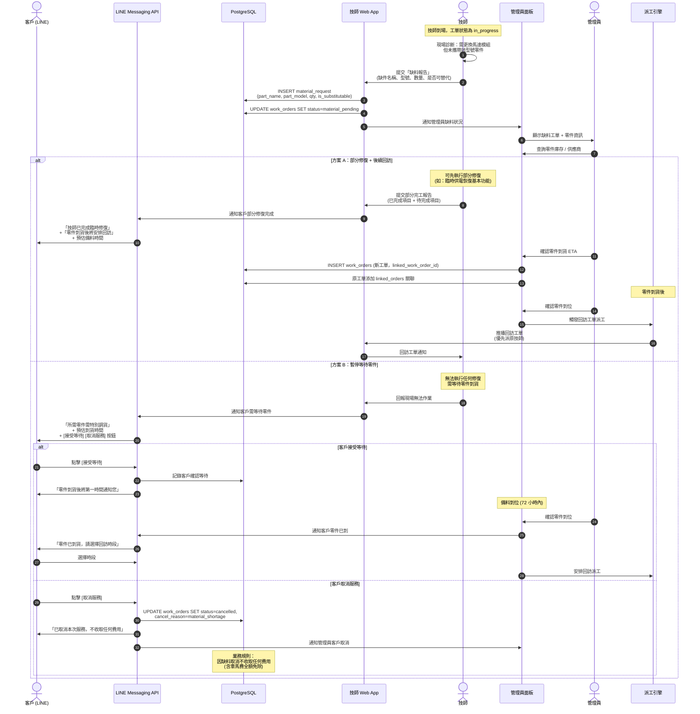

# SF-WO-04 — material shortage

> Work Order BF 的子流程 4 of 13。

## 7. Flow 4：缺料處理 — 對應 F-007

> **Endpoints（Week 4 補完）：** `createMaterialRequest`（`POST /work-orders/{id}/material-request`）, `getInventoryAvailability`
> **Events Out:** `work_order.material.requested`, `inventory.low_stock.alert`（若觸發閾值，走 G3）
> **Idempotency:** Required on 缺料申請
> **Error codes:** `MATERIAL_REQUEST_PENDING`, `INVENTORY_INSUFFICIENT`, `INVENTORY_PART_NOT_FOUND`
> **Related pages:** T6（19 缺料）→ A12 / A19 庫存 → G3 補貨流程（flows-admin-governance）

### 7.1 觸發條件

- 技師到場後發現所需零件未攜帶或庫存不足
- 零件型號與現場實際不符需特殊零件

### 7.2 參與角色

Technician, Customer, Admin, Dispatch_Engine

### 7.3 流程圖

### 7.4 狀態轉換表

| 步驟 | 來源狀態 | 目標狀態 | 觸發動作 |
|------|----------|----------|----------|
| 1 | `in_progress` | `material_pending` | 技師回報缺料 |
| 2a | `material_pending` | `completed` (部分) | 部分修復完成 + 建立回訪工單 |
| 2b | `material_pending` | `material_pending` | 等待零件到貨 |
| 3a | `material_pending` | `in_progress` | 備料到位 → 繼續作業 |
| 3b | `material_pending` | `cancelled` | 客戶不願等待取消 |
| 回訪 | `created` (新工單) | ... | 備料完成後建立新工單 |

### 7.5 通知清單

| 時機 | 通知方式 | 接收者 | 內容摘要 |
|------|----------|--------|----------|
| 缺料回報 | Web Alert | Admin | 缺件名稱、型號、工單編號 |
| 缺料回報 | LINE Push | Customer | 缺料狀況說明 + 預估備料時間 |
| 部分修復完成 | LINE Flex | Customer | 已完成項目 + 回訪時程 |
| 零件到位 | LINE Push | Customer | 零件到貨通知 + 預約回訪 |
| 零件到位 | Web Push | Technician | 回訪工單通知 |
| 72 小時未到貨 | Web Alert | Admin | 備料超時警報 |

---
