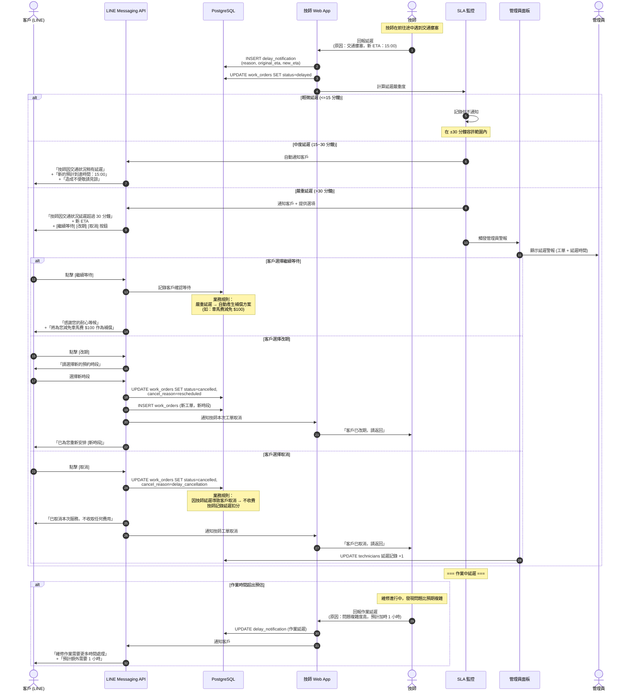

# SF-WO-05 — reschedule delay notice

> Work Order BF 的子流程 5 of 13。

## 8. Flow 5：延遲通知與改期 — 對應 F-010

> **Endpoints:** `postDelayNotification`（Week 4）, `getTechnicianAvailability`, `proposeReschedule`（T11）
> **Events Out:** `work_order.delay.notified`, `work_order.reschedule.proposed`, `work_order.reschedule.confirmed_by_customer`
> **Idempotency:** Required on 延遲通知 + 改期提案
> **Error codes:** `DELAY_NOTIFICATION_LIMIT_EXCEEDED`, `RESCHEDULE_LIMIT_EXCEEDED`, `RESCHEDULE_SLOT_TAKEN`, `RESCHEDULE_RSVP_EXPIRED`
> **Related pages:** T7（19 延遲）→ **T11 改期日曆** → 客戶 LINE Flex RSVP（19 T1.4 補強）

### 8.1 觸發條件

- 技師預計無法在預約時段內到達
- 維修作業時間超出預估
- 交通或天氣等外部因素導致延遲

### 8.2 參與角色

Technician, Customer, Admin

### 8.3 流程圖

### 8.4 狀態轉換表

| 步驟 | 來源狀態 | 目標狀態 | 觸發動作 |
|------|----------|----------|----------|
| 1 | `accepted` / `in_progress` | `delayed` | 技師回報延遲 |
| 2a | `delayed` | `in_progress` | 輕微延遲 → 技師到場 |
| 2b | `delayed` | `cancelled` + `created` | 客戶改期 → 取消舊單 + 建新單 |
| 2c | `delayed` | `cancelled` | 客戶取消 |

### 8.5 通知清單

| 時機 | 通知方式 | 接收者 | 內容摘要 |
|------|----------|--------|----------|
| 中度延遲 (15~30 min) | LINE Push | Customer | 延遲說明 + 新 ETA |
| 嚴重延遲 (>30 min) | LINE Flex | Customer | 延遲說明 + 繼續/改期/取消 選項 |
| 嚴重延遲 (>30 min) | Web Alert | Admin | 延遲警報 + 工單資訊 |
| 客戶確認等待 | — | — | 自動產生補償方案 |
| 客戶改期 | Web Push | Technician | 本次工單取消，客戶已改期 |
| 作業延遲 | LINE Push | Customer | 預計額外所需時間 |

### 8.6 補償規則

| 延遲程度 | 補償方案 | 自動/人工 |
|----------|----------|-----------|
| 15~30 分鐘 | 無補償 (在 SLA 容許範圍) | — |
| 30~60 分鐘 | 車馬費減免 $100 | 自動 |
| > 60 分鐘 | 車馬費全免 + $200 折扣碼 | 自動 |
| 技師未到 (no-show) | 全額免費 + $500 折扣碼 + 優先重派 | 自動 + 人工跟進 |

---
