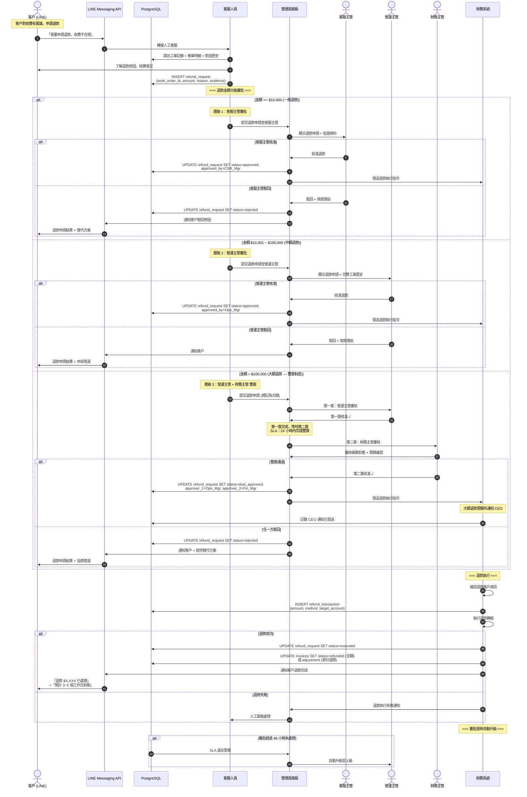

# SF-WO-06 — refund dual sign

> Work Order BF 的子流程 6 of 13。

## 9. Flow 6：退款審批與大額雙簽 — 對應 F-013 / F-014

> **Endpoints:** `openapi#operationId=submitRefundDecision`（Idempotency 必填）；待補：`listRefunds`, `getRefund`, `submitRefundSignature`（Week 3）
> **Events In:** `refund.requested`（客戶發起）
> **Events Out:** `refund.decision.made` (`/realtime/refunds`)，含 `dual_sign_pending=true`；完成後 `refund.completed`
> **Idempotency:** Required on `submitRefundDecision`（避免重覆審核）及第二簽核（Step 7-9）
> **Error codes:** `REFUND_DUAL_SIGN_REQUIRED`（金額 > 5000 或 100,000）, `REFUND_DECISION_LOCKED`
> **Dual-sign thresholds:** NT$ 5,000（第二簽核 `accountant`）; NT$ 100,000（升級 `tenant_admin`）
> **Related pages:** A17（10_admin_advanced 退款子頁）→ G4 爭議銜接

### 9.1 觸發條件

- 客戶透過 LINE 或客服申請退款
- 工單完成後客戶對服務品質/收費不滿
- 爭議處理結果為退款

### 9.2 參與角色

Customer, Admin, Finance

### 9.3 流程圖

### 9.4 狀態轉換表

| 步驟 | 來源狀態 | 目標狀態 | 觸發動作 |
|------|----------|----------|----------|
| 1 | — | `refund_pending` | 客服建立退款申請 |
| 2a | `refund_pending` | `refund_approved` | 單簽核准 (<= $100K) |
| 2b | `refund_pending` | `refund_dual_approved` | 雙簽核准 (> $100K) |
| 2c | `refund_pending` | `refund_rejected` | 審批駁回 |
| 3 | `refund_approved` / `refund_dual_approved` | `refund_executed` | 財務完成退款 |
| 4 | `refund_executed` | `refund_failed` | 退款轉帳失敗 |

### 9.5 通知清單

| 時機 | 通知方式 | 接收者 | 內容摘要 |
|------|----------|--------|----------|
| 退款申請建立 | Web Alert | 審批人 (依金額) | 退款申請詳情 |
| 審批完成 | LINE Push | Customer | 審批結果 |
| 雙簽第一簽 | Web Alert | 財務主管 | 等待第二簽 |
| 退款執行完成 | LINE Flex | Customer | 退款金額 + 到帳預估 |
| 退款失敗 | Web Alert | Admin, Finance | 需人工跟進 |
| 審批超時 | Web Alert | 上級主管 | SLA 違反自動升級 |
| 大額退款 (> $100K) | Email | CEO | 大額退款通知 |

### 9.6 審批層級表

| 退款金額 | 審批層級 | 審批人 | SLA |
|----------|----------|--------|-----|
| <= $10,000 | 單簽 | 客服主管 | 24 小時 |
| $10,001 ~ $100,000 | 單簽 | 營運主管 | 24 小時 |
| > $100,000 | 雙簽 | 營運主管 + 財務主管 | 24 小時 (每簽) |
| > $100,000 (核准後) | 通知 | CEO | 知會 (不需核准) |

---
