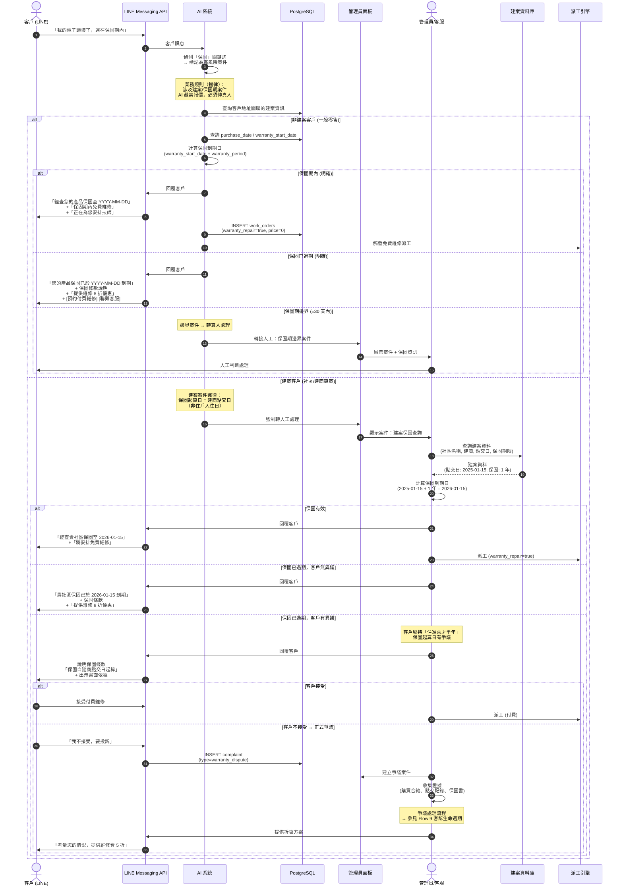

# SF-WO-07 — warranty dispute

> Work Order BF 的子流程 7 of 13。

## 10. Flow 7：保固爭議 — 對應 F-015

> **Endpoints（Week 4 補完）：** `createWarrantyClaim`, `verifyWarrantyPeriod`, `proposeDiscountCompromise`
> **Events Out:** `warranty.claim.created`, `warranty.claim.resolved`, `warranty.out_of_period.declined`
> **Idempotency:** Required on 建立索賠
> **Error codes:** `WARRANTY_OUT_OF_PERIOD`, `DISPUTE_SLA_OVERDUE`
> **Related pages:** A21 保固索賠 → A22 爭議（升級）→ G4 爭議仲裁（flows-admin-governance §5）
> **Note:** 與 G4 分界 — 本 Flow 處理「保固認定 + 修復」；G4 處理「金額賠償裁決」

### 10.1 觸發條件

- 客戶宣稱產品在保固期內故障
- 保固起算日認定有爭議 (常見：點交日 vs 入住日)
- 保固期邊界案件

### 10.2 參與角色

Customer, AI_System, Admin

### 10.3 流程圖

### 10.4 狀態轉換表

| 步驟 | 來源狀態 | 目標狀態 | 觸發動作 |
|------|----------|----------|----------|
| 1 | — | `created` | 保固查詢 → 確認免費維修 → 建立工單 |
| 2 | — | — | 保固過期 → 客戶選擇付費維修 → 建立工單 |
| 3 | — | `disputed` | 保固認定爭議 → 進入爭議流程 |

### 10.5 通知清單

| 時機 | 通知方式 | 接收者 | 內容摘要 |
|------|----------|--------|----------|
| 保固關鍵詞觸發 | Web Alert | Admin | 高風險案件：保固查詢 |
| 建案案件 | Web Alert | Admin | 強制轉人工：建案保固 |
| 保固確認 (有效) | LINE Flex | Customer | 保固期限 + 免費維修安排 |
| 保固確認 (過期) | LINE Flex | Customer | 到期日 + 優惠方案 |
| 爭議建立 | Web Alert | Admin | 保固爭議案件 |

### 10.6 業務規則

| 規則 | 說明 |
|------|------|
| 保固起算日 | 建案客戶 = 建商點交日；零售客戶 = 購買日 |
| AI 報價禁令 | 涉及建案/保固案件，AI 嚴禁自動報價 |
| 邊界案件 | 保固到期前後 30 天內的案件一律轉人工 |
| 善意折讓 | 保固剛過期 (< 90 天) 可提供 8 折優惠 |
| 證據保存 | 所有保固認定需保留書面查詢記錄 |

---
