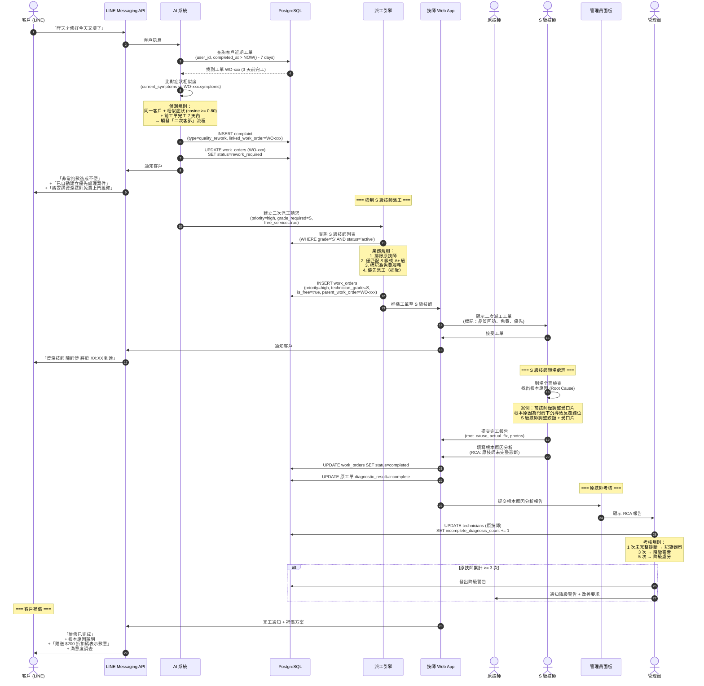

# SF-WO-08 — quality failure second dispatch

> Work Order BF 的子流程 8 of 13。

## 11. Flow 8：品質不合格與二次派工 — 對應 F-015 / F-008

> **Endpoints:** `createReworkOrder`（Week 4）, `listDispatchCandidates`（篩選 S 級）, `assignWorkOrder`
> **Events Out:** `work_order.rework.required`, `work_order.status.changed`
> **Idempotency:** Required on 建立二次工單
> **Error codes:** `WORK_ORDER_CONFLICT`（原工單已結案）, `DISPATCH_OVERRIDE_REQUIRED`（強制 S 級可能需 override）
> **Related pages:** A12 → **A37 派工人工介入**（S 級快篩）→ 原技師扣分（A20 稽核）

### 11.1 觸發條件

- 客戶在完工後 7 天內反映相同故障症狀 (「修了又壞」)
- 系統自動偵測：同一客戶 + 同一症狀 + 7 天內

### 11.2 參與角色

Customer, AI_System, Dispatch_Engine, Technician, Admin

### 11.3 流程圖

### 11.4 狀態轉換表

| 步驟 | 來源狀態 | 目標狀態 | 觸發動作 |
|------|----------|----------|----------|
| 1 | `confirmed` / `completed` (原工單) | `rework_required` | 系統偵測 7 天內同症狀 |
| 2 | — (新工單) | `created` | 建立二次派工工單 |
| 3 | `created` | `assigned` | 強制 S 級技師匹配 |
| 4 | `assigned` | `accepted` | S 級技師接受 |
| 5 | `accepted` | `in_progress` | S 級技師到場 |
| 6 | `in_progress` | `completed` | 提交完工報告 + RCA |

### 11.5 通知清單

| 時機 | 通知方式 | 接收者 | 內容摘要 |
|------|----------|--------|----------|
| 二次客訴偵測 | LINE Push | Customer | 已建立優先案件 + 免費維修 |
| 二次客訴偵測 | Web Alert | Admin | 品質問題警報 + 原工單資訊 |
| S 級技師接單 | LINE Flex | Customer | 資深技師資訊 + 到達時間 |
| 完工 + RCA | Web Alert | Admin | 根本原因報告 |
| 原技師考核 | Web Push | 原技師 | 記錄通知 / 降級警告 |
| 客戶補償 | LINE Flex | Customer | 完工通知 + 折扣碼 |

### 11.6 偵測規則

| 參數 | 閾值 | 說明 |
|------|------|------|
| 時間窗口 | 7 天 | 前工單完工後 7 天內 |
| 症狀相似度 | cosine >= 0.80 | 使用 text-embedding-004 向量比對 |
| 客戶匹配 | 同一 user_id | 同一客戶帳號 |
| 自動觸發 | 是 | 無需人工介入 |

---
