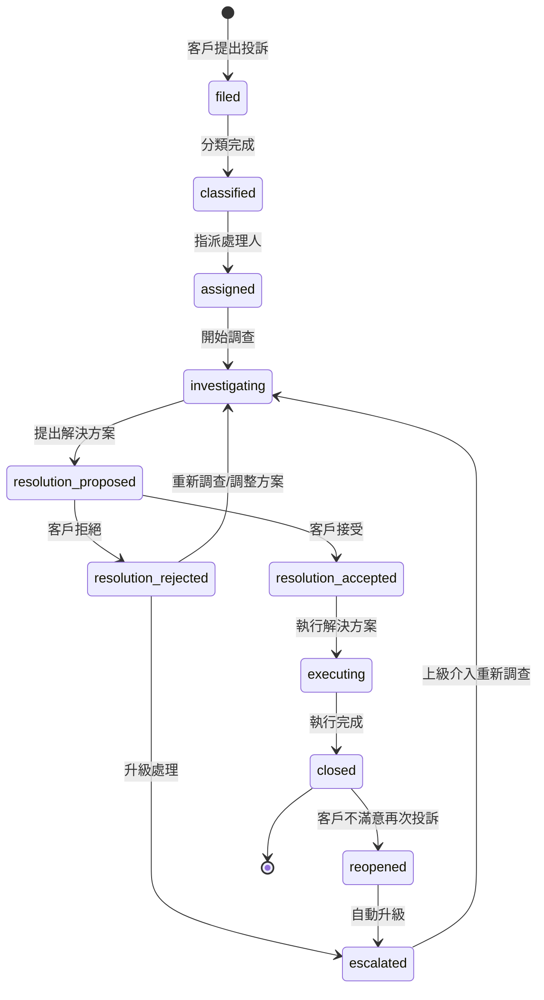
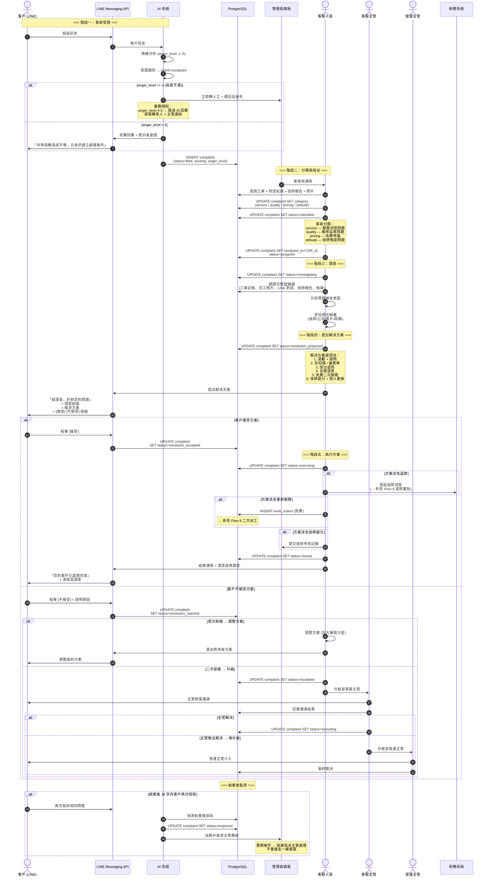

# SF-WO-09 — customer complaint lifecycle

> Work Order BF 的子流程 9 of 13。

## 12. Flow 9：客訴處理完整生命週期 — 對應 F-018 / F-016（admin G4 升級）

> **Endpoints（Week 4 補完）：** `createComplaint`, `classifyComplaint`, `proposeResolution`, `escalateComplaint`, `acknowledgeComplaint`
> **Events In:** LINE webhook `message.text`（含 anger_level 分析）
> **Events Out:** `complaint.created`, `complaint.escalated`, `complaint.resolved`, `complaint.reopened`
> **Idempotency:** Required on 升級 / resolve / acknowledge
> **Error codes:** `COMPLAINT_ALREADY_IN_DISPUTE`, `DISPUTE_MERGE_FAILED`
> **Related pages:** A12 客訴升級 indicator + A22 爭議（§27.2 併入規則） + G4 爭議仲裁
> **Note:** 與 G4 銜接規則見 §27（Flow 9 補遺）

### 12.1 觸發條件

- 客戶透過 LINE 或電話提出投訴
- 系統自動偵測客戶負面情緒 (anger level >= 3)
- 其他流程升級 (如保固爭議、範圍變更糾紛)

### 12.2 參與角色

Customer, AI_System, Admin, Finance

### 12.3 客訴狀態機

### 12.4 流程圖

### 12.5 狀態轉換表

| 步驟 | 來源狀態 | 目標狀態 | 觸發動作 |
|------|----------|----------|----------|
| 1 | — | `filed` | 客戶投訴 / AI 偵測 |
| 2 | `filed` | `classified` | 客服分類 (service/quality/pricing/attitude) |
| 3 | `classified` | `assigned` | 指派客服人員 |
| 4 | `assigned` | `investigating` | 開始調查 |
| 5 | `investigating` | `resolution_proposed` | 提出方案 |
| 6a | `resolution_proposed` | `resolution_accepted` | 客戶接受 |
| 6b | `resolution_proposed` | `resolution_rejected` | 客戶拒絕 |
| 7a | `resolution_rejected` | `investigating` | 調整方案 |
| 7b | `resolution_rejected` | `escalated` | 二次拒絕 → 升級 |
| 8 | `escalated` | `investigating` | 上級介入重查 |
| 9 | `resolution_accepted` | `executing` | 執行方案 |
| 10 | `executing` | `closed` | 方案執行完成 |
| 11 | `closed` | `reopened` | 30 天內同問題再投訴 |
| 12 | `reopened` | `escalated` | 自動升級 |

### 12.6 通知清單

| 時機 | 通知方式 | 接收者 | 內容摘要 |
|------|----------|--------|----------|
| 投訴受理 | LINE Push | Customer | 已建立案件，處理中 |
| anger_level >= 4 | Web Alert (緊急) | CSR + 主管 | 高優先客訴 |
| 方案提出 | LINE Flex | Customer | 調查結論 + 方案 + 接受/拒絕 |
| 方案被拒 (2次) | Web Alert | 客服主管 | 需主管介入 |
| 升級至營運 | Web Alert | 營運主管 | 客訴升級 |
| 結案 | LINE Flex | Customer | 處理結果 + 滿意度調查 |
| 重開案件 | Web Alert | 主管 | 重複投訴自動升級 |

### 12.7 各類型客訴 SLA

| 客訴類型 | 嚴重度 | 首次回應 SLA | 解決 SLA | 升級時限 |
|----------|--------|-------------|----------|----------|
| 態度問題 | 中 | 2 小時 | 3 個工作日 | 24 小時 |
| 服務流程 | 中 | 2 小時 | 3 個工作日 | 24 小時 |
| 維修品質 | 高 | 1 小時 | 2 個工作日 | 12 小時 |
| 收費爭議 | 高 | 1 小時 | 2 個工作日 | 12 小時 |
| anger_level >= 4 | 緊急 | 15 分鐘 | 24 小時 | 4 小時 |
| anger_level = 5 | 危機 | 立即 | 12 小時 | 2 小時 |

---
