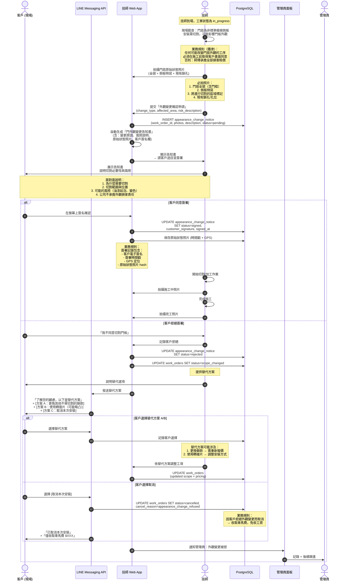

# SF-WO-10 — door appearance change

> Work Order BF 的子流程 10 of 13。

## 13. Flow 10：門外觀變更確認 — 對應 F-008 / F-006

> **Endpoints（Week 4 補完）：** `submitAppearanceNotice`（POST /work-orders/{id}/door-check）, `uploadEvidencePhotos`, `acknowledgeAppearanceNotice`
> **Events Out:** `work_order.appearance.notice_issued`, `work_order.appearance.signed|rejected`
> **Idempotency:** Required on 提交告知書與簽署
> **Error codes:** `APPEARANCE_CHANGE_EVIDENCE_INCOMPLETE`（少於 4 張照片）, `APPEARANCE_CHANGE_SIGNATURE_REJECTED`（拒簽 → 費用結算 §26）
> **Related pages:** T8（19 門面）→ T9 雙簽 → 拒簽則走 §26 費用結算

### 13.1 觸發條件

- 技師到場勘查後發現需切割非標準側板
- 安裝過程可能影響門扇外觀 (烤漆、表面處理)
- 任何可能造成門扇不可逆改變的工序

### 13.2 參與角色

Technician, Customer, Admin

### 13.3 流程圖

### 13.4 狀態轉換表

| 步驟 | 來源狀態 | 目標狀態 | 觸發動作 |
|------|----------|----------|----------|
| 1 | `in_progress` | `in_progress` (暫停) | 技師偵測到外觀變更需求 |
| 2a | `in_progress` | `in_progress` (繼續) | 客戶簽署同意書 → 繼續施工 |
| 2b | `in_progress` | `scope_changed` | 客戶拒絕 → 討論替代方案 |
| 3a | `scope_changed` | `in_progress` | 客戶選擇替代方案 |
| 3b | `scope_changed` | `cancelled` | 客戶取消安裝 |

### 13.5 通知清單

| 時機 | 通知方式 | 接收者 | 內容摘要 |
|------|----------|--------|----------|
| 外觀變更申請 | — | Customer (面對面) | 告知書面對面說明 |
| 客戶簽署 | Web Push | Admin | 記錄存檔 |
| 客戶拒絕 | LINE Flex | Customer | 替代方案選項 |
| 客戶拒絕 | Web Alert | Admin | 外觀變更被拒通知 |
| 取消安裝 | LINE Flex | Customer | 取消確認 + 車馬費 |

### 13.6 證據保存規範

| 項目 | 要求 | 說明 |
|------|------|------|
| 原始狀態照片 | 最少 4 張 | 全貌、側板、切割區域、現有孔位 |
| 電子簽名 | 含時間戳 + GPS | 不可事後補簽 |
| 照片 hash | SHA-256 | 防止事後篡改 |
| 施工中照片 | 最少 1 張 | 記錄加工過程 |
| 完工照片 | 最少 2 張 | 記錄最終結果 |
| 保存期限 | 永久 | 作為爭議處理依據 |

---
