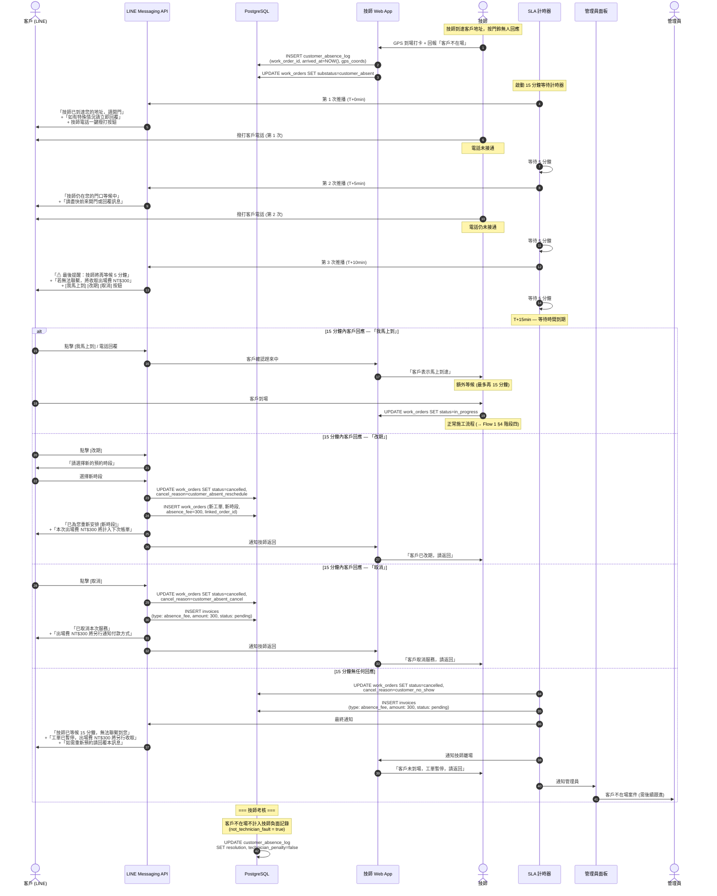

# SF-WO-11 — customer not onsite

> Work Order BF 的子流程 11 of 13。

## 19. Flow 11：客戶不在場 — 對應 F-010 / F-016

> **Endpoints:** `reportCustomerAbsent`（Week 4）, `proposeReschedule`（T11）
> **Events Out:** `customer.absent.reported`, `work_order.reschedule.proposed`
> **Idempotency:** Required on 回報不在場與改期
> **Error codes:** `RESCHEDULE_RSVP_EXPIRED`, `RESCHEDULE_LIMIT_EXCEEDED`
> **Related pages:** T3 → **T11 改期日曆** + 客戶 LINE Flex RSVP（19 T1.4 閉環）

> **Gap ID**：OP-03 — 技師到場但客戶不在家的處理流程

### 19.1 觸發條件

- 技師到場 GPS 打卡後，無法聯繫到客戶 (門鈴無人應答、電話未接)
- 工單狀態從 `accepted` 準備轉為 `in_progress` 時觸發

### 19.2 參與角色

Technician, Customer, Admin, Finance

### 19.3 流程圖

### 19.4 狀態轉換表

| 步驟 | 來源狀態 | 目標狀態 | 觸發動作 |
|------|----------|----------|----------|
| 1 | `accepted` | `accepted` (substatus: customer_absent) | 技師到場但客戶不在 |
| 2a | customer_absent | `in_progress` | 客戶在 15 分鐘內到場 |
| 2b | customer_absent | `cancelled` + `created` (新單) | 客戶選擇改期 |
| 2c | customer_absent | `cancelled` | 客戶取消 / 15 分鐘無回應 |

### 19.5 通知清單

| 時機 | 通知方式 | 接收者 | 內容摘要 |
|------|----------|--------|----------|
| T+0 min (到場) | LINE Push + 電話 | Customer | 技師到達通知 + 一鍵撥打 |
| T+5 min | LINE Push + 電話 | Customer | 第 2 次提醒 |
| T+10 min | LINE Flex + 電話 | Customer | 最後提醒 + 出場費告知 + 選項按鈕 |
| T+15 min (超時) | LINE Push | Customer | 工單暫停 + 出場費收取通知 |
| T+15 min (超時) | Web Alert | Admin | 客戶不在場案件需跟進 |
| 任意時刻客戶回覆 | Web Push | Technician | 客戶回應 (趕來/改期/取消) |

### 19.6 業務規則

| 編號 | 規則 | 說明 |
|------|------|------|
| BR-F11-001 | 等待時間上限 15 分鐘 | 含 3 次 LINE 推播 (5 分鐘間隔) |
| BR-F11-002 | 出場費 NT$300 | 不論取消或改期，均收取出場費 |
| BR-F11-003 | 技師不受負面記錄 | `technician_penalty = false`，客戶不在場非技師責任 |
| BR-F11-004 | 改期時出場費計入下次帳單 | 不另開帳單，隨下次工單合併收取 |
| BR-F11-005 | 客戶說「我馬上到」額外等候上限 15 分鐘 | 超過再次觸發本流程 |
| BR-F11-006 | 單一客戶 3 個月內 2 次不在場 | 標記為高風險客戶，後續工單要求預付訂金 |

---
