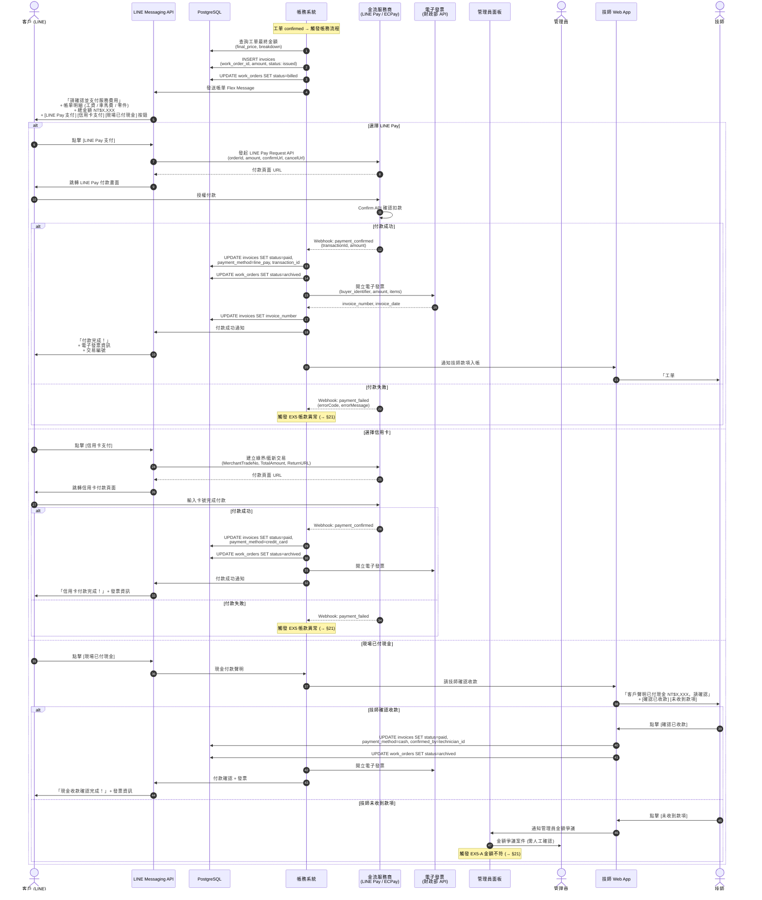

# SF-WO-12 — payment flow

> Work Order BF 的子流程 12 of 13。

## 20. Flow 12：金流與支付 — 對應 F-011 / F-012（V1.0，Q7=B 待 provider 選型）

> **Gap ID**：OP-01 — 原文件完全缺少付款階段，只有「帳務結清」一句帶過
>
> **Endpoints:** 待補（Week 3）：`createPayment`, `getPayment`, `issueInvoice`, `voidInvoice`；對應 schema `Invoice`（openapi.yaml#/components/schemas/Invoice）
> **Webhook（inbound）:** LINE Pay / 信用卡 / 現金（技師確認）— 帶 `X-Signature` + `Idempotency-Key`；失敗指數退避 1min → 24hr
> **Events In:** `work_order.billed`
> **Events Out:** `payment.confirmed`, `payment.failed`, `invoice.issued`, `invoice.voided`
> **Idempotency:** 所有金流 webhook 與 `createPayment` 強制 Idempotency-Key（24h 窗）
> **Error codes:** `PAYMENT_FAILED`, `PAYMENT_ALREADY_PROCESSED`, `INVOICE_ISSUE_FAILED`, `INVOICE_ALLOWANCE_INVALID`
> **Related pages:** A9（09_admin_accounting）+ 客戶 LINE 支付 Flex
> **SSOT schema:** `Invoice`（invoice_number 遵循 `^[A-Z]{2}\d{8}$` 格式、`category=service_fee|travel_fee|parts|other`、`status=pending|issued|allowance_pending|voided|reopened`）

### 20.1 觸發條件

- 工單狀態從 `confirmed` 轉為 `billed` (客戶確認完工後系統自動開帳)
- 人工補開帳單 (管理員手動觸發)

### 20.2 參與角色

Customer, Finance, Admin, Technician

### 20.3 支付方式矩陣

| 支付方式 | 金流服務商 | 手續費率 | 入帳時間 | 適用場景 |
|----------|-----------|---------|----------|----------|
| LINE Pay | LINE Pay API v3 | 2.75% | T+2 工作日 | LINE 內一鍵支付 (主推) |
| 信用卡 | 綠界 ECPay / 藍新 NewebPay | 2.5~3% | T+7 工作日 | 高單價工單 |
| 現金 | — | 0% | 即時 | 技師現場收款 (需回報) |

### 20.4 電子發票規格

| 項目 | 規格 | 說明 |
|------|------|------|
| 發票類型 | B2C 電子發票 | 財政部大平台 API |
| 載具 | 手機條碼 / 自然人憑證 / 會員載具 | 客戶 LINE 綁定時提供 |
| 格式 | 財政部 MIG 4.0 | JSON 格式上傳 |
| 發票時機 | 付款完成後 5 分鐘內 | 自動開立 |
| 保存期限 | 5 年 (依統一發票使用辦法) | — |

### 20.5 流程圖

### 20.6 狀態轉換表

| 步驟 | 來源狀態 | 目標狀態 | 觸發動作 | 耗時預估 |
|------|----------|----------|----------|----------|
| 1 | `confirmed` | `billed` | 系統自動開立帳單 | < 1 秒 |
| 2a | `billed` | `archived` | LINE Pay / 信用卡 付款成功 | < 5 分鐘 |
| 2b | `billed` | `archived` | 現金付款 + 技師確認 | < 10 分鐘 |
| 2c | `billed` | `disputed` | 付款失敗 / 金額爭議 → EX5 | — |

### 20.7 通知清單

| 時機 | 通知方式 | 接收者 | 內容摘要 |
|------|----------|--------|----------|
| 帳單開立 | LINE Flex | Customer | 帳單明細 + 支付方式選擇 |
| 付款成功 | LINE Flex | Customer | 付款確認 + 電子發票 + 交易編號 |
| 付款成功 | Web Push | Technician | 款項入帳通知 |
| 付款失敗 | LINE Push | Customer | 付款失敗 + 重試選項 |
| 付款失敗 | Web Alert | Admin | 付款異常案件 |
| 帳單逾期 (7 天) | LINE Push | Customer | 付款提醒 |
| 現金確認請求 | Web Push | Technician | 確認現金收款 |

---
