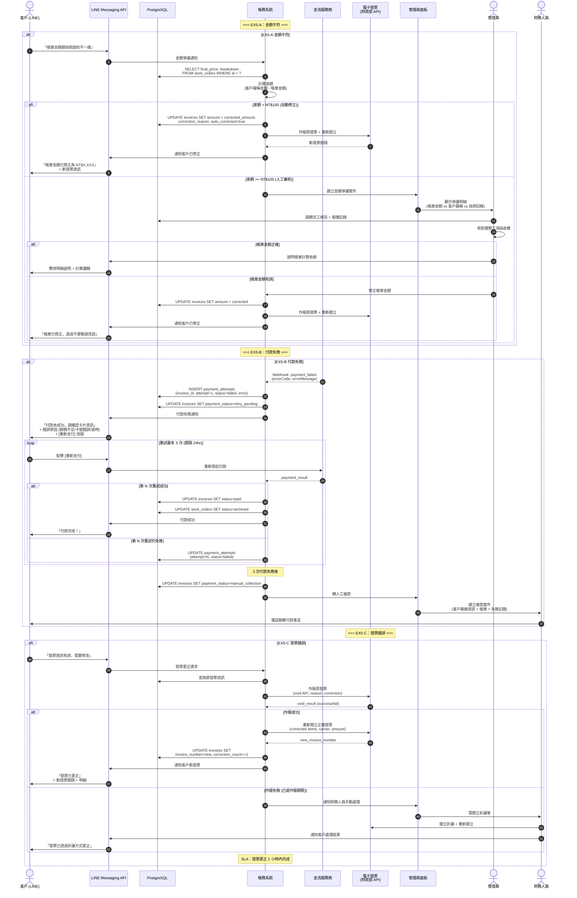

# SF-WO-13 — settlement anomaly

> Work Order BF 的子流程 13 of 13。

## 21. Flow 13：帳款異常 EX5 — 對應 F-013 / F-014 / F-021

> **Endpoints（Week 4 補完）：** `flagBillingException`, `reopenInvoice`, `issueAllowance`, `retryPayment`
> **Webhook（inbound）:** 金流三平台 `payment.failed` / `payment.refund.failed`
> **Events Out:** `invoice.voided`, `invoice.allowance.issued`, `billing.exception.flagged`
> **Idempotency:** Required on 發票重開 / 折讓 / 重試付款
> **Error codes:** `INVOICE_VOID_WINDOW_EXPIRED`, `INVOICE_DUPLICATE_NUMBER`, `WEBHOOK_AMOUNT_MISMATCH`, `PAYMENT_ALREADY_PROCESSED`
> **Related pages:** A9 帳務 / A20 稽核 + webhook-spec §4 發票規範

> **Gap ID**：OP-02 — 原文件缺少付款失敗、金額不符、發票錯誤的處理流程

### 21.1 觸發條件

- EX5-A：客戶/技師回報金額與帳單不符
- EX5-B：線上付款失敗 (卡號錯誤、餘額不足、交易逾時)
- EX5-C：電子發票開立錯誤 (品項、金額、載具錯誤)

### 21.2 參與角色

Customer, Finance, Admin, Technician

### 21.3 流程圖

### 21.4 狀態轉換表

| 步驟 | 異常類型 | 來源狀態 | 目標狀態 | 觸發動作 |
|------|----------|----------|----------|----------|
| 1a | EX5-A | `billed` | `billed` (修正) | 差額 < $100 自動修正 |
| 1b | EX5-A | `billed` | `disputed` | 差額 >= $100 人工審核 |
| 2a | EX5-B | `billed` | `billed` (retry) | 付款失敗 → 重試 |
| 2b | EX5-B | `billed` | `billed` (manual) | 3 次失敗 → 人工催款 |
| 3 | EX5-C | `billed` / `archived` | 不變 | 發票作廢 + 重開 |

### 21.5 通知清單

| 時機 | 通知方式 | 接收者 | 內容摘要 |
|------|----------|--------|----------|
| 金額不符 (自動修正) | LINE Push | Customer | 帳單已修正 + 新發票 |
| 金額不符 (人工審核) | Web Alert | Admin | 金額爭議案件 |
| 付款失敗 | LINE Flex | Customer | 失敗原因 + 重新支付按鈕 |
| 3 次失敗 | Web Alert | Finance | 轉人工催款 |
| 發票更正完成 | LINE Push | Customer | 新發票號碼 + 明細 |
| 發票更正超時 | Web Alert | Finance | 超過 2hr SLA |

### 21.6 業務規則

| 編號 | 規則 | 閾值 | 動作 |
|------|------|------|------|
| BR-EX5-001 | 金額不符自動修正閾值 | 差額 < NT$100 | 系統自動修正 + 重開發票 |
| BR-EX5-002 | 金額不符人工審核閾值 | 差額 >= NT$100 | 建立爭議案件 → 人工核對 |
| BR-EX5-003 | 付款重試次數上限 | 3 次 | 超過轉人工催款 |
| BR-EX5-004 | 付款重試間隔 | 24 小時 | 每 24hr 發送一次付款提醒 |
| BR-EX5-005 | 發票更正 SLA | 2 小時 | 超時升級至財務主管 |
| BR-EX5-006 | 單一工單發票修正次數上限 | 3 次 | 超過需財務主管審核 |

---
