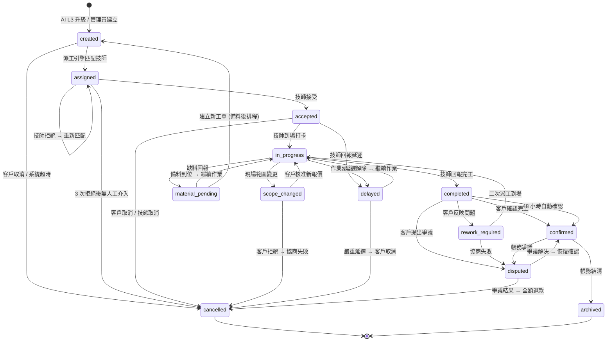

# Work Order State Machine

> 16 個狀態 + 完整轉換表，從 BF-work-order §1 抽出。

## 1. 完整狀態機

### 1.1 工單狀態定義

| 狀態 | 識別碼 | 說明 | 可停留最大時間 |
|------|--------|------|----------------|
| 已建立 | `created` | 工單由 AI 系統或管理員建立，尚未派工 | 5 分鐘 |
| 已派工 | `assigned` | 派工引擎已匹配技師，等待技師回應 | 15 分鐘 |
| 已接受 | `accepted` | 技師確認接受工單 | 依預約時間 |
| 進行中 | `in_progress` | 技師已到場開始作業 | 依工種 (一般 2 小時) |
| 範圍變更 | `scope_changed` | 現場狀況與 ProblemCard 不符，需重新報價 | 24 小時 |
| 缺料中 | `material_pending` | 現場缺少必要零件，等待備料 | 72 小時 |
| 延遲中 | `delayed` | 技師無法準時到達或作業延遲 | 依新 ETA |
| 已完工 | `completed` | 技師回報完工，等待客戶確認 | 48 小時 |
| 返工中 | `rework_required` | 客戶反映修復不良，需二次處理 | 24 小時 |
| 已確認 | `confirmed` | 客戶確認完工，觸發帳務流程 | 30 天 |
| 已歸檔 | `archived` | 帳務結清，工單歸檔 | 永久 |
| 已取消 | `cancelled` | 工單取消 (附取消原因) | 終態 |
| 爭議中 | `disputed` | 工單進入爭議處理流程 | 依爭議類型 |

### 1.2 狀態轉換圖

### 1.3 狀態轉換規則表

| 來源狀態 | 目標狀態 | 觸發條件 | 授權角色 | 是否需審批 |
|----------|----------|----------|----------|-----------|
| `created` | `assigned` | 派工引擎自動匹配完成 | System | 否 |
| `created` | `cancelled` | 客戶主動取消 / 5 分鐘無匹配 | Customer, System | 否 |
| `assigned` | `accepted` | 技師點擊「接受工單」 | Technician | 否 |
| `assigned` | `assigned` | 技師拒絕 → 匹配下一位 | Technician, System | 否 |
| `assigned` | `cancelled` | 連續 3 位技師拒絕且無人工介入 | Admin | 是 |
| `accepted` | `in_progress` | 技師到場 GPS 打卡 | Technician | 否 |
| `accepted` | `delayed` | 技師回報延遲並提供新 ETA | Technician | 否 |
| `accepted` | `cancelled` | 客戶 / 技師申請取消 | Customer, Technician | 是 (Admin) |
| `in_progress` | `completed` | 技師提交完工報告 + 照片 | Technician | 否 |
| `in_progress` | `scope_changed` | 技師回報範圍變更 | Technician | 否 |
| `in_progress` | `material_pending` | 技師回報缺料 | Technician | 否 |
| `in_progress` | `delayed` | 作業時間超出預估 | Technician | 否 |
| `scope_changed` | `in_progress` | 客戶核准新報價 | Customer | 否 |
| `scope_changed` | `cancelled` | 客戶拒絕新報價且協商失敗 | Customer, Admin | 是 |
| `material_pending` | `in_progress` | 備料完成，技師恢復作業 | Technician | 否 |
| `material_pending` | `created` | 需另排時間回訪 (建立新工單) | System | 否 |
| `delayed` | `in_progress` | 延遲解除 | Technician | 否 |
| `delayed` | `cancelled` | 嚴重延遲且客戶不接受 | Customer, Admin | 是 |
| `completed` | `confirmed` | 客戶主動確認 / 48 小時自動確認 | Customer, System | 否 |
| `completed` | `rework_required` | 客戶反映同一問題 | Customer | 否 |
| `completed` | `disputed` | 客戶提出服務/價格爭議 | Customer | 否 |
| `rework_required` | `in_progress` | 二次派工技師到場 | Technician | 否 |
| `rework_required` | `disputed` | 二次維修仍不滿意 | Customer | 否 |
| `confirmed` | `archived` | 帳務結清、對帳完成 | Finance | 否 |
| `confirmed` | `disputed` | 帳務爭議 | Customer, Technician | 否 |
| `disputed` | `confirmed` | 爭議結案 → 恢復 | Admin | 是 |
| `disputed` | `cancelled` | 爭議結案 → 全額退款 | Admin, Finance | 是 (雙簽) |
| 任意狀態 | `cancelled` | 管理員強制取消 (附原因) | Admin | 是 |
| 任意狀態 | `disputed` | 客戶投訴升級 | Customer, Admin | 否 |

---

