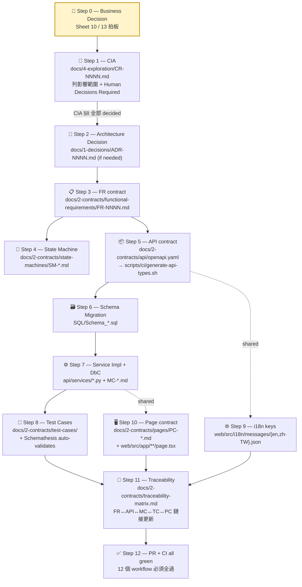

# Engineering Contracts Panorama — 工程契約全景圖

> **Why this doc exists**: 本 repo 在 `docs/2-contracts/` 累積了 24 個 MC、52 個 PC、~30 個 FR、5 個 MDS、2 個 SM、10+ ADR、12 個 CI workflow。新 engineer / AI agent 第一次看會 overload。本文是**一張地圖**告訴你：(1) 工程契約分幾層 (2) 每層在哪 (3) 誰把它鎖住不漂移 (4) 業務決策怎麼穿透這 10 層落地成 code。
>
> **Reader contract**: 讀完本文你應該能在 5 分鐘內回答「我要加一個新欄位，會影響哪 8 個契約檔？」這種問題。

---

## §1. 10-Layer Contract Stack — ASCII 速覽

```
                          ┌────────────────────────────────────────┐
                          │      🧠 Business Decision (Sheet 10)   │
                          │       —— 主管/會計/品牌商拍板           │
                          └────────────────┬───────────────────────┘
                                           ▼
┌─────────────────────────────────────────────────────────────────────────┐
│                                                                         │
│  L5  Frontend Contracts                                                 │
│  ┌─────────────────────────────────────────────────────────────────┐    │
│  │  Route Map     Page Spec     Component Props    Design Tokens   │    │
│  │  (Next router) (PC-*.md)     (TS from OpenAPI)  (DS-*.md / CSS) │    │
│  └─────────────────────────────────────────────────────────────────┘    │
│                                                                         │
│  L4  Quality Gates                                                      │
│  ┌─────────────────────────────────────────────────────────────────┐    │
│  │  Test (TC-*)   i18n keys     Traceability Matrix                │    │
│  │  BDD + Schemathesis    en/zh-TW sync       (FR↔API↔MC↔TC↔PC)    │    │
│  └─────────────────────────────────────────────────────────────────┘    │
│                                                                         │
│  L3  Behavioral Contracts                                               │
│  ┌─────────────────────────────────────────────────────────────────┐    │
│  │  Auth/RBAC     Idempotency    Pagination    Filter / Query      │    │
│  │  (deps.py)     (cr0001 表)     (cursor)      (per-router)        │    │
│  └─────────────────────────────────────────────────────────────────┘    │
│                                                                         │
│  L2  Data Contracts                                                     │
│  ┌─────────────────────────────────────────────────────────────────┐    │
│  │  Entity DbC      State Machine    Schema Migration   Master Data│    │
│  │  (MC-*.md)       (SM-*.md)        (SQL/Schema_*.sql) (MDS-*.md) │    │
│  └─────────────────────────────────────────────────────────────────┘    │
│                                                                         │
│  L1  Wire Format Contracts                                              │
│  ┌─────────────────────────────────────────────────────────────────┐    │
│  │  REST API           Async / Event           Error Envelope      │    │
│  │  (openapi.yaml)     (asyncapi.yaml +        (RFC 7807 in        │    │
│  │                      EVT-0001)               openapi schemas)   │    │
│  └─────────────────────────────────────────────────────────────────┘    │
│                                                                         │
└─────────────────────────────────────────────────────────────────────────┘
                                           │
                                           ▼
                          ┌────────────────────────────────────────┐
                          │      💻 Code (agent/ + api/ + web/)    │
                          │      Database (PostgreSQL)              │
                          └────────────────────────────────────────┘
```

---

## §2. Mermaid 版本 — 10 Layer Stack（同上圖，可在 GitHub 渲染）

```mermaid
flowchart TB
    BD["🧠 Business Decision<br/>(Sheet 10 — 主管/會計/品牌商拍板)"]:::business

    subgraph L5["L5 — Frontend Contracts"]
        direction LR
        L5a["Route Map<br/>(Next.js App Router)"]
        L5b["Page Spec<br/>(PC-*.md × 52)"]
        L5c["Component Props<br/>(api.generated.ts)"]
        L5d["Design Tokens<br/>(DS-*.md / CSS vars)"]
    end

    subgraph L4["L4 — Quality Gates"]
        direction LR
        L4a["BDD Tests<br/>(TC-*.md + registry.yaml)"]
        L4b["i18n Keys<br/>(en + zh-TW sync)"]
        L4c["Traceability Matrix<br/>(FR ↔ API ↔ MC ↔ TC ↔ PC)"]
    end

    subgraph L3["L3 — Behavioral Contracts"]
        direction LR
        L3a["Auth / RBAC<br/>(deps.py + RBAC schema)"]
        L3b["Idempotency<br/>(core/idempotency.py + cr0001 表)"]
        L3c["Pagination<br/>(core/pagination.py cursor)"]
        L3d["Filter / Query<br/>(per-router params)"]
    end

    subgraph L2["L2 — Data Contracts"]
        direction LR
        L2a["Entity DbC<br/>(MC-*.md × 24)"]
        L2b["State Machine<br/>(SM-*.md × 2)"]
        L2c["Schema Migration<br/>(SQL/Schema_*.sql)"]
        L2d["Master Data<br/>(MDS-*.md × 5)"]
    end

    subgraph L1["L1 — Wire Format"]
        direction LR
        L1a["REST API<br/>(openapi.yaml)"]
        L1b["Async / Event<br/>(asyncapi.yaml + EVT-0001)"]
        L1c["Error Envelope<br/>(RFC 7807)"]
    end

    CODE["💻 Code<br/>(agent/ + api/ + web/)<br/>+ PostgreSQL"]:::code

    BD --> L5
    L5 --> L4
    L4 --> L3
    L3 --> L2
    L2 --> L1
    L1 --> CODE

    classDef business fill:#fff4cc,stroke:#bf9000,stroke-width:2px
    classDef code fill:#d9ead3,stroke:#38761d,stroke-width:2px
```



---

## §3. Business Decision → 12 Engineering Actions（端到端流程）

業主拍板一條新規則（例：「取消費分層」）後，工程要動的 12 步：



**🚦 Skip rule**: 變更小範圍時可省略 Step 2/4/9/10。但 Step 1（CIA）+ Step 5（API）+ Step 11（Traceability）**永遠不能省** — 不寫 = AI slop。

---

## §4. CI Gate × Layer Enforcement Matrix

12 個 CI workflow 鎖哪幾層？哪些層還沒 CI 覆蓋？

| Layer | 契約類型 | CI Workflow / Script | 阻擋條件 |
|---|---|---|---|
| **L1** | REST API | `spec-lint.yml` | OpenAPI 違反 Spectral 規則 → 阻擋 |
| L1 | REST API | `api-types-sync.yml` | openapi.yaml 改了但 `web/types/api.generated.ts` 沒 re-gen → 阻擋 |
| L1 | REST API | `orphan-check.yml` (`scripts/ci/check-operationid-orphans.sh`) | API operationId 在 spec 有但 docs 沒對應，或反之 → 阻擋 |
| L1 | REST API | `mock-smoke.yml` (`scripts/ci/mock-server.sh` Prism) | spec 不能起 mock server → 阻擋 |
| L1 | Async/Event | `scripts/ci/asyncapi-validate.mjs`（在 test-suite 中） | AsyncAPI 結構違規 → 阻擋 |
| **L2** | Entity DbC | 🔴 **無 CI** | MC-*.md ↔ code drift 無自動檢（靠 PR review）|
| L2 | State Machine | 🔴 **無 CI** | SM-*.md ↔ code drift 無自動檢 |
| L2 | Schema Migration | `db-conn-lint.yml` | 連線 pattern 違規（autocommit、_ensure_conn）→ 阻擋 |
| L2 | Master Data | 🔴 **無 CI** | MDS-*.md governance 純人工 |
| **L3** | Auth / RBAC | 🟡 部分（test-suite 中） | RBAC policy 改了但測試沒跟 → 部分阻擋 |
| L3 | Idempotency | 🟡 `test-suite.yml` 中的單元測試 | 部分覆蓋 |
| L3 | Pagination | `scripts/ci/contract-schemathesis.sh`（spec-driven fuzz）| spec 與實作不符 → 阻擋 |
| L3 | Filter / Query | `contract-schemathesis.sh` 同上 | 同上 |
| **L4** | BDD Tests | `test-suite.yml` + `test-case-coverage.yml` | TC-*.md 覆蓋率 < 閾值 → 阻擋 |
| L4 | i18n Keys | `i18n-keys-sync-lint.yml` ✨ | en / zh-TW key 不一致 → 阻擋 |
| L4 | Traceability | 🟡 `sunnydata-auto-regen` skill | 半自動，靠 hook 觸發 |
| **L5** | Route Map | 🔴 **無 CI** | Next route ↔ PC-*.md 無自動同步 |
| L5 | Page Spec | 🔴 **無 CI** | PC-*.md 內容 ↔ page.tsx 無對齊驗證 |
| L5 | Component Props | `api-types-sync.yml` 自動產生 → TypeScript 編譯阻擋 | TS 編譯錯誤 → 阻擋 |
| L5 | Design Tokens | 🔴 **無 CI** | DS-*.md ↔ CSS vars 純人工 |
| **Cross** | Reverse Import | `reverse-import-lint.yml` ✨ | 反向依賴（下層 import 上層）→ 阻擋 |
| Cross | Bare Except | `bare-except-lint.yml` | `except:` 無類型 → 阻擋（強制 fail-soft 三件組分類）|
| Cross | Docker Build | `docker-build-smoke.yml` | image build 失敗 → 阻擋 |
| Cross | uv Lock | `uv-lock-check.yml` | lockfile drift → 阻擋 |

**🔴 = 完全沒 CI，🟡 = 半覆蓋，✨ = 業界少見的強項。**

**Coverage summary**: 10 層 × 21 個契約子類，有 11 個強 CI 覆蓋（52%）+ 4 個半覆蓋（19%）+ 6 個無覆蓋（29%）。**未覆蓋的 6 個都是 doc↔code drift 類** — 文件 spec 在但靠人工確保跟 code 一致。

---

## §5. Contract File Map — 「我要找 XX 在哪？」

```
docs/
├── 0-principles/                    # Tier 0: 不可違反的最高原則
│   └── PRIN-0001-flow-id-conventions.md
│
├── 1-decisions/                     # Tier 1: ADR + 模組邊界
│   ├── ARCH-0001-architecture-overview.md      ← 系統總覽
│   ├── DDD-0001-domain-model.md                ← Bounded contexts
│   ├── ADR-0001 ~ ADR-0030                     ← 30 條技術決策（append-only）
│   └── module-boundary/
│       ├── ARCH-0002-module-boundary-agent.md
│       └── ARCH-0003-module-boundary-api.md
│
├── 2-contracts/                     # Tier 2: 必須 = code 同步
│   ├── api/
│   │   ├── openapi.yaml             ← L1 REST API（單一真相源）
│   │   ├── asyncapi.yaml            ← L1 Async/WS/SSE
│   │   └── README.md
│   ├── events/
│   │   └── EVT-0001-domain-event-catalog.md    ← Domain events
│   ├── modules/                     ← L2 Entity DbC（24 份）
│   │   ├── INDEX.md
│   │   ├── MC-0001-audit-logger.md
│   │   ├── MC-0003-conversation-manager.md
│   │   ├── MC-0013-problem-card-engine.md
│   │   └── ... (24 個 module spec)
│   ├── state-machines/              ← L2 State Machine
│   │   ├── SM-0001-work-order.md
│   │   └── SM-0002-work-order-extensions.md
│   ├── master-data/                 ← L2 Master Data
│   │   ├── MDS-0001-brand-model.md
│   │   ├── MDS-0002-customer-device.md
│   │   ├── MDS-0003-fault-codes.md
│   │   ├── MDS-0004-fault-taxonomy.md
│   │   └── MDS-0005-materials-catalog.md
│   ├── functional-requirements/     ← L3 行為規範 + AC
│   │   └── FR-0001 ~ FR-0030+
│   ├── flows/                       ← Business / Sub flows
│   │   ├── business/
│   │   └── sub/
│   ├── test-cases/                  ← L4 Test contract
│   │   ├── INDEX.md
│   │   ├── CONVENTION.md
│   │   ├── registry.yaml
│   │   └── trace-overrides.yaml
│   ├── pages/                       ← L5 Frontend page contract（52 份）
│   │   ├── INDEX.md
│   │   ├── PC-A0-管理員登入.md
│   │   └── ... (52 個 page spec)
│   ├── frontend-design-system/      ← L5 Design tokens (md)
│   │   ├── DS-0000-brand-system.md
│   │   ├── DS-0001-foundations.md
│   │   └── ... (6 份)
│   ├── tool-registry.md             ← Agent tool / MCP contract
│   ├── cross-context-ownership.md   ← 跨 bounded context 邊界
│   ├── traceability-matrix.md       ← AUTO — FR↔API↔MC↔TC↔PC
│   ├── flow-index.md                ← AUTO — flow ID aggregate
│   └── README.md                    ← Tier 2 結構說明（必讀！）
│
├── 3-process/                       # Tier 3: 流程 SOP
│   ├── ONBOARD-0001-contracts-panorama.md      ← 本文
│   ├── PROC-0001 ~ PROC-0011                   ← 11 份 SOP
│   ├── QG-0001-quality-gates.md                ← CI gate 規格
│   └── TP-0001-test-plan.md                    ← Test plan
│
├── 4-exploration/                   # Tier 4: 每變更一份 CIA / PRD
│   ├── CR-0001-system-integration-gap-repair.md  ← 範例 CIA
│   ├── PRD-0001-2026-q1-v1-launch.md
│   └── ... (Discovery / WBS / SOW)
│
└── 5-views/                         # Tier 5: 自動生成快取（勿手改）
    └── (Auto-regen views — code 變動後重生)


SQL/                                 # L2 Schema migrations（純手寫 SQL）
├── Schema.sql                       ← Core tables
├── Schema_doc_numbering.sql
├── Schema_cr0001_integration_gaps.sql  ← 範例（最近）
├── Schema_harness_migration.sql
├── Schema_rbac_dynamic.sql
├── Schema_tech_schedule.sql
├── Schema_media.sql
├── Schema_api_phase1.sql
├── Schema_v2_extensions.sql
└── Schema_work_order_events.sql


web/types/api.generated.ts           # L5 Component Props（自動產生，勿手改）


.github/workflows/                   # 12 個 CI gate
├── spec-lint.yml                    ← L1 OpenAPI
├── api-types-sync.yml               ← L1↔L5 TS sync
├── orphan-check.yml                 ← L1 operationId
├── mock-smoke.yml                   ← L1 Prism mock
├── i18n-keys-sync-lint.yml          ← L4 i18n ✨
├── test-suite.yml                   ← L4 BDD + unit + AsyncAPI
├── test-case-coverage.yml           ← L4 TC coverage
├── db-conn-lint.yml                 ← L2 DB pattern
├── reverse-import-lint.yml          ← Cross 反向依賴 ✨
├── bare-except-lint.yml             ← Cross fail-soft
├── docker-build-smoke.yml           ← Cross build
└── uv-lock-check.yml                ← Cross dep lock


scripts/ci/                          # CI scripts
├── asyncapi-validate.mjs
├── check-operationid-orphans.sh
├── check-test-case-coverage.py
├── contract-schemathesis.sh         ← Property-based ✨
├── extract-test-cases.py
├── generate-api-types.sh
├── generate-mapping-api-index.sh
└── mock-server.sh
```

---

## §6. 「我要加 X 影響哪些檔」速查表

| 變更類型 | 必動的契約檔 | 必過的 CI |
|---|---|---|
| **加新 API endpoint** | openapi.yaml + MC-*.md + (FR-*.md) + TC-*.md + traceability | spec-lint, api-types-sync, orphan-check, mock-smoke, schemathesis, test-suite |
| **改 API request/response schema** | openapi.yaml + MC-*.md + 受影響 page.tsx + (i18n if user-facing) | api-types-sync (TS re-gen), 上述全部 |
| **加 DB 欄位** | SQL/Schema_*.sql + MC-*.md post-condition + (openapi if exposed) | db-conn-lint, test-suite |
| **改 state machine** | SM-*.md + MC-*.md invariants + TC-*.md | test-suite, test-case-coverage |
| **加新 page** | PC-*.md + Next route + i18n keys + (page-level test) | i18n-keys-sync, test-suite |
| **加新 UI component** | api.generated.ts (auto if from API) + (DS-*.md if design system) | api-types-sync, TypeScript 編譯 |
| **加 master data 類別** | MDS-*.md + Schema migration + (admin UI page) | db-conn-lint |
| **加新 audit event_type** | MC-0001-audit-logger.md §2 + storage impl | test-suite |
| **改 RBAC policy** | Schema_rbac_dynamic.sql + deps.py + MC-*.md auth invariants | test-suite |
| **加新 outbox flow** | agent_outbox + ADR-0029 §1 三件組 + 對應 worker | bare-except-lint |
| **加 i18n key** | en.json + zh-TW.json（同步）| **i18n-keys-sync-lint** |
| **改 design token** | DS-*.md + globals.css CSS vars | 🔴 無 CI（純人工）|
| **加新工具 (agent tool)** | tool-registry.md + agent/skills/tools.py + MC-0001 audit event | test-suite |
| **加 cross-context 訊息** | EVT-0001 catalog + asyncapi.yaml + cross-context-ownership.md | asyncapi-validate |

---

## §7. 30 分鐘新人 onboarding checklist

```
[ ] 0:00-0:05  讀本文 §1 + §2 — 知道契約分 10 層
[ ] 0:05-0:10  讀 docs/2-contracts/README.md — 知道 tier-2 寫入規則
[ ] 0:10-0:15  讀 .claude/rules/context-stability.md — 知道 6 個 tier 與更新節奏
[ ] 0:15-0:20  讀 .claude/rules/change-governance.md — 知道 CIA hard gate
[ ] 0:20-0:25  讀 ADR-0029 + ADR-0030 — 知道 fail-soft 三件組 + tenant_id 對稱
[ ] 0:25-0:30  讀 CR-0001 + 本文 §3 — 看一條業務決策怎麼穿透 12 步落地

實作前必跑：
[ ] sunnydata-change-impact-analysis skill（產 CIA）
[ ] sunnydata-doc-freshness skill（確認沒讀到 stale spec）
[ ] sunnydata-flow-audit skill（broken ref check）

實作中：
[ ] 每加一個 spec change，思考「§4 哪個 CI gate 會 catch drift？」如沒有 → 補測試
[ ] 每 commit 前看 §6 速查表確認沒漏動

實作後：
[ ] 跑 sunnydata-doc-freshness 確認 tier-2 contracts 同步
[ ] 跑 sunnydata-auto-regen 重生 5-views/* 快取
[ ] PR template 列出本次動了哪幾層（複製 §4 表頭）
```

---

## §8. 反 anti-pattern 提醒

| Anti-pattern | 為什麼 bad | 該怎麼做 |
|---|---|---|
| 「先寫 code 再回頭補 spec」 | spec 變裝飾，code 變唯一真相 → AI 讀不到對的東西 | spec-first：先動 openapi.yaml 再動 service |
| 「只改 code，doc 之後再說」 | 累積 drift；sunnydata-doc-freshness 會持續抓警告 | 同 PR 內同步動 doc + code |
| 「複製貼上一個 MC-*.md 改改」 | source-paths frontmatter 沒更新 → CI 抓不到變更 | 用 `sunnydata-api-design` skill 起新 spec |
| 「拿 PR-only 解掉 CI failure」 | 治標不治本，下個 PR 又會撞 | 找根因；CI 抓到的都是 contract drift |
| 「跳過 CIA 直接動 code」 | 違反 `change-governance.md` hard gate | 用 `sunnydata-change-impact-analysis` skill 先產 CIA |
| 「自己加新 except 但沒分類」 | `bare-except-lint` 會擋；違反 ADR-0029 三件組 | 走 outbox / audit / review queue 三選一 |
| 「PC-*.md 寫得很詳細但沒對應 page.tsx」 | L5 無 CI 抓 drift，等使用者吐槽 | 同 PR 內動 PC + page；考慮上 Storybook |

---

## §9. 持續改進方向

本 panorama 目前的 6 個 🔴 無 CI 區（§4 表）是下一輪要補的：

1. **L2 MC-*.md ↔ code drift 偵測** — 候選工具：[deal](https://github.com/life4/deal) Python DbC 庫，把 MC-*.md 規則 codify 成 decorator
2. **L2 SM-*.md → xstate JSON** — 把 markdown state machine 改寫成 xstate 機讀格式，可自動產 test
3. **L5 PC-*.md ↔ page.tsx 對齊** — Storybook stories 從 PC spec 自動生成 + visual regression (Chromatic)
4. **L5 Design Token 機讀化** — 從 DS-*.md 抽出，用 Style Dictionary 產 web/iOS/Android 共用 token
5. **L2 Master Data governance CI** — MDS-*.md 改動需業務 owner 簽核；自動產 PR-comment 觸發審查
6. **L5 Route Map auto-sync** — Next.js route 樹自動比對 PC-*.md INDEX，缺漏阻擋

**這 6 個 gap 都是 P2，不是阻塞器**。當前架構足以撐 production；補完後變成業界頂級。

---

## §10. 參考

- 本 repo 既有
  - `docs/2-contracts/README.md` — Tier-2 結構說明
  - `docs/4-exploration/CR-0001-system-integration-gap-repair.md` — CIA 範例
  - `docs/1-decisions/ADR-0029-fail-soft-to-durable-three-pack.md` — 三件組鐵律
  - `.claude/rules/change-governance.md` — CIA hard gate
  - `.claude/rules/context-stability.md` — 6 tier 系統
- 業界對標
  - OpenAPI 3.x — Linux Foundation
  - AsyncAPI 2.6 — AsyncAPI Initiative
  - CloudEvents 1.0 — CNCF
  - DbC (Design by Contract) — Eiffel / Bertrand Meyer
  - Pact / Schemathesis — Consumer-driven / Property-based contract testing
  - xstate — Stately Studio
  - Style Dictionary — Amazon Style Dictionary
  - OPA Rego / AWS Cedar — Policy as Code
  - OpenFeature — Feature flag spec
